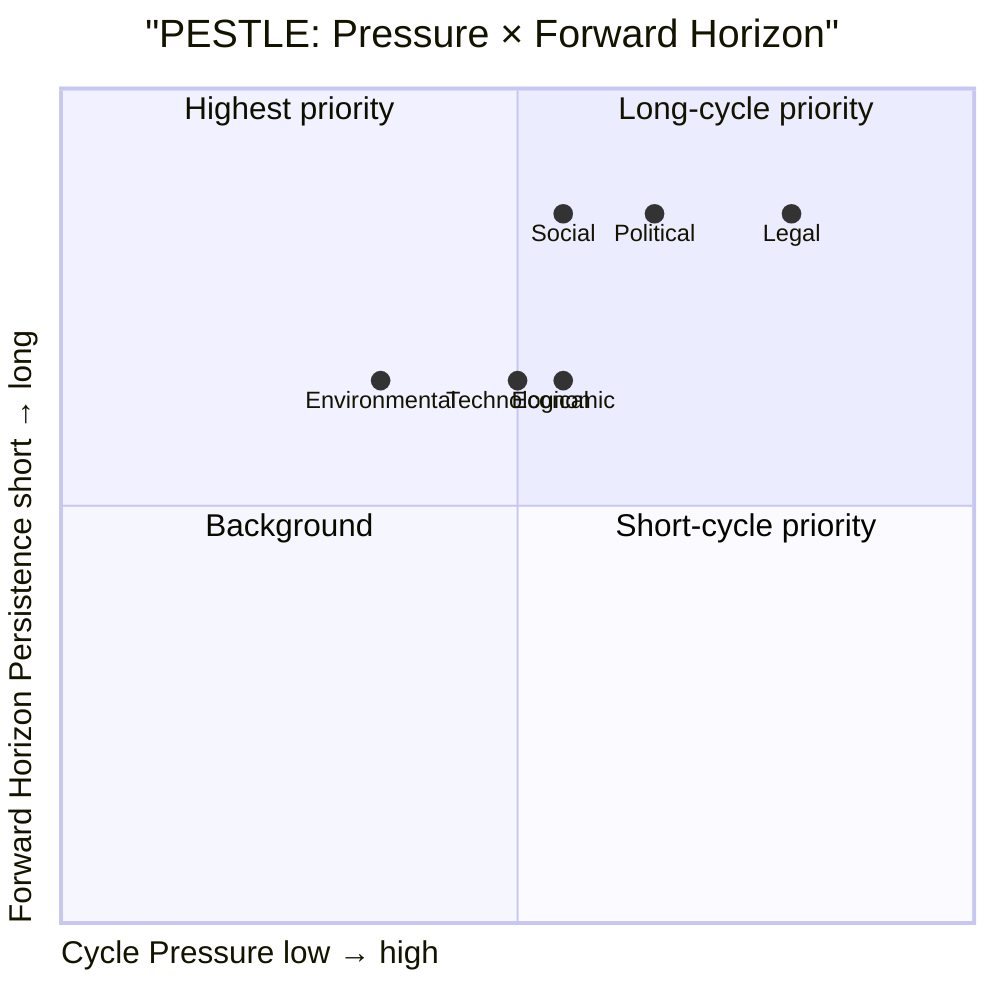

# PESTLE Analysis — 6 Dimensions × Cycle Horizons (LH-4 blocking)

## Frame

PESTLE: Political, Economic, Social, Technological, Legal, Environmental — applied to the Tidö 2022–2026 cycle and forward to the next cycle (2026–2030).

## P — Political

- **Cycle dynamic**: Bloc politics mutated by SD-inclusion; cordon-sanitaire collapsed. M-led coalition with SD as supply contractor + de-facto coalition partner.
- **Cycle pressure (Y4)**: Lagrådet criticism volume escalating; democratic-backsliding narrative gaining EU/CoE traction (F6 frame).
- **Forward (T+1460 horizon)**: Bloc geometry permanently changed. Centrist-bridge formations possible (S+C+L), but durationally fragile (cf. Jan-avtal 2019–2021).
- **Implication**: 2026 election outcome **decisive but not terminal** — coalition geometry will continue to evolve through 2030.

## E — Economic

- **Cycle dynamic**: IMF WEO Apr-2026 NGDP_RPCH 2.1% T+0; GGXWDG_NGDP 32.4% (low EU debt); GGXCNL_NGDP -1.0% (fiscal consolidation tracking); PCPIPCH 2.0–2.5% (price stability); LUR 7.7%.
- **Cycle pressure**: Defence-spend ramp (2.0% → 2.4% GDP) constrains other spending; healthcare/education budget pressure (W1 SWOT).
- **Forward (T+1460)**: IMF central case projects continued debt sustainability; growth recovers to ~ 2.0–2.4% by 2027–2030. Risk: external shock (W5 wildcard) compresses fiscal space.
- **Implication**: economic environment is **net-favourable to incumbents** under central case; downside risk shifts politics.

## S — Social

- **Cycle dynamic**: SOM-trust in government stable mid-band (~ 50–55%); media trust 76% (Reuters Trust Index 2024). Migration-attitudes hardened; security-attitudes politically aligned with cycle.
- **Cycle pressure**: Healthcare-waiting times stress (W1); school-results decline (F3 frame); urban-rural divide reinforcing (V1 swing segment).
- **Forward (T+1460)**: Generational shift (V6 young urban greens growing share); urban-rural divide may further polarise.
- **Implication**: social dimension is **mid-cycle stress factor** with downstream electoral effects.

## T — Technological

- **Cycle dynamic**: e-ID infrastructure (HD03250 2026-05-10 statute); Skatteverket digital-services (HD03261); AI-policy framework lagging behind EU AI Act adoption.
- **Cycle pressure**: AI-generated content + disinfo risks (W3 wildcard); cyber-incident readiness (MSB capacity stress).
- **Forward (T+1460)**: Sweden gov-tech leadership at risk if AI-policy regulatory gap persists; EU AI Act enforcement Q3-2026 onwards.
- **Implication**: technological readiness is **adequate at agency level but uneven at strategic level**.

## L — Legal

- **Cycle dynamic**: Lagrådet critical-opinion volume cycle-cumulative ≥ 60 (high vs prior cycles); KU oversight active; EU-Sweden infraction risk on rule-of-law indicators rising.
- **Cycle pressure**: Y4 statute load exceeds constitutional drafting bandwidth; sunset clauses underused; KU caseload elevated.
- **Forward (T+1460)**: Statute-rationalisation cycle expected post-election; constitutional reform discussions (statute-review queue capacity).
- **Implication**: legal dimension is **most-stressed of the 6** — constitutional-architecture issue carries into next cycle.

## E — Environmental

- **Cycle dynamic**: Energy-transition continued (LKAB hydrogen, off-shore wind permits); EU Fit-for-55 + REPowerEU on track.
- **Cycle pressure**: Energy-cost volatility 2023–2024; energy security tightened post-Ukraine; nuclear-policy reversal toward expansion.
- **Forward (T+1460)**: Energy transition continues; LKAB hydrogen at scale ~ 2030; off-shore wind capacity ramp through 2028.
- **Implication**: environmental dimension is **net-positive** — Sweden retains leadership; cycle-end stable.

## PESTLE Cycle Heatmap

## PESTLE × Horizon Matrix

| Dimension | T+30 | T+90 | T+126 (election) | T+365 | T+1460 |
|-----------|------|------|------------------|-------|--------|
| Political | stable | escalating frames | DECISIVE | new govt | new cycle |
| Economic | IMF flow | SCB Q2 print | macro signal | fiscal consol | trend |
| Social | stable | frame-driven | DECISIVE | post-elect reset | trend |
| Technological | rollout | rollout | continuity | scaling | scaling |
| Legal | KU active | Lagrådet | DECISIVE | rationalisation | reform |
| Environmental | stable | stable | stable | scaling | trend |

## Cycle-End PESTLE Posture

| Dimension | Net Posture | Forward Trajectory |
|-----------|-------------|---------------------|
| Political | Mixed | Worsening |
| Economic | Net positive | Stable to positive |
| Social | Mixed | Worsening |
| Technological | Net positive | Stable to positive |
| Legal | Net negative | Worsening |
| Environmental | Net positive | Net positive |

## Cross-Linkage to Scenario Analysis

- **PESTLE Political + Legal** combined pressure favors **scenario B (R-G-C)** via F6 frame escalation.
- **PESTLE Economic + Environmental** net-positive **favours incumbents** (scenario A weight).
- **PESTLE Social** is the **swing dimension** (V1 segment).

## Sources

- IMF WEO Apr-2026 SWE [A1]
- SOM-institutet 2024–2025 [B2]
- Reuters Trust Index 2024 [B2]
- Lagrådet archive 2022–2026 [A1]
- EU Rule-of-Law Reports 2023–2025 [A2]
- Energimyndigheten energy-transition reports 2024 [A1]
