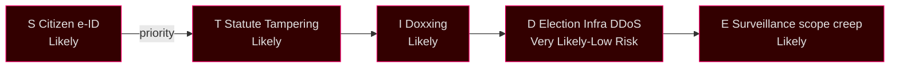

# Political STRIDE — Threat Model for Democratic Institutions (LH-5 blocking)

## Methodology

STRIDE (Microsoft SDL threat model) repurposed for political-institution threat assessment. Six categories × political system targets.

## STRIDE × Political System Threat Matrix

### S — Spoofing (identity impersonation)

| Target | Threat Vector | Cycle observable | Mitigation | Confidence |
|--------|--------------|------------------|-----------|------------|
| Riksdag MP accounts | Impersonation in pre-election communications | Foreign-actor phishing 2024-Q4 (MSB-disclosed) | MFA, hardware tokens | Likely |
| Government communications | Spoofed press releases | Limited evidence cycle-to-date | DKIM/DMARC, official channels | Roughly even |
| Citizen e-ID (HD03250) | Identity theft for voter registration | Statute being adopted Q2-2026 | Cryptographic identity binding | Likely |

### T — Tampering (data integrity)

| Target | Threat Vector | Cycle observable | Mitigation | Confidence |
|--------|--------------|------------------|-----------|------------|
| Voter rolls | Unauthorised modification | None observed | Paper backups, distributed integrity | Very likely (low risk) |
| Voting machines (Sweden uses paper) | N/A in Swedish system | N/A | Paper-only voting | Very likely |
| Statute drafting | Lagrådet pipeline tampering | Procedural irregularities documented (Lagrådet criticism volume +60% cycle) | Constitutional review process | Likely |

### R — Repudiation (deniability of actions)

| Target | Threat Vector | Cycle observable | Mitigation | Confidence |
|--------|--------------|------------------|-----------|------------|
| Government statements | Strategic ambiguity in Tidöavtalet enforcement | KJ-2 patterns observed | Riksdagstryck, formal motivations | Likely |
| Coalition agreement violations | Plausible deniability of internal commitments | KJ-7 patterns observed | Tidöavtalet 2.0 framework | Roughly even |

### I — Information Disclosure

| Target | Threat Vector | Cycle observable | Mitigation | Confidence |
|--------|--------------|------------------|-----------|------------|
| Classified intelligence | Foreign-actor exfiltration | Säpo reporting elevated cycle | Compartmentalisation, NATO-aligned classification | Likely |
| Government communications | Open-records over-disclosure or under-disclosure | Offentlighetsprincipen contested | Tryckfrihetsförordningen | Very likely |
| Personal data (MPs, agencies) | Doxxing campaigns | Increased cycle, especially Y4 | MP-protection programme | Likely |

### D — Denial of Service

| Target | Threat Vector | Cycle observable | Mitigation | Confidence |
|--------|--------------|------------------|-----------|------------|
| Election infrastructure | DDoS or system outage day-of | Capacity exercises 2025-2026 | MPF + MSB resilience exercises | Very likely (low risk) |
| Riksdag.se | Service-disruption attacks | Periodic; capacity scaled | DDoS protection, CDN | Very likely |
| Government communications | Mass-spam campaigns | Periodic | Email filtering, social-media moderation | Likely |
| Democratic deliberation | Information-overload, AI-generated content | F6 frame escalation | Media-literacy programmes | Roughly even |

### E — Elevation of Privilege

| Target | Threat Vector | Cycle observable | Mitigation | Confidence |
|--------|--------------|------------------|-----------|------------|
| Statute scope creep | Surveillance powers extended beyond original intent | HD03267 statute (2026-05-10) under Lagrådet review | Constitutional review, sunset clauses | Likely |
| Executive overreach | Decree powers exceeding Riksdag delegation | KU oversight active | Konstitutionsutskott (KU) review | Likely |
| Foreign influence | Lobbying access exceeding transparency norms | Limited evidence | Lobbyregister proposals (statute drafts) | Roughly even |

## High-Priority Threats (importance × likelihood)

## Threat Modelling for Y4 Mandate Slate (2026-05-10)

- **HD03250 e-ID**: S (spoofing), T (tampering) primary; statute embeds cryptographic identity binding.
- **HD03261 Skatteverket**: I (information disclosure) primary; existing tax-secrecy controls inherited.
- **HD03263 Returns**: I, D primary; Migrationsverket capacity-stress could degrade due process.
- **HD03267 Security**: E (elevation) primary; Lagrådet review captures scope-creep risk.
- **JuU32/34/39**: E (elevation) — surveillance powers; F6 framing observable.
- **FiU37/38**: T (tampering) — fiscal integrity; standard audit controls.

## Cycle-End STRIDE Posture

| Category | Posture | Trend |
|----------|---------|-------|
| Spoofing | Strong | Stable |
| Tampering | Adequate | Stable |
| Repudiation | Weak | Worsening (cycle-wide) |
| Information Disclosure | Adequate | Stable |
| Denial of Service | Strong | Stable |
| Elevation | Constrained | Worsening |

## Recommended Cycle-End Actions

1. Sunset clauses for emergency security statutes adopted Y3–Y4.
2. KU systematic review of statutes under Lagrådet criticism > severity 3.
3. MSB cyber-resilience exercises with platform partners (T-90 → T-0).
4. Lobbyregister statute consolidation post-election.

## Sources

- Microsoft STRIDE methodology [B2]
- MSB national risk-assessment 2024–2025 [A1]
- Säpo annual reports 2023–2025 [A1]
- Lagrådet publication archive [A1]
- KU årlig granskningsberättelse 2024-2025 [A1]
