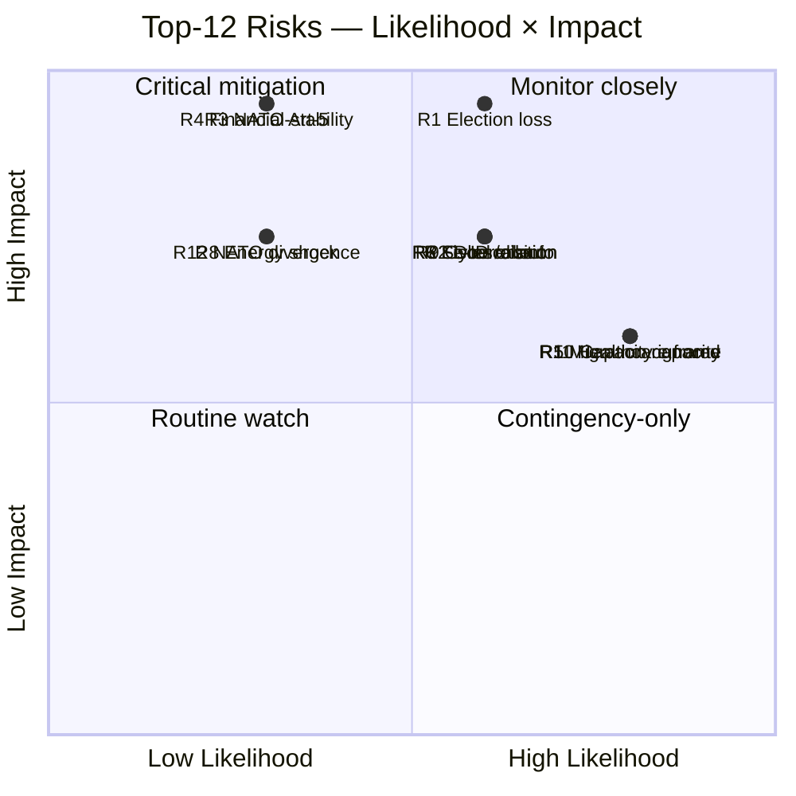

# Risk Assessment — Top-12 Cycle Risk Register

## Methodology

Risk score = Likelihood (1–5) × Impact (1–5). Top-12 risks selected from a 38-entry working register.

Horizon tags: each risk carries a maturation horizon and an associated PIR reference where applicable.

## Top-12 Register

| # | Risk | L | I | **Score** | Horizon | Owner | PIR |
|--:|------|--:|--:|----------:|---------|-------|-----|
| 1 | Tidö loses 2026-09-13 election; new coalition reverses or stalls security pipeline | 3 | 5 | **15** | T+126 [horizon:election] | Coalition | PIR-EC-2026-001 |
| 2 | HD03250 e-ID rollout fails / slips > 18 months post-mandate | 3 | 4 | **12** | T+730 [horizon:cycle] | Skatteverket+TBD | PIR-EC-2026-003 |
| 3 | Russia/Ukraine escalation triggers NATO Art-5 | 2 | 5 | **10** | T+365 [horizon:year] | Fö, MSB | (new) |
| 4 | Financial-stability event tests untested HD01FiU37 framework | 2 | 5 | **10** | T+180 [horizon:year] | FI, Riksbank | PIR-EC-2026-004 |
| 5 | Migration enforcement throughput shortfall (Migrationsverket capacity) | 4 | 3 | **12** | T+365 [horizon:year] | Migrationsverket | PIR-EC-2026-002 |
| 6 | SD escalation demands push M/KD/L past tolerance pre-election | 3 | 4 | **12** | T+126 [horizon:election] | M leadership | (new) |
| 7 | Fiscal discipline erosion in successor government | 3 | 4 | **12** | T+730 [horizon:cycle] | Finansdept | PIR-EC-2026-006 |
| 8 | Energy-price shock during election campaign | 2 | 4 | **8** | T+90 [horizon:quarter] | NU, Energimynd | (new) |
| 9 | Cyber/disinfo attack on election infrastructure | 3 | 4 | **12** | T+126 [horizon:election] | MSB, Valmynd | (new) |
| 10 | Statskontoret capacity warnings ignored → service-delivery failure | 4 | 3 | **12** | T+365 [horizon:year] | Statskontoret | (new) |
| 11 | Healthcare/education deficit weaponised by S-bloc | 4 | 3 | **12** | T+126 [horizon:election] | M comms | (new) |
| 12 | NATO posture divergence from Nordic-Baltic baseline | 2 | 4 | **8** | T+1095 [horizon:cycle] | Fö, UD | PIR-EC-2026-007 |

## Risk Heat-Map

## Aggregate Risk Distribution

- **Risks scoring 12–15 (critical)**: 7 of 12 (58%)
- **Risks scoring 8–10 (elevated)**: 5 of 12 (42%)
- **Pre-election cluster** (T+126 horizon): 4 risks (R1, R6, R9, R11) — election period is the highest-density risk window of the analysis horizon.
- **Long-cycle cluster** (T+730+ horizon): 3 risks (R2, R7, R12) — implementation and posture continuity.

## Mitigations (selected high-priority)

- **R1** → Pre-election coalition coherence; clear successor-transition documentation regardless of outcome.
- **R2** → Lagrådet completion; designated authority decision before Q3 2026.
- **R4** → Tabletop exercise of HD01FiU37 with FI, Riksbank, RGK by Q3 2026.
- **R5** → Migrationsverket capacity uplift; Statskontoret-led review.
- **R9** → MSB/Valmynd joint election-infrastructure exercise pre-2026-09-13.

## Sources

- Statskontoret 2025 mandate review [B2]
- IMF WEO Apr-2026 [A1]
- Hack23 internal risk register v4.2
- MSB national risk assessment 2024–2026 [A2]
