# Scenario Analysis — 4 Scenarios + 5 Wildcards (Election-Cycle Branching)

## Branching Rule (Election-Cycle Tier)

Election-cycle scope requires **4 scenarios × 3 coalition branches + 5 wildcards = 17 leaves** (election-cycle scenario tree). Mass-weighted to ~95% baseline + ~5% wildcards.

Probabilities anchored on SCB PSU Q1-2026 + Tidö-bloc / opposition-bloc midpoint within ±3 pp.

## Scenarios

### Scenario A — Tidö Continuation (32% probability, [horizon:election])
M+KD+L retain Riksdag with SD external support. Implementation focus: e-ID rollout, Nordic-Baltic security framework operationalisation, healthcare/education catch-up package.
**Branches**:
- A1 — Stable continuation (60% of A): policy pipeline executes as planned.
- A2 — SD demands coalition entry (30% of A): coalition negotiation extends into Q4-2026; some L attrition.
- A3 — Minority Tidö with case-by-case support (10% of A): legislative pace halves.

### Scenario B — S-Bloc Victory (38% probability, [horizon:election])
S+V+MP+C alliance. Security framework retained but slowed. Environment/labour gap is policy lead.
**Branches**:
- B1 — S+V+MP majority (35% of B): ramverk pressure visible Y2.
- B2 — S+C+MP centrist (50% of B): ramverk preserved; security-framework modifications minor.
- B3 — S minority + case-by-case (15% of B): legislative throughput low.

### Scenario C — Rainbow / Cross-Bloc (18% probability, [horizon:election])
M+S grand coalition or S+C bridge under no-confidence vote 2027–2028. Triggered if A1/B1/B2 fail to form viable government.
**Branches**:
- C1 — M+S grand coalition (40% of C): Tidöavtalet succeeded by Mitt-avtal.
- C2 — S+C+L technocratic (40% of C): security-policy continuity.
- C3 — Caretaker → re-election Spring 2027 (20% of C).

### Scenario D — Minority / Hung Riksdag (12% probability, [horizon:election])
No 175-seat majority pathway materialises. Caretaker → expanded inquiry → possible re-vote.
**Branches**:
- D1 — Old government continues as caretaker > 6 months (50% of D).
- D2 — Statsministeromröstning fails 4 times → snap election (30% of D).
- D3 — Talman-brokered narrow minority (20% of D).

## Wildcards (5%, mass-weighted)

### W1 — NATO Art-5 Triggered (1% probability, [horizon:cycle])
Russian/Belarusian incident invokes NATO Art-5. All other scenarios reshape: defence spending → 3% GDP, emergency legislation pipeline, election-postponement debate (constitutional rarity).

### W2 — Major Financial-Stability Event (1.5%, [horizon:year])
Banking crisis or pension-system stress tests HD01FiU37 framework. Election-year narrative pivots to fiscal competence.

### W3 — Critical Infrastructure Cyber-Attack (1%, [horizon:election])
Election-day disruption against Valmynd or SVT election-night coverage. Constitutional response: postponement + recount procedures.

### W4 — Sub-Threshold Wipeout (0.8%, [horizon:election])
Two of (L, MP, V, KD, C) fall below 4% threshold simultaneously. Coalition arithmetic re-shapes regardless of bloc winning.

### W5 — Coalition Collapse Pre-Election (0.7%, [horizon:quarter])
L withdraws from Tidö in Q2-Q3 2026. Caretaker through election. Narrative loss for M; S-bloc favourite.

## Scenario Tree Diagram

```mermaid
graph TD
  R[2026-09-13 Election]
  R --> A[A Tidö 32%]:::s1
  R --> B[B S-bloc 38%]:::s2
  R --> C[C Rainbow 18%]:::s3
  R --> D[D Minority 12%]:::s4
  R --> W[Wildcards 5%]:::w
  A --> A1[A1 Stable 60%]
  A --> A2[A2 SD entry 30%]
  A --> A3[A3 Minority 10%]
  B --> B1[B1 S+V+MP 35%]
  B --> B2[B2 S+C+MP 50%]
  B --> B3[B3 S minority 15%]
  C --> C1[C1 M+S 40%]
  C --> C2[C2 S+C+L 40%]
  C --> C3[C3 Re-election 20%]
  D --> D1[D1 Caretaker 50%]
  D --> D2[D2 Snap 30%]
  D --> D3[D3 Narrow 20%]
  W --> W1[W1 NATO Art-5]
  W --> W2[W2 Fin stability]
  W --> W3[W3 Cyber]
  W --> W4[W4 Sub-threshold]
  W --> W5[W5 Collapse pre-elect]
  classDef s1 fill:#003322,stroke:#00d9ff,color:#e0e0e0
  classDef s2 fill:#220033,stroke:#ff006e,color:#e0e0e0
  classDef s3 fill:#332200,stroke:#ffbe0b,color:#e0e0e0
  classDef s4 fill:#330011,stroke:#ff006e,color:#e0e0e0
  classDef w fill:#000022,stroke:#00d9ff,color:#e0e0e0
```

## Triggers / Threshold Tests

- **Q3 2026 PSU shift > 4 pp** toward opposition → recalibrate A vs B baseline weights.
- **L sub-4% in three consecutive polls** → activate W4 contingency planning.
- **Russian-Ukraine ceasefire announcement** → recalibrate W1 downward to 0.3%.
- **Banking-stress indicator** (Riksbank quarterly stability report) → activate W2 contingency.

## Sources

- SCB PSU Q1-2026 [A1]
- SVT Valu / Novus / Sifo / Ipsos polling 2025–2026 [B2]
- IMF WEO Apr-2026 [A1]
- MSB national risk assessment 2024–2026 [A2]
- Riksdagsutredningen procedural manual [A1]
