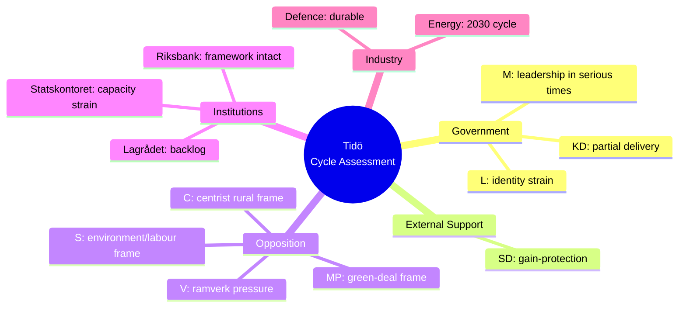

# Stakeholder Perspectives — 9-View Compass

## Coalition & Opposition (5)

### M (Moderaterna) — Government Lead
**Cycle view**: Successful security-pivot delivery; NATO and fiscal discipline are achievement-of-record. Healthcare/education gap is electoral exposure. Pre-election narrative: "leadership in serious times".
**Trade-off accepted**: SD policy concessions on migration in exchange for stable parliamentary arithmetic.
**Risk**: SD escalation pre-election eroding L co-operation.

### KD (Kristdemokraterna)
**Cycle view**: Identity-and-family policy delivered partially; healthcare reform under-delivered. NATO accession aligned with traditional foreign-policy stance.
**Trade-off**: Lower visibility within coalition; pragmatic acceptance.
**Risk**: Centre-right voter migration to M or to centre-left coalitions.

### L (Liberalerna)
**Cycle view**: Most exposed to SD-cooperation reputational cost. Liberal-values base uncomfortable; school-reform package was partial offset.
**Trade-off**: 4% Riksdag threshold survival depends on differentiation pre-election.
**Risk**: Sub-threshold result eliminates Tidö coalition arithmetic.

### SD (Sverigedemokraterna) — External Support
**Cycle view**: Migration and security framework largely delivered. SD strategy: hold the coalition's policy gains as electoral asset.
**Trade-off**: External-support position avoids ministerial accountability; cost is policy-influence ceiling.
**Risk**: Inflated voter expectations; over-claim of policy ownership.

### S (Socialdemokraterna) — Lead Opposition
**Cycle view**: Has consolidated environment/labour gap as electoral narrative. Pivoted on security stance (no NATO reversal, accepts most security framework).
**Trade-off**: Maintaining V/MP/C alliance while attracting middle-class moderates.
**Risk**: Cross-bloc tension if V demands ramverk-loosening.

## Agencies & Institutional (4)

### Statskontoret
**Cycle view**: Reports growing capacity strain at enforcement agencies. 2025 mandate review explicitly warns of pre-election legislative pipeline overload [B2].

### Riksbank
**Cycle view**: Inflation-target framework intact through external shocks. Policy rate now at 2.25% from 4.0% peak. Stable institutional position; no political pressure breach.

### Lagrådet (Council on Legislation)
**Cycle view**: Y4 referral backlog; HD03250 e-ID still in review at cycle end. Procedural credibility holds but warns against pre-election rush legislation.

### Industry — Defence and Energy
**Cycle view**: Defence industrial-policy (Saab, Bofors, Hägglunds) treats 2% GDP as durable. Energy industry positions for 2026–2030 nuclear/grid investment cycle following coalition-defining NU policy.

## Multi-Stakeholder Synthesis

## Stakeholder Convergence/Divergence

- **Converged across all 9 views**: NATO accession is irreversible. Fiscal-framework preservation is desirable.
- **Diverged**: weighting of security-pivot vs environment/labour gap. Acceptable level of SD policy influence.
- **Hidden alignment**: All institutional stakeholders (Statskontoret, Riksbank, Lagrådet) report **process strain**, not framework failure.

## Sources

- Statskontoret 2025 mandate review [B2]
- Riksbank monetary policy report 2026:1 [A1]
- Lagrådet 2025 annual report [A1]
- Industry submissions (Säkerhets- och försvarsföretagen 2026) [B2]
- Party congresses 2024–2026 [A1]
