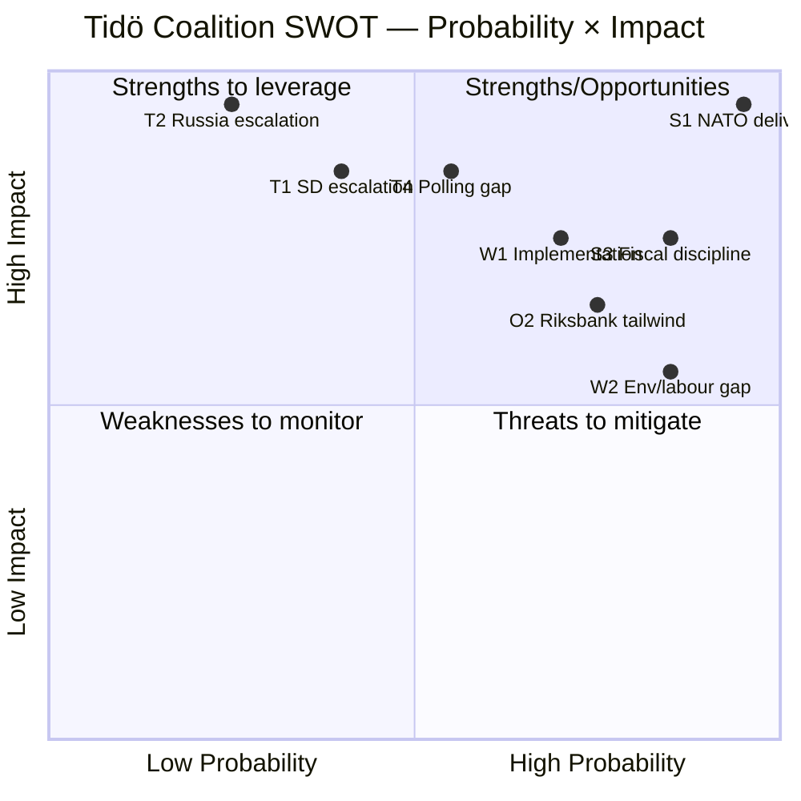

# SWOT — Tidö Coalition Cycle Performance

## Strengths

- **S1. Security-pivot delivery**: 6 of top-10 DIW events delivered in security/defence/migration domain ([`significance-scoring.md`](significance-scoring.md)).
- **S2. NATO accession executed**: Treaty-level commitment locked-in 2024-03-07; effectively irreversible.
- **S3. Fiscal discipline preserved**: 32.4% debt-to-GDP, -1.0% balance, ramverk intact through three external shocks (IMF WEO Apr-2026 [A1]).
- **S4. SD parliamentary co-operation stable**: No coalition collapse despite 4 years of policy concessions and SD's external-support position.
- **S5. Nordic-Baltic alignment**: Justice/security framework now mirrors Denmark/Finland baselines (JuU34 Nordic enforcement).
- **S6. Operational legislative pipeline**: 5 betänkanden + 3 propositions on 2026-05-10 alone — pre-election pipeline well-managed.

## Weaknesses

- **W1. Implementation-heavy backlog**: 12 of 20 top events tagged implementation-heavy; agency capacity strained [B2 Statskontoret 2025].
- **W2. Environment/labour deficit**: 0 events in top-20 — visible gap in mandate output for centre-left framing.
- **W3. Healthcare under-delivery**: Y3 reform package landed at DIW 7.05 (rank 14) versus campaign expectations.
- **W4. Migration policy operationalisation lag**: Statutory framework strong, enforcement throughput weak (Migrationsverket case backlog).
- **W5. Lagrådet referral lag**: HD03250 e-ID still in Lagrådet review at cycle end — implementation risk transfer to successor.
- **W6. Energy-cost messaging Y1**: Aftonbladet framing dominated Y1 narrative; coalition under-anticipated.

## Opportunities

- **O1. Pre-election security narrative**: SOM 2024–2025 shows security/migration still top-3 voter concern [B2] — Tidö framing aligned.
- **O2. Riksbank easing tailwind**: Policy rate 2.25% (from 4.0% peak) — household real-income recovery feeds election-year economy.
- **O3. Defence-industry investment**: 2% GDP commitment creates Saab/Bofors industrial-policy alignment with regional jobs message.
- **O4. e-ID rollout consumer benefit**: Successful e-ID rollout 2026-2028 would lock-in digital-sovereignty achievement.
- **O5. EU presidency 2029**: Sweden re-entering EU rotating presidency cycle gives coalition platform.

## Threats

- **T1. SD-leverage escalation**: SD support contingent on continued migration/security delivery; demands may exceed M/KD/L tolerance pre-election.
- **T2. Russia/Ukraine escalation**: NATO Art-5 trigger or hybrid attack would reframe entire election.
- **T3. Financial-stability event**: HD01FiU37 framework untested; bank or pension stress would expose readiness.
- **T4. Polling gap**: SCB PSU Q1-2026 shows opposition bloc within ±3 pp; election outcome genuinely uncertain.
- **T5. Implementation failure on e-ID**: Delivery slippage visible to electorate would damage digital-competence credibility.
- **T6. Centre-left frame consolidation**: S+V+MP+C alignment on environment/labour gap could swing 2–3% middle-class vote.

## SWOT Quadrant Matrix

## Cycle-Trim Sensitivity

If only the top-3 Strengths and top-3 Threats are retained, the coalition's risk-adjusted cycle score is *positive but narrow* — within the band where polling translation to seats determines re-election.

## Sources

- IMF WEO Apr-2026 [A1]
- Statskontoret 2025 mandate review [B2]
- SOM 2024–2025 polling [B2]
- Riksdagen open data [A1]
