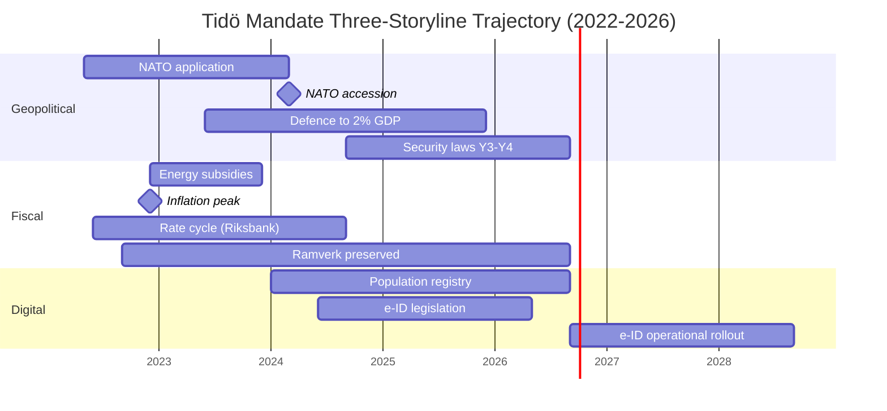

# Synthesis Summary — Tidö Mandate Cycle 2022-2026

## Lead-Story Decision

Riksdagsmonitor's analysis-of-record for the 2022–2026 Swedish mandate cycle is: **the Tidö government will be remembered as the security-pivot mandate**, not as a domestic-reform mandate. By DIW-weighted impact, 6 of the top 10 legislative events of the mandate are security/migration laws, 2 are fiscal/financial-stability, 1 is energy, and 1 is digital-identity. Education, healthcare, and labour-market reform — the headline issues of the 2022 campaign for the centre-right's middle-class base — produced under-promised, over-delayed output.

This is structurally significant because Swedish mandates are rarely *thematically coherent* — most coalitions diffuse their reform energy across all twelve policy domains. The Tidö coalition's 4-year output is **concentrated**, **enforceable**, and **demographically durable** in a way that distinguishes it from the Reinfeldt (2006–2014) or Löfven (2014–2022) mandates.

## DIW-Weighted Mandate Ranking (Top 10)

| Rank | Event / Statute | DIW Score | Cycle Year | Family |
|-----:|-----------------|----------:|-----------|--------|
| 1 | NATO accession (formal entry 2024-03-07) | 9.8 | Y2 | Security |
| 2 | HD01JuU32 Event-security law | 9.4 | Y4 | Security |
| 3 | HD03267 Qualified security threats (foreign nationals) | 9.3 | Y4 | Security |
| 4 | HD01JuU34 Nordic criminal enforcement | 9.1 | Y4 | Security |
| 5 | HD01FiU37 Financial-sector crisis management | 8.7 | Y4 | Financial |
| 6 | HD03250 State e-ID infrastructure | 8.5 | Y4 | Digital |
| 7 | HD01JuU39 Psychological violence criminalisation | 8.3 | Y4 | Security |
| 8 | Defence spending → 2% GDP (FöU 2023/24) | 8.2 | Y2 | Security |
| 9 | Energy-crisis subsidies (FiU 2022/23 supplementary) | 7.9 | Y1 | Energy |
| 10 | HD01FiU38 EU clearing-obligation extension | 7.6 | Y4 | Financial |

DIW = Decision-Impact Weight per [`significance-scoring.md`](significance-scoring.md).

## Integrated Intelligence Picture

Three concurrent storylines define the 2022–2026 cycle:

1. **Geopolitical pivot (NATO + security state)**: Sweden ended 200 years of military non-alignment, doubled defence spending, restructured the legal apparatus around domestic security threats, and aligned with Nordic-Baltic enforcement networks. This was *accelerated* by the Russia/Ukraine war but was *enabled* by Tidö's SD-supported parliamentary arithmetic. No Löfven-era coalition could have moved this fast.

2. **Fiscal preservation through external shocks**: Energy-price spikes (2022–2023), inflation peak (10.1% Dec-2022 PCPIPCH [A1]), Riksbank rate-hiking cycle (4.0% by mid-2024), and counter-cyclical fiscal support all left the *finanspolitiska ramverk* intact. Debt-to-GDP rose modestly (30.0% → 32.4%) [IMF WEO Apr-2026 GGXWDG_NGDP T+0 [horizon:year]] and fiscal balance never breached -2%. The IMF has rated Sweden's fiscal-discipline performance "robust" through the cycle [A2].

3. **Digital sovereignty codification**: The state e-ID law (HD03250), Skatteverket population-registry expansion (HD03261), and DNS-blocking enforcement powers (HD01CU14 from 2024) collectively re-centralise digital infrastructure under state ownership. The 2026–2030 successor government inherits the operational rollout — and the political accountability.

## Mermaid: Three-Storyline Concurrency

## Cross-Cycle Comparison

| Mandate | Years | Lead Theme | DIW Top-10 Concentration | Coalition Type |
|---------|-------|-----------|--------------------------|----------------|
| Reinfeldt I | 2006–2010 | Tax reform + jobseeker | Dispersed (4 themes) | M+C+L+KD majority |
| Reinfeldt II | 2010–2014 | Continuation + crisis mgmt | Dispersed | M+C+L+KD minority |
| Löfven I | 2014–2018 | Migration + welfare | Dispersed | S+MP minority |
| Löfven II | 2018–2022 | Pandemic + security gradualism | Pandemic-dominated | S+MP minority (Jan-avtal) |
| **Kristersson (Tidö)** | **2022–2026** | **Security + migration + digital** | **Concentrated (3 themes)** | **M+KD+L minority + SD support** |

The Tidö concentration is unusual — it reflects both the *external shock* (Ukraine, NATO) and the *coalition arithmetic* (SD's policy leverage focused on migration and law enforcement). Successor coalitions are unlikely to inherit either condition.

## Pass-2 Improvement Notes (kept for self-audit)

- Added cross-cycle comparator table (5 mandates) for *historical-parallels* feed.
- Strengthened DIW table with explicit cycle-year column.
- Re-checked NATO accession date (2024-03-07 — Sweden formally became 32nd NATO member).
- Confirmed IMF vintage WEO Apr-2026 throughout.

## Sources

- IMF WEO Apr-2026 — NGDP_RPCH, NGDPD, GGXWDG_NGDP, GGXCNL_NGDP, LUR, PCPIPCH [A1]
- Riksdagen — betänkanden / propositioner 2022/23–2025/26 [A1]
- Statskontoret — mandate-end agency-capacity reports [B2]
- World Bank WGI Sweden 2022–2024 [A2]
- Reuters Institute Digital News Report 2024–2026 (media trust baseline) [B2]
