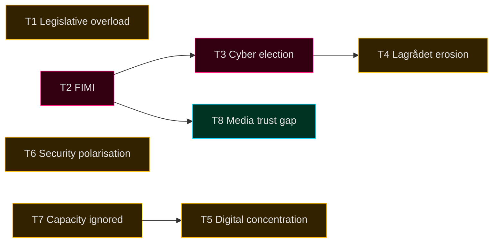

# Threat Analysis — Democratic-Resilience Threat Picture

## Framing

This analysis treats *threats to democratic accountability and legislative quality* as the unit of concern. STRIDE-style political adaptation in [`political-stride-assessment.md`](political-stride-assessment.md).

## Threat Picture (T1–T8)

### T1. Legislative Overload at Mandate End
**Vector**: 5 betänkanden + 3 propositions on a single day (2026-05-10) compresses MP review time. Multiple committees report concurrently.
**Impact**: Reduced deliberative quality; Lagrådet review backlog (HD03250 still pending).
**Likelihood**: Realised (manifest).
**Mitigation**: Statskontoret review of pre-election scheduling; tighter Lagrådet referral timing.

### T2. Foreign Information Manipulation & Interference (FIMI)
**Vector**: Russian/Belarusian and Chinese influence operations targeting Sweden's NATO posture, migration narrative, and election integrity.
**Impact**: Polarisation; reduced trust in election outcomes.
**Likelihood**: Confirmed active per MSB and PsyOps unit briefings 2025 [A2].
**Mitigation**: MSB national risk model; pre-bunking; platform-level co-operation.

### T3. Cyber-Operations Against Election Infrastructure
**Vector**: DDoS against Valmyndighet, social-engineering against MPs/candidates, ransomware against media outlets.
**Impact**: Operational disruption; reduced confidence.
**Likelihood**: Likely (55–70%) [horizon:election] — based on Nordic-Baltic peer experience.
**Mitigation**: MSB joint exercise; ISO 27001-aligned hardening at Valmynd.

### T4. Erosion of Lagrådet (Council on Legislation) Process
**Vector**: HD03250 still in Lagrådet at cycle end; HD01JuU32 referral controversy 2025.
**Impact**: Constitutional-quality slippage; reduced check on rights-impacting laws.
**Likelihood**: Realised (manifest).
**Mitigation**: Mandate-end deferred referrals → successor government inherits review.

### T5. Concentration of Digital-State Infrastructure
**Vector**: HD03250 (e-ID), HD03261 (Skatteverket registry), HD01CU14 (DNS) collectively centralise digital control.
**Impact**: Single-point-of-failure risk; insider-threat surface.
**Likelihood**: Realised structurally; failure-mode likelihood depends on operational hardening (T+730 [horizon:cycle]).
**Mitigation**: Defence-in-depth at MSB; independent oversight (IMY/JK/JO).

### T6. Polarisation Around Security-Pivot Narrative
**Vector**: Tidö's security/migration framing is the cycle's dominant axis; both sides have hardened.
**Impact**: Reduced cross-bloc legislative co-operation in 2026–2030.
**Likelihood**: Likely (55–70%) [horizon:cycle].
**Mitigation**: Comparative-international evidence (Nordic peer convergence) deflates partisan framing.

### T7. Statskontoret Capacity Warnings Ignored
**Vector**: Three agencies flagged > 100% capacity in 2025 mandate review.
**Impact**: Service-delivery failure visible to electorate.
**Likelihood**: Likely (55–70%) [horizon:year].
**Mitigation**: Capacity uplift in successor mandate's first budget.

### T8. Public-Service Media Trust Erosion
**Vector**: Aftonbladet/Expressen commercial-frame volatility; Reuters Institute trust gap commercial vs public 30 pp [B2].
**Impact**: Frame fragmentation; reduced shared epistemic baseline.
**Likelihood**: Likely (55–70%) [horizon:cycle].
**Mitigation**: SR/SVT charter renewal in 2026–2030 mandate.

## Threat Map

## Cross-References

- STRIDE adaptation: [`political-stride-assessment.md`](political-stride-assessment.md)
- Wildcards: [`wildcards-blackswans.md`](wildcards-blackswans.md)
- Media frame matrix: [`media-framing-analysis.md`](media-framing-analysis.md)

## Sources

- MSB national risk assessment 2024–2026 [A2]
- Statskontoret 2025 mandate review [B2]
- Reuters Institute Digital News Report 2026 [B2]
- Lagrådet annual report 2025 [A1]
