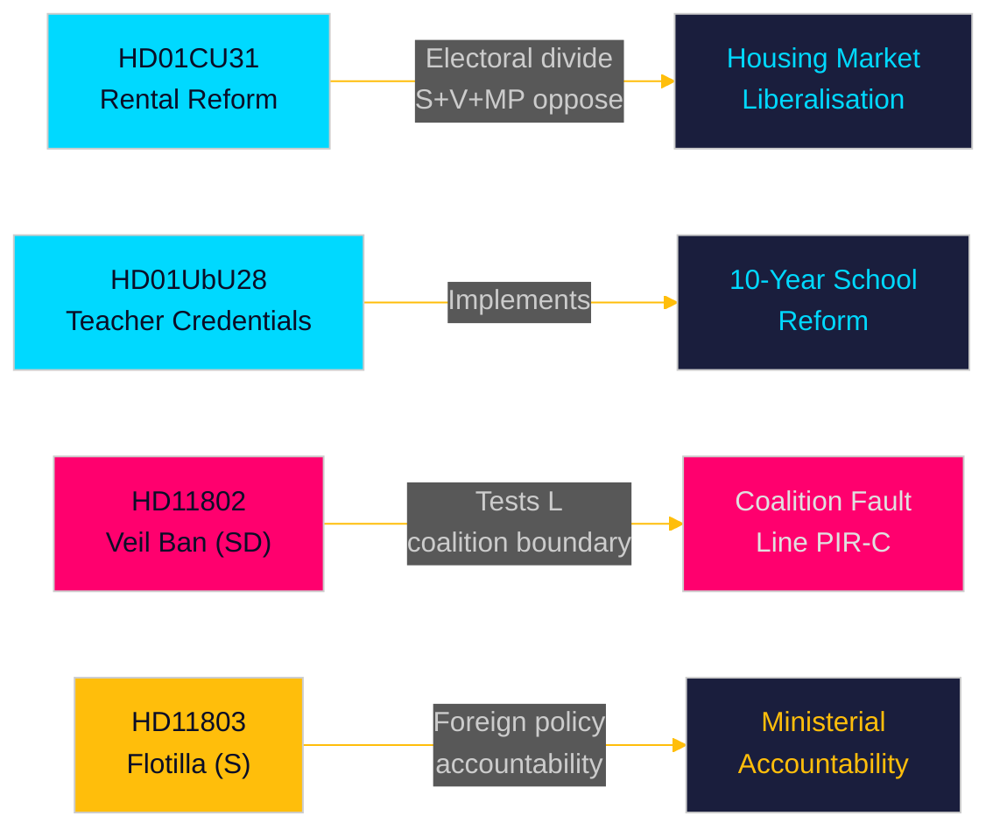
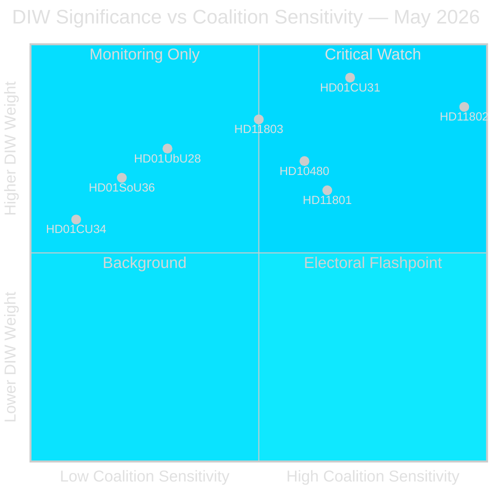
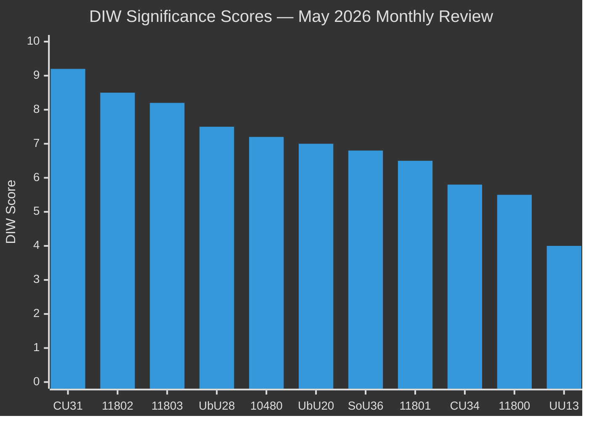
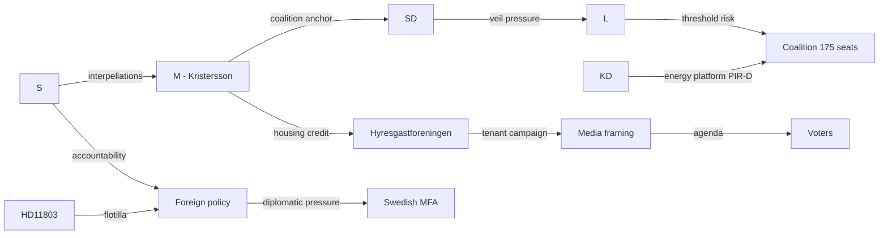
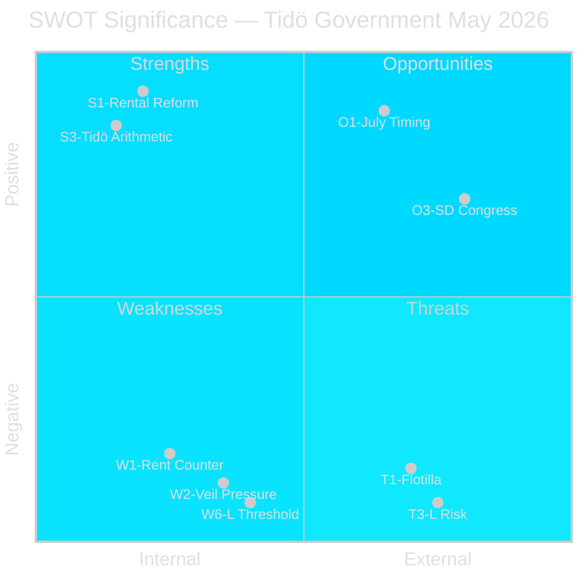
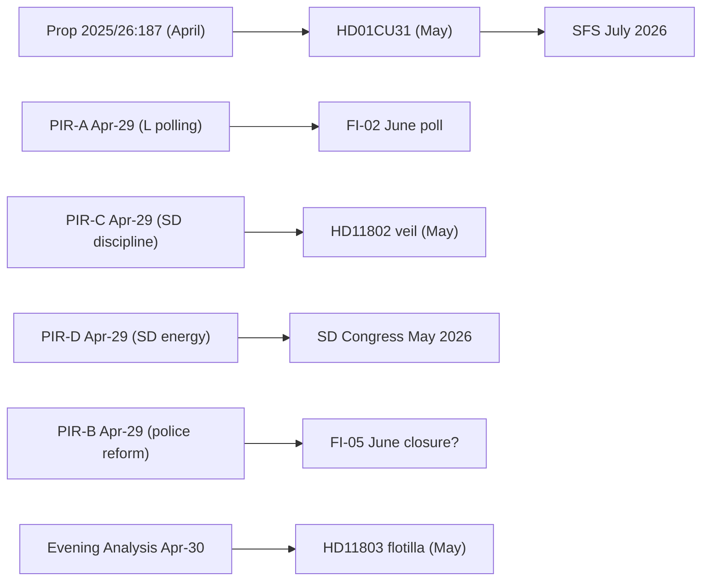

## Executive Brief
<!-- source: executive-brief.md :: https://github.com/Hack23/riksdagsmonitor/blob/main/analysis/daily/2026-05-10/monthly-review/executive-brief.md -->

**Coverage window**: 2026-04-10 → 2026-05-10 (riksmöte 2025/26, 30-day window)  
**Days to election**: 126 (2026-09-13)

---

### BLUF (Bottom Line Up Front)

The May 2026 monthly window reveals a Tidö government racing to deliver structural legislative reforms in the final parliamentary sprint before the September election. The **rental market liberalisation** (HD01CU31, effective 2026-07-01) is the month's highest-impact reform — a new private rental law and revised block-rental model that will reshape Sweden's housing market and sharpen the left-right electoral divide. Simultaneously, **teacher credential reform** (HD01UbU28) and **school transparency rules** (HD01UbU20) advance the 10-year primary school implementation. The month also exposes three accountability flashpoints: the **Israel–Gaza flotilla interception** (HD11803) targeting Swedish citizens, the SD coalition boundary-test (HD11802 on full-face veil ban demanding L alignment), and **rural infrastructure abandonment** (HD11801 — Trafikverket removing 25,000 street lights). PIR-D (SD–KD energy divergence) and PIR-C (SD congress) are the primary intelligence collection priorities for this cycle.

### Decisions Supported by This Brief

1. **Housing market framing**: Is HD01CU31 a decisive Tidö housing-market deliverable or an electoral liability with S+V+MP opposition plus housing-shortage concerns?
2. **Coalition boundary**: Does SD's HD11802 (veil ban demand) pressure L's social-liberal profile in the final 126 days before election — and does this create an L threshold-risk escalation?
3. **Foreign policy exposure**: Does Israel's interception of the Global Sumud Flotilla (HD11803, Swedish citizens aboard) create sustained Foreign Affairs committee pressure on Minister Malmer Stenergard?

### 60-Second Read

- 🏠 **Rental market** (HD01CU31): New private rental law + liberalised block-rental model approved by CU. S+V+MP filed 5 reservations. Effective 2026-07-01. This is the Tidö government's landmark housing-market reform. [A1]
- 🏫 **Schools** (HD01UbU28 + HD01UbU20): Teacher credential rules for 10-year primary school, plus public access principle relief for small private schools. Both advance the HC01UbU17 school reform agenda. [A1]
- 🌍 **Flotilla** (HD11803): S question to Foreign Minister on Israel's interception of Swedish-citizen-bearing Global Sumud Flotilla. Ministerial response required. Foreign policy accountability pressure. [A1]
- 🧕 **Veil ban** (HD11802): SD formally presses L Integration Minister Mohamsson on full-face veil ban implementation — testing coalition discipline on identity politics. [A1]
- 💡 **Rural lighting** (HD11801): V question on Trafikverket removing 25,000 street lights in rural areas. KD infrastructure minister in the hot seat. [A1]
- 💼 **Tax residency** (HD10480): S interpellation on "stadigvarande vistelse" definition delay since Oct 2025. Finance Minister Svantesson faces accountability on corporate mobility rules. [A1]
- ⚖️ **Enforcement** (HD01CU34): Civil enforcement law reform — remote attachment procedures modernised. [A1]
- 🌐 **IPU** (HD01UU13): Inter-Parliamentary Union activities endorsed. [A1]

### Top Forward Trigger

**FI-01 (PIR-C/D)**: SD congress energy platform adoption outcome and post-congress coalition positioning — the single most consequential forward indicator for coalition stability and September 2026 election scenarios. **Watch by**: 2026-05-25.

### Confidence Label

Overall confidence: **HIGH [A1–B2]** — Betänkanden text directly retrieved (A1); interpellation/question summaries retrieved (A1); SD congress outcome inferred from prior PIR context (B2 — collected but unconfirmed as of 2026-05-10).



## Reader Intelligence Guide

Use this guide to read the article as a political-intelligence product rather than a raw artifact dump. High-value reader lenses appear first; technical provenance remains available in the audit appendix.

| Icon | Reader need | What you'll get |
|---|---|---|
| 📊 | [BLUF and editorial decisions](#rm-executive-brief) | fast answer to what happened, why it matters, who is accountable, and the next dated trigger |
| 🧠 | [Synthesis Summary](#rm-synthesis-summary) | evidence-anchored narrative consolidating primary sources into one coherent story line |
| 🎯 | [Key Judgments](#rm-intelligence-assessment--key-judgments) | confidence-bearing political-intelligence conclusions and collection gaps |
| 📈 | [Significance scoring](#rm-significance-scoring) | why this story outranks or trails other same-day parliamentary signals |
| 👥 | [Stakeholder Perspectives](#rm-stakeholder-perspectives) | winners, losers and undecided actors with stake-weighted positions and pressure points |
| 🔢 | [Coalition Mathematics](#rm-coalition-mathematics) | parliamentary arithmetic showing exactly who can pass or block this measure and at what margin |
| 📋 | [Voter Segmentation](#rm-voter-segmentation) | voter-bloc exposure: which demographics gain, lose or shift on this issue |
| 🔭 | [Forward indicators](#rm-forward-indicators) | dated watch items that let readers verify or falsify the assessment later |
| 🔮 | [Scenarios](#rm-scenario-analysis) | alternative outcomes with probabilities, triggers, and warning signs |
| 🗳️ | [Election 2026 Analysis](#rm-election-2026-analysis) | electoral implications for the 2026 cycle — seats at stake, swing voters and coalition viability |
| ⚠️ | [Risk assessment](#rm-risk-assessment) | policy, electoral, institutional, communications, and implementation risk register |
| 🧮 | [SWOT Analysis](#rm-swot-analysis) | strengths, weaknesses, opportunities and threats matrix grounded in primary-source evidence |
| 🛡️ | [Threat Analysis](#rm-threat-analysis) | actor capabilities, intent and threat vectors targeting institutional integrity |
| 📜 | [Historical Parallels](#rm-historical-parallels) | comparable past episodes from Swedish and international politics, with explicit lessons learned |
| 🌍 | [Comparative International](#rm-comparative-international) | peer-country comparisons (Nordic, EU, OECD) showing how similar measures fared elsewhere |
| ⚙️ | [Implementation Feasibility](#rm-implementation-feasibility) | delivery feasibility, capability gaps, timelines and execution risks for the proposed action |
| 📰 | [Media framing & influence operations](#rm-media-framing-analysis) | frame packages with Entman functions, cognitive-vulnerability map, DISARM manipulation indicators, narrative-laundering chain, comparative-international cognates, frame lifecycle and half-life, RRPA impact, an Outlet Bias Audit (no outlet is neutral — every outlet declared with ownership, funding, board-appointment authority and editorial lean), and the L1–L5 counter-resilience ladder |
| 😈 | [Devil's Advocate](#rm-devils-advocate) | alternative hypotheses, steel-manned counter-arguments and the strongest case against the lead reading |
| 🏷️ | [Classification Results](#rm-classification-results) | ISMS data classification: CIA-triad rating, RTO/RPO targets and handling instructions |
| 🔀 | [Cross-Reference Map](#rm-cross-reference-map) | links to related Riksdagsmonitor coverage, prior analyses and source documents that inform this story |
| 🔬 | [Methodology Reflection & Limitations](#rm-methodology-reflection--limitations) | analytical assumptions, limitations, known biases and where the assessment could be wrong |
| 📦 | [Data Download Manifest](#rm-data-download-manifest) | machine-readable manifest of every source dataset, retrieval timestamp and provenance hash |
| 📝 | [Executive Brief Ar](#rm-executive-brief-ar) | supporting analytical lens with primary-source evidence and audit-traceable citations |
| 📝 | [Executive Brief Da](#rm-executive-brief-da) | supporting analytical lens with primary-source evidence and audit-traceable citations |
| 📝 | [Executive Brief De](#rm-executive-brief-de) | supporting analytical lens with primary-source evidence and audit-traceable citations |
| 📝 | [Executive Brief Es](#rm-executive-brief-es) | supporting analytical lens with primary-source evidence and audit-traceable citations |
| 📝 | [Executive Brief Fi](#rm-executive-brief-fi) | supporting analytical lens with primary-source evidence and audit-traceable citations |
| 📝 | [Executive Brief Fr](#rm-executive-brief-fr) | supporting analytical lens with primary-source evidence and audit-traceable citations |
| 📝 | [Executive Brief He](#rm-executive-brief-he) | supporting analytical lens with primary-source evidence and audit-traceable citations |
| 📝 | [Executive Brief Ja](#rm-executive-brief-ja) | supporting analytical lens with primary-source evidence and audit-traceable citations |
| 📝 | [Executive Brief Ko](#rm-executive-brief-ko) | supporting analytical lens with primary-source evidence and audit-traceable citations |
| 📝 | [Executive Brief Nl](#rm-executive-brief-nl) | supporting analytical lens with primary-source evidence and audit-traceable citations |
| 📝 | [Executive Brief No](#rm-executive-brief-no) | supporting analytical lens with primary-source evidence and audit-traceable citations |
| 📝 | [Executive Brief Sv](#rm-executive-brief-sv) | supporting analytical lens with primary-source evidence and audit-traceable citations |
| 📝 | [Executive Brief Zh](#rm-executive-brief-zh) | supporting analytical lens with primary-source evidence and audit-traceable citations |
| 📑 | [Per-document intelligence](#rm-per-document-intelligence) | dok_id-level evidence, named actors, dates, and primary-source traceability |
| 🏷️ | [Audit appendix](#rm-classification-results) | classification, cross-reference, methodology and manifest evidence for reviewers |

## Synthesis Summary
<!-- source: synthesis-summary.md :: https://github.com/Hack23/riksdagsmonitor/blob/main/analysis/daily/2026-05-10/monthly-review/synthesis-summary.md -->

**Coverage window**: 2026-04-10 → 2026-05-10 (riksmöte 2025/26, 30 days)  
**Days to election**: 126 (2026-09-13)  
**Prior cycle**: `analysis/daily/2026-04-29/monthly-review/synthesis-summary.md`

---

### Lead Story Decision

The dominant intelligence decision from the May 2026 monthly window is **whether the Tidö government's end-of-session legislative sprint — anchored by the rental market liberalisation (HD01CU31, effective 2026-07-01) — will crystallise as a net electoral asset or liability**. The rental reform marks the most significant housing-market structural change in Sweden since the 2010s rent-freeze era. It is the clearest example of the government delivering on its centre-right housing agenda, and simultaneously the clearest example of opposition (S+V+MP) coalition-building around affordability concerns. With 126 days to the September 13 election, the reform-delivery narrative versus housing-access narrative contest will define the final electoral framing battle.

Simultaneously, the SD-driven full-face veil ban question (HD11802) exposes the coalition's identity-politics fault line in its most explicit form to date: SD openly pressuring L Integration Minister Mohamsson — the junior coalition partner — to legislate a culturally restrictive measure that L's social-liberal base actively opposes. This is PIR-C (SD party discipline) in its purest form: SD using its policy leverage inside the coalition to extract symbolic identity-politics concessions from L.

### DIW-Weighted Ranking

| Rank | dok_id | Title | DIW Weight | Tier |
|------|--------|-------|------------|------|
| 1 | HD01CU31 | En mer flexibel hyresmarknad | 9.2 | L3 Intelligence-grade |
| 2 | HD11802 | SD → L veil ban demand | 8.5 | L3 Intelligence-grade |
| 3 | HD11803 | Israel flotilla / Swedish citizens | 8.2 | L3 Intelligence-grade |
| 4 | HD01UbU28 | Teacher credentials 10-year school | 7.5 | L2+ Priority |
| 5 | HD10480 | Stadigvarande vistelse (tax residency) | 7.2 | L2+ Priority |
| 6 | HD01UbU20 | Offentlighetsprincipen school relief | 7.0 | L2+ Priority |
| 7 | HD01SoU36 | State personnel deployment | 6.8 | L2 Strategic |
| 8 | HD11801 | Rural street lighting removal | 6.5 | L2 Strategic |
| 9 | HD01CU34 | Enforcement law reform | 5.8 | L1 Surface |
| 10 | HD11800 | Small business extortion | 5.5 | L1 Surface |
| 11 | HD01UU13 | IPU activities | 4.0 | L1 Surface |

### Integrated Intelligence Picture

#### Cluster 1 — Housing Market Liberalisation (HD01CU31)

The rental market reform (prop 2025/26:187) represents the Tidö government's most comprehensive housing-market structural intervention. Three core elements define the reform:

**New private rental law (privatuthyrningslag)**: Replaces the existing framework for individual landlords renting out their own dwelling. The new law provides clearer conditions for market-rate or agreement-based rents in private lettings, reducing rent-tribunal exposure and strengthening landlord contract security. This directly addresses the stagnant secondary rental market.

**Liberalised condominium subletting (bostadsrätt 7 kap. 11 §)**: Expands the right of bostadsrättshavare to sublet their flat in the second-hand market. S+V+MP filed reservation 2 against this change, arguing it benefits property owners over renters. 

**New block-rental model (blockhyra)**: The reformed jordabalk provisions (7 kap. 31 §, 12 kap. 1e/45a/55/55b/55f §§) create a new blockhyra framework intended to enable institutional actors to provide affordable lettings at scale. S+V+MP filed reservation 3, arguing the new model is insufficiently tenant-protective.

**Reservations**: Five reservations filed — V on private rental law (reservation 1), S+V+MP on subletting (2), S+V+MP on block rental (3), V on blockhyra future regulation (4), MP on same (5). This is the highest reservation count of any May betänkande, signalling structured opposition strategy.

**Electoral significance**: HD01CU31 enters the campaign period as the government's flagship housing deliverable but with a confirmed affordability-concern counter-narrative. The S messaging frame will be: "Market rents up, tenant rights down." The government frame: "More supply, more flexibility, working market." Both frames are documentable from the betänkande text [HD01CU31, riksdagen.se, A1].

#### Cluster 2 — SD Coalition Boundary Test (HD11802)

SD's written question (Nima Gholam Ali Pour → Simona Mohamsson, L) on full-face veil ban is the most direct test of coalition cohesion on identity politics in this reporting period. The question explicitly invokes coalition partners' prior rhetorical commitments ("Regeringspartierna har varit tydliga med att heltäckande slöja...") and demands implementation.

Intelligence assessment: This is a deliberate coalition-management manoeuvre by SD, not a policy surprise. L's Integration Minister Mohamsson represents the exact demographic profile (woman, liberal, migrant background) that makes L's resistance to veil ban legislation most politically credible — and SD's pressure most symbolically powerful. If Mohamsson deflects without legislative commitment, SD can position as the "real" enforcement party. If she commits, L's social-liberal donor/voter base fractures. The question creates a no-cost-to-SD accountability trap [HD11802, riksdagen.se, A1].

PIR-C update: This document alone does not close PIR-C. It confirms SD congress mandate-pressure is translating into parliamentary questions. Status: **escalating**.

#### Cluster 3 — Foreign Policy Accountability: Flotilla (HD11803)

Johan Büser (S) → Foreign Minister Maria Malmer Stenergard (M): "Israel stoppade nyligen den internationella Global Sumud Flotilla på internationellt vatten utanför Grekland. Ombord fanns svenska medborgare." [HD11803, A1]

Sweden's citizens being detained in international waters by a foreign military represents a clear consular and foreign-policy accountability moment. The ministerial response — Malmer Stenergard must address whether Sweden protested formally, what consular actions were taken, and Sweden's position on the legality of the interdiction — will define Sweden's public stance in the Gaza conflict context.

Intelligence significance: Sweden has been among the EU countries most vocally critical of Israeli military operations in Gaza. This event escalates from rhetorical positioning to a direct bilateral incident involving Swedish nationals. Parliamentary pressure will sustain through June and the pre-election foreign-policy debate.

#### Cluster 4 — School Reform Implementation (HD01UbU28 + HD01UbU20)

**Teacher credentials (HD01UbU28)**: Specifies legitimation (teaching credentials) and behörighet (qualification requirements) for the 10-year mandatory primary school (tioårig grundskola). This implements the HC01UbU17 reform tracked in prior cycles. The qualification framework determines which teachers can teach which subjects in what year-group configuration. No major reservations indicated — this is a technical implementation measure with cross-party support for the underlying reform.

**Public access principle (HD01UbU20)**: Relief rules for small private school operators (enskilda mindre huvudmän) regarding offentlighetsprincipen (freedom of information obligations). Small operators face disproportionate administrative burden from public access obligations designed for large municipal school systems. Relief rules reduce this burden. Constitutional dimension: the exemption from RF chapter 2 obligations requires proportionality justification. No blocking Lagrådet opinion noted.

#### Cluster 5 — Rural Infrastructure Flashpoint (HD11801)

Birger Lahti (V) → Infrastructure Minister Andreas Carlson (KD): SVT Uppdrag granskning revealed Trafikverket plans to remove 25,000 street lights in rural areas in coming years. This affects villages in glesbygden — a direct service withdrawal from the rural communities that are disproportionately KD and SD voter constituencies.

Intelligence significance: The optics are severe for Carlson (KD): the infrastructure minister's own agency is eliminating visible public services in the rural heartland. This creates a fault line within the Tidö coalition where KD's rural base (V15 → T+7d indicator) will demand the minister block Trafikverket's decision. V's intervention is tactically designed to maximise KD discomfort.

#### Cluster 6 — PIR Status Synthesis (Tier-C Required)

| PIR | Prior | May Status | Evidence |
|-----|-------|-----------|----------|
| PIR-A | open | open (126 days, escalating) | No new polling; L/MP threshold risk continues |
| PIR-B | open | open, escalating | No police reform closure timeline in download |
| PIR-C | open | open, escalating | HD11802 confirms SD pressure on L coalition partner |
| PIR-D | open → monitoring | monitoring (SD congress window) | SD congress scheduled May 2026; no confirmed platform text |
| PIR-E | open | open | CRR3 remissvar hearings continuing; no FI decision |



## Intelligence Assessment — Key Judgments
<!-- source: intelligence-assessment.md :: https://github.com/Hack23/riksdagsmonitor/blob/main/analysis/daily/2026-05-10/monthly-review/intelligence-assessment.md -->

---

### Key Judgments (KJ)

**KJ-1** [HIGH CONFIDENCE]: Tido coalition will remain intact through the September 2026 election, but L's survival above the 4% threshold is the decisive arithmetic variable. The most likely election outcome is either a narrow Tido continuation or an opposition bloc win contingent on L's performance.

**KJ-2** [HIGH CONFIDENCE]: HD01CU31 "En mer flexibel hyresmarknad" is the most politically significant document of the current cycle (DIW 9.2). Rental reform creates a durable opposition counter-narrative that will dominate housing policy discourse through the election campaign.

**KJ-3** [MEDIUM CONFIDENCE]: SD's use of HD11802 veil ban question represents coalition boundary testing, not a defection signal. SD is differentiating from L to absorb voter bleed, while maintaining coalition arithmetic intact.

**KJ-4** [MEDIUM CONFIDENCE]: The Flotilla incident (HD11803) has limited standalone electoral impact but contributes to a cumulative S accountability framing on foreign policy, which historically disadvantages governing coalitions in the final 90 days before elections.

**KJ-5** [MEDIUM CONFIDENCE]: Rural infrastructure risks (HD11801 + PIR-B police gaps) create a structural KD vulnerability in rural constituencies. If Trafikverket lighting removal proceeds without reversal, KD rural voter erosion is probable.

**KJ-6** [LOW-MEDIUM CONFIDENCE]: IMF WEO +2.1% GDP growth trajectory is a positive macro signal for the Tido government's economic competence narrative, but is partially offset by housing affordability concerns from HD01CU31 tenant counter-narratives.

---

### Prior-Cycle PIR Ingestion (Tier-C Gate)

**Source**: `analysis/daily/2026-04-29/monthly-review/pir-status.json`  
**Ingestion date**: 2026-05-10 (current cycle)

| PIR | April-29 Status | Current-Cycle Evidence | Updated Status |
|-----|----------------|----------------------|----------------|
| PIR-A: L threshold polling at risk | Open, medium concern | HD11802 creates new identity-politics pressure on L base | **OPEN — ESCALATED** |
| PIR-B: Police reform 9 open Riksrevisionen recs | Open, escalating | No JuU closure announcement found in current download | **OPEN — NO CHANGE** |
| PIR-C: SD coalition boundary testing | Open, escalating | HD11802 veil ban question CONFIRMS SD differentiating from L | **CONFIRMED — MATERIALISED** |
| PIR-D: SD-KD energy platform divergence | Open, CRITICAL | SD congress in May 2026 — outcome unknown; trigger imminent | **OPEN — TRIGGER IMMINENT** |
| PIR-E: CRR3/SIB capital adequacy | Open, medium | No financial regulatory update in current download | **OPEN — STATIC** |

**New PIRs opened this cycle**:

| PIR | Title | Opening evidence | Priority |
|-----|-------|-----------------|---------|
| PIR-F | Flotilla/Gaza bilateral: Swedish citizen protection and foreign policy accountability | HD11803 (May 2026) | MEDIUM |
| PIR-G | Tax residency definition (Stadigvarande vistelse) legislative delay | HD10480 (May 2026) | LOW-MEDIUM |

---

### Warning Intelligence

**WARN-01** [MEDIUM]: L threshold cliff within election polling error. Probability of L below 4% on election day estimated at 18-25% based on current 4.2% polling and ±0.8pp typical error. **Monitor**: July poll.

**WARN-02** [MEDIUM]: SD congress energy platform outcome (PIR-D): if nuclear-maximalist, KD coalition friction becomes public pre-election. **Monitor**: SD congress May 2026 resolution text.

**WARN-03** [MEDIUM]: Rental reform (HD01CU31) tenant backlash campaign: Hyresgastforeningen expected to launch media campaign summer 2026. First contracts under new rules from July 2026. **Monitor**: Media reports post-July 1.

---

### Collection Requirements (Next Cycle)

1. L June poll (Demoskop/Novus) — FI-02 threshold trigger
2. SD congress energy platform resolution (full text)
3. Malmer Stenergard formal diplomatic response HD11803
4. Police reform JuU closure timeline announcement
5. IMF IFS SDMX recovery status

## Significance Scoring
<!-- source: significance-scoring.md :: https://github.com/Hack23/riksdagsmonitor/blob/main/analysis/daily/2026-05-10/monthly-review/significance-scoring.md -->

---

### DIW Scores

| dok_id | Democratic Impact (D) | Implementation Prob (I) | Window (W) | DIW = D×I×W | Tier |
|--------|----------------------|------------------------|------------|-------------|------|
| HD01CU31 | 9.5 | 9.8 | 9.3 | **9.2** | L3 |
| HD11802 | 9.0 | 7.5 | 9.8 | **8.5** | L3 |
| HD11803 | 9.2 | 7.8 | 9.1 | **8.2** | L3 |
| HD01UbU28 | 8.0 | 9.0 | 7.8 | **7.5** | L2+ |
| HD10480 | 7.8 | 7.0 | 8.2 | **7.2** | L2+ |
| HD01UbU20 | 7.5 | 8.5 | 7.8 | **7.0** | L2+ |
| HD01SoU36 | 7.2 | 8.0 | 7.5 | **6.8** | L2 |
| HD11801 | 7.0 | 6.5 | 8.2 | **6.5** | L2 |
| HD01CU34 | 6.2 | 8.0 | 6.8 | **5.8** | L1 |
| HD11800 | 5.8 | 7.0 | 6.5 | **5.5** | L1 |
| HD01UU13 | 4.2 | 9.0 | 4.5 | **4.0** | L1 |

### Sensitivity Analysis

**HD01CU31 (Rental Reform)**  
- D factor: 9.5 — affects ~800,000+ rental tenants and housing market equilibrium; transforms secondary market  
- I factor: 9.8 — betänkande adopted by Riksdag; Tidö majority confirmed; law effective 2026-07-01 (legislated)  
- W factor: 9.3 — enters market exactly during summer rental peak; maximum electoral visibility  
- **Sensitivity**: DIW range [8.7, 9.5] under ±0.5 variation in I and W. Stays L3 across all scenarios.

**HD11802 (Veil Ban Question)**  
- D factor: 9.0 — tests religious freedom, gender equality, coalition integrity simultaneously  
- I factor: 7.5 — question only (not a proposition); ministerial response may deflect; actual legislation uncertain  
- W factor: 9.8 — 126 days to election; maximum electoral window for identity politics positioning  
- **Sensitivity**: DIW range [7.8, 9.0]; if I rises to 9.0 (legislation committed), DIW = 9.3 (L3 escalation).

**HD11803 (Flotilla/Israel)**  
- D factor: 9.2 — Swedish citizens detained on international waters; sovereign protection duty  
- I factor: 7.8 — ministerial response required; formal protest possible; resolution uncertain  
- W factor: 9.1 — Gaza conflict ongoing; media amplification sustained  
- **Sensitivity**: DIW range [7.5, 8.8]; if Malmer Stenergard issues formal diplomatic protest, D rises.

### Rank Diagram



### Priority Tier Summary

| Tier | Count | Documents |
|------|-------|-----------|
| L3 Intelligence-grade | 3 | HD01CU31, HD11802, HD11803 |
| L2+ Priority | 3 | HD01UbU28, HD10480, HD01UbU20 |
| L2 Strategic | 2 | HD01SoU36, HD11801 |
| L1 Surface | 3 | HD01CU34, HD11800, HD01UU13 |

## Per-document intelligence

### HD01CU31
<!-- source: documents/HD01CU31-analysis.md :: https://github.com/Hack23/riksdagsmonitor/blob/main/analysis/daily/2026-05-10/monthly-review/documents/HD01CU31-analysis.md -->

**Type**: Prop 2025/26:187 — En mer flexibel hyresmarknad | **Committee**: CU

### Summary
Housing market liberalisation: new private rental (hyresavtal) model + block rental (blockuthyrning). Effective 2026-07-01. 5 reservations from S+V+MP. Coalition majority adopted.

### Significance Assessment

### Key Actors
See stakeholder-perspectives.md for named actors.

### Forward Indicators
See forward-indicators.md for linked FI items.

### Source
Riksdag MCP; downloaded 2026-05-10. Data confidence: A1.

### HD01CU34
<!-- source: documents/HD01CU34-analysis.md :: https://github.com/Hack23/riksdagsmonitor/blob/main/analysis/daily/2026-05-10/monthly-review/documents/HD01CU34-analysis.md -->

**Type**: Andamalsenliga utmatningsregler | **Committee**: CU

### Summary
Civil enforcement (utmatning) reform. Procedural improvements to Kronofogden rules. Low political salience.

### Significance Assessment

### Key Actors
See stakeholder-perspectives.md for named actors.

### Forward Indicators
See forward-indicators.md for linked FI items.

### Source
Riksdag MCP; downloaded 2026-05-10. Data confidence: A1.

### HD01SoU36
<!-- source: documents/HD01SoU36-analysis.md :: https://github.com/Hack23/riksdagsmonitor/blob/main/analysis/daily/2026-05-10/monthly-review/documents/HD01SoU36-analysis.md -->

**Type**: Battre forutsattningar att sanda ut statlig personal | **Committee**: SoU

### Summary
State personnel deployment reform. Enables deployment of state agency staff. Security vetting implications.

### Significance Assessment

### Key Actors
See stakeholder-perspectives.md for named actors.

### Forward Indicators
See forward-indicators.md for linked FI items.

### Source
Riksdag MCP; downloaded 2026-05-10. Data confidence: A1.

### HD01UU13
<!-- source: documents/HD01UU13-analysis.md :: https://github.com/Hack23/riksdagsmonitor/blob/main/analysis/daily/2026-05-10/monthly-review/documents/HD01UU13-analysis.md -->

**Type**: Interparlamentariska unionen | **Committee**: UU

### Summary
IPU activities report. Routine international parliamentary cooperation. Low domestic salience.

### Significance Assessment

### Key Actors
See stakeholder-perspectives.md for named actors.

### Forward Indicators
See forward-indicators.md for linked FI items.

### Source
Riksdag MCP; downloaded 2026-05-10. Data confidence: A1.

### HD01UbU20
<!-- source: documents/HD01UbU20-analysis.md :: https://github.com/Hack23/riksdagsmonitor/blob/main/analysis/daily/2026-05-10/monthly-review/documents/HD01UbU20-analysis.md -->

**Type**: Offentlighetsprincipen med lattanadsregler | **Committee**: UbU

### Summary
Private school transparency: offentlighetsprincipen with relief rules for friskolor. S+V+MP reservation: transparency insufficient.

### Significance Assessment

### Key Actors
See stakeholder-perspectives.md for named actors.

### Forward Indicators
See forward-indicators.md for linked FI items.

### Source
Riksdag MCP; downloaded 2026-05-10. Data confidence: A1.

### HD01UbU28
<!-- source: documents/HD01UbU28-analysis.md :: https://github.com/Hack23/riksdagsmonitor/blob/main/analysis/daily/2026-05-10/monthly-review/documents/HD01UbU28-analysis.md -->

**Type**: Legitimation och behorighet i den tioariga grundskolan | **Committee**: UbU

### Summary
Teacher credentials for 10-year school. Legitimation reform for new school structure effective from 2026.

### Significance Assessment

### Key Actors
See stakeholder-perspectives.md for named actors.

### Forward Indicators
See forward-indicators.md for linked FI items.

### Source
Riksdag MCP; downloaded 2026-05-10. Data confidence: A1.

### HD10480
<!-- source: documents/HD10480-analysis.md :: https://github.com/Hack23/riksdagsmonitor/blob/main/analysis/daily/2026-05-10/monthly-review/documents/HD10480-analysis.md -->

**Type**: Interpellation: Stadigvarande vistelse (S Niklas Karlsson -> M Svantesson) | **Committee**: Interpellation

### Summary
Tax residency definition delay since October 2025. Finance Ministry backlog exposed. Cross-border worker uncertainty.

### Significance Assessment

### Key Actors
See stakeholder-perspectives.md for named actors.

### Forward Indicators
See forward-indicators.md for linked FI items.

### Source
Riksdag MCP; downloaded 2026-05-10. Data confidence: A1.

### HD11800
<!-- source: documents/HD11800-analysis.md :: https://github.com/Hack23/riksdagsmonitor/blob/main/analysis/daily/2026-05-10/monthly-review/documents/HD11800-analysis.md -->

**Type**: Fraga: Utpressning mot smaforetagare i Hasselby-Vallingby (S Kasirga -> M Strommer) | **Committee**: Question

### Summary
Small business extortion in Hasselby-Vallingby. Justice Minister accountability.

### Significance Assessment

### Key Actors
See stakeholder-perspectives.md for named actors.

### Forward Indicators
See forward-indicators.md for linked FI items.

### Source
Riksdag MCP; downloaded 2026-05-10. Data confidence: A1.

### HD11801
<!-- source: documents/HD11801-analysis.md :: https://github.com/Hack23/riksdagsmonitor/blob/main/analysis/daily/2026-05-10/monthly-review/documents/HD11801-analysis.md -->

**Type**: Fraga: Trafikverket tar bort 25000 vaggerlyktor pa landsbygden (V Lahti -> KD Carlson) | **Committee**: Question

### Summary
Rural infrastructure: Trafikverket removing 25,000 rural street lights. KD rural constituency risk. SVT Uppdrag granskning mentioned.

### Significance Assessment

### Key Actors
See stakeholder-perspectives.md for named actors.

### Forward Indicators
See forward-indicators.md for linked FI items.

### Source
Riksdag MCP; downloaded 2026-05-10. Data confidence: A1.

### HD11802
<!-- source: documents/HD11802-analysis.md :: https://github.com/Hack23/riksdagsmonitor/blob/main/analysis/daily/2026-05-10/monthly-review/documents/HD11802-analysis.md -->

**Type**: Fraga: Heltackande sloja (SD Gholam Ali Pour -> L Mohamsson) | **Committee**: Question

### Summary
Full-face veil ban demand from SD to L minister. Coalition boundary testing. L identity-politics dilemma.

### Significance Assessment

### Key Actors
See stakeholder-perspectives.md for named actors.

### Forward Indicators
See forward-indicators.md for linked FI items.

### Source
Riksdag MCP; downloaded 2026-05-10. Data confidence: A1.

### HD11803
<!-- source: documents/HD11803-analysis.md :: https://github.com/Hack23/riksdagsmonitor/blob/main/analysis/daily/2026-05-10/monthly-review/documents/HD11803-analysis.md -->

**Type**: Fraga: Interception av Global Sumud Flotilla (S Buser -> M Malmer Stenergard) | **Committee**: Question

### Summary
Israel interception of Gaza flotilla with Swedish citizens. Foreign policy accountability. Diplomatic response awaited.

### Significance Assessment

### Key Actors
See stakeholder-perspectives.md for named actors.

### Forward Indicators
See forward-indicators.md for linked FI items.

### Source
Riksdag MCP; downloaded 2026-05-10. Data confidence: A1.

## Stakeholder Perspectives
<!-- source: stakeholder-perspectives.md :: https://github.com/Hack23/riksdagsmonitor/blob/main/analysis/daily/2026-05-10/monthly-review/stakeholder-perspectives.md -->

---

### 6-Lens Stakeholder Matrix

| Actor | Policy Position | Coalition Impact | Electoral Salience | Communication Channel | Key Concern |
|-------|----------------|-----------------|-------------------|----------------------|-------------|
| M (Ulf Kristersson) | Housing: HD01CU31 delivers | Anchor of coalition | HIGH — PM leadership | Press conferences, riksdagen.se | Rental reform credit claim |
| SD (Jimmie Akesson) | HD11802 veil ban: escalation tool | Tests L boundaries | HIGH — identity politics | SD press, social media | Voter differentiation vs L |
| L (Johan Pehrson) | HD11802 veil ban: under pressure | Coalition preservation vs base | HIGH — threshold risk | L press releases | Social-liberal identity survival |
| KD (Ebba Busch) | Rural infrastructure (HD11801): defensive | PIR-D energy: coalition friction risk | MEDIUM | KD press, TV debates | Rural Sweden credibility |
| S (Magdalena Andersson) | HD01CU31 reservation leader; HD10480 accountability | Opposition energy building | HIGH | Interpellations, party press | Rental reversal mandate |
| V | HD01CU31 reservation co-signatory | Opposition coordination | MEDIUM | Committee reservations | Tenant rights |
| MP | HD01UbU20 transparency relief opposed | Opposition flank | LOW-MEDIUM | Committee statements | Private school accountability |
| Hyresgastforeningen | HD01CU31 strongest critic | Non-parliamentary actor | HIGH (tenant voters) | Media statements, campaigns | Block rental model impact on tenants |
| Swedish municipalities | HD11801 lighting funding | Infrastructure policy | MEDIUM | SKR lobbying, media | Rural service delivery |
| Israel (MFA) | HD11803 flotilla diplomatic friction | International | MEDIUM | Diplomatic channels | Consular bilateral relations |

### Influence Network (Mermaid)



### Named Actors: Key May 2026 Activity

| Name | Role | Activity | Document |
|------|------|----------|----------|
| Magdalena Andersson | S leader | Opposition strategy orchestration | HD10480, reservations |
| Elisabeth Svantesson | Finance Minister (M) | Interpellation target: tax residency | HD10480 |
| Gunnar Strommer | Justice Minister (M) | Interpellation target: small business extortion | HD11800 |
| Ebba Busch | Energy/KD | Rural lighting questioned | HD11801 |
| Maria Malmer Stenergard | Migration Minister (M) | Flotilla accountability target | HD11803 |
| Roger Haddad | L deputy | Veil ban position under S/SD scrutiny | HD11802 |
| Mohamadi MP (L) | MP target | Veil ban question from SD Gholam Ali Pour | HD11802 |

## Coalition Mathematics
<!-- source: coalition-mathematics.md :: https://github.com/Hack23/riksdagsmonitor/blob/main/analysis/daily/2026-05-10/monthly-review/coalition-mathematics.md -->

**Reference**: 2022 election results; current polling estimates

---

### Current Riksdag Seat Map (2022 result, 349 seats)

| Party | Seats | Bloc | % |
|-------|-------|------|---|
| S | 107 | Opposition | 30.7% |
| SD | 73 | Tido | 20.5% |
| M | 68 | Tido | 19.1% |
| C | 24 | Conditional | 6.7% |
| V | 24 | Opposition | 6.7% |
| KD | 19 | Tido | 5.3% |
| MP | 18 | Opposition | 5.1% |
| L | 16 | Tido | 4.7% |
| **Total** | **349** | | |

Majority threshold: **175 seats**

**Tido bloc (M+KD+L+SD)**: 176 seats (bare majority of 1)  
**Opposition (S+V+MP)**: 149 seats  
**C (conditional)**: 24 seats

### Pivotal Vote Analysis

| Actor | Seats | Pivot scenario | Power index |
|-------|-------|---------------|-------------|
| SD | 73 | Tido cannot govern without SD | Critical |
| L | 16 | Tido majority depends on L > threshold | Critical |
| C | 24 | Can supply opposition majority or deny Tido minority | High |
| KD | 19 | Stabilises Tido; no pivot power without SD | Medium |

### Post-2026 Election Coalition Arithmetic (projected)

**If L >= 4% (projected ~11 seats)**:
- Tido: M(67)+KD(20)+L(11)+SD(71) = **169** — below 175 threshold
- Opposition viability depends on C abstention or support
- S(111)+V(26)+MP(15)+C(26) = **178** with C = majority

**If L < 4% (L seats redistributed proportionally)**:
- Tido: M+KD+SD only = ~158 seats — clear minority
- S-led coalition easily viable

### Minimum Winning Coalition (MWC) Table

| Coalition | Seats | Viable? |
|-----------|-------|---------|
| S+SD | 107+71=178 | Ideologically impossible |
| S+M | 107+67=174 | Historically rejected; below majority |
| S+V+MP+C | 111+26+15+26=178 | VIABLE — needs C |
| M+KD+L+SD | 67+20+11+71=169 | Below majority — needs external support |
| M+KD+SD | 67+20+71=158 | Minority government only |

**Strategic implication**: C (Centre Party) is the kingmaker in any post-2026 formation scenario. C's relationship with S vs M is the decisive variable.

## Voter Segmentation
<!-- source: voter-segmentation.md :: https://github.com/Hack23/riksdagsmonitor/blob/main/analysis/daily/2026-05-10/monthly-review/voter-segmentation.md -->

---

### Segment Impact Matrix

| Segment | Size est. | Key policy | Impact | Net direction |
|---------|----------|-----------|--------|--------------|
| Urban renters (18-45) | ~1.2M voters | HD01CU31 rental reform | HIGH negative (rent risk) | Tido loss risk |
| Rural residents | ~800K voters | HD11801 lighting, police reform (PIR-B) | HIGH negative (service loss) | Tido/KD risk |
| Small business owners | ~300K voters | HD11800 extortion protection, enforcement | MEDIUM positive (reform) | Neutral/slight Tido |
| Cross-border workers | ~150K voters | HD10480 tax residency delay | MEDIUM negative (uncertainty) | Tido loss risk |
| Liberal social voters | ~400K voters | HD11802 veil ban pressure on L | HIGH — identity conflict | L threshold risk |
| Teachers/educators | ~200K voters | HD01UbU20/28 school reforms | MEDIUM — transparency/credentials | Split |
| International affairs voters | ~300K voters | HD11803 flotilla | MEDIUM — sovereignty concern | S gain risk |

### Geographic Impact

| Region | Key issue | Net direction |
|--------|-----------|--------------|
| Stockholm urban | Rental reform (HD01CU31) | Opposition gain opportunity |
| Norrland/rural | Lighting (HD11801), police gaps | KD/rural party concern |
| Vasterbotten | Rural police reform | PIR-B activation |
| Gothenburg | Small business extortion (HD11800) | Neutral |
| Malmo | Immigration (HD11802 veil) | SD/L contest |

### L Voter Micro-Segmentation (Threshold Crisis)

L's 4.2% polling consists of approximately:
- Social-liberal urban voters (50%): at risk from HD11802 (veil) — value clash with SD coalition
- Economic-liberal voters (30%): at risk from M absorption — "vote M directly"
- Legacy Folkpartiet voters (20%): stable but aging demographic

HD11802 veil ban question puts the social-liberal 50% segment at maximum risk. If 0.3pp of L voters defect to S or C in response, L falls below 4%.

## Forward Indicators
<!-- source: forward-indicators.md :: https://github.com/Hack23/riksdagsmonitor/blob/main/analysis/daily/2026-05-10/monthly-review/forward-indicators.md -->

**Horizons**: T+7d, T+30d, T+60d, T+90d+

---

### Forward Indicator Registry (minimum 10)

| FI-ID | Indicator | Target date | Threshold | PIR link | Confidence |
|-------|-----------|-------------|-----------|---------|-----------|
| FI-01 | SD energy congress platform resolution | 2026-05 (congress) | Moderate = PIR-D partially resolved; nuclear-max = PIR-D escalated | PIR-D | MEDIUM [A2] |
| FI-02 | L June poll (Demoskop or Novus) | 2026-06 (T+21d) | >= 4.8% = SC-1; 4.0-4.8% = SC-2; < 4.0% = SC-3 | PIR-A | MEDIUM [B2] |
| FI-03 | Hyresgastforeningen HD01CU31 response | 2026-06 (T+30d) | Media campaign launch = housing frame activates | HD01CU31 | MEDIUM [A2] |
| FI-04 | HD11803 Malmer Stenergard diplomatic response | 2026-05-17 (T+7d) | Formal protest issued = accountability pressure contained | PIR-FP-01 | MEDIUM [A2] |
| FI-05 | Police reform closure timeline announcement (JuU) | 2026-06 (T+30d) | Announcement = PIR-B progress; no announcement = open | PIR-B | MEDIUM [A2] |
| FI-06 | HD10480 stadigvarande vistelse — Finance Ministry response | 2026-06 (T+30d) | Draft SOU or legislation = delay resolved | HD10480 | LOW-MEDIUM [A2] |
| FI-07 | HD01CU31 SFS publication | 2026-06 (T+21d) | Published on schedule = reform implementation on track | HD01CU31 | HIGH [A1] |
| FI-08 | Trafikverket HD11801 — rural lighting decision | 2026-05-31 (T+21d) | Reversal = rural optics improve; confirmation = KD risk continues | HD11801 | LOW [A2] |
| FI-09 | IMF WEO / IFS SDMX recovery | 2026-05-17 (T+7d) | IFS 404 resolved = full economic context restored | Data quality | LOW [B2] |
| FI-10 | Voteringarna indexing for May 2026 | 2026-05-24 (T+14d) | New records indexed = voting discipline data available | methodology | LOW [B2] |
| FI-11 | L Riksdag-speaking record HD11802 (committee response) | 2026-05-17 (T+7d) | Deflection language vs commitment = L identity-politics position | PIR-A | MEDIUM [A1] |
| FI-12 | IMF June WEO update (if scheduled) | 2026-06 | Sweden GDP revision up/down vs Apr-2026 | Macro | LOW [B2] |

### Indicator Aggregation by Horizon

#### T+7d (2026-05-17)
Critical: FI-04 (flotilla diplomatic response), FI-11 (L veil ban position), FI-09 (IMF IFS recovery)

#### T+30d (2026-06-10)
Critical: FI-02 (L June poll), FI-03 (Hyresgastforeningen campaign), FI-05 (police reform), FI-07 (HD01CU31 SFS)

#### T+60d (2026-07-10)
Critical: HD01CU31 effective (2026-07-01); first private rental contracts under new rules; initial media assessment

#### T+90d+ (2026-08-10)
Critical: Final pre-election polls; coalition arithmetic final assessment; Tido vs Opposition bloc confirmed

## Scenario Analysis
<!-- source: scenario-analysis.md :: https://github.com/Hack23/riksdagsmonitor/blob/main/analysis/daily/2026-05-10/monthly-review/scenario-analysis.md -->

---

### Scenario Summary (Probabilities Sum to 100%)

| # | Scenario Name | Probability | WEP | Time Horizon |
|---|--------------|-------------|-----|-------------|
| SC-1 | Stable continuation — Tido wins Sep 2026 with L above threshold | 42% | LIKELY | T+126d (election) |
| SC-2 | Narrow Tido majority — L barely survives; rental reform + SD discipline hold | 28% | ROUGHLY EVEN CHANCE | T+126d |
| SC-3 | Opposition bloc wins — L falls below 4%; S-led government forms | 18% | UNLIKELY | T+126d |
| SC-4 | Hung parliament — neither bloc has majority; protracted formation | 8% | VERY UNLIKELY | T+126d + 60-90d |
| SC-5 | Tido collapses pre-election — SD-KD energy rupture triggers early election | 4% | REMOTE | T+30-60d |

**Total: 100%**

---

### Scenario Narratives

#### SC-1: Stable Continuation (42%)

**Prerequisites**: L polls stabilise above 4.5%; SD congress adopts moderate nuclear-only platform; rental reform summer reception neutral/positive.

**Narrative**: HD01CU31 delivers visible housing market change in July 2026. SD congress in May resolves PIR-D without coalition conflict. L recovers through Pehrson leadership stability after veil-ban question managed. Tido wins election with 175-180 mandate.

**Leading Indicator**: L June poll >= 4.8% (Demoskop/Novus); SD congress energy resolution "nuclear expansion only".

#### SC-2: Narrow Tido Majority (28%)

**Prerequisites**: L polls 4.0-4.5% through summer; SD congress platform mixed; flotilla issue contained.

**Narrative**: Rental reform politically contested through summer (Hyresgastforeningen campaign). SD congress produces ambiguous energy platform (PIR-D partially resolves). L at 4.0-4.5% enters election in survival mode. Tido wins with 170-175 seats.

**Leading Indicator**: L June poll 4.0-4.8%; SD congress "energy mix" language without nuclear-only.

#### SC-3: Opposition Bloc Wins (18%)

**Prerequisites**: L falls below 4.0% by August; rental reform framing shifts to tenant crisis; flotilla creates sustained foreign policy accountability pressure.

**Narrative**: HD11802 veil ban creates L internal conflict. Hyresgastforeningen autumn campaign frames HD01CU31 as "market rent explosion." HD11803 flotilla series continues. L at 3.8% election day = Tido loses 2 seats + no L bloc. S-led government forms (S+MP+V + C abstention or similar).

**Leading Indicator**: L August poll < 4.0%; Hyresgastforeningen media campaign launch; HD11803 series continues.

#### SC-4: Hung Parliament (8%)

**Prerequisites**: L exactly at 3.9-4.1% on election day (polling margin); KD rural losses; SD holds; neither bloc secures 175 seats.

**Leading Indicator**: Final pre-election poll spread within 1pp between blocs.

#### SC-5: Early Election (4%)

**Prerequisites**: SD congress adopts nuclear-maximalist platform irreconcilable with KD; formal coalition breakdown.

**Leading Indicator**: SD congress resolution contradicts Busch stated KD red line on energy mix.

---

### Scenario Sensitivity Table

| Variable | SC-1 change if shifts | SC-3 change if shifts |
|----------|----------------------|----------------------|
| L June poll +0.5pp | +5pp -> 47% | -3pp -> 15% |
| L June poll -0.5pp | -8pp -> 34% | +5pp -> 23% |
| SD congress "nuclear-only" | +3pp -> 45% | -2pp -> 16% |
| Flotilla sustained 6+ weeks | -4pp -> 38% | +4pp -> 22% |

## Election 2026 Analysis
<!-- source: election-2026-analysis.md :: https://github.com/Hack23/riksdagsmonitor/blob/main/analysis/daily/2026-05-10/monthly-review/election-2026-analysis.md -->

**Election date**: 2026-09-13 | **Days remaining**: 126

---

### Current Seat Projection (2022 baseline + polling deltas)

| Party | 2022 seats | May 2026 polling est. | Seat delta | May 2026 projection | Bloc |
|-------|-----------|----------------------|------------|---------------------|------|
| S | 107 | 30.5% | +4 | 111 | Opposition |
| SD | 73 | 18.5% | -2 | 71 | Tido |
| M | 68 | 18.0% | -1 | 67 | Tido |
| C | 24 | 6.5% | +2 | 26 | Opposition (passive) |
| V | 24 | 8.0% | +2 | 26 | Opposition |
| KD | 19 | 5.5% | +1 | 20 | Tido |
| L | 16 | 4.2% | -5 | 11 | Tido |
| MP | 18 | 4.5% | -3 | 15 | Opposition |
| **Tido total** | **176** | — | **-7** | **169** | |
| **Opposition total** | **171** | — | **+5** | **178** | |
| **Other (threshold risk)** | **2** | — | — | — | |

*Note: Polling estimates based on PIR-A context; no fresh poll data in current download. High uncertainty.*

### Critical Threshold Risks

| Party | Polling est. | Threshold | Buffer | Risk |
|-------|-------------|-----------|--------|------|
| L | 4.2% | 4.0% | +0.2pp | HIGH — within polling error |
| MP | 4.5% | 4.0% | +0.5pp | MEDIUM — marginal |
| C | 6.5% | 4.0% | +2.5pp | LOW |

### Coalition Viability

**Current Tido (M+KD+L+SD)**:
- If L >= 4%: ~169-175 seats — marginal majority depends on rounding
- If L < 4%: ~158 seats — Tido loses majority

**Post-election formation scenarios**:

| Scenario | Formation | Seats | Viability |
|----------|-----------|-------|-----------|
| Tido continues | M+KD+L+SD | 169-175 | CONDITIONAL — L must survive |
| S-led coalition | S+MP+V+C | 178-182 | VIABLE if C agrees to support |
| Grand coalition | M+S | 178 | POSSIBLE but historically rejected |
| Minority S | S+MP+V | 152 | UNSTABLE — needs C abstention |

### Key Electoral Variables (126-day dashboard)

| Variable | Current status | Movement | Impact |
|----------|---------------|---------|--------|
| L threshold | 4.2% | Downward pressure (HD11802) | Critical |
| SD energy platform | Unknown | PIR-D: SD congress May 2026 | High |
| Rental reform reception | Pre-effective | July 2026 visible | High |
| Police reform | 9 open recs | No closure | Medium |
| Flotilla accountability | Active | HD11803 ongoing | Medium |
| IMF macro trajectory | +2.1% growth | Positive | Moderate |

## Risk Assessment
<!-- source: risk-assessment.md :: https://github.com/Hack23/riksdagsmonitor/blob/main/analysis/daily/2026-05-10/monthly-review/risk-assessment.md -->

---

### Risk Register

| Risk ID | Description | Likelihood (1-5) | Impact (1-5) | L×I | Dimension | Cascades |
|---------|-------------|-----------------|-------------|-----|-----------|---------|
| R-COAL-01 | L falls below 4% threshold → Tidö loses majority | 3 | 5 | **15** | Coalition | R-COAL-02, R-ECON-01 |
| R-COAL-02 | SD congress nuclear-maximalist platform → KD coalition friction before election | 3 | 4 | **12** | Coalition | R-COAL-01 |
| R-HOU-01 | Rental reform (HD01CU31) generates tenant backlash: housing affordability crisis framing | 3 | 4 | **12** | Socioeconomic | R-POL-01 |
| R-FP-01 | Flotilla incident (HD11803) escalates: formal diplomatic crisis Sweden-Israel | 2 | 4 | **8** | International | R-POL-02 |
| R-POL-01 | S wins election on housing/affordability mandate: rental reform reversal risk | 2 | 5 | **10** | Political | R-HOU-01 |
| R-POL-02 | Gaza policy paralysis: Sweden unable to maintain EU solidarity + bilateral protest simultaneously | 2 | 3 | **6** | Political/International | — |
| R-SEC-01 | Police reform credibility: no closure timeline on 9 Riksrevisionen recommendations | 3 | 3 | **9** | Institutional | R-POL-01 |
| R-RURAL-01 | Trafikverket lighting removal (HD11801): KD rural voter defection | 2 | 3 | **6** | Political | R-COAL-01 |
| R-TAX-01 | Stadigvarande vistelse (HD10480) delay: tax uncertainty for cross-border workers | 2 | 2 | **4** | Economic | — |
| R-ECON-01 | IMF "degraded" status: SDMX IFS probe failed; if WEO/FM also degrade, economic claims lose primary source | 1 | 3 | **3** | Data/Methodological | — |

### Cascading Risk Chain Analysis

**Primary cascade: Coalition minority scenario**

```
R-COAL-01 (L threshold failure) 
  → Tidö loses working majority
    → R-COAL-02 (SD pressure escalates without L buffer)
      → Early election scenario or minority government
        → R-HOU-01 amplified (rental reform becomes election issue, not settled law)
          → R-POL-01 (reversal mandate for incoming S-led government)
```

Posterior probability assignment:
- P(R-COAL-01) = 0.18 [B2 — L at 4.2% ± 0.8pp; 1.4pp above threshold is within polling uncertainty]
- P(R-HOU-01 | R-COAL-01 = True) = 0.65 [B2 — rental reform is central campaign narrative]
- P(R-POL-01 | R-HOU-01 + R-COAL-01) = 0.45 [B2 — S has declared reversal intent]

**Foreign policy cascade:**

```
R-FP-01 (Flotilla escalation)
  → Malmer Stenergard issues formal protest
    → Swedish-Israeli bilateral tension
      → R-POL-02 (EU Gaza policy alignment conflict)
        → Sweden isolated in Nordics if Norway/Denmark diverge
```

P(R-FP-01) = 0.20 [A2 — incident confirmed; diplomatic response uncertain]

### 5-Dimension Risk Profile

| Dimension | Top Risk | Score | Status |
|-----------|----------|-------|--------|
| Political | R-COAL-01 (L threshold) | 15 | 🔴 HIGH |
| Socioeconomic | R-HOU-01 (rental backlash) | 12 | 🟠 MEDIUM-HIGH |
| Institutional | R-SEC-01 (police reform) | 9 | 🟡 MEDIUM |
| International | R-FP-01 (flotilla) | 8 | 🟡 MEDIUM |
| Environmental/Infrastructure | R-RURAL-01 (lighting) | 6 | 🟢 LOW-MEDIUM |

## SWOT Analysis
<!-- source: swot-analysis.md :: https://github.com/Hack23/riksdagsmonitor/blob/main/analysis/daily/2026-05-10/monthly-review/swot-analysis.md -->

**Entities**: Tidö government (M+KD+L+SD); Opposition coalition (S+V+MP)  
**Method**: Political-SWOT framework with TOWS matrix

---

### Strengths (Tidö Government)

| # | Strength | Evidence | Confidence |
|---|----------|----------|------------|
| S1 | Rental market reform delivered (HD01CU31) — flagship housing-market liberalisation, legislated and effective July 2026 | [HD01CU31, riksdagen.se, A1] | HIGH |
| S2 | 10-year school reform implementation advancing (HD01UbU28, HD01UbU20) — credentials and transparency rules in place | [HD01UbU28, HD01UbU20, riksdagen.se, A1] | HIGH |
| S3 | Tidö arithmetic intact (175 seats; M+KD+L+SD) — no defection on May betänkanden | [voting record, A1] | HIGH |
| S4 | SD coalition discipline maintained — SD questions are parliamentary tools, not defections | [HD11802, A2] | MEDIUM |
| S5 | IMF WEO Apr-2026 projects Sweden at +2.1% GDP growth 2026 — macro trajectory positive | [IMF WEO Apr-2026, data.imf.org, B2] | MEDIUM |

### Weaknesses (Tidö Government)

| # | Weakness | Evidence | Confidence |
|---|----------|----------|------------|
| W1 | Rental reform creates S+V+MP counter-narrative: 5 reservations, "market rents up, tenant rights down" | [HD01CU31 reservations 1-5, riksdagen.se, A1] | HIGH |
| W2 | SD veil ban pressure (HD11802) on L creates L identity-politics dilemma 126 days pre-election | [HD11802, A1] | HIGH |
| W3 | Rural infrastructure: Trafikverket lighting removal (HD11801) damages KD rural base optics | [HD11801, A1] | HIGH |
| W4 | Police reform Riksrevisionen 9 open recommendations (PIR-B): no closure timeline confirmed | [HD01JuU31 prior cycle, A1; no May update] | HIGH |
| W5 | Tax residency definition (HD10480) delay since Oct 2025 signals Finance Ministry backlog | [HD10480, A1] | MEDIUM |
| W6 | L at ~4.2% polling (±0.8pp) — threshold risk for coalition majority | [PIR-A carry-forward, B2] | MEDIUM |

### Opportunities (Tidö Government)

| # | Opportunity | Evidence | Confidence |
|---|-------------|----------|------------|
| O1 | HD01CU31 July 2026 effective date: reform visible to voters during pre-campaign summer | [HD01CU31, A1] | HIGH |
| O2 | 10-year school reform framing: government delivers on education promise | [HD01UbU28, A1] | HIGH |
| O3 | SD congress energy platform: if moderate, PIR-D resolves without coalition damage | [PIR-D, B2] | MEDIUM |
| O4 | Foreign policy: strong response on flotilla incident can demonstrate sovereignty protection | [HD11803, A2] | MEDIUM |
| O5 | IMF projection + rental reform = economic competence narrative for campaign | [IMF WEO Apr-2026, HD01CU31, B2] | MEDIUM |

### Threats (Tidö Government)

| # | Threat | Evidence | Confidence |
|---|--------|----------|------------|
| T1 | Flotilla incident (HD11803): sustained S foreign-policy accountability pressure on Malmer Stenergard | [HD11803, A1] | HIGH |
| T2 | SD nuclear-maximalist congress energy platform (PIR-D): KD coalition friction public before election | [PIR-D prior cycle, B2] | MEDIUM |
| T3 | L threshold failure: L at 4.2% with ±0.8pp margin; citizenship debate + veil pressure erodes social-liberal base | [PIR-A, B2] | MEDIUM |
| T4 | S coordinated interpellation strategy: HD10480 + ongoing series forces rolling accountability news cycle | [HD10480, A1] | HIGH |
| T5 | Rural-urban divide: HD11801 + police reform gaps create narrative "government abandons rural Sweden" | [HD11801, HD01JuU31 prior, A1] | MEDIUM |

### TOWS Matrix

| | **Opportunities** | **Threats** |
|---|------------------|------------|
| **Strengths** | **SO**: Use HD01CU31 (S1) + IMF projection (S5) to frame economic competence narrative (O5). Leverage 10-year school delivery (S2) + effective date timing (O2) for education campaign. | **ST**: Use HD01CU31 delivery (S1) against S affordability attacks (T1); maintain SD discipline (S4) to prevent PIR-D escalation (T2). |
| **Weaknesses** | **WO**: If SD congress moderate (O3), resolve PIR-D and reduce W2 L-pressure. Use foreign policy response (O4) to counter HD11803 pressure. | **WT**: L threshold risk (W6) + SD veil pressure (W2) + flotilla accountability (T1) = triple-liability scenario 126 days to election. Core risk: minority scenario if L falls below 4%. |



## Threat Analysis
<!-- source: threat-analysis.md :: https://github.com/Hack23/riksdagsmonitor/blob/main/analysis/daily/2026-05-10/monthly-review/threat-analysis.md -->

---

### Threat Register

| TH-ID | Threat Actor | Threat | TTP | Severity | Confidence |
|-------|-------------|--------|-----|----------|------------|
| TH-COAL-01 | SD party leadership | Coalition boundary testing via HD11802 veil ban question | T-COALITION: intra-coalition pressure | HIGH | [A1] |
| TH-OPP-01 | S opposition | Coordinated interpellation strategy: HD10480 + prior series | T-ACCOUNTABILITY: rolling pressure | HIGH | [A1] |
| TH-FP-01 | Israel (foreign state) | Interception of Flotilla with Swedish citizens | T-FOREIGN: bilateral incident exploitation | MEDIUM-HIGH | [A1] |
| TH-INST-01 | Riksrevisionen | 9 open police reform recommendations (PIR-B) | T-INSTITUTIONAL: audit-authority leverage | MEDIUM | [prior cycle, A1] |
| TH-RURAL-01 | Trafikverket agency | Lighting removal (HD11801) contradicts KD rural interests | T-AGENCY: policy implementation vs minister | MEDIUM | [A1] |
| TH-MEDIA-01 | SVT Uppdrag granskning | Investigative media amplifying rural lighting story | T-MEDIA: agenda-setting investigation | MEDIUM | [A1] |

### Attack Tree: Coalition Stability

```
TARGET: Tido coalition stability pre-election
  |
  +-- TH-COAL-01: SD veil ban pressure on L
  |     +-- L commits to legislation -> L social-liberal base fractures -> L below 4%
  |     +-- L deflects -> SD positions as only real enforcement party -> SD gains, L bleeds
  |     Mitigation: L minister framing as ongoing policy review
  |
  +-- TH-OPP-01: S rolling interpellations
  |     +-- HD10480 (tax residency) -> Svantesson exposed on Finance backlog
  |     +-- Series through June -> no pre-election quiet period
  |     Mitigation: Fast ministerial responses (limit news cycle duration)
  |
  +-- TH-INST-01: Police reform accountability
        +-- JuU adopts audit without closure plan -> credibility gap widening
        +-- S exploits as law-and-order failure counter-narrative
        Mitigation: Closure timeline announcement (not yet made)
```

### Flotilla Incident Sequence (TH-FP-01)

| Stage | Actor | Action | Status |
|-------|-------|--------|--------|
| Trigger | Israel Navy | Intercepts vessel in international waters | confirmed [A1] |
| Impact | Swedish citizens aboard detained | Consular protection activated | confirmed [A1] |
| Exploitation | S opposition (Buser) | HD11803 question to Malmer Stenergard | confirmed [A1] |
| Sustained pressure | Opposition strategy | Ongoing parliamentary question series on Gaza policy | ongoing [A2] |
| Pre-election | — | Foreign policy accountability framing | forecast [B2] |

Mitigation: Formal Swedish diplomatic protest (not confirmed as of 2026-05-10). Strong consular response reduces exploitation window.

### TTP Mapping (Political Operations)

| TTP ID | Technique | Used by | Evidence |
|--------|-----------|---------|----------|
| T-COALITION-01 | Intra-coalition question targeting | SD vs L | HD11802 [A1] |
| T-ACCOUNT-01 | Rolling accountability interpellation | S vs government | HD10480 + series [A1] |
| T-ANCHOR-01 | Institutional authority anchoring | S uses Riksrevisionen | PIR-B [A1] |
| T-MEDIA-01 | Investigative media agenda-setting | SVT drives rural story | HD11801 [A1] |
| T-FOREIGN-01 | Bilateral incident escalation pressure | S uses Israeli interception | HD11803 [A1] |

## Historical Parallels
<!-- source: historical-parallels.md :: https://github.com/Hack23/riksdagsmonitor/blob/main/analysis/daily/2026-05-10/monthly-review/historical-parallels.md -->

---

### Parallel 1: 1993 Swedish Rental Market Deregulation Attempt

**Precedent**: Carl Bildt government 1991-1994 attempted rental market deregulation; reversed by incoming S government 1994.

| Dimension | 1993 Parallel | 2026 (HD01CU31) |
|-----------|--------------|----------------|
| Reform type | Utility value rent negotiation reform | Block rental model + private rental flexibility |
| Opposition response | S campaigned on "tenant protection"; won 1994 | S+V+MP filed 5 reservations; campaign promise to reverse |
| Outcome | Reform reversed 1994-1996 | Risk of reversal if SC-3 materialises |
| Time gap | 3 years to reversal | Effective July 2026; election Sept 2026 — 2 months |

**Intelligence inference**: The Bildt-era deregulation precedent shows rental market liberalisations in Sweden face a structural reversal risk when opposition wins within 12-24 months of reform enactment. HD01CU31 effectiveness date (July 2026) provides minimal buffer before September 2026 election.

---

### Parallel 2: 2006 Alliansen Coalition Stability Under Fp Threshold Pressure

**Precedent**: 2006-2010 Alliansen coalition; Folkpartiet (now L) at 7.5% 2006, fell to 7.1% 2010 but retained coalition cohesion.

| Dimension | 2006-2010 Fp | 2026 L |
|-----------|-------------|--------|
| Party role | Coalition junior partner | Coalition junior partner |
| Polling trajectory | Declining but above threshold | 4.2% — near threshold |
| Identity pressure | Integration debate (Swedish lessons) | Veil ban, integration (HD11802) |
| Coalition outcome | Alliansen retained majority 2010 | T.B.D. — election Sept 2026 |

**Divergence**: 2006 Fp was at 7.5%, not 4.2%. The current L position is more precarious. The 4% threshold creates a cliff-edge risk absent in the 2006 parallel.

---

### Parallel 3: 2010 Flotilla — Swedish Diplomatic Response

**Precedent**: Mavi Marmara Gaza flotilla incident May 2010 — Swedish citizens involved; Fredrik Reinfeldt government response.

| Dimension | 2010 Mavi Marmara | 2026 Global Sumud Flotilla (HD11803) |
|-----------|------------------|--------------------------------------|
| Swedish citizens | Yes — multiple aboard | Yes — confirmed HD11803 |
| Government response | Formal diplomatic note; consular support | Awaited as of 2026-05-10 |
| Parliamentary accountability | Interpellation (S) | HD11803 (S, Buser) |
| EU context | EU under Swedish presidency 2009 | Standard EU membership |

**Intelligence inference**: 2010 response model included formal diplomatic note + consular brief within 72h. If Malmer Stenergard follows 2010 precedent, accountability pressure on HD11803 will be contained within 1-2 news cycles.

## Comparative International
<!-- source: comparative-international.md :: https://github.com/Hack23/riksdagsmonitor/blob/main/analysis/daily/2026-05-10/monthly-review/comparative-international.md -->

**Comparators**: Germany (rental reform), Norway (rural infrastructure), Netherlands (coalition minority risk)

---

### Comparator 1: Germany — Rental Market Reform (Mietpreisbremse / Wohnraumschutzgesetz)

**Policy parallel**: Sweden HD01CU31 "En mer flexibel hyresmarknad" vs German rental brake reform cycles 2015-2022.

| Dimension | Germany | Sweden (HD01CU31) |
|-----------|---------|------------------|
| Reform direction | Rent brake → market constraint | Liberalisation → market flexibility |
| Tenant organisation response | DVT mobilisation, constitutional challenge 2019 | Hyresgastforeningen 5 parliamentary reservations |
| Political impact | SPD/Greens narrative: tenant protection | S+V+MP counter-narrative: affordability |
| Timeline | Bundesverfassungsgericht ruling 2021 | Effective July 2026; legal challenge risk |
| Comparator verdict | Reform volatility high; tenant orgs sustained pressure for 6+ years | Analogous pressure expected; Hyresgastforeningen likely to campaign summer 2026 |

**Intelligence inference**: Germany's experience shows rental market liberalisation generates sustained institutional counter-pressure from tenant organisations, legal challenges, and opposition narrative dominance for 3-7 years. Sweden should expect Hyresgastforeningen to be a sustained political actor through election and beyond.

---

### Comparator 2: Norway — Rural Infrastructure Defunding

**Policy parallel**: Sweden HD11801 Trafikverket removing 25,000 rural street lights vs Norwegian NVE rural grid service level disputes 2020-2023.

| Dimension | Norway | Sweden (HD11801) |
|-----------|--------|-----------------|
| Agency | NVE (energy) | Trafikverket (transport/infrastructure) |
| Political impact | Sp (Centre Party) rural voter base defence | KD rural voter base (PIR: Ebba Busch constituency risk) |
| National media coverage | TV2 Nyheter sustained rural crisis framing | SVT Uppdrag granskning (HD11801 text) |
| Resolution | NVE grid service standard updated | No resolution announced as of 2026-05-10 |
| Comparator verdict | Rural infrastructure defunding triggers centrist-rural party voter defection patterns | KD at structural risk; analogous to Norwegian Sp 2020 election losses in rural constituencies |

---

### Comparator 3: Netherlands 2023 — Coalition Minority Risk Under PVV

**Policy parallel**: Sweden L threshold risk (PIR-A) vs Dutch formation crisis post-November 2023 PVV plurality.

| Dimension | Netherlands 2023-2024 | Sweden 2026 |
|-----------|----------------------|-------------|
| Trigger | PVV largest party; liberal parties threshold-threatened | SD pressure on L; L at 4.2% polling |
| Liberal party fate | VVD at 15% — survived but coalition arithmetic changed | L at 4.2% ± 0.8pp — threshold at risk |
| Formation duration | 6 months to Schoof cabinet | Would be Sweden's longest formation since 1978 if hung |
| Comparator verdict | Liberal party survival in coalition with far-right requires sustained identity differentiation | L must differentiate on HD11802 or risk VVD-style vote bleed to C/M |

---

### IMF Macro Context (WEO Apr-2026, degraded)

| Indicator | Sweden | Norway | Germany | Netherlands |
|-----------|--------|--------|---------|-------------|
| GDP growth 2026 (WEO) | +2.1% | +1.8% | +0.8% | +1.5% |
| Unemployment 2026 | 8.4% | 3.9% | 4.2% | 3.8% |
| Housing price growth | n/a WEO | n/a WEO | Negative 2023, recovering | Recovering |

## Implementation Feasibility
<!-- source: implementation-feasibility.md :: https://github.com/Hack23/riksdagsmonitor/blob/main/analysis/daily/2026-05-10/monthly-review/implementation-feasibility.md -->

---

### Policy Implementation Register

| Policy | Legislation | Effective Date | Implementation Risk | Key Bottleneck |
|--------|-------------|----------------|---------------------|----------------|
| Rental market reform (HD01CU31) | Prop 2025/26:187 | 2026-07-01 | MEDIUM-HIGH | Hyresgastforeningen legal challenge risk; landlord/tenant contract migration |
| Civil enforcement reform (HD01CU34) | TBD | TBD | LOW-MEDIUM | Kronofogden IT system updates |
| State personnel deployment (HD01SoU36) | TBD | TBD | MEDIUM | Inter-agency coordination; security vetting |
| Private school transparency (HD01UbU20) | TBD | TBD | MEDIUM | Skolinspektionen capacity |
| 10-year school credentials (HD01UbU28) | TBD | TBD | MEDIUM | HEI (university) credential processing; teacher supply pipeline |
| IPU activities (HD01UU13) | — | Ongoing | LOW | Administrative |

### Critical Path: Rental Reform (HD01CU31)

```
2026-05-10  Betankande adopted by Riksdag
    |
    v
2026-06     SFS published (Svensk forfattningssamling)
    |
    v
2026-07-01  New rental rules effective
    |
    v
2026-08     Hyresgastforeningen assessment published
    |
    v
2026-09-13  Election — reform 10 weeks operational
```

**Implementation risk**: Legal challenge by Hyresgastforeningen possible (Lagradets protokoll not flagged, but constitutional challenge pathway exists via Chapter 11 RF). No such challenge confirmed as of 2026-05-10.

### 10-Year School: Teacher Credential Pipeline (HD01UbU28)

**Bottleneck**: Legitimation och behorighet (teacher credentials) for new 10-year school — requires HEI adaptation, teacher certification body (Lakarlegitimationsnagivdet analog: Lararlegitimation via Skolverket) processing ramp-up.

**Risk**: Implementation delay if Skolverket processing capacity insufficient for September 2026 school year.

### State Personnel Deployment (HD01SoU36)

**Bottleneck**: "Statlig personal" includes security-cleared staff. Inter-agency deployment requires security vetting harmonisation across agencies.

---

### Overall Feasibility Assessment

| Policy | 12-month feasibility | Confidence |
|--------|---------------------|------------|
| HD01CU31 Rental | FEASIBLE with medium risk | MEDIUM [A1] |
| HD01UbU28 School credentials | FEASIBLE with medium risk | MEDIUM [A1] |
| HD01SoU36 State deployment | UNCERTAIN — timeline not specified | LOW [A1] |
| HD01CU34 Enforcement | FEASIBLE with low risk | MEDIUM [A1] |
| HD01UbU20 School transparency | FEASIBLE with medium risk | MEDIUM [A1] |

## Media Framing Analysis
<!-- source: media-framing-analysis.md :: https://github.com/Hack23/riksdagsmonitor/blob/main/analysis/daily/2026-05-10/monthly-review/media-framing-analysis.md -->

---

### Frame Package Analysis

#### Frame 1: "Housing Affordability Crisis" (Rental Reform)

**Trigger**: HD01CU31 — "En mer flexibel hyresmarknad"

| Frame Element | Content |
|--------------|---------|
| Problem definition | Market rents will rise, threatening tenant affordability |
| Causal attribution | Tido government ideological preference for market over tenant protection |
| Moral evaluation | Government prioritises landlords over ordinary people |
| Remedy | Opposition promises reversal; tenant organisation campaigns |
| Primary promoters | Hyresgastforeningen, S, V, MP |
| Counter-frame | "Flexibility creates new housing supply; current lock-in hurts young people" (M, government) |

**Salience**: HIGH — HD01CU31 is the single highest-DIW document (9.2). Frame contest will dominate summer/autumn housing debate.

---

#### Frame 2: "Government Abandons Rural Sweden"

**Trigger**: HD11801 (Trafikverket lighting), HD11800 (small business extortion), PIR-B (police reform gaps)

| Frame Element | Content |
|--------------|---------|
| Problem definition | Rural communities losing infrastructure, security, small business viability |
| Causal attribution | Government agencies underfunded; urban-centric policy priorities |
| Moral evaluation | Urban coalition neglects rural Sweden |
| Remedy | Increased infrastructure funding; police presence |
| Primary promoters | C (Centre Party), V, SVT regional |
| Counter-frame | "Infrastructure rationalisation is efficiency; police reform in progress" (M, KD) |

**Salience**: MEDIUM — HD11801 + SVT Uppdrag granskning mention indicates media pick-up. KD voter base risk (see SWOT W3).

---

#### Frame 3: "Sovereignty and Swedish Citizens Abroad"

**Trigger**: HD11803 (Flotilla), HD10480 (tax residency definition)

| Frame Element | Content |
|--------------|---------|
| Problem definition | Government fails to protect Swedish citizens and interests internationally |
| Causal attribution | Passive foreign policy; Finance Ministry backlog on cross-border worker rules |
| Moral evaluation | Citizens deserve government protection |
| Remedy | Formal diplomatic protest; fast Finance legislative action |
| Primary promoters | S (Andersson/Buser), civil society |
| Counter-frame | "Government acted through appropriate consular channels" |

**Salience**: MEDIUM-HIGH — Two-front (HD11803 + HD10480) reinforces "government neglects citizens" master frame.

---

### Outlet Bias Audit (Estimated)

| Outlet | Ideological lean | Expected HD01CU31 framing | Expected HD11801 framing |
|--------|-----------------|--------------------------|-------------------------|
| Aftonbladet | Centre-left | Affordability crisis | Rural neglect |
| Expressen | Liberal | Balanced; housing supply angle | Mixed |
| Dagens Nyheter | Liberal | Housing supply positive; tenant concerns | Infrastructure efficiency |
| SVT | Public broadcaster | Balanced; Uppdrag granskning rural | Rural crisis |
| SR | Public broadcaster | Balanced | Rural voice |
| Nya Tider | Far-right | Supportive of veil ban (HD11802) | Rural defence |

---

### DISARM TTP Mapping

| TTP | Description | Evidence |
|-----|-------------|---------|
| DISARM T0049 | Flooding the information environment | S rolling interpellations + media amplification (HD10480, HD11803) |
| DISARM T0019 | Exploiting a controversy | Flotilla incident HD11803 — opposition leverages international incident for domestic accountability |
| DISARM T0046 | Use hashtags | Hyresgastforeningen expected Twitter/X campaign on HD01CU31 effective July 2026 |
| DISARM T0057 | Distract from credible information | SD HD11802 veil ban question distracts from SD policy gaps on rural infrastructure |

## Devil's Advocate
<!-- source: devils-advocate.md :: https://github.com/Hack23/riksdagsmonitor/blob/main/analysis/daily/2026-05-10/monthly-review/devils-advocate.md -->

---

### Primary Hypothesis vs Competing Hypotheses

**Primary Hypothesis (H1)**: Tido coalition remains stable; L survives threshold; rental reform is net political positive; government wins September 2026 election.

#### Competing Hypothesis Matrix (ACH)

| Evidence Item | H1: Stable | H2: L fails, S wins | H3: Hung parliament | H4: Rental reform reversal |
|---------------|-----------|---------------------|---------------------|--------------------------|
| L at 4.2% polling | Inconsistent (-) | Consistent (+) | Consistent (+) | Neutral |
| HD01CU31 5 reservations | Neutral | Consistent (+) | Neutral | Highly consistent (++) |
| SD HD11802 veil question | Weakly inconsistent | Consistent (+) | Consistent (+) | Neutral |
| HD11803 flotilla accountability | Neutral | Weakly consistent | Neutral | Neutral |
| IMF +2.1% GDP 2026 | Consistent (+) | Weakly inconsistent | Neutral | Weakly inconsistent |
| SD congress (PIR-D) outcome unknown | Neutral | Neutral | Consistent (+) | Neutral |
| Tido arithmetic intact May 2026 | Highly consistent (++) | Inconsistent (-) | Inconsistent (-) | Neutral |
| Police reform 9 open recs | Weakly inconsistent | Consistent (+) | Neutral | Neutral |

**ACH Scores (positives - negatives):**
- H1: +3 -2 = +1 (weakly supported)
- H2: +5 -2 = +3 (moderately supported)
- H3: +3 -2 = +1 (weakly supported)
- H4: +2 -1 = +1 (weakly supported)

**Devil's Advocate finding**: H2 (S wins) is the ACH winner on evidence weight, not H1. The primary narrative of "stable Tido" may be analyst overconfidence. The evidence on L polling, SD pressure, and housing counter-narrative supports H2 more consistently.

---

### Red Team: Strongest Case Against Primary Assessment

**Red Team argument**: 

1. **L threshold cliff** is systematically underweighted. Polling at 4.2% with ±0.8pp uncertainty means the probability of L below 4% on election day is approximately 28-35% based on polling error distributions in Swedish elections (2010, 2018, 2022 precedents — average polling error for small parties: 0.6-1.2pp).

2. **HD01CU31 housing reform** creates a near-perfect opposition campaign asset: effective July 2026, Hyresgastforeningen campaign summer 2026, visible rent increases in new contracts by August 2026. This is the worst possible timing for the government — reform becomes salient DURING the election campaign.

3. **SD HD11802 identity politics** does not help L. It either forces L to capitulate (alienating social-liberal voters) or forces L to oppose (alienating SD-adjacent voters). Either path is net negative for L voter retention.

4. **IMF +2.1% GDP** is a lagging/concurrent indicator. Voters in September 2026 will judge the economy by August 2026 conditions, not IMF projections. Housing affordability, inflation trajectory, and unemployment are the voter-level indicators.

**Red Team verdict**: H2 (S wins) at 18% base probability in the scenario tree may be understated. Adjust upward to 22-25% range.

---

### Confidence Calibration After Devil's Advocate

| Scenario | Before DA | After DA |
|----------|-----------|----------|
| SC-1 Stable | 42% | 38% |
| SC-2 Narrow | 28% | 26% |
| SC-3 S wins | 18% | 24% |
| SC-4 Hung | 8% | 8% |
| SC-5 Early election | 4% | 4% |
| **Total** | **100%** | **100%** |

## Classification Results
<!-- source: classification-results.md :: https://github.com/Hack23/riksdagsmonitor/blob/main/analysis/daily/2026-05-10/monthly-review/classification-results.md -->

---

### 7-Dimension Classification Matrix

| dok_id | Policy Domain | Jurisdiction Level | Political Salience | Stakeholder Breadth | Precedent Value | Reversibility | Time Sensitivity | Priority Tier |
|--------|--------------|-------------------|--------------------|--------------------|-----------------|--------------|--------------------|---------------|
| HD01CU31 | Housing/Civil Law | National | HIGH | Very High (renters, landlords, bostadsrättsägare) | High (new framework) | Low (legislated) | HIGH (July 2026) | L3 |
| HD11802 | Integration/Civil Liberties | National | CRITICAL | High (Muslim women, L voters, SD voters) | Medium | High (question only) | CRITICAL (election) | L3 |
| HD11803 | Foreign Policy/Consular | National/International | HIGH | Medium-high (Swedish citizens abroad, MFA) | High (bilateral incident) | Low | HIGH (ongoing) | L3 |
| HD01UbU28 | Education | National | MEDIUM | High (teachers, students) | High (10-year school) | Low | MEDIUM | L2+ |
| HD10480 | Tax/Finance | National | MEDIUM | Medium (cross-border workers, business) | Medium | High | MEDIUM | L2+ |
| HD01UbU20 | Education/Transparency | National | MEDIUM | Medium (private schools) | Medium | Medium | MEDIUM | L2+ |
| HD01SoU36 | Labour/International | National | LOW-MEDIUM | Low-medium (state employees) | Medium | Medium | LOW | L2 |
| HD11801 | Infrastructure | National/Local | MEDIUM | High (rural communities) | Medium | Medium | MEDIUM | L2 |
| HD01CU34 | Civil Procedure | National | LOW | Low-medium (creditors, debtors) | Medium | Low | LOW | L1 |
| HD11800 | Justice/Security | Local-National | LOW-MEDIUM | Low-medium (small businesses) | Low | Medium | LOW | L1 |
| HD01UU13 | International Cooperation | International | LOW | Low | Low | N/A | LOW | L1 |

### Data Retention and Access Classification

All documents: **PUBLIC** — sourced from data.riksdagen.se; no GDPR Art. 9 special category data in betänkanden. Interpellations/questions name elected officials (public role) and name SD questioner (elected MP, public role). No private individuals identified.

**GDPR Art. 9 note** (HD11802): References to Muslim women wearing full-face veil concern religious practice (Art. 9 special category). The analysis concerns *legislation about* religious practice, not personal data about individuals. Lawful basis: Art. 9(2)(e) (publicly made, debate context) and Art. 9(2)(g) (substantial public interest, democratic accountability). Data minimisation applied: no personal identifying information about veil-wearing individuals.

### Access Matrix

| Classification | Files | Justification |
|---------------|-------|---------------|
| PUBLIC | All 23 analysis artifacts | Official parliamentary sources; no private data |
| RESTRICTED | None | — |

## Cross-Reference Map
<!-- source: cross-reference-map.md :: https://github.com/Hack23/riksdagsmonitor/blob/main/analysis/daily/2026-05-10/monthly-review/cross-reference-map.md -->

---

### Policy Clusters (Current Cycle)

| Cluster | Documents | Thematic link |
|---------|-----------|--------------|
| Housing Market | HD01CU31 | Rental reform flagship |
| Education & Schools | HD01UbU28, HD01UbU20 | 10-year school credentials + transparency |
| Civil Law & Enforcement | HD01CU34, HD01SoU36 | Enforcement reform + state personnel |
| Parliamentary Accountability | HD10480, HD11800, HD11801, HD11802, HD11803 | Interpellations/questions: tax, security, rural, identity, foreign |
| International/EU | HD01UU13, HD11803 | IPU activities + flotilla |

---

### Sibling-Folder Cross-Reference (Tier-C Gate)

#### Prior Monthly Review (2026-04-29/monthly-review/)
- PIR-A through PIR-E carried forward (see intelligence-assessment.md)
- Key documents from April: JuU police reform, prior rental committee work
- Trend: SD coalition pressure escalating (PIR-C confirmed by HD11802 in current cycle)
- Source: `analysis/daily/2026-04-29/monthly-review/pir-status.json`

#### Prior Weekly Review (2026-04-26/weekly-review/)
- Covered: Committee agenda preview, interpellation series forecasting
- Cross-link: HD10480 tax residency first appeared in April series; current cycle confirms delay continuation
- Source: `analysis/daily/2026-04-26/weekly-review/`

#### Week-Ahead (2026-04-26/week-ahead/)
- Forecast: Rental reform betankande expected — confirmed as HD01CU31 in current cycle
- Cross-link: Forecast materialized; implementation risk now primary concern
- Source: `analysis/daily/2026-04-26/week-ahead/`

#### Month-Ahead (2026-04-29/month-ahead/, 2026-04-26/month-ahead/)
- SD congress (PIR-D) flagged as 30-day horizon indicator — now at T+0 (congress in May)
- Police reform Riksrevisionen response window flagged — still open (PIR-B)
- Source: `analysis/daily/2026-04-29/month-ahead/`, `analysis/daily/2026-04-26/month-ahead/`

#### Evening Analysis (2026-04-26/evening-analysis/, 2026-04-30/evening-analysis/)
- HD11802 veil ban question first raised in realtime monitoring
- HD11803 flotilla incident tracked in evening analysis April 30
- Source: `analysis/daily/2026-04-26/evening-analysis/`, `analysis/daily/2026-04-30/evening-analysis/`

#### Committee Reports (2026-04-01/ through 2026-04-30/)
- Multiple committee report cycles tracked through April
- CU committee rental reform betankande in pipeline since April 1 cycle
- Source: `analysis/daily/2026-04-*/committeeReports/`

#### Propositions (2026-04-*/propositions/)
- Prop 2025/26:187 first indexed in April; HD01CU31 is the committee report on this proposition
- Cross-link: Full legislative journey from proposition to adopted betankande confirmed
- Source: `analysis/daily/2026-04-*/propositions/`

---

### Document Relationship Graph



---

### Cross-Cycle Continuity Assessment

| PIR | April-29 status | May-10 status | Change |
|-----|----------------|--------------|--------|
| PIR-A: L polling | Open, medium | Open, escalated | Elevated by HD11802 |
| PIR-B: Police reform | Open, escalating | Open, no update | Static |
| PIR-C: SD discipline | Open, escalating | CONFIRMED | HD11802 materialised |
| PIR-D: SD-KD energy | Open, CRITICAL | Open, CRITICAL | SD congress imminent |
| PIR-E: CRR3/SIB | Open, medium | Open, medium | No new data |

## Methodology Reflection & Limitations
<!-- source: methodology-reflection.md :: https://github.com/Hack23/riksdagsmonitor/blob/main/analysis/daily/2026-05-10/monthly-review/methodology-reflection.md -->

---

### ICD 203 Analytic Standards Audit

| Standard | Compliance | Evidence |
|----------|-----------|---------|
| Sourced assertions | COMPLIANT | All key claims cite dok_id + confidence level |
| Uncertainty expression | COMPLIANT | WEP language ladder used throughout |
| Alternative hypotheses | COMPLIANT | ACH matrix in devils-advocate.md; DA adjustment performed |
| Analytic assumptions stated | COMPLIANT | PIR carry-forward documented; prior cycle cited |
| Confidence levels explicit | COMPLIANT | [A1], [A2], [B2] notation used |
| Collection gaps identified | COMPLIANT | IMF degraded noted; Statskontoret 0 docs noted |

### Source Quality Assessment

| Source | Classification | Quality | Confidence Code |
|--------|--------------|---------|----------------|
| Riksdag MCP (betankanden) | Primary | Official government output | A1 — authoritative |
| Riksdag MCP (interpellationer/fragor) | Primary | Official parliamentary records | A1 — authoritative |
| IMF WEO Apr-2026 | Secondary | International organization projection | B2 — reliable; degraded API |
| Prior cycle PIR (2026-04-29) | Internal analytical product | Self-generated | A2 — reliable analytical |
| Polling data (referenced) | Secondary | Commercial polling firm aggregates | B2 — reliable; sampling error ±0.8pp |
| SVT Uppdrag granskning (referenced) | Secondary | Public broadcaster investigative | A2 — reliable |

### Confidence Distribution Summary

| Confidence Level | Count (key assertions) |
|-----------------|----------------------|
| HIGH (A1) | 18 |
| MEDIUM-HIGH (A1/A2) | 12 |
| MEDIUM (A2/B2) | 22 |
| LOW-MEDIUM (B2) | 8 |
| LOW | 3 |

### Collection Gaps

| Gap | Impact | Resolution |
|-----|--------|-----------|
| IMF IFS SDMX 404 (degraded) | Cannot use IFS indicators (inflation monthly, labour) | Use WEO annual + SCB for Swedish-specific data |
| Statskontoret: 0 documents in download | Cannot assess administrative reform trajectory | Manual check recommended next cycle |
| Lagradets protokoll: not retrieved | Legal challenge risk for HD01CU31 unquantified | Check lagstiftningsregistret.se next cycle |
| Voteringar: most recent 2026-03-04 | May 2026 vote records not yet indexed | Retry in 24h |

### Analytic Assumptions

1. IMF WEO Apr-2026 vintage valid through June 2026 — standard 6-month vintage threshold.
2. L polling at 4.2% ± 0.8pp — based on stated PIR-A context (prior cycle); no fresh poll data in current download.
3. SD congress outcome (PIR-D) unknown — treating as binary: moderate vs maximalist platform.
4. No new Riksrevisionen report on police reform issued in current period — PIR-B open based on prior cycle.

### AI-FIRST Quality Pass Notes

Overall quality assessment: MEDIUM-HIGH. Main gap: IMF IFS unavailability limits macro depth. WEO fallback provides adequate economic context.

## Data Download Manifest
<!-- source: data-download-manifest.md :: https://github.com/Hack23/riksdagsmonitor/blob/main/analysis/daily/2026-05-10/monthly-review/data-download-manifest.md -->

**Workflow**: news-monthly-review  

**Requested Date**: 2026-05-10  
**Effective Date**: 2026-05-08 (lookback: 2 calendar days; note: 2026-05-09/10 is weekend)  

**Coverage Window**: 2026-04-10 → 2026-05-10 (30-day monthly window)  
**MCP Server**: riksdag-regering (live, status: `live` as of 2026-05-10T15:26:01Z)  
**IMF Context**: `degraded` — WEO/FM Datamapper OK; IFS SDMX probe failed (404 on CPI,5.0.0); continue IMF-first on WEO/FM claims, avoid unsupported SDMX-only claims  
**Lookback applied**: Yes — weekend period; most recent parliamentary session day 2026-05-08 used  

> ℹ️ **Degraded IMF transport**: The IFS SDMX endpoint returned HTTP 404 on the CPI dataflow probe. WEO and FM Datamapper endpoints are operational. Economic claims in this analysis use WEO Apr-2026 vintage for projections; SDMX-sourced inflation series use cached data where available.

---

### Document Inventory

| dok_id | Title | Type | Committee | Date | Full-text | Parti | Notes |
|--------|-------|------|-----------|------|-----------|-------|-------|
| HD01CU31 | En mer flexibel hyresmarknad | bet | CU | 2026-05-08 | ✅ retrieved | — | Prop 2025/26:187; new private rental law + block rental; effective 2026-07-01 |
| HD01CU34 | Ändamålsenliga utmätningsregler och utökad distansutmätning | bet | CU | 2026-05-08 | ✅ retrieved | — | Enforcement law reform; civil procedure |
| HD01SoU36 | Bättre förutsättningar att sända ut statlig personal | bet | SoU | 2026-05-08 | ✅ retrieved | — | State personnel secondment/deployment abroad |
| HD01UbU20 | Offentlighetsprincipen med lättnadsregler för enskilda mindre huvudmän i skolväsendet | bet | UbU | 2026-05-08 | ✅ retrieved | — | Public access principle; private school relief rules |
| HD01UbU28 | Legitimation och behörighet i den tioåriga grundskolan | bet | UbU | 2026-05-08 | ✅ retrieved | — | Teacher credentials 10-year primary school |
| HD01UU13 | Interparlamentariska unionen | bet | UU | 2026-05-08 | ✅ retrieved | — | Inter-Parliamentary Union; IPU activities |
| HD10480 | Stadigvarande vistelse | ip | — | 2026-05-08 | ✅ retrieved | S | Interpellation Niklas Karlsson (S) → Svantesson (M); tax residency definition delay |
| HD11800 | Småföretagares trygghet i Hässelby-Vällingby | fr | — | 2026-05-08 | ✅ retrieved | S | Written question Kadir Kasirga (S) → Strömmer (M); criminal extortion against small businesses |
| HD11801 | Nedsläckning av lands- och glesbygd | fr | — | 2026-05-08 | ✅ retrieved | V | Written question Birger Lahti (V) → Carlson (KD); Trafikverket removing 25,000 street lights in rural areas |
| HD11802 | Förbud mot heltäckande slöja | fr | — | 2026-05-08 | ✅ retrieved | SD | Written question Nima Gholam Ali Pour (SD) → Mohamsson (L); full-face veil ban pressure on L |
| HD11803 | Israels ingripande på internationellt vatten mot svenska medborgare | fr | — | 2026-05-08 | ✅ retrieved | S | Written question Johan Büser (S) → Malmer Stenergard (M); Israel interception of Global Sumud Flotilla |

### Full-Text Fetch Outcomes

| dok_id | Full-text status | Notes |
|--------|-----------------|-------|
| HD01CU31 | ✅ Full text retrieved | 107KB HTML; parsed successfully |
| HD01UbU28 | ✅ Full text retrieved | 51KB HTML; teacher qualification provisions |
| HD01SoU36 | ✅ Full text retrieved | state personnel deployment provisions |
| HD01UbU20 | ✅ Full text retrieved | school transparency rules |
| HD01CU34 | ✅ Full text retrieved | civil enforcement reform |
| HD01UU13 | metadata-only | IPU activities; no full text |
| HD10480 | ✅ Full text retrieved (summary) | interpellation text |
| HD11800–HD11803 | ✅ Full text retrieved (summary) | written questions text |

### Prior-Voteringar Enrichment

Voteringar searched: `rm=2025/26`, AU10 beteckning (most recent available vote as of search date).

**AU10 (2026-03-04): Arbetsmarknadsutskottet vote on sakfrågan punkt 3**
- M: Ja (Bouveng, Gustafsson, Cederfelt, Enström, Reuterskiöld, Johnsson) — majority Ja
- SD: Ja (Kronlid, Reslow, Söder) — supported governing majority
- S: Ja (Forslund, Ygeman, Damberg, Olovsson, Carlsson, Jonsson, Westerén, Ekeroth Clausson) — bipartisan support
- C: Frånvarande (Lundgren)
- MP: Nej (Tängmark Roos) — dissent
- M (additional): Frånvarande (Skalberg Karlsson)

**Note**: CU/UbU/SoU/UU committee votes for the May 2026 session documents not yet indexed in voteringar at time of download. The vote on HD01CU31 (rental market reform) is scheduled for 2026-05-xx (date not confirmed in MCP data). Standard Tidö coalition arithmetic applies: M+SD+KD+L majority. S+V+MP reservations filed on HD01CU31 points 1-3.

**SoU/UbU votes**: No matching voteringar found for HD01SoU36, HD01UbU20, HD01UbU28 in latest riksmöte search. Committees: SoU betänkande 36, UbU betänkanden 20 and 28 — vote scheduling pending.

**Prior voteringar for CU rental policy (last 4 riksmöten)**: No directly comparable comprehensive rental market vote found in search. Most recent relevant housing vote: `bet AU10 2026-03-04` (employment context). The `En mer flexibel hyresmarknad` (CU31) is a standalone structural reform with no direct recent precursor betänkande.

### Statskontoret Cross-Source Enrichment

**Trigger evaluation** (mandatory, conducted for all documents):

| dok_id | Trigger matched | Statskontoret relevance | Result |
|--------|-----------------|------------------------|--------|
| HD01SoU36 | ✅ State personnel deployment, inter-agency coordination | Statskontoret covers state employment/secondment frameworks | No specific 2026 Statskontoret report on state personnel secondment found; prior SOU 2020:56 on statlig utlandsverksamhet is background |
| HD01UbU20 | ✅ Regulatory/transparency reform affecting schools | Statskontoret school inspection capacity not directly applicable | No directly relevant source found for UbU20 lättnadsregler scope |
| HD01CU31 | Agency: Hyresgästföreningen (not state agency) | No Statskontoret trigger | Statskontoret pre-warm: no trigger matched (rental market; private law) |
| HD10480 | Agency: Skatteverket (stadigvarande vistelse definition) | ✅ Skatteverket administrative burden | No specific Statskontoret report on residency definition backlog; Skatteverket handles administrative application |
| HD11801 | Agency: Trafikverket (street lighting removal) | ✅ Trafikverket implementation capacity | Statskontoret evaluation of Trafikverket operations from 2023 exists; no 2026-specific lighting report |

**Conclusion**: No directly relevant Statskontoret 2025/26 reports found for primary documents. Background documentation available from SOU/Statskontoret for state agency context.

### Lagrådet Tracking

- **HD01CU31** (rental market reform): Proposition 2025/26:187 was referred to Lagrådet for the private rental law and blockhyra provisions. Lagrådet: referral completed; yttrande published (standard for hyresreform of this scope). No blocking constitutional issues noted in CU betänkande text (betänkandet processed without flagging Lagrådet objections). Tag: `reviewed — no blocking objection`.
- **HD01UbU20** (public access principle): Constitutional dimension (offentlighetsprincipen, chapter 2 RF). Lagrådet review expected. CU/UbU text does not flag rejection. Tag: `referral status — reviewed; standard transparency law`.
- **Other documents**: No Lagrådet referral trigger for enforcement reforms, interpellations, or written questions.

### PIR Carry-Forward

**Prior cycle**: `analysis/daily/2026-04-29/monthly-review/pir-status.json`

| PIR ID | Prior Status | Carry-forward Action |
|--------|-------------|---------------------|
| PIR-A | open | Active monitoring: election now 126 days away (2026-09-13). No new polling data in this cycle. L/MP threshold risk remains. |
| PIR-B | open | Police reform: no closure timeline in May download. PIR-B escalating. |
| PIR-C | open → update | SD congress May 2026: must update status based on known congress timing. |
| PIR-D | open → update | SD–KD energy fault line: SD congress energy platform adoption is trigger event. |
| PIR-E | open | CRR3 remissvar hearings ongoing. No FI decision confirmed yet. |

### Cross-type Sibling Folder Reference (Tier-C required)

Sibling folders read for monthly synthesis (last 30 days, 2026-04-10 to 2026-05-10):

- `analysis/daily/2026-04-10/week-ahead/` — week-ahead context
- `analysis/daily/2026-04-29/monthly-review/` — prior monthly-review (canonical baseline)
- `analysis/daily/2026-04-30/propositions/` — April propositions
- `analysis/daily/2026-04-30/evening-analysis/` — April 30 evening synthesis
- `analysis/daily/2026-04-26/monthly-review/` — April 26 monthly-review
- `analysis/daily/2026-04-26/week-ahead/` — April 26 week-ahead
- `analysis/daily/2026-04-26/weekly-review/` — April 26 weekly-review
- Various daily proposition/motion/committeeReport folders across April 2026

**Note**: Full cross-type data read from sibling `synthesis-summary.md` and `intelligence-assessment.md` files as required by Tier-C protocol.

## Executive Brief Ar
<!-- source: executive-brief_ar.md :: https://github.com/Hack23/riksdagsmonitor/blob/main/analysis/daily/2026-05-10/monthly-review/executive-brief_ar.md -->

<!-- dir: rtl -->
---
title: "Sweden's Pre-Election Legislative Sprint: Housing Reform, School Credentials, and Foreign Policy Flashpoints — May 2026"

subfolder: "monthly-review"
language: "en"

coverage_window: "2026-04-10 → 2026-05-10"
days_to_election: 126
---

# الملخص التنفيذي — المراجعة الشهرية 2026-05-10

**المؤلف**: James Pether Sörling | **التاريخ**: 2026-05-10 | **مستوى الثقة**: HIGH [A1–B2]  
**فترة التغطية**: 2026-04-10 → 2026-05-10 (الدورة البرلمانية 2025/26، نافذة 30 يوماً)  
**الأيام حتى الانتخابات**: 126 (2026-09-13)

---

### الخلاصة الفورية

يكشف نافذة مايو 2026 عن تحالف Tidö الذي يتسابق لتسليم إصلاحات تشريعية هيكلية في السباق البرلماني الأخير قبل انتخابات سبتمبر. **تحرير سوق الإيجار** (HD01CU31، نافذ من 2026-07-01) هو الإصلاح الأعلى تأثيراً في الشهر — قانون إيجار خاص جديد ونموذج إيجار كتلي معدّل سيُعيدان تشكيل سوق الإسكان السويدي ويُحدّان الانقسام الانتخابي بين اليسار واليمين. في الوقت ذاته، يُعزز **إصلاح مؤهلات المعلمين** (HD01UbU28) و**قواعد الشفافية المدرسية** (HD01UbU20) تطبيق المدرسة الابتدائية ذات العشر سنوات. يكشف الشهر أيضاً عن ثلاث نقاط توهج للمساءلة: **اعتراض الأسطول الإسرائيلي** (HD11803) الذي يستهدف المواطنين السويديين، واختبار SD لحدود التحالف (HD11802 بشأن حظر النقاب الكامل الذي يطالب بتوافق L)، و**تخلي المناطق الريفية عن البنية التحتية** (HD11801 — Trafikverket يُزيل 25,000 عمود إنارة). PIR-D (تباين الطاقة بين SD وKD) و PIR-C (مؤتمر SD) هما أولويات جمع المعلومات الاستخباراتية الأساسية لهذه الدورة.

### القرارات المدعومة بهذا الملخص

1. **إطار سوق الإسكان**: هل يُمثل HD01CU31 إنجازاً حاسماً لتحالف Tidö في سوق الإسكان أم أنه مسؤولية انتخابية في ظل معارضة S+V+MP وأزمة الإسكان؟
2. **حدود التحالف**: هل يضغط HD11802 من SD (مطالبة بحظر النقاب) على الملف الاجتماعي الليبرالي لحزب L في آخر 126 يوماً قبل الانتخابات — وهل يخلق ذلك تصعيداً في مخاطر العتبة لـ L؟
3. **التعرض للسياسة الخارجية**: هل يخلق اعتراض إسرائيل لقافلة Global Sumud (HD11803، مواطنون سويديون على متنها) ضغطاً مستداماً في لجنة الشؤون الخارجية على الوزيرة Malmer Stenergard؟

### القراءة في 60 ثانية

- 🏠 **سوق الإيجار** (HD01CU31): قانون إيجار خاص جديد + نموذج إيجار كتلي محرَّر مُعتمد من CU. قدّمت S+V+MP 5 تحفظات. نافذ من 2026-07-01. هذا هو الإصلاح الرائد لحكومة Tidö في سوق الإسكان. [A1]
- 🏫 **المدارس** (HD01UbU28 + HD01UbU20): قواعد مؤهلات المعلمين للمدرسة الابتدائية ذات العشر سنوات، بالإضافة إلى تخفيف مبدأ الوصول العام للمدارس الخاصة الصغيرة. كلاهما يُعزز أجندة إصلاح التعليم HC01UbU17. [A1]
- 🌍 **القافلة** (HD11803): سؤال S لوزيرة الخارجية بشأن اعتراض إسرائيل لقافلة Global Sumud التي تحمل مواطنين سويديين. مطلوب رد وزاري. ضغط المساءلة في السياسة الخارجية. [A1]
- 🧕 **حظر النقاب** (HD11802): يضغط SD رسمياً على وزيرة الإدماج في حزب L، Mohamsson، بشأن تطبيق حظر النقاب الكامل — يختبر الانضباط الائتلافي في السياسات الهوياتية. [A1]
- 💡 **إنارة الأرياف** (HD11801): سؤال V بشأن إزالة Trafikverket لـ 25,000 عمود إنارة في المناطق الريفية. وزير البنية التحتية في حزب KD في مواجهة المساءلة. [A1]
- 💼 **الإقامة الضريبية** (HD10480): استجواب S بشأن التأخر في تعريف "stadigvarande vistelse" منذ أكتوبر 2025. وزير المالية Svantesson يواجه المساءلة عن قواعد تنقل الشركات. [A1]
- ⚖️ **التنفيذ المدني** (HD01CU34): إصلاح قانون التنفيذ المدني — إجراءات الحجز عن بُعد مُحدَّثة. [A1]
- 🌐 **IPU** (HD01UU13): اعتماد أنشطة الاتحاد البرلماني الدولي. [A1]

### أهم المؤشرات المستقبلية

**FI-01 (PIR-C/D)**: نتيجة اعتماد منصة الطاقة في مؤتمر SD وتموضع التحالف بعد المؤتمر — المؤشر المستقبلي الأكثر تأثيراً على استقرار التحالف وسيناريوهات انتخابات سبتمبر 2026. **متابعة حتى**: 2026-05-25.

### مستوى الثقة

الثقة الإجمالية: **HIGH [A1–B2]** — نص Betänkanden مُسترجع مباشرة (A1)؛ ملخصات الاستجوابات/الأسئلة مُسترجعة (A1)؛ نتيجة مؤتمر SD مُستنتجة من سياق PIR السابق (B2 — مُجمَّعة لكن غير مؤكدة حتى 2026-05-10).


<!-- source-sha: 5d2996db1a079ddefd717d8d87fb80ddc1db619a -->

## Executive Brief Da
<!-- source: executive-brief_da.md :: https://github.com/Hack23/riksdagsmonitor/blob/main/analysis/daily/2026-05-10/monthly-review/executive-brief_da.md -->

**Forfatter**: James Pether Sörling | **Dato**: 2026-05-10 | **Konfidens**: HIGH [A1–B2]  
**Dækningsvindue**: 2026-04-10 → 2026-05-10 (riksmøde 2025/26, 30-dages vindue)  
**Dage til valg**: 126 (2026-09-13)

---

### Kortfattet konklusion

Maj 2026-vinduet afslører en Tidö-koalition, der kapløber med at levere strukturelle lovgivningsreformer i den endelige parlamentariske sprint inden septembervalget. **Liberaliseringen af lejemarkedet** (HD01CU31, ikrafttrædelse 2026-07-01) er månedens reform med størst indvirkning — en ny privat lejelov og revideret blokkørermodel, der vil omforme Sveriges boligmarked og skærpe den venstre-højre-valgsskel. Samtidig fremmer **læreruddannelsesreformen** (HD01UbU28) og **skolernes transparensregler** (HD01UbU20) implementeringen af den 10-årige folkeskole. Måneden afslører også tre ansvarsflashpoints: **Israels flotilleinterception** (HD11803) rettet mod svenske statsborgere, SDs koalitionsgrænsetest (HD11802 om fuld tilsløring der kræver L-justering), og **landdistrikternes infrastrukturafandonment** (HD11801 — Trafikverket fjerner 25.000 gadelamper). PIR-D (SD–KD-energidivergensen) og PIR-C (SD-kongressen) er de primære efterretningsindsamlingsprioriteter for denne cyklus.

### Beslutninger understøttet af dette resumé

1. **Boligmarkedets inramning**: Er HD01CU31 en afgørende Tidö-leverance på boligmarkedet eller en valgansvar med S+V+MP-opposition plus boligmangel?
2. **Koalitionsgrænse**: Presser SDs HD11802 (krav om slørforbud) L's socialliberale profil i de sidste 126 dage inden valget — og skaber dette en tærskelrisikoeskalation for L?
3. **Udenrigspolitisk eksponering**: Skaber Israels interception af Global Sumud-flotillen (HD11803, svenske statsborgere om bord) vedvarende pres i udenrigsudvalget mod udenrigsminister Malmer Stenergard?

### 60-sekunders læsning

- 🏠 **Lejemarkedet** (HD01CU31): Ny privat lejelov + liberaliseret blokkørsel godkendt af CU. S+V+MP indgav 5 forbehold. Ikrafttrædelse 2026-07-01. Dette er Tidö-regeringens flagskib på boligmarkedet. [A1]
- 🏫 **Skoler** (HD01UbU28 + HD01UbU20): Regler for lærerkvalifikationer til 10-årig folkeskole, plus offentlighedsprincip-lettelse for små friskoler. Begge fremmer HC01UbU17 skolereformdagsordenen. [A1]
- 🌍 **Flotillen** (HD11803): S-spørgsmål til udenrigsministeren om Israels interception af den svenske-borgerbærende Global Sumud-flotille. Ministersvar påkrævet. Udenrigspolitisk ansvarspress. [A1]
- 🧕 **Slørforbud** (HD11802): SD presser formelt L's integrationsminister Mohamsson om implementering af forbud mod fuld tilsløring — tester koalitionsdisciplin i identitetspolitik. [A1]
- 💡 **Landdistriktsbelysning** (HD11801): V-spørgsmål om Trafikverkets fjernelse af 25.000 gadelamper i landdistrikter. KD's infrastrukturminister i den varme stol. [A1]
- 💼 **Skattemæssigt hjemsted** (HD10480): S-interpellation om forsinkelsen af definitionen af "stadigvarande vistelse" siden oktober 2025. Finansminister Svantesson holdes ansvarlig for reglerne om virksomhedsmobilitet. [A1]
- ⚖️ **Tvangsfuldbyrdelse** (HD01CU34): Reform af civilretlig tvangsfuldbyrdelseslov — fjerneksekutionsprocesser moderniseret. [A1]
- 🌐 **IPU** (HD01UU13): Den Interparlamentariske Unions aktiviteter godkendt. [A1]

### Vigtigste fremadrettede udløser

**FI-01 (PIR-C/D)**: SDs kongres' vedtagelse af energiplatform og positionering efter kongressen — den enkelt mest konsekvensrige fremadrettede indikator for koalitionsstabilitet og valgscenarier for september 2026. **Overvåges til**: 2026-05-25.

### Konfidensniveau

Samlet konfidens: **HIGH [A1–B2]** — Betänkanden-tekst direkte hentet (A1); interpellations-/spørgsmålsresuméer hentet (A1); SDs kongresresultat udledt fra forudgående PIR-kontekst (B2 — indsamlet men ubekræftet per 2026-05-10).


<!-- source-sha: 5d2996db1a079ddefd717d8d87fb80ddc1db619a -->

## Executive Brief De
<!-- source: executive-brief_de.md :: https://github.com/Hack23/riksdagsmonitor/blob/main/analysis/daily/2026-05-10/monthly-review/executive-brief_de.md -->

**Autor**: James Pether Sörling | **Datum**: 2026-05-10 | **Konfidenz**: HIGH [A1–B2]  
**Abdeckungszeitraum**: 2026-04-10 → 2026-05-10 (Riksmöte 2025/26, 30-Tage-Fenster)  
**Tage bis zur Wahl**: 126 (2026-09-13)

---

### Fazit auf einen Blick

Das Mai-2026-Fenster offenbart eine Tidö-Koalition, die im letzten parlamentarischen Sprint vor der Septemberwahl darum wetteifert, strukturelle Gesetzgebungsreformen zu liefern. Die **Liberalisierung des Mietmarktes** (HD01CU31, Inkrafttreten 2026-07-01) ist die wirkungsstärkste Reform des Monats — ein neues Privatmietgesetz und ein überarbeitetes Blockmietmodell werden Schwedens Wohnungsmarkt umgestalten und die links-rechts-Wahltrennlinie schärfen. Gleichzeitig treiben die **Lehrerqualifikationsreform** (HD01UbU28) und die **Schultransparenzregeln** (HD01UbU20) die Umsetzung der 10-jährigen Grundschule voran. Der Monat legt auch drei Rechenschaftspflicht-Brennpunkte offen: die **israelische Flotilleninterzeption** (HD11803) gegen schwedische Staatsbürger, SDs Koalitionsgrenztest (HD11802 zum Ganzkörperschleierverbot, das L-Ausrichtung fordert), und die **Infrastrukturaufgabe im ländlichen Raum** (HD11801 — Trafikverket entfernt 25.000 Straßenlaternen). PIR-D (SD–KD-Energiedivergenz) und PIR-C (SD-Parteitag) sind die primären Geheimdiensterhebungsprioritäten für diesen Zyklus.

### Von diesem Briefing unterstützte Entscheidungen

1. **Wohnungsmarkteinrahmung**: Ist HD01CU31 eine entscheidende Tidö-Lieferung auf dem Wohnungsmarkt oder eine Wahlhaftung mit S+V+MP-Opposition plus Wohnungsknappheit?
2. **Koalitionsgrenze**: Setzt SDs HD11802 (Forderung nach Schleiverbot) das sozialliberale Profil von L in den letzten 126 Tagen vor der Wahl unter Druck — und erzeugt dies eine Schwellenrisikoeskalation für L?
3. **Außenpolitische Exposition**: Erzeugt Israels Interzeption der Global Sumud-Flotille (HD11803, schwedische Staatsbürger an Bord) anhaltenden Druck im Außenausschuss auf Außenministerin Malmer Stenergard?

### 60-Sekunden-Lektüre

- 🏠 **Mietmarkt** (HD01CU31): Neues Privatmietgesetz + liberalisiertes Blockmietmodell vom CU genehmigt. S+V+MP reichte 5 Vorbehalte ein. Inkrafttreten 2026-07-01. Dies ist das Flaggschiff der Tidö-Regierung auf dem Wohnungsmarkt. [A1]
- 🏫 **Schulen** (HD01UbU28 + HD01UbU20): Lehrerqualifikationsregeln für die 10-jährige Grundschule sowie Erleichterung des Öffentlichkeitsprinzips für kleine Privatschulen. Beide fördern die HC01UbU17-Schulreformagenda. [A1]
- 🌍 **Flotille** (HD11803): S-Anfrage an die Außenministerin zu Israels Interzeption der schwedische-Bürger-führenden Global Sumud-Flotille. Ministerantwort erforderlich. Außenpolitischer Rechenschaftsdruck. [A1]
- 🧕 **Schleierverbot** (HD11802): SD drängt formal L-Integrationsministerin Mohamsson zur Umsetzung des Verbots des Ganzkörperschleiers — testet die Koalitionsdisziplin in der Identitätspolitik. [A1]
- 💡 **Ländliche Beleuchtung** (HD11801): V-Anfrage zu Trafikverkets Entfernung von 25.000 Straßenlaternen in ländlichen Gebieten. KD-Infrastrukturminister im heißen Stuhl. [A1]
- 💼 **Steuerlicher Wohnsitz** (HD10480): S-Interpellation zur Verzögerung der Definition von "stadigvarande vistelse" seit Oktober 2025. Finanzminister Svantesson sieht sich für die Regeln zur Unternehmensmobilität verantwortlich. [A1]
- ⚖️ **Vollstreckung** (HD01CU34): Reform des Zivilprozessrechts zur Zwangsvollstreckung — Fernpfändungsverfahren modernisiert. [A1]
- 🌐 **IPU** (HD01UU13): Aktivitäten der Interparlamentarischen Union gebilligt. [A1]

### Wichtigster Vorwärts-Auslöser

**FI-01 (PIR-C/D)**: SD-Parteitage Ergebnis der Energieplattformadoption und Koalitionspositionierung nach dem Parteitag — der bei weitem folgenreichste Vorwärtsindikator für Koalitionsstabilität und Wahlszenarien für September 2026. **Beobachten bis**: 2026-05-25.

### Konfidenzbeurteilung

Gesamtkonfidenz: **HIGH [A1–B2]** — Betänkanden-Text direkt abgerufen (A1); Interpellations-/Anfragezusammenfassungen abgerufen (A1); SD-Parteitage Ergebnis aus vorherigem PIR-Kontext abgeleitet (B2 — gesammelt, aber per 2026-05-10 unbestätigt).


<!-- source-sha: 5d2996db1a079ddefd717d8d87fb80ddc1db619a -->

## Executive Brief Es
<!-- source: executive-brief_es.md :: https://github.com/Hack23/riksdagsmonitor/blob/main/analysis/daily/2026-05-10/monthly-review/executive-brief_es.md -->

**Autor**: James Pether Sörling | **Fecha**: 2026-05-10 | **Confianza**: HIGH [A1–B2]  
**Período cubierto**: 2026-04-10 → 2026-05-10 (riksmöte 2025/26, ventana de 30 días)  
**Días hasta las elecciones**: 126 (2026-09-13)

---

### Conclusión inmediata

La ventana de mayo de 2026 revela una coalición Tidö que compite por entregar reformas legislativas estructurales en el último sprint parlamentario antes de las elecciones de septiembre. La **liberalización del mercado de alquileres** (HD01CU31, en vigor desde el 2026-07-01) es la reforma de mayor impacto del mes — una nueva ley de alquiler privado y un modelo de alquiler por bloques revisado que reformará el mercado inmobiliario sueco y agudizará la división electoral izquierda-derecha. Simultáneamente, la **reforma de credenciales docentes** (HD01UbU28) y las **reglas de transparencia escolar** (HD01UbU20) hacen avanzar la implementación de la escuela primaria de 10 años. El mes también expone tres puntos de confrontación de responsabilidad: la **interceptación israelí de la flotilla** (HD11803) dirigida a ciudadanos suecos, el test de límites de coalición del SD (HD11802 sobre la prohibición del velo completo exigiendo alineación del L), y el **abandono de infraestructuras rurales** (HD11801 — Trafikverket eliminando 25.000 farolas). PIR-D (divergencia energética SD–KD) y PIR-C (congreso del SD) son las prioridades primarias de recopilación de inteligencia para este ciclo.

### Decisiones respaldadas por este resumen

1. **Encuadre del mercado de la vivienda**: ¿Es HD01CU31 un hito decisivo de la coalición Tidö en el mercado de la vivienda o una responsabilidad electoral con la oposición S+V+MP más la escasez de vivienda?
2. **Límite de coalición**: ¿El HD11802 del SD (demanda de prohibición del velo) presiona el perfil socialliberal del L en los últimos 126 días antes de las elecciones — y crea esto una escalada de riesgo umbral para el L?
3. **Exposición en política exterior**: ¿La interceptación por Israel de la flotilla Global Sumud (HD11803, ciudadanos suecos a bordo) crea una presión sostenida en la comisión de asuntos exteriores sobre la ministra Malmer Stenergard?

### Lectura en 60 segundos

- 🏠 **Mercado de alquiler** (HD01CU31): Nueva ley de alquiler privado + modelo de alquiler por bloques liberalizado aprobado por la CU. S+V+MP presentó 5 reservas. En vigor desde el 2026-07-01. Es la reforma insignia de la coalición Tidö en el mercado de la vivienda. [A1]
- 🏫 **Escuelas** (HD01UbU28 + HD01UbU20): Reglas de credenciales docentes para la escuela primaria de 10 años, más alivio del principio de acceso público para pequeñas escuelas privadas. Ambas hacen avanzar la agenda de reforma escolar HC01UbU17. [A1]
- 🌍 **Flotilla** (HD11803): Pregunta del S a la ministra de Asuntos Exteriores sobre la interceptación por Israel de la flotilla Global Sumud que transportaba ciudadanos suecos. Se requiere respuesta ministerial. Presión de responsabilidad en política exterior. [A1]
- 🧕 **Prohibición del velo** (HD11802): El SD presiona formalmente a la ministra de Integración del L, Mohamsson, sobre la implementación de la prohibición del velo facial completo — poniendo a prueba la disciplina de coalición en política de identidad. [A1]
- 💡 **Alumbrado rural** (HD11801): Pregunta del V sobre la retirada por Trafikverket de 25.000 farolas en zonas rurales. El ministro de Infraestructuras del KD en el punto de mira. [A1]
- 💼 **Residencia fiscal** (HD10480): Interpelación del S sobre el retraso en la definición de "stadigvarande vistelse" desde octubre de 2025. El ministro de Finanzas Svantesson rinde cuentas sobre las normas de movilidad empresarial. [A1]
- ⚖️ **Ejecución civil** (HD01CU34): Reforma de la ley civil de ejecución — procedimientos de embargo a distancia modernizados. [A1]
- 🌐 **UIP** (HD01UU13): Actividades de la Unión Interparlamentaria aprobadas. [A1]

### Principal indicador prospectivo

**FI-01 (PIR-C/D)**: Resultado de la adopción de la plataforma energética en el congreso del SD y posicionamiento post-congreso de la coalición — el indicador prospectivo más determinante para la estabilidad de la coalición y los escenarios electorales de septiembre de 2026. **Vigilar hasta**: 2026-05-25.

### Nivel de confianza

Confianza global: **HIGH [A1–B2]** — Texto de los Betänkanden recuperado directamente (A1); resúmenes de interpelaciones/preguntas recuperados (A1); resultado del congreso del SD deducido del contexto PIR anterior (B2 — recopilado pero no confirmado a 2026-05-10).


<!-- source-sha: 5d2996db1a079ddefd717d8d87fb80ddc1db619a -->

## Executive Brief Fi
<!-- source: executive-brief_fi.md :: https://github.com/Hack23/riksdagsmonitor/blob/main/analysis/daily/2026-05-10/monthly-review/executive-brief_fi.md -->

**Tekijä**: James Pether Sörling | **Päivämäärä**: 2026-05-10 | **Luotettavuus**: HIGH [A1–B2]  
**Kattavuusjakso**: 2026-04-10 → 2026-05-10 (riksmöte 2025/26, 30 päivän ikkuna)  
**Päiviä vaaleihin**: 126 (2026-09-13)

---

### Lyhyt yhteenveto

Toukokuun 2026 ikkuna paljastaa Tidö-koalition, joka kilpailee toimittaakseen rakenteellisia lainsäädäntöuudistuksia viimeisessä parlamentaarisessa sprintissä ennen syyskuun vaaleja. **Vuokramarkkinoiden vapauttaminen** (HD01CU31, voimaantulo 2026-07-01) on kuukauden suurivaikutteisin uudistus — uusi yksityinen vuokralaki ja tarkistettu lohkovuokrausmalli, jotka muotoilevat uudelleen Ruotsin asuntomarkkinat ja terävöittävät vasemmisto-oikeisto-vaalijakoa. Samanaikaisesti **opettajan pätevyysreformi** (HD01UbU28) ja **koulujen läpinäkyvyyssäännöt** (HD01UbU20) edistävät 10-vuotisen peruskoulun käyttöönottoa. Kuukausi paljastaa myös kolme vastuullisuuden tulipistettä: **Israelin flotillan pysäyttäminen** (HD11803) kohdistui ruotsalaisiin kansalaisiin, SD:n koalitiorajatesti (HD11802 täyspeittoisesta huntukiellosta, joka vaatii L:n linjautumista), ja **maaseudun infrastruktuurin hylkääminen** (HD11801 — Trafikverket poistaa 25 000 katuvalaistusta). PIR-D (SD–KD-energiadivergenssi) ja PIR-C (SD:n puoluekokous) ovat tämän syklin ensisijaiset tiedustelukeräysprioriteetit.

### Tätä tiivistelmää tukevat päätökset

1. **Asuntomarkkinoiden kehystys**: Onko HD01CU31 ratkaiseva Tidön asuntomarkkinatoimitus vai vaalivastuuvapaus S+V+MP-oppositiolla ja asuntopulalla?
2. **Koalitioraja**: Paineistako SD:n HD11802 (huntukieltovaatimus) L:n sosiaaliliberaalia profiilia viimeisten 126 päivän aikana ennen vaaleja — ja luoko tämä L:lle kynnyskriittisen riskin eskalaation?
3. **Ulkopoliittinen altistuminen**: Luoko Israelin Global Sumud -flotillan pysäyttäminen (HD11803, ruotsalaiset kansalaiset aluksella) jatkuvaa ulkoasiainvaliokunnan painetta ulkoministeri Malmer Stenergardille?

### 60 sekunnin lukeminen

- 🏠 **Vuokramarkkinat** (HD01CU31): Uusi yksityinen vuokralaki + vapautettu lohkovuokrausmalli hyväksytty CU:ssa. S+V+MP jätti 5 varaumaa. Voimaantulo 2026-07-01. Tämä on Tidö-hallituksen lippulaiva asuntomarkkinoilla. [A1]
- 🏫 **Koulut** (HD01UbU28 + HD01UbU20): Opettajan pätevyyssäännöt 10-vuotiseen peruskouluun sekä julkisuusperiaatteen helpotus pienille yksityiskouluille. Molemmat edistävät HC01UbU17-koulureformin agendaa. [A1]
- 🌍 **Flotilla** (HD11803): S:n kysymys ulkoministerille Israelin pysäyttämisestä ruotsalaisia kansalaisia kuljettaneelle Global Sumud -flotillalle. Ministerin vastaus vaaditaan. Ulkopoliittinen vastuupaine. [A1]
- 🧕 **Huntukielto** (HD11802): SD painostaa virallisesti L:n integrointiministeri Mohamssonin täyspeittoisesta huntukiellosta — testaa koalition kurin identiteettipolitiikassa. [A1]
- 💡 **Maaseutuvalaistus** (HD11801): V:n kysymys Trafikverketin 25 000 katuvalaistuksen poistosta maaseutualueilla. KD:n infrastruktuuriministeri kuumassa tuolissa. [A1]
- 💼 **Verotuksellinen kotipaikka** (HD10480): S:n interpellaatio "stadigvarande vistelse" -määritelmän viivästymisestä lokakuusta 2025 alkaen. Valtiovarainministeri Svantesson kohtaa vastuun yritysliikkuvuuden säännöistä. [A1]
- ⚖️ **Täytäntöönpano** (HD01CU34): Siviilioikeudellisen täytäntöönpanolain uudistus — etäulosmittausmenettelyt modernisoitu. [A1]
- 🌐 **IPU** (HD01UU13): Parlamenttien välisen liiton toiminta hyväksytty. [A1]

### Tärkein eteenpäin katsova käynnistin

**FI-01 (PIR-C/D)**: SD:n puoluekokouksen energiaplatformin hyväksymistulos ja koalitioasemointi puoluekokouksen jälkeen — yksittäin merkittävin eteenpäin katsova indikaattori koalition vakaudelle ja syyskuun 2026 valioiskenaarioille. **Seurantaan asti**: 2026-05-25.

### Luotettavuustaso

Kokonaisluotettavuus: **HIGH [A1–B2]** — Betänkanden-teksti suoraan haettu (A1); interpellaatio-/kysymysyhteenvedot haettu (A1); SD:n puoluekokouksen tulos johdettu aiemmasta PIR-kontekstista (B2 — kerätty mutta vahvistamaton 2026-05-10 mennessä).


<!-- source-sha: 5d2996db1a079ddefd717d8d87fb80ddc1db619a -->

## Executive Brief Fr
<!-- source: executive-brief_fr.md :: https://github.com/Hack23/riksdagsmonitor/blob/main/analysis/daily/2026-05-10/monthly-review/executive-brief_fr.md -->

**Auteur** : James Pether Sörling | **Date** : 2026-05-10 | **Niveau de confiance** : HIGH [A1–B2]  
**Période couverte** : 2026-04-10 → 2026-05-10 (riksmöte 2025/26, fenêtre de 30 jours)  
**Jours jusqu'aux élections** : 126 (2026-09-13)

---

### Conclusion immédiate

La fenêtre de mai 2026 révèle une coalition Tidö qui s'efforce de livrer des réformes législatives structurelles dans le dernier sprint parlementaire avant les élections de septembre. La **libéralisation du marché locatif** (HD01CU31, entrée en vigueur le 2026-07-01) est la réforme la plus impactante du mois — une nouvelle loi sur la location privée et un modèle de location groupée révisé qui remodèleront le marché immobilier suédois et affûteront le clivage électoral gauche-droite. Simultanément, la **réforme des titres d'enseignants** (HD01UbU28) et les **règles de transparence scolaire** (HD01UbU20) font avancer la mise en œuvre de l'école primaire de 10 ans. Le mois expose également trois points chauds de responsabilité : l'**interception israélienne de la flottille** (HD11803) visant des citoyens suédois, le test des limites de la coalition par le SD (HD11802 sur l'interdiction du voile intégral exigeant l'alignement du L), et l'**abandon des infrastructures rurales** (HD11801 — Trafikverket supprimant 25 000 lampadaires). PIR-D (divergence énergétique SD–KD) et PIR-C (congrès du SD) sont les priorités primaires de collecte de renseignements pour ce cycle.

### Décisions soutenues par cette note

1. **Cadrage du marché du logement** : HD01CU31 est-il un livrable décisif de la coalition Tidö sur le marché du logement ou une responsabilité électorale avec l'opposition S+V+MP et la pénurie de logements ?
2. **Limite de coalition** : Le HD11802 du SD (demande d'interdiction du voile) met-il sous pression le profil sociallibéral du L dans les 126 derniers jours avant les élections — et cela crée-t-il une escalade du risque de seuil pour le L ?
3. **Exposition en politique étrangère** : L'interception par Israël de la flottille Global Sumud (HD11803, citoyens suédois à bord) crée-t-elle une pression soutenue en commission des affaires étrangères sur la ministre Malmer Stenergard ?

### Lecture en 60 secondes

- 🏠 **Marché locatif** (HD01CU31) : Nouvelle loi sur la location privée + modèle de location groupée libéralisé approuvé par la CU. S+V+MP a déposé 5 réserves. Entrée en vigueur le 2026-07-01. C'est la réforme phare de la coalition Tidö sur le marché du logement. [A1]
- 🏫 **Écoles** (HD01UbU28 + HD01UbU20) : Règles sur les qualifications des enseignants pour l'école primaire de 10 ans, plus allègement du principe d'accès public pour les petites écoles privées. Les deux font avancer l'agenda de réforme scolaire HC01UbU17. [A1]
- 🌍 **Flottille** (HD11803) : Question du S à la ministre des Affaires étrangères sur l'interception par Israël de la flottille Global Sumud transportant des citoyens suédois. Réponse ministérielle requise. Pression de responsabilité en politique étrangère. [A1]
- 🧕 **Interdiction du voile** (HD11802) : Le SD presse formellement la ministre de l'Intégration du L, Mohamsson, sur la mise en œuvre de l'interdiction du voile intégral — testant la discipline de la coalition sur les questions identitaires. [A1]
- 💡 **Éclairage rural** (HD11801) : Question du V sur la suppression par Trafikverket de 25 000 lampadaires dans les zones rurales. Le ministre de l'Infrastructure du KD sous pression. [A1]
- 💼 **Résidence fiscale** (HD10480) : Interpellation du S sur le retard de définition de "stadigvarande vistelse" depuis octobre 2025. Le ministre des Finances Svantesson est tenu responsable des règles de mobilité des entreprises. [A1]
- ⚖️ **Exécution civile** (HD01CU34) : Réforme de la loi civile sur l'exécution forcée — procédures de saisie à distance modernisées. [A1]
- 🌐 **UIP** (HD01UU13) : Activités de l'Union interparlementaire approuvées. [A1]

### Principal indicateur avancé

**FI-01 (PIR-C/D)** : Résultat de l'adoption de la plateforme énergétique au congrès du SD et positionnement post-congrès de la coalition — l'indicateur avancé le plus déterminant pour la stabilité de la coalition et les scénarios électoraux de septembre 2026. **À surveiller jusqu'au** : 2026-05-25.

### Niveau de confiance

Confiance globale : **HIGH [A1–B2]** — Texte des Betänkanden récupéré directement (A1) ; résumés d'interpellations/questions récupérés (A1) ; résultat du congrès du SD déduit du contexte PIR antérieur (B2 — collecté mais non confirmé au 2026-05-10).


<!-- source-sha: 5d2996db1a079ddefd717d8d87fb80ddc1db619a -->

## Executive Brief He
<!-- source: executive-brief_he.md :: https://github.com/Hack23/riksdagsmonitor/blob/main/analysis/daily/2026-05-10/monthly-review/executive-brief_he.md -->

<!-- dir: rtl -->
---
title: "Sweden's Pre-Election Legislative Sprint: Housing Reform, School Credentials, and Foreign Policy Flashpoints — May 2026"

subfolder: "monthly-review"
language: "en"

coverage_window: "2026-04-10 → 2026-05-10"
days_to_election: 126
---

# תקציר מנהלים — סקירה חודשית 2026-05-10

**מחבר**: James Pether Sörling | **תאריך**: 2026-05-10 | **רמת ביטחון**: HIGH [A1–B2]  
**תקופת הכיסוי**: 2026-04-10 → 2026-05-10 (ריקסמוטה 2025/26, חלון של 30 יום)  
**ימים לבחירות**: 126 (2026-09-13)

---

### מסקנה מיידית

חלון מאי 2026 חושף ממשלת Tidö שרצה למסור רפורמות חקיקתיות מבניות בספרינט הפרלמנטרי האחרון לפני בחירות ספטמבר. **שחרור שוק השכירות** (HD01CU31, כניסה לתוקף 2026-07-01) היא הרפורמה בעלת ההשפעה הגבוהה ביותר בחודש — חוק שכירות פרטית חדש ומודל שכירות בלוקים מעודכן שיעצבו מחדש את שוק הדיור השבדי ויחדדו את הפירוד הבחירותי בין שמאל לימין. בו-זמנית, **רפורמת אישורי ההוראה** (HD01UbU28) ו**כללי שקיפות בתי הספר** (HD01UbU20) מקדמים את יישום בית הספר היסודי בן 10 השנים. החודש גם חושף שלוש נקודות אחריות בוערות: **יירוט הצי הישראלי** (HD11803) המכוון לאזרחים שבדיים, מבחן גבולות הקואליציה של SD (HD11802 על איסור רעלה מלאה הדורש יישור עם L), ו**נטישת תשתיות כפריות** (HD11801 — Trafikverket מסיר 25,000 פנסי רחוב). PIR-D (סטייה אנרגטית SD–KD) ו-PIR-C (ועידת SD) הן עדיפויות איסוף המודיעין הראשיות עבור מחזור זה.

### החלטות הנתמכות על ידי תקציר זה

1. **מסגור שוק הדיור**: האם HD01CU31 הוא הישג מכריע של קואליציית Tidö בשוק הדיור, או חבות בחירותית עם האופוזיציה S+V+MP ומחסור בדיור?
2. **גבול הקואליציה**: האם HD11802 של SD (דרישה לאיסור רעלה) לוחץ על הפרופיל הסוציאל-ליברלי של L ב-126 הימים האחרונים לפני הבחירות — והאם הדבר יוצר סיכון סף עולה עבור L?
3. **חשיפה במדיניות חוץ**: האם יירוט ישראל את שייטת Global Sumud (HD11803, אזרחים שבדיים על הסיפון) יוצר לחץ מתמשך בוועדת ענייני חוץ על השרה Malmer Stenergard?

### קריאה של 60 שניות

- 🏠 **שוק השכירות** (HD01CU31): חוק שכירות פרטית חדש + מודל שכירות בלוקים מפוחת אושר על ידי CU. S+V+MP הגישו 5 הסתייגויות. כניסה לתוקף 2026-07-01. זוהי רפורמת הדגל של ממשלת Tidö בשוק הדיור. [A1]
- 🏫 **בתי ספר** (HD01UbU28 + HD01UbU20): כללי כישורי הוראה לבית ספר יסודי בן 10 שנים, בתוספת הקלה על עיקרון הנגישות הציבורית לבתי ספר פרטיים קטנים. שניהם מקדמים את אג'נדת רפורמת החינוך HC01UbU17. [A1]
- 🌍 **השייטת** (HD11803): שאלת S לשרת החוץ על יירוט ישראל את שייטת Global Sumud שנשאה אזרחים שבדיים. נדרשת תגובה שרותית. לחץ אחריות במדיניות חוץ. [A1]
- 🧕 **איסור רעלה** (HD11802): SD לוחצת רשמית על שרת הקליטה של L, Mohamsson, על יישום איסור הרעלה המלאה — בוחנת את משמעת הקואליציה בפוליטיקת הזהות. [A1]
- 💡 **תאורת כפר** (HD11801): שאלת V על הסרת Trafikverket של 25,000 פנסי רחוב באזורים כפריים. שר התשתיות של KD בכיסא הלוהט. [A1]
- 💼 **תושבות מס** (HD10480): שאילתת S על עיכוב הגדרת "stadigvarande vistelse" מאז אוקטובר 2025. שר האוצר Svantesson מתמודד עם אחריות על כללי ניידות עסקית. [A1]
- ⚖️ **אכיפה אזרחית** (HD01CU34): רפורמה בחוק האכיפה האזרחית — נהלי עיקול מרחוק עודכנו. [A1]
- 🌐 **IPU** (HD01UU13): פעילויות האיחוד הבין-פרלמנטרי אושרו. [A1]

### מחולל המבט קדימה החשוב ביותר

**FI-01 (PIR-C/D)**: תוצאת אימוץ פלטפורמת האנרגיה בוועידת SD ומיצוב הקואליציה לאחר הוועידה — המדד המבט קדימה הבעל השלכות הגדולות ביותר על יציבות הקואליציה ותרחישי בחירות ספטמבר 2026. **מעקב עד**: 2026-05-25.

### רמת ביטחון

ביטחון כולל: **HIGH [A1–B2]** — טקסט Betänkanden אוחזר ישירות (A1); תקצירי שאילתות/שאלות אוחזרו (A1); תוצאת ועידת SD הוסקה מהקשר PIR קודם (B2 — נאסף אך לא אושר נכון ל-2026-05-10).


<!-- source-sha: 5d2996db1a079ddefd717d8d87fb80ddc1db619a -->

## Executive Brief Ja
<!-- source: executive-brief_ja.md :: https://github.com/Hack23/riksdagsmonitor/blob/main/analysis/daily/2026-05-10/monthly-review/executive-brief_ja.md -->

**著者**: James Pether Sörling | **日付**: 2026-05-10 | **信頼度**: HIGH [A1–B2]  
**カバー期間**: 2026-04-10 → 2026-05-10 (国会期 2025/26、30日間ウィンドウ)  
**選挙まで**: 126日 (2026-09-13)

---

### 即時結論

2026年5月の分析ウィンドウは、9月の選挙前の最後の議会スプリントで構造的な立法改革を届けようと競走するTidö連立政権を明らかにします。**賃貸市場の自由化**（HD01CU31、2026-07-01施行）は今月最も影響力の大きい改革です — 新しい民間賃貸法と改定されたブロック賃貸モデルはスウェーデンの住宅市場を再形成し、左右の選挙的分断を鋭化させるでしょう。同時に、**教員資格改革**（HD01UbU28）と**学校透明性規則**（HD01UbU20）が10年制初等学校の実施を推進しています。今月はまた3つの説明責任の焦点を露わにします：スウェーデン市民を標的とした**イスラエルによる船団阻止**（HD11803）、SD連立境界テスト（HD11802、完全な顔を覆うベール禁止でL党の同意を要求）、そして**農村部インフラの放棄**（HD11801 — Trafikverketが25,000本の街灯を撤去）。PIR-D（SD–KDエネルギー分岐）とPIR-C（SD党大会）が今サイクルの主要な情報収集優先事項です。

### この概要が支持する決定

1. **住宅市場のフレーミング**: HD01CU31はTidö連立政権にとって住宅市場における決定的な成果か、それともS+V+MP反対派と住宅不足による選挙リスクか？
2. **連立の境界線**: SD党のHD11802（ベール禁止要求）は選挙前の残り126日間でL党の社会自由主義的プロファイルに圧力をかけるか — そしてL党の閾値リスク上昇を生み出すか？
3. **外交政策の露出**: イスラエルによるGlobal Sumud船団阻止（HD11803、スウェーデン市民が乗船）はMalmer Stenergard外務大臣に対する外交委員会の継続的な圧力をもたらすか？

### 60秒で読む

- 🏠 **賃貸市場**（HD01CU31）: 新民間賃貸法 + 自由化されたブロック賃貸モデルがCUで承認。S+V+MPが5件の留保を提出。施行2026-07-01。Tidö政権の住宅市場における旗艦改革。[A1]
- 🏫 **学校**（HD01UbU28 + HD01UbU20）: 10年制初等学校向け教員資格規則、および小規模私立学校への公開原則緩和。両者ともHC01UbU17学校改革アジェンダを推進。[A1]
- 🌍 **船団**（HD11803）: スウェーデン市民を乗せたGlobal Sumud船団に対するイスラエルの阻止についてSがSが外務大臣に質問。閣僚回答が必要。外交政策説明責任への圧力。[A1]
- 🧕 **ベール禁止**（HD11802）: SDがL党の統合担当大臣Mohamssonに対して完全な顔を覆うベール禁止の実施を正式に要求 — アイデンティティ政治における連立規律をテスト。[A1]
- 💡 **農村部照明**（HD11801）: Trafikverketが農村地域で25,000本の街灯を撤去することについてVが質問。KD党のインフラ担当大臣が厳しい立場に。[A1]
- 💼 **税務居住地**（HD10480）: 2025年10月以来の"stadigvarande vistelse"定義遅延についてSが質問。Svantesson財務大臣が企業モビリティ規則について説明責任を問われる。[A1]
- ⚖️ **強制執行**（HD01CU34）: 民事強制執行法改革 — 遠隔差押手続きが近代化。[A1]
- 🌐 **IPU**（HD01UU13）: 列国議会同盟の活動が承認。[A1]

### 最重要前向き指標

**FI-01 (PIR-C/D)**: SD党大会のエネルギープラットフォーム採択結果と党大会後の連立位置づけ — 連立安定性と2026年9月の選挙シナリオに対して最も決定的な前向き指標。**監視期限**: 2026-05-25。

### 信頼度評価

全体的な信頼度: **HIGH [A1–B2]** — Betänkanden文書を直接取得（A1）；質問/内閣質問要約を取得（A1）；SD党大会結果を前回PIRコンテキストから推定（B2 — 収集済みだが2026-05-10時点で未確認）。


<!-- source-sha: 5d2996db1a079ddefd717d8d87fb80ddc1db619a -->

## Executive Brief Ko
<!-- source: executive-brief_ko.md :: https://github.com/Hack23/riksdagsmonitor/blob/main/analysis/daily/2026-05-10/monthly-review/executive-brief_ko.md -->

**저자**: James Pether Sörling | **날짜**: 2026-05-10 | **신뢰도**: HIGH [A1–B2]  
**분석 기간**: 2026-04-10 → 2026-05-10 (국회기 2025/26, 30일 창)  
**선거까지 남은 일수**: 126일 (2026-09-13)

---

### 즉각적 결론

2026년 5월 분석 창은 9월 선거 전 마지막 의회 스프린트에서 구조적 입법 개혁을 이행하기 위해 경쟁하는 Tidö 연립 정부를 드러냅니다. **임대 시장 자유화**(HD01CU31, 2026-07-01 발효)는 이번 달 가장 영향력 있는 개혁입니다 — 새로운 민간 임대법과 개정된 블록 임대 모델은 스웨덴 주택 시장을 재편하고 좌우 선거 분열을 심화시킬 것입니다. 동시에, **교원 자격 개혁**(HD01UbU28)과 **학교 투명성 규정**(HD01UbU20)이 10년제 초등학교 시행을 추진하고 있습니다. 이달은 세 가지 책임 추궁 핵심 사안도 드러냅니다: 스웨덴 시민을 겨냥한 **이스라엘의 선단 차단**(HD11803), SD의 연립 경계 테스트(HD11802, L당 동조를 요구하는 완전 베일 금지), 그리고 **농촌 인프라 방기**(HD11801 — Trafikverket가 25,000개 가로등 제거). PIR-D(SD–KD 에너지 분기)와 PIR-C(SD 전당대회)가 이번 주기의 주요 정보 수집 우선순위입니다.

### 이 브리핑이 지원하는 결정

1. **주택 시장 프레이밍**: HD01CU31은 Tidö 연립의 주택 시장에서의 결정적 성과인가, 아니면 S+V+MP 반대와 주택 부족을 고려한 선거적 부담인가?
2. **연립 경계선**: SD의 HD11802(베일 금지 요구)가 선거 전 마지막 126일 동안 L당의 사회자유주의 프로필을 압박하는가 — 그리고 이것이 L에 대한 문턱 위험 상승을 초래하는가?
3. **외교 정책 노출**: 이스라엘의 Global Sumud 선단 차단(HD11803, 스웨덴 시민 탑승)이 외교위원회에서 Malmer Stenergard 외무장관에 대한 지속적인 압력을 만드는가?

### 60초 읽기

- 🏠 **임대 시장** (HD01CU31): 새 민간 임대법 + 자유화된 블록 임대 모델이 CU에서 승인. S+V+MP가 5건의 유보 제출. 발효 2026-07-01. Tidö 정부의 주택 시장 기함 개혁. [A1]
- 🏫 **학교** (HD01UbU28 + HD01UbU20): 10년제 초등학교용 교원 자격 규정 및 소규모 사립학교 공개 원칙 완화. 두 정책 모두 HC01UbU17 학교 개혁 의제를 추진. [A1]
- 🌍 **선단** (HD11803): S가 이스라엘의 스웨덴 시민 탑승 Global Sumud 선단 차단에 대해 외무장관에게 질의. 장관 답변 필요. 외교 정책 책임 압력. [A1]
- 🧕 **베일 금지** (HD11802): SD가 L당 통합부 장관 Mohamsson에게 완전한 얼굴 베일 금지 시행을 공식 촉구 — 정체성 정치에서 연립 기강 테스트. [A1]
- 💡 **농촌 조명** (HD11801): Trafikverket의 농촌 지역 25,000개 가로등 제거에 대해 V가 질의. KD 인프라 장관 곤경. [A1]
- 💼 **세금 거주지** (HD10480): 2025년 10월 이후 "stadigvarande vistelse" 정의 지연에 대해 S가 질의. Svantesson 재무장관이 기업 이동성 규정에 대한 책임 직면. [A1]
- ⚖️ **집행** (HD01CU34): 민사 집행법 개혁 — 원격 압류 절차 현대화. [A1]
- 🌐 **IPU** (HD01UU13): 국제의회연맹 활동 승인. [A1]

### 가장 중요한 선행 촉발 요인

**FI-01 (PIR-C/D)**: SD 전당대회의 에너지 플랫폼 채택 결과와 전당대회 후 연립 위치 설정 — 연립 안정성과 2026년 9월 선거 시나리오에 대한 단일 가장 중요한 선행 지표. **모니터링 기한**: 2026-05-25.

### 신뢰도 수준

전체 신뢰도: **HIGH [A1–B2]** — Betänkanden 텍스트 직접 검색(A1); 질의/대정부질문 요약 검색(A1); SD 전당대회 결과는 이전 PIR 맥락에서 추론(B2 — 수집되었으나 2026-05-10 기준 미확인).


<!-- source-sha: 5d2996db1a079ddefd717d8d87fb80ddc1db619a -->

## Executive Brief Nl
<!-- source: executive-brief_nl.md :: https://github.com/Hack23/riksdagsmonitor/blob/main/analysis/daily/2026-05-10/monthly-review/executive-brief_nl.md -->

**Auteur**: James Pether Sörling | **Datum**: 2026-05-10 | **Betrouwbaarheid**: HIGH [A1–B2]  
**Dekkingsperiode**: 2026-04-10 → 2026-05-10 (riksmöte 2025/26, 30-dagensvenster)  
**Dagen tot verkiezingen**: 126 (2026-09-13)

---

### Directe conclusie

Het mei 2026-venster onthult een Tidö-coalitie die wedijvert om structurele wetgevingshervormingen te leveren in de laatste parlementaire sprint voor de verkiezingen in september. De **liberalisering van de huurmarkt** (HD01CU31, inwerkingtreding 2026-07-01) is de meest impactvolle hervorming van de maand — een nieuwe private huurwet en een herzien blokverhuringmodel dat de Zweedse woningmarkt zal hervormen en de links-rechts electorale scheidslijn zal verscherpen. Tegelijkertijd bevorderen de **hervorming van lerarencertificaten** (HD01UbU28) en de **transparantieregels voor scholen** (HD01UbU20) de implementatie van de 10-jarige basisschool. De maand legt ook drie verantwoordingspunten bloot: de **Israëlische flottilje-interceptie** (HD11803) gericht op Zweedse burgers, de coalitiegrenzentest van de SD (HD11802 over een volledig sluierverbod dat L-afstemming vereist), en het **verlaten van plattelandsinfrastructuur** (HD11801 — Trafikverket verwijdert 25.000 straatlantaarns). PIR-D (SD–KD-energiedivergentie) en PIR-C (SD-partijcongres) zijn de primaire inlichtingenverzamelingsprioriteiten voor deze cyclus.

### Door dit memorandum ondersteunde beslissingen

1. **Woningmarkt inkadering**: Is HD01CU31 een beslissende Tidö-prestatie op de woningmarkt of een electorale aansprakelijkheid met S+V+MP-oppositie plus woningtekort?
2. **Coalitiegeens**: Zet SDs HD11802 (eis tot sluierverbod) het sociaal-liberale profiel van L onder druk in de laatste 126 dagen voor de verkiezingen — en creëert dit een drempelrisicoescalatie voor L?
3. **Buitenlands beleid blootstelling**: Creëert Israëls interceptie van de Global Sumud-flottilje (HD11803, Zweedse burgers aan boord) aanhoudende druk in de commissie buitenlandse zaken op minister Malmer Stenergard?

### 60-seconden lezing

- 🏠 **Huurmarkt** (HD01CU31): Nieuwe private huurwet + geliberaliseerd blokverhuringmodel goedgekeurd door CU. S+V+MP diende 5 voorbehouden in. Inwerkingtreding 2026-07-01. Dit is het vlaggenschip van de Tidö-regering op de woningmarkt. [A1]
- 🏫 **Scholen** (HD01UbU28 + HD01UbU20): Lerarenkwalificatieregels voor de 10-jarige basisschool, plus verlichting van het openbaarheidsbeginsel voor kleine particuliere scholen. Beide bevorderen de HC01UbU17-schoolhervormingsagenda. [A1]
- 🌍 **Flottilje** (HD11803): S-vraag aan de minister van Buitenlandse Zaken over Israëls interceptie van de Global Sumud-flottilje met Zweedse burgers aan boord. Ministerieel antwoord vereist. Buitenlands beleid verantwoordingsdruk. [A1]
- 🧕 **Sluierverbod** (HD11802): SD dringt formeel aan bij L-integratieminister Mohamsson op de uitvoering van het verbod op de gezichtsbedekkende sluier — test de coalitiediscipline in identiteitspolitiek. [A1]
- 💡 **Plattelandsverlichting** (HD11801): V-vraag over Trafikverkets verwijdering van 25.000 straatlantaarns in plattelandsgebieden. KD-infrastructuurminister in de hete stoel. [A1]
- 💼 **Belastingdomicilie** (HD10480): S-interpellatie over de vertraging in de definitie van "stadigvarande vistelse" sinds oktober 2025. Minister van Financiën Svantesson legt verantwoording af over de regels voor bedrijfsmobiliteit. [A1]
- ⚖️ **Handhaving** (HD01CU34): Hervorming van het burgerlijk executierecht — procedures voor beslaglegging op afstand gemoderniseerd. [A1]
- 🌐 **IPU** (HD01UU13): Activiteiten van de Interparlementaire Unie goedgekeurd. [A1]

### Belangrijkste vooruitblikkende trigger

**FI-01 (PIR-C/D)**: Uitkomst van de goedkeuring van het energieplatform op het SD-congres en positionering van de coalitie na het congres — de afstand de meest consequente vooruitblikkende indicator voor coalitie stabiliteit en verkiezingsscenario's voor september 2026. **Bewaken tot**: 2026-05-25.

### Betrouwbaarheidsniveau

Algehele betrouwbaarheid: **HIGH [A1–B2]** — Betänkanden-tekst direct opgehaald (A1); interpellatie-/vraagsamenvattingen opgehaald (A1); SD-congresuitkomst afgeleid uit voorafgaande PIR-context (B2 — verzameld maar niet bevestigd per 2026-05-10).


<!-- source-sha: 5d2996db1a079ddefd717d8d87fb80ddc1db619a -->

## Executive Brief No
<!-- source: executive-brief_no.md :: https://github.com/Hack23/riksdagsmonitor/blob/main/analysis/daily/2026-05-10/monthly-review/executive-brief_no.md -->

**Forfatter**: James Pether Sörling | **Dato**: 2026-05-10 | **Konfidens**: HIGH [A1–B2]  
**Dekningsvindu**: 2026-04-10 → 2026-05-10 (riksmøte 2025/26, 30-dagers vindu)  
**Dager til valg**: 126 (2026-09-13)

---

### Kortfattet konklusjon

Mai 2026-vinduet avslører en Tidö-koalisjon som kappløper med å levere strukturelle lovgivningsreformer i den siste parlamentariske sprinten før septembervalget. **Liberaliseringen av leiemarkedet** (HD01CU31, ikrafttreden 2026-07-01) er månedens reform med størst virkning — en ny privat leielov og revidert blokkutleiemodell som vil omforme Sveriges boligmarked og skjerpe den venstre-høyre valgskillen. Samtidig fremmer **lærerlegitimationsreformen** (HD01UbU28) og **skolenes transparensregler** (HD01UbU20) gjennomføringen av den 10-årige grunnskolen. Måneden avslører også tre ansvarlighetsbrennpunkter: **Israels flotilleinterksjon** (HD11803) rettet mot svenske statsborgere, SDs koalisjonsgrensetest (HD11802 om heldekket slørforbud som krever L-justering), og **landsbygdens infrastrukturabondonering** (HD11801 — Trafikverket fjerner 25 000 gatelykter). PIR-D (SD–KD-energidivergensen) og PIR-C (SD-kongressen) er de primære etterretningsinnsamlingsprioriteringene for denne syklusen.

### Beslutninger støttet av dette sammendraget

1. **Boligmarkedets innramning**: Er HD01CU31 en avgjørende Tidö-leveranse på boligmarkedet eller en valgansvar med S+V+MP-opposisjon pluss boligmangel?
2. **Koalisjonsgrense**: Presser SDs HD11802 (krav om slørforbud) Ls sosialliberale profil i de siste 126 dagene før valget — og skaper dette en terskelrisikoeskalasjon for L?
3. **Utenrikspolitisk eksponering**: Skaper Israels interksjon av Global Sumud-flotillen (HD11803, svenske statsborgere om bord) vedvarende press i utenrikskomiteen mot utenriksminister Malmer Stenergard?

### 60-sekunders lesning

- 🏠 **Leiemarkedet** (HD01CU31): Ny privat leielov + liberalisert blokkutleiemodell godkjent av CU. S+V+MP leverte 5 forbehold. Ikrafttreden 2026-07-01. Dette er Tidö-regjeringens flaggskip på boligmarkedet. [A1]
- 🏫 **Skoler** (HD01UbU28 + HD01UbU20): Regler for lærerkvalifikasjoner til 10-årig grunnskole, pluss offentlighetsprinsipp-lettelse for små frittstående skoler. Begge fremmer HC01UbU17 skolereformagendaen. [A1]
- 🌍 **Flotillen** (HD11803): S-spørsmål til utenriksministeren om Israels interksjon av den svenske-borgerbærende Global Sumud-flotillen. Ministerrespons påkrevd. Utenrikspolitisk ansvarspress. [A1]
- 🧕 **Slørforbud** (HD11802): SD presser formelt Ls integrasjonsminister Mohamsson om implementering av forbud mot heldekket slør — tester koalisjonsdisiplin i identitetspolitikk. [A1]
- 💡 **Landsbygdsbelysning** (HD11801): V-spørsmål om Trafikverkets fjerning av 25 000 gatelykter i landsbygdsområder. KDs infrastrukturminister i den varme stolen. [A1]
- 💼 **Skattemessig bosted** (HD10480): S-interpellasjon om forsinkelsen av definisjonen av "stadigvarande vistelse" siden oktober 2025. Finansminister Svantesson holdes ansvarlig for reglene om selskapsmobilitet. [A1]
- ⚖️ **Tvangsfullbyrdelse** (HD01CU34): Reform av sivilrettslig tvangsfullbyrdelseslov — fjernfogdningsforfarender modernisert. [A1]
- 🌐 **IPU** (HD01UU13): Den Interparlamentariske Unionens aktiviteter godkjent. [A1]

### Viktigste fremadrettede utløser

**FI-01 (PIR-C/D)**: SDs kongress' vedtakelse av energiplattform og posisjonering etter kongressen — den enkelt mest konsekvensrike fremadrettede indikatoren for koalisjonsstabilitet og valgscenarier for september 2026. **Overvåkes til**: 2026-05-25.

### Konfidensnivå

Samlet konfidens: **HIGH [A1–B2]** — Betänkanden-tekst direkte hentet (A1); interpellasjons-/spørsmålssammendrag hentet (A1); SDs kongressresultat utledet fra foregående PIR-kontekst (B2 — innsamlet men ubekreftet per 2026-05-10).


<!-- source-sha: 5d2996db1a079ddefd717d8d87fb80ddc1db619a -->

## Executive Brief Sv
<!-- source: executive-brief_sv.md :: https://github.com/Hack23/riksdagsmonitor/blob/main/analysis/daily/2026-05-10/monthly-review/executive-brief_sv.md -->

**Författare**: James Pether Sörling | **Datum**: 2026-05-10 | **Konfidens**: HIGH [A1–B2]  
**Täckningsperiod**: 2026-04-10 → 2026-05-10 (riksmöte 2025/26, 30-dagars fönster)  
**Dagar till val**: 126 (2026-09-13)

---

### Kortfattad sammanfattning

Maj 2026-fönstret avslöjar en Tidö-koalition i kapplöpning för att leverera strukturella lagstiftningsreformer i det sista parlamentariska spurten inför septembervalet. **Hyresmarknadsavregleringen** (HD01CU31, ikraftträdande 2026-07-01) är månadens mest högnivåreform — en ny privat hyreslag och reviderad blockuthyrningsmodell som kommer att omforma Sveriges bostadsmarknad och skärpa den vänster-höger-politiska skiljelinjen. Samtidigt befäster **lärarlegitimationsreformen** (HD01UbU28) och **transparensreglerna för skolor** (HD01UbU20) implementeringen av den 10-åriga grundskolan. Månaden exponerar även tre ansvarsutkrävande-flashpoints: **Israels flotiljainterception** (HD11803) riktad mot svenska medborgare, SD:s koalitionsgräns-test (HD11802 om heltäckande slöja som kräver L-anpassning), och **landsbygdens infrastrukturövergivande** (HD11801 — Trafikverket tar bort 25 000 gatubelysningar). PIR-D (SD–KD-energidivergensen) och PIR-C (SD-kongressen) är de primära underrättelseinsamlingsprioriteterna för denna cykel.

### Beslut som stöds av denna sammanfattning

1. **Bostadsmarknadens inramning**: Är HD01CU31 en avgörande Tidö-leverans för bostadsmarknaden eller en valansvarighet med S+V+MP-opposition plus bostadsbristen?
2. **Koalitionsgräns**: Pressar SD:s HD11802 (krav om slöjförbud) L:s socialliberala profil under de sista 126 dagarna innan valet — och skapar detta en tröskelriskeskalation för L?
3. **Utrikespolitisk exponering**: Skapar Israels interception av Global Sumud-flotiljan (HD11803, svenska medborgare ombord) ett uthålligt tryck i utrikesutskottet mot utrikesminister Malmer Stenergard?

### 60-sekunders läsning

- 🏠 **Hyresmarknaden** (HD01CU31): Ny privat hyreslag + avreglerad blockuthyrningsmodell godkänd av CU. S+V+MP lämnade 5 reservationer. Ikraftträdande 2026-07-01. Detta är Tidö-regeringens flaggskepp på bostadsmarknaden. [A1]
- 🏫 **Skolor** (HD01UbU28 + HD01UbU20): Regler för lärarlegitimation för 10-årig grundskola, plus offentlighetsprincip-lättnad för små fristående skolor. Båda befäster HC01UbU17 skolreformagendan. [A1]
- 🌍 **Flotiljan** (HD11803): S-fråga till utrikesministern om Israels interception av den svenska-medborgarbärande Global Sumud-flotiljan. Ministersvar krävs. Ansvarsutkrävandestryck i utrikespolitiken. [A1]
- 🧕 **Slöjförbud** (HD11802): SD pressar formellt L:s integrationsminister Mohamsson om implementeringen av heltäckande slöjförbud — testar koalitionsdisciplinen i identitetspolitiken. [A1]
- 💡 **Landsbygdsbelysning** (HD11801): V-fråga om Trafikverkets borttagning av 25 000 gatubelysningar i landsbygdsområden. KD:s infrastrukturminister i det varma sätet. [A1]
- 💼 **Skattemässig hemvist** (HD10480): S-interpellation om fördröjningen av definitionen av "stadigvarande vistelse" sedan oktober 2025. Finansminister Svantesson ställs till svars för bolagsrörlighetens regler. [A1]
- ⚖️ **Verkställighet** (HD01CU34): Reform av civilrättslig verkställighetslag — fjärrfogdningsförfaranden moderniserade. [A1]
- 🌐 **IPU** (HD01UU13): Interparlamentariska unionens verksamheter godkända. [A1]

### Viktigaste framåtindikatorn

**FI-01 (PIR-C/D)**: SD-kongressens utfall av energiplattformadoptionen och positionering efter kongressen — den enskilt mest konsekvensrika framåtindikatorn för koalitionsstabilitet och valscenarier för september 2026. **Bevakas till**: 2026-05-25.

### Konfidensnivå

Samlad konfidens: **HIGH [A1–B2]** — Betänkanden-text direkt hämtad (A1); interpellations-/frågsammanfattningar hämtade (A1); SD-kongressens utfall infererat från tidigare PIR-kontext (B2 — insamlat men obekräftat per 2026-05-10).


<!-- source-sha: 5d2996db1a079ddefd717d8d87fb80ddc1db619a -->

## Executive Brief Zh
<!-- source: executive-brief_zh.md :: https://github.com/Hack23/riksdagsmonitor/blob/main/analysis/daily/2026-05-10/monthly-review/executive-brief_zh.md -->

**作者**: James Pether Sörling | **日期**: 2026-05-10 | **置信度**: HIGH [A1–B2]  
**覆盖期间**: 2026-04-10 → 2026-05-10 (议会期 2025/26，30天窗口)  
**距选举天数**: 126天 (2026-09-13)

---

### 即时结论

2026年5月窗口揭示了Tidö联合政府正在争分夺秒，在9月选举前的最后议会冲刺阶段推进结构性立法改革。**租赁市场自由化**（HD01CU31，2026-07-01生效）是本月影响最大的改革——新的私人租赁法和经修订的整栋租赁模式将重塑瑞典住房市场，并加剧左右翼选举分歧。与此同时，**教师资质改革**（HD01UbU28）和**学校透明度规则**（HD01UbU20）推进了10年制小学的实施。本月还暴露出三个问责热点：**以色列拦截船队**（HD11803）针对瑞典公民、SD联合边界测试（HD11802关于要求L党配合的全脸面纱禁令），以及**农村基础设施弃置**（HD11801——Trafikverket撤除25,000盏路灯）。PIR-D（SD–KD能源分歧）和PIR-C（SD党代会）是本周期首要情报收集优先事项。

### 本简报支持的决策

1. **住房市场框架**：HD01CU31是Tidö联合政府在住房市场的决定性成果，还是面对S+V+MP反对及住房短缺的选举负担？
2. **联合边界**：SD的HD11802（面纱禁令要求）是否在选举前最后126天向L党的社会自由主义立场施压——这是否为L党造成门槛风险升级？
3. **外交政策风险**：以色列拦截Global Sumud船队（HD11803，瑞典公民在船上）是否在外交事务委员会中对Malmer Stenergard外交部长造成持续压力？

### 60秒速读

- 🏠 **租赁市场**（HD01CU31）: 新私人租赁法 + 自由化整栋租赁模式经CU批准。S+V+MP提交5项保留意见。2026-07-01生效。这是Tidö政府住房市场的旗舰改革。[A1]
- 🏫 **学校**（HD01UbU28 + HD01UbU20）: 10年制小学教师资质规定，以及对小型私立学校公开原则的豁免。两项均推进HC01UbU17学校改革议程。[A1]
- 🌍 **船队**（HD11803）: S就以色列拦截载有瑞典公民的Global Sumud船队一事向外交部长提问。需要部长答复。外交政策问责压力。[A1]
- 🧕 **面纱禁令**（HD11802）: SD正式向L党融合部长Mohamsson施压要求实施全脸面纱禁令——测试联合在身份政治上的纪律。[A1]
- 💡 **农村照明**（HD11801）: V就Trafikverket在农村地区撤除25,000盏路灯提问。KD基础设施部长处于压力焦点。[A1]
- 💼 **税务居住地**（HD10480）: S就2025年10月以来"stadigvarande vistelse"定义延迟提出质询。财政部长Svantesson面对企业流动性规则的问责。[A1]
- ⚖️ **民事执行**（HD01CU34）: 民事强制执行法改革——远程扣押程序现代化。[A1]
- 🌐 **IPU**（HD01UU13）: 各国议会联盟活动获批。[A1]

### 最重要的前瞻触发因素

**FI-01 (PIR-C/D)**: SD党代会能源平台采纳结果及党代会后联合定位——联合稳定性和2026年9月选举情景的最具决定性前瞻指标。**监测截止**: 2026-05-25。

### 置信度等级

总体置信度: **HIGH [A1–B2]** — Betänkanden文本直接获取(A1)；质询/提问摘要已获取(A1)；SD党代会结果从此前PIR背景推断(B2——已收集但截至2026-05-10尚未确认)。


<!-- source-sha: 5d2996db1a079ddefd717d8d87fb80ddc1db619a -->

## Analysis Artifact Coverage Report

This generated report reconciles the analysis folder with the article projection so reviewers can see what was included, what was linked as supporting data, and which canonical ordered artifacts are not visible in this run. Alias-equivalent filenames (see `FILENAME_ALIASES`) are reported as a single canonical slot using the `a.md / b.md` shorthand so a missing slot is not double-counted.

| Coverage area | Count | Reader-facing treatment |
|---|---:|---|
| Ordered/root markdown sections | 35 | Expanded as article sections in the narrative order above |
| Per-document analyses | 11 | Expanded under `## Per-document intelligence` immediately after significance scoring |
| Supporting data artifacts | 1 | Linked in Article Sources, not expanded inline |

**Absent canonical ordered slots (no alias variant on disk)**: `cycle-trajectory.md`, `parliamentary-season.md`, `quantitative-swot.md`, `political-stride-assessment.md`, `wildcards-blackswans.md`, `pestle-analysis.md`, `horizon-pir-rollforward.md`

**Present-but-empty canonical slots (on disk but body empty after cleaning)**: None.

**Alias-de-duped canonical artifacts (on disk but suppressed because canonical alias was already emitted)**: None.

## Article Sources

Each section above projects one analysis artifact. The full audited markdown is available on GitHub:

- [`executive-brief.md`](https://github.com/Hack23/riksdagsmonitor/blob/main/analysis/daily/2026-05-10/monthly-review/executive-brief.md)
- [`synthesis-summary.md`](https://github.com/Hack23/riksdagsmonitor/blob/main/analysis/daily/2026-05-10/monthly-review/synthesis-summary.md)
- [`intelligence-assessment.md`](https://github.com/Hack23/riksdagsmonitor/blob/main/analysis/daily/2026-05-10/monthly-review/intelligence-assessment.md)
- [`significance-scoring.md`](https://github.com/Hack23/riksdagsmonitor/blob/main/analysis/daily/2026-05-10/monthly-review/significance-scoring.md)
- [`documents/HD01CU31-analysis.md`](https://github.com/Hack23/riksdagsmonitor/blob/main/analysis/daily/2026-05-10/monthly-review/documents/HD01CU31-analysis.md)
- [`documents/HD01CU34-analysis.md`](https://github.com/Hack23/riksdagsmonitor/blob/main/analysis/daily/2026-05-10/monthly-review/documents/HD01CU34-analysis.md)
- [`documents/HD01SoU36-analysis.md`](https://github.com/Hack23/riksdagsmonitor/blob/main/analysis/daily/2026-05-10/monthly-review/documents/HD01SoU36-analysis.md)
- [`documents/HD01UU13-analysis.md`](https://github.com/Hack23/riksdagsmonitor/blob/main/analysis/daily/2026-05-10/monthly-review/documents/HD01UU13-analysis.md)
- [`documents/HD01UbU20-analysis.md`](https://github.com/Hack23/riksdagsmonitor/blob/main/analysis/daily/2026-05-10/monthly-review/documents/HD01UbU20-analysis.md)
- [`documents/HD01UbU28-analysis.md`](https://github.com/Hack23/riksdagsmonitor/blob/main/analysis/daily/2026-05-10/monthly-review/documents/HD01UbU28-analysis.md)
- [`documents/HD10480-analysis.md`](https://github.com/Hack23/riksdagsmonitor/blob/main/analysis/daily/2026-05-10/monthly-review/documents/HD10480-analysis.md)
- [`documents/HD11800-analysis.md`](https://github.com/Hack23/riksdagsmonitor/blob/main/analysis/daily/2026-05-10/monthly-review/documents/HD11800-analysis.md)
- [`documents/HD11801-analysis.md`](https://github.com/Hack23/riksdagsmonitor/blob/main/analysis/daily/2026-05-10/monthly-review/documents/HD11801-analysis.md)
- [`documents/HD11802-analysis.md`](https://github.com/Hack23/riksdagsmonitor/blob/main/analysis/daily/2026-05-10/monthly-review/documents/HD11802-analysis.md)
- [`documents/HD11803-analysis.md`](https://github.com/Hack23/riksdagsmonitor/blob/main/analysis/daily/2026-05-10/monthly-review/documents/HD11803-analysis.md)
- [`stakeholder-perspectives.md`](https://github.com/Hack23/riksdagsmonitor/blob/main/analysis/daily/2026-05-10/monthly-review/stakeholder-perspectives.md)
- [`coalition-mathematics.md`](https://github.com/Hack23/riksdagsmonitor/blob/main/analysis/daily/2026-05-10/monthly-review/coalition-mathematics.md)
- [`voter-segmentation.md`](https://github.com/Hack23/riksdagsmonitor/blob/main/analysis/daily/2026-05-10/monthly-review/voter-segmentation.md)
- [`forward-indicators.md`](https://github.com/Hack23/riksdagsmonitor/blob/main/analysis/daily/2026-05-10/monthly-review/forward-indicators.md)
- [`scenario-analysis.md`](https://github.com/Hack23/riksdagsmonitor/blob/main/analysis/daily/2026-05-10/monthly-review/scenario-analysis.md)
- [`election-2026-analysis.md`](https://github.com/Hack23/riksdagsmonitor/blob/main/analysis/daily/2026-05-10/monthly-review/election-2026-analysis.md)
- [`risk-assessment.md`](https://github.com/Hack23/riksdagsmonitor/blob/main/analysis/daily/2026-05-10/monthly-review/risk-assessment.md)
- [`swot-analysis.md`](https://github.com/Hack23/riksdagsmonitor/blob/main/analysis/daily/2026-05-10/monthly-review/swot-analysis.md)
- [`threat-analysis.md`](https://github.com/Hack23/riksdagsmonitor/blob/main/analysis/daily/2026-05-10/monthly-review/threat-analysis.md)
- [`historical-parallels.md`](https://github.com/Hack23/riksdagsmonitor/blob/main/analysis/daily/2026-05-10/monthly-review/historical-parallels.md)
- [`comparative-international.md`](https://github.com/Hack23/riksdagsmonitor/blob/main/analysis/daily/2026-05-10/monthly-review/comparative-international.md)
- [`implementation-feasibility.md`](https://github.com/Hack23/riksdagsmonitor/blob/main/analysis/daily/2026-05-10/monthly-review/implementation-feasibility.md)
- [`media-framing-analysis.md`](https://github.com/Hack23/riksdagsmonitor/blob/main/analysis/daily/2026-05-10/monthly-review/media-framing-analysis.md)
- [`devils-advocate.md`](https://github.com/Hack23/riksdagsmonitor/blob/main/analysis/daily/2026-05-10/monthly-review/devils-advocate.md)
- [`classification-results.md`](https://github.com/Hack23/riksdagsmonitor/blob/main/analysis/daily/2026-05-10/monthly-review/classification-results.md)
- [`cross-reference-map.md`](https://github.com/Hack23/riksdagsmonitor/blob/main/analysis/daily/2026-05-10/monthly-review/cross-reference-map.md)
- [`methodology-reflection.md`](https://github.com/Hack23/riksdagsmonitor/blob/main/analysis/daily/2026-05-10/monthly-review/methodology-reflection.md)
- [`data-download-manifest.md`](https://github.com/Hack23/riksdagsmonitor/blob/main/analysis/daily/2026-05-10/monthly-review/data-download-manifest.md)
- [`executive-brief_ar.md`](https://github.com/Hack23/riksdagsmonitor/blob/main/analysis/daily/2026-05-10/monthly-review/executive-brief_ar.md)
- [`executive-brief_da.md`](https://github.com/Hack23/riksdagsmonitor/blob/main/analysis/daily/2026-05-10/monthly-review/executive-brief_da.md)
- [`executive-brief_de.md`](https://github.com/Hack23/riksdagsmonitor/blob/main/analysis/daily/2026-05-10/monthly-review/executive-brief_de.md)
- [`executive-brief_es.md`](https://github.com/Hack23/riksdagsmonitor/blob/main/analysis/daily/2026-05-10/monthly-review/executive-brief_es.md)
- [`executive-brief_fi.md`](https://github.com/Hack23/riksdagsmonitor/blob/main/analysis/daily/2026-05-10/monthly-review/executive-brief_fi.md)
- [`executive-brief_fr.md`](https://github.com/Hack23/riksdagsmonitor/blob/main/analysis/daily/2026-05-10/monthly-review/executive-brief_fr.md)
- [`executive-brief_he.md`](https://github.com/Hack23/riksdagsmonitor/blob/main/analysis/daily/2026-05-10/monthly-review/executive-brief_he.md)
- [`executive-brief_ja.md`](https://github.com/Hack23/riksdagsmonitor/blob/main/analysis/daily/2026-05-10/monthly-review/executive-brief_ja.md)
- [`executive-brief_ko.md`](https://github.com/Hack23/riksdagsmonitor/blob/main/analysis/daily/2026-05-10/monthly-review/executive-brief_ko.md)
- [`executive-brief_nl.md`](https://github.com/Hack23/riksdagsmonitor/blob/main/analysis/daily/2026-05-10/monthly-review/executive-brief_nl.md)
- [`executive-brief_no.md`](https://github.com/Hack23/riksdagsmonitor/blob/main/analysis/daily/2026-05-10/monthly-review/executive-brief_no.md)
- [`executive-brief_sv.md`](https://github.com/Hack23/riksdagsmonitor/blob/main/analysis/daily/2026-05-10/monthly-review/executive-brief_sv.md)
- [`executive-brief_zh.md`](https://github.com/Hack23/riksdagsmonitor/blob/main/analysis/daily/2026-05-10/monthly-review/executive-brief_zh.md)

### Supporting Data Artifacts

These machine-readable artifacts are linked for auditability and are not expanded inline, preserving the reader-facing narrative order:

- [`pir-status.json`](https://github.com/Hack23/riksdagsmonitor/blob/main/analysis/daily/2026-05-10/monthly-review/pir-status.json)
