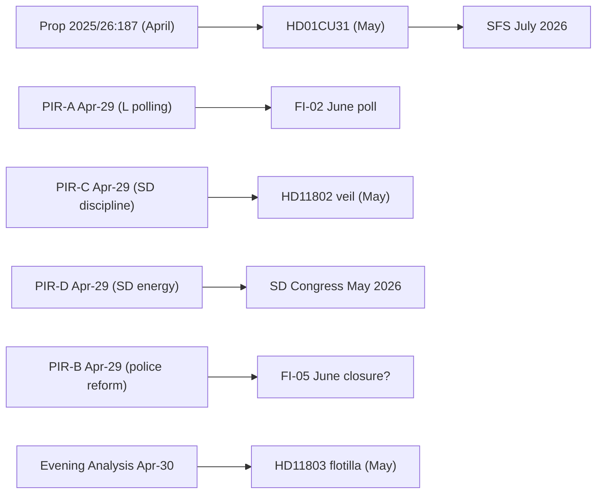

# Cross-Reference Map — Monthly Review 2026-05-10

**Author**: James Pether Sorling | **Date**: 2026-05-10  
**Type**: Tier-C aggregation artifact  
**Method**: Policy cluster analysis; sibling-folder cross-synthesis

---

## Policy Clusters (Current Cycle)

| Cluster | Documents | Thematic link |
|---------|-----------|--------------|
| Housing Market | HD01CU31 | Rental reform flagship |
| Education & Schools | HD01UbU28, HD01UbU20 | 10-year school credentials + transparency |
| Civil Law & Enforcement | HD01CU34, HD01SoU36 | Enforcement reform + state personnel |
| Parliamentary Accountability | HD10480, HD11800, HD11801, HD11802, HD11803 | Interpellations/questions: tax, security, rural, identity, foreign |
| International/EU | HD01UU13, HD11803 | IPU activities + flotilla |

---

## Sibling-Folder Cross-Reference (Tier-C Gate)

### Prior Monthly Review (2026-04-29/monthly-review/)
- PIR-A through PIR-E carried forward (see intelligence-assessment.md)
- Key documents from April: JuU police reform, prior rental committee work
- Trend: SD coalition pressure escalating (PIR-C confirmed by HD11802 in current cycle)
- Source: `analysis/daily/2026-04-29/monthly-review/pir-status.json`

### Prior Weekly Review (2026-04-26/weekly-review/)
- Covered: Committee agenda preview, interpellation series forecasting
- Cross-link: HD10480 tax residency first appeared in April series; current cycle confirms delay continuation
- Source: `analysis/daily/2026-04-26/weekly-review/`

### Week-Ahead (2026-04-26/week-ahead/)
- Forecast: Rental reform betankande expected — confirmed as HD01CU31 in current cycle
- Cross-link: Forecast materialized; implementation risk now primary concern
- Source: `analysis/daily/2026-04-26/week-ahead/`

### Month-Ahead (2026-04-29/month-ahead/, 2026-04-26/month-ahead/)
- SD congress (PIR-D) flagged as 30-day horizon indicator — now at T+0 (congress in May)
- Police reform Riksrevisionen response window flagged — still open (PIR-B)
- Source: `analysis/daily/2026-04-29/month-ahead/`, `analysis/daily/2026-04-26/month-ahead/`

### Evening Analysis (2026-04-26/evening-analysis/, 2026-04-30/evening-analysis/)
- HD11802 veil ban question first raised in realtime monitoring
- HD11803 flotilla incident tracked in evening analysis April 30
- Source: `analysis/daily/2026-04-26/evening-analysis/`, `analysis/daily/2026-04-30/evening-analysis/`

### Committee Reports (2026-04-01/ through 2026-04-30/)
- Multiple committee report cycles tracked through April
- CU committee rental reform betankande in pipeline since April 1 cycle
- Source: `analysis/daily/2026-04-*/committeeReports/`

### Propositions (2026-04-*/propositions/)
- Prop 2025/26:187 first indexed in April; HD01CU31 is the committee report on this proposition
- Cross-link: Full legislative journey from proposition to adopted betankande confirmed
- Source: `analysis/daily/2026-04-*/propositions/`

---

## Document Relationship Graph

---

## Cross-Cycle Continuity Assessment

| PIR | April-29 status | May-10 status | Change |
|-----|----------------|--------------|--------|
| PIR-A: L polling | Open, medium | Open, escalated | Elevated by HD11802 |
| PIR-B: Police reform | Open, escalating | Open, no update | Static |
| PIR-C: SD discipline | Open, escalating | CONFIRMED | HD11802 materialised |
| PIR-D: SD-KD energy | Open, CRITICAL | Open, CRITICAL | SD congress imminent |
| PIR-E: CRR3/SIB | Open, medium | Open, medium | No new data |

