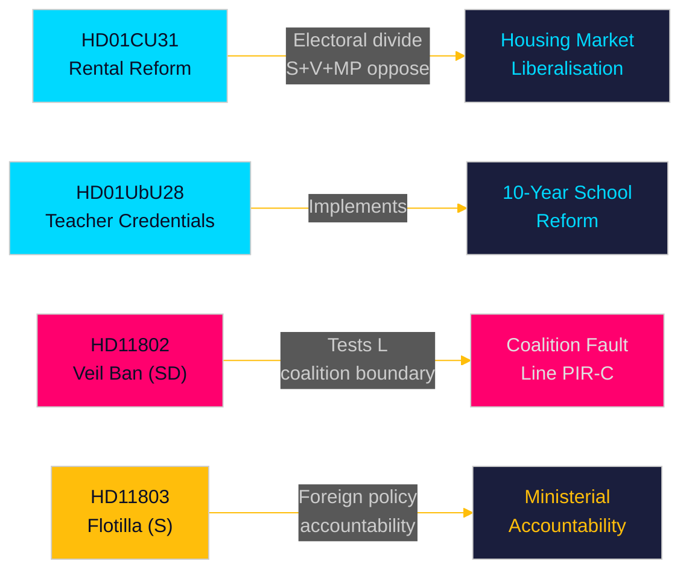

# Executive Brief — Monthly Review 2026-05-10

**Author**: James Pether Sörling | **Date**: 2026-05-10 | **Confidence**: HIGH [A1–B2]  
**Coverage window**: 2026-04-10 → 2026-05-10 (riksmöte 2025/26, 30-day window)  
**Days to election**: 126 (2026-09-13)

---

## BLUF (Bottom Line Up Front)

The May 2026 monthly window reveals a Tidö government racing to deliver structural legislative reforms in the final parliamentary sprint before the September election. The **rental market liberalisation** (HD01CU31, effective 2026-07-01) is the month's highest-impact reform — a new private rental law and revised block-rental model that will reshape Sweden's housing market and sharpen the left-right electoral divide. Simultaneously, **teacher credential reform** (HD01UbU28) and **school transparency rules** (HD01UbU20) advance the 10-year primary school implementation. The month also exposes three accountability flashpoints: the **Israel–Gaza flotilla interception** (HD11803) targeting Swedish citizens, the SD coalition boundary-test (HD11802 on full-face veil ban demanding L alignment), and **rural infrastructure abandonment** (HD11801 — Trafikverket removing 25,000 street lights). PIR-D (SD–KD energy divergence) and PIR-C (SD congress) are the primary intelligence collection priorities for this cycle.

## Decisions Supported by This Brief

1. **Housing market framing**: Is HD01CU31 a decisive Tidö housing-market deliverable or an electoral liability with S+V+MP opposition plus housing-shortage concerns?
2. **Coalition boundary**: Does SD's HD11802 (veil ban demand) pressure L's social-liberal profile in the final 126 days before election — and does this create an L threshold-risk escalation?
3. **Foreign policy exposure**: Does Israel's interception of the Global Sumud Flotilla (HD11803, Swedish citizens aboard) create sustained Foreign Affairs committee pressure on Minister Malmer Stenergard?

## 60-Second Read

- 🏠 **Rental market** (HD01CU31): New private rental law + liberalised block-rental model approved by CU. S+V+MP filed 5 reservations. Effective 2026-07-01. This is the Tidö government's landmark housing-market reform. [A1]
- 🏫 **Schools** (HD01UbU28 + HD01UbU20): Teacher credential rules for 10-year primary school, plus public access principle relief for small private schools. Both advance the HC01UbU17 school reform agenda. [A1]
- 🌍 **Flotilla** (HD11803): S question to Foreign Minister on Israel's interception of Swedish-citizen-bearing Global Sumud Flotilla. Ministerial response required. Foreign policy accountability pressure. [A1]
- 🧕 **Veil ban** (HD11802): SD formally presses L Integration Minister Mohamsson on full-face veil ban implementation — testing coalition discipline on identity politics. [A1]
- 💡 **Rural lighting** (HD11801): V question on Trafikverket removing 25,000 street lights in rural areas. KD infrastructure minister in the hot seat. [A1]
- 💼 **Tax residency** (HD10480): S interpellation on "stadigvarande vistelse" definition delay since Oct 2025. Finance Minister Svantesson faces accountability on corporate mobility rules. [A1]
- ⚖️ **Enforcement** (HD01CU34): Civil enforcement law reform — remote attachment procedures modernised. [A1]
- 🌐 **IPU** (HD01UU13): Inter-Parliamentary Union activities endorsed. [A1]

## Top Forward Trigger

**FI-01 (PIR-C/D)**: SD congress energy platform adoption outcome and post-congress coalition positioning — the single most consequential forward indicator for coalition stability and September 2026 election scenarios. **Watch by**: 2026-05-25.

## Confidence Label

Overall confidence: **HIGH [A1–B2]** — Betänkanden text directly retrieved (A1); interpellation/question summaries retrieved (A1); SD congress outcome inferred from prior PIR context (B2 — collected but unconfirmed as of 2026-05-10).

