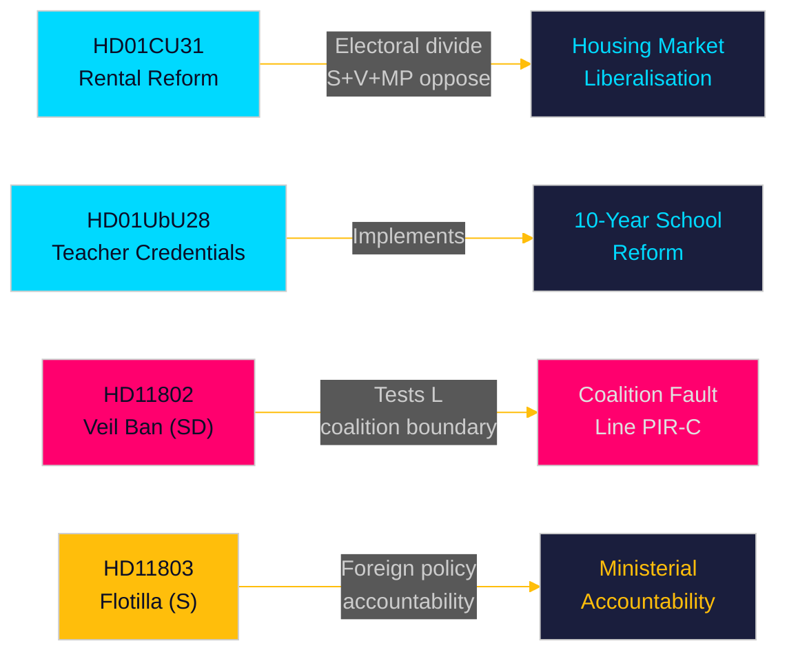

<!-- dir: rtl -->
---
title: "Sweden's Pre-Election Legislative Sprint: Housing Reform, School Credentials, and Foreign Policy Flashpoints — May 2026"
author: "James Pether Sörling"
date: "2026-05-10"
article_type: "monthly-review"
subfolder: "monthly-review"
language: "en"
classification: "PUBLIC"
confidence: "HIGH [A1–B2]"
coverage_window: "2026-04-10 → 2026-05-10"
days_to_election: 126
---

# الملخص التنفيذي — المراجعة الشهرية 2026-05-10

**المؤلف**: James Pether Sörling | **التاريخ**: 2026-05-10 | **مستوى الثقة**: HIGH [A1–B2]  
**فترة التغطية**: 2026-04-10 → 2026-05-10 (الدورة البرلمانية 2025/26، نافذة 30 يوماً)  
**الأيام حتى الانتخابات**: 126 (2026-09-13)

---

## الخلاصة الفورية

يكشف نافذة مايو 2026 عن تحالف Tidö الذي يتسابق لتسليم إصلاحات تشريعية هيكلية في السباق البرلماني الأخير قبل انتخابات سبتمبر. **تحرير سوق الإيجار** (HD01CU31، نافذ من 2026-07-01) هو الإصلاح الأعلى تأثيراً في الشهر — قانون إيجار خاص جديد ونموذج إيجار كتلي معدّل سيُعيدان تشكيل سوق الإسكان السويدي ويُحدّان الانقسام الانتخابي بين اليسار واليمين. في الوقت ذاته، يُعزز **إصلاح مؤهلات المعلمين** (HD01UbU28) و**قواعد الشفافية المدرسية** (HD01UbU20) تطبيق المدرسة الابتدائية ذات العشر سنوات. يكشف الشهر أيضاً عن ثلاث نقاط توهج للمساءلة: **اعتراض الأسطول الإسرائيلي** (HD11803) الذي يستهدف المواطنين السويديين، واختبار SD لحدود التحالف (HD11802 بشأن حظر النقاب الكامل الذي يطالب بتوافق L)، و**تخلي المناطق الريفية عن البنية التحتية** (HD11801 — Trafikverket يُزيل 25,000 عمود إنارة). PIR-D (تباين الطاقة بين SD وKD) و PIR-C (مؤتمر SD) هما أولويات جمع المعلومات الاستخباراتية الأساسية لهذه الدورة.

## القرارات المدعومة بهذا الملخص

1. **إطار سوق الإسكان**: هل يُمثل HD01CU31 إنجازاً حاسماً لتحالف Tidö في سوق الإسكان أم أنه مسؤولية انتخابية في ظل معارضة S+V+MP وأزمة الإسكان؟
2. **حدود التحالف**: هل يضغط HD11802 من SD (مطالبة بحظر النقاب) على الملف الاجتماعي الليبرالي لحزب L في آخر 126 يوماً قبل الانتخابات — وهل يخلق ذلك تصعيداً في مخاطر العتبة لـ L؟
3. **التعرض للسياسة الخارجية**: هل يخلق اعتراض إسرائيل لقافلة Global Sumud (HD11803، مواطنون سويديون على متنها) ضغطاً مستداماً في لجنة الشؤون الخارجية على الوزيرة Malmer Stenergard؟

## القراءة في 60 ثانية

- 🏠 **سوق الإيجار** (HD01CU31): قانون إيجار خاص جديد + نموذج إيجار كتلي محرَّر مُعتمد من CU. قدّمت S+V+MP 5 تحفظات. نافذ من 2026-07-01. هذا هو الإصلاح الرائد لحكومة Tidö في سوق الإسكان. [A1]
- 🏫 **المدارس** (HD01UbU28 + HD01UbU20): قواعد مؤهلات المعلمين للمدرسة الابتدائية ذات العشر سنوات، بالإضافة إلى تخفيف مبدأ الوصول العام للمدارس الخاصة الصغيرة. كلاهما يُعزز أجندة إصلاح التعليم HC01UbU17. [A1]
- 🌍 **القافلة** (HD11803): سؤال S لوزيرة الخارجية بشأن اعتراض إسرائيل لقافلة Global Sumud التي تحمل مواطنين سويديين. مطلوب رد وزاري. ضغط المساءلة في السياسة الخارجية. [A1]
- 🧕 **حظر النقاب** (HD11802): يضغط SD رسمياً على وزيرة الإدماج في حزب L، Mohamsson، بشأن تطبيق حظر النقاب الكامل — يختبر الانضباط الائتلافي في السياسات الهوياتية. [A1]
- 💡 **إنارة الأرياف** (HD11801): سؤال V بشأن إزالة Trafikverket لـ 25,000 عمود إنارة في المناطق الريفية. وزير البنية التحتية في حزب KD في مواجهة المساءلة. [A1]
- 💼 **الإقامة الضريبية** (HD10480): استجواب S بشأن التأخر في تعريف "stadigvarande vistelse" منذ أكتوبر 2025. وزير المالية Svantesson يواجه المساءلة عن قواعد تنقل الشركات. [A1]
- ⚖️ **التنفيذ المدني** (HD01CU34): إصلاح قانون التنفيذ المدني — إجراءات الحجز عن بُعد مُحدَّثة. [A1]
- 🌐 **IPU** (HD01UU13): اعتماد أنشطة الاتحاد البرلماني الدولي. [A1]

## أهم المؤشرات المستقبلية

**FI-01 (PIR-C/D)**: نتيجة اعتماد منصة الطاقة في مؤتمر SD وتموضع التحالف بعد المؤتمر — المؤشر المستقبلي الأكثر تأثيراً على استقرار التحالف وسيناريوهات انتخابات سبتمبر 2026. **متابعة حتى**: 2026-05-25.

## مستوى الثقة

الثقة الإجمالية: **HIGH [A1–B2]** — نص Betänkanden مُسترجع مباشرة (A1)؛ ملخصات الاستجوابات/الأسئلة مُسترجعة (A1)؛ نتيجة مؤتمر SD مُستنتجة من سياق PIR السابق (B2 — مُجمَّعة لكن غير مؤكدة حتى 2026-05-10).

<!-- source-sha: 5d2996db1a079ddefd717d8d87fb80ddc1db619a -->
