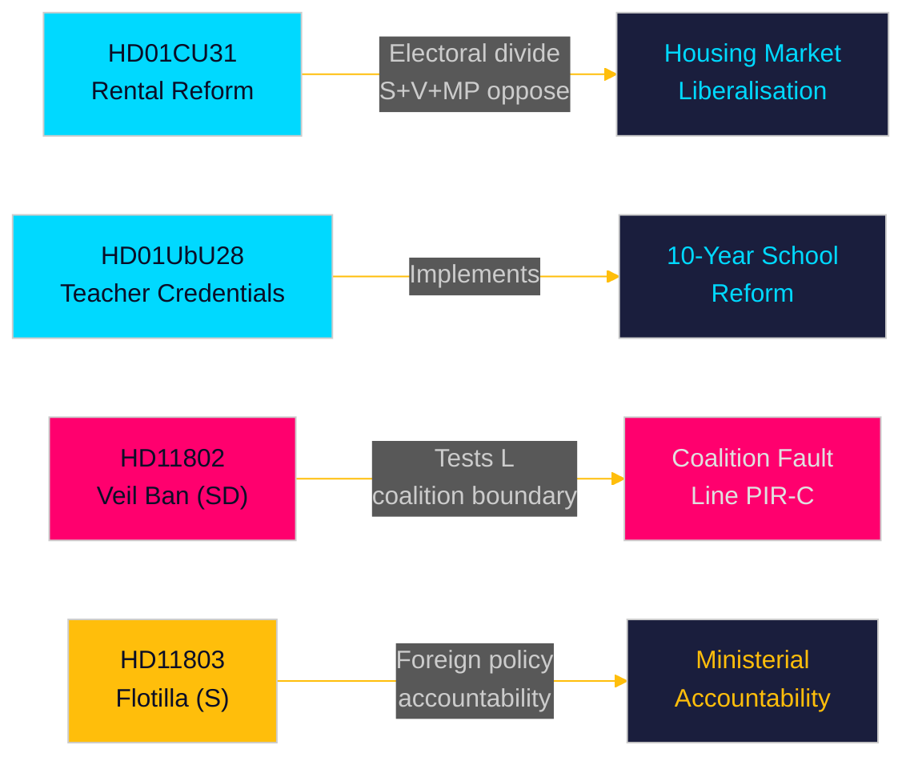

# Eksekutivt resumé — Månedsoversigt 2026-05-10

**Forfatter**: James Pether Sörling | **Dato**: 2026-05-10 | **Konfidens**: HIGH [A1–B2]  
**Dækningsvindue**: 2026-04-10 → 2026-05-10 (riksmøde 2025/26, 30-dages vindue)  
**Dage til valg**: 126 (2026-09-13)

---

## Kortfattet konklusion

Maj 2026-vinduet afslører en Tidö-koalition, der kapløber med at levere strukturelle lovgivningsreformer i den endelige parlamentariske sprint inden septembervalget. **Liberaliseringen af lejemarkedet** (HD01CU31, ikrafttrædelse 2026-07-01) er månedens reform med størst indvirkning — en ny privat lejelov og revideret blokkørermodel, der vil omforme Sveriges boligmarked og skærpe den venstre-højre-valgsskel. Samtidig fremmer **læreruddannelsesreformen** (HD01UbU28) og **skolernes transparensregler** (HD01UbU20) implementeringen af den 10-årige folkeskole. Måneden afslører også tre ansvarsflashpoints: **Israels flotilleinterception** (HD11803) rettet mod svenske statsborgere, SDs koalitionsgrænsetest (HD11802 om fuld tilsløring der kræver L-justering), og **landdistrikternes infrastrukturafandonment** (HD11801 — Trafikverket fjerner 25.000 gadelamper). PIR-D (SD–KD-energidivergensen) og PIR-C (SD-kongressen) er de primære efterretningsindsamlingsprioriteter for denne cyklus.

## Beslutninger understøttet af dette resumé

1. **Boligmarkedets inramning**: Er HD01CU31 en afgørende Tidö-leverance på boligmarkedet eller en valgansvar med S+V+MP-opposition plus boligmangel?
2. **Koalitionsgrænse**: Presser SDs HD11802 (krav om slørforbud) L's socialliberale profil i de sidste 126 dage inden valget — og skaber dette en tærskelrisikoeskalation for L?
3. **Udenrigspolitisk eksponering**: Skaber Israels interception af Global Sumud-flotillen (HD11803, svenske statsborgere om bord) vedvarende pres i udenrigsudvalget mod udenrigsminister Malmer Stenergard?

## 60-sekunders læsning

- 🏠 **Lejemarkedet** (HD01CU31): Ny privat lejelov + liberaliseret blokkørsel godkendt af CU. S+V+MP indgav 5 forbehold. Ikrafttrædelse 2026-07-01. Dette er Tidö-regeringens flagskib på boligmarkedet. [A1]
- 🏫 **Skoler** (HD01UbU28 + HD01UbU20): Regler for lærerkvalifikationer til 10-årig folkeskole, plus offentlighedsprincip-lettelse for små friskoler. Begge fremmer HC01UbU17 skolereformdagsordenen. [A1]
- 🌍 **Flotillen** (HD11803): S-spørgsmål til udenrigsministeren om Israels interception af den svenske-borgerbærende Global Sumud-flotille. Ministersvar påkrævet. Udenrigspolitisk ansvarspress. [A1]
- 🧕 **Slørforbud** (HD11802): SD presser formelt L's integrationsminister Mohamsson om implementering af forbud mod fuld tilsløring — tester koalitionsdisciplin i identitetspolitik. [A1]
- 💡 **Landdistriktsbelysning** (HD11801): V-spørgsmål om Trafikverkets fjernelse af 25.000 gadelamper i landdistrikter. KD's infrastrukturminister i den varme stol. [A1]
- 💼 **Skattemæssigt hjemsted** (HD10480): S-interpellation om forsinkelsen af definitionen af "stadigvarande vistelse" siden oktober 2025. Finansminister Svantesson holdes ansvarlig for reglerne om virksomhedsmobilitet. [A1]
- ⚖️ **Tvangsfuldbyrdelse** (HD01CU34): Reform af civilretlig tvangsfuldbyrdelseslov — fjerneksekutionsprocesser moderniseret. [A1]
- 🌐 **IPU** (HD01UU13): Den Interparlamentariske Unions aktiviteter godkendt. [A1]

## Vigtigste fremadrettede udløser

**FI-01 (PIR-C/D)**: SDs kongres' vedtagelse af energiplatform og positionering efter kongressen — den enkelt mest konsekvensrige fremadrettede indikator for koalitionsstabilitet og valgscenarier for september 2026. **Overvåges til**: 2026-05-25.

## Konfidensniveau

Samlet konfidens: **HIGH [A1–B2]** — Betänkanden-tekst direkte hentet (A1); interpellations-/spørgsmålsresuméer hentet (A1); SDs kongresresultat udledt fra forudgående PIR-kontekst (B2 — indsamlet men ubekræftet per 2026-05-10).

<!-- source-sha: 5d2996db1a079ddefd717d8d87fb80ddc1db619a -->
