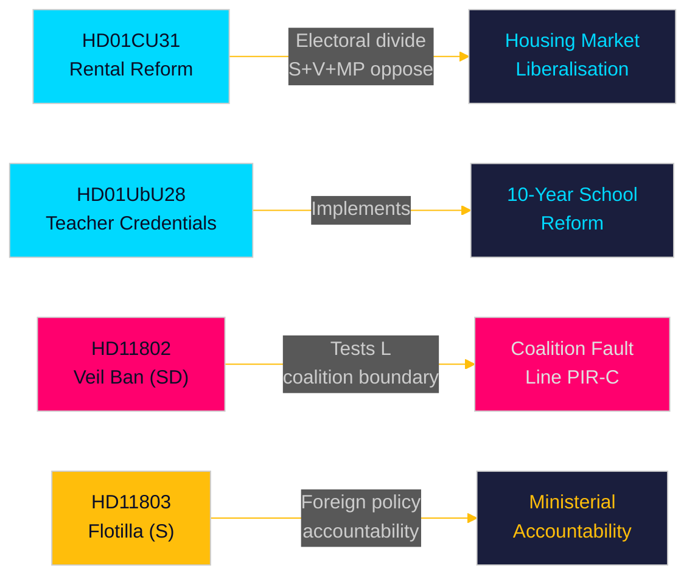

# Exekutiv-Briefing — Monatsübersicht 2026-05-10

**Autor**: James Pether Sörling | **Datum**: 2026-05-10 | **Konfidenz**: HIGH [A1–B2]  
**Abdeckungszeitraum**: 2026-04-10 → 2026-05-10 (Riksmöte 2025/26, 30-Tage-Fenster)  
**Tage bis zur Wahl**: 126 (2026-09-13)

---

## Fazit auf einen Blick

Das Mai-2026-Fenster offenbart eine Tidö-Koalition, die im letzten parlamentarischen Sprint vor der Septemberwahl darum wetteifert, strukturelle Gesetzgebungsreformen zu liefern. Die **Liberalisierung des Mietmarktes** (HD01CU31, Inkrafttreten 2026-07-01) ist die wirkungsstärkste Reform des Monats — ein neues Privatmietgesetz und ein überarbeitetes Blockmietmodell werden Schwedens Wohnungsmarkt umgestalten und die links-rechts-Wahltrennlinie schärfen. Gleichzeitig treiben die **Lehrerqualifikationsreform** (HD01UbU28) und die **Schultransparenzregeln** (HD01UbU20) die Umsetzung der 10-jährigen Grundschule voran. Der Monat legt auch drei Rechenschaftspflicht-Brennpunkte offen: die **israelische Flotilleninterzeption** (HD11803) gegen schwedische Staatsbürger, SDs Koalitionsgrenztest (HD11802 zum Ganzkörperschleierverbot, das L-Ausrichtung fordert), und die **Infrastrukturaufgabe im ländlichen Raum** (HD11801 — Trafikverket entfernt 25.000 Straßenlaternen). PIR-D (SD–KD-Energiedivergenz) und PIR-C (SD-Parteitag) sind die primären Geheimdiensterhebungsprioritäten für diesen Zyklus.

## Von diesem Briefing unterstützte Entscheidungen

1. **Wohnungsmarkteinrahmung**: Ist HD01CU31 eine entscheidende Tidö-Lieferung auf dem Wohnungsmarkt oder eine Wahlhaftung mit S+V+MP-Opposition plus Wohnungsknappheit?
2. **Koalitionsgrenze**: Setzt SDs HD11802 (Forderung nach Schleiverbot) das sozialliberale Profil von L in den letzten 126 Tagen vor der Wahl unter Druck — und erzeugt dies eine Schwellenrisikoeskalation für L?
3. **Außenpolitische Exposition**: Erzeugt Israels Interzeption der Global Sumud-Flotille (HD11803, schwedische Staatsbürger an Bord) anhaltenden Druck im Außenausschuss auf Außenministerin Malmer Stenergard?

## 60-Sekunden-Lektüre

- 🏠 **Mietmarkt** (HD01CU31): Neues Privatmietgesetz + liberalisiertes Blockmietmodell vom CU genehmigt. S+V+MP reichte 5 Vorbehalte ein. Inkrafttreten 2026-07-01. Dies ist das Flaggschiff der Tidö-Regierung auf dem Wohnungsmarkt. [A1]
- 🏫 **Schulen** (HD01UbU28 + HD01UbU20): Lehrerqualifikationsregeln für die 10-jährige Grundschule sowie Erleichterung des Öffentlichkeitsprinzips für kleine Privatschulen. Beide fördern die HC01UbU17-Schulreformagenda. [A1]
- 🌍 **Flotille** (HD11803): S-Anfrage an die Außenministerin zu Israels Interzeption der schwedische-Bürger-führenden Global Sumud-Flotille. Ministerantwort erforderlich. Außenpolitischer Rechenschaftsdruck. [A1]
- 🧕 **Schleierverbot** (HD11802): SD drängt formal L-Integrationsministerin Mohamsson zur Umsetzung des Verbots des Ganzkörperschleiers — testet die Koalitionsdisziplin in der Identitätspolitik. [A1]
- 💡 **Ländliche Beleuchtung** (HD11801): V-Anfrage zu Trafikverkets Entfernung von 25.000 Straßenlaternen in ländlichen Gebieten. KD-Infrastrukturminister im heißen Stuhl. [A1]
- 💼 **Steuerlicher Wohnsitz** (HD10480): S-Interpellation zur Verzögerung der Definition von "stadigvarande vistelse" seit Oktober 2025. Finanzminister Svantesson sieht sich für die Regeln zur Unternehmensmobilität verantwortlich. [A1]
- ⚖️ **Vollstreckung** (HD01CU34): Reform des Zivilprozessrechts zur Zwangsvollstreckung — Fernpfändungsverfahren modernisiert. [A1]
- 🌐 **IPU** (HD01UU13): Aktivitäten der Interparlamentarischen Union gebilligt. [A1]

## Wichtigster Vorwärts-Auslöser

**FI-01 (PIR-C/D)**: SD-Parteitage Ergebnis der Energieplattformadoption und Koalitionspositionierung nach dem Parteitag — der bei weitem folgenreichste Vorwärtsindikator für Koalitionsstabilität und Wahlszenarien für September 2026. **Beobachten bis**: 2026-05-25.

## Konfidenzbeurteilung

Gesamtkonfidenz: **HIGH [A1–B2]** — Betänkanden-Text direkt abgerufen (A1); Interpellations-/Anfragezusammenfassungen abgerufen (A1); SD-Parteitage Ergebnis aus vorherigem PIR-Kontext abgeleitet (B2 — gesammelt, aber per 2026-05-10 unbestätigt).

<!-- source-sha: 5d2996db1a079ddefd717d8d87fb80ddc1db619a -->
