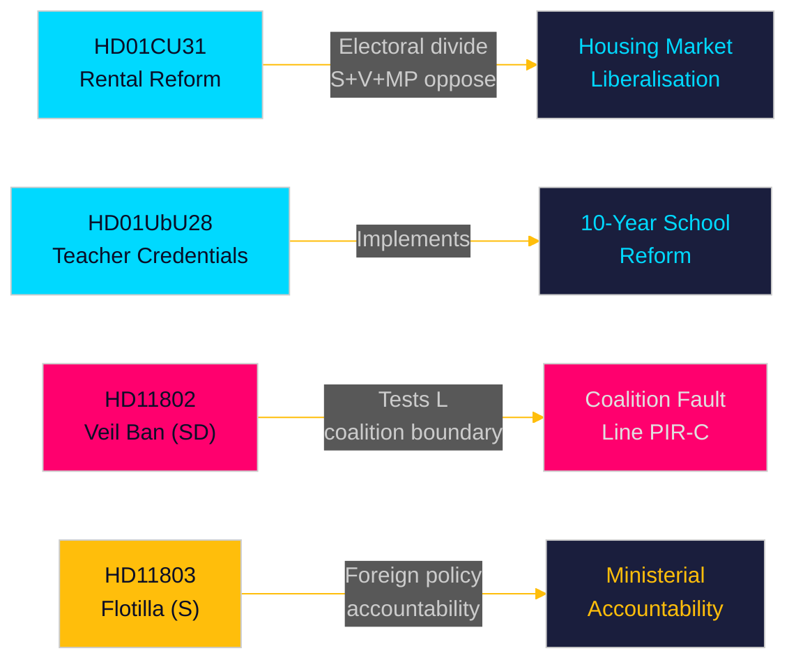

# Resumen ejecutivo — Revisión mensual 2026-05-10

**Autor**: James Pether Sörling | **Fecha**: 2026-05-10 | **Confianza**: HIGH [A1–B2]  
**Período cubierto**: 2026-04-10 → 2026-05-10 (riksmöte 2025/26, ventana de 30 días)  
**Días hasta las elecciones**: 126 (2026-09-13)

---

## Conclusión inmediata

La ventana de mayo de 2026 revela una coalición Tidö que compite por entregar reformas legislativas estructurales en el último sprint parlamentario antes de las elecciones de septiembre. La **liberalización del mercado de alquileres** (HD01CU31, en vigor desde el 2026-07-01) es la reforma de mayor impacto del mes — una nueva ley de alquiler privado y un modelo de alquiler por bloques revisado que reformará el mercado inmobiliario sueco y agudizará la división electoral izquierda-derecha. Simultáneamente, la **reforma de credenciales docentes** (HD01UbU28) y las **reglas de transparencia escolar** (HD01UbU20) hacen avanzar la implementación de la escuela primaria de 10 años. El mes también expone tres puntos de confrontación de responsabilidad: la **interceptación israelí de la flotilla** (HD11803) dirigida a ciudadanos suecos, el test de límites de coalición del SD (HD11802 sobre la prohibición del velo completo exigiendo alineación del L), y el **abandono de infraestructuras rurales** (HD11801 — Trafikverket eliminando 25.000 farolas). PIR-D (divergencia energética SD–KD) y PIR-C (congreso del SD) son las prioridades primarias de recopilación de inteligencia para este ciclo.

## Decisiones respaldadas por este resumen

1. **Encuadre del mercado de la vivienda**: ¿Es HD01CU31 un hito decisivo de la coalición Tidö en el mercado de la vivienda o una responsabilidad electoral con la oposición S+V+MP más la escasez de vivienda?
2. **Límite de coalición**: ¿El HD11802 del SD (demanda de prohibición del velo) presiona el perfil socialliberal del L en los últimos 126 días antes de las elecciones — y crea esto una escalada de riesgo umbral para el L?
3. **Exposición en política exterior**: ¿La interceptación por Israel de la flotilla Global Sumud (HD11803, ciudadanos suecos a bordo) crea una presión sostenida en la comisión de asuntos exteriores sobre la ministra Malmer Stenergard?

## Lectura en 60 segundos

- 🏠 **Mercado de alquiler** (HD01CU31): Nueva ley de alquiler privado + modelo de alquiler por bloques liberalizado aprobado por la CU. S+V+MP presentó 5 reservas. En vigor desde el 2026-07-01. Es la reforma insignia de la coalición Tidö en el mercado de la vivienda. [A1]
- 🏫 **Escuelas** (HD01UbU28 + HD01UbU20): Reglas de credenciales docentes para la escuela primaria de 10 años, más alivio del principio de acceso público para pequeñas escuelas privadas. Ambas hacen avanzar la agenda de reforma escolar HC01UbU17. [A1]
- 🌍 **Flotilla** (HD11803): Pregunta del S a la ministra de Asuntos Exteriores sobre la interceptación por Israel de la flotilla Global Sumud que transportaba ciudadanos suecos. Se requiere respuesta ministerial. Presión de responsabilidad en política exterior. [A1]
- 🧕 **Prohibición del velo** (HD11802): El SD presiona formalmente a la ministra de Integración del L, Mohamsson, sobre la implementación de la prohibición del velo facial completo — poniendo a prueba la disciplina de coalición en política de identidad. [A1]
- 💡 **Alumbrado rural** (HD11801): Pregunta del V sobre la retirada por Trafikverket de 25.000 farolas en zonas rurales. El ministro de Infraestructuras del KD en el punto de mira. [A1]
- 💼 **Residencia fiscal** (HD10480): Interpelación del S sobre el retraso en la definición de "stadigvarande vistelse" desde octubre de 2025. El ministro de Finanzas Svantesson rinde cuentas sobre las normas de movilidad empresarial. [A1]
- ⚖️ **Ejecución civil** (HD01CU34): Reforma de la ley civil de ejecución — procedimientos de embargo a distancia modernizados. [A1]
- 🌐 **UIP** (HD01UU13): Actividades de la Unión Interparlamentaria aprobadas. [A1]

## Principal indicador prospectivo

**FI-01 (PIR-C/D)**: Resultado de la adopción de la plataforma energética en el congreso del SD y posicionamiento post-congreso de la coalición — el indicador prospectivo más determinante para la estabilidad de la coalición y los escenarios electorales de septiembre de 2026. **Vigilar hasta**: 2026-05-25.

## Nivel de confianza

Confianza global: **HIGH [A1–B2]** — Texto de los Betänkanden recuperado directamente (A1); resúmenes de interpelaciones/preguntas recuperados (A1); resultado del congreso del SD deducido del contexto PIR anterior (B2 — recopilado pero no confirmado a 2026-05-10).

<!-- source-sha: 5d2996db1a079ddefd717d8d87fb80ddc1db619a -->
