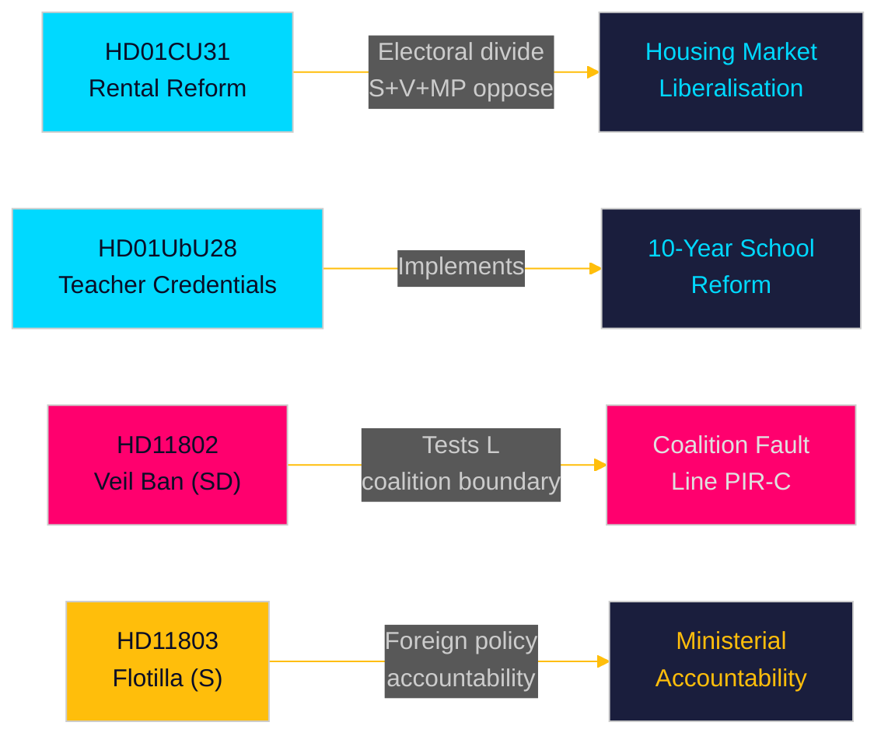

# Tiivistelmä — Kuukausikatsaus 2026-05-10

**Tekijä**: James Pether Sörling | **Päivämäärä**: 2026-05-10 | **Luotettavuus**: HIGH [A1–B2]  
**Kattavuusjakso**: 2026-04-10 → 2026-05-10 (riksmöte 2025/26, 30 päivän ikkuna)  
**Päiviä vaaleihin**: 126 (2026-09-13)

---

## Lyhyt yhteenveto

Toukokuun 2026 ikkuna paljastaa Tidö-koalition, joka kilpailee toimittaakseen rakenteellisia lainsäädäntöuudistuksia viimeisessä parlamentaarisessa sprintissä ennen syyskuun vaaleja. **Vuokramarkkinoiden vapauttaminen** (HD01CU31, voimaantulo 2026-07-01) on kuukauden suurivaikutteisin uudistus — uusi yksityinen vuokralaki ja tarkistettu lohkovuokrausmalli, jotka muotoilevat uudelleen Ruotsin asuntomarkkinat ja terävöittävät vasemmisto-oikeisto-vaalijakoa. Samanaikaisesti **opettajan pätevyysreformi** (HD01UbU28) ja **koulujen läpinäkyvyyssäännöt** (HD01UbU20) edistävät 10-vuotisen peruskoulun käyttöönottoa. Kuukausi paljastaa myös kolme vastuullisuuden tulipistettä: **Israelin flotillan pysäyttäminen** (HD11803) kohdistui ruotsalaisiin kansalaisiin, SD:n koalitiorajatesti (HD11802 täyspeittoisesta huntukiellosta, joka vaatii L:n linjautumista), ja **maaseudun infrastruktuurin hylkääminen** (HD11801 — Trafikverket poistaa 25 000 katuvalaistusta). PIR-D (SD–KD-energiadivergenssi) ja PIR-C (SD:n puoluekokous) ovat tämän syklin ensisijaiset tiedustelukeräysprioriteetit.

## Tätä tiivistelmää tukevat päätökset

1. **Asuntomarkkinoiden kehystys**: Onko HD01CU31 ratkaiseva Tidön asuntomarkkinatoimitus vai vaalivastuuvapaus S+V+MP-oppositiolla ja asuntopulalla?
2. **Koalitioraja**: Paineistako SD:n HD11802 (huntukieltovaatimus) L:n sosiaaliliberaalia profiilia viimeisten 126 päivän aikana ennen vaaleja — ja luoko tämä L:lle kynnyskriittisen riskin eskalaation?
3. **Ulkopoliittinen altistuminen**: Luoko Israelin Global Sumud -flotillan pysäyttäminen (HD11803, ruotsalaiset kansalaiset aluksella) jatkuvaa ulkoasiainvaliokunnan painetta ulkoministeri Malmer Stenergardille?

## 60 sekunnin lukeminen

- 🏠 **Vuokramarkkinat** (HD01CU31): Uusi yksityinen vuokralaki + vapautettu lohkovuokrausmalli hyväksytty CU:ssa. S+V+MP jätti 5 varaumaa. Voimaantulo 2026-07-01. Tämä on Tidö-hallituksen lippulaiva asuntomarkkinoilla. [A1]
- 🏫 **Koulut** (HD01UbU28 + HD01UbU20): Opettajan pätevyyssäännöt 10-vuotiseen peruskouluun sekä julkisuusperiaatteen helpotus pienille yksityiskouluille. Molemmat edistävät HC01UbU17-koulureformin agendaa. [A1]
- 🌍 **Flotilla** (HD11803): S:n kysymys ulkoministerille Israelin pysäyttämisestä ruotsalaisia kansalaisia kuljettaneelle Global Sumud -flotillalle. Ministerin vastaus vaaditaan. Ulkopoliittinen vastuupaine. [A1]
- 🧕 **Huntukielto** (HD11802): SD painostaa virallisesti L:n integrointiministeri Mohamssonin täyspeittoisesta huntukiellosta — testaa koalition kurin identiteettipolitiikassa. [A1]
- 💡 **Maaseutuvalaistus** (HD11801): V:n kysymys Trafikverketin 25 000 katuvalaistuksen poistosta maaseutualueilla. KD:n infrastruktuuriministeri kuumassa tuolissa. [A1]
- 💼 **Verotuksellinen kotipaikka** (HD10480): S:n interpellaatio "stadigvarande vistelse" -määritelmän viivästymisestä lokakuusta 2025 alkaen. Valtiovarainministeri Svantesson kohtaa vastuun yritysliikkuvuuden säännöistä. [A1]
- ⚖️ **Täytäntöönpano** (HD01CU34): Siviilioikeudellisen täytäntöönpanolain uudistus — etäulosmittausmenettelyt modernisoitu. [A1]
- 🌐 **IPU** (HD01UU13): Parlamenttien välisen liiton toiminta hyväksytty. [A1]

## Tärkein eteenpäin katsova käynnistin

**FI-01 (PIR-C/D)**: SD:n puoluekokouksen energiaplatformin hyväksymistulos ja koalitioasemointi puoluekokouksen jälkeen — yksittäin merkittävin eteenpäin katsova indikaattori koalition vakaudelle ja syyskuun 2026 valioiskenaarioille. **Seurantaan asti**: 2026-05-25.

## Luotettavuustaso

Kokonaisluotettavuus: **HIGH [A1–B2]** — Betänkanden-teksti suoraan haettu (A1); interpellaatio-/kysymysyhteenvedot haettu (A1); SD:n puoluekokouksen tulos johdettu aiemmasta PIR-kontekstista (B2 — kerätty mutta vahvistamaton 2026-05-10 mennessä).

<!-- source-sha: 5d2996db1a079ddefd717d8d87fb80ddc1db619a -->
