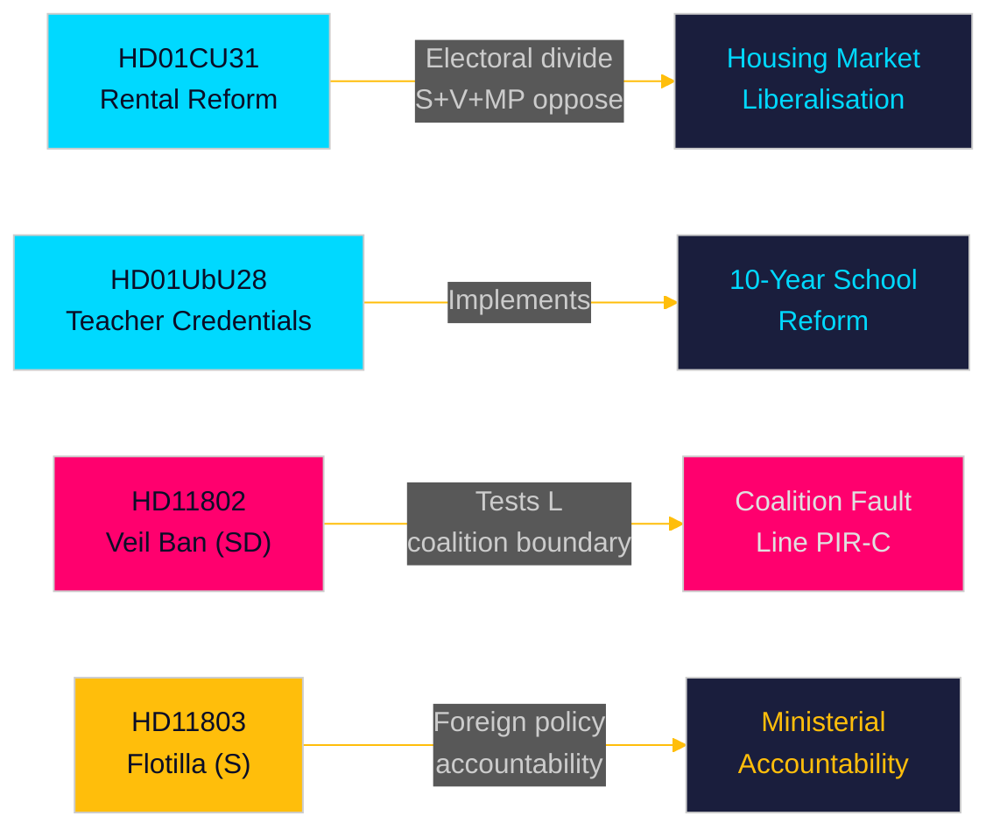

# Note de synthèse — Revue mensuelle 2026-05-10

**Auteur** : James Pether Sörling | **Date** : 2026-05-10 | **Niveau de confiance** : HIGH [A1–B2]  
**Période couverte** : 2026-04-10 → 2026-05-10 (riksmöte 2025/26, fenêtre de 30 jours)  
**Jours jusqu'aux élections** : 126 (2026-09-13)

---

## Conclusion immédiate

La fenêtre de mai 2026 révèle une coalition Tidö qui s'efforce de livrer des réformes législatives structurelles dans le dernier sprint parlementaire avant les élections de septembre. La **libéralisation du marché locatif** (HD01CU31, entrée en vigueur le 2026-07-01) est la réforme la plus impactante du mois — une nouvelle loi sur la location privée et un modèle de location groupée révisé qui remodèleront le marché immobilier suédois et affûteront le clivage électoral gauche-droite. Simultanément, la **réforme des titres d'enseignants** (HD01UbU28) et les **règles de transparence scolaire** (HD01UbU20) font avancer la mise en œuvre de l'école primaire de 10 ans. Le mois expose également trois points chauds de responsabilité : l'**interception israélienne de la flottille** (HD11803) visant des citoyens suédois, le test des limites de la coalition par le SD (HD11802 sur l'interdiction du voile intégral exigeant l'alignement du L), et l'**abandon des infrastructures rurales** (HD11801 — Trafikverket supprimant 25 000 lampadaires). PIR-D (divergence énergétique SD–KD) et PIR-C (congrès du SD) sont les priorités primaires de collecte de renseignements pour ce cycle.

## Décisions soutenues par cette note

1. **Cadrage du marché du logement** : HD01CU31 est-il un livrable décisif de la coalition Tidö sur le marché du logement ou une responsabilité électorale avec l'opposition S+V+MP et la pénurie de logements ?
2. **Limite de coalition** : Le HD11802 du SD (demande d'interdiction du voile) met-il sous pression le profil sociallibéral du L dans les 126 derniers jours avant les élections — et cela crée-t-il une escalade du risque de seuil pour le L ?
3. **Exposition en politique étrangère** : L'interception par Israël de la flottille Global Sumud (HD11803, citoyens suédois à bord) crée-t-elle une pression soutenue en commission des affaires étrangères sur la ministre Malmer Stenergard ?

## Lecture en 60 secondes

- 🏠 **Marché locatif** (HD01CU31) : Nouvelle loi sur la location privée + modèle de location groupée libéralisé approuvé par la CU. S+V+MP a déposé 5 réserves. Entrée en vigueur le 2026-07-01. C'est la réforme phare de la coalition Tidö sur le marché du logement. [A1]
- 🏫 **Écoles** (HD01UbU28 + HD01UbU20) : Règles sur les qualifications des enseignants pour l'école primaire de 10 ans, plus allègement du principe d'accès public pour les petites écoles privées. Les deux font avancer l'agenda de réforme scolaire HC01UbU17. [A1]
- 🌍 **Flottille** (HD11803) : Question du S à la ministre des Affaires étrangères sur l'interception par Israël de la flottille Global Sumud transportant des citoyens suédois. Réponse ministérielle requise. Pression de responsabilité en politique étrangère. [A1]
- 🧕 **Interdiction du voile** (HD11802) : Le SD presse formellement la ministre de l'Intégration du L, Mohamsson, sur la mise en œuvre de l'interdiction du voile intégral — testant la discipline de la coalition sur les questions identitaires. [A1]
- 💡 **Éclairage rural** (HD11801) : Question du V sur la suppression par Trafikverket de 25 000 lampadaires dans les zones rurales. Le ministre de l'Infrastructure du KD sous pression. [A1]
- 💼 **Résidence fiscale** (HD10480) : Interpellation du S sur le retard de définition de "stadigvarande vistelse" depuis octobre 2025. Le ministre des Finances Svantesson est tenu responsable des règles de mobilité des entreprises. [A1]
- ⚖️ **Exécution civile** (HD01CU34) : Réforme de la loi civile sur l'exécution forcée — procédures de saisie à distance modernisées. [A1]
- 🌐 **UIP** (HD01UU13) : Activités de l'Union interparlementaire approuvées. [A1]

## Principal indicateur avancé

**FI-01 (PIR-C/D)** : Résultat de l'adoption de la plateforme énergétique au congrès du SD et positionnement post-congrès de la coalition — l'indicateur avancé le plus déterminant pour la stabilité de la coalition et les scénarios électoraux de septembre 2026. **À surveiller jusqu'au** : 2026-05-25.

## Niveau de confiance

Confiance globale : **HIGH [A1–B2]** — Texte des Betänkanden récupéré directement (A1) ; résumés d'interpellations/questions récupérés (A1) ; résultat du congrès du SD déduit du contexte PIR antérieur (B2 — collecté mais non confirmé au 2026-05-10).

<!-- source-sha: 5d2996db1a079ddefd717d8d87fb80ddc1db619a -->
