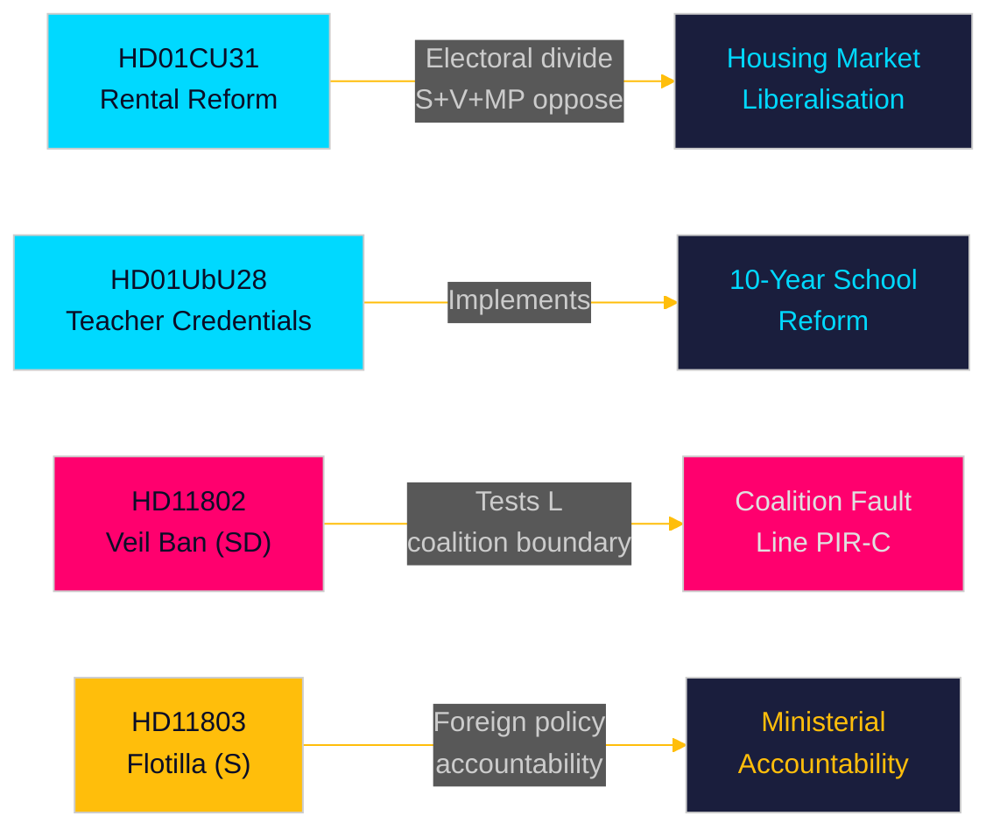

<!-- dir: rtl -->
---
title: "Sweden's Pre-Election Legislative Sprint: Housing Reform, School Credentials, and Foreign Policy Flashpoints — May 2026"
author: "James Pether Sörling"
date: "2026-05-10"
article_type: "monthly-review"
subfolder: "monthly-review"
language: "en"
classification: "PUBLIC"
confidence: "HIGH [A1–B2]"
coverage_window: "2026-04-10 → 2026-05-10"
days_to_election: 126
---

# תקציר מנהלים — סקירה חודשית 2026-05-10

**מחבר**: James Pether Sörling | **תאריך**: 2026-05-10 | **רמת ביטחון**: HIGH [A1–B2]  
**תקופת הכיסוי**: 2026-04-10 → 2026-05-10 (ריקסמוטה 2025/26, חלון של 30 יום)  
**ימים לבחירות**: 126 (2026-09-13)

---

## מסקנה מיידית

חלון מאי 2026 חושף ממשלת Tidö שרצה למסור רפורמות חקיקתיות מבניות בספרינט הפרלמנטרי האחרון לפני בחירות ספטמבר. **שחרור שוק השכירות** (HD01CU31, כניסה לתוקף 2026-07-01) היא הרפורמה בעלת ההשפעה הגבוהה ביותר בחודש — חוק שכירות פרטית חדש ומודל שכירות בלוקים מעודכן שיעצבו מחדש את שוק הדיור השבדי ויחדדו את הפירוד הבחירותי בין שמאל לימין. בו-זמנית, **רפורמת אישורי ההוראה** (HD01UbU28) ו**כללי שקיפות בתי הספר** (HD01UbU20) מקדמים את יישום בית הספר היסודי בן 10 השנים. החודש גם חושף שלוש נקודות אחריות בוערות: **יירוט הצי הישראלי** (HD11803) המכוון לאזרחים שבדיים, מבחן גבולות הקואליציה של SD (HD11802 על איסור רעלה מלאה הדורש יישור עם L), ו**נטישת תשתיות כפריות** (HD11801 — Trafikverket מסיר 25,000 פנסי רחוב). PIR-D (סטייה אנרגטית SD–KD) ו-PIR-C (ועידת SD) הן עדיפויות איסוף המודיעין הראשיות עבור מחזור זה.

## החלטות הנתמכות על ידי תקציר זה

1. **מסגור שוק הדיור**: האם HD01CU31 הוא הישג מכריע של קואליציית Tidö בשוק הדיור, או חבות בחירותית עם האופוזיציה S+V+MP ומחסור בדיור?
2. **גבול הקואליציה**: האם HD11802 של SD (דרישה לאיסור רעלה) לוחץ על הפרופיל הסוציאל-ליברלי של L ב-126 הימים האחרונים לפני הבחירות — והאם הדבר יוצר סיכון סף עולה עבור L?
3. **חשיפה במדיניות חוץ**: האם יירוט ישראל את שייטת Global Sumud (HD11803, אזרחים שבדיים על הסיפון) יוצר לחץ מתמשך בוועדת ענייני חוץ על השרה Malmer Stenergard?

## קריאה של 60 שניות

- 🏠 **שוק השכירות** (HD01CU31): חוק שכירות פרטית חדש + מודל שכירות בלוקים מפוחת אושר על ידי CU. S+V+MP הגישו 5 הסתייגויות. כניסה לתוקף 2026-07-01. זוהי רפורמת הדגל של ממשלת Tidö בשוק הדיור. [A1]
- 🏫 **בתי ספר** (HD01UbU28 + HD01UbU20): כללי כישורי הוראה לבית ספר יסודי בן 10 שנים, בתוספת הקלה על עיקרון הנגישות הציבורית לבתי ספר פרטיים קטנים. שניהם מקדמים את אג'נדת רפורמת החינוך HC01UbU17. [A1]
- 🌍 **השייטת** (HD11803): שאלת S לשרת החוץ על יירוט ישראל את שייטת Global Sumud שנשאה אזרחים שבדיים. נדרשת תגובה שרותית. לחץ אחריות במדיניות חוץ. [A1]
- 🧕 **איסור רעלה** (HD11802): SD לוחצת רשמית על שרת הקליטה של L, Mohamsson, על יישום איסור הרעלה המלאה — בוחנת את משמעת הקואליציה בפוליטיקת הזהות. [A1]
- 💡 **תאורת כפר** (HD11801): שאלת V על הסרת Trafikverket של 25,000 פנסי רחוב באזורים כפריים. שר התשתיות של KD בכיסא הלוהט. [A1]
- 💼 **תושבות מס** (HD10480): שאילתת S על עיכוב הגדרת "stadigvarande vistelse" מאז אוקטובר 2025. שר האוצר Svantesson מתמודד עם אחריות על כללי ניידות עסקית. [A1]
- ⚖️ **אכיפה אזרחית** (HD01CU34): רפורמה בחוק האכיפה האזרחית — נהלי עיקול מרחוק עודכנו. [A1]
- 🌐 **IPU** (HD01UU13): פעילויות האיחוד הבין-פרלמנטרי אושרו. [A1]

## מחולל המבט קדימה החשוב ביותר

**FI-01 (PIR-C/D)**: תוצאת אימוץ פלטפורמת האנרגיה בוועידת SD ומיצוב הקואליציה לאחר הוועידה — המדד המבט קדימה הבעל השלכות הגדולות ביותר על יציבות הקואליציה ותרחישי בחירות ספטמבר 2026. **מעקב עד**: 2026-05-25.

## רמת ביטחון

ביטחון כולל: **HIGH [A1–B2]** — טקסט Betänkanden אוחזר ישירות (A1); תקצירי שאילתות/שאלות אוחזרו (A1); תוצאת ועידת SD הוסקה מהקשר PIR קודם (B2 — נאסף אך לא אושר נכון ל-2026-05-10).

<!-- source-sha: 5d2996db1a079ddefd717d8d87fb80ddc1db619a -->
