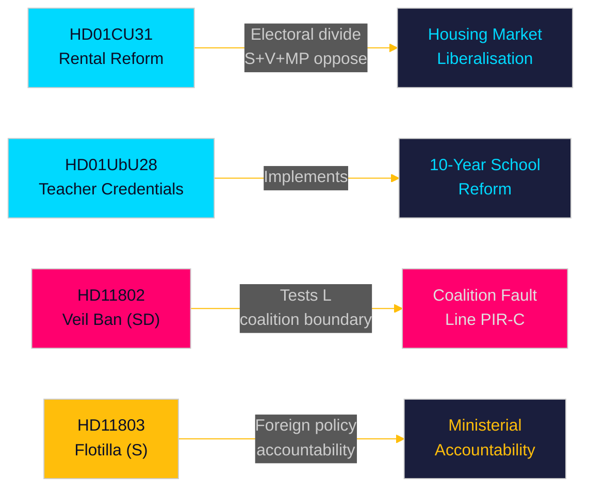

# エグゼクティブブリーフ — 月次レビュー 2026-05-10

**著者**: James Pether Sörling | **日付**: 2026-05-10 | **信頼度**: HIGH [A1–B2]  
**カバー期間**: 2026-04-10 → 2026-05-10 (国会期 2025/26、30日間ウィンドウ)  
**選挙まで**: 126日 (2026-09-13)

---

## 即時結論

2026年5月の分析ウィンドウは、9月の選挙前の最後の議会スプリントで構造的な立法改革を届けようと競走するTidö連立政権を明らかにします。**賃貸市場の自由化**（HD01CU31、2026-07-01施行）は今月最も影響力の大きい改革です — 新しい民間賃貸法と改定されたブロック賃貸モデルはスウェーデンの住宅市場を再形成し、左右の選挙的分断を鋭化させるでしょう。同時に、**教員資格改革**（HD01UbU28）と**学校透明性規則**（HD01UbU20）が10年制初等学校の実施を推進しています。今月はまた3つの説明責任の焦点を露わにします：スウェーデン市民を標的とした**イスラエルによる船団阻止**（HD11803）、SD連立境界テスト（HD11802、完全な顔を覆うベール禁止でL党の同意を要求）、そして**農村部インフラの放棄**（HD11801 — Trafikverketが25,000本の街灯を撤去）。PIR-D（SD–KDエネルギー分岐）とPIR-C（SD党大会）が今サイクルの主要な情報収集優先事項です。

## この概要が支持する決定

1. **住宅市場のフレーミング**: HD01CU31はTidö連立政権にとって住宅市場における決定的な成果か、それともS+V+MP反対派と住宅不足による選挙リスクか？
2. **連立の境界線**: SD党のHD11802（ベール禁止要求）は選挙前の残り126日間でL党の社会自由主義的プロファイルに圧力をかけるか — そしてL党の閾値リスク上昇を生み出すか？
3. **外交政策の露出**: イスラエルによるGlobal Sumud船団阻止（HD11803、スウェーデン市民が乗船）はMalmer Stenergard外務大臣に対する外交委員会の継続的な圧力をもたらすか？

## 60秒で読む

- 🏠 **賃貸市場**（HD01CU31）: 新民間賃貸法 + 自由化されたブロック賃貸モデルがCUで承認。S+V+MPが5件の留保を提出。施行2026-07-01。Tidö政権の住宅市場における旗艦改革。[A1]
- 🏫 **学校**（HD01UbU28 + HD01UbU20）: 10年制初等学校向け教員資格規則、および小規模私立学校への公開原則緩和。両者ともHC01UbU17学校改革アジェンダを推進。[A1]
- 🌍 **船団**（HD11803）: スウェーデン市民を乗せたGlobal Sumud船団に対するイスラエルの阻止についてSがSが外務大臣に質問。閣僚回答が必要。外交政策説明責任への圧力。[A1]
- 🧕 **ベール禁止**（HD11802）: SDがL党の統合担当大臣Mohamssonに対して完全な顔を覆うベール禁止の実施を正式に要求 — アイデンティティ政治における連立規律をテスト。[A1]
- 💡 **農村部照明**（HD11801）: Trafikverketが農村地域で25,000本の街灯を撤去することについてVが質問。KD党のインフラ担当大臣が厳しい立場に。[A1]
- 💼 **税務居住地**（HD10480）: 2025年10月以来の"stadigvarande vistelse"定義遅延についてSが質問。Svantesson財務大臣が企業モビリティ規則について説明責任を問われる。[A1]
- ⚖️ **強制執行**（HD01CU34）: 民事強制執行法改革 — 遠隔差押手続きが近代化。[A1]
- 🌐 **IPU**（HD01UU13）: 列国議会同盟の活動が承認。[A1]

## 最重要前向き指標

**FI-01 (PIR-C/D)**: SD党大会のエネルギープラットフォーム採択結果と党大会後の連立位置づけ — 連立安定性と2026年9月の選挙シナリオに対して最も決定的な前向き指標。**監視期限**: 2026-05-25。

## 信頼度評価

全体的な信頼度: **HIGH [A1–B2]** — Betänkanden文書を直接取得（A1）；質問/内閣質問要約を取得（A1）；SD党大会結果を前回PIRコンテキストから推定（B2 — 収集済みだが2026-05-10時点で未確認）。

<!-- source-sha: 5d2996db1a079ddefd717d8d87fb80ddc1db619a -->
