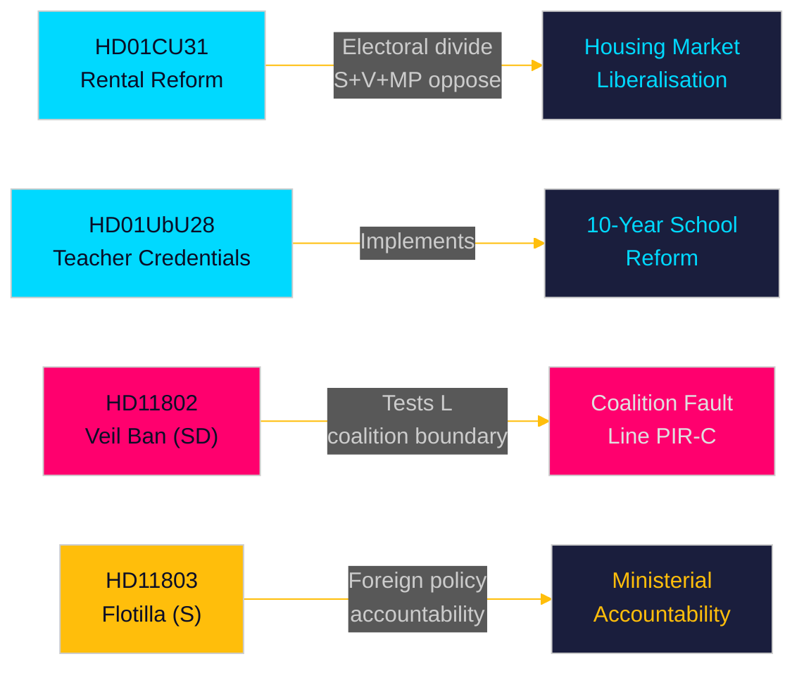

# 집행 브리핑 — 월간 검토 2026-05-10

**저자**: James Pether Sörling | **날짜**: 2026-05-10 | **신뢰도**: HIGH [A1–B2]  
**분석 기간**: 2026-04-10 → 2026-05-10 (국회기 2025/26, 30일 창)  
**선거까지 남은 일수**: 126일 (2026-09-13)

---

## 즉각적 결론

2026년 5월 분석 창은 9월 선거 전 마지막 의회 스프린트에서 구조적 입법 개혁을 이행하기 위해 경쟁하는 Tidö 연립 정부를 드러냅니다. **임대 시장 자유화**(HD01CU31, 2026-07-01 발효)는 이번 달 가장 영향력 있는 개혁입니다 — 새로운 민간 임대법과 개정된 블록 임대 모델은 스웨덴 주택 시장을 재편하고 좌우 선거 분열을 심화시킬 것입니다. 동시에, **교원 자격 개혁**(HD01UbU28)과 **학교 투명성 규정**(HD01UbU20)이 10년제 초등학교 시행을 추진하고 있습니다. 이달은 세 가지 책임 추궁 핵심 사안도 드러냅니다: 스웨덴 시민을 겨냥한 **이스라엘의 선단 차단**(HD11803), SD의 연립 경계 테스트(HD11802, L당 동조를 요구하는 완전 베일 금지), 그리고 **농촌 인프라 방기**(HD11801 — Trafikverket가 25,000개 가로등 제거). PIR-D(SD–KD 에너지 분기)와 PIR-C(SD 전당대회)가 이번 주기의 주요 정보 수집 우선순위입니다.

## 이 브리핑이 지원하는 결정

1. **주택 시장 프레이밍**: HD01CU31은 Tidö 연립의 주택 시장에서의 결정적 성과인가, 아니면 S+V+MP 반대와 주택 부족을 고려한 선거적 부담인가?
2. **연립 경계선**: SD의 HD11802(베일 금지 요구)가 선거 전 마지막 126일 동안 L당의 사회자유주의 프로필을 압박하는가 — 그리고 이것이 L에 대한 문턱 위험 상승을 초래하는가?
3. **외교 정책 노출**: 이스라엘의 Global Sumud 선단 차단(HD11803, 스웨덴 시민 탑승)이 외교위원회에서 Malmer Stenergard 외무장관에 대한 지속적인 압력을 만드는가?

## 60초 읽기

- 🏠 **임대 시장** (HD01CU31): 새 민간 임대법 + 자유화된 블록 임대 모델이 CU에서 승인. S+V+MP가 5건의 유보 제출. 발효 2026-07-01. Tidö 정부의 주택 시장 기함 개혁. [A1]
- 🏫 **학교** (HD01UbU28 + HD01UbU20): 10년제 초등학교용 교원 자격 규정 및 소규모 사립학교 공개 원칙 완화. 두 정책 모두 HC01UbU17 학교 개혁 의제를 추진. [A1]
- 🌍 **선단** (HD11803): S가 이스라엘의 스웨덴 시민 탑승 Global Sumud 선단 차단에 대해 외무장관에게 질의. 장관 답변 필요. 외교 정책 책임 압력. [A1]
- 🧕 **베일 금지** (HD11802): SD가 L당 통합부 장관 Mohamsson에게 완전한 얼굴 베일 금지 시행을 공식 촉구 — 정체성 정치에서 연립 기강 테스트. [A1]
- 💡 **농촌 조명** (HD11801): Trafikverket의 농촌 지역 25,000개 가로등 제거에 대해 V가 질의. KD 인프라 장관 곤경. [A1]
- 💼 **세금 거주지** (HD10480): 2025년 10월 이후 "stadigvarande vistelse" 정의 지연에 대해 S가 질의. Svantesson 재무장관이 기업 이동성 규정에 대한 책임 직면. [A1]
- ⚖️ **집행** (HD01CU34): 민사 집행법 개혁 — 원격 압류 절차 현대화. [A1]
- 🌐 **IPU** (HD01UU13): 국제의회연맹 활동 승인. [A1]

## 가장 중요한 선행 촉발 요인

**FI-01 (PIR-C/D)**: SD 전당대회의 에너지 플랫폼 채택 결과와 전당대회 후 연립 위치 설정 — 연립 안정성과 2026년 9월 선거 시나리오에 대한 단일 가장 중요한 선행 지표. **모니터링 기한**: 2026-05-25.

## 신뢰도 수준

전체 신뢰도: **HIGH [A1–B2]** — Betänkanden 텍스트 직접 검색(A1); 질의/대정부질문 요약 검색(A1); SD 전당대회 결과는 이전 PIR 맥락에서 추론(B2 — 수집되었으나 2026-05-10 기준 미확인).

<!-- source-sha: 5d2996db1a079ddefd717d8d87fb80ddc1db619a -->
