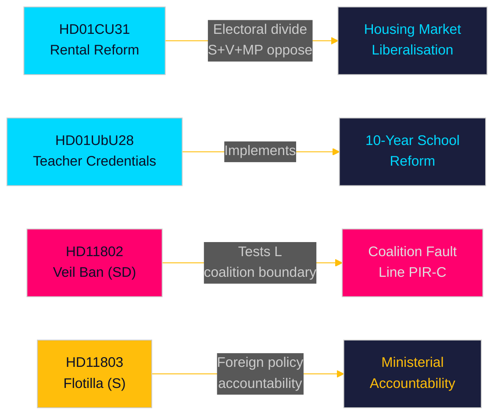

# Uitvoerend memorandum — Maandelijks overzicht 2026-05-10

**Auteur**: James Pether Sörling | **Datum**: 2026-05-10 | **Betrouwbaarheid**: HIGH [A1–B2]  
**Dekkingsperiode**: 2026-04-10 → 2026-05-10 (riksmöte 2025/26, 30-dagensvenster)  
**Dagen tot verkiezingen**: 126 (2026-09-13)

---

## Directe conclusie

Het mei 2026-venster onthult een Tidö-coalitie die wedijvert om structurele wetgevingshervormingen te leveren in de laatste parlementaire sprint voor de verkiezingen in september. De **liberalisering van de huurmarkt** (HD01CU31, inwerkingtreding 2026-07-01) is de meest impactvolle hervorming van de maand — een nieuwe private huurwet en een herzien blokverhuringmodel dat de Zweedse woningmarkt zal hervormen en de links-rechts electorale scheidslijn zal verscherpen. Tegelijkertijd bevorderen de **hervorming van lerarencertificaten** (HD01UbU28) en de **transparantieregels voor scholen** (HD01UbU20) de implementatie van de 10-jarige basisschool. De maand legt ook drie verantwoordingspunten bloot: de **Israëlische flottilje-interceptie** (HD11803) gericht op Zweedse burgers, de coalitiegrenzentest van de SD (HD11802 over een volledig sluierverbod dat L-afstemming vereist), en het **verlaten van plattelandsinfrastructuur** (HD11801 — Trafikverket verwijdert 25.000 straatlantaarns). PIR-D (SD–KD-energiedivergentie) en PIR-C (SD-partijcongres) zijn de primaire inlichtingenverzamelingsprioriteiten voor deze cyclus.

## Door dit memorandum ondersteunde beslissingen

1. **Woningmarkt inkadering**: Is HD01CU31 een beslissende Tidö-prestatie op de woningmarkt of een electorale aansprakelijkheid met S+V+MP-oppositie plus woningtekort?
2. **Coalitiegeens**: Zet SDs HD11802 (eis tot sluierverbod) het sociaal-liberale profiel van L onder druk in de laatste 126 dagen voor de verkiezingen — en creëert dit een drempelrisicoescalatie voor L?
3. **Buitenlands beleid blootstelling**: Creëert Israëls interceptie van de Global Sumud-flottilje (HD11803, Zweedse burgers aan boord) aanhoudende druk in de commissie buitenlandse zaken op minister Malmer Stenergard?

## 60-seconden lezing

- 🏠 **Huurmarkt** (HD01CU31): Nieuwe private huurwet + geliberaliseerd blokverhuringmodel goedgekeurd door CU. S+V+MP diende 5 voorbehouden in. Inwerkingtreding 2026-07-01. Dit is het vlaggenschip van de Tidö-regering op de woningmarkt. [A1]
- 🏫 **Scholen** (HD01UbU28 + HD01UbU20): Lerarenkwalificatieregels voor de 10-jarige basisschool, plus verlichting van het openbaarheidsbeginsel voor kleine particuliere scholen. Beide bevorderen de HC01UbU17-schoolhervormingsagenda. [A1]
- 🌍 **Flottilje** (HD11803): S-vraag aan de minister van Buitenlandse Zaken over Israëls interceptie van de Global Sumud-flottilje met Zweedse burgers aan boord. Ministerieel antwoord vereist. Buitenlands beleid verantwoordingsdruk. [A1]
- 🧕 **Sluierverbod** (HD11802): SD dringt formeel aan bij L-integratieminister Mohamsson op de uitvoering van het verbod op de gezichtsbedekkende sluier — test de coalitiediscipline in identiteitspolitiek. [A1]
- 💡 **Plattelandsverlichting** (HD11801): V-vraag over Trafikverkets verwijdering van 25.000 straatlantaarns in plattelandsgebieden. KD-infrastructuurminister in de hete stoel. [A1]
- 💼 **Belastingdomicilie** (HD10480): S-interpellatie over de vertraging in de definitie van "stadigvarande vistelse" sinds oktober 2025. Minister van Financiën Svantesson legt verantwoording af over de regels voor bedrijfsmobiliteit. [A1]
- ⚖️ **Handhaving** (HD01CU34): Hervorming van het burgerlijk executierecht — procedures voor beslaglegging op afstand gemoderniseerd. [A1]
- 🌐 **IPU** (HD01UU13): Activiteiten van de Interparlementaire Unie goedgekeurd. [A1]

## Belangrijkste vooruitblikkende trigger

**FI-01 (PIR-C/D)**: Uitkomst van de goedkeuring van het energieplatform op het SD-congres en positionering van de coalitie na het congres — de afstand de meest consequente vooruitblikkende indicator voor coalitie stabiliteit en verkiezingsscenario's voor september 2026. **Bewaken tot**: 2026-05-25.

## Betrouwbaarheidsniveau

Algehele betrouwbaarheid: **HIGH [A1–B2]** — Betänkanden-tekst direct opgehaald (A1); interpellatie-/vraagsamenvattingen opgehaald (A1); SD-congresuitkomst afgeleid uit voorafgaande PIR-context (B2 — verzameld maar niet bevestigd per 2026-05-10).

<!-- source-sha: 5d2996db1a079ddefd717d8d87fb80ddc1db619a -->
