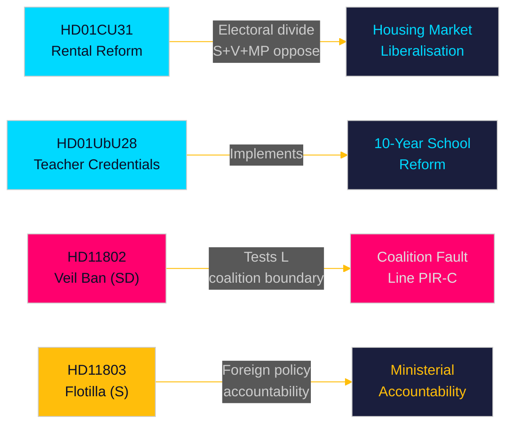

# Eksekutivt sammendrag — Månedsoversikt 2026-05-10

**Forfatter**: James Pether Sörling | **Dato**: 2026-05-10 | **Konfidens**: HIGH [A1–B2]  
**Dekningsvindu**: 2026-04-10 → 2026-05-10 (riksmøte 2025/26, 30-dagers vindu)  
**Dager til valg**: 126 (2026-09-13)

---

## Kortfattet konklusjon

Mai 2026-vinduet avslører en Tidö-koalisjon som kappløper med å levere strukturelle lovgivningsreformer i den siste parlamentariske sprinten før septembervalget. **Liberaliseringen av leiemarkedet** (HD01CU31, ikrafttreden 2026-07-01) er månedens reform med størst virkning — en ny privat leielov og revidert blokkutleiemodell som vil omforme Sveriges boligmarked og skjerpe den venstre-høyre valgskillen. Samtidig fremmer **lærerlegitimationsreformen** (HD01UbU28) og **skolenes transparensregler** (HD01UbU20) gjennomføringen av den 10-årige grunnskolen. Måneden avslører også tre ansvarlighetsbrennpunkter: **Israels flotilleinterksjon** (HD11803) rettet mot svenske statsborgere, SDs koalisjonsgrensetest (HD11802 om heldekket slørforbud som krever L-justering), og **landsbygdens infrastrukturabondonering** (HD11801 — Trafikverket fjerner 25 000 gatelykter). PIR-D (SD–KD-energidivergensen) og PIR-C (SD-kongressen) er de primære etterretningsinnsamlingsprioriteringene for denne syklusen.

## Beslutninger støttet av dette sammendraget

1. **Boligmarkedets innramning**: Er HD01CU31 en avgjørende Tidö-leveranse på boligmarkedet eller en valgansvar med S+V+MP-opposisjon pluss boligmangel?
2. **Koalisjonsgrense**: Presser SDs HD11802 (krav om slørforbud) Ls sosialliberale profil i de siste 126 dagene før valget — og skaper dette en terskelrisikoeskalasjon for L?
3. **Utenrikspolitisk eksponering**: Skaper Israels interksjon av Global Sumud-flotillen (HD11803, svenske statsborgere om bord) vedvarende press i utenrikskomiteen mot utenriksminister Malmer Stenergard?

## 60-sekunders lesning

- 🏠 **Leiemarkedet** (HD01CU31): Ny privat leielov + liberalisert blokkutleiemodell godkjent av CU. S+V+MP leverte 5 forbehold. Ikrafttreden 2026-07-01. Dette er Tidö-regjeringens flaggskip på boligmarkedet. [A1]
- 🏫 **Skoler** (HD01UbU28 + HD01UbU20): Regler for lærerkvalifikasjoner til 10-årig grunnskole, pluss offentlighetsprinsipp-lettelse for små frittstående skoler. Begge fremmer HC01UbU17 skolereformagendaen. [A1]
- 🌍 **Flotillen** (HD11803): S-spørsmål til utenriksministeren om Israels interksjon av den svenske-borgerbærende Global Sumud-flotillen. Ministerrespons påkrevd. Utenrikspolitisk ansvarspress. [A1]
- 🧕 **Slørforbud** (HD11802): SD presser formelt Ls integrasjonsminister Mohamsson om implementering av forbud mot heldekket slør — tester koalisjonsdisiplin i identitetspolitikk. [A1]
- 💡 **Landsbygdsbelysning** (HD11801): V-spørsmål om Trafikverkets fjerning av 25 000 gatelykter i landsbygdsområder. KDs infrastrukturminister i den varme stolen. [A1]
- 💼 **Skattemessig bosted** (HD10480): S-interpellasjon om forsinkelsen av definisjonen av "stadigvarande vistelse" siden oktober 2025. Finansminister Svantesson holdes ansvarlig for reglene om selskapsmobilitet. [A1]
- ⚖️ **Tvangsfullbyrdelse** (HD01CU34): Reform av sivilrettslig tvangsfullbyrdelseslov — fjernfogdningsforfarender modernisert. [A1]
- 🌐 **IPU** (HD01UU13): Den Interparlamentariske Unionens aktiviteter godkjent. [A1]

## Viktigste fremadrettede utløser

**FI-01 (PIR-C/D)**: SDs kongress' vedtakelse av energiplattform og posisjonering etter kongressen — den enkelt mest konsekvensrike fremadrettede indikatoren for koalisjonsstabilitet og valgscenarier for september 2026. **Overvåkes til**: 2026-05-25.

## Konfidensnivå

Samlet konfidens: **HIGH [A1–B2]** — Betänkanden-tekst direkte hentet (A1); interpellasjons-/spørsmålssammendrag hentet (A1); SDs kongressresultat utledet fra foregående PIR-kontekst (B2 — innsamlet men ubekreftet per 2026-05-10).

<!-- source-sha: 5d2996db1a079ddefd717d8d87fb80ddc1db619a -->
