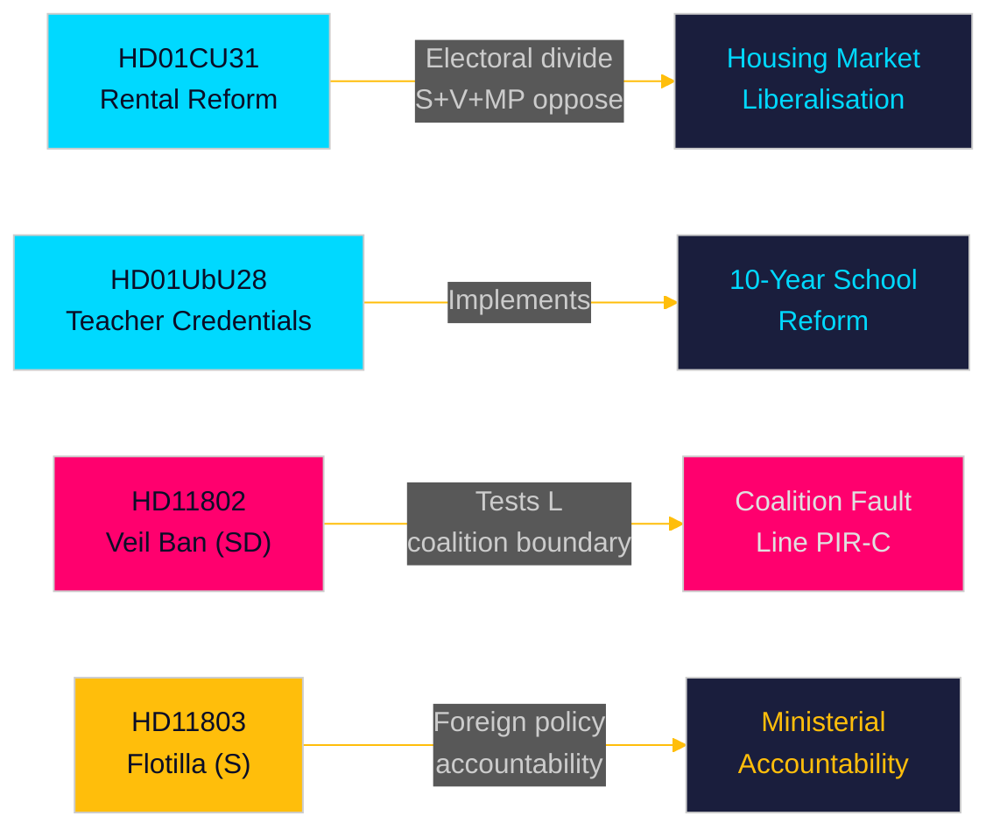

# Exekutiv sammanfattning — Månadsöversikt 2026-05-10

**Författare**: James Pether Sörling | **Datum**: 2026-05-10 | **Konfidens**: HIGH [A1–B2]  
**Täckningsperiod**: 2026-04-10 → 2026-05-10 (riksmöte 2025/26, 30-dagars fönster)  
**Dagar till val**: 126 (2026-09-13)

---

## Kortfattad sammanfattning

Maj 2026-fönstret avslöjar en Tidö-koalition i kapplöpning för att leverera strukturella lagstiftningsreformer i det sista parlamentariska spurten inför septembervalet. **Hyresmarknadsavregleringen** (HD01CU31, ikraftträdande 2026-07-01) är månadens mest högnivåreform — en ny privat hyreslag och reviderad blockuthyrningsmodell som kommer att omforma Sveriges bostadsmarknad och skärpa den vänster-höger-politiska skiljelinjen. Samtidigt befäster **lärarlegitimationsreformen** (HD01UbU28) och **transparensreglerna för skolor** (HD01UbU20) implementeringen av den 10-åriga grundskolan. Månaden exponerar även tre ansvarsutkrävande-flashpoints: **Israels flotiljainterception** (HD11803) riktad mot svenska medborgare, SD:s koalitionsgräns-test (HD11802 om heltäckande slöja som kräver L-anpassning), och **landsbygdens infrastrukturövergivande** (HD11801 — Trafikverket tar bort 25 000 gatubelysningar). PIR-D (SD–KD-energidivergensen) och PIR-C (SD-kongressen) är de primära underrättelseinsamlingsprioriteterna för denna cykel.

## Beslut som stöds av denna sammanfattning

1. **Bostadsmarknadens inramning**: Är HD01CU31 en avgörande Tidö-leverans för bostadsmarknaden eller en valansvarighet med S+V+MP-opposition plus bostadsbristen?
2. **Koalitionsgräns**: Pressar SD:s HD11802 (krav om slöjförbud) L:s socialliberala profil under de sista 126 dagarna innan valet — och skapar detta en tröskelriskeskalation för L?
3. **Utrikespolitisk exponering**: Skapar Israels interception av Global Sumud-flotiljan (HD11803, svenska medborgare ombord) ett uthålligt tryck i utrikesutskottet mot utrikesminister Malmer Stenergard?

## 60-sekunders läsning

- 🏠 **Hyresmarknaden** (HD01CU31): Ny privat hyreslag + avreglerad blockuthyrningsmodell godkänd av CU. S+V+MP lämnade 5 reservationer. Ikraftträdande 2026-07-01. Detta är Tidö-regeringens flaggskepp på bostadsmarknaden. [A1]
- 🏫 **Skolor** (HD01UbU28 + HD01UbU20): Regler för lärarlegitimation för 10-årig grundskola, plus offentlighetsprincip-lättnad för små fristående skolor. Båda befäster HC01UbU17 skolreformagendan. [A1]
- 🌍 **Flotiljan** (HD11803): S-fråga till utrikesministern om Israels interception av den svenska-medborgarbärande Global Sumud-flotiljan. Ministersvar krävs. Ansvarsutkrävandestryck i utrikespolitiken. [A1]
- 🧕 **Slöjförbud** (HD11802): SD pressar formellt L:s integrationsminister Mohamsson om implementeringen av heltäckande slöjförbud — testar koalitionsdisciplinen i identitetspolitiken. [A1]
- 💡 **Landsbygdsbelysning** (HD11801): V-fråga om Trafikverkets borttagning av 25 000 gatubelysningar i landsbygdsområden. KD:s infrastrukturminister i det varma sätet. [A1]
- 💼 **Skattemässig hemvist** (HD10480): S-interpellation om fördröjningen av definitionen av "stadigvarande vistelse" sedan oktober 2025. Finansminister Svantesson ställs till svars för bolagsrörlighetens regler. [A1]
- ⚖️ **Verkställighet** (HD01CU34): Reform av civilrättslig verkställighetslag — fjärrfogdningsförfaranden moderniserade. [A1]
- 🌐 **IPU** (HD01UU13): Interparlamentariska unionens verksamheter godkända. [A1]

## Viktigaste framåtindikatorn

**FI-01 (PIR-C/D)**: SD-kongressens utfall av energiplattformadoptionen och positionering efter kongressen — den enskilt mest konsekvensrika framåtindikatorn för koalitionsstabilitet och valscenarier för september 2026. **Bevakas till**: 2026-05-25.

## Konfidensnivå

Samlad konfidens: **HIGH [A1–B2]** — Betänkanden-text direkt hämtad (A1); interpellations-/frågsammanfattningar hämtade (A1); SD-kongressens utfall infererat från tidigare PIR-kontext (B2 — insamlat men obekräftat per 2026-05-10).

<!-- source-sha: 5d2996db1a079ddefd717d8d87fb80ddc1db619a -->
