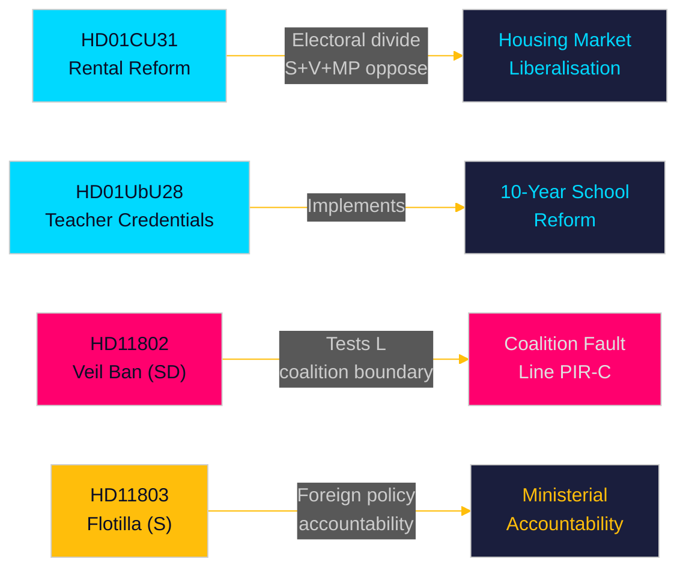

# 执行简报 — 月度评述 2026-05-10

**作者**: James Pether Sörling | **日期**: 2026-05-10 | **置信度**: HIGH [A1–B2]  
**覆盖期间**: 2026-04-10 → 2026-05-10 (议会期 2025/26，30天窗口)  
**距选举天数**: 126天 (2026-09-13)

---

## 即时结论

2026年5月窗口揭示了Tidö联合政府正在争分夺秒，在9月选举前的最后议会冲刺阶段推进结构性立法改革。**租赁市场自由化**（HD01CU31，2026-07-01生效）是本月影响最大的改革——新的私人租赁法和经修订的整栋租赁模式将重塑瑞典住房市场，并加剧左右翼选举分歧。与此同时，**教师资质改革**（HD01UbU28）和**学校透明度规则**（HD01UbU20）推进了10年制小学的实施。本月还暴露出三个问责热点：**以色列拦截船队**（HD11803）针对瑞典公民、SD联合边界测试（HD11802关于要求L党配合的全脸面纱禁令），以及**农村基础设施弃置**（HD11801——Trafikverket撤除25,000盏路灯）。PIR-D（SD–KD能源分歧）和PIR-C（SD党代会）是本周期首要情报收集优先事项。

## 本简报支持的决策

1. **住房市场框架**：HD01CU31是Tidö联合政府在住房市场的决定性成果，还是面对S+V+MP反对及住房短缺的选举负担？
2. **联合边界**：SD的HD11802（面纱禁令要求）是否在选举前最后126天向L党的社会自由主义立场施压——这是否为L党造成门槛风险升级？
3. **外交政策风险**：以色列拦截Global Sumud船队（HD11803，瑞典公民在船上）是否在外交事务委员会中对Malmer Stenergard外交部长造成持续压力？

## 60秒速读

- 🏠 **租赁市场**（HD01CU31）: 新私人租赁法 + 自由化整栋租赁模式经CU批准。S+V+MP提交5项保留意见。2026-07-01生效。这是Tidö政府住房市场的旗舰改革。[A1]
- 🏫 **学校**（HD01UbU28 + HD01UbU20）: 10年制小学教师资质规定，以及对小型私立学校公开原则的豁免。两项均推进HC01UbU17学校改革议程。[A1]
- 🌍 **船队**（HD11803）: S就以色列拦截载有瑞典公民的Global Sumud船队一事向外交部长提问。需要部长答复。外交政策问责压力。[A1]
- 🧕 **面纱禁令**（HD11802）: SD正式向L党融合部长Mohamsson施压要求实施全脸面纱禁令——测试联合在身份政治上的纪律。[A1]
- 💡 **农村照明**（HD11801）: V就Trafikverket在农村地区撤除25,000盏路灯提问。KD基础设施部长处于压力焦点。[A1]
- 💼 **税务居住地**（HD10480）: S就2025年10月以来"stadigvarande vistelse"定义延迟提出质询。财政部长Svantesson面对企业流动性规则的问责。[A1]
- ⚖️ **民事执行**（HD01CU34）: 民事强制执行法改革——远程扣押程序现代化。[A1]
- 🌐 **IPU**（HD01UU13）: 各国议会联盟活动获批。[A1]

## 最重要的前瞻触发因素

**FI-01 (PIR-C/D)**: SD党代会能源平台采纳结果及党代会后联合定位——联合稳定性和2026年9月选举情景的最具决定性前瞻指标。**监测截止**: 2026-05-25。

## 置信度等级

总体置信度: **HIGH [A1–B2]** — Betänkanden文本直接获取(A1)；质询/提问摘要已获取(A1)；SD党代会结果从此前PIR背景推断(B2——已收集但截至2026-05-10尚未确认)。

<!-- source-sha: 5d2996db1a079ddefd717d8d87fb80ddc1db619a -->
