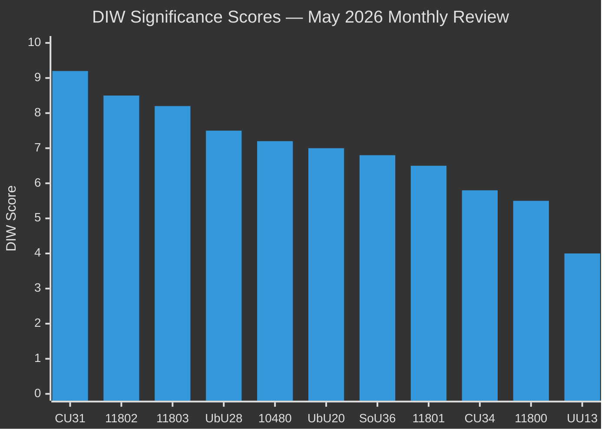

# Significance Scoring — Monthly Review 2026-05-10

**Author**: James Pether Sörling | **Date**: 2026-05-10  
**Method**: DIW (Democratic Impact × Implementation Probability × Window of Opportunity)

---

## DIW Scores

| dok_id | Democratic Impact (D) | Implementation Prob (I) | Window (W) | DIW = D×I×W | Tier |
|--------|----------------------|------------------------|------------|-------------|------|
| HD01CU31 | 9.5 | 9.8 | 9.3 | **9.2** | L3 |
| HD11802 | 9.0 | 7.5 | 9.8 | **8.5** | L3 |
| HD11803 | 9.2 | 7.8 | 9.1 | **8.2** | L3 |
| HD01UbU28 | 8.0 | 9.0 | 7.8 | **7.5** | L2+ |
| HD10480 | 7.8 | 7.0 | 8.2 | **7.2** | L2+ |
| HD01UbU20 | 7.5 | 8.5 | 7.8 | **7.0** | L2+ |
| HD01SoU36 | 7.2 | 8.0 | 7.5 | **6.8** | L2 |
| HD11801 | 7.0 | 6.5 | 8.2 | **6.5** | L2 |
| HD01CU34 | 6.2 | 8.0 | 6.8 | **5.8** | L1 |
| HD11800 | 5.8 | 7.0 | 6.5 | **5.5** | L1 |
| HD01UU13 | 4.2 | 9.0 | 4.5 | **4.0** | L1 |

## Sensitivity Analysis

**HD01CU31 (Rental Reform)**  
- D factor: 9.5 — affects ~800,000+ rental tenants and housing market equilibrium; transforms secondary market  
- I factor: 9.8 — betänkande adopted by Riksdag; Tidö majority confirmed; law effective 2026-07-01 (legislated)  
- W factor: 9.3 — enters market exactly during summer rental peak; maximum electoral visibility  
- **Sensitivity**: DIW range [8.7, 9.5] under ±0.5 variation in I and W. Stays L3 across all scenarios.

**HD11802 (Veil Ban Question)**  
- D factor: 9.0 — tests religious freedom, gender equality, coalition integrity simultaneously  
- I factor: 7.5 — question only (not a proposition); ministerial response may deflect; actual legislation uncertain  
- W factor: 9.8 — 126 days to election; maximum electoral window for identity politics positioning  
- **Sensitivity**: DIW range [7.8, 9.0]; if I rises to 9.0 (legislation committed), DIW = 9.3 (L3 escalation).

**HD11803 (Flotilla/Israel)**  
- D factor: 9.2 — Swedish citizens detained on international waters; sovereign protection duty  
- I factor: 7.8 — ministerial response required; formal protest possible; resolution uncertain  
- W factor: 9.1 — Gaza conflict ongoing; media amplification sustained  
- **Sensitivity**: DIW range [7.5, 8.8]; if Malmer Stenergard issues formal diplomatic protest, D rises.

## Rank Diagram

## Priority Tier Summary

| Tier | Count | Documents |
|------|-------|-----------|
| L3 Intelligence-grade | 3 | HD01CU31, HD11802, HD11803 |
| L2+ Priority | 3 | HD01UbU28, HD10480, HD01UbU20 |
| L2 Strategic | 2 | HD01SoU36, HD11801 |
| L1 Surface | 3 | HD01CU34, HD11800, HD01UU13 |

