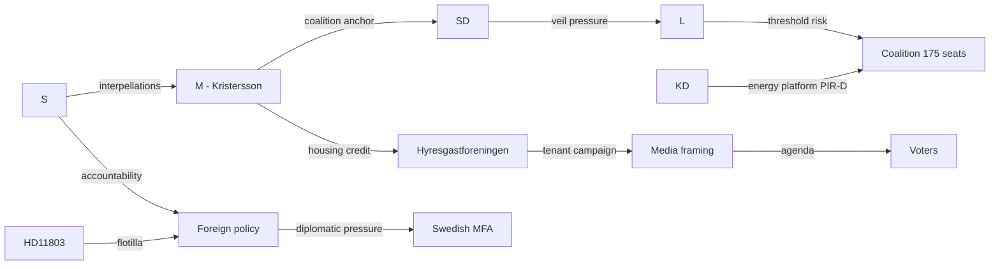

# Stakeholder Perspectives — Monthly Review 2026-05-10

**Author**: James Pether Sorling | **Date**: 2026-05-10  
**Method**: 6-lens stakeholder matrix; named actors; influence network

---

## 6-Lens Stakeholder Matrix

| Actor | Policy Position | Coalition Impact | Electoral Salience | Communication Channel | Key Concern |
|-------|----------------|-----------------|-------------------|----------------------|-------------|
| M (Ulf Kristersson) | Housing: HD01CU31 delivers | Anchor of coalition | HIGH — PM leadership | Press conferences, riksdagen.se | Rental reform credit claim |
| SD (Jimmie Akesson) | HD11802 veil ban: escalation tool | Tests L boundaries | HIGH — identity politics | SD press, social media | Voter differentiation vs L |
| L (Johan Pehrson) | HD11802 veil ban: under pressure | Coalition preservation vs base | HIGH — threshold risk | L press releases | Social-liberal identity survival |
| KD (Ebba Busch) | Rural infrastructure (HD11801): defensive | PIR-D energy: coalition friction risk | MEDIUM | KD press, TV debates | Rural Sweden credibility |
| S (Magdalena Andersson) | HD01CU31 reservation leader; HD10480 accountability | Opposition energy building | HIGH | Interpellations, party press | Rental reversal mandate |
| V | HD01CU31 reservation co-signatory | Opposition coordination | MEDIUM | Committee reservations | Tenant rights |
| MP | HD01UbU20 transparency relief opposed | Opposition flank | LOW-MEDIUM | Committee statements | Private school accountability |
| Hyresgastforeningen | HD01CU31 strongest critic | Non-parliamentary actor | HIGH (tenant voters) | Media statements, campaigns | Block rental model impact on tenants |
| Swedish municipalities | HD11801 lighting funding | Infrastructure policy | MEDIUM | SKR lobbying, media | Rural service delivery |
| Israel (MFA) | HD11803 flotilla diplomatic friction | International | MEDIUM | Diplomatic channels | Consular bilateral relations |

## Influence Network (Mermaid)

## Named Actors: Key May 2026 Activity

| Name | Role | Activity | Document |
|------|------|----------|----------|
| Magdalena Andersson | S leader | Opposition strategy orchestration | HD10480, reservations |
| Elisabeth Svantesson | Finance Minister (M) | Interpellation target: tax residency | HD10480 |
| Gunnar Strommer | Justice Minister (M) | Interpellation target: small business extortion | HD11800 |
| Ebba Busch | Energy/KD | Rural lighting questioned | HD11801 |
| Maria Malmer Stenergard | Migration Minister (M) | Flotilla accountability target | HD11803 |
| Roger Haddad | L deputy | Veil ban position under S/SD scrutiny | HD11802 |
| Mohamadi MP (L) | MP target | Veil ban question from SD Gholam Ali Pour | HD11802 |
