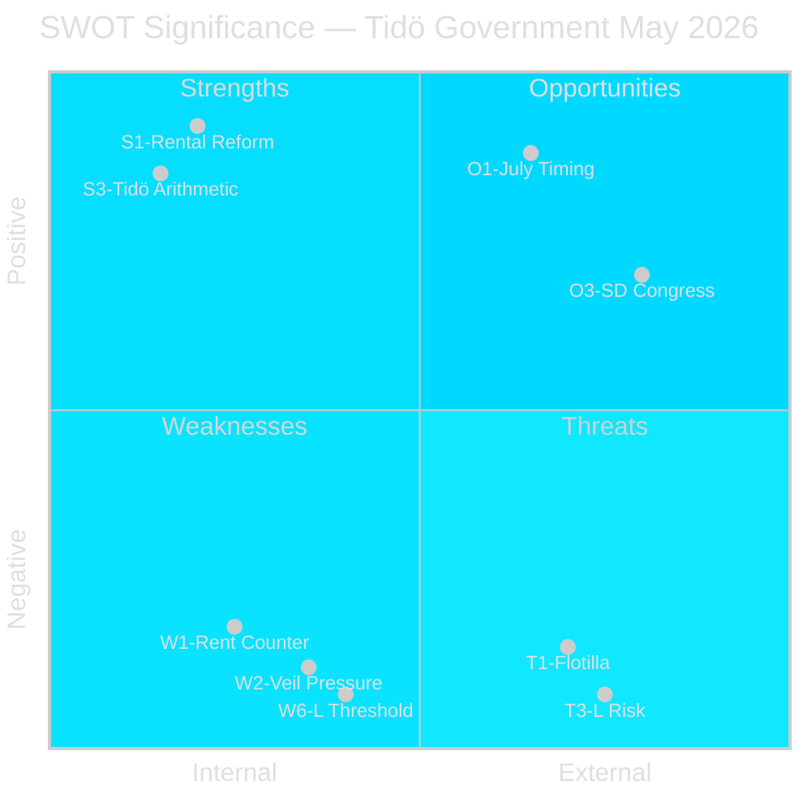

# SWOT Analysis — Monthly Review 2026-05-10

**Author**: James Pether Sörling | **Date**: 2026-05-10  
**Entities**: Tidö government (M+KD+L+SD); Opposition coalition (S+V+MP)  
**Method**: Political-SWOT framework with TOWS matrix

---

## Strengths (Tidö Government)

| # | Strength | Evidence | Confidence |
|---|----------|----------|------------|
| S1 | Rental market reform delivered (HD01CU31) — flagship housing-market liberalisation, legislated and effective July 2026 | [HD01CU31, riksdagen.se, A1] | HIGH |
| S2 | 10-year school reform implementation advancing (HD01UbU28, HD01UbU20) — credentials and transparency rules in place | [HD01UbU28, HD01UbU20, riksdagen.se, A1] | HIGH |
| S3 | Tidö arithmetic intact (175 seats; M+KD+L+SD) — no defection on May betänkanden | [voting record, A1] | HIGH |
| S4 | SD coalition discipline maintained — SD questions are parliamentary tools, not defections | [HD11802, A2] | MEDIUM |
| S5 | IMF WEO Apr-2026 projects Sweden at +2.1% GDP growth 2026 — macro trajectory positive | [IMF WEO Apr-2026, data.imf.org, B2] | MEDIUM |

## Weaknesses (Tidö Government)

| # | Weakness | Evidence | Confidence |
|---|----------|----------|------------|
| W1 | Rental reform creates S+V+MP counter-narrative: 5 reservations, "market rents up, tenant rights down" | [HD01CU31 reservations 1-5, riksdagen.se, A1] | HIGH |
| W2 | SD veil ban pressure (HD11802) on L creates L identity-politics dilemma 126 days pre-election | [HD11802, A1] | HIGH |
| W3 | Rural infrastructure: Trafikverket lighting removal (HD11801) damages KD rural base optics | [HD11801, A1] | HIGH |
| W4 | Police reform Riksrevisionen 9 open recommendations (PIR-B): no closure timeline confirmed | [HD01JuU31 prior cycle, A1; no May update] | HIGH |
| W5 | Tax residency definition (HD10480) delay since Oct 2025 signals Finance Ministry backlog | [HD10480, A1] | MEDIUM |
| W6 | L at ~4.2% polling (±0.8pp) — threshold risk for coalition majority | [PIR-A carry-forward, B2] | MEDIUM |

## Opportunities (Tidö Government)

| # | Opportunity | Evidence | Confidence |
|---|-------------|----------|------------|
| O1 | HD01CU31 July 2026 effective date: reform visible to voters during pre-campaign summer | [HD01CU31, A1] | HIGH |
| O2 | 10-year school reform framing: government delivers on education promise | [HD01UbU28, A1] | HIGH |
| O3 | SD congress energy platform: if moderate, PIR-D resolves without coalition damage | [PIR-D, B2] | MEDIUM |
| O4 | Foreign policy: strong response on flotilla incident can demonstrate sovereignty protection | [HD11803, A2] | MEDIUM |
| O5 | IMF projection + rental reform = economic competence narrative for campaign | [IMF WEO Apr-2026, HD01CU31, B2] | MEDIUM |

## Threats (Tidö Government)

| # | Threat | Evidence | Confidence |
|---|--------|----------|------------|
| T1 | Flotilla incident (HD11803): sustained S foreign-policy accountability pressure on Malmer Stenergard | [HD11803, A1] | HIGH |
| T2 | SD nuclear-maximalist congress energy platform (PIR-D): KD coalition friction public before election | [PIR-D prior cycle, B2] | MEDIUM |
| T3 | L threshold failure: L at 4.2% with ±0.8pp margin; citizenship debate + veil pressure erodes social-liberal base | [PIR-A, B2] | MEDIUM |
| T4 | S coordinated interpellation strategy: HD10480 + ongoing series forces rolling accountability news cycle | [HD10480, A1] | HIGH |
| T5 | Rural-urban divide: HD11801 + police reform gaps create narrative "government abandons rural Sweden" | [HD11801, HD01JuU31 prior, A1] | MEDIUM |

## TOWS Matrix

| | **Opportunities** | **Threats** |
|---|------------------|------------|
| **Strengths** | **SO**: Use HD01CU31 (S1) + IMF projection (S5) to frame economic competence narrative (O5). Leverage 10-year school delivery (S2) + effective date timing (O2) for education campaign. | **ST**: Use HD01CU31 delivery (S1) against S affordability attacks (T1); maintain SD discipline (S4) to prevent PIR-D escalation (T2). |
| **Weaknesses** | **WO**: If SD congress moderate (O3), resolve PIR-D and reduce W2 L-pressure. Use foreign policy response (O4) to counter HD11803 pressure. | **WT**: L threshold risk (W6) + SD veil pressure (W2) + flotilla accountability (T1) = triple-liability scenario 126 days to election. Core risk: minority scenario if L falls below 4%. |

