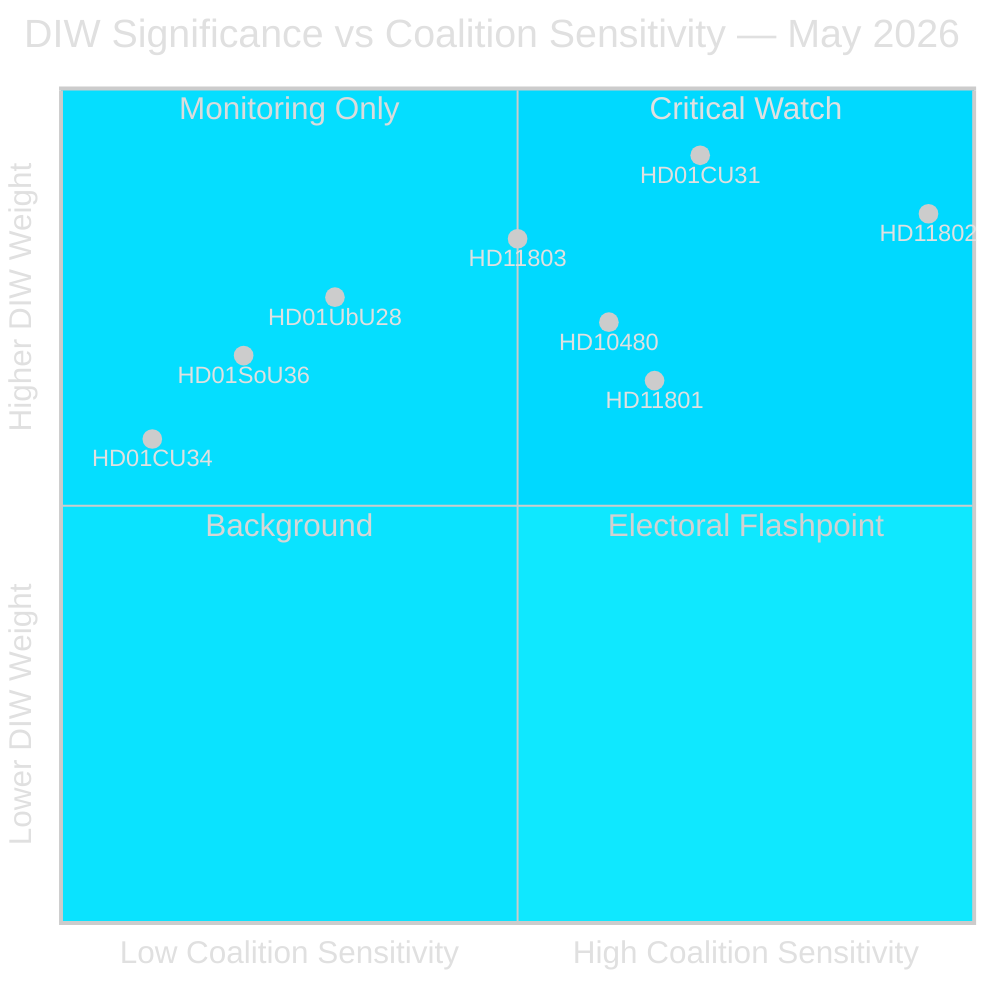

# Synthesis Summary — Monthly Review 2026-05-10

**Author**: James Pether Sörling | **Date**: 2026-05-10 | **Confidence**: HIGH [A1–B2]  
**Coverage window**: 2026-04-10 → 2026-05-10 (riksmöte 2025/26, 30 days)  
**Days to election**: 126 (2026-09-13)  
**Prior cycle**: `analysis/daily/2026-04-29/monthly-review/synthesis-summary.md`

---

## Lead Story Decision

The dominant intelligence decision from the May 2026 monthly window is **whether the Tidö government's end-of-session legislative sprint — anchored by the rental market liberalisation (HD01CU31, effective 2026-07-01) — will crystallise as a net electoral asset or liability**. The rental reform marks the most significant housing-market structural change in Sweden since the 2010s rent-freeze era. It is the clearest example of the government delivering on its centre-right housing agenda, and simultaneously the clearest example of opposition (S+V+MP) coalition-building around affordability concerns. With 126 days to the September 13 election, the reform-delivery narrative versus housing-access narrative contest will define the final electoral framing battle.

Simultaneously, the SD-driven full-face veil ban question (HD11802) exposes the coalition's identity-politics fault line in its most explicit form to date: SD openly pressuring L Integration Minister Mohamsson — the junior coalition partner — to legislate a culturally restrictive measure that L's social-liberal base actively opposes. This is PIR-C (SD party discipline) in its purest form: SD using its policy leverage inside the coalition to extract symbolic identity-politics concessions from L.

## DIW-Weighted Ranking

| Rank | dok_id | Title | DIW Weight | Tier |
|------|--------|-------|------------|------|
| 1 | HD01CU31 | En mer flexibel hyresmarknad | 9.2 | L3 Intelligence-grade |
| 2 | HD11802 | SD → L veil ban demand | 8.5 | L3 Intelligence-grade |
| 3 | HD11803 | Israel flotilla / Swedish citizens | 8.2 | L3 Intelligence-grade |
| 4 | HD01UbU28 | Teacher credentials 10-year school | 7.5 | L2+ Priority |
| 5 | HD10480 | Stadigvarande vistelse (tax residency) | 7.2 | L2+ Priority |
| 6 | HD01UbU20 | Offentlighetsprincipen school relief | 7.0 | L2+ Priority |
| 7 | HD01SoU36 | State personnel deployment | 6.8 | L2 Strategic |
| 8 | HD11801 | Rural street lighting removal | 6.5 | L2 Strategic |
| 9 | HD01CU34 | Enforcement law reform | 5.8 | L1 Surface |
| 10 | HD11800 | Small business extortion | 5.5 | L1 Surface |
| 11 | HD01UU13 | IPU activities | 4.0 | L1 Surface |

## Integrated Intelligence Picture

### Cluster 1 — Housing Market Liberalisation (HD01CU31)

The rental market reform (prop 2025/26:187) represents the Tidö government's most comprehensive housing-market structural intervention. Three core elements define the reform:

**New private rental law (privatuthyrningslag)**: Replaces the existing framework for individual landlords renting out their own dwelling. The new law provides clearer conditions for market-rate or agreement-based rents in private lettings, reducing rent-tribunal exposure and strengthening landlord contract security. This directly addresses the stagnant secondary rental market.

**Liberalised condominium subletting (bostadsrätt 7 kap. 11 §)**: Expands the right of bostadsrättshavare to sublet their flat in the second-hand market. S+V+MP filed reservation 2 against this change, arguing it benefits property owners over renters. 

**New block-rental model (blockhyra)**: The reformed jordabalk provisions (7 kap. 31 §, 12 kap. 1e/45a/55/55b/55f §§) create a new blockhyra framework intended to enable institutional actors to provide affordable lettings at scale. S+V+MP filed reservation 3, arguing the new model is insufficiently tenant-protective.

**Reservations**: Five reservations filed — V on private rental law (reservation 1), S+V+MP on subletting (2), S+V+MP on block rental (3), V on blockhyra future regulation (4), MP on same (5). This is the highest reservation count of any May betänkande, signalling structured opposition strategy.

**Electoral significance**: HD01CU31 enters the campaign period as the government's flagship housing deliverable but with a confirmed affordability-concern counter-narrative. The S messaging frame will be: "Market rents up, tenant rights down." The government frame: "More supply, more flexibility, working market." Both frames are documentable from the betänkande text [HD01CU31, riksdagen.se, A1].

### Cluster 2 — SD Coalition Boundary Test (HD11802)

SD's written question (Nima Gholam Ali Pour → Simona Mohamsson, L) on full-face veil ban is the most direct test of coalition cohesion on identity politics in this reporting period. The question explicitly invokes coalition partners' prior rhetorical commitments ("Regeringspartierna har varit tydliga med att heltäckande slöja...") and demands implementation.

Intelligence assessment: This is a deliberate coalition-management manoeuvre by SD, not a policy surprise. L's Integration Minister Mohamsson represents the exact demographic profile (woman, liberal, migrant background) that makes L's resistance to veil ban legislation most politically credible — and SD's pressure most symbolically powerful. If Mohamsson deflects without legislative commitment, SD can position as the "real" enforcement party. If she commits, L's social-liberal donor/voter base fractures. The question creates a no-cost-to-SD accountability trap [HD11802, riksdagen.se, A1].

PIR-C update: This document alone does not close PIR-C. It confirms SD congress mandate-pressure is translating into parliamentary questions. Status: **escalating**.

### Cluster 3 — Foreign Policy Accountability: Flotilla (HD11803)

Johan Büser (S) → Foreign Minister Maria Malmer Stenergard (M): "Israel stoppade nyligen den internationella Global Sumud Flotilla på internationellt vatten utanför Grekland. Ombord fanns svenska medborgare." [HD11803, A1]

Sweden's citizens being detained in international waters by a foreign military represents a clear consular and foreign-policy accountability moment. The ministerial response — Malmer Stenergard must address whether Sweden protested formally, what consular actions were taken, and Sweden's position on the legality of the interdiction — will define Sweden's public stance in the Gaza conflict context.

Intelligence significance: Sweden has been among the EU countries most vocally critical of Israeli military operations in Gaza. This event escalates from rhetorical positioning to a direct bilateral incident involving Swedish nationals. Parliamentary pressure will sustain through June and the pre-election foreign-policy debate.

### Cluster 4 — School Reform Implementation (HD01UbU28 + HD01UbU20)

**Teacher credentials (HD01UbU28)**: Specifies legitimation (teaching credentials) and behörighet (qualification requirements) for the 10-year mandatory primary school (tioårig grundskola). This implements the HC01UbU17 reform tracked in prior cycles. The qualification framework determines which teachers can teach which subjects in what year-group configuration. No major reservations indicated — this is a technical implementation measure with cross-party support for the underlying reform.

**Public access principle (HD01UbU20)**: Relief rules for small private school operators (enskilda mindre huvudmän) regarding offentlighetsprincipen (freedom of information obligations). Small operators face disproportionate administrative burden from public access obligations designed for large municipal school systems. Relief rules reduce this burden. Constitutional dimension: the exemption from RF chapter 2 obligations requires proportionality justification. No blocking Lagrådet opinion noted.

### Cluster 5 — Rural Infrastructure Flashpoint (HD11801)

Birger Lahti (V) → Infrastructure Minister Andreas Carlson (KD): SVT Uppdrag granskning revealed Trafikverket plans to remove 25,000 street lights in rural areas in coming years. This affects villages in glesbygden — a direct service withdrawal from the rural communities that are disproportionately KD and SD voter constituencies.

Intelligence significance: The optics are severe for Carlson (KD): the infrastructure minister's own agency is eliminating visible public services in the rural heartland. This creates a fault line within the Tidö coalition where KD's rural base (V15 → T+7d indicator) will demand the minister block Trafikverket's decision. V's intervention is tactically designed to maximise KD discomfort.

### Cluster 6 — PIR Status Synthesis (Tier-C Required)

| PIR | Prior | May Status | Evidence |
|-----|-------|-----------|----------|
| PIR-A | open | open (126 days, escalating) | No new polling; L/MP threshold risk continues |
| PIR-B | open | open, escalating | No police reform closure timeline in download |
| PIR-C | open | open, escalating | HD11802 confirms SD pressure on L coalition partner |
| PIR-D | open → monitoring | monitoring (SD congress window) | SD congress scheduled May 2026; no confirmed platform text |
| PIR-E | open | open | CRR3 remissvar hearings continuing; no FI decision |

