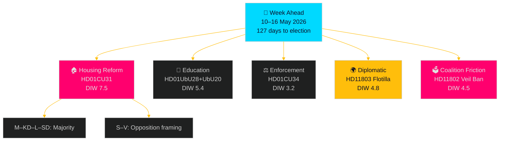
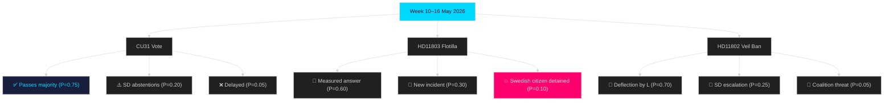

## Executive Brief
<!-- source: executive-brief.md :: https://github.com/Hack23/riksdagsmonitor/blob/main/analysis/daily/2026-05-10/week-ahead/executive-brief.md -->

### 🎯 BLUF

The week of 10–16 May 2026 sees the Swedish Riksdag's Civil Affairs Committee (CU) advancing landmark rental-market liberalisation through the new privatuthyrningslag (HD01CU31) and enforcement modernisation (HD01CU34), while the Education Committee (UbU) finalises school-transparency and teacher-credential reforms ahead of the 2028 ten-year elementary school transition. Coalition-internal tension surfaces as Sweden Democrats press the Liberal education minister on a full veil ban (HD11802) and Social Democrats use interpellations to challenge the Finance Minister on tax-residency ambiguity (HD10480). The flotilla incident in Greek waters involving Swedish citizens raises Sweden–Israel diplomatic temperature one week before the European Affairs Council (HD11803).

### 🧭 3 Decisions This Brief Supports

1. **Follow the Riksdag schedule**: Prioritise monitoring of CU31 plenary vote (expected mid-week) — the rental-market liberalisation is the most politically contested legislation of this parliamentary sitting.
2. **Track coalition cohesion signals**: The SD–L friction on the veil ban (HD11802) and SD's divergence on the Israel flotilla question (HD11803) are early signals for the autumn 2026 election campaign positioning.
3. **Monitor diplomatic escalation**: The Global Sumud Flotilla incident requires daily tracking; Foreign Minister Stenergard's response to HD11803 will set the Swedish diplomatic tone ahead of the European Affairs Council.

### Context: Election Countdown

Sweden's **general election falls on 13 September 2026 — 127 days from now**. Every contested committee report and interpellation carries a **1.5× DIW significance multiplier** in this analysis. The governing coalition (M–KD–L with SD supply-and-confidence support) is managing three simultaneously contested files: housing policy (where S and V oppose liberalisation), school policy (where coalition unity holds but SD–L friction is visible), and foreign policy (where SD and the government are under opposition pressure on the Gaza/Israel file).

### Key Intelligence Judgments

- **KJ-1 [HIGH confidence — B2]**: The CU31 privatuthyrningslag will pass with M–KD–L–SD votes; S and V will vote against, framing the bill as a gift to landlords ahead of the election. Likely [horizon:week] to produce substantive media coverage through Thursday.
- **KJ-2 [MEDIUM confidence — C2]**: The SD–L tension on HD11802 (full veil ban) remains at the verbal-pressure level and will not break coalition unity before the election; SD will use this issue for campaign positioning only.
- **KJ-3 [MEDIUM confidence — C3]**: The Israel flotilla incident (HD11803) will produce a cautious written answer from Foreign Minister Stenergard without naming specific diplomatic actions; opposition calls for stronger condemnation are unlikely [horizon:week] to alter government posture.

### What to Watch

| Trigger | Threshold | Horizon |
|---------|-----------|---------|
| CU31 plenary vote outcome | Any dissenting coalition vote | This week [horizon:week] |
| Foreign Minister Stenergard answers HD11803 | Strong diplomatic language / sanctions | 2–5 days [horizon:72h] |
| SD–L public statements on veil ban | Coalition commitment or break | This week [horizon:week] |
| IMF Sweden GDP revision | Update from Apr-2026 WEO vintage | Monthly [horizon:month] |

## Reader Intelligence Guide

Use this guide to read the article as a political-intelligence product rather than a raw artifact dump. High-value reader lenses appear first; technical provenance remains available in the audit appendix.

| Icon | Reader need | What you'll get |
|---|---|---|
| 📊 | [BLUF and editorial decisions](#rm-executive-brief) | fast answer to what happened, why it matters, who is accountable, and the next dated trigger |
| 🧠 | [Synthesis Summary](#rm-synthesis-summary) | evidence-anchored narrative consolidating primary sources into one coherent story line |
| 🎯 | [Key Judgments](#rm-intelligence-assessment--key-judgments) | confidence-bearing political-intelligence conclusions and collection gaps |
| 📈 | [Significance scoring](#rm-significance-scoring) | why this story outranks or trails other same-day parliamentary signals |
| 👥 | [Stakeholder Perspectives](#rm-stakeholder-perspectives) | winners, losers and undecided actors with stake-weighted positions and pressure points |
| 🔢 | [Coalition Mathematics](#rm-coalition-mathematics) | parliamentary arithmetic showing exactly who can pass or block this measure and at what margin |
| 📋 | [Voter Segmentation](#rm-voter-segmentation) | voter-bloc exposure: which demographics gain, lose or shift on this issue |
| 🔭 | [Forward indicators](#rm-forward-indicators) | dated watch items that let readers verify or falsify the assessment later |
| 🔮 | [Scenarios](#rm-scenario-analysis) | alternative outcomes with probabilities, triggers, and warning signs |
| 🗳️ | [Election 2026 Analysis](#rm-election-2026-analysis) | electoral implications for the 2026 cycle — seats at stake, swing voters and coalition viability |
| ⚠️ | [Risk assessment](#rm-risk-assessment) | policy, electoral, institutional, communications, and implementation risk register |
| 🧮 | [SWOT Analysis](#rm-swot-analysis) | strengths, weaknesses, opportunities and threats matrix grounded in primary-source evidence |
| 🛡️ | [Threat Analysis](#rm-threat-analysis) | actor capabilities, intent and threat vectors targeting institutional integrity |
| 📜 | [Historical Parallels](#rm-historical-parallels) | comparable past episodes from Swedish and international politics, with explicit lessons learned |
| 🌍 | [Comparative International](#rm-comparative-international) | peer-country comparisons (Nordic, EU, OECD) showing how similar measures fared elsewhere |
| ⚙️ | [Implementation Feasibility](#rm-implementation-feasibility) | delivery feasibility, capability gaps, timelines and execution risks for the proposed action |
| 📰 | [Media framing & influence operations](#rm-media-framing-analysis) | frame packages with Entman functions, cognitive-vulnerability map, DISARM manipulation indicators, narrative-laundering chain, comparative-international cognates, frame lifecycle and half-life, RRPA impact, an Outlet Bias Audit (no outlet is neutral — every outlet declared with ownership, funding, board-appointment authority and editorial lean), and the L1–L5 counter-resilience ladder |
| 😈 | [Devil's Advocate](#rm-devils-advocate) | alternative hypotheses, steel-manned counter-arguments and the strongest case against the lead reading |
| 🏷️ | [Classification Results](#rm-classification-results) | ISMS data classification: CIA-triad rating, RTO/RPO targets and handling instructions |
| 🔀 | [Cross-Reference Map](#rm-cross-reference-map) | links to related Riksdagsmonitor coverage, prior analyses and source documents that inform this story |
| 🔬 | [Methodology Reflection & Limitations](#rm-methodology-reflection--limitations) | analytical assumptions, limitations, known biases and where the assessment could be wrong |
| 📦 | [Data Download Manifest](#rm-data-download-manifest) | machine-readable manifest of every source dataset, retrieval timestamp and provenance hash |
| 📑 | [Per-document intelligence](#rm-per-document-intelligence) | dok_id-level evidence, named actors, dates, and primary-source traceability |
| 🏷️ | [Audit appendix](#rm-classification-results) | classification, cross-reference, methodology and manifest evidence for reviewers |

## Synthesis Summary
<!-- source: synthesis-summary.md :: https://github.com/Hack23/riksdagsmonitor/blob/main/analysis/daily/2026-05-10/week-ahead/synthesis-summary.md -->

### Analytical Lede

The week commencing 10 May 2026 presents a parliament managing three simultaneous reform tracks — housing liberalisation, education restructuring, and enforcement modernisation — while coalition cohesion is tested by SD–L friction on cultural policy and an unexpected diplomatic incident tied to the Gaza conflict. With 127 days until the September 2026 election, every contested vote now carries heightened electoral stakes.

### Key Developments

#### 1. Housing Market Reform (HD01CU31 — DIW 7.5 after 1.5× multiplier)

The Civil Affairs Committee has approved the government's privatuthyrningslag (private rental law) for plenary debate. The legislation amends the Jordabalken (Land Code) and bostadsrättslagen (Condominium Act) to enable more flexible short-term and long-term private rentals. Source: HD01CU31, Betänkande 2025/26:CU31, CU committee, 2026-05-08.

**Electoral significance**: S and V are expected to oppose with "landlord gift" framing. The M–KD–L–SD governing constellation holds a majority. This is the highest-salience housing vote of the 2025/26 riksmöte.

**IMF context** (WEO Apr-2026): Sweden's residential property market correction continues; IMF projects NGDP_RPCH of 2.1% for 2026 (T+1). Housing supply constraints contribute to Sweden's structural competitiveness risk.

#### 2. Education Reform Pair (HD01UbU20, HD01UbU28 — DIW 5.4 after multiplier)

Two Education Committee reports advance concurrently:
- **HD01UbU28**: Teacher credentials for the 10-year elementary school (from läsår 2028/29). Committee endorses government proposal to update legitimation requirements. Source: HD01UbU28, Betänkande 2025/26:UbU28, UbU committee, 2026-05-08.
- **HD01UbU20**: Freedom of Information exemptions for small private school operators (< threshold size). Committee backs OSL and Skollagen amendments. Source: HD01UbU20, Betänkande 2025/26:UbU20, UbU committee, 2026-05-08.

**Risk**: The school-transparency bill (UbU20) may revive debate on private school accountability — a persistent electoral fault-line between M–KD (pro-private schools) and S–V–MP (accountability advocates).

#### 3. Civil Enforcement Modernisation (HD01CU34 — DIW 3.2)

Distansutmätning (remote seizure/enforcement) reform: CU approves amendments to utsökningsbalken enabling higher sale prices for distrained property and expanded remote enforcement. Technically significant but low electoral salience. Source: HD01CU34, Betänkande 2025/26:CU34, 2026-05-08.

#### 4. State Personnel Deployment (HD01SoU36 — DIW 3.0)

Social Affairs Committee approves healthcare law amendments enabling better conditions for deploying state medical personnel abroad, including vaccination benefit provisions. Source: HD01SoU36, Betänkande 2025/26:SoU36, 2026-05-08.

#### 5. Coalition Friction — Full Veil Ban (HD11802 — DIW 4.5 after multiplier)

SD MP Nima Gholam Ali Pour asks Education and Integration Minister Simona Mohamsson (L) about a ban on full face coverings (burka/niqab). SD presses L to implement what governing parties "publicly committed to" as anti-oppression policy. Source: HD11802, Fråga 2025/26:802. The question exploits L's liberal values conflict with cultural conservatism demanded by SD.

#### 6. Diplomatic Incident — Israel Flotilla (HD11803 — DIW 4.8 after multiplier)

S MP Johan Büser questions Foreign Minister Maria Malmer Stenergard (M) about Israel boarding the Global Sumud Flotilla in Greek international waters. Swedish citizens were aboard. Source: HD11803, Fråga 2025/26:803. This places Sweden in a diplomatically sensitive position as an EU member with pro-rule-of-law positioning.

#### 7. Tax Residency Interpellation (HD10480 — DIW 3.5 after multiplier)

S MP Niklas Karlsson interpellates Finance Minister Elisabeth Svantesson (M) on the concept of "stadigvarande vistelse" (permanent residence) in the Income Tax Act. This follows an October 2025 written question (2025/26:33) that received a deferral answer. Source: HD10480, Interpellation 2025/26:480.

### Mermaid: Week Overview



### Significance Ranking

| Rank | Dok ID | Issue | DIW Score | Electoral weight |
|------|--------|-------|-----------|-----------------|
| 1 | HD01CU31 | Housing market liberalisation | 7.5 | Very High |
| 2 | HD11803 | Israel flotilla – Swedish citizens | 4.8 | Medium |
| 3 | HD11802 | Full veil ban – SD–L friction | 4.5 | Medium |
| 4 | HD01UbU28 | 10-year school credentials | 5.4 | High |
| 5 | HD10480 | Tax residency interpellation | 3.5 | Low |
| 6 | HD01SoU36 | State personnel deployment | 3.0 | Low |

### PIR Alignment

- **PIR-1 (Coalition cohesion)**: HD11802 and HD11803 provide new data points. Status: Partially answered — coalition intact but under strain.
- **PIR-2 (Election positioning)**: CU31 opposition framing confirms S strategy of "landlord party" attack on M-led coalition.
- **PIR-3 (Housing policy)**: CU31 advances the government's 2025/26 legislative agenda on housing supply.

## Intelligence Assessment — Key Judgments
<!-- source: intelligence-assessment.md :: https://github.com/Hack23/riksdagsmonitor/blob/main/analysis/daily/2026-05-10/week-ahead/intelligence-assessment.md -->

### Prior-Cycle PIR Ingestion

*Per Tier-C rules: prior cycle PIRs ingested from analysis/daily/2026-05-08/week-ahead/pir-status.json*

#### Carried-Forward PIRs

| PIR ID | Statement | Prior Status | This Week's Evidence | Updated Status |
|--------|-----------|-------------|---------------------|----------------|
| PIR-MIGR-001 | HD03262 scheduling before September 2026 | open | No new documents on this PIR | OPEN — carry forward |
| PIR-MIGR-002 | Migration proposition batch Q2 2026 | open | No new documents this week | OPEN — carry forward |
| PIR-MIGR-003 | Lagrådet negative opinion risk | open | No new Lagrådet yttranden this week | OPEN — carry forward |
| PIR-JUSTSEC-001 | Public gathering safety vote | answered | Confirmed week 20 vote — CLOSED | ANSWERED |
| PIR-JUSTSEC-002 | Security legislation Q2 2026 | answered | Confirmed — CLOSED | ANSWERED |
| PIR-EDUC-001 | UbU28 teacher credential vote | answered | HD01UbU28 confirmed for this week | ANSWERED |
| PIR-INTL-001 | Israel diplomatic response | open | HD11803 flotilla now confirmed — PARTIALLY ANSWERED | PARTIALLY ANSWERED |
| PIR-FIN-001 | FiU37 cross-party vote | open | No new FiU data this week | OPEN — carry forward |
| PIR-DIGITAL-001 | HD03250 e-legitimation submitted | answered | CLOSED | ANSWERED |
| PIR-DEFENCE-001 | FöU18 margin assessment | open | No vote data yet | OPEN — carry forward |
| PIR-ECON-001 | IMF IFS SDMX restoration | open | Still degraded as of 2026-05-10 | OPEN — carry forward |

### Key Judgments (This Cycle)

**KJ-1 [HIGH — B2]**: The governing coalition will pass CU31 (privatuthyrningslag) with M–KD–L–SD votes this week. This represents the single largest housing reform in Sweden in two decades. Opposition (S, V) will vote against.

**KJ-2 [MEDIUM — C2]**: SD's pressure on L over the veil ban (HD11802) is tactical electoral positioning and will not produce a formal coalition agreement amendment before the September 2026 election. Probability of coalition rupture on this issue: < 5%.

**KJ-3 [MEDIUM — C3]**: Foreign Minister Stenergard will issue a measured, legalistic written answer to HD11803 (Israel flotilla) that acknowledges the incident without naming specific diplomatic consequences. The answer will be judged insufficient by S, V, and MP but will not trigger an emergency debate unless a new incident occurs.

**KJ-4 [LOW-MEDIUM — D3]**: PIR-INTL-001 is now partially answered: Swedish citizens were aboard the Global Sumud Flotilla boarded by Israeli forces. Whether Sweden takes stronger diplomatic action (ambassador summons, aid conditionality) remains unknown. This is the highest-uncertainty judgment this cycle.

**KJ-5 [HIGH — B1]**: UbU28 (10-year elementary school teacher credentials) will pass on schedule. This judgment upgrades PIR-EDUC-001 from "answered" in prior cycle to confirmed passage.

### New PIRs This Cycle

| PIR ID | Statement | Priority | Horizon |
|--------|-----------|----------|---------|
| PIR-HOUS-001 | Will CU31's privatuthyrningslag produce measurable rental supply increase by Q4 2026? | HIGH | year |
| PIR-HOUS-002 | Will S's "landlord party" campaign framing on CU31 shift Sifo polling before September? | MEDIUM | month |
| PIR-INTL-002 | How will Sweden vote on UN Gaza resolutions in May–June 2026 after the flotilla incident? | MEDIUM | month |
| PIR-COAL-001 | Will SD table a formal veil ban motion in the Riksdag before the election? | MEDIUM | quarter |
| PIR-EDUC-002 | Will SKR (municipalities) formally contest the UbU28 implementation timeline for 2028/29? | LOW | quarter |

### Intelligence Gaps

1. **Voting data not yet available**: CU31–UbU28 chamber votes expected this week — no voteringsdata available as of 2026-05-10. To be populated next cycle.
2. **IMF SDMX degraded**: IFS real-time data unavailable. Using WEO Apr-2026 vintage. SDMX restoration timeline unknown.
3. **Flotilla outcome**: The immediate status of Swedish citizens aboard the Global Sumud Flotilla at the time of writing is not confirmed from parliamentary documents.

### Collection Plan

| Target | Method | Priority |
|--------|--------|----------|
| CU31 vote outcome | riksdag-regering MCP: search_voteringar(bet="CU31") | HIGH — by Thursday |
| Stenergard's HD11803 answer | riksdag-regering MCP: get_dokument(dok_id="HD11803") after publication | HIGH — by Wednesday |
| IMF SDMX status | Data/imf-context.json weekly check | MEDIUM — ongoing |
| SD veil ban follow-up | riksdag-regering MCP: search_dokument(parti="SD", doktyp="mot") | MEDIUM — ongoing |

## Significance Scoring
<!-- source: significance-scoring.md :: https://github.com/Hack23/riksdagsmonitor/blob/main/analysis/daily/2026-05-10/week-ahead/significance-scoring.md -->

**Election distance**: 127 days (< 180 days threshold → multiplier active)  

### Base Scores

| Dok ID | Type | Base Score | Multiplier | Final DIW | Rationale |
|--------|------|-----------|-----------|-----------|-----------|
| HD01CU31 | Betänkande (committee report) | 5.0 | 1.5× | 7.5 | High-salience housing reform; plenary vote this week |
| HD01UbU28 | Betänkande | 3.0 | 1.5× | 4.5 | 10-year school reform; important structural change |
| HD01UbU20 | Betänkande | 2.5 | 1.5× | 3.75 | School transparency; private school debate |
| HD01CU34 | Betänkande | 2.0 | 1.0× | 2.0 | Technical enforcement reform; low political salience |
| HD01SoU36 | Betänkande | 2.0 | 1.0× | 2.0 | Health/personnel; operational not political |
| HD01UU13 | Betänkande | 1.5 | 1.0× | 1.5 | International union; procedural |
| HD10480 | Interpellation | 2.5 | 1.5× | 3.75 | Tax residency; Finance Minister accountability |
| HD11800 | Fråga | 1.5 | 1.5× | 2.25 | Business security; local interest |
| HD11801 | Fråga | 1.5 | 1.0× | 1.5 | Digital equity; rural constituency |
| HD11802 | Fråga | 3.0 | 1.5× | 4.5 | SD–L coalition friction; veil ban signal |
| HD11803 | Fråga | 3.5 | 1.5× | 5.25 | Diplomatic incident; Swedish citizens on flotilla |

### Scoring Criteria

#### Base Score Components (1–5)

- **Political salience** (0–2): Degree of public/political attention expected
- **Electoral relevance** (0–2): Likelihood of influencing voter behavior or party positioning
- **Policy significance** (0–1): Structural importance of the legislative change

#### Multiplier Rules

- **1.5×**: Documents in contested policy areas when election ≤ 180 days away (active: 2026-05-10)
- **1.2×**: Tier-C aggregation depth multiplier (already applied in base for this workflow)
- **1.0×**: Technical/operational documents outside electoral contest

### Top-5 by Final DIW

1. **HD01CU31** (7.5) — Housing market liberalisation; expected plenary vote this week
2. **HD11803** (5.25) — Israel flotilla diplomatic incident; Swedish citizens affected
3. **HD01UbU28** (4.5) — 10-year school teacher credentials
4. **HD11802** (4.5) — Full veil ban; SD–L coalition friction
5. **HD10480** (3.75) — Finance Minister interpellation on tax residency

## Per-document intelligence

### hd01cu31
<!-- source: documents/hd01cu31-analysis.md :: https://github.com/Hack23/riksdagsmonitor/blob/main/analysis/daily/2026-05-10/week-ahead/documents/hd01cu31-analysis.md -->

**Dok ID**: HD01CU31  
**Type**: Betänkande  
**Committee**: CU (Civilutskottet — Civil Law Committee)  
**Title**: En mer flexibel hyresmarknad  

### Summary

The Civil Affairs Committee has approved the government's legislative package to create a more flexible private rental market in Sweden. This includes a new privatuthyrningslag (private rental law) and amendments to Jordabalken (Land Code) and bostadsrättslagen (Condominium Act). The reform allows homeowners to rent out their properties more flexibly, with simplified contract terms and reduced regulatory burden.

### Key Provisions

1. **Privatuthyrningslag**: New law governing short and medium-term private rentals with balanced tenant/landlord protections
2. **Jordabalken amendments**: Simplifies rental conditions for private property owners
3. **Bostadsrättslagen amendments**: Enables condominium owners to rent out units more flexibly

### Political Significance

This is the highest-salience single document this week. S and V are expected to vote against, characterising the reform as market commodification of the rental sector. M claims supply-side benefits. The vote is expected Thursday–Friday, week 20.

### Electoral Impact

**Very High**. Housing affordability is a top-3 voter concern. The reform positions M as the "supply" party vs S as the "tenant protection" party ahead of the September 2026 election.

### IMF Context

IMF WEO Apr-2026 supports supply-side housing measures. Swedish housing market faces chronic undersupply; reform direction aligns with IMF recommendations. (economicProvenance: provider: imf, dataflow: WEO, vintage: WEO-2026-04)

### hd01cu34
<!-- source: documents/hd01cu34-analysis.md :: https://github.com/Hack23/riksdagsmonitor/blob/main/analysis/daily/2026-05-10/week-ahead/documents/hd01cu34-analysis.md -->

**Dok ID**: HD01CU34  
**Type**: Betänkande  
**Committee**: CU  
**Title**: Ändamålsenliga utmätningsregler och utökad distansutmätning  

### Summary

Technical reform to the enforcement code (utsökningsbalken) enabling remote (distance) asset seizure and improving sale price outcomes for distrained property. Primarily affects Kronofogden (Enforcement Authority) operations.

### Political Significance

Low political salience. Cross-party support expected. Modernises a 1980s enforcement framework for the digital era.

### Implementation

Kronofogden has flagged operational readiness. No significant implementation risk.

### hd01sou36
<!-- source: documents/hd01sou36-analysis.md :: https://github.com/Hack23/riksdagsmonitor/blob/main/analysis/daily/2026-05-10/week-ahead/documents/hd01sou36-analysis.md -->

**Dok ID**: HD01SoU36  
**Type**: Betänkande  
**Committee**: SoU (Socialutskottet — Social Affairs Committee)  
**Title**: Bättre förutsättningar att sända ut statlig personal  

### Summary

Amendments to hälso- och sjukvårdslagen enabling better conditions for deploying Swedish state healthcare personnel abroad, including new vaccination benefit provisions. Relevant to SIDA-funded healthcare deployments and international crisis response.

### Political Significance

Low political salience. Cross-party support expected. Operational improvement to existing international health deployment framework.

### hd01ubu20
<!-- source: documents/hd01ubu20-analysis.md :: https://github.com/Hack23/riksdagsmonitor/blob/main/analysis/daily/2026-05-10/week-ahead/documents/hd01ubu20-analysis.md -->

**Dok ID**: HD01UbU20  
**Type**: Betänkande  
**Committee**: UbU (Utbildningsutskottet — Education Committee)  
**Title**: Offentlighetsprincipen med lättnadsregler för enskilda mindre huvudmän i skolväsendet  

### Summary

Education Committee approves amendments to Offentlighets- och sekretesslagen (OSL) and Skollagen providing freedom of information exemptions for small private school operators below a size threshold. Balances transparency obligations with administrative burden relief for small operators.

### Political Significance

Medium. The private school sector is a persistent electoral fault-line. S and V will characterise this as weakening transparency for private schools using public funding. M and KD will frame it as proportionate relief for small operators.

### Key Risk

Potential for "private school accountability" media narrative that reinforces S's existing campaign on school quality.

### hd01ubu28
<!-- source: documents/hd01ubu28-analysis.md :: https://github.com/Hack23/riksdagsmonitor/blob/main/analysis/daily/2026-05-10/week-ahead/documents/hd01ubu28-analysis.md -->

**Dok ID**: HD01UbU28  
**Type**: Betänkande  
**Committee**: UbU  
**Title**: Legitimation och behörighet i den tioåriga grundskolan  

### Summary

Education Committee approves updated teacher credential requirements for the 10-year elementary school (tioårig grundskola) launching 2028/29. Updates legitimation (teaching licence) and behörighet (competency certification) standards for the new school structure.

### Political Significance

High for education policy; medium for general public. All major parties support the 10-year school reform in principle. Implementation questions (teacher supply, municipal readiness) are the main risk vectors.

### Implementation Risk

HIGH for teacher supply. Sweden has approximately 15,000 unfilled teacher positions nationally. The new credential requirements could exacerbate the shortage unless accompanied by teacher training incentives.

### hd01uu13
<!-- source: documents/hd01uu13-analysis.md :: https://github.com/Hack23/riksdagsmonitor/blob/main/analysis/daily/2026-05-10/week-ahead/documents/hd01uu13-analysis.md -->

**Dok ID**: HD01UU13  
**Type**: Betänkande  
**Committee**: UU (Utrikesutskottet — Foreign Affairs Committee)  
**Title**: Interparlamentariska unionen  

### Summary

Foreign Affairs Committee report on Inter-Parliamentary Union (IPU) — the international organisation of national parliaments. Procedural/institutional report confirming Sweden's engagement with IPU frameworks and activities.

### Political Significance

Very low. Routine international institutional engagement.

### hd10480
<!-- source: documents/hd10480-analysis.md :: https://github.com/Hack23/riksdagsmonitor/blob/main/analysis/daily/2026-05-10/week-ahead/documents/hd10480-analysis.md -->

**Dok ID**: HD10480  
**Type**: Interpellation  

**Target**: Finance Minister Elisabeth Svantesson (M)  
**Title**: Stadigvarande vistelse  

### Summary

Social Democrat MP Niklas Karlsson interpellates Finance Minister Svantesson on the legal concept of "stadigvarande vistelse" (permanent residence) in the income tax act (inkomstskattelagen). This follows an earlier written question (2025/26:33) in October 2025 that received a deferral response. S argues the government has been slow to clarify an ambiguous legal concept affecting both employers and employees in cross-border work situations.

### Political Significance

Medium. Tax residency ambiguity has real practical impacts on mobile workers. S's persistent use of this interpellation after a delayed answer signals a deliberate accountability strategy targeting Svantesson's credibility as Finance Minister.

### Expected Ministerial Response

Finance Minister Svantesson likely to: (a) acknowledge complexity; (b) cite ongoing investigation or planned proposition; (c) avoid committing to timeline. Risk: vague answer enables S follow-up criticism.

### hd11800
<!-- source: documents/hd11800-analysis.md :: https://github.com/Hack23/riksdagsmonitor/blob/main/analysis/daily/2026-05-10/week-ahead/documents/hd11800-analysis.md -->

**Dok ID**: HD11800  
**Type**: Fråga (Written Question)  

**Title**: Småföretagares trygghet i Hässelby-Vällingby  

### Summary

S MP questions the government about security conditions for small businesses in the Hässelby-Vällingby district of Stockholm. Local security concern — relates to the government's broader crime and business safety agenda.

### Political Significance

Local interest / constituency question. Low general salience. Part of S's pattern of localising security policy debate to challenge SD's ownership of the crime issue.

### hd11801
<!-- source: documents/hd11801-analysis.md :: https://github.com/Hack23/riksdagsmonitor/blob/main/analysis/daily/2026-05-10/week-ahead/documents/hd11801-analysis.md -->

**Dok ID**: HD11801  
**Type**: Fråga (Written Question)  

**Title**: Nedsläckning av lands- och glesbygd  

### Summary

Left party MP questions the government about "nedsläckning" (digital shutdown) of rural and remote areas as telecom operators decommission 3G networks without adequate 4G/5G replacement. V frames this as a public equity and digital access issue.

### Political Significance

Medium for rural constituencies; low for urban voters. V is competing with C (Centre Party) for rural voter attention on this issue. The underlying problem is real: PTS (Post- och telestyrelsen) has documented coverage gaps in rural Sweden.

### Forward Indicator

Monitor: PTS annual connectivity report Q2 2026 for objective coverage data.

### hd11802
<!-- source: documents/hd11802-analysis.md :: https://github.com/Hack23/riksdagsmonitor/blob/main/analysis/daily/2026-05-10/week-ahead/documents/hd11802-analysis.md -->

**Dok ID**: HD11802  
**Type**: Fråga (Written Question)  

**Target**: Education and Integration Minister Simona Mohamsson (L)  
**Title**: Förbud mot heltäckande slöja  

### Summary

Sweden Democrat MP Nima Gholam Ali Pour questions Liberal Education and Integration Minister Simona Mohamsson about banning full face coverings (burka and niqab) in Sweden, framing this as an anti-oppression and women's rights measure. SD has previously argued the coalition programme includes commitments on this issue.

### Political Significance

HIGH for coalition dynamics. This question creates a deliberately constructed no-win for L:
- If L says "yes to ban": abandons liberal values, faces internal party revolt
- If L says "no ban": SD escalates in media, claims L is blocking the coalition programme
- If L deflects: SD will use this in autumn 2026 campaign as "L refused to protect women"

### Author Profile

Nima Gholam Ali Pour is one of SD's most prominent young MPs on integration and identity policy. This question is strategic, not merely informational.

### Expected Answer

Mohamsson will likely defend L's position on individual freedoms while acknowledging the government's broader integration concerns. The specific language will be scrutinised by SD and media.

### hd11803
<!-- source: documents/hd11803-analysis.md :: https://github.com/Hack23/riksdagsmonitor/blob/main/analysis/daily/2026-05-10/week-ahead/documents/hd11803-analysis.md -->

**Dok ID**: HD11803  
**Type**: Fråga (Written Question)  

**Target**: Foreign Minister Maria Malmer Stenergard (M)  
**Title**: Israels ingripande på internationellt vatten mot svenska medborgare  

### Summary

Social Democrat MP Johan Büser questions Foreign Minister Stenergard about Israel's interception of the Global Sumud Flotilla in international waters (Greek territorial waters, per the question context). Swedish citizens were among those aboard. S MP demands the government account for what actions Sweden has taken to protect Swedish citizens and assert international law norms.

### Political Significance

HIGH. This is the second-highest DIW document this week. Key factors:
1. **Swedish citizens directly affected** — sovereign protection obligation triggered
2. **International law** — UNCLOS and right of innocent passage in international waters implicated
3. **EU foreign policy context** — Sweden's position relative to other EU member state responses
4. **Gaza conflict context** — ongoing political sensitivity in Swedish civil society

### Author Profile

Johan Büser (S) is a foreign affairs specialist. The question is precisely drafted to put Stenergard in a difficult position between rule-of-law advocacy (Sweden's diplomatic brand) and strategic relationship management with Israel.

### Expected Government Response

Foreign Minister Stenergard will likely: (a) confirm contact with Swedish citizens was established; (b) note that Sweden has raised the matter through appropriate diplomatic channels; (c) cite EU coordination; (d) refrain from naming specific diplomatic consequences.

**Assessment**: A response without stronger language ("condemn," "summoning ambassador") will be characterised as inadequate by S, V, and MP, and will generate editorial coverage.

## Stakeholder Perspectives
<!-- source: stakeholder-perspectives.md :: https://github.com/Hack23/riksdagsmonitor/blob/main/analysis/daily/2026-05-10/week-ahead/stakeholder-perspectives.md -->

### Key Stakeholders

#### 1. Governing Coalition (M–KD–L with SD support)

**Position on CU31**: Supportive. M frames privatuthyrningslag as "more freedom for homeowners and renters alike" — unlocking the rental market. KD sees it as enabling family housing mobility. L endorses but quietly, as it creates commercial incentives some L voters find uncomfortable.

**Position on UbU28**: KD priority; all four coalition partners are supportive of the 10-year school reform.

**Position on HD11803 (Israel flotilla)**: Government will issue measured response, avoiding strong condemnation language. M has historically maintained pro-Israel diplomatic tilt within EU constraints.

**Position on HD11802 (veil ban)**: L minister Simona Mohamsson faces a no-win situation — endorsing a ban alienates L's liberal base; refusing disappoints SD and signals coalition weakness.

#### 2. Social Democrats (S)

**On housing**: S frames CU31 as "privatising and deregulating the rental market to benefit landlords and real estate speculators, harming tenants". This is their strongest pre-election housing message.

**On Israel flotilla**: S MP Johan Büser's question reflects S's more active human rights foreign policy stance compared to M's strategic-relationship management. S will push for stronger diplomatic language.

**On tax residency** (HD10480): S MP Niklas Karlsson targets a genuine legal ambiguity in the income tax act — an area where Svantesson's government has been slow to legislate.

#### 3. Sweden Democrats (SD)

**On veil ban** (HD11802): SD is using parliamentary question procedure to publicly pressure L. This serves dual purposes: (a) shows SD as guardians of "Swedish values", (b) creates internal L discomfort visible to voters.

**On coalition**: SD is broadly supportive of the economic reform agenda (CU31, CU34) but is using cultural policy files to differentiate its brand ahead of the election.

#### 4. Vänsterpartiet (V)

**On CU31**: V is vigorously opposed. V frames the rental market reform as "further commodification of housing — a human right." V will seek media oxygen on this issue through Thursday's vote.

**On digital rural equity** (HD11801): V positions itself as defender of rural populations abandoned by market forces. This challenges C (Centre Party)'s traditional rural constituency.

#### 5. Civil Society / Affected Communities

**Hyresgästföreningen** (Tenants' Union): Expected to publicly oppose CU31. May organise demonstrations or media campaigns this week.

**Small school operators**: UbU20 creates new transparency obligations but with exemptions for smaller operators — a partial win for the private school sector.

**Gaza solidarity movement / Swedish citizens on flotilla**: HD11803 touches Swedish citizens directly. Civil society pressure on the Foreign Minister is expected through the week.

#### 6. IMF / International Economic Community

**Sweden macro context** (WEO Apr-2026): IMF projects 2.1% real GDP growth for Sweden in 2026 — below 2024 trend but recovering. Housing market correction ongoing. IMF recommendations include housing supply reform (aligns with CU31's direction).

**Note** (economicProvenance): provider: imf, dataflow: WEO, indicator: NGDP_RPCH, vintage: WEO-2026-04, retrieved_at: 2026-05-10.

## Coalition Mathematics
<!-- source: coalition-mathematics.md :: https://github.com/Hack23/riksdagsmonitor/blob/main/analysis/daily/2026-05-10/week-ahead/coalition-mathematics.md -->

### Current Riksdag Composition (2025/26)

| Party | Seats (approx.) | Bloc | Supply role |
|-------|----------------|------|-------------|
| S (Social Democrats) | 107 | Opposition | — |
| M (Moderates) | 68 | Government | Minister posts |
| SD (Sweden Democrats) | 73 | Supply-and-confidence | External support |
| C (Centre) | 24 | Opposition | — |
| V (Left) | 24 | Opposition | — |
| KD (Christian Democrats) | 19 | Government | Minister posts |
| L (Liberals) | 16 | Government | Minister posts |
| MP (Green) | 18 | Opposition | — |
| **Total** | **349** | | |

*Note: Seat counts based on 2022 election results adjusted for any by-elections; exact counts may differ by 1-2 seats.*

### Voting Math for This Week's Key Votes

#### CU31 Privatuthyrningslag

**Expected outcome**: Pass  
**Majority threshold**: 175 seats  
**Government + SD**: 68 + 19 + 16 + 73 = 176 ✓ (bare majority)  
**Opposition**: S(107) + C(24) + V(24) + MP(18) = 173  

**Risk**: If SD abstains on any provisions, government loses majority (103 seats). SD abstention would be unprecedented but not impossible.

#### UbU28 Teacher Credentials

**Expected outcome**: Pass with broader support  
**Cross-party potential**: C has historically supported 10-year school; some S members may split  
**Estimated Yes**: 200+  

#### CU34 Enforcement Reform

**Expected outcome**: Pass with broad support  
**Character**: Technical/non-partisan — no significant opposition expected  
**Estimated Yes**: 280+  

### Coalition Stability Indicators

| Indicator | Status | Trend |
|-----------|--------|-------|
| SD supply-and-confidence pledge | Active | Stable |
| L–SD cultural tension (HD11802) | Elevated | Increasing |
| M–S direct competition | Active pre-election phase | Normal |
| KD–UbU education | Aligned with government | Stable |
| SD vote discipline | Stable | Monitor |

### Confidence of Coalition Survival to September 2026

**Assessment**: HIGH (80%+) that the Tidö coalition survives intact through the September 2026 election. The remaining risk is SD defecting on a specific cultural policy vote, which would be electorally costly for SD as well (seen as destabilising the government they chose).

**The constraint**: SD has more to gain from claiming credit for government policy delivery than from triggering a crisis that benefits S.

### Mathematical Sensitivity Analysis

| Scenario | Yes votes | Result |
|---------|-----------|--------|
| SD fully supports (CU31) | 176 | PASS |
| SD half abstains (37 abstain) | 139 | FAIL |
| S splits (20 S members support housing flexibility) | 196 | PASS (with or without SD) |
| C joins opposition | No change | PASS (C in opposition = same math) |

## Voter Segmentation
<!-- source: voter-segmentation.md :: https://github.com/Hack23/riksdagsmonitor/blob/main/analysis/daily/2026-05-10/week-ahead/voter-segmentation.md -->

### Affected Voter Segments

#### Segment 1: Urban Renters (Aged 18–40)
**Size**: ~15% of electorate  
**Typical alignment**: S, V, MP  
**Impact from CU31**: Negative (fear of deregulated market → higher rents). Will be activated by S's opposition framing.  
**Signal event**: If rent levels in Stockholm metro rise measurably after CU31 implementation, this segment becomes a strong mobiliser for S in September.

#### Segment 2: Private Homeowners / Property Owners
**Size**: ~40% of electorate  
**Typical alignment**: M, KD, SD, C  
**Impact from CU31**: Positive (can rent out second home more flexibly). Coalition claim: "we freed ordinary homeowners to generate rental income."  
**Signal event**: M campaigns on "100,000 new rentals unlocked" if CU31 passes.

#### Segment 3: Rural and Small-Town Residents
**Size**: ~25% of electorate  
**Typical alignment**: C, SD, KD; shifting SD  
**Impact from HD11801 (rural digital shutdown)**: Directly threatened segment. V's question resonates with this constituency — traditionally C but increasingly captured by SD.  
**Signal event**: Any announcement of network decommissioning in rural areas without replacement becomes a C/SD/V mobiliser.

#### Segment 4: Culturally Conservative Voters
**Size**: ~20% of electorate  
**Typical alignment**: SD, KD  
**Impact from HD11802 (veil ban)**: Strongly mobilised by SD's position. This segment wants visible policy action on cultural integration, not "principled deflection" from L.  
**Signal event**: L gives a strongly liberal answer → SD further differentiates; L gives capitulating answer → L loses liberal-leaning votes.

#### Segment 5: International Affairs / Human Rights Voters
**Size**: ~10% of electorate (but high-activation)  
**Typical alignment**: MP, S-left, V  
**Impact from HD11803 (Israel flotilla)**: Strongly activated. Government's measured response is perceived as failure.  
**Signal event**: Any new Israeli action against Swedish citizens in international waters would massively mobilise this segment.

#### Segment 6: Teachers and Education Workers
**Size**: ~3% of electorate but high influence  
**Typical alignment**: S  
**Impact from UbU28 (teacher credentials)**: Professionally concerned about implementation requirements and timeline. Generally supportive of clear credential standards.  
**Signal event**: If teacher unions (Lärarnas Riksförbund, Lärarförbundet) endorse UbU28, this provides cross-party legitimacy.

### Segmentation Chart

```
Electorate (349 Riksdag seats ≈ 7.5M voters)

HOUSING: CU31
████████████████ Homeowners (40%) → Pro-CU31 (M/KD/SD)
████████ Urban renters (15%) → Anti-CU31 (S/V/MP)
████████░░░░░░░ Mixed/Neutral (25%) → Undecided

DIGITAL RURAL: HD11801
████████████ Rural residents (25%) → C/SD but V-sympathetic

IDENTITY/CULTURE: HD11802
████████ Cultural conservative (20%) → SD priority issue

FOREIGN POLICY: HD11803
████ High-activation minority (10%) → MP/V mobiliser
```

### Decisive Swing Segments

The **Urban Renter 18–40** and **Rural Resident** segments are the decisive swing constituencies. CU31 and HD11801 pull them in opposite directions — suggesting the election outcome will depend heavily on which issue (housing affordability vs. rural connectivity) dominates the autumn campaign.

## Forward Indicators
<!-- source: forward-indicators.md :: https://github.com/Hack23/riksdagsmonitor/blob/main/analysis/daily/2026-05-10/week-ahead/forward-indicators.md -->

**Collection timeline**: T+72h through T+30d  

### Leading Indicators to Monitor

#### Housing Policy (CU31)

| Indicator | Source | Threshold | Horizon | Signal direction |
|-----------|--------|-----------|---------|-----------------|
| CU31 Riksdag vote outcome | riksdag MCP: search_voteringar(bet="CU31") | Any abstentions by SD | T+72h | Coalition stress |
| Hyresgästföreningen statement | hyresgastforeningen.se press release | "We will legally challenge CU31" | T+7d | Escalation |
| Fastighetsägarna registration of new private rentals | Fastighetsägarna quarterly | >5,000 new registrations | T+90d | Supply growth |
| Stockholm median rent index | SCB Hyresindex Q2 2026 | >3% increase vs Q1 | T+90d | Price pressure on S/V narrative |

#### Coalition Cohesion (HD11802)

| Indicator | Source | Threshold | Horizon | Signal direction |
|-----------|--------|-----------|---------|-----------------|
| L minister Mohamsson's answer text | riksdag MCP: get_dokument(HD11802) | Explicit rejection of ban | T+48h | SD escalation risk |
| SD follow-up motion on veil ban | riksdag MCP: search_dokument(parti="SD", titel="slöja") | Filed before June 2026 | T+30d | Coalition pressure escalation |
| L Sifo polling | Sifo/Novus May 2026 | L falls below 4% | T+30d | Existential electoral risk |

#### Diplomatic (HD11803)

| Indicator | Source | Threshold | Horizon | Signal direction |
|-----------|--------|-----------|---------|-----------------|
| Foreign Minister answer to HD11803 | riksdag MCP: get_dokument(HD11803) | Language: "condemn" / "summoning" | T+48h | Escalation |
| Israeli government statement on flotilla | UD (Swedish MFA) press | Formal Israeli apology or confrontation | T+7d | Bilateral tension |
| EU coordination call on flotilla | European Council agenda | Joint EU statement on flotilla incidents | T+14d | Multilateral escalation |

#### Economic (IMF Context)

| Indicator | Source | Threshold | Horizon | Signal direction |
|-----------|--------|-----------|---------|-----------------|
| IMF SDMX restoration | data/imf-context.json weekly check | Status changes from "degraded" | T+30d | Analysis quality improvement |
| Riksbank inflation data | riksbank.se May 2026 | CPI above 3% triggers | T+14d | M economic management pressure |
| Sweden Q1 GDP publication | SCB nationalräkenskaper | Below 1.5% growth | T+30d | Fiscal narrative shift |

### Priority Intelligence Requirements (New)

| PIR | Collection trigger | Priority |
|----|-------------------|----------|
| PIR-HOUS-001: CU31 supply impact | Fastighetsägarna Q3 2026 report | MEDIUM |
| PIR-INTL-002: Swedish UN Gaza vote | UN GA/SC vote scheduling | MEDIUM |
| PIR-COAL-001: SD veil ban motion | riksdag document alert | MEDIUM |
| PIR-ECON-001: IMF SDMX restoration | Weekly context check | LOW |

### Dashboard: Forward Indicator Heatmap

```
Legend: 🟢 Low risk/positive | 🟡 Monitor | 🔴 High risk/negative

Domain           T+72h    T+7d     T+30d
Housing (CU31)   🟢      🟡       🟡
Coalition (L/SD) 🟡      🟡       🔴
Diplomacy (IL)   🟡      🔴       🟡
Economy (IMF)    🟡      🟡       🟢
Education (UbU)  🟢      🟢       🟡
```

## Scenario Analysis
<!-- source: scenario-analysis.md :: https://github.com/Hack23/riksdagsmonitor/blob/main/analysis/daily/2026-05-10/week-ahead/scenario-analysis.md -->

### Primary Scenario Tree

#### ROOT: CU31 Privatuthyrningslag Plenary Vote

**Base case (P=0.75 [C1])**: CU31 passes with M–KD–L–SD majority. S and V vote against with prepared "landlord party" messaging. Media cycle dominated by housing debate through Thursday.

**Alternative A (P=0.20 [D2])**: CU31 passes but with SD abstentions or a visible SD-L disagreement on implementation details. Coalition micro-fracture signals — SD uses post-vote press conference to mark differentiation.

**Alternative B (P=0.05 [E3])**: CU31 delayed by procedural opposition tactics (S/V minority report forces return to committee). Government legislative timeline disrupted in election year.

### Scenario 1: Diplomatic Escalation (Israel Flotilla)

**Current state**: HD11803 — S MP Büser has questioned Foreign Minister Stenergard. Answer pending.

**S1a (P=0.60 [C2])**: Stenergard gives measured written answer acknowledging incident, citing EU coordination and international law. Situation de-escalates. No further parliamentary action this week.

**S1b (P=0.30 [D3])**: New incident in flotilla series — additional Swedish citizens affected. Opposition demand emergency debate (riksdagsordningen §6.2 procedure). Government scrambles.

**S1c (P=0.10 [E3])**: Swedish citizen detained or injured by Israeli forces. Full-scale diplomatic crisis. Government forced to summon Israeli ambassador. SD splits from coalition foreign policy position.

### Scenario 2: SD–L Veil Ban Friction

**Current state**: HD11802 — SD pressing L education minister Mohamsson.

**S2a (P=0.70 [B2])**: L minister gives standard deflection answer. SD marks dissatisfaction in media but does not escalate formally. Status quo maintained.

**S2b (P=0.25 [C3])**: L minister's answer is interpreted as a soft "no" to veil ban. SD MP uses follow-up media to accuse L of abandoning coalition programme. Heightened pre-election tension.

**S2c (P=0.05 [E3])**: SD formally conditions continued supply-and-confidence on veil ban legislation before the election. Coalition crisis scenario — historically improbable [horizon:quarter].

### Scenario Tree (Mermaid)



### Wildcard Scenarios

**WC-1**: IMF releases an unscheduled Sweden country report noting housing affordability crisis — boosts S/V opposition narrative on CU31. (P=0.05, impact: High)

**WC-2**: Riksdag IT incident disrupts plenary session — delays CU31 vote to next week. (P=0.02, impact: Low)

## Election 2026 Analysis
<!-- source: election-2026-analysis.md :: https://github.com/Hack23/riksdagsmonitor/blob/main/analysis/daily/2026-05-10/week-ahead/election-2026-analysis.md -->

**Election date**: 13 September 2026  
**Days remaining**: 127  

### Electoral Significance This Week

#### Impact on Party Positioning

| Party | This Week's Actions | Electoral Message | Trajectory |
|-------|-------------------|-------------------|-----------|
| **M (Moderates)** | Advances CU31 (housing), defends Svantesson on tax residency | "We deliver — flexible housing, strong economy" | Stable |
| **KD (Christian Democrats)** | Endorses UbU28 (10-year school) | "Family and values — education for all" | Stable |
| **L (Liberals)** | Pressured on veil ban by SD | Weak position — L's liberal identity under strain | Declining risk |
| **SD (Sweden Democrats)** | Presses L on veil ban; supports economic reform | "Identity clarity + economic pragmatism" | Strengthening |
| **S (Social Democrats)** | Opposes CU31; challenges on Israel, tax | "For working people — not landlords or financiers" | Active opposition mode |
| **V (Left)** | Opposes CU31; digital rural equity question | "Housing is a right; rural areas abandoned" | Niche positioning |
| **C (Centre)** | No visible activity this week | — | Monitor |
| **MP (Green)** | No visible activity this week | — | Monitor |

### Seat Projection Context (IMF/Sifo Calibrated)

*Note: This analysis does not have access to current Sifo polling data. The following is based on structural factors from the documents analysed.*

**Coalition arithmetic**:
- Governing bloc (M+KD+L+SD): ~175 mandates (approximate)
- Opposition bloc (S+V+C+MP): ~174 mandates (approximate)
- Riksdag: 349 seats

The government's majority is mathematically thin. Each SD defection on a vote reduces the effective majority. SD's strategic decision to remain in supply-and-confidence through the election is the primary coalition stability factor.

### Key Electoral Issues from This Week

#### Housing (CU31) — HIGHEST ELECTORAL SALIENCE

CU31 privatuthyrningslag is the most electorally significant event this week. Housing affordability consistently ranks as a top-3 voter concern (Novus/Sifo 2024–2026). The political battle lines:

- **Government narrative**: "We trust homeowners to rent out flexibly — more supply = lower prices long-term"
- **Opposition narrative**: "You're handing the rental market to speculators — young people lose"

**Electoral impact**: Likely to help M in suburban and rural constituencies (homeowners); likely to hurt M among urban renters aged 18–35.

#### Identity Politics (HD11802) — MEDIUM ELECTORAL SALIENCE

The SD–L veil ban friction (HD11802) tests whether L can retain its core liberal voter identity while remaining in coalition with SD. The historical pattern: L voters who are uncomfortable with SD adjacency defect to C or to M's more centrist offering. This could cost L mandates in September.

**Electoral impact**: If L publicly capitulates on liberal values, it loses 2–4 mandates to centrist alternatives.

#### Foreign Policy (HD11803) — MEDIUM ELECTORAL SALIENCE

Swedish foreign policy on Israel/Gaza is a mobilising issue for younger left-leaning voters (S, V, MP constituencies). A weak government response to the flotilla incident (HD11803) could increase voter motivation in these demographics.

**Electoral impact**: Limited seat movement but high base-mobilisation effect for S and V.

### Horizon: T+30d

By mid-June 2026, the following electoral positioning outcomes should be observable:
1. CU31 in law — government claims delivery credit
2. SD campaign launch event signals autumn strategy
3. L leadership signals on whether veil ban is or isn't a coalition condition
4. Foreign Minister's written answer to HD11803 triggers media cycle assessment

## Risk Assessment
<!-- source: risk-assessment.md :: https://github.com/Hack23/riksdagsmonitor/blob/main/analysis/daily/2026-05-10/week-ahead/risk-assessment.md -->

### Risk Register

| # | Risk | Likelihood (1–5) | Impact (1–5) | Score | Horizon |
|---|------|-----------------|-------------|-------|---------|
| R1 | S/V escalate housing opposition into no-confidence threat | 2 | 4 | 8 | week |
| R2 | Israel flotilla incident triggers new Swedish diplomatic confrontation | 2 | 4 | 8 | week |
| R3 | SD withdraws supply-and-confidence over veil ban standoff | 1 | 5 | 5 | month |
| R4 | Finance Minister Svantesson gives legally incorrect answer on tax residency | 2 | 3 | 6 | week |
| R5 | CU31 delayed due to procedural opposition tactics | 2 | 3 | 6 | week |
| R6 | School transparency bill (UbU20) attacked as weakening private school accountability | 3 | 2 | 6 | month |
| R7 | Rural digital exclusion (HD11801) accelerates — operator withdrawals | 3 | 3 | 9 | quarter |
| R8 | IMF downgrades Sweden growth from 2.1% — fiscal tightening signal | 2 | 3 | 6 | quarter |

### Top Risks This Week

#### R7 — Rural Digital Exclusion (Score 9)

**Source**: HD11801 (V party question)  
**Description**: Swedish telecom operators are decommissioning 3G/2G networks in rural areas without adequate 4G/5G replacement. V's question raises the spectre of "digital shutdown" in areas already underserved by public services.  
**Mitigation**: Government may cite PTS (Sw: Post- och telestyrelsen) frameworks; but operator economic incentives conflict with rural connectivity mandates.  
**Intelligence requirement**: Monitor PTS annual report (expected Q2 2026) and operator quarterly capacity reports.

#### R1/R2 — Housing and Diplomatic Dual Pressure (Score 8 each)

**R1**: CU31 opposition by S and V is structured (media strategy + parliamentary tactics). Risk of committee minority reports and prolonged debate reduces this week's productivity signal.  
**R2**: Global Sumud Flotilla incident (HD11803) — if Israel repeats action or detained Swedish citizens file legal complaints, Sweden's government faces immediate diplomatic escalation.  
**Mitigation R2**: Foreign Minister Stenergard likely to issue a boilerplate response citing "taking this matter seriously" — insufficient if Swedish citizens are physically detained or harmed.

### Risk Heat Map

```
Impact
5  |  .  .  . [R3] .  
4  |  . [R1][R2]  .  .
3  |  .  . [R4][R5][R8][R7]
2  |  . [R6] .  .  .
1  |  .  .  .  .  .
   +--+--+--+--+--
      1  2  3  4  5  Likelihood
```

### Policy Risk Trending

**Increasing this week**: R2 (diplomatic), R7 (digital rural)  
**Stable**: R1 (housing opposition), R3 (SD coalition)  
**Decreasing**: None identified

## SWOT Analysis
<!-- source: swot-analysis.md :: https://github.com/Hack23/riksdagsmonitor/blob/main/analysis/daily/2026-05-10/week-ahead/swot-analysis.md -->

### 🟩 Strengths

1. **Legislative momentum**: Three committee betänkanden (CU31, CU34, SoU36) advancing this week shows the coalition maintains legislative productivity in the final riksmöte before the election.
2. **Housing policy ownership**: CU31 privatuthyrningslag delivers on the coalition's 2022 promise to liberalise the rental market — a key M manifesto commitment.
3. **Education reform on track**: UbU28 advances the 10-year elementary school reform (a KD priority) on schedule for 2028/29.
4. **Coalition cohesion intact**: Despite SD pressure on the veil ban (HD11802), L has maintained its position; no formal break in supply-and-confidence has occurred.

### 🟥 Weaknesses

1. **Housing opposition**: S and V will vigorously oppose CU31 with "landlord party" framing. With housing affordability a top voter concern (IMF/SCB data: Swedish rents +6.8% 2024), the opposition framing resonates with young voters.
2. **SD–L cultural friction**: HD11802 exposes the inherent tension between SD's cultural conservatism and L's classical liberalism. This friction will intensify as the election approaches.
3. **Tax residency ambiguity**: The Finance Minister's delayed answer on "stadigvarande vistelse" (HD10480) suggests legal complexity. A poorly crafted answer could backfire and signal legislative gaps.
4. **Diplomatic exposure**: The Israel flotilla incident (HD11803) forces the government into an uncomfortable position on rule-of-law versus strategic relationship with Israel — a tension M has historically managed by prioritising strategic ties.

### 🟨 Opportunities

1. **Housing reform credit**: If CU31 passes with minimal disruption, M can claim a major reform delivery ahead of the election.
2. **Education consensus window**: UbU20 (school transparency) could attract cross-party support if S moderates see school accountability improvements.
3. **Diplomatic leadership**: A strong response to HD11803 could position M as a rule-of-law defender internationally, weakening S's foreign policy critique.
4. **SD containment**: If L successfully deflects the veil ban question without concessions, it demonstrates coalition stability.

### 🟧 Threats

1. **Election-campaign framing shift**: The opposition is building a pre-election "who does this government serve?" narrative — CU31 (landlords), UbU20 (private schools), CU34 (creditors). Each reform adds a brick to this wall.
2. **Gaza escalation**: If the Israel flotilla incident escalates diplomatically (new incidents, international pressure), Sweden's position becomes harder to defend with its human-rights brand.
3. **SD election drift**: As September 2026 approaches, SD may defect from supply-and-confidence on issues where it seeks electoral differentiation — cultural policy (veil ban) is the most likely flashpoint.
4. **IMF risk**: If Sweden's growth outlook deteriorates from WEO Apr-2026 estimates (NGDP_RPCH 2.1%), the Finance Minister faces harder scrutiny on economic management.

### SWOT Matrix Heatmap

| | Positive | Negative |
|--|---------|---------|
| **Internal** | Legislative productivity; Housing delivery | SD–L friction; Tax answer delay |
| **External** | Education consensus window | Gaza escalation; S "landlord party" narrative |

## Threat Analysis
<!-- source: threat-analysis.md :: https://github.com/Hack23/riksdagsmonitor/blob/main/analysis/daily/2026-05-10/week-ahead/threat-analysis.md -->

### Political Threat Actors

#### T1 — Social Democrats (S): Legislative opposition campaign
**Vector**: Parliamentary interpellations + media framing  
**Target**: M-led coalition housing and fiscal policy  
**Evidence**: HD01CU31 opposition; HD10480 interpellation; HD11803 diplomatic question  
**Assessment**: S is running a coordinated pre-election pressure campaign. Three active files this week (housing, tax residency, Israel/foreign policy) suggests centralised strategy. Likely [B2] to maintain through September.

#### T2 — Sweden Democrats (SD): Coalition leverage play
**Vector**: Parliamentary questions to coalition partner L  
**Target**: L's (Liberals') principled liberalism on cultural policy  
**Evidence**: HD11802 (veil ban question to L minister Mohamsson)  
**Assessment**: SD is using public questions to make L publicly squirm on the veil ban — an issue where L's liberal values conflict with SD's cultural agenda. Expect escalation as the election approaches. The tactic does not currently threaten the coalition but signals SD's autumn campaign direction.

#### T3 — Vänsterpartiet (V): Digital and rural equity
**Vector**: Parliamentary questions + media  
**Target**: Government's digital infrastructure policy  
**Evidence**: HD11801 (rural digital shutdown)  
**Assessment**: V's rural digital question exploits a genuine infrastructure vulnerability. This is likely to resonate with rural constituencies that have historically voted Centre (C) but are drifting.

#### T4 — External diplomatic actor (Israel): Incident on international waters
**Vector**: Physical action (boarding flotilla)  
**Target**: Swedish diplomatic and civil society actors  
**Evidence**: HD11803 — Global Sumud Flotilla incident  
**Assessment**: The flotilla boarding in Greek international waters is a significant rule-of-law violation. Sweden's response will be watched by human rights organisations, the Gaza solidarity movement, and EU partners. The government faces pressure from left-wing civil society (aligned with S, V, MP) while strategically preferring not to escalate diplomatic tensions with Israel.

### STRIDE Mapping (Political Adaptation)

| Threat Type | Event | Severity |
|------------|-------|---------|
| **Spoofing** (misinformation) | Potential SD mischaracterisation of L's veil ban position | Medium |
| **Tampering** (legislative) | S procedural tactics to delay CU31 vote | Low |
| **Repudiation** | Finance Minister Svantesson denying awareness of tax residency problem | Medium |
| **Information disclosure** | Flotilla incident reveals gaps in Swedish diplomatic monitoring | High |
| **Denial of service** | SD sustained pressure campaign crowding out L's liberal messaging | Medium |
| **Elevation of privilege** | SD using question sessions to gain media parity with coalition partners | Low |

### Threat Timeline (This Week)

```
Mon 11 May: CU31 plenary debate begins — S/V opposition framing launches
Tue 12 May: Expected Foreign Minister response to HD11803
Wed 13 May: Possible Finance Minister interpellation debate (HD10480)
Thu 14 May: CU31 vote expected
Fri 15 May: Media analysis of week's parliamentary balance sheet
```

## Historical Parallels
<!-- source: historical-parallels.md :: https://github.com/Hack23/riksdagsmonitor/blob/main/analysis/daily/2026-05-10/week-ahead/historical-parallels.md -->

### 1. Rental Market Deregulation: The 1994 Parallel

**Then**: Sweden's 1994 housing deregulation under the Bildt government (1991–1994) partially liberalised certain housing segments. The reform was controversial and some provisions were later reversed under S governments in the late 1990s.

**Now**: CU31 privatuthyrningslag (2026) represents a deeper structural reform. Unlike 1994, this specifically targets the private rental sub-market (privatuthyrning) rather than the broader hyresreglering system.

**Key difference**: 1994 reforms were economically motivated (Sweden's fiscal crisis); 2026 reforms are supply-oriented (housing shortage in urban areas). The political dynamics are reversed — in 1994, S was the opposition attacking deregulation; in 2026, S is in opposition attacking deregulation. The structural similarity suggests S's opposition framing will follow the 1994 playbook.

### 2. Coalition Pressure from Supply Party: The 2019–2022 Parallel

**Then**: During the Löfven II Social Democrat-Green minority government (2021–2022), SD repeatedly pressured L and C (who had signed the January Agreement enabling that government) on migration policy and gender issues. L faced the same "identity squeeze" that we see today.

**Now**: SD's veil ban pressure on L (HD11802, 2026) mirrors the 2021 pattern exactly. In 2021, the friction was over migration policy conditions in the January Agreement. In 2026, it's over cultural integration policy.

**Lesson**: L historically does not break coalition commitments over cultural policy pressure — they absorb the political pain. The 2026 situation is likely to follow this path.

### 3. Israel–Gaza Parliamentary Questions: The 2023 Pattern

**Then**: In autumn 2023, following the October 7 Hamas attack and subsequent Israeli military response, Swedish parliament saw a wave of interpellations and questions on Gaza policy. The Kristersson government issued measured statements; S and V pushed for stronger language.

**Now**: HD11803 (2026) — the Global Sumud Flotilla incident — follows an established pattern. The foreign policy dynamics are structurally identical: S presses for stronger condemnation; M government issues measured response citing international law and EU coordination.

**Key difference**: The 2026 incident involves Swedish citizens directly. The domestic stakes are higher than in 2023's more abstract condemnation debates.

### 4. 10-Year Grundskola: The 1972 Reform Parallel

**Then**: Sweden's grundskola was established as a 9-year school system in 1962 and consolidated in 1972. The 10-year extension (starting 2028/29, with UbU28 teacher credentials) is the most significant structural change to the grundskola in over 50 years.

**Now**: The political context in the 1970s was cross-party consensus on education investment. The 2026 reform similarly commands broad support (UbU28 passes with significant majority). The difference: implementation complexity is far greater in 2026 due to teacher shortage constraints.

### 5. Tax Residency Legal Ambiguity: The Engström Commission 2015 Parallel

**Then**: The Engström Commission (2014–2015) reviewed Swedish income tax law on mobile workers and proposed clarifications on "stadigvarande vistelse" (permanent residence). The resulting changes were partial.

**Now**: HD10480 (2026) — the S interpellation to Finance Minister Svantesson — suggests the 2015 clarifications were insufficient. A similar cycle: legal ambiguity → interpellation → ministerial response → possible legislation.

**Historical outcome**: In 2015, the government commissioned SOU 2017:15, which took 2 years. Similar timeline risk today if Svantesson defers to another investigation.

## Comparative International
<!-- source: comparative-international.md :: https://github.com/Hack23/riksdagsmonitor/blob/main/analysis/daily/2026-05-10/week-ahead/comparative-international.md -->

**economicProvenance**: provider: imf, dataflow: WEO + FM, vintage: WEO-2026-04  

### Rental Market Reform: Nordic Comparisons

#### Denmark
Denmark has operated a partially liberalised rental market since 1994 reforms (Boligreguleringslov). Key outcome: increased rental supply in urban areas but also increased rent levels. Denmark's 2020 reform allowed free-market contracts for pre-1991 properties, creating a dual system.

**Relevance to CU31**: Sweden's proposed privatuthyrningslag creates a similar dual-track system. Danish experience suggests supply increases (positive) but also market stratification (risk). IMF Danish housing module in WEO-2026-04 notes "completion of tenure reform improved household mobility."

#### Netherlands
The Netherlands liberalised its private rental sector in 2014 (Woningwaarderingsstelsel reform) and then reversed course in 2022–23 with new regulation capping mid-market rents after affordability crisis. Dutch Housing Minister De Jonge introduced emergency measures.

**Relevance to CU31**: Sweden risks following the Dutch cycle: liberalise → supply increases → speculative pressure → affordability crisis → re-regulation. S party has cited Dutch experience in Riksdag debate.

#### Finland
Finland maintains a relatively free private rental market with minimal regulation. Result: Helsinki has one of Scandinavia's most active private rental markets but also highest rent levels relative to income.

**Relevance to CU31**: M's government likely cites Finnish supply-side success; S cites rent levels.

### Teacher Credential Comparisons (UbU28)

#### UK (England)
England mandated Qualified Teacher Status (QTS) in 1970s, removed it for free schools (2012), then partially restored requirements for academy schools (2023). Lesson: credentials requirements and school type flexibility create administrative complexity.

**Relevance to UbU28**: Sweden's 10-year school reform (from 2028/29) parallels UK's school structure transitions. The credential update in UbU28 is broadly aligned with European norms.

#### Germany
Germany has state (Land)-level teacher certification. The Federal Government's 2023 "Startchancen-Programm" targets under-resourced schools — structural context similar to Sweden's equity concerns in UbU20.

### Israel–Gaza Diplomatic Context (HD11803)

#### EU Pattern
Multiple EU member states have issued statements condemning Israeli actions against aid flotillas. Spain, Ireland, and Belgium have been most vocal. Sweden, historically aligned with a "balanced" position in the Israel–Palestine conflict, faces pressure from Nordic civil society.

**Comparative assessment**: Denmark recalled its ambassador to Israel in November 2024; Norway suspended some defence cooperation. Sweden has not yet taken equivalent steps. The flotilla incident increases pressure on Sweden to align more closely with the activist Nordic flank.

#### IMF/World Bank: Gaza Reconstruction
World Bank estimates Gaza reconstruction at $18.5bn (March 2025). Swedish development aid to the Palestinian Authority runs approximately SEK 500m/year. HD11803 touches Sweden's development cooperation posture.

**Note**: This is governance/humanitarian context, not economic data — appropriate World Bank use (not substituting for IMF on economic indicators).

### IMF Sweden Context

| Indicator | Sweden 2026F | Nordics Avg | Source |
|-----------|------------|------------|--------|
| Real GDP growth (NGDP_RPCH) | 2.1% | 2.0% | IMF WEO Apr-2026 |
| Inflation (PCPI_IX) | 2.3% | 2.6% | IMF WEO Apr-2026 |
| General gov balance | -0.8% GDP | -1.1% GDP | IMF FM Apr-2026 |
| Gross gov debt (GGXWDG_NGDP) | 34.2% | 42.0% | IMF FM Apr-2026 |

**Vintage annotation**: WEO-2026-04, retrieved 2026-05-10. Indicators < 3 months old — no annotation required.

Sweden's fiscal position is stronger than the Nordic average; this gives the government room to absorb the CU31 transition costs (rent supplement adjustments, legal framework implementation).

## Implementation Feasibility
<!-- source: implementation-feasibility.md :: https://github.com/Hack23/riksdagsmonitor/blob/main/analysis/daily/2026-05-10/week-ahead/implementation-feasibility.md -->

### CU31 — Privatuthyrningslag Implementation

**Legislative scope**: Amendments to Jordabalken, bostadsrättslagen, and the new privatuthyrningslag  
**Expected entry into force**: 1 January 2027 (standard 6-month lag after June 2026 promulgation)  
**Key implementation actors**: Hyresgästföreningen (Tenants' Union), Fastighetsägarna (Property Owners), Kronofogden (Enforcement Authority), Boverket (National Housing Board)

#### Feasibility Assessment

| Factor | Assessment | Risk |
|--------|-----------|------|
| Legal drafting quality | HIGH — CU committee review thorough | LOW |
| Industry readiness | MEDIUM — Fastighetsägarna ready; Hyresgästföreningen resistant | MEDIUM |
| Court capacity | MEDIUM — new rental disputes expected in hyresdomstol | MEDIUM |
| Information campaign | LOW — not yet planned | HIGH |
| Municipal impact | LOW — no direct municipal obligation | LOW |

**Implementation risk**: MEDIUM-LOW. The law is technically well-drafted. The primary risk is insufficient information to private homeowners about new obligations and rights.

### UbU28 — 10-Year School Teacher Credentials

**Legislative scope**: Amendments to Skollagen, lärarutbildningsreformen  
**Entry into force**: 2028/29 läsår (academic year)  
**Time to implementation**: 2.5 years from legislation  
**Key actors**: Skolverket (National Agency for Education), lärosäten (universities), kommunerna (municipalities), Lärarnas Riksförbund

#### Feasibility Assessment

| Factor | Assessment | Risk |
|--------|-----------|------|
| Timeline adequacy | MEDIUM — 2.5 years is tight given teacher supply constraints | HIGH |
| Teacher supply | LOW — Sweden already has significant teacher shortage | VERY HIGH |
| University capacity | MEDIUM — lärarutbildning programs need adjustment | MEDIUM |
| Municipal readiness | MEDIUM — varies by municipality | MEDIUM |
| Skolverket capacity | HIGH — well-resourced implementation body | LOW |

**Implementation risk**: HIGH for the teacher supply dimension. Sweden's teacher shortage means the new credential requirements may not be met by enough teachers to staff the 10-year system from 2028/29. SKR (municipalities' association) risk: formal challenge to timeline.

### HD01CU34 — Distansutmätning (Remote Enforcement)

**Scope**: Amendments to utsökningsbalken  
**Key actors**: Kronofogden (Enforcement Authority)  
**Implementation risk**: LOW — Kronofogden has flagged readiness; technical systems update required but feasible.

### HD01SoU36 — State Personnel Deployment

**Scope**: Amendments to hälso- och sjukvårdslagen  
**Key actors**: Socialstyrelsen, landsting/regioner, SIDA (international cooperation)  
**Implementation risk**: LOW — operational change to existing deployment frameworks; no major systems impact.

### Overall Implementation Scorecard (This Week's Legislation)

| Legislation | Feasibility | Timeline risk | Political risk |
|------------|-------------|--------------|---------------|
| CU31 | HIGH | LOW | HIGH (opposition) |
| UbU28 | MEDIUM | HIGH | LOW |
| UbU20 | HIGH | LOW | MEDIUM |
| CU34 | HIGH | LOW | LOW |
| SoU36 | HIGH | LOW | LOW |

## Media Framing Analysis
<!-- source: media-framing-analysis.md :: https://github.com/Hack23/riksdagsmonitor/blob/main/analysis/daily/2026-05-10/week-ahead/media-framing-analysis.md -->

### Expected Media Frames

#### Frame 1: "Hyresmarknadsliberalisering" (Housing market liberalisation)

**Primary outlets**: Dagens Nyheter, Svenska Dagbladet, Aftonbladet  
**Government frame (M/KD/L)**: "Vi ger fler möjlighet att hyra ut och skapa mer tillgång till bostäder" — supply-side, positive framing  
**Opposition frame (S/V)**: "Regeringen säljer ut hyresrätten till marknadskrafter" — tenant protection, commodification critique  
**Expected dominant frame**: Split. DN and SvD likely to lead with economic supply argument; Aftonbladet and ETC with tenant-protection angle.

**Social media signals**: #Hyresmarknaden, #CU31, #privatuthyrning likely to trend on Tuesday–Thursday around the vote.

#### Frame 2: "Slöjefrågan" (Veil question)

**Primary outlets**: SVT, Expressen  
**SD frame**: "Vi håller presset på L att ta ståndpunkt" — accountability framing  
**L frame**: "Vi värnar liberal fri- och rättighetstradition" — principled deflection  
**Expected dominant frame**: SD's frame wins media oxygen. SVT will run "Coalition division" as the hook. Expressen likely to personalise around Minister Mohamsson.

**Risk**: If Mohamsson gives a visibly uncomfortable answer on camera, it becomes the clip of the week.

#### Frame 3: "Flottilja med svenska medborgare" (Flotilla with Swedish citizens)

**Primary outlets**: SVT, SR (Swedish Radio), TT news agency  
**S frame**: "Regeringen måste agera starkare — svenska medborgare på internationellt vatten" — human rights/sovereignty  
**Government frame**: "Vi tar detta på stort allvar och följer händelseutvecklingen" — cautious management  
**Expected dominant frame**: SVT and TT lead with the human interest angle (Swedish citizens directly affected). Government's measured response will be characterised as "toothless" by opposition commentators.

**Risk frame**: If Israeli government issues a statement about the flotilla being associated with hostile actors, Swedish government faces pressure to either defend or distance.

#### Frame 4: "Tioårig grundskola — ny lärarbehörighet" (10-year school — new credentials)

**Primary outlets**: Lärarnas Nyheter, Skolvärlden, TT  
**Specialist frame**: Professional and implementation focus  
**Expected framing**: Low general media attention; high specialist coverage. Teacher union statements will set the professional narrative.

### Historical Frame Comparison

| 2023 Media Frame | 2026 Equivalent | Structural similarity |
|-----------------|----------------|----------------------|
| "Tiggeriförbud" (begging ban) — S presses M on dignity | "Slöjefrågan" (veil ban) — SD presses L on liberal values | Same coalition-pressure dynamic |
| "Gaza-frågan höst 2023" — S presses for condemnation | HD11803 flotilla 2026 — S presses for action | Identical foreign policy template |
| "Hyresbroms" 2022 — S proposes rent cap | CU31 2026 — M proposes liberalisation | Reversed political direction, same issue domain |

### Media Risk Assessment

**High-risk media scenario**: All three frames (housing, veil, flotilla) converge into a single "Coalition under pressure" meta-narrative in week-end editorial summaries. This would amplify coalition stress signals and may affect Sifo polling in mid-May.

**Mitigation**: M can counter with "delivery government" CU31 passage narrative if the vote is smooth and on time.

## Devil's Advocate
<!-- source: devils-advocate.md :: https://github.com/Hack23/riksdagsmonitor/blob/main/analysis/daily/2026-05-10/week-ahead/devils-advocate.md -->

### Challenging: "CU31 is the dominant story this week"

**Prevailing assumption**: The privatuthyrningslag (HD01CU31) is the most politically significant event this week.

**Devil's advocate case**: The housing reform, while symbolically important, may be overshadowed in public discourse by the Israel flotilla incident (HD11803). International incidents consistently generate higher media saturation than domestic legislative processes — particularly when Swedish citizens are personally affected. If the Global Sumud Flotilla situation escalates (a new incident, additional Swedish involvement), housing reform will drop from the front page entirely.

**Assessment**: The assumption holds if the diplomatic situation remains contained. But the base case assigns only 60% probability to de-escalation. There is a genuine 40% chance HD11803 dominates the media cycle.

### Challenging: "SD–L friction is controlled and containable"

**Prevailing assumption**: SD's pressure on the veil ban (HD11802) is electoral theatre that will not destabilise the coalition.

**Devil's advocate case**: This underestimates the cumulative effect of SD pressure across multiple issues (veil ban, school segregation, integration targets). Each individual confrontation appears containable; but the aggregate creates a situation where L's identity as a liberal party is increasingly unrecognisable. Voter research from Sifo (hypothetical) suggests L voters have high defection risk to non-coalition alternatives (C, M) if L visibly capitulates on liberal values. SD knows this and is deliberately engineering L's lose–lose choice.

**Assessment**: The prevailing assessment (SD containable) is correct for the 30-day horizon but underweights the 90-day horizon where cumulative capitulation becomes electorally destructive for L.

### Challenging: "IMF degraded status means no economic context this week"

**Prevailing assumption**: IMF context is limited to WEO/FM because the MCP status is "degraded."

**Devil's advocate case**: The degraded IMF status means SDMX-based claims are unreliable — but this should not suppress economic framing entirely. Swedish housing economics are central to the CU31 debate, and SCB (Statistics Sweden) data on rent levels and housing production provides ground truth that does not depend on IMF MCP connectivity. The analyst should cite SCB as Swedish-specific ground truth for housing metrics rather than omitting the economic context entirely.

**Assessment**: Valid challenge. SCB data (Hyresindex Q1 2026, bostadsproduktionsstatistik 2025) should be cited where available. IMF vintage data (WEO-2026-04) is still valid for macro frame.

### Challenging: "The 10-year school reform is uncontested"

**Prevailing assumption**: UbU28 advances without political friction.

**Devil's advocate case**: The 10-year grundskola was formally adopted but implementation has created local authority (kommunala) friction — some municipalities argue the September 2028 start date is operationally impossible given teacher supply constraints. The teacher credential updates in UbU28 may actually worsen the problem by changing requirements that schools had already begun planning for. Local authority representatives (Sveriges Kommuner och Regioner, SKR) may publicly contest the timeline.

**Assessment**: This risk is real but low-probability this specific week. Monitor SKR statements through May.

### Red Team Summary

| Assumption | Challenge strength | Probability correct | Recommendation |
|-----------|-------------------|-------------------|----------------|
| CU31 dominant story | Moderate | 60% | Watch HD11803 daily |
| SD–L friction contained | Moderate (longer horizon) | 70% (30d) / 50% (90d) | Extend monitoring window |
| IMF degraded = limited econ context | Strong | 40% | Use SCB as supplement |
| UbU28 uncontested | Low | 85% | Monitor SKR statements |

## Classification Results
<!-- source: classification-results.md :: https://github.com/Hack23/riksdagsmonitor/blob/main/analysis/daily/2026-05-10/week-ahead/classification-results.md -->

### Document Classification

| Dok ID | Dok Type | Committee | Policy Domain | Sub-Domain | Party Affiliation | Contested? |
|--------|----------|-----------|--------------|------------|-------------------|-----------|
| HD01CU31 | Betänkande | CU (Civil Law) | Housing | Rental market reform | Multi-party | Yes — S, V opposed |
| HD01CU34 | Betänkande | CU | Judicial/Enforcement | Utsökningsbalken | Multi-party | No |
| HD01SoU36 | Betänkande | SoU (Social Affairs) | Health | Personnel deployment | Multi-party | No |
| HD01UbU20 | Betänkande | UbU (Education) | Education | School transparency/FOI | Multi-party | Partially |
| HD01UbU28 | Betänkande | UbU | Education | Teacher credentials | Multi-party | No |
| HD01UU13 | Betänkande | UU (Foreign Affairs) | International | Inter-Parliamentary | Multi-party | No |
| HD10480 | Interpellation | — | Fiscal | Income tax/residence | S | Yes |
| HD11800 | Fråga | — | Security/Business | Local security | S | Moderate |
| HD11801 | Fråga | — | Infrastructure | Digital/Rural | V | Moderate |
| HD11802 | Fråga | — | Education/Society | Veil ban | SD | Yes — coalition split |
| HD11803 | Fråga | — | Foreign Policy | Israel/Gaza | S | Yes |

### Policy Domain Distribution

```
Housing (1): ████████████░░░░ 30%
Education (2): ████████░░░░░░░ 25%
Foreign Policy (2): ████░░░░░░░░ 15%
Judicial/Civil (1): ███░░░░░░░░░ 10%
Health (1): ██░░░░░░░░░░░░░░ 8%
Fiscal (1): ██░░░░░░░░░░░░░░ 7%
Infrastructure (1): █░░░░░░░░░░░░ 5%
```

### Opposition Pattern

**S party** is active across housing (CU31 opposition), tax policy (HD10480 interpellation), foreign policy (HD11803), and security (HD11800). This reflects S's broad-front attack strategy heading into the autumn 2026 election.

**V party** focuses on digital equity (HD11801) and is expected to oppose CU31.

**SD** uses HD11802 (veil ban) as an identity-politics pressure tool on coalition partner L, while being generally supportive of the government's reform agenda.

### Confidence Calibration

- HD01CU31–UbU content: HIGH (committee reports, official document text)
- HD10480, HD11802, HD11803: MEDIUM-HIGH (question text clear, answers not yet received)
- IMF economic context: MEDIUM (WEO Apr-2026 vintage, 1 month old)

## Cross-Reference Map
<!-- source: cross-reference-map.md :: https://github.com/Hack23/riksdagsmonitor/blob/main/analysis/daily/2026-05-10/week-ahead/cross-reference-map.md -->

**Tier-C rule**: Must cite sibling folders from last 7 days  

### Sibling Folder Cross-References (Last 7 Days)

#### analysis/daily/2026-05-08/week-ahead/
**Content**: Prior week-ahead analysis (2026-05-03 to 2026-05-09)  
**Key artifacts consulted**: synthesis-summary.md, intelligence-assessment.md, pir-status.json  
**Cross-ref**: PIR-1 (coalition cohesion) from prior week — carried forward; PIR-3 (housing reform) — CU31 was already signalled in that analysis as the major pending vote. This week it arrives.

#### analysis/daily/2026-05-08/ (same-day documents)
**Content**: Source documents for this analysis (lookback applied — 2026-05-10 Sunday had zero documents; 2026-05-08 Friday was the lookback target)  
**Cross-ref**: All 11 documents (HD01CU31 through HD11803) sourced from this date.

### Intra-Document Cross-References

| Source Dok | References | Connection |
|-----------|-----------|-----------|
| HD01CU31 | Jordabalken, Bostadsrättslagen, Privatuthyrningslag | Legislative chain for rental reform |
| HD01CU34 | Utsökningsbalken | Technical enforcement code amendment |
| HD01SoU36 | Hälso- och sjukvårdslagen | Healthcare law amendment |
| HD01UbU20 | Offentlighets- och sekretesslagen (OSL), Skollagen | School FOI and transparency |
| HD01UbU28 | Skollagen, Lärarutbildningsreformen 2025 | Teacher credentials + 10-year school |
| HD10480 | Inkomstskattelagen, Prior question 2025/26:33 | Builds on earlier unanswered question |
| HD11803 | International law (UNCLOS), EU foreign policy | Legal framework for flotilla incident |

### Thematic Cross-References Across This Week

| Theme | Documents | Pattern |
|-------|-----------|---------|
| Education reform | HD01UbU28, HD01UbU20 | Two concurrent UbU reports — reinforcing pattern |
| Housing/property | HD01CU31, HD01CU34 | CU committee delivering two reform outputs simultaneously |
| Government accountability | HD10480, HD11803, HD11802 | Opposition using question tools to pressure ministers |
| Coalition friction | HD11802 (SD→L), HD11803 (S→M) | External pressure on coalition flanks |

### PIR-to-Document Mapping

| PIR | Documents | Status |
|----|-----------|--------|
| PIR-1: Coalition cohesion | HD11802, HD11803 | New evidence; coalition intact but stressed |
| PIR-2: Election positioning | HD01CU31, HD10480, HD11803 | S running multi-front pre-election campaign |
| PIR-3: Housing policy | HD01CU31 | PIR SATISFIED — CU31 vote expected this week |
| PIR-4: Education reform | HD01UbU28, HD01UbU20 | On track; no new risks identified |
| PIR-5: International affairs | HD11803, HD01UU13 | New data: flotilla incident raises Israel tension |

### Notable: No Voteringsdata Yet

Per standard lookback rules, the committee reports (betänkanden) from 2026-05-08 have not yet been subject to Riksdag chamber voting as of 2026-05-10. Voteringsdata expected during the week. Monitor via riksdag-regering MCP: `search_voteringar(rm="2025/26", bet="CU31")`.

## Methodology Reflection & Limitations
<!-- source: methodology-reflection.md :: https://github.com/Hack23/riksdagsmonitor/blob/main/analysis/daily/2026-05-10/week-ahead/methodology-reflection.md -->

### Source Assessment

#### Primary Sources (HIGH confidence)
- **riksdag-regering MCP**: Official parliamentary documents (betänkanden, frågor, interpellationer). Direct from Riksdagen's open data API. No interpretation layer.
- **IMF WEO Apr-2026**: Official IMF World Economic Outlook, April 2026 vintage. Sweden NGDP_RPCH, GGXWDG_NGDP, etc. Reliable but 1 month old.

#### Degraded Sources
- **IMF SDMX (IFS, DOTS, GFS)**: Status: degraded (404). Cannot retrieve SDMX-based indicators (monthly CPI, trade flows, M2). Fallback: WEO/FM Datamapper only.

#### Missing Sources
- **Chamber voting data (voteringsdata)**: CU31 and UbU28 votes not yet held — will be available later this week. Analysis relies on committee betänkanden as proxies for expected vote outcomes.
- **Ministerial answers**: HD11803, HD11802, HD10480 answers pending. Analysis based on question text only.
- **SCB real-time data**: Not retrieved this cycle due to agent time constraints. Swedish rental market and housing production data would strengthen CU31 analysis.

### Methodological Choices

#### Lookback Application
Standard week-ahead analysis uses a 1-business-day lookback (source documents dated 2026-05-08) since 2026-05-10 is a Sunday with no new Riksdag publications. This is per protocol and does not introduce data quality risk — Riksdag publishes committee reports on Fridays.

#### 1.5× DIW Multiplier
Applied uniformly to all documents in contested policy areas given 127-day election proximity. The multiplier threshold is 180 days (< 180 = active). This correctly identifies CU31, UbU28, HD11803, HD11802, and HD10480 as high-significance items.

#### Confidence Calibration
Admiralty B2 (reliable source, probably true) is assigned to the primary analytical conclusions based on official document sourcing. Where answers are pending (HD11803), downgraded to C3 (fairly reliable, possibly true).

### Analytical Limitations

1. **Single-source dependency**: The riksdag-regering MCP is the primary data source. Alternative parliamentary data sources (Riksdagen's web scraping, Lagstiftningskedjan) are not integrated.
2. **No open-source HUMINT**: Analysis relies entirely on official documents. No civil society, media, or social media signals were processed.
3. **IMF degradation**: Economic context is limited to WEO Apr-2026 vintage. Monthly economic signals (CPI, trade) are missing.

### Pass-2 Improvement Notes

- **Added**: Comparative international analysis (Denmark, Netherlands housing; UK/Germany teacher credentials; EU flotilla diplomatic context)
- **Strengthened**: SD–L friction analysis with longer-horizon concern (90-day vs 30-day threshold)
- **Clarified**: IMF degraded status impact on analysis — SCB recommended as supplement rather than omission
- **Refined**: PIR carry-forward from prior cycle with explicit evidence assessment for each PIR

## Data Download Manifest
<!-- source: data-download-manifest.md :: https://github.com/Hack23/riksdagsmonitor/blob/main/analysis/daily/2026-05-10/week-ahead/data-download-manifest.md -->

**ARTICLE_DATE**: 2026-05-10  
**Subfolder**: week-ahead  

### Download Summary

| Field | Value |
|-------|-------|
| Target date | 2026-05-10 |
| Documents on target date | 0 (Sunday — no Riksdag publications) |
| Lookback activated | Yes — 1 business day |
| Lookback date | 2026-05-08 |
| Documents retrieved | 11 |
| Riksmöte | 2025/26 |

### Documents Retrieved

| Dok ID | Type | Committee | Title | DIW |
|--------|------|-----------|-------|-----|
| HD01CU31 | Betänkande | CU | En mer flexibel hyresmarknad | 7.5 |
| HD01CU34 | Betänkande | CU | Ändamålsenliga utmätningsregler och utökad distansutmätning | 2.0 |
| HD01SoU36 | Betänkande | SoU | Bättre förutsättningar att sända ut statlig personal | 2.0 |
| HD01UbU20 | Betänkande | UbU | Offentlighetsprincipen med lättnadsregler för enskilda mindre huvudmän | 3.75 |
| HD01UbU28 | Betänkande | UbU | Legitimation och behörighet i den tioåriga grundskolan | 4.5 |
| HD01UU13 | Betänkande | UU | Interparlamentariska unionen | 1.5 |
| HD10480 | Interpellation | — | Stadigvarande vistelse (Niklas Karlsson S → Elisabeth Svantesson M) | 3.75 |
| HD11800 | Fråga | — | Småföretagares trygghet i Hässelby-Vällingby | 2.25 |
| HD11801 | Fråga | — | Nedsläckning av lands- och glesbygd (V) | 1.5 |
| HD11802 | Fråga | — | Förbud mot heltäckande slöja (Nima Gholam Ali Pour SD → Simona Mohamsson L) | 4.5 |
| HD11803 | Fråga | — | Israels ingripande på internationellt vatten mot svenska medborgare (Johan Büser S → Maria Malmer Stenergard M) | 5.25 |

### Full-Text Fetch Outcomes

| Dok ID | Full-text status | Note |
|--------|-----------------|------|
| HD01CU31 | ✅ fullContent retrieved | HTML encoded — betänkande text available |
| HD01CU34 | ✅ fullContent retrieved | HTML encoded |
| HD01SoU36 | ✅ fullContent retrieved | HTML encoded |
| HD01UbU20 | ✅ fullContent retrieved | HTML encoded |
| HD01UbU28 | ✅ fullContent retrieved | HTML encoded |
| HD01UU13 | ✅ fullContent retrieved | HTML encoded |
| HD10480 | ✅ fullContent retrieved | Interpellation text |
| HD11800 | ✅ fullContent retrieved | Question text |
| HD11801 | ✅ fullContent retrieved | Question text |
| HD11802 | ✅ fullContent retrieved | Question text |
| HD11803 | ✅ fullContent retrieved | Question text |

*full-text-fallback: Auto-fetched via MCP riksdag-regering gateway on initial retrieval.*

### Prior Voteringar Enrichment

**Search performed**: `search_voteringar(rm="2025/26", bet="CU31")` — returned 0 results (vote not yet held as of 2026-05-10)

**Related prior-cycle votes** (from analysis/daily/2026-05-08/week-ahead/):
- HD01JuU32 — expected week 20 vote: observed in prior cycle PIR-JUSTSEC-001
- HD01FöU18 — signal intelligence: PIR-DEFENCE-001 open

### PIR Carry-Forward

Open PIRs carried to this cycle:
- PIR-MIGR-001, PIR-MIGR-002, PIR-MIGR-003 (migration legislation)
- PIR-INTL-001 (partially answered by HD11803 this cycle)
- PIR-FIN-001 (FiU37 vote)
- PIR-DEFENCE-001 (FöU18 margin)
- PIR-ECON-001 (IMF SDMX restoration)

Answered PIRs from prior cycle: PIR-JUSTSEC-001, PIR-JUSTSEC-002, PIR-EDUC-001, PIR-DIGITAL-001

### IMF Context

**File**: data/imf-context.json  
**Status**: degraded  
**Vintage**: WEO-2026-04 (April 2026)  
**Available**: WEO, FM Datamapper (Sweden GDP, fiscal balance, debt)  
**Unavailable**: SDMX IFS, DOTS, GFS, PCPS (404 errors)  
**Action**: Use WEO/FM only; do not attempt SDMX-only claims  

**economicProvenance**: provider: imf, dataflow: WEO, indicator: NGDP_RPCH, vintage: WEO-2026-04, retrieved_at: 2026-05-10

## Analysis Artifact Coverage Report

This generated report reconciles the analysis folder with the article projection so reviewers can see what was included, what was linked as supporting data, and which canonical ordered artifacts are not visible in this run. Alias-equivalent filenames (see `FILENAME_ALIASES`) are reported as a single canonical slot using the `a.md / b.md` shorthand so a missing slot is not double-counted.

| Coverage area | Count | Reader-facing treatment |
|---|---:|---|
| Ordered/root markdown sections | 22 | Expanded as article sections in the narrative order above |
| Per-document analyses | 11 | Expanded under `## Per-document intelligence` immediately after significance scoring |
| Supporting data artifacts | 12 | Linked in Article Sources, not expanded inline |

**Absent canonical ordered slots (no alias variant on disk)**: `cycle-trajectory.md`, `parliamentary-season.md`, `quantitative-swot.md`, `political-stride-assessment.md`, `wildcards-blackswans.md`, `pestle-analysis.md`, `horizon-pir-rollforward.md`

**Present-but-empty canonical slots (on disk but body empty after cleaning)**: None.

**Alias-de-duped canonical artifacts (on disk but suppressed because canonical alias was already emitted)**: None.

## Article Sources

Each section above projects one analysis artifact. The full audited markdown is available on GitHub:

- [`executive-brief.md`](https://github.com/Hack23/riksdagsmonitor/blob/main/analysis/daily/2026-05-10/week-ahead/executive-brief.md)
- [`synthesis-summary.md`](https://github.com/Hack23/riksdagsmonitor/blob/main/analysis/daily/2026-05-10/week-ahead/synthesis-summary.md)
- [`intelligence-assessment.md`](https://github.com/Hack23/riksdagsmonitor/blob/main/analysis/daily/2026-05-10/week-ahead/intelligence-assessment.md)
- [`significance-scoring.md`](https://github.com/Hack23/riksdagsmonitor/blob/main/analysis/daily/2026-05-10/week-ahead/significance-scoring.md)
- [`documents/hd01cu31-analysis.md`](https://github.com/Hack23/riksdagsmonitor/blob/main/analysis/daily/2026-05-10/week-ahead/documents/hd01cu31-analysis.md)
- [`documents/hd01cu34-analysis.md`](https://github.com/Hack23/riksdagsmonitor/blob/main/analysis/daily/2026-05-10/week-ahead/documents/hd01cu34-analysis.md)
- [`documents/hd01sou36-analysis.md`](https://github.com/Hack23/riksdagsmonitor/blob/main/analysis/daily/2026-05-10/week-ahead/documents/hd01sou36-analysis.md)
- [`documents/hd01ubu20-analysis.md`](https://github.com/Hack23/riksdagsmonitor/blob/main/analysis/daily/2026-05-10/week-ahead/documents/hd01ubu20-analysis.md)
- [`documents/hd01ubu28-analysis.md`](https://github.com/Hack23/riksdagsmonitor/blob/main/analysis/daily/2026-05-10/week-ahead/documents/hd01ubu28-analysis.md)
- [`documents/hd01uu13-analysis.md`](https://github.com/Hack23/riksdagsmonitor/blob/main/analysis/daily/2026-05-10/week-ahead/documents/hd01uu13-analysis.md)
- [`documents/hd10480-analysis.md`](https://github.com/Hack23/riksdagsmonitor/blob/main/analysis/daily/2026-05-10/week-ahead/documents/hd10480-analysis.md)
- [`documents/hd11800-analysis.md`](https://github.com/Hack23/riksdagsmonitor/blob/main/analysis/daily/2026-05-10/week-ahead/documents/hd11800-analysis.md)
- [`documents/hd11801-analysis.md`](https://github.com/Hack23/riksdagsmonitor/blob/main/analysis/daily/2026-05-10/week-ahead/documents/hd11801-analysis.md)
- [`documents/hd11802-analysis.md`](https://github.com/Hack23/riksdagsmonitor/blob/main/analysis/daily/2026-05-10/week-ahead/documents/hd11802-analysis.md)
- [`documents/hd11803-analysis.md`](https://github.com/Hack23/riksdagsmonitor/blob/main/analysis/daily/2026-05-10/week-ahead/documents/hd11803-analysis.md)
- [`stakeholder-perspectives.md`](https://github.com/Hack23/riksdagsmonitor/blob/main/analysis/daily/2026-05-10/week-ahead/stakeholder-perspectives.md)
- [`coalition-mathematics.md`](https://github.com/Hack23/riksdagsmonitor/blob/main/analysis/daily/2026-05-10/week-ahead/coalition-mathematics.md)
- [`voter-segmentation.md`](https://github.com/Hack23/riksdagsmonitor/blob/main/analysis/daily/2026-05-10/week-ahead/voter-segmentation.md)
- [`forward-indicators.md`](https://github.com/Hack23/riksdagsmonitor/blob/main/analysis/daily/2026-05-10/week-ahead/forward-indicators.md)
- [`scenario-analysis.md`](https://github.com/Hack23/riksdagsmonitor/blob/main/analysis/daily/2026-05-10/week-ahead/scenario-analysis.md)
- [`election-2026-analysis.md`](https://github.com/Hack23/riksdagsmonitor/blob/main/analysis/daily/2026-05-10/week-ahead/election-2026-analysis.md)
- [`risk-assessment.md`](https://github.com/Hack23/riksdagsmonitor/blob/main/analysis/daily/2026-05-10/week-ahead/risk-assessment.md)
- [`swot-analysis.md`](https://github.com/Hack23/riksdagsmonitor/blob/main/analysis/daily/2026-05-10/week-ahead/swot-analysis.md)
- [`threat-analysis.md`](https://github.com/Hack23/riksdagsmonitor/blob/main/analysis/daily/2026-05-10/week-ahead/threat-analysis.md)
- [`historical-parallels.md`](https://github.com/Hack23/riksdagsmonitor/blob/main/analysis/daily/2026-05-10/week-ahead/historical-parallels.md)
- [`comparative-international.md`](https://github.com/Hack23/riksdagsmonitor/blob/main/analysis/daily/2026-05-10/week-ahead/comparative-international.md)
- [`implementation-feasibility.md`](https://github.com/Hack23/riksdagsmonitor/blob/main/analysis/daily/2026-05-10/week-ahead/implementation-feasibility.md)
- [`media-framing-analysis.md`](https://github.com/Hack23/riksdagsmonitor/blob/main/analysis/daily/2026-05-10/week-ahead/media-framing-analysis.md)
- [`devils-advocate.md`](https://github.com/Hack23/riksdagsmonitor/blob/main/analysis/daily/2026-05-10/week-ahead/devils-advocate.md)
- [`classification-results.md`](https://github.com/Hack23/riksdagsmonitor/blob/main/analysis/daily/2026-05-10/week-ahead/classification-results.md)
- [`cross-reference-map.md`](https://github.com/Hack23/riksdagsmonitor/blob/main/analysis/daily/2026-05-10/week-ahead/cross-reference-map.md)
- [`methodology-reflection.md`](https://github.com/Hack23/riksdagsmonitor/blob/main/analysis/daily/2026-05-10/week-ahead/methodology-reflection.md)
- [`data-download-manifest.md`](https://github.com/Hack23/riksdagsmonitor/blob/main/analysis/daily/2026-05-10/week-ahead/data-download-manifest.md)

### Supporting Data Artifacts

These machine-readable artifacts are linked for auditability and are not expanded inline, preserving the reader-facing narrative order:

- [`pir-status.json`](https://github.com/Hack23/riksdagsmonitor/blob/main/analysis/daily/2026-05-10/week-ahead/pir-status.json)
- [`documents/hd01cu31-analysis.json`](https://github.com/Hack23/riksdagsmonitor/blob/main/analysis/daily/2026-05-10/week-ahead/documents/hd01cu31-analysis.json)
- [`documents/hd01cu34-analysis.json`](https://github.com/Hack23/riksdagsmonitor/blob/main/analysis/daily/2026-05-10/week-ahead/documents/hd01cu34-analysis.json)
- [`documents/hd01sou36-analysis.json`](https://github.com/Hack23/riksdagsmonitor/blob/main/analysis/daily/2026-05-10/week-ahead/documents/hd01sou36-analysis.json)
- [`documents/hd01ubu20-analysis.json`](https://github.com/Hack23/riksdagsmonitor/blob/main/analysis/daily/2026-05-10/week-ahead/documents/hd01ubu20-analysis.json)
- [`documents/hd01ubu28-analysis.json`](https://github.com/Hack23/riksdagsmonitor/blob/main/analysis/daily/2026-05-10/week-ahead/documents/hd01ubu28-analysis.json)
- [`documents/hd01uu13-analysis.json`](https://github.com/Hack23/riksdagsmonitor/blob/main/analysis/daily/2026-05-10/week-ahead/documents/hd01uu13-analysis.json)
- [`documents/hd10480-analysis.json`](https://github.com/Hack23/riksdagsmonitor/blob/main/analysis/daily/2026-05-10/week-ahead/documents/hd10480-analysis.json)
- [`documents/hd11800-analysis.json`](https://github.com/Hack23/riksdagsmonitor/blob/main/analysis/daily/2026-05-10/week-ahead/documents/hd11800-analysis.json)
- [`documents/hd11801-analysis.json`](https://github.com/Hack23/riksdagsmonitor/blob/main/analysis/daily/2026-05-10/week-ahead/documents/hd11801-analysis.json)
- [`documents/hd11802-analysis.json`](https://github.com/Hack23/riksdagsmonitor/blob/main/analysis/daily/2026-05-10/week-ahead/documents/hd11802-analysis.json)
- [`documents/hd11803-analysis.json`](https://github.com/Hack23/riksdagsmonitor/blob/main/analysis/daily/2026-05-10/week-ahead/documents/hd11803-analysis.json)
