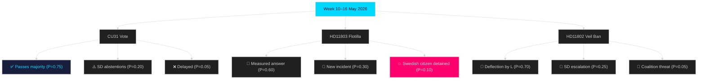

# Scenario Analysis — Week Ahead 10–16 May 2026

**Horizon**: T+72h / T+7d / T+30d  
**Methodology**: SWOT-driven scenario tree  
**Author**: James Pether Sörling  

## Primary Scenario Tree

### ROOT: CU31 Privatuthyrningslag Plenary Vote

**Base case (P=0.75 [C1])**: CU31 passes with M–KD–L–SD majority. S and V vote against with prepared "landlord party" messaging. Media cycle dominated by housing debate through Thursday.

**Alternative A (P=0.20 [D2])**: CU31 passes but with SD abstentions or a visible SD-L disagreement on implementation details. Coalition micro-fracture signals — SD uses post-vote press conference to mark differentiation.

**Alternative B (P=0.05 [E3])**: CU31 delayed by procedural opposition tactics (S/V minority report forces return to committee). Government legislative timeline disrupted in election year.

## Scenario 1: Diplomatic Escalation (Israel Flotilla)

**Current state**: HD11803 — S MP Büser has questioned Foreign Minister Stenergard. Answer pending.

**S1a (P=0.60 [C2])**: Stenergard gives measured written answer acknowledging incident, citing EU coordination and international law. Situation de-escalates. No further parliamentary action this week.

**S1b (P=0.30 [D3])**: New incident in flotilla series — additional Swedish citizens affected. Opposition demand emergency debate (riksdagsordningen §6.2 procedure). Government scrambles.

**S1c (P=0.10 [E3])**: Swedish citizen detained or injured by Israeli forces. Full-scale diplomatic crisis. Government forced to summon Israeli ambassador. SD splits from coalition foreign policy position.

## Scenario 2: SD–L Veil Ban Friction

**Current state**: HD11802 — SD pressing L education minister Mohamsson.

**S2a (P=0.70 [B2])**: L minister gives standard deflection answer. SD marks dissatisfaction in media but does not escalate formally. Status quo maintained.

**S2b (P=0.25 [C3])**: L minister's answer is interpreted as a soft "no" to veil ban. SD MP uses follow-up media to accuse L of abandoning coalition programme. Heightened pre-election tension.

**S2c (P=0.05 [E3])**: SD formally conditions continued supply-and-confidence on veil ban legislation before the election. Coalition crisis scenario — historically improbable [horizon:quarter].

## Scenario Tree (Mermaid)

## Wildcard Scenarios

**WC-1**: IMF releases an unscheduled Sweden country report noting housing affordability crisis — boosts S/V opposition narrative on CU31. (P=0.05, impact: High)

**WC-2**: Riksdag IT incident disrupts plenary session — delays CU31 vote to next week. (P=0.02, impact: Low)
