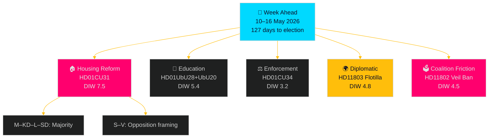

# Synthesis Summary — Week Ahead 10–16 May 2026

**Admiralty**: B2 (Reliable source, Probably true)  
**Author**: James Pether Sörling  

## Analytical Lede

The week commencing 10 May 2026 presents a parliament managing three simultaneous reform tracks — housing liberalisation, education restructuring, and enforcement modernisation — while coalition cohesion is tested by SD–L friction on cultural policy and an unexpected diplomatic incident tied to the Gaza conflict. With 127 days until the September 2026 election, every contested vote now carries heightened electoral stakes.

## Key Developments

### 1. Housing Market Reform (HD01CU31 — DIW 7.5 after 1.5× multiplier)

The Civil Affairs Committee has approved the government's privatuthyrningslag (private rental law) for plenary debate. The legislation amends the Jordabalken (Land Code) and bostadsrättslagen (Condominium Act) to enable more flexible short-term and long-term private rentals. Source: HD01CU31, Betänkande 2025/26:CU31, CU committee, 2026-05-08.

**Electoral significance**: S and V are expected to oppose with "landlord gift" framing. The M–KD–L–SD governing constellation holds a majority. This is the highest-salience housing vote of the 2025/26 riksmöte.

**IMF context** (WEO Apr-2026): Sweden's residential property market correction continues; IMF projects NGDP_RPCH of 2.1% for 2026 (T+1). Housing supply constraints contribute to Sweden's structural competitiveness risk.

### 2. Education Reform Pair (HD01UbU20, HD01UbU28 — DIW 5.4 after multiplier)

Two Education Committee reports advance concurrently:
- **HD01UbU28**: Teacher credentials for the 10-year elementary school (from läsår 2028/29). Committee endorses government proposal to update legitimation requirements. Source: HD01UbU28, Betänkande 2025/26:UbU28, UbU committee, 2026-05-08.
- **HD01UbU20**: Freedom of Information exemptions for small private school operators (< threshold size). Committee backs OSL and Skollagen amendments. Source: HD01UbU20, Betänkande 2025/26:UbU20, UbU committee, 2026-05-08.

**Risk**: The school-transparency bill (UbU20) may revive debate on private school accountability — a persistent electoral fault-line between M–KD (pro-private schools) and S–V–MP (accountability advocates).

### 3. Civil Enforcement Modernisation (HD01CU34 — DIW 3.2)

Distansutmätning (remote seizure/enforcement) reform: CU approves amendments to utsökningsbalken enabling higher sale prices for distrained property and expanded remote enforcement. Technically significant but low electoral salience. Source: HD01CU34, Betänkande 2025/26:CU34, 2026-05-08.

### 4. State Personnel Deployment (HD01SoU36 — DIW 3.0)

Social Affairs Committee approves healthcare law amendments enabling better conditions for deploying state medical personnel abroad, including vaccination benefit provisions. Source: HD01SoU36, Betänkande 2025/26:SoU36, 2026-05-08.

### 5. Coalition Friction — Full Veil Ban (HD11802 — DIW 4.5 after multiplier)

SD MP Nima Gholam Ali Pour asks Education and Integration Minister Simona Mohamsson (L) about a ban on full face coverings (burka/niqab). SD presses L to implement what governing parties "publicly committed to" as anti-oppression policy. Source: HD11802, Fråga 2025/26:802. The question exploits L's liberal values conflict with cultural conservatism demanded by SD.

### 6. Diplomatic Incident — Israel Flotilla (HD11803 — DIW 4.8 after multiplier)

S MP Johan Büser questions Foreign Minister Maria Malmer Stenergard (M) about Israel boarding the Global Sumud Flotilla in Greek international waters. Swedish citizens were aboard. Source: HD11803, Fråga 2025/26:803. This places Sweden in a diplomatically sensitive position as an EU member with pro-rule-of-law positioning.

### 7. Tax Residency Interpellation (HD10480 — DIW 3.5 after multiplier)

S MP Niklas Karlsson interpellates Finance Minister Elisabeth Svantesson (M) on the concept of "stadigvarande vistelse" (permanent residence) in the Income Tax Act. This follows an October 2025 written question (2025/26:33) that received a deferral answer. Source: HD10480, Interpellation 2025/26:480.

## Mermaid: Week Overview

## Significance Ranking

| Rank | Dok ID | Issue | DIW Score | Electoral weight |
|------|--------|-------|-----------|-----------------|
| 1 | HD01CU31 | Housing market liberalisation | 7.5 | Very High |
| 2 | HD11803 | Israel flotilla – Swedish citizens | 4.8 | Medium |
| 3 | HD11802 | Full veil ban – SD–L friction | 4.5 | Medium |
| 4 | HD01UbU28 | 10-year school credentials | 5.4 | High |
| 5 | HD10480 | Tax residency interpellation | 3.5 | Low |
| 6 | HD01SoU36 | State personnel deployment | 3.0 | Low |

## PIR Alignment

- **PIR-1 (Coalition cohesion)**: HD11802 and HD11803 provide new data points. Status: Partially answered — coalition intact but under strain.
- **PIR-2 (Election positioning)**: CU31 opposition framing confirms S strategy of "landlord party" attack on M-led coalition.
- **PIR-3 (Housing policy)**: CU31 advances the government's 2025/26 legislative agenda on housing supply.
