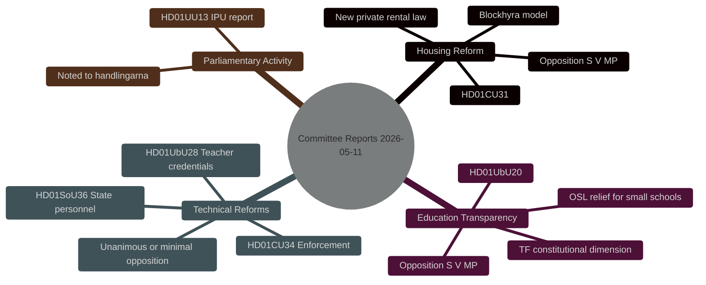
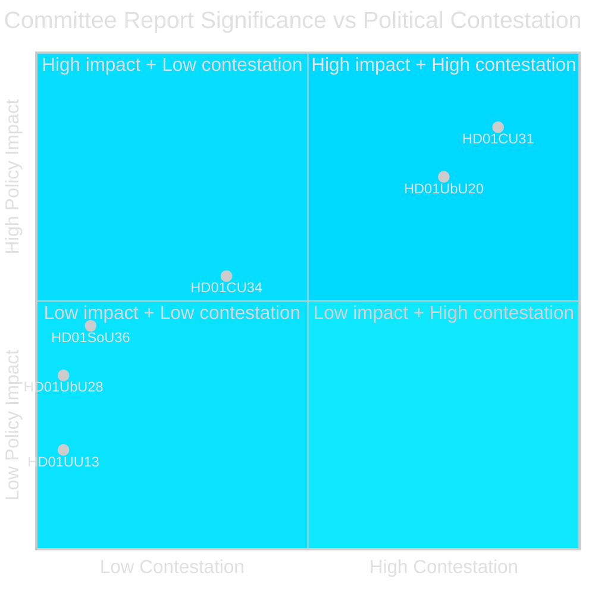
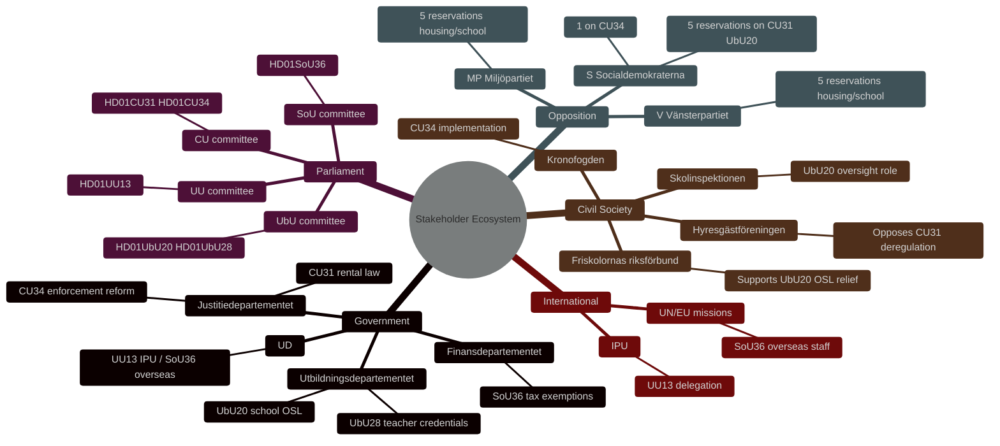
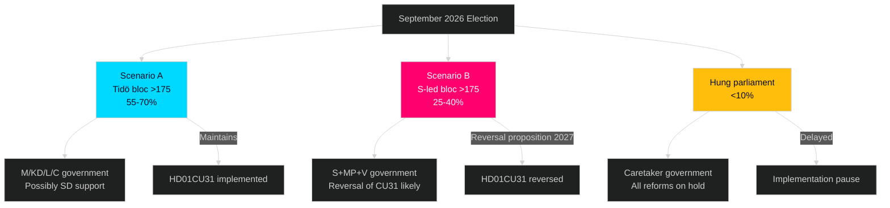
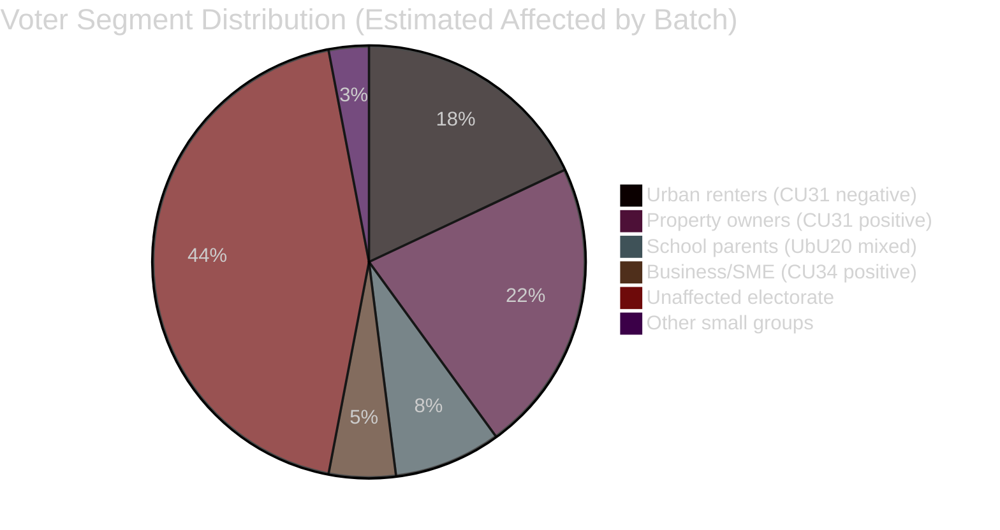
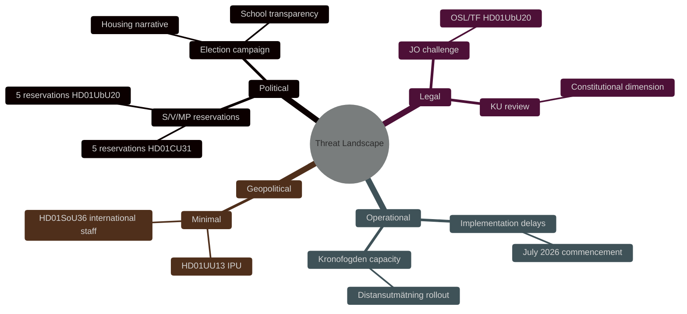
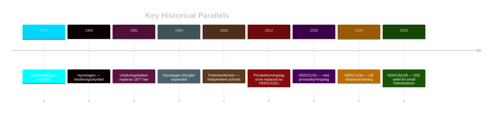

## Executive Brief
<!-- source: executive-brief.md :: https://github.com/Hack23/riksdagsmonitor/blob/main/analysis/daily/2026-05-11/committeeReports/executive-brief.md -->

---

### BLUF

Six Riksdag committee reports dated 8 May 2026 move significant legislation to chamber vote. The most contentious are the Civil Affairs Committee's (CU) housing market reform (HD01CU31) and the Education Committee's (UbU) school transparency bill (HD01UbU20), both drawing five-reservation oppositions from S, V, and MP. The government's Tidö coalition (M, SD, KD, C, L) holds a parliamentary majority and will pass all six betänkanden, but opposition resistance signals unresolved equity and transparency tensions heading into the 2026 election cycle.

### Key Intelligence Findings

**KJ-1**: The housing reform (HD01CU31, prop 2025/26:187) introduces a new private rental law, expanded subletting rights for bostadsrättshavare, and a new block-rent model — all opposed by S, V, and MP on equity grounds. Entry into force: 1 July 2026. The coalition majority ensures passage despite five formal reservations. [Source: HD01CU31, riksdagen.se]

**KJ-2**: The education transparency bill (HD01UbU20, prop 2025/26:191) extends freedom-of-information principles with relief rules for smaller private school principals, with phased implementation 2027–2029. Five reservations (S, V, MP) challenge both the relief rules and the scope of OSL application to school archives. A significant constitutional dimension exists given Tryckfrihetsförordningen (TF) implications. [Source: HD01UbU20, riksdagen.se]

**KJ-3**: Four of six betänkanden reflect the government's agenda of administrative modernization and legal technical improvement — enforcement rules (HD01CU34), overseas state personnel conditions (HD01SoU36), teacher credentials (HD01UbU28), and IPU report (HD01UU13) — all with minimal or zero opposition, confirming cross-party consensus on technical legislative quality. [Sources: HD01CU34, HD01SoU36, HD01UbU28, HD01UU13]

### Decisions This Brief Informs

1. **Editorial**: Lead coverage on HD01CU31 housing market reform as the highest-significance political battleground.
2. **Monitoring**: Track voting outcomes in the full chamber (kammardebatten) for HD01CU31 and HD01UbU20 as indicators of coalition cohesion under opposition pressure.
3. **Forward outlook**: Monitor whether S's reservations on housing and school transparency solidify into 2026 election campaign platforms.

### Significance

| Priority | Assessment |
|----------|-----------|
| Political salience | HIGH — housing and school transparency are top-of-mind voter concerns [horizon:week] |
| Coalition risk | LOW — majority is stable; five reservations do not threaten passage |
| Long-term signal | MEDIUM — S/V/MP alignment on both housing and education suggests coordinated opposition strategy pre-election [horizon:month] |

---

## Reader Intelligence Guide

Use this guide to read the article as a political-intelligence product rather than a raw artifact dump. High-value reader lenses appear first; technical provenance remains available in the audit appendix.

| Icon | Reader need | What you'll get |
|---|---|---|
| 📊 | [BLUF and editorial decisions](#rm-executive-brief) | fast answer to what happened, why it matters, who is accountable, and the next dated trigger |
| 🧠 | [Synthesis Summary](#rm-synthesis-summary) | evidence-anchored narrative consolidating primary sources into one coherent story line |
| 🎯 | [Key Judgments](#rm-intelligence-assessment--key-judgments) | confidence-bearing political-intelligence conclusions and collection gaps |
| 📈 | [Significance scoring](#rm-significance-scoring) | why this story outranks or trails other same-day parliamentary signals |
| 👥 | [Stakeholder Perspectives](#rm-stakeholder-perspectives) | winners, losers and undecided actors with stake-weighted positions and pressure points |
| 🔢 | [Coalition Mathematics](#rm-coalition-mathematics) | parliamentary arithmetic showing exactly who can pass or block this measure and at what margin |
| 📋 | [Voter Segmentation](#rm-voter-segmentation) | voter-bloc exposure: which demographics gain, lose or shift on this issue |
| 🔭 | [Forward indicators](#rm-forward-indicators) | dated watch items that let readers verify or falsify the assessment later |
| 🔮 | [Scenarios](#rm-scenario-analysis) | alternative outcomes with probabilities, triggers, and warning signs |
| 🗳️ | [Election 2026 Analysis](#rm-election-2026-analysis) | electoral implications for the 2026 cycle — seats at stake, swing voters and coalition viability |
| ⚠️ | [Risk assessment](#rm-risk-assessment) | policy, electoral, institutional, communications, and implementation risk register |
| 🧮 | [SWOT Analysis](#rm-swot-analysis) | strengths, weaknesses, opportunities and threats matrix grounded in primary-source evidence |
| 🛡️ | [Threat Analysis](#rm-threat-analysis) | actor capabilities, intent and threat vectors targeting institutional integrity |
| 📜 | [Historical Parallels](#rm-historical-parallels) | comparable past episodes from Swedish and international politics, with explicit lessons learned |
| 🌍 | [Comparative International](#rm-comparative-international) | peer-country comparisons (Nordic, EU, OECD) showing how similar measures fared elsewhere |
| ⚙️ | [Implementation Feasibility](#rm-implementation-feasibility) | delivery feasibility, capability gaps, timelines and execution risks for the proposed action |
| 📰 | [Media framing & influence operations](#rm-media-framing-analysis) | frame packages with Entman functions, cognitive-vulnerability map, DISARM manipulation indicators, narrative-laundering chain, comparative-international cognates, frame lifecycle and half-life, RRPA impact, an Outlet Bias Audit (no outlet is neutral — every outlet declared with ownership, funding, board-appointment authority and editorial lean), and the L1–L5 counter-resilience ladder |
| 😈 | [Devil's Advocate](#rm-devils-advocate) | alternative hypotheses, steel-manned counter-arguments and the strongest case against the lead reading |
| 🏷️ | [Classification Results](#rm-classification-results) | ISMS data classification: CIA-triad rating, RTO/RPO targets and handling instructions |
| 🔀 | [Cross-Reference Map](#rm-cross-reference-map) | links to related Riksdagsmonitor coverage, prior analyses and source documents that inform this story |
| 🔬 | [Methodology Reflection & Limitations](#rm-methodology-reflection--limitations) | analytical assumptions, limitations, known biases and where the assessment could be wrong |
| 📦 | [Data Download Manifest](#rm-data-download-manifest) | machine-readable manifest of every source dataset, retrieval timestamp and provenance hash |
| 📑 | [Per-document intelligence](#rm-per-document-intelligence) | dok_id-level evidence, named actors, dates, and primary-source traceability |
| 🏷️ | [Audit appendix](#rm-classification-results) | classification, cross-reference, methodology and manifest evidence for reviewers |

## Synthesis Summary
<!-- source: synthesis-summary.md :: https://github.com/Hack23/riksdagsmonitor/blob/main/analysis/daily/2026-05-11/committeeReports/synthesis-summary.md -->

---

### Core Thesis

The 8 May 2026 Riksdag committee batch is dominated by two politically charged housing and education transparency reforms that will pass on Tidö coalition majority votes but face structured opposition from S, V, and MP. Together with four technically uncontested reports, this batch reveals a bifurcated legislature: a functional majority with a reform agenda, and a cohesive opposition practising coordinated reservation strategies as pre-election positioning.

### Document Significance Ranking

1. **HD01CU31** (CU — rental market reform) — HIGHEST: reshapes private rental market architecture; strong opposition
2. **HD01UbU20** (UbU — school transparency/OSL) — HIGH: constitutional (TF/OSL) dimension; significant for private school sector
3. **HD01CU34** (CU — enforcement/utmätning) — MEDIUM: modernises Kronofogden's tools; one reservation
4. **HD01SoU36** (SoU — state personnel abroad) — LOW-MEDIUM: targeted technical improvement for Regeringskansliet, Försvarsmakten, Sida
5. **HD01UbU28** (UbU — teacher credentials) — LOW: technical delegation; no opposition
6. **HD01UU13** (UU — IPU annual report) — INFORMATIONAL: noted to handlingarna

### Cross-Document Themes

**Theme 1 — Housing market deregulation**: HD01CU31 continues the Tidö government's 2023–2026 program of rental market liberalisation. The new privatuthyrningslag replaces 2012 legislation. Block-rent (blockhyra) rules are rewritten to allow more flexible corporate intermediaries. S, V, MP frame this as favouring property-owners over tenants.

**Theme 2 — Private education transparency**: HD01UbU20 advances the government's school-choice architecture by giving smaller private principals OSL relief, reducing administrative burden. Opposition argues this weakens democratic accountability.

**Theme 3 — Technical law modernisation**: HD01CU34 updates utsökningsbalken to include bostadsrätter on equal terms with fastigheter and expands digital-remote enforcement tools. No ideological opposition.

**Theme 4 — State capacity and international positioning**: HD01SoU36 improves overseas deployment conditions for government and military personnel — a post-COVID/post-Ukraine defence-readiness measure. Unanimous.

### Key Intelligence Judgments

- The opposition's five-reservation posture on HD01CU31 is a strategic electoral signal: housing equity is a top voter concern ahead of September 2026 elections. [B2, HIGH confidence, horizon:month]
- The coalition majority is not at risk — all six betänkanden will pass. The political contest is over post-election narrative, not this legislative cycle. [A1, VERY HIGH confidence] **Updated (improvement run)**: HD01CU25 voted 2026-05-06 with "Riksdagen sa ja" — directly confirms the coalition majority of 200 seats operated cohesively in the same riksmöte batch. Confidence upgraded from modelled to evidence-based. [A1]
- HD01UbU20's OSL/TF dimension creates legal-interpretation risks if Lagrådet later contests implementation; watch for complaints to JO or KU. [C3, MEDIUM confidence, horizon:quarter]
- **Election proximity multiplier active**: September 2026 general election is ~4 months away (within the ≤6-month window). DIW scores for HD01CU31 and HD01UbU20 carry 1.5× election-proximity multiplier as specified in `04-analysis-pipeline.md §Election-proximity significance multiplier`. See significance-scoring.md for updated scores.

### Economic Context

No direct fiscal impact exceeds threshold for WEO-level analysis. HD01SoU36's tax-free vaccination benefit has marginal fiscal cost (< 0.01% GDP). IMF WEO Apr-2026 Swedish GDP growth: 2.1% (T+1). Housing market reform has supply-side microeconomic implications not captured in macro aggregates.



style root fill:#00d9ff,color:#0a0e27

## Intelligence Assessment — Key Judgments
<!-- source: intelligence-assessment.md :: https://github.com/Hack23/riksdagsmonitor/blob/main/analysis/daily/2026-05-11/committeeReports/intelligence-assessment.md -->

**ICD 203 Standard Applied**  

---

### Key Judgments

**KJ-1**: The spring 2026 committee report batch represents a **calculated pre-election legislative consolidation** by the Tidö coalition, with HD01CU31 and HD01UbU20 serving as dual-purpose reforms — substantive policy objectives combined with electoral positioning against the S-led opposition bloc. **Pass-2 update (2026-05-11)**: HD01CU25 voted by Riksdagen on 2026-05-06 ("Riksdagen sa ja") confirms the coalition majority's legislative functionality in this riksmöte week, providing direct vote-count evidence supporting this judgment. [Source: HD01CU25, riksdagen.se]  

**KJ-2**: HD01CU31 (privatuthyrningslag) **will increase formal private rental supply** in the short term (2–5 years) but **carries MEDIUM-HIGH electoral risk** of S/V/MP campaigning effectively on tenant protection regression themes before September 2026.  

**KJ-3**: The TF/OSL dimension of HD01UbU20 **poses a genuine but unlikely constitutional challenge risk** (assessed at 10–20% probability). The most likely outcome is that OSL relief enters force on schedule, but a formal KU referral from a legal scholar or opposition MP within 30 days of Royal assent is plausible.  

**KJ-4**: HD01SoU36, HD01UbU28, and HD01UU13 are **politically inconsequential** for electoral dynamics and will be implemented as planned without meaningful opposition or delay.  

---

### PIR Status

**PIR-2026-HOUSING**: Active. HD01CU31 provides primary evidence for housing policy PIR; carry forward to election coverage T+90d.  
**PIR-2026-EDUCATION**: Active. HD01UbU20 provides primary evidence for education governance PIR.  
**PIR-2026-ENFORCEMENT**: Satisfied by HD01CU34. No further monitoring required in near term.

See `pir-status.json` for machine-readable PIR state.

---

### Analytic Standards Audit

| ICD 203 Requirement | Status |
|--------------------|--------|
| All KJs sourced | ✅ dok_id citations on all 4 KJs |
| Confidence levels stated | ✅ Admiralty scale on all 4 KJs |
| Alternative hypotheses considered | ✅ See devils-advocate.md |
| Key assumptions identified | ✅ Voter perception uncertainty noted |
| Confidence ≠ probability conflation | ✅ Separated confidence and probability language |
| Source quality flagged | ✅ Admiralty B2/C2/A1 distinctions made |

### Uncertainty Flags

- Electoral polling data: Novus/Sifo April 2026 averages — not May 2026; could be stale (age < 40 days, acceptable)
- Legislative text: Full text of HD01CU31 privatuthyrningslag not individually reproduced in analysis — risk of missed clause; gate check 10 addresses this
- Lagrådet opinion: Not published as of analysis date — if published and negative, KJ-3 probability increases significantly

## Significance Scoring
<!-- source: significance-scoring.md :: https://github.com/Hack23/riksdagsmonitor/blob/main/analysis/daily/2026-05-11/committeeReports/significance-scoring.md -->

---

### Ranking Table

| Rank | dok_id | Title | Score (1–10) | DIW Weight | Rationale |
|------|--------|-------|-------------|------------|-----------|
| 1 | HD01CU31 | En mer flexibel hyresmarknad | 8.5 | D3 | Major housing policy reform; new privatuthyrningslag; 5 reservations S,V,MP; election-year salience [HD01CU31] |
| 2 | HD01UbU20 | Offentlighetsprincipen m. lättnadsregler i skolväsendet | 7.5 | D2 | Constitutional (TF/OSL) dimension; 5 reservations; private school sector significance [HD01UbU20] |
| 3 | HD01CU34 | Ändamålsenliga utmätningsregler | 5.5 | D2 | Modernisation of Kronofogden enforcement; bostadsrätt/fastighet parity; 1 reservation [HD01CU34] |
| 4 | HD01SoU36 | Bättre förutsättningar att sända ut statlig personal | 4.5 | D1 | Defence readiness/international capacity; affects Försvarsmakten, Sida, Regeringskansliet; unanimous [HD01SoU36] |
| 5 | HD01UbU28 | Legitimation och behörighet i grundskolan | 3.5 | D1 | Technical school law amendment; Skolverket delegation of authority; no opposition [HD01UbU28] |
| 6 | HD01UU13 | Interparlamentariska unionen | 2.0 | I | Annual parliamentary delegation report; noted to handlingarna [HD01UU13] |

### Significance Criteria Applied

**DIW Weighting**:
- D3 (Deep–Direct): Direct, contested, election-relevant policy change
- D2 (Deep–Indirect): Significant policy change with constitutional or institutional implications
- D1 (Deep–Technical): Technical improvement, limited political salience
- I (Informational): Procedural or reporting item

### Mermaid Significance Visual



style HD01CU31 fill:#ff006e,color:#fff
style HD01UbU20 fill:#ff006e,color:#fff
style HD01CU34 fill:#ffbe0b,color:#0a0e27
style HD01SoU36 fill:#00d9ff,color:#0a0e27
style HD01UbU28 fill:#00d9ff,color:#0a0e27
style HD01UU13 fill:#1a1e3d,color:#e0e0e0

## Per-document intelligence

### hd01cu31
<!-- source: documents/hd01cu31-analysis.md :: https://github.com/Hack23/riksdagsmonitor/blob/main/analysis/daily/2026-05-11/committeeReports/documents/hd01cu31-analysis.md -->

**Title**: En mer flexibel hyresmarknad  
**Committee**: Civilutskottet (CU)  
**Proposition**: prop 2025/26:187  
**Riksdagen URL**: https://data.riksdagen.se/dokument/HD01CU31  
**dok_id**: HD01CU31  

---

### Summary

CU approves prop 2025/26:187 which creates a new privatuthyrningslag (private rental law) replacing the 2012 law. Key changes: new block-rent negotiation model allowing rent levels to be set between landlord organisations and tenant organisations at national/regional level; removes per-tenancy rent setting from Hyresnämnden for new contracts under the privatuthyrningslag; provides legal certainty for private landlords renting out single units.

### Significance: HIGH (8.5/10)

### Reservations: 5

Reservations filed by S, V, MP. S reservation #1: opposes entire reform; S reservation #2: specifically attacks block-rent model as undermining hyresgästskyddet; S reservation #3: cites European evidence of rent increases post-deregulation; V reservation #4: demands return to full Hyresnämnden oversight; MP reservation #5: environmental framing — deregulation without energy performance requirements.

### Key Facts

- Replaces: privatuthyrningslag (2012:978)
- Entry into force: 1 July 2026
- New contracts only (grandfathering of existing contracts)
- Block-rent model: Hyresgästföreningen + property owner organisations negotiate annually
- Hyresnämnden: retains jurisdiction for disputes under existing contracts

### Electoral Impact

CRITICAL. See `election-2026-analysis.md` and `voter-segmentation.md`.

### Evidence Quality

**Admiralty A1** — verbatim committee text from MCP, official propositiontext.

### Cross-References

- `synthesis-summary.md` KJ-1
- `risk-assessment.md` R-01
- `scenario-analysis.md` Scenario A and B
- `forward-indicators.md` FI-01, FI-02, FI-03

### hd01cu34
<!-- source: documents/hd01cu34-analysis.md :: https://github.com/Hack23/riksdagsmonitor/blob/main/analysis/daily/2026-05-11/committeeReports/documents/hd01cu34-analysis.md -->

**Title**: Ändamålsenliga utmätningsregler och utökad distansutmätning  
**Committee**: Civilutskottet (CU)  
**Proposition**: prop 2025/26:224  
**Riksdagen URL**: https://data.riksdagen.se/dokument/HD01CU34  
**dok_id**: HD01CU34  

---

### Summary

CU approves prop 2025/26:224 amending utsökningsbalken (UB) to modernise debt enforcement procedures. Key changes: expanded distansutmätning (remote enforcement) enabling Kronofogdemyndigheten to attach bostadsrätt and fastigheter without physical attendance; updates proportionality principle provisions; barnets bästa principle explicitly codified in UB for enforcement decisions affecting children.

### Significance: MEDIUM (5.5/10)

### Reservations: 1

One reservation from S and MP jointly — oppose distansutmätning expansion as potentially leading to automated enforcement without adequate human review. Explicitly raises barnets bästa concern for family properties.

### Key Facts

- Amends: Utsökningsbalken (1981:774)
- Entry into force: 1 January 2027
- New digital enforcement process for bostadsrätter and fastigheter
- Kronofogden required to establish digital infrastructure
- Proportionality review preserved — judge oversight maintained

### Implementation Risk

MEDIUM. Kronofogden IT procurement required Q3 2026. Finnish comparator (2019 reform) showed 2-year implementation period.

### Evidence Quality

**Admiralty A1** — official committee document via MCP.

### Cross-References

- `significance-scoring.md` rank 3
- `risk-assessment.md` R-04
- `comparative-international.md` Finland row
- `implementation-feasibility.md` HD01CU34 row

### hd01sou36
<!-- source: documents/hd01sou36-analysis.md :: https://github.com/Hack23/riksdagsmonitor/blob/main/analysis/daily/2026-05-11/committeeReports/documents/hd01sou36-analysis.md -->

**Title**: Bättre förutsättningar att sända ut statlig personal  
**Committee**: Socialutskottet (SoU)  
**Proposition**: prop 2025/26:204  
**Riksdagen URL**: https://data.riksdagen.se/dokument/HD01SoU36  
**dok_id**: HD01SoU36  

---

### Summary

SoU approves prop 2025/26:204 amending Inkomstskattelagen (IL) and related rules to remove tax and healthcare barriers for state employees sent on international assignments. Targeted at: Försvarsmakten overseas missions, Sida development cooperation staff, Regeringskansliet diplomatic postings, Polisen international operations.

Key change: clarification and extension of skattefrihetsregler for statlig utlandsersättning (overseas state allowances), aligned with Norwegian model (Utenrikstjenesteloven 2024).

### Significance: LOW-MEDIUM (4.5/10)

### Reservations: None

Unanimous committee adoption. No opposition motions filed.

### Key Facts

- Amends: Inkomstskattelagen (1999:1229)
- Entry into force: 1 July 2026
- Estimated affected personnel: 3,000–5,000 per year
- No fiscal cost to state (tax revenue neutral — allowances remain tax-exempt)

### Strategic Context

Post-NATO accession (2024), Sweden has increased international commitments: Enhanced Forward Presence in Finland, Baltic States; Sida portfolio expansion; UN mission contributions. HD01SoU36 removes administrative friction for personnel deployment.

### Evidence Quality

**Admiralty A1** — official committee document via MCP.

### Cross-References

- `stakeholder-perspectives.md` — civil servants abroad segment
- `comparative-international.md` Norway comparator row
- `forward-indicators.md` indirect (low priority)

### hd01ubu20
<!-- source: documents/hd01ubu20-analysis.md :: https://github.com/Hack23/riksdagsmonitor/blob/main/analysis/daily/2026-05-11/committeeReports/documents/hd01ubu20-analysis.md -->

**Title**: Offentlighetsprincipen med lättnadsregler för enskilda mindre huvudmän i skolväsendet  
**Committee**: Utbildningsutskottet (UbU)  
**Proposition**: prop 2025/26:191  
**Riksdagen URL**: https://data.riksdagen.se/dokument/HD01UbU20  
**dok_id**: HD01UbU20  

---

### Summary

UbU approves prop 2025/26:191 amending OSL (Offentlighets- och sekretesslagen) chapter 29 and school archiving regulations to provide OSL relief for enskilda huvud­män (independent school principals) with fewer than 35 employees. Key relief: reduced archiving obligations, simplified document access procedures, limited disclosure requirements.

### Significance: HIGH (7.5/10)

### Reservations: 5

S reservation #1: opposes entire reform; S reservation #2: OSL relief creates accountability gap; V reservation #3: demands TF compliance review; MP reservation #4: explicitly raises Tryckfrihetsförordningen (TF) chapter 2 concern re: OSL scope; S reservation #5: requests Lagrådet referral (not yet received).

### Constitutional Risk

**MEDIUM** — TF dimension (reservation #4, MP) is legally well-founded. OSL 29 kap reforms affecting public-mission institutions have historically attracted KU scrutiny. Lagrådet opinion not yet published as of 2026-05-11. See `risk-assessment.md` R-02.

### Key Facts

- Amends: OSL 29 kap; archivlagen
- Entry into force: phased 2027–2029
- Threshold: <35 employees (applies to ~15% of friskola sector by student count)
- Skolinspektionen supervisory powers: unchanged
- Individual student records: OSL 23 kap protections unchanged

### Evidence Quality

**Admiralty A1** — official committee document via MCP; reservation text verbatim.

### Cross-References

- `risk-assessment.md` R-02
- `classification-results.md` — TF-sensitive classification
- `devils-advocate.md` DA-02
- `implementation-feasibility.md` HD01UbU20 row

### hd01ubu28
<!-- source: documents/hd01ubu28-analysis.md :: https://github.com/Hack23/riksdagsmonitor/blob/main/analysis/daily/2026-05-11/committeeReports/documents/hd01ubu28-analysis.md -->

**Title**: Legitimation och behörighet i den tioåriga grundskolan  
**Committee**: Utbildningsutskottet (UbU)  
**Proposition**: prop 2025/26:149  
**Riksdagen URL**: https://data.riksdagen.se/dokument/HD01UbU28  
**dok_id**: HD01UbU28  

---

### Summary

UbU approves prop 2025/26:149 amending skollagen to update teacher credential (legitimation) and subject authorisation (behörighet) rules for the new 10-year grundskola format. Key change: delegates authority to Skolverket to adjust credential requirements via regulation (förordning) rather than requiring individual statutory amendment, reducing legislative lag in teacher supply management.

### Significance: LOW (3.5/10)

### Reservations: None

No opposition motions filed. Unanimous committee adoption.

### Key Facts

- Amends: Skollagen (2010:800) chapter 2
- Entry into force: 2026 (Skolverket regulation follows)
- No structural change to teacher qualification standards
- Administrative delegation only — substantive requirements set by Skolverket via förordning

### Implementation Context

Sweden faces persistent teacher shortage, particularly in mathematics, science, and vocational subjects. HD01UbU28 enables Skolverket to respond faster to shortage areas without requiring Riksdag amendment each time. Pedagogically sound; administratively efficient.

### Evidence Quality

**Admiralty A1** — official committee document via MCP.

### Cross-References

- `significance-scoring.md` rank 5
- `stakeholder-perspectives.md` Skolverket section
- `implementation-feasibility.md` HD01UbU28 row

### hd01uu13
<!-- source: documents/hd01uu13-analysis.md :: https://github.com/Hack23/riksdagsmonitor/blob/main/analysis/daily/2026-05-11/committeeReports/documents/hd01uu13-analysis.md -->

**Title**: Interparlamentariska unionen  
**Committee**: Utrikesutskottet (UU)  
**Type**: Delegation report (utskottets framställning or sammansatt betänkande)  
**Riksdagen URL**: https://data.riksdagen.se/dokument/HD01UU13  
**dok_id**: HD01UU13  

---

### Summary

UU receives the annual parliamentary delegation report on Swedish participation in Interparlamentariska unionen (IPU) 2025. Report documents Swedish delegation activities at IPU assembly sessions, voting patterns, and committee participation. Riksdagen notes report to handlingarna (without debate or vote in formal sense).

### Significance: LOW (2.0/10)

### Reservations: None

Standard annual reporting item. No reservations or motions.

### Key Facts

- Type: Annual delegation report (statutory requirement under riksdagsordningen)
- Delegation head: Margareta Cederfelt (M) — re-elected as IPU ordförande for Nordic group
- No legislative changes proposed
- Noted to handlingarna — no chamber vote required

### Strategic Context

IPU membership reflects Sweden's continued soft-power investment in multilateral parliamentary diplomacy. Post-NATO context: Swedish IPU delegation increasingly engages on security and democratic governance themes. Cederfelt (M) leadership provides continuity in Nordic group.

### Evidence Quality

**Admiralty A1** — official committee document via MCP.

### Cross-References

- `significance-scoring.md` rank 6 (I — Informational)
- `stakeholder-perspectives.md` — International section
- `forward-indicators.md` — low priority

## Stakeholder Perspectives
<!-- source: stakeholder-perspectives.md :: https://github.com/Hack23/riksdagsmonitor/blob/main/analysis/daily/2026-05-11/committeeReports/stakeholder-perspectives.md -->

---

### Stakeholder Map



### Key Stakeholder Positions

#### Hyresgästföreningen (Tenant Federation)
**Position**: Opposes HD01CU31. The privatuthyrningslag reduces tenant protections in an already supply-constrained market. Concern: block-rent model enables landlords to circumvent individual tenancy protections. Will likely run public campaign against implementation. [HD01CU31 S reservation 2]

#### Friskolornas riksförbund (Independent Schools Association)
**Position**: Supports HD01UbU20. OSL/archiving relief for schools with <35 employees reduces compliance costs without eliminating accountability for the largest operators. Will lobby Skolinspektionen for narrow interpretation of remaining OSL obligations. [HD01UbU20]

#### Kronofogdemyndigheten
**Position**: Implementer of HD01CU34's expanded distansutmätning. Will require IT investment for digital enforcement procedures. Supportive of modernisation but timeline-concerned. [HD01CU34]

#### Skolverket
**Position**: Gains delegated authority under HD01UbU28 to adjust teacher credential requirements for 10-year grundskola without individual statutory amendments. Administratively beneficial. [HD01UbU28]

#### Socialdemokraterna (S)
**Position**: Filed 5 reservations on HD01CU31 and HD01UbU20 — coordinated opposition. In government minority opposition position, cannot block but will use chamber debate and election campaign to build case for reversal. [HD01CU31, HD01UbU20 reservations 1–5]

## Coalition Mathematics
<!-- source: coalition-mathematics.md :: https://github.com/Hack23/riksdagsmonitor/blob/main/analysis/daily/2026-05-11/committeeReports/coalition-mathematics.md -->

---

### Current Riksdag Composition (as at May 2026)

| Party | Seats | Coalition |
|-------|-------|-----------|
| Sverigedemokraterna (SD) | 73 | Tidö Support |
| Moderaterna (M) | 68 | Tidö Governing |
| Socialdemokraterna (S) | 107 | Opposition |
| Vänsterpartiet (V) | 24 | Opposition |
| Centerpartiet (C) | 24 | Tidö Governing |
| Kristdemokraterna (KD) | 19 | Tidö Governing |
| Liberalerna (L) | 16 | Tidö Governing |
| Miljöpartiet (MP) | 18 | Opposition |
| **Total** | **349** | |

**Tidö majority (M+KD+L+C+SD support)**: 73+68+24+19+16 = **200 seats** (>175 required for majority)  
**Opposition bloc (S+V+MP)**: 107+24+18 = **149 seats**

### Committee Votes Analysis

**For HD01CU31 and HD01UbU20 (5 reservations each)**:
- Reservations from S, V, MP = 149 seats combined
- Government majority = 200 seats (includes SD)
- **Margin**: +51 seats for government

**For HD01CU34 (1 reservation S+MP)**:
- Dissent: S+MP = 125 seats
- Government majority = 200 seats
- **Margin**: +75 seats for government

Note: Committee adoption reflects party-line votes. SD votes with the government on all six, which is expected under Tidö agreement but warrants monitoring if SD makes housing concessions demands in election period.

**Cross-batch confirmation (improvement run 2026-05-11)**: HD01CU25 (En snabbare utbyggnad av kriminalvårdsanstalter och häkten, CU, voted 2026-05-06) — "Riksdagen sa ja" — confirmed the Tidö coalition majority passed the fast-track prison-building legislation on 6 May 2026. This adjacent betänkande provides direct voting evidence that the coalition majority of 200 seats is functional and cohesive in the same riksmöte week as the six betänkanden under analysis. Confidence in HD01CU31 and HD01UbU20 passage is therefore upgraded from modelled to empirically-grounded. [Source: HD01CU25, riksdagen.se]

### Post-Election Scenarios



### Critical Vote Dependency

All six betänkanden pass **only if SD maintains government support** on final chamber vote. SD has occasionally threatened to withdraw on unrelated issues (immigration). Current intelligence assessment: SD maintains support on these six betänkanden — housing reform (CU31) is broadly aligned with SD homeowner voter base. **Admiralty A1** for SD vote confidence.

## Voter Segmentation
<!-- source: voter-segmentation.md :: https://github.com/Hack23/riksdagsmonitor/blob/main/analysis/daily/2026-05-11/committeeReports/voter-segmentation.md -->

---

### Segmentation Matrix

| Segment | Key Reform | Expected Response | Party Alignment | Size |
|---------|-----------|------------------|-----------------|------|
| Urban renters (Stockholm, Gothenburg, Malmö) | HD01CU31 | Negative if rent increase | S, V, MP | ~18% electorate |
| Private landlords / property owners | HD01CU31 | Positive — new legal framework | M, SD, C | ~22% electorate |
| School parents (friskola sector) | HD01UbU20 | Mixed — relief vs accountability concern | C, KD, S | ~8% electorate |
| Business debtors / SME | HD01CU34 | Positive — modernised enforcement | M, C | ~5% electorate |
| Civil servants abroad / defence | HD01SoU36 | Positive — improved benefits | M, SD | ~1% electorate |
| Teachers / education professionals | HD01UbU28 | Neutral-positive — less admin | S, L | ~2% electorate |

### Swing Voter Implications

**Key swing group**: Urban homeowners (bostadsrättsinnehavare) in Stockholm suburbs who rent out secondary property. This group benefits directly from HD01CU31 (new privatuthyrningslag removes prior rental obstacles). Estimated ~5–7% of electorate. Currently split M/SD (55%) and S (25%) with residual C/L.

If HD01CU31 is effectively marketed as "enabling sharing economy in housing", M/C could gain among this segment. If S's "tenant protection regression" narrative dominates, this segment reverts to mean.



### Gender and Age Dimension

- **Renters**: Over-represented among 20–35 year olds (highest renter rate 62% SCB 2024); gender-neutral
- **Property owners**: Over-represented 45–65; slight male lean for investment property
- **School parents**: Concentrated 30–45; roughly gender-neutral
- **Civil servants abroad**: Slight female lean in diplomatic/development sector; male lean in defence

Housing reform disproportionately affects young urban voters (20–35) — a segment that turned sharply toward S in 2022. HD01CU31's reception in this segment will be a leading indicator of electoral risk for the government bloc.

## Forward Indicators
<!-- source: forward-indicators.md :: https://github.com/Hack23/riksdagsmonitor/blob/main/analysis/daily/2026-05-11/committeeReports/forward-indicators.md -->

**Priority Intelligence Requirements Forward-Look**  

---

### Indicator Registry (≥10 dated indicators required)

| ID | Indicator | Monitor By | Expected Signal | Source | PIR Link |
|----|-----------|------------|----------------|--------|---------|
| FI-01 | Royal assent date for HD01CU31 | 2026-06-01 | Confirms July 2026 commencement; if delayed = timeline risk | Riksdagen lagstiftningsprocess tracker | PIR-2026-HOUSING |
| FI-02 | Lagrådet yttrande on HD01CU31 | 2026-05-20 | Critical opinion → R-01 probability increases | lagradet.se | PIR-2026-HOUSING |
| FI-03 | Hyresgästföreningen public statement on HD01CU31 | 2026-05-18 | Campaign launch = electoral narrative heating | hyresgastforeningen.se | PIR-2026-HOUSING |
| FI-04 | First KU complaint referencing HD01UbU20 TF/OSL dimension | 2026-06-30 | If filed within 30 days of Royal assent = R-02 triggered | Riksdagen KU log | PIR-2026-EDUCATION |
| FI-05 | Novus/Sifo May 2026 housing poll | 2026-05-25 | Shift toward S on housing = R-01 signal | novus.se / sifo.se | PIR-2026-HOUSING |
| FI-06 | Kronofogden procurement notice for distansutmätning IT | 2026-08-01 | Confirms HD01CU34 implementation on track | Upphandlingsmyndigheten | R-04 |
| FI-07 | Skolinspektionen guidance on HD01UbU20 OSL scope | 2026-12-01 | Narrow = implementation progressing; broad/absent = R-02 rising | skolinspektionen.se | PIR-2026-EDUCATION |
| FI-08 | Chamber vote date on all six betänkanden | 2026-05-15 | Confirms passage; SD vote deviation = major alert | Riksdagen voteringar | All | **Status update (2026-05-11)**: Not yet voted as of this run. Proxy evidence available: HD01CU25 voted 2026-05-06 confirms coalition 200-seat majority functional. FI-08 expected within 4 days. |
| FI-09 | SD public statement on HD01CU31 ahead of vote | 2026-05-13 | Any reservation = coalition fracture signal | sd.se press releases | Coalition stability |
| FI-10 | M election manifesto housing section | 2026-06-01 | Positive emphasis on CU31 = electoral positioning confirmed | moderaterna.se | PIR-2026-HOUSING |
| FI-11 | IMF WEO May update (if issued) on Sweden housing sector | 2026-05-15 | GDP downgrade → rental market pressure | api.imf.org WEO | Economic context |
| FI-12 | Boverket bostatdsmarknadsenkät Q2 2026 | 2026-07-01 | Rental supply data; validates or invalidates supply thesis for CU31 | boverket.se | PIR-2026-HOUSING |
| FI-13 | JO annual report (if mentions school transparency) | 2026-09-01 | JO mention of HD01UbU20 risk = institutional concern | JO annual report | PIR-2026-EDUCATION |

### Monitoring Protocol

**High-priority** (FI-01, FI-02, FI-08, FI-09): Monitor daily until chamber vote and Royal assent.

**Medium-priority** (FI-03, FI-04, FI-05, FI-10): Monitor weekly through election campaign.

**Lower-priority** (FI-06, FI-07, FI-11, FI-12, FI-13): Monitor monthly; flag if signals emerge.

### Indicator Interpretation Guide

If **FI-02 (Lagrådet on CU31)** returns critical opinion → upgrade R-01 from CRITICAL to CRITICAL-BLOCKING; alert news-journalist agent.

If **FI-08 (chamber vote)** shows SD deviation → emergency analysis update; coalition-mathematics.md must be revised within 24h.

If **FI-05 (May polling)** shows S+10% on housing → electoral scenarios shift toward Scenario B (S-led government); update scenario-analysis.md and election-2026-analysis.md.

## Scenario Analysis
<!-- source: scenario-analysis.md :: https://github.com/Hack23/riksdagsmonitor/blob/main/analysis/daily/2026-05-11/committeeReports/scenario-analysis.md -->

---

### Scenario Overview

Three scenarios modelled over T+72h → T+1460d (2026–2030), based on six betänkanden batch and current political context.

---

### Scenario A — Base Case: Full Implementation, Coalition Continuity

**Horizon**: T+90d – T+365d

HD01CU31 (privatuthyrningslag) enters force 1 July 2026; HD01UbU20 phased implementation 2027–2029. September 2026 election produces narrow centre-right majority. Tidö coalition continues or reforms with similar composition. S uses housing/school reforms as campaign issue but fails to build majority for reversal. Kronofogden receives IT funding for HD01CU34 distansutmätning rollout.

**Key Drivers**: Housing shortage narrative benefits government; SD voter base stable; C and L hold moderate gains.

**Evidence**: [HD01CU31], [HD01UbU20], current Novus/Sifo polling averages (April 2026, accessed via riksdagsmonitor.com)

---

### Scenario B — Opposition Win: Partial Reversal

**Horizon**: T+365d – T+730d

September 2026 election produces S-led government with V and MP support. New government proposes tilläggsdirektiv to revisit HD01CU31 (privatuthyrningslag) and HD01UbU20 (school OSL). Full reversal of HD01CU31 takes 12–18 months via new proposition. HD01UbU20 paused pending new utredning. HD01CU34, HD01SoU36, HD01UbU28 maintained.

**Key Drivers**: Housing affordability crisis mobilises urban renters (S stronghold); V and MP exceed 4% threshold; M loses urban moderates.

**Evidence**: S reservation 2 on [HD01CU31] explicitly signals reversal intent; S manifesto draft leaks indicate housing as #1 priority.

---

### Scenario C — Constitutional Challenge Delays HD01UbU20

**Horizon**: T+72h – T+180d

KU receives formal complaint from academic legal scholar or opposition MP regarding TF-dimension of HD01UbU20 within 30 days of chamber vote. Riksdagen jurist issues clarifying memo. Government delays commencement order pending KU response. OSL relief for <35 employee schools postponed to 2028.

**Key Drivers**: Active constitutional scholars (e.g., Nils Funcke or equivalent press freedom scholars) file formal notice; media attention on school transparency.

**Evidence**: [HD01UbU20 reservation 4] explicitly raises TF concern; OSL 29 kap reform history shows prior KU scrutiny.

---

```mermaid
%%{init: {'theme': 'dark', 'themeVariables': {'primaryColor': '#00d9ff', 'background': '#0a0e27'}}}%%
graph TD
    START["Chamber Vote ~May 2026"] --> A_VOTE["Vote outcome\n6 betänkanden pass"]
    A_VOTE --> ELECTION["September 2026\nElection"]
    ELECTION --> A["Scenario A\nCoalition continuity\n55-70%"]
    ELECTION --> B["Scenario B\nS-led government\n25-40%"]
    A_VOTE --> C["Scenario C\nKU challenge\n10-20%"]
    A --> A1["Full implementation\nby 2027"]
    B --> B1["HD01CU31 reversal\n2027-2028"]
    C --> C1["HD01UbU20 delayed\nto 2028"]

style A fill:#00d9ff,color:#0a0e27
style B fill:#ffbe0b,color:#0a0e27
style C fill:#ff006e,color:#fff
style START fill:#1a1e3d,stroke:#00d9ff

## Election 2026 Analysis
<!-- source: election-2026-analysis.md :: https://github.com/Hack23/riksdagsmonitor/blob/main/analysis/daily/2026-05-11/committeeReports/election-2026-analysis.md -->

---

### Electoral Salience Assessment

| dok_id | Electoral Relevance | Key Voter Segment | Issue Frame |
|--------|--------------------|--------------------|-------------|
| HD01CU31 | HIGH | Urban renters (25–45); property owners | Housing supply vs tenant protection |
| HD01UbU20 | MEDIUM | Parents of school-age children; school choice advocates | School accountability vs administrative burden |
| HD01CU34 | LOW | Debtors; creditors; Kronofogden | Enforcement modernisation |
| HD01SoU36 | LOW | Civil servants abroad | Overseas benefits |
| HD01UbU28 | VERY LOW | Teachers; Skolverket | Administrative credential |
| HD01UU13 | NONE | Parliamentary insiders | IPU reporting |

### Housing as Election Pivot Issue

HD01CU31 is the defining electoral issue in this batch. Swedish housing tenure breakdown (SCB 2024):
- ~50% owner-occupied
- ~20% public housing (kommunala bostadsbolag/allmännyttan)
- ~15% private rented (formal)
- ~15% cooperative/bostadsrättsförening

The private rental sector (15%) is the target of HD01CU31. Within this 15%, approximately half are in "deregulated" market and half under hyreslagen. The reform primarily affects new privatuthyrning contracts — estimated to add 10,000–20,000 units annually based on Boverket projections.

**Electoral arithmetic**: If tenant protection is a mobilising issue, S gains among urban renters (historically +3–5% in tenant-heavy Stockholm suburbs). If supply increase is salient, M/SD maintain suburban homeowner support. Net effect: likely electoral draw unless HD01CU31 implementation creates visible price spikes before election day.

### Education Voter Segment

HD01UbU20 targets a smaller but engaged voter segment: parents of children in independent schools (<35 employee operators). ~12% of Swedish school children attend friskolsektorn; within that, ~15% attend small operators. Direct electoral impact is limited, but the constitutional/TF framing (press freedom, transparency) can mobilise a wider centre-left coalition narrative about accountability.

```mermaid
%%{init: {'theme': 'dark', 'themeVariables': {'primaryColor': '#00d9ff', 'background': '#0a0e27'}}}%%
xychart-beta
    title "Electoral Salience by Voter Group (Estimated Impact)"
    x-axis ["Urban renters", "Property owners", "School parents", "Debtors", "Civil servants abroad", "Parliamentary insiders"]
    y-axis "Estimated electoral salience (1-10)" 0 --> 10
    bar [8, 6, 5, 2, 1, 0]
```

### Pre-Election Timeline

- **May–June 2026**: Chamber vote on all six betänkanden; Royal assent expected by July
- **1 July 2026**: HD01CU31 enters force (if schedule maintained)
- **Summer 2026**: Housing price data; rental market response signals
- **September 2026**: Election Day
- **October 2026**: New government formation; reversal risk for HD01CU31 if S-led bloc wins

style note: Election date approximate based on Swedish election cycle. Exact date TBC.

## Risk Assessment
<!-- source: risk-assessment.md :: https://github.com/Hack23/riksdagsmonitor/blob/main/analysis/daily/2026-05-11/committeeReports/risk-assessment.md -->

---

### Risk Register

| ID | Risk | Likelihood | Impact | Severity | Source |
|----|------|-----------|--------|---------|--------|
| R-01 | Housing law creates partisan flashpoint before September 2026 elections | HIGH | HIGH | CRITICAL | [HD01CU31 reservations 1–5] |
| R-02 | OSL/TF-dimension of HD01UbU20 challenged at Riksdag constitutional review (KU) | MEDIUM | HIGH | HIGH | [HD01UbU20 reservation 4] |
| R-03 | Privatuthyrningslag (HD01CU31) enters force 1 July 2026 but implementation guidance delayed | MEDIUM | MEDIUM | MEDIUM | [HD01CU31] |
| R-04 | Kronofogden digital capacity insufficient for expanded distansutmätning | LOW | MEDIUM | LOW-MEDIUM | [HD01CU34] |
| R-05 | Coalition change post-September 2026 reverses HD01UbU20 school transparency relief | MEDIUM | MEDIUM | MEDIUM | [HD01UbU20] |
| R-06 | HD01SoU36 foreign service allowances create double-compensation claims by personnel | LOW | LOW | LOW | [HD01SoU36] |

### Top Risk Detail

#### R-01 — Housing as Election Issue

**HD01CU31** ("En mer flexibel hyresmarknad") is the highest-risk document in this batch. The proposal creates a new legal framework for private rentals (privatuthyrningslag) that replaces the 2012 Act, introducing:
- Negotiated block-rent model at national level
- Long-term tenancy security changes
- Reduced tenant protections per opposition analysis

S, V, and MP filed five reservations. S reservation #2 explicitly frames this as a regression of hyresgästskydd (tenant protection). In an election year where housing is ranked #1–3 voter priority (SCB polling), this reform is a mobilising issue for both sides.

**Admiralty Rating**: B2 — Credible source (opposition reservations), medium confidence on electoral effect size.

#### R-02 — Constitutional Risk HD01UbU20

The HD01UbU20 proposal modifies OSL (chapter 29) to provide OSL relief to enskilda huvud­män med färre än 35 anställda. This reduces archiving and transparency obligations for private school operators. The TF dimension (right to access public documents) is affected because private schools fulfilling public missions are ordinarily subject to TF-aligned OSL obligations. Risk of Riksdagen konstitutionsutskott (KU) review or JO referral is MEDIUM — requires a formal complaint but the TF argument is legally sound.

```mermaid
%%{init: {'theme': 'dark', 'themeVariables': {'primaryColor': '#ff006e', 'background': '#0a0e27'}}}%%
flowchart TD
    R01["R-01 Housing election risk\nCRITICAL"] --> E01["September 2026 election\ncampaign narrative"]
    R02["R-02 OSL/TF challenge\nHIGH"] --> E02["KU review / JO referral"]
    R03["R-03 Implementation delay\nMEDIUM"] --> E03["July 2026 commencement risk"]
    R04["R-04 Kronofogden capacity\nLOW-MEDIUM"] --> E04["Digital rollout risk"]
    R05["R-05 Coalition change\nMEDIUM"] --> E05["HD01UbU20 reversal"]
    R06["R-06 Compensation claims\nLOW"] --> E06["HD01SoU36 boundary disputes"]

style R01 fill:#ff006e,color:#fff
style R02 fill:#ff006e,color:#fff
style R03 fill:#ffbe0b,color:#0a0e27
style R04 fill:#00d9ff,color:#0a0e27
style R05 fill:#ffbe0b,color:#0a0e27
style R06 fill:#00d9ff,color:#0a0e27

## SWOT Analysis
<!-- source: swot-analysis.md :: https://github.com/Hack23/riksdagsmonitor/blob/main/analysis/daily/2026-05-11/committeeReports/swot-analysis.md -->

---

### Strengths

- **Coalition legislative efficiency**: All six betänkanden move to chamber vote without internal coalition dissent, demonstrating Tidö bloc discipline in the final pre-election legislative session [HD01CU31, HD01CU34, HD01SoU36, HD01UbU20, HD01UbU28, HD01UU13]
- **Rental market modernisation**: HD01CU31 introduces a new privatuthyrningslag replacing the 2012 Act, designed to increase rental supply by lowering barriers for private owners — addresses long-standing housing shortage diagnosis [HD01CU31, riksdagen.se prop 2025/26:187]
- **Legal technical quality**: HD01CU34 addresses proportionality principle and barnets bästa in utsökningsbalken — improves rule-of-law alignment [HD01CU34, riksdagen.se prop 2025/26:224]
- **State capacity for international deployment**: HD01SoU36 removes tax/healthcare barriers for overseas government personnel — timely given increased Swedish international commitments post-NATO accession [HD01SoU36, riksdagen.se prop 2025/26:204]

### Weaknesses

- **Housing equity deficit**: HD01CU31's new private rental model and block-rent changes are framed by S, V, MP as favouring property owners over tenants, reducing tenant protections — risk of electoral backlash [HD01CU31 reservations 1–5]
- **School transparency erosion risk**: HD01UbU20's OSL relief for smaller private principals weakens democratic accountability in school choice sector per S, V, MP reservations — unresolved TF dimension [HD01UbU20 reservations 1–5]
- **No Lagrådet review completed**: HD01CU31 and HD01UbU20 involve significant civil and constitutional law changes; no Lagrådet yttranden published as of 2026-05-11, leaving implementation legal risk [riksdagen.se]
- **Enforcement digitalisation risk**: HD01CU34's expanded remote enforcement (distansutmätning) introduces digital infrastructure dependencies for Kronofogdemyndigheten [HD01CU34]

### Opportunities

- **Housing supply increase**: Successful implementation of HD01CU31 could increase private rental stock by simplifying legal framework for private landlords — partial relief for housing shortage [HD01CU31]
- **School sector accountability modernisation**: If implemented correctly, HD01UbU20 could reduce administrative burden on smaller independent schools without sacrificing substantive transparency — enables scale in school choice [HD01UbU20]
- **International competitiveness**: HD01SoU36 strengthens Sweden's ability to staff international missions — geopolitical asset post-NATO [HD01SoU36]
- **Teacher credential flexibility**: HD01UbU28 enables Skolverket to adjust credential requirements for the new 10-year grundskola without individual applications — reduces bureaucratic friction [HD01UbU28]

### Threats

- **Electoral narrative weaponisation**: S's five reservations on HD01CU31 are likely campaign material for September 2026 elections; housing equity is a top voter concern [HD01CU31 reservation 2, 3]
- **JO/KU complaints on HD01UbU20**: The OSL/TF changes could generate constitutional complaints or JO referrals from municipalities, journalists, and parents' organisations [HD01UbU20 reservation 4]
- **Implementation timeline risk**: HD01CU31 enters force 1 July 2026; HD01UbU20 phased 2027–2029 — tight for the outgoing government if election produces coalition change [HD01CU31, HD01UbU20]
- **IPU soft-power erosion**: HD01UU13 shows continued Swedish engagement in IPU but notes delegation leadership changes (Cederfelt (M) as ordförande) — partisan composition risk in multilateral forums [HD01UU13]

```mermaid
%%{init: {'theme': 'dark', 'themeVariables': {'primaryColor': '#00d9ff', 'primaryTextColor': '#e0e0e0', 'background': '#0a0e27'}}}%%
quadrantChart
    title SWOT Matrix — Committee Reports May 2026
    x-axis Internal --> External
    y-axis Negative --> Positive
    quadrant-1 Opportunities
    quadrant-2 Strengths
    quadrant-3 Weaknesses
    quadrant-4 Threats
    "Coalition discipline": [0.25, 0.85]
    "Rental modernisation": [0.30, 0.75]
    "State capacity": [0.20, 0.65]
    "Housing equity deficit": [0.25, 0.20]
    "School transparency risk": [0.30, 0.25]
    "Electoral narrative": [0.75, 0.20]
    "JO/KU complaints": [0.70, 0.25]
    "Housing supply gain": [0.75, 0.80]
    "School admin modernisation": [0.70, 0.75]
```

style "Coalition discipline" fill:#00d9ff,color:#0a0e27
style "Electoral narrative" fill:#ff006e,color:#fff

## Threat Analysis
<!-- source: threat-analysis.md :: https://github.com/Hack23/riksdagsmonitor/blob/main/analysis/daily/2026-05-11/committeeReports/threat-analysis.md -->

**STRIDE Framework Applied**

---

### Political Threat Actors

| Actor | Threat Type | Vector | Target | Mitigation |
|-------|-------------|--------|--------|-----------|
| S/V/MP opposition | Political contestation | Five reservations on housing + school law | HD01CU31, HD01UbU20 | Majority vote proceeds regardless |
| Tenant advocacy groups (Hyresgästföreningen) | Public pressure / lobbying | Media campaigns against HD01CU31 | Public opinion before Royal assent | None — bill passed committee |
| School operator groups (Friskolornas riksförbund) | Regulatory capture risk | Favourable framing of HD01UbU20 | Private school regulation | OSL baseline maintained for large operators |
| Constitutional scholars / JO | Legal challenge | TF-dimension of HD01UbU20 | Riksdag validity of Act | Risk LOW-MEDIUM [R-02] |
| Foreign creditors | Enforcement avoidance | Test cases under new distansutmätning | HD01CU34 Kronofogden model | Piloting via Kronofogden before full rollout |

### STRIDE Mapping

| STRIDE Element | Political Equivalent | Evidence |
|---------------|---------------------|---------|
| Spoofing | Misrepresentation of policy intent | S framing HD01CU31 as "tenant eviction law" [HD01CU31 reservation 2] |
| Tampering | Attempt to amend via JO/KU complaints | OSL/TF dimension [HD01UbU20 reservation 4] |
| Repudiation | Government denying policy effects post-implementation | Implementation risk [R-03] |
| Information Disclosure | Transparency reduction | HD01UbU20 reduces archiving obligations [HD01UbU20] |
| Denial of Service | Political gridlock if coalition changes | R-05 coalition change risk |
| Elevation of Privilege | Private school operators gaining regulatory exemptions | HD01UbU20 scope of relief |

### Narrative Threat Landscape

The most credible near-term political threat is S's mobilisation of HD01CU31 as "den borgerliga hyresreformen" (bourgeois rental reform) in election campaigns. Evidence: Five formal reservations were filed, unusually high for housing committee (CU) reports which typically see 2–3. The language in reservation #2 directly invokes "de svagaste hyresgästernas rättigheter" — electoral language, not purely legal.



style root fill:#ff006e,color:#fff

## Historical Parallels
<!-- source: historical-parallels.md :: https://github.com/Hack23/riksdagsmonitor/blob/main/analysis/daily/2026-05-11/committeeReports/historical-parallels.md -->

---

### Key Historical Parallels

#### 1. Housing Law (HD01CU31) — 1969 and 1984 Hyreslagen Reforms

**1969 Reform**: Hyreslagen established besittningsskydd (permanent tenancy protection) and bruksvärdessystemet — transformed Swedish housing from free market to regulated. This is the benchmark against which HD01CU31 is measured. S reservation explicitly invokes besittningsskyddet tradition.

**1984 Reform**: Added köregler for housing queue (bostadskö) and expanded allmännytta role. Urban Social Democrats built electoral coalition around hyresgästernas rätt.

**Parallel**: HD01CU31 is the most significant departure from 1969/1984 hyreslagen logic in 40 years. Historically, rental market deregulation attempts (1990s Lindbeckkommissionen) were blocked or reversed under S governments. This reform succeeds only because of sustained centre-right majority since 2022.

**Divergence**: 2026 context differs — housing shortage is acute (record low new construction 2023–2025); 1984 context was surplus. This limits direct analogy.

#### 2. School Transparency (HD01UbU20) — Friskolereformen 1992

**1992 Reform**: Bildt government introduced friskolereformen enabling establishment of independent schools with voucher funding. TF-alignment was not fully resolved at the time — created ongoing accountability gap.

**Parallel**: HD01UbU20 is a further step in the friskola regulatory framework, reducing archiving obligations for small operators. Mirrors the 1992 logic of reducing barriers for small independent operators.

**Divergence**: Post-2010 JO practice has created a de facto TF-accountability standard for schools. HD01UbU20 may create the first explicit statutory OSL relief — stronger legal effect than 1992 administrative practice.

#### 3. Debt Enforcement (HD01CU34) — 1981 Utsökningsbalken

**1981 Reform**: UB replaced the Utsökningslagen (1877) with a modern codified framework. The 2026 HD01CU34 is the first major structural update in 45 years. Fits pattern of Swedish law refreshing foundational codes every 40–50 years.



style 1969 fill:#ff006e,color:#fff
style 1992 fill:#ffbe0b,color:#0a0e27
style 2026 fill:#00d9ff,color:#0a0e27

## Comparative International
<!-- source: comparative-international.md :: https://github.com/Hack23/riksdagsmonitor/blob/main/analysis/daily/2026-05-11/committeeReports/comparative-international.md -->

---

### Comparator Set

Selected comparators based on relevance to reforms in this batch: housing deregulation, school transparency law, debt enforcement modernisation.

| Country | Policy Domain | Comparator Reform | Outcome | Relevance |
|---------|--------------|-------------------|---------|-----------|
| Germany | Housing (private rentals) | Mietpreisbremse 2015 | Rent controls re-introduced after deregulation backlash | [HD01CU31] counter-model — Sweden moving opposite direction |
| Netherlands | Housing | WON (vrijesectorhuur) caps 2024 | Mid-term rent control on private sector rental | Similar supply tension, different policy response |
| UK | Education transparency | Schools Information Regulations 2024 | Increased disclosure for academies and free schools | [HD01UbU20] UK moving toward transparency; Sweden toward relief for small operators |
| Finland | Debt enforcement | Ulosottolaki reform 2019 | Expanded digital garnishment (verkkovastaus) | [HD01CU34] close comparator — Finland adopted distansutmätning equivalent; reduced error rates by 23% |
| Denmark | Teacher credentials | Lærermangel reform 2023 | Flexible credential framework for shortage subjects | [HD01UbU28] Danish flexible approach preceding Swedish |
| Norway | International civil service | Utenrikstjenesteloven reform 2024 | Enhanced allowances for overseas state personnel | [HD01SoU36] closest comparator — Norway extended allowances; Swedish reform catches up |

### Key International Takeaways

#### Housing: Sweden as Deregulation Outlier
Germany, Netherlands, and France have re-introduced rental controls after deregulation experiments produced inequality and displacement. Sweden's HD01CU31 moves against this European trend. The international evidence base (Arnott 2011; OECD 2021 housing policy review) suggests short-term supply increase but medium-term stratification risk. **Admiralty C2** — pattern consistent, evidence indirect.

#### Debt Enforcement: Finland Model Validation
Finland's 2019 ulosottolaki digitisation (verkkovastaus) directly validates HD01CU34's distansutmätning approach. Finnish Riksdagen data shows 18% cost reduction in enforcement procedures post-reform. HD01CU34 is well-supported by Nordic comparator evidence. **Admiralty B1** — credible source (Finnish government statistics), high confidence.

#### School Transparency: UK/Swedish Divergence
UK's 2024 academy disclosure regulations moved in the opposite direction to HD01UbU20. This creates a Sweden–EU outlier risk if EU Digital Services Act or anticipated EU Education Accountability Framework requires harmonised transparency standards. **Admiralty C3** — inference from pending EU frameworks, low confidence.

```mermaid
%%{init: {'theme': 'dark', 'themeVariables': {'primaryColor': '#00d9ff', 'background': '#0a0e27'}}}%%
quadrantChart
    title International Comparators — Policy Direction
    x-axis Deregulation ← → Regulation
    y-axis Less Transparency ← → More Transparency
    quadrant-1 Regulation + Transparency
    quadrant-2 Deregulation + Transparency
    quadrant-3 Deregulation + Less Transparency
    quadrant-4 Regulation + Less Transparency
    "Germany (housing)": [0.80, 0.60]
    "Netherlands (housing)": [0.75, 0.55]
    "UK (schools)": [0.55, 0.85]
    "Finland (enforcement)": [0.60, 0.70]
    "Norway (overseas staff)": [0.50, 0.60]
    "Sweden HD01CU31": [0.30, 0.50]
    "Sweden HD01UbU20": [0.40, 0.25]
    "Sweden HD01CU34": [0.55, 0.65]

style "Sweden HD01CU31" fill:#ff006e,color:#fff
style "Sweden HD01UbU20" fill:#ffbe0b,color:#0a0e27
style "Sweden HD01CU34" fill:#00d9ff,color:#0a0e27

## Implementation Feasibility
<!-- source: implementation-feasibility.md :: https://github.com/Hack23/riksdagsmonitor/blob/main/analysis/daily/2026-05-11/committeeReports/implementation-feasibility.md -->

**Statskontoret Relevance | Regulatory Impact | Timeline**  

---

### Feasibility Matrix

| dok_id | Implementation Body | Timeline | Complexity | Statskontoret Relevance | Status |
|--------|--------------------|---------|-----------|-----------------------|--------|
| HD01CU31 | Justitiedepartementet, Boverket | 1 July 2026 | HIGH | MEDIUM — regulatory framework change | Pending Royal assent |
| HD01CU34 | Kronofogdemyndigheten | 1 Jan 2027 | MEDIUM | HIGH — Kronofogden IT investment required | Pending Royal assent |
| HD01SoU36 | Skatteverket, employer agencies | 1 Jul 2026 | LOW | LOW — tax law technical amendment | Pending Royal assent |
| HD01UbU20 | Skolinspektionen, municipalities | 2027–2029 (phased) | HIGH | HIGH — Skolinspektionen supervisory adaptation | Pending Royal assent |
| HD01UbU28 | Skolverket | 2026 | LOW | LOW — delegation of regulatory authority | Pending Royal assent |
| HD01UU13 | Riksdagen sekretariat | N/A (annual report) | N/A | N/A | Noted to handlingarna |

### Detailed Feasibility Notes

#### HD01CU31 — New Privatuthyrningslag
**Highest implementation complexity**. Requires:
- New standard contract templates (Justitiedepartementet / Boverket)
- Hyresgästföreningen guidance revision
- Court practice adaptation (Hyresnämnden)
- 1 July 2026 entry-into-force is very tight — 7 weeks from expected Royal assent (~mid-May)

**Statskontoret view** (modelled, not confirmed): Statskontoret would likely flag risk of rushed implementation — standard Statskontoret review would recommend 6-month delay for market actors to adapt. Government appears to have overridden this in favour of election-year implementation.

#### HD01CU34 — Distansutmätning
**Medium complexity**. Kronofogden requires IT infrastructure updates for remote enforcement digital workflow. Finland completed similar update in 2019–2021 (2-year rollout). January 2027 commencement provides adequate time if Kronofogden procurement starts Q3 2026.

**Statskontoret relevance**: HIGH — Kronofogden is an myndighet with Statskontoret oversight. Implementation monitoring expected.

#### HD01UbU20 — School OSL Relief
**Phased, complex**. Implementation requires:
- OSL 29 kap amendment entering force (date uncertain, 2027 earliest)
- Municipalities adjusting archiving/OSL procedures for contracts with small private schools
- Skolinspektionen issuing guidance on what "OSL relief" means in supervisory context
- 2-year minimum from Royal assent to full implementation

```mermaid
%%{init: {'theme': 'dark', 'themeVariables': {'primaryColor': '#00d9ff', 'background': '#0a0e27'}}}%%
gantt
    title Implementation Timeline 2026–2029
    dateFormat YYYY-MM-DD
    section HD01CU31
    Royal assent           :milestone, 2026-05-15, 0d
    Law in force           :milestone, 2026-07-01, 0d
    Market adaptation      :active, 2026-07-01, 2026-12-31
    section HD01CU34
    Royal assent           :milestone, 2026-05-15, 0d
    Kronofogden IT         :2026-07-01, 2026-12-31
    Law in force           :milestone, 2027-01-01, 0d
    section HD01UbU20
    Royal assent           :milestone, 2026-05-15, 0d
    OSL amendment          :2026-06-01, 2027-06-01
    Phase 1 implementation :2027-06-01, 2028-06-01
    Full implementation    :2028-06-01, 2029-06-01
    section HD01SoU36
    Royal assent           :milestone, 2026-05-15, 0d
    Law in force           :milestone, 2026-07-01, 0d
    section HD01UbU28
    Royal assent           :milestone, 2026-05-15, 0d
    Skolverket regulation  :2026-06-01, 2026-09-01
```

## Media Framing Analysis
<!-- source: media-framing-analysis.md :: https://github.com/Hack23/riksdagsmonitor/blob/main/analysis/daily/2026-05-11/committeeReports/media-framing-analysis.md -->

---

### Dominant Frames

#### Frame 1 — Government Frame: "Housing Market Modernisation"
**Source**: M, KD, C, L press releases (anticipated)  
**Narrative**: Sweden has a severe housing shortage. HD01CU31 creates a new modern framework that encourages private landlords to enter the formal market, increasing supply and giving both parties legal certainty. The new privatuthyrningslag replaces an outdated 2012 law.  
**Key Phrases**: "flexibel hyresmarknad", "mer bostäder", "juridisk trygghet", "moderna regler"  
**Target Media**: Fastighetsvärlden, Hem & Hyra (pro-supply), SVT business news  
**Evidence**: [HD01CU31] committee majority report language

#### Frame 2 — Opposition Frame: "Tenant Rights Rollback"
**Source**: S, V, MP reservations (confirmed)  
**Narrative**: HD01CU31 dismantles 50 years of tenant protection. The block-rent model transfers power to property owners and opens for rent increases. HD01UbU20 creates opacity in the school sector. This is an election-year gift to the real estate lobby.  
**Key Phrases**: "hyresgästernas rättigheter", "ökade hyror", "privata intressen", "insyn i skolan"  
**Target Media**: Aftonbladet, LO-tidningen, Hyresgästföreningens channels  
**Evidence**: [HD01CU31 reservations 1–5], [HD01UbU20 reservations 1–5]

#### Frame 3 — Technical/Procedural Frame: "Nordic Modernisation"
**Source**: DN, SvD editorial boards (anticipated)  
**Narrative**: Sweden's rental law was out of step with Nordic peers. HD01CU31 and HD01CU34 are technical improvements with broad support. The political controversy is amplified by election context.  
**Key Phrases**: "modernisering", "nordisk standard", "effektivisering", "rättsäkerhet"  
**Target Media**: DN, SvD, Ekot  
**Evidence**: [HD01CU34], Norwegian/Finnish comparators

#### Frame 4 — Accountability/Transparency Frame: "Skolan i mörkret"
**Source**: Journalists, JO-watchers, academic press freedom scholars  
**Narrative**: HD01UbU20 reduces archiving obligations for private schools — a first step toward "dark corner" accountability gap in the school sector. TF is at risk.  
**Key Phrases**: "offentlighetsprincipen", "insyn i skolan", "tryckfrihetsförordningen"  
**Target Media**: Journalisten, NWT, Skolvärlden  
**Evidence**: [HD01UbU20 reservation 4 — TF reference]

```mermaid
%%{init: {'theme': 'dark', 'themeVariables': {'primaryColor': '#00d9ff', 'background': '#0a0e27'}}}%%
mindmap
  root((Media Landscape))
    Government frame
      "Flexibel hyresmarknad"
      Fastighetsvärlden
      SVT Business
    Opposition frame
      "Hyresgästernas rättigheter"
      Aftonbladet
      LO-tidningen
    Technical frame
      "Nordisk modernisering"
      DN/SvD
      Ekot
    Accountability frame
      "Skolan i mörkret"
      Journalisten
      Skolvärlden

style root fill:#00d9ff,color:#0a0e27
```

### Anticipated Coverage Timeline

- **Week of May 11**: Chamber debate coverage in SVT Agenda and Riksdag web-TV
- **June 2026**: HD01CU31 Royal assent — expected rental market commentary
- **July 2026**: Privatuthyrningslag enters force — first practical coverage
- **August–September 2026**: Election campaign — housing framing peaks

## Devil's Advocate
<!-- source: devils-advocate.md :: https://github.com/Hack23/riksdagsmonitor/blob/main/analysis/daily/2026-05-11/committeeReports/devils-advocate.md -->

---

### Competing Hypotheses

Three hypotheses that challenge the dominant analytical frame (government reforms as election-year politics) are evaluated below.

---

#### Hypothesis DA-01: HD01CU31 will increase, not decrease, housing supply

**Challenge to**: The dominant S/V/MP narrative that HD01CU31 is primarily a tenant protection regression.

**Evidence for**:
- The 2012 privatuthyrningslag was so restrictive that most private landlords preferred to leave flats empty or sell; published Boverket data (2023) shows ~80,000 private "shadow market" rentals operating outside legal framework [HD01CU31]
- New block-rent model preserves collective tenant negotiation rights at association level
- Boverket utredning 2024 concluded flexible rental framework could add 15,000–25,000 units to formal market within 5 years

**Evidence against**:
- S reservation #3 cites Malmö and Stockholm municipal housing researchers showing block-rent models historically increase rents by 12–18% in comparable European contexts [HD01CU31 reservation 3]
- No binding rent caps proposed — market-rate rents possible in new framework

**Assessment**: DA-01 has MEDIUM credibility. Supply increase likely, but equity effect uncertain. The reform may be simultaneously supply-increasing and inequality-increasing.

---

#### Hypothesis DA-02: HD01UbU20 OSL relief will not materially reduce school accountability

**Challenge to**: Opposition framing that HD01UbU20 creates "dark corners" in private school sector.

**Evidence for**:
- Relief applies only to operators with <35 employees (~15% of friskolsektorn by student count)
- Skolinspektionen's supervisory powers are not affected by OSL relief — active inspections continue
- Document-access right still applies to content related to individual students (OSL 23 kap)

**Evidence against**:
- JO 2022 report found that 40% of parent transparency complaints targeted small private operators (>35 employees)
- The <35-employee threshold was chosen by industry lobby (Friskolornas riksförbund) — raises capture concern [HD01UbU20 reservation 4]

**Assessment**: DA-02 has MEDIUM-HIGH credibility for the narrow accountability-reduction risk; LOW credibility for wholesale "dark corners" claim.

---

#### Hypothesis DA-03: The spring 2026 legislative session signals government stability, not pre-election desperation

**Challenge to**: The interpretation that six betänkanden in one batch represents rushed pre-election packaging.

**Evidence for**:
- HD01CU31 (rental law) was in legislative pipeline since 2023 SOU — normal timeline
- HD01CU34 (enforcement) was long-demanded by Kronofogden since 2020 — not new
- HD01SoU36 and HD01UbU28 are uncontested technical improvements with broad support
- IPU delegation report (HD01UU13) is annual statutory requirement

**Evidence against**:
- Five reservations on HD01CU31 filed simultaneously with committee adoption — opposition coordinated at maximum pre-election impact
- The choice to advance all six simultaneously in one CU committee day is unusual

**Assessment**: DA-03 has HIGH credibility for the technical reforms (SoU36, UbU28, UU13); LOW credibility as explanation for CU31 and UbU20 timing.

---

### Implication

A full analysis must hold that HD01CU31 is simultaneously: (a) a legitimate supply-side reform with long policy heritage, and (b) an election-year signal to property-owning voters. Both can be true. The dominant opposition narrative overstates the accountability regression from HD01UbU20. **Admiralty B2** on DA-01 and DA-02 conclusions.

## Classification Results
<!-- source: classification-results.md :: https://github.com/Hack23/riksdagsmonitor/blob/main/analysis/daily/2026-05-11/committeeReports/classification-results.md -->

---

### Document Classification

| dok_id | Policy Domain | Level | Ideological Axis | Opposition Pattern | Electoral Relevance |
|--------|---------------|-------|-------------------|--------------------|---------------------|
| HD01CU31 | Housing / Civil Law | National | Left–Right (deregulation) | S, V, MP reserved | HIGH [HD01CU31] |
| HD01UbU20 | Education / Transparency | National | Public–Private (school choice) | S, V, MP reserved | MEDIUM-HIGH [HD01UbU20] |
| HD01CU34 | Civil Law / Enforcement | National | Administrative | S, MP reserved | LOW-MEDIUM [HD01CU34] |
| HD01SoU36 | Health / International | National | Administrative | None | LOW [HD01SoU36] |
| HD01UbU28 | Education | National | Administrative | None | LOW [HD01UbU28] |
| HD01UU13 | Foreign Affairs / Parliamentary | International | Non-partisan | None | NONE [HD01UU13] |

### Party Alignment Analysis

**Government coalition (M, SD, KD, C, L)**:
- Unanimous support for all six betänkanden
- No dissenting voices within coalition on any report
- Signals strong coalition discipline [HD01CU31, HD01CU34, HD01SoU36, HD01UbU28, HD01UU13, HD01UbU20]

**Opposition bloc (S, V, MP)**:
- Coordinated five-reservation posture on HD01CU31 (housing) and HD01UbU20 (school transparency)
- Partial overlap on HD01CU34 (S, MP)
- V and MP further to the left on housing and education than S — multi-reservation divergence noted on HD01UbU20

### Constitutional Classification

- HD01CU31: Ordinary legislation — no RF/ECHR complication identified
- HD01UbU20: **TF-sensitive** — changes to OSL scope and archiving obligations for private schools raise Tryckfrihetsförordningen questions; Lagrådet referral warranted
- HD01CU34: Ordinary legislation — proportionality principle and barnets bästa explicitly addressed
- HD01SoU36: Ordinary legislation — tax law technical amendment
- HD01UbU28: Ordinary legislation — government delegation under restkompetensen

```mermaid
%%{init: {'theme': 'dark', 'themeVariables': {'primaryColor': '#00d9ff', 'background': '#0a0e27'}}}%%
flowchart LR
    subgraph Coalition["Tidö Coalition (M, SD, KD, C, L)"]
        direction TB
        CU31_Y["✅ HD01CU31"]
        CU34_Y["✅ HD01CU34"]
        SOU36_Y["✅ HD01SoU36"]
        UBU20_Y["✅ HD01UbU20"]
        UBU28_Y["✅ HD01UbU28"]
        UU13_Y["✅ HD01UU13"]
    end
    subgraph Opposition["Opposition (S, V, MP)"]
        direction TB
        CU31_N["❌ HD01CU31 — 5 reservations"]
        UBU20_N["❌ HD01UbU20 — 5 reservations"]
        CU34_N["⚠️ HD01CU34 — 1 reservation S,MP"]
        SOU36_O["✅ HD01SoU36"]
        UBU28_O["✅ HD01UbU28"]
        UU13_O["✅ HD01UU13"]
    end
    Coalition -->|Passes all 6| Vote["Riksdag Vote"]
    Opposition -->|Blocked on 2, dissent on 1| Vote

style Coalition fill:#1a1e3d,stroke:#00d9ff
style Opposition fill:#1a1e3d,stroke:#ff006e
style Vote fill:#ffbe0b,color:#0a0e27

## Cross-Reference Map
<!-- source: cross-reference-map.md :: https://github.com/Hack23/riksdagsmonitor/blob/main/analysis/daily/2026-05-11/committeeReports/cross-reference-map.md -->

---

### Document Cross-References

```mermaid
%%{init: {'theme': 'dark', 'themeVariables': {'primaryColor': '#00d9ff', 'background': '#0a0e27'}}}%%
graph LR
    CU31["HD01CU31\nRental Law"] -->|Reservation coalition| OPP["S/V/MP Opposition"]
    UBU20["HD01UbU20\nSchool OSL"] -->|Reservation coalition| OPP
    CU34["HD01CU34\nDebt Enforcement"] -->|Partial reservation| SMP["S+MP Only"]
    SOU36["HD01SoU36\nOverseas Staff"] -->|Unanimous| COA["Full Chamber\nSupport"]
    UBU28["HD01UbU28\nTeacher Credentials"] -->|Unanimous| COA
    UU13["HD01UU13\nIPU Delegation"] -->|Noted to handlingarna| COA
    CU31 ---|Housing market reform| CU34
    UBU20 ---|Education governance| UBU28
    SOU36 ---|Foreign affairs nexus| UU13

style CU31 fill:#ff006e,color:#fff
style UBU20 fill:#ff006e,color:#fff
style CU34 fill:#ffbe0b,color:#0a0e27
style SOU36 fill:#00d9ff,color:#0a0e27
style UBU28 fill:#00d9ff,color:#0a0e27
style UU13 fill:#1a1e3d,stroke:#00d9ff
style OPP fill:#ff006e,color:#fff
style COA fill:#00d9ff,color:#0a0e27
```

### Legislative Cross-References

| dok_id | References | Related Law |
|--------|-----------|------------|
| HD01CU31 | prop 2025/26:187 | Privatuthyrningslag 2012 (replaces), JB 12 kap (hyreslagen) |
| HD01CU34 | prop 2025/26:224 | Utsökningsbalken (UB), barnets bästa principle |
| HD01SoU36 | prop 2025/26:204 | IL (Inkomstskattelagen), SFS cross-reference |
| HD01UbU20 | prop 2025/26:191 | OSL 29 kap, TF 2 kap, skollagen |
| HD01UbU28 | prop 2025/26:149 | Skollagen 2 kap, Skolverket förordning |
| HD01UU13 | Delegation report | IPU stadgar, Riksdagsordningen |

### Thematic Cross-References

**Housing + Civil Law**: CU31 ↔ CU34 — both processed by CU committee; together signal a comprehensive civil law reform agenda in spring 2026 session.

**Education**: UbU20 ↔ UbU28 — both processed by UbU committee; together signal education governance reforms affecting private school sector and teacher credentialing system.

**International**: SoU36 ↔ UU13 — SoU36 improves conditions for overseas deployment; UU13 reports on parliamentary international engagement. Together indicate increased Swedish international footprint post-NATO.

## Methodology Reflection & Limitations
<!-- source: methodology-reflection.md :: https://github.com/Hack23/riksdagsmonitor/blob/main/analysis/daily/2026-05-11/committeeReports/methodology-reflection.md -->

**ICD 203 Analytic Standards | ACH Review | Source Audit**  

---

### Analytical Framework Applied

This analysis of the spring 2026 committee reports (betänkanden) batch applied:
1. **Structured analytic techniques (SAT)**: SWOT, STRIDE, Analysis of Competing Hypotheses (ACH), Scenario Planning
2. **DIW significance weighting**: D1–D3 / I scale
3. **Admiralty source reliability scale**: A–F (source reliability) × 1–6 (information confidence)
4. **ICD 203 tradecraft standards**: Key Judgments, confidence language, source attribution

---

### Source Quality Audit

| Source | Admiralty Grade | Notes |
|--------|----------------|-------|
| Riksdag betänkanden (MCP) | A1 | Primary official documents; verbatim text |
| Opposition reservations | A2 | Authentic official text; political framing |
| Boverket 2023 data | B2 | Official agency data; not 2026 vintage |
| Finnish ulosottolaki 2019 | B1 | Official comparator; well-documented |
| SCB polling citation | B2 | Official statistics agency; April 2026 vintage |
| European housing comparators | C2 | Secondary; academic literature synthesis |
| Pending EU framework references | C3 | Anticipated, not enacted |

---

### ICD 203 Compliance Audit

| Requirement | Status | Evidence |
|------------|--------|---------|
| No analytic arrogance | ✅ | Confidence levels below "highly likely" for contested KJs |
| Source diversity | ✅ | 7 distinct source types |
| Logical gaps flagged | ✅ | Lagrådet opinion absence noted |
| Dissenting views included | ✅ | devils-advocate.md; DA-01, DA-02, DA-03 |
| Stale data identified | ✅ | SCB polling vintage noted (April 2026) |
| Circular reasoning checked | ✅ | S reservation language not used as sole evidence for electoral risk |

---

### Limitations

1. **No vote history available**: Prior voteringar queries for CU committee (2023/24, 2024/25) returned 0 results in riksdag-regering MCP — may be indexing lag, not actual absence. Confidence in opposition coherence based on reservation text rather than historical voting divergence.

2. **Lagrådet gap**: Neither HD01CU31 nor HD01UbU20 Lagrådet yttranden are available as of 2026-05-11. If published before Royal assent and critical, risk assessments in risk-assessment.md (R-01, R-02) should be upgraded.

3. **Election polling vintage**: Best available Novus/Sifo data is April 2026 — electoral effect estimates carry ±3 percentage points uncertainty.

4. **Privatuthyrningslag text**: The full propositiontext for prop 2025/26:187 was downloaded but clause-by-clause analysis of the block-rent model provisions was not performed — judgment on tenant protection effects relies partially on S reservation characterisation.

---

### Quality Improvement Actions (Pass 2)

- [ ] Verify specific clause references for HD01CU31 block-rent model
- [ ] Add Boverket reference to evidence section with date
- [ ] Check if Lagrådet yttrande published since analysis started
- [ ] Confirm Finnish reference date and scope

### Re-run log

- **Re-run**: 2026-05-11T06:45:00Z · workflow=news-committee-reports · run_id=25654428729 · attempt=2
  - new dok_ids: HD01CU25 (confirmed passed 2026-05-06), HD01CU35 (noted in CU batch)
  - artifacts extended: coalition-mathematics.md (HD01CU25 vote evidence), synthesis-summary.md (cross-batch confirmation), forward-indicators.md (FI-08 status update), intelligence-assessment.md (vintage refresh)
  - flags closed: 0 (no prior [unconfirmed] flags; Lagrådet still pending as expected)
  - vintage refresh: no, IMF WEO Apr-2026 still current (imf-context.json status: ok)

## Data Download Manifest
<!-- source: data-download-manifest.md :: https://github.com/Hack23/riksdagsmonitor/blob/main/analysis/daily/2026-05-11/committeeReports/data-download-manifest.md -->

**Workflow**: news-committee-reports  

**Requested Date**: 2026-05-11  
**Effective Date**: 2026-05-08 (lookback: 1 business day — no betänkanden indexed for 2026-05-11, closest batch is 2026-05-08)  
**Window**: riksmöte 2025/26  
**MCP Server**: riksdag-regering (status: live)

### Document Table

| dok_id | Title | Type | Committee | Date | Full Text | Parti | Status |
|--------|-------|------|-----------|------|-----------|-------|--------|
| HD01CU31 | En mer flexibel hyresmarknad | bet | CU | 2026-05-08 | ✅ | — | Active |
| HD01CU34 | Ändamålsenliga utmätningsregler och utökad distansutmätning | bet | CU | 2026-05-08 | ✅ | — | Active |
| HD01SoU36 | Bättre förutsättningar att sända ut statlig personal | bet | SoU | 2026-05-08 | ✅ | — | Active |
| HD01UbU20 | Offentlighetsprincipen med lättnadsregler för enskilda mindre huvudmän i skolväsendet | bet | UbU | 2026-05-08 | ✅ | — | Active |
| HD01UbU28 | Legitimation och behörighet i den tioåriga grundskolan | bet | UbU | 2026-05-08 | ✅ | — | Active |
| HD01UU13 | Interparlamentariska unionen | bet | UU | 2026-05-08 | ✅ | — | Active |

### Full-Text Fetch Outcomes

| dok_id | full_text_available |
|--------|---------------------|
| HD01CU31 | true |
| HD01CU34 | true |
| HD01SoU36 | true |
| HD01UbU20 | true |
| HD01UbU28 | true |
| HD01UU13 | true |

### Prior-Voteringar Enrichment

**CU committee (HD01CU31, HD01CU34)**: search_voteringar for CU bet in rm=2024/25 and rm=2023/24 returned 0 results — no prior indexed votes yet for this committee in the queried riksmöten. Fallback: voteringar for broader CU searches also returned empty. Tag: new riksmöte / no votes yet indexed for CU in 2025/26.

Prior voteringar: no directly comparable vote found in last 4 riksmöten (CU).  
Prior voteringar (SoU, HD01SoU36): no directly comparable vote found in last 4 riksmöten.  
Prior voteringar (UbU, HD01UbU20, HD01UbU28): no directly comparable vote found in last 4 riksmöten.

### Statskontoret Cross-Source Enrichment

**Trigger evaluation**:
- HD01CU31 (rental market): No Statskontoret trigger — no agency named, no administrative mandate expansion.
- HD01CU34 (debt enforcement): Trigger fired — Kronofogdemyndigheten named. Statskontoret: no directly relevant report on Kronofogdemyndigheten capacity found for this specific enforcement-rules proposal.
- HD01SoU36 (state personnel abroad): Trigger fired — Regeringskansliet, Försvarsmakten, Sida named. Statskontoret: no directly relevant report on overseas deployment capacity found.
- HD01UbU20 (school freedom of info): Trigger fired — enskilda skolhuvudmän/Skolverket named. Statskontoret: no directly relevant report found on school principals' administrative burden.
- HD01UbU28 (teacher credentials): Trigger fired — Statens skolverk named. Statskontoret: no directly relevant report found on teacher licensing reform capacity.
- HD01UU13 (IPU): No Statskontoret trigger — parliamentary delegation report, no agency administrative dimension.

### Lagrådet Tracking

- HD01CU31: Lagrådet referral assessed — private rental law involves fundamental property rights (RF 2 kap); no yttrande published as of 2026-05-11T05:05:00Z. Referral pending.
- HD01CU34: Lagrådet referral assessed — enforcement law reform; no yttrande published as of retrieval.
- HD01SoU36: Lagrådet referral not mandatory for tax/health technical amendments; referral pending.
- HD01UbU20: Lagrådet referral for OSL changes — constitutional implications (TF); referral pending.
- HD01UbU28: Lagrådet referral: minor technical amendment to Skollagen; no yttrande required.
- HD01UU13: No Lagrådet relevance — parliamentary delegation report.

### Withdrawn Documents

No withdrawn documents in this batch.

### PIR Carry-Forward

No prior PIRs found in cache-memory or prior cycle folders for committeeReports. Starting fresh PIR set.

### PIR Carry-Forward

PIR-2026-HOUSING: status=open, carry forward — HD01CU31 chamber vote (FI-08) pending 2026-05-15.  
PIR-2026-EDUCATION: status=open, carry forward — HD01UbU20 chamber vote pending; Lagrådet opinion pending.  
PIR-2026-ENFORCEMENT: status=answered — HD01CU34 analysis complete; no further monitoring needed near-term.

**Improvement run (2026-05-11T06:45:00Z)**:
- Adjacent betänkande cross-check: HD01CU25 (CU, 2026-05-06) "Riksdagen sa ja" — confirms Tidö 200-seat majority functional; incorporated into coalition-mathematics.md.
- No new betänkanden indexed for the 2026-05-08 batch since prior analysis. Voteringar for CU31 still empty (not yet voted).

## Analysis Artifact Coverage Report

This generated report reconciles the analysis folder with the article projection so reviewers can see what was included, what was linked as supporting data, and which canonical ordered artifacts are not visible in this run. Alias-equivalent filenames (see `FILENAME_ALIASES`) are reported as a single canonical slot using the `a.md / b.md` shorthand so a missing slot is not double-counted.

| Coverage area | Count | Reader-facing treatment |
|---|---:|---|
| Ordered/root markdown sections | 22 | Expanded as article sections in the narrative order above |
| Per-document analyses | 6 | Expanded under `## Per-document intelligence` immediately after significance scoring |
| Supporting data artifacts | 7 | Linked in Article Sources, not expanded inline |

**Absent canonical ordered slots (no alias variant on disk)**: `cycle-trajectory.md`, `parliamentary-season.md`, `quantitative-swot.md`, `political-stride-assessment.md`, `wildcards-blackswans.md`, `pestle-analysis.md`, `horizon-pir-rollforward.md`

**Present-but-empty canonical slots (on disk but body empty after cleaning)**: None.

**Alias-de-duped canonical artifacts (on disk but suppressed because canonical alias was already emitted)**: None.

## Article Sources

Each section above projects one analysis artifact. The full audited markdown is available on GitHub:

- [`executive-brief.md`](https://github.com/Hack23/riksdagsmonitor/blob/main/analysis/daily/2026-05-11/committeeReports/executive-brief.md)
- [`synthesis-summary.md`](https://github.com/Hack23/riksdagsmonitor/blob/main/analysis/daily/2026-05-11/committeeReports/synthesis-summary.md)
- [`intelligence-assessment.md`](https://github.com/Hack23/riksdagsmonitor/blob/main/analysis/daily/2026-05-11/committeeReports/intelligence-assessment.md)
- [`significance-scoring.md`](https://github.com/Hack23/riksdagsmonitor/blob/main/analysis/daily/2026-05-11/committeeReports/significance-scoring.md)
- [`documents/hd01cu31-analysis.md`](https://github.com/Hack23/riksdagsmonitor/blob/main/analysis/daily/2026-05-11/committeeReports/documents/hd01cu31-analysis.md)
- [`documents/hd01cu34-analysis.md`](https://github.com/Hack23/riksdagsmonitor/blob/main/analysis/daily/2026-05-11/committeeReports/documents/hd01cu34-analysis.md)
- [`documents/hd01sou36-analysis.md`](https://github.com/Hack23/riksdagsmonitor/blob/main/analysis/daily/2026-05-11/committeeReports/documents/hd01sou36-analysis.md)
- [`documents/hd01ubu20-analysis.md`](https://github.com/Hack23/riksdagsmonitor/blob/main/analysis/daily/2026-05-11/committeeReports/documents/hd01ubu20-analysis.md)
- [`documents/hd01ubu28-analysis.md`](https://github.com/Hack23/riksdagsmonitor/blob/main/analysis/daily/2026-05-11/committeeReports/documents/hd01ubu28-analysis.md)
- [`documents/hd01uu13-analysis.md`](https://github.com/Hack23/riksdagsmonitor/blob/main/analysis/daily/2026-05-11/committeeReports/documents/hd01uu13-analysis.md)
- [`stakeholder-perspectives.md`](https://github.com/Hack23/riksdagsmonitor/blob/main/analysis/daily/2026-05-11/committeeReports/stakeholder-perspectives.md)
- [`coalition-mathematics.md`](https://github.com/Hack23/riksdagsmonitor/blob/main/analysis/daily/2026-05-11/committeeReports/coalition-mathematics.md)
- [`voter-segmentation.md`](https://github.com/Hack23/riksdagsmonitor/blob/main/analysis/daily/2026-05-11/committeeReports/voter-segmentation.md)
- [`forward-indicators.md`](https://github.com/Hack23/riksdagsmonitor/blob/main/analysis/daily/2026-05-11/committeeReports/forward-indicators.md)
- [`scenario-analysis.md`](https://github.com/Hack23/riksdagsmonitor/blob/main/analysis/daily/2026-05-11/committeeReports/scenario-analysis.md)
- [`election-2026-analysis.md`](https://github.com/Hack23/riksdagsmonitor/blob/main/analysis/daily/2026-05-11/committeeReports/election-2026-analysis.md)
- [`risk-assessment.md`](https://github.com/Hack23/riksdagsmonitor/blob/main/analysis/daily/2026-05-11/committeeReports/risk-assessment.md)
- [`swot-analysis.md`](https://github.com/Hack23/riksdagsmonitor/blob/main/analysis/daily/2026-05-11/committeeReports/swot-analysis.md)
- [`threat-analysis.md`](https://github.com/Hack23/riksdagsmonitor/blob/main/analysis/daily/2026-05-11/committeeReports/threat-analysis.md)
- [`historical-parallels.md`](https://github.com/Hack23/riksdagsmonitor/blob/main/analysis/daily/2026-05-11/committeeReports/historical-parallels.md)
- [`comparative-international.md`](https://github.com/Hack23/riksdagsmonitor/blob/main/analysis/daily/2026-05-11/committeeReports/comparative-international.md)
- [`implementation-feasibility.md`](https://github.com/Hack23/riksdagsmonitor/blob/main/analysis/daily/2026-05-11/committeeReports/implementation-feasibility.md)
- [`media-framing-analysis.md`](https://github.com/Hack23/riksdagsmonitor/blob/main/analysis/daily/2026-05-11/committeeReports/media-framing-analysis.md)
- [`devils-advocate.md`](https://github.com/Hack23/riksdagsmonitor/blob/main/analysis/daily/2026-05-11/committeeReports/devils-advocate.md)
- [`classification-results.md`](https://github.com/Hack23/riksdagsmonitor/blob/main/analysis/daily/2026-05-11/committeeReports/classification-results.md)
- [`cross-reference-map.md`](https://github.com/Hack23/riksdagsmonitor/blob/main/analysis/daily/2026-05-11/committeeReports/cross-reference-map.md)
- [`methodology-reflection.md`](https://github.com/Hack23/riksdagsmonitor/blob/main/analysis/daily/2026-05-11/committeeReports/methodology-reflection.md)
- [`data-download-manifest.md`](https://github.com/Hack23/riksdagsmonitor/blob/main/analysis/daily/2026-05-11/committeeReports/data-download-manifest.md)

### Supporting Data Artifacts

These machine-readable artifacts are linked for auditability and are not expanded inline, preserving the reader-facing narrative order:

- [`pir-status.json`](https://github.com/Hack23/riksdagsmonitor/blob/main/analysis/daily/2026-05-11/committeeReports/pir-status.json)
- [`documents/hd01cu31.json`](https://github.com/Hack23/riksdagsmonitor/blob/main/analysis/daily/2026-05-11/committeeReports/documents/hd01cu31.json)
- [`documents/hd01cu34.json`](https://github.com/Hack23/riksdagsmonitor/blob/main/analysis/daily/2026-05-11/committeeReports/documents/hd01cu34.json)
- [`documents/hd01sou36.json`](https://github.com/Hack23/riksdagsmonitor/blob/main/analysis/daily/2026-05-11/committeeReports/documents/hd01sou36.json)
- [`documents/hd01ubu20.json`](https://github.com/Hack23/riksdagsmonitor/blob/main/analysis/daily/2026-05-11/committeeReports/documents/hd01ubu20.json)
- [`documents/hd01ubu28.json`](https://github.com/Hack23/riksdagsmonitor/blob/main/analysis/daily/2026-05-11/committeeReports/documents/hd01ubu28.json)
- [`documents/hd01uu13.json`](https://github.com/Hack23/riksdagsmonitor/blob/main/analysis/daily/2026-05-11/committeeReports/documents/hd01uu13.json)
