# Classification Results — Committee Reports 2026-05-11

**Author**: James Pether Sörling  
**Date**: 2026-05-11  

---

## Document Classification

| dok_id | Policy Domain | Level | Ideological Axis | Opposition Pattern | Electoral Relevance |
|--------|---------------|-------|-------------------|--------------------|---------------------|
| HD01CU31 | Housing / Civil Law | National | Left–Right (deregulation) | S, V, MP reserved | HIGH [HD01CU31] |
| HD01UbU20 | Education / Transparency | National | Public–Private (school choice) | S, V, MP reserved | MEDIUM-HIGH [HD01UbU20] |
| HD01CU34 | Civil Law / Enforcement | National | Administrative | S, MP reserved | LOW-MEDIUM [HD01CU34] |
| HD01SoU36 | Health / International | National | Administrative | None | LOW [HD01SoU36] |
| HD01UbU28 | Education | National | Administrative | None | LOW [HD01UbU28] |
| HD01UU13 | Foreign Affairs / Parliamentary | International | Non-partisan | None | NONE [HD01UU13] |

## Party Alignment Analysis

**Government coalition (M, SD, KD, C, L)**:
- Unanimous support for all six betänkanden
- No dissenting voices within coalition on any report
- Signals strong coalition discipline [HD01CU31, HD01CU34, HD01SoU36, HD01UbU28, HD01UU13, HD01UbU20]

**Opposition bloc (S, V, MP)**:
- Coordinated five-reservation posture on HD01CU31 (housing) and HD01UbU20 (school transparency)
- Partial overlap on HD01CU34 (S, MP)
- V and MP further to the left on housing and education than S — multi-reservation divergence noted on HD01UbU20

## Constitutional Classification

- HD01CU31: Ordinary legislation — no RF/ECHR complication identified
- HD01UbU20: **TF-sensitive** — changes to OSL scope and archiving obligations for private schools raise Tryckfrihetsförordningen questions; Lagrådet referral warranted
- HD01CU34: Ordinary legislation — proportionality principle and barnets bästa explicitly addressed
- HD01SoU36: Ordinary legislation — tax law technical amendment
- HD01UbU28: Ordinary legislation — government delegation under restkompetensen

```mermaid
%%{init: {'theme': 'dark', 'themeVariables': {'primaryColor': '#00d9ff', 'background': '#0a0e27'}}}%%
flowchart LR
    subgraph Coalition["Tidö Coalition (M, SD, KD, C, L)"]
        direction TB
        CU31_Y["✅ HD01CU31"]
        CU34_Y["✅ HD01CU34"]
        SOU36_Y["✅ HD01SoU36"]
        UBU20_Y["✅ HD01UbU20"]
        UBU28_Y["✅ HD01UbU28"]
        UU13_Y["✅ HD01UU13"]
    end
    subgraph Opposition["Opposition (S, V, MP)"]
        direction TB
        CU31_N["❌ HD01CU31 — 5 reservations"]
        UBU20_N["❌ HD01UbU20 — 5 reservations"]
        CU34_N["⚠️ HD01CU34 — 1 reservation S,MP"]
        SOU36_O["✅ HD01SoU36"]
        UBU28_O["✅ HD01UbU28"]
        UU13_O["✅ HD01UU13"]
    end
    Coalition -->|Passes all 6| Vote["Riksdag Vote"]
    Opposition -->|Blocked on 2, dissent on 1| Vote

style Coalition fill:#1a1e3d,stroke:#00d9ff
style Opposition fill:#1a1e3d,stroke:#ff006e
style Vote fill:#ffbe0b,color:#0a0e27

```

