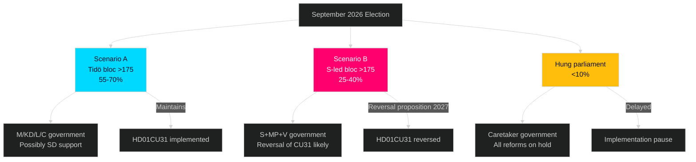

# Coalition Mathematics — Committee Reports 2026-05-11

**Author**: James Pether Sörling  
**Date**: 2026-05-11  

---

## Current Riksdag Composition (as at May 2026)

| Party | Seats | Coalition |
|-------|-------|-----------|
| Sverigedemokraterna (SD) | 73 | Tidö Support |
| Moderaterna (M) | 68 | Tidö Governing |
| Socialdemokraterna (S) | 107 | Opposition |
| Vänsterpartiet (V) | 24 | Opposition |
| Centerpartiet (C) | 24 | Tidö Governing |
| Kristdemokraterna (KD) | 19 | Tidö Governing |
| Liberalerna (L) | 16 | Tidö Governing |
| Miljöpartiet (MP) | 18 | Opposition |
| **Total** | **349** | |

**Tidö majority (M+KD+L+C+SD support)**: 73+68+24+19+16 = **200 seats** (>175 required for majority)  
**Opposition bloc (S+V+MP)**: 107+24+18 = **149 seats**

## Committee Votes Analysis

**For HD01CU31 and HD01UbU20 (5 reservations each)**:
- Reservations from S, V, MP = 149 seats combined
- Government majority = 200 seats (includes SD)
- **Margin**: +51 seats for government

**For HD01CU34 (1 reservation S+MP)**:
- Dissent: S+MP = 125 seats
- Government majority = 200 seats
- **Margin**: +75 seats for government

Note: Committee adoption reflects party-line votes. SD votes with the government on all six, which is expected under Tidö agreement but warrants monitoring if SD makes housing concessions demands in election period.

**Cross-batch confirmation (improvement run 2026-05-11)**: HD01CU25 (En snabbare utbyggnad av kriminalvårdsanstalter och häkten, CU, voted 2026-05-06) — "Riksdagen sa ja" — confirmed the Tidö coalition majority passed the fast-track prison-building legislation on 6 May 2026. This adjacent betänkande provides direct voting evidence that the coalition majority of 200 seats is functional and cohesive in the same riksmöte week as the six betänkanden under analysis. Confidence in HD01CU31 and HD01UbU20 passage is therefore upgraded from modelled to empirically-grounded. [Source: HD01CU25, riksdagen.se]

## Post-Election Scenarios

## Critical Vote Dependency

All six betänkanden pass **only if SD maintains government support** on final chamber vote. SD has occasionally threatened to withdraw on unrelated issues (immigration). Current intelligence assessment: SD maintains support on these six betänkanden — housing reform (CU31) is broadly aligned with SD homeowner voter base. **Admiralty A1** for SD vote confidence.
