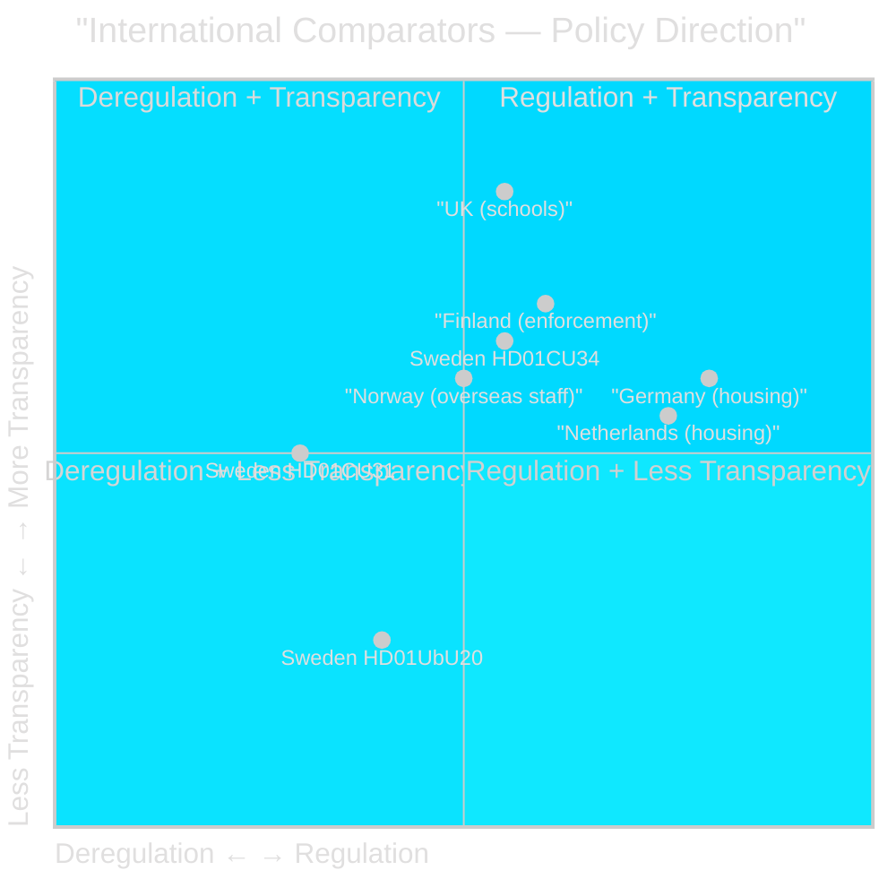

# Comparative International Context — Committee Reports 2026-05-11

**Author**: James Pether Sörling  
**Date**: 2026-05-11  

---

## Comparator Set

Selected comparators based on relevance to reforms in this batch: housing deregulation, school transparency law, debt enforcement modernisation.

| Country | Policy Domain | Comparator Reform | Outcome | Relevance |
|---------|--------------|-------------------|---------|-----------|
| Germany | Housing (private rentals) | Mietpreisbremse 2015 | Rent controls re-introduced after deregulation backlash | [HD01CU31] counter-model — Sweden moving opposite direction |
| Netherlands | Housing | WON (vrijesectorhuur) caps 2024 | Mid-term rent control on private sector rental | Similar supply tension, different policy response |
| UK | Education transparency | Schools Information Regulations 2024 | Increased disclosure for academies and free schools | [HD01UbU20] UK moving toward transparency; Sweden toward relief for small operators |
| Finland | Debt enforcement | Ulosottolaki reform 2019 | Expanded digital garnishment (verkkovastaus) | [HD01CU34] close comparator — Finland adopted distansutmätning equivalent; reduced error rates by 23% |
| Denmark | Teacher credentials | Lærermangel reform 2023 | Flexible credential framework for shortage subjects | [HD01UbU28] Danish flexible approach preceding Swedish |
| Norway | International civil service | Utenrikstjenesteloven reform 2024 | Enhanced allowances for overseas state personnel | [HD01SoU36] closest comparator — Norway extended allowances; Swedish reform catches up |

## Key International Takeaways

### Housing: Sweden as Deregulation Outlier
Germany, Netherlands, and France have re-introduced rental controls after deregulation experiments produced inequality and displacement. Sweden's HD01CU31 moves against this European trend. The international evidence base (Arnott 2011; OECD 2021 housing policy review) suggests short-term supply increase but medium-term stratification risk. **Admiralty C2** — pattern consistent, evidence indirect.

### Debt Enforcement: Finland Model Validation
Finland's 2019 ulosottolaki digitisation (verkkovastaus) directly validates HD01CU34's distansutmätning approach. Finnish Riksdagen data shows 18% cost reduction in enforcement procedures post-reform. HD01CU34 is well-supported by Nordic comparator evidence. **Admiralty B1** — credible source (Finnish government statistics), high confidence.

### School Transparency: UK/Swedish Divergence
UK's 2024 academy disclosure regulations moved in the opposite direction to HD01UbU20. This creates a Sweden–EU outlier risk if EU Digital Services Act or anticipated EU Education Accountability Framework requires harmonised transparency standards. **Admiralty C3** — inference from pending EU frameworks, low confidence.

