# Cross-Reference Map — Committee Reports 2026-05-11

**Author**: James Pether Sörling  
**Date**: 2026-05-11  

---

## Document Cross-References

```mermaid
%%{init: {'theme': 'dark', 'themeVariables': {'primaryColor': '#00d9ff', 'background': '#0a0e27'}}}%%
graph LR
    CU31["HD01CU31\nRental Law"] -->|Reservation coalition| OPP["S/V/MP Opposition"]
    UBU20["HD01UbU20\nSchool OSL"] -->|Reservation coalition| OPP
    CU34["HD01CU34\nDebt Enforcement"] -->|Partial reservation| SMP["S+MP Only"]
    SOU36["HD01SoU36\nOverseas Staff"] -->|Unanimous| COA["Full Chamber\nSupport"]
    UBU28["HD01UbU28\nTeacher Credentials"] -->|Unanimous| COA
    UU13["HD01UU13\nIPU Delegation"] -->|Noted to handlingarna| COA
    CU31 ---|Housing market reform| CU34
    UBU20 ---|Education governance| UBU28
    SOU36 ---|Foreign affairs nexus| UU13

style CU31 fill:#ff006e,color:#fff
style UBU20 fill:#ff006e,color:#fff
style CU34 fill:#ffbe0b,color:#0a0e27
style SOU36 fill:#00d9ff,color:#0a0e27
style UBU28 fill:#00d9ff,color:#0a0e27
style UU13 fill:#1a1e3d,stroke:#00d9ff
style OPP fill:#ff006e,color:#fff
style COA fill:#00d9ff,color:#0a0e27
```

## Legislative Cross-References

| dok_id | References | Related Law |
|--------|-----------|------------|
| HD01CU31 | prop 2025/26:187 | Privatuthyrningslag 2012 (replaces), JB 12 kap (hyreslagen) |
| HD01CU34 | prop 2025/26:224 | Utsökningsbalken (UB), barnets bästa principle |
| HD01SoU36 | prop 2025/26:204 | IL (Inkomstskattelagen), SFS cross-reference |
| HD01UbU20 | prop 2025/26:191 | OSL 29 kap, TF 2 kap, skollagen |
| HD01UbU28 | prop 2025/26:149 | Skollagen 2 kap, Skolverket förordning |
| HD01UU13 | Delegation report | IPU stadgar, Riksdagsordningen |

## Thematic Cross-References

**Housing + Civil Law**: CU31 ↔ CU34 — both processed by CU committee; together signal a comprehensive civil law reform agenda in spring 2026 session.

**Education**: UbU20 ↔ UbU28 — both processed by UbU committee; together signal education governance reforms affecting private school sector and teacher credentialing system.

**International**: SoU36 ↔ UU13 — SoU36 improves conditions for overseas deployment; UU13 reports on parliamentary international engagement. Together indicate increased Swedish international footprint post-NATO.
