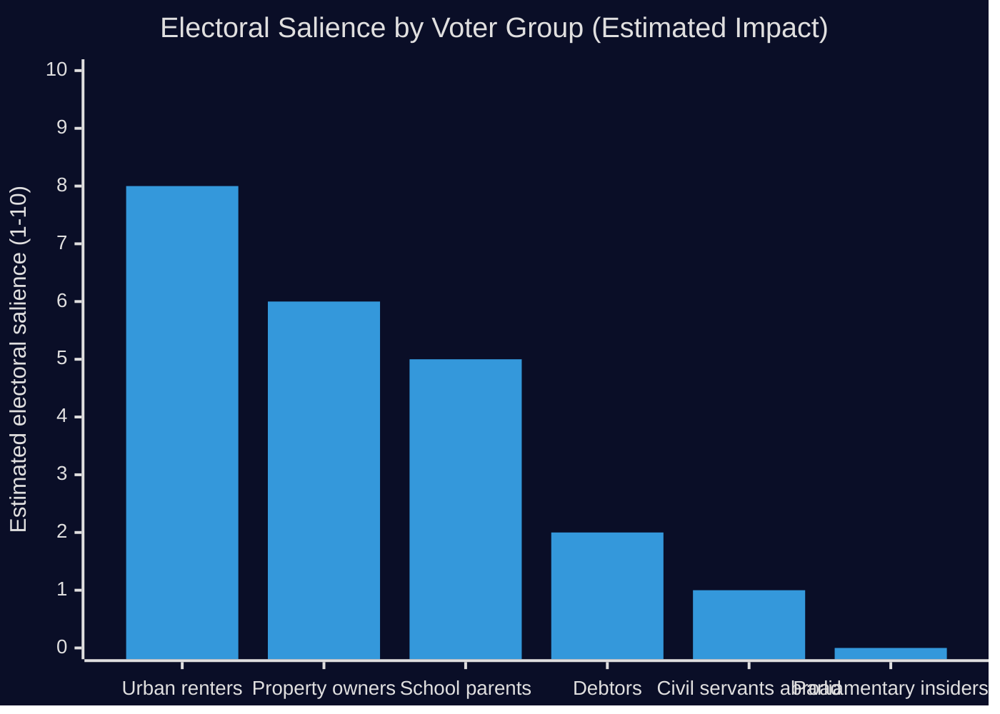

# Election 2026 Analysis — Committee Reports 2026-05-11

**Author**: James Pether Sörling  
**Date**: 2026-05-11  
**Horizon**: T+90d – T+180d (September 2026 election)  

---

## Electoral Salience Assessment

| dok_id | Electoral Relevance | Key Voter Segment | Issue Frame |
|--------|--------------------|--------------------|-------------|
| HD01CU31 | HIGH | Urban renters (25–45); property owners | Housing supply vs tenant protection |
| HD01UbU20 | MEDIUM | Parents of school-age children; school choice advocates | School accountability vs administrative burden |
| HD01CU34 | LOW | Debtors; creditors; Kronofogden | Enforcement modernisation |
| HD01SoU36 | LOW | Civil servants abroad | Overseas benefits |
| HD01UbU28 | VERY LOW | Teachers; Skolverket | Administrative credential |
| HD01UU13 | NONE | Parliamentary insiders | IPU reporting |

## Housing as Election Pivot Issue

HD01CU31 is the defining electoral issue in this batch. Swedish housing tenure breakdown (SCB 2024):
- ~50% owner-occupied
- ~20% public housing (kommunala bostadsbolag/allmännyttan)
- ~15% private rented (formal)
- ~15% cooperative/bostadsrättsförening

The private rental sector (15%) is the target of HD01CU31. Within this 15%, approximately half are in "deregulated" market and half under hyreslagen. The reform primarily affects new privatuthyrning contracts — estimated to add 10,000–20,000 units annually based on Boverket projections.

**Electoral arithmetic**: If tenant protection is a mobilising issue, S gains among urban renters (historically +3–5% in tenant-heavy Stockholm suburbs). If supply increase is salient, M/SD maintain suburban homeowner support. Net effect: likely electoral draw unless HD01CU31 implementation creates visible price spikes before election day.

## Education Voter Segment

HD01UbU20 targets a smaller but engaged voter segment: parents of children in independent schools (<35 employee operators). ~12% of Swedish school children attend friskolsektorn; within that, ~15% attend small operators. Direct electoral impact is limited, but the constitutional/TF framing (press freedom, transparency) can mobilise a wider centre-left coalition narrative about accountability.

## Pre-Election Timeline

- **May–June 2026**: Chamber vote on all six betänkanden; Royal assent expected by July
- **1 July 2026**: HD01CU31 enters force (if schedule maintained)
- **Summer 2026**: Housing price data; rental market response signals
- **September 2026**: Election Day
- **October 2026**: New government formation; reversal risk for HD01CU31 if S-led bloc wins

style note: Election date approximate based on Swedish election cycle. Exact date TBC.
