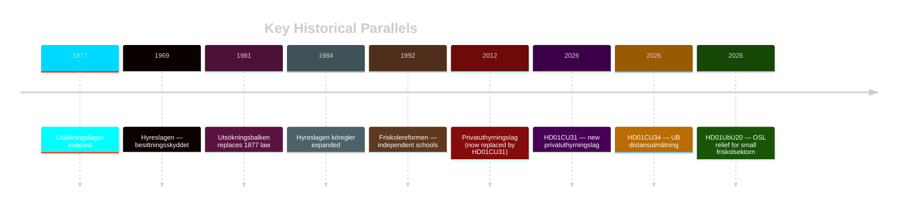

# Historical Parallels — Committee Reports 2026-05-11

**Author**: James Pether Sörling  
**Date**: 2026-05-11  

---

## Key Historical Parallels

### 1. Housing Law (HD01CU31) — 1969 and 1984 Hyreslagen Reforms

**1969 Reform**: Hyreslagen established besittningsskydd (permanent tenancy protection) and bruksvärdessystemet — transformed Swedish housing from free market to regulated. This is the benchmark against which HD01CU31 is measured. S reservation explicitly invokes besittningsskyddet tradition.

**1984 Reform**: Added köregler for housing queue (bostadskö) and expanded allmännytta role. Urban Social Democrats built electoral coalition around hyresgästernas rätt.

**Parallel**: HD01CU31 is the most significant departure from 1969/1984 hyreslagen logic in 40 years. Historically, rental market deregulation attempts (1990s Lindbeckkommissionen) were blocked or reversed under S governments. This reform succeeds only because of sustained centre-right majority since 2022.

**Divergence**: 2026 context differs — housing shortage is acute (record low new construction 2023–2025); 1984 context was surplus. This limits direct analogy.

### 2. School Transparency (HD01UbU20) — Friskolereformen 1992

**1992 Reform**: Bildt government introduced friskolereformen enabling establishment of independent schools with voucher funding. TF-alignment was not fully resolved at the time — created ongoing accountability gap.

**Parallel**: HD01UbU20 is a further step in the friskola regulatory framework, reducing archiving obligations for small operators. Mirrors the 1992 logic of reducing barriers for small independent operators.

**Divergence**: Post-2010 JO practice has created a de facto TF-accountability standard for schools. HD01UbU20 may create the first explicit statutory OSL relief — stronger legal effect than 1992 administrative practice.

### 3. Debt Enforcement (HD01CU34) — 1981 Utsökningsbalken

**1981 Reform**: UB replaced the Utsökningslagen (1877) with a modern codified framework. The 2026 HD01CU34 is the first major structural update in 45 years. Fits pattern of Swedish law refreshing foundational codes every 40–50 years.

style 1969 fill:#ff006e,color:#fff
style 1992 fill:#ffbe0b,color:#0a0e27
style 2026 fill:#00d9ff,color:#0a0e27
