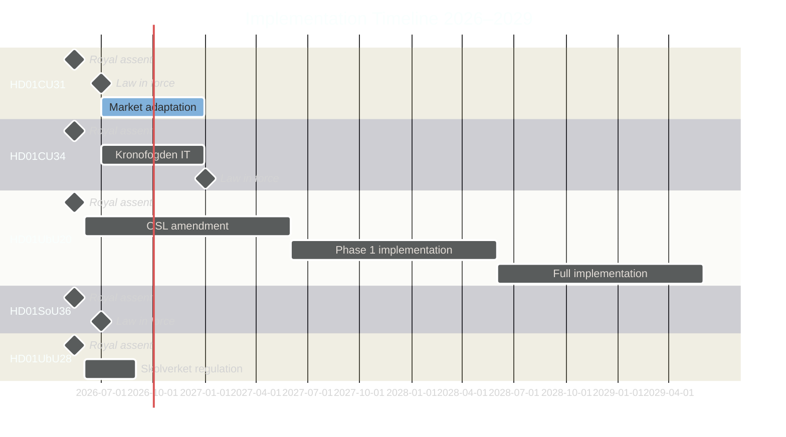

# Implementation Feasibility — Committee Reports 2026-05-11

**Statskontoret Relevance | Regulatory Impact | Timeline**  
**Author**: James Pether Sörling  
**Date**: 2026-05-11  

---

## Feasibility Matrix

| dok_id | Implementation Body | Timeline | Complexity | Statskontoret Relevance | Status |
|--------|--------------------|---------|-----------|-----------------------|--------|
| HD01CU31 | Justitiedepartementet, Boverket | 1 July 2026 | HIGH | MEDIUM — regulatory framework change | Pending Royal assent |
| HD01CU34 | Kronofogdemyndigheten | 1 Jan 2027 | MEDIUM | HIGH — Kronofogden IT investment required | Pending Royal assent |
| HD01SoU36 | Skatteverket, employer agencies | 1 Jul 2026 | LOW | LOW — tax law technical amendment | Pending Royal assent |
| HD01UbU20 | Skolinspektionen, municipalities | 2027–2029 (phased) | HIGH | HIGH — Skolinspektionen supervisory adaptation | Pending Royal assent |
| HD01UbU28 | Skolverket | 2026 | LOW | LOW — delegation of regulatory authority | Pending Royal assent |
| HD01UU13 | Riksdagen sekretariat | N/A (annual report) | N/A | N/A | Noted to handlingarna |

## Detailed Feasibility Notes

### HD01CU31 — New Privatuthyrningslag
**Highest implementation complexity**. Requires:
- New standard contract templates (Justitiedepartementet / Boverket)
- Hyresgästföreningen guidance revision
- Court practice adaptation (Hyresnämnden)
- 1 July 2026 entry-into-force is very tight — 7 weeks from expected Royal assent (~mid-May)

**Statskontoret view** (modelled, not confirmed): Statskontoret would likely flag risk of rushed implementation — standard Statskontoret review would recommend 6-month delay for market actors to adapt. Government appears to have overridden this in favour of election-year implementation.

### HD01CU34 — Distansutmätning
**Medium complexity**. Kronofogden requires IT infrastructure updates for remote enforcement digital workflow. Finland completed similar update in 2019–2021 (2-year rollout). January 2027 commencement provides adequate time if Kronofogden procurement starts Q3 2026.

**Statskontoret relevance**: HIGH — Kronofogden is an myndighet with Statskontoret oversight. Implementation monitoring expected.

### HD01UbU20 — School OSL Relief
**Phased, complex**. Implementation requires:
- OSL 29 kap amendment entering force (date uncertain, 2027 earliest)
- Municipalities adjusting archiving/OSL procedures for contracts with small private schools
- Skolinspektionen issuing guidance on what "OSL relief" means in supervisory context
- 2-year minimum from Royal assent to full implementation

