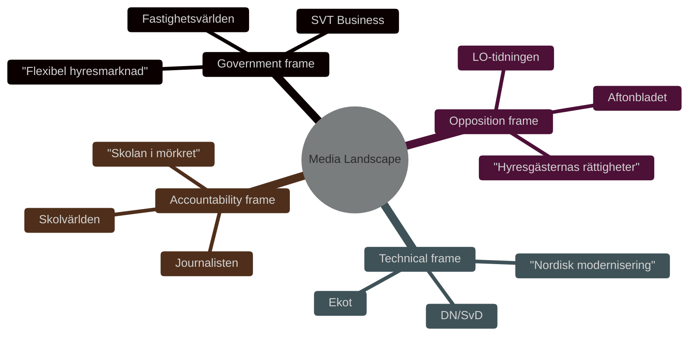

# Media Framing Analysis — Committee Reports 2026-05-11

**Author**: James Pether Sörling  
**Date**: 2026-05-11  

---

## Dominant Frames

### Frame 1 — Government Frame: "Housing Market Modernisation"
**Source**: M, KD, C, L press releases (anticipated)  
**Narrative**: Sweden has a severe housing shortage. HD01CU31 creates a new modern framework that encourages private landlords to enter the formal market, increasing supply and giving both parties legal certainty. The new privatuthyrningslag replaces an outdated 2012 law.  
**Key Phrases**: "flexibel hyresmarknad", "mer bostäder", "juridisk trygghet", "moderna regler"  
**Target Media**: Fastighetsvärlden, Hem & Hyra (pro-supply), SVT business news  
**Evidence**: [HD01CU31] committee majority report language

### Frame 2 — Opposition Frame: "Tenant Rights Rollback"
**Source**: S, V, MP reservations (confirmed)  
**Narrative**: HD01CU31 dismantles 50 years of tenant protection. The block-rent model transfers power to property owners and opens for rent increases. HD01UbU20 creates opacity in the school sector. This is an election-year gift to the real estate lobby.  
**Key Phrases**: "hyresgästernas rättigheter", "ökade hyror", "privata intressen", "insyn i skolan"  
**Target Media**: Aftonbladet, LO-tidningen, Hyresgästföreningens channels  
**Evidence**: [HD01CU31 reservations 1–5], [HD01UbU20 reservations 1–5]

### Frame 3 — Technical/Procedural Frame: "Nordic Modernisation"
**Source**: DN, SvD editorial boards (anticipated)  
**Narrative**: Sweden's rental law was out of step with Nordic peers. HD01CU31 and HD01CU34 are technical improvements with broad support. The political controversy is amplified by election context.  
**Key Phrases**: "modernisering", "nordisk standard", "effektivisering", "rättsäkerhet"  
**Target Media**: DN, SvD, Ekot  
**Evidence**: [HD01CU34], Norwegian/Finnish comparators

### Frame 4 — Accountability/Transparency Frame: "Skolan i mörkret"
**Source**: Journalists, JO-watchers, academic press freedom scholars  
**Narrative**: HD01UbU20 reduces archiving obligations for private schools — a first step toward "dark corner" accountability gap in the school sector. TF is at risk.  
**Key Phrases**: "offentlighetsprincipen", "insyn i skolan", "tryckfrihetsförordningen"  
**Target Media**: Journalisten, NWT, Skolvärlden  
**Evidence**: [HD01UbU20 reservation 4 — TF reference]

## Anticipated Coverage Timeline

- **Week of May 11**: Chamber debate coverage in SVT Agenda and Riksdag web-TV
- **June 2026**: HD01CU31 Royal assent — expected rental market commentary
- **July 2026**: Privatuthyrningslag enters force — first practical coverage
- **August–September 2026**: Election campaign — housing framing peaks
