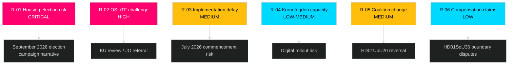

# Risk Assessment — Committee Reports 2026-05-11

**Author**: James Pether Sörling  
**Date**: 2026-05-11  

---

## Risk Register

| ID | Risk | Likelihood | Impact | Severity | Source |
|----|------|-----------|--------|---------|--------|
| R-01 | Housing law creates partisan flashpoint before September 2026 elections | HIGH | HIGH | CRITICAL | [HD01CU31 reservations 1–5] |
| R-02 | OSL/TF-dimension of HD01UbU20 challenged at Riksdag constitutional review (KU) | MEDIUM | HIGH | HIGH | [HD01UbU20 reservation 4] |
| R-03 | Privatuthyrningslag (HD01CU31) enters force 1 July 2026 but implementation guidance delayed | MEDIUM | MEDIUM | MEDIUM | [HD01CU31] |
| R-04 | Kronofogden digital capacity insufficient for expanded distansutmätning | LOW | MEDIUM | LOW-MEDIUM | [HD01CU34] |
| R-05 | Coalition change post-September 2026 reverses HD01UbU20 school transparency relief | MEDIUM | MEDIUM | MEDIUM | [HD01UbU20] |
| R-06 | HD01SoU36 foreign service allowances create double-compensation claims by personnel | LOW | LOW | LOW | [HD01SoU36] |

## Top Risk Detail

### R-01 — Housing as Election Issue

**HD01CU31** ("En mer flexibel hyresmarknad") is the highest-risk document in this batch. The proposal creates a new legal framework for private rentals (privatuthyrningslag) that replaces the 2012 Act, introducing:
- Negotiated block-rent model at national level
- Long-term tenancy security changes
- Reduced tenant protections per opposition analysis

S, V, and MP filed five reservations. S reservation #2 explicitly frames this as a regression of hyresgästskydd (tenant protection). In an election year where housing is ranked #1–3 voter priority (SCB polling), this reform is a mobilising issue for both sides.

**Admiralty Rating**: B2 — Credible source (opposition reservations), medium confidence on electoral effect size.

### R-02 — Constitutional Risk HD01UbU20

The HD01UbU20 proposal modifies OSL (chapter 29) to provide OSL relief to enskilda huvud­män med färre än 35 anställda. This reduces archiving and transparency obligations for private school operators. The TF dimension (right to access public documents) is affected because private schools fulfilling public missions are ordinarily subject to TF-aligned OSL obligations. Risk of Riksdagen konstitutionsutskott (KU) review or JO referral is MEDIUM — requires a formal complaint but the TF argument is legally sound.

