```mermaid
%%{init: {'theme': 'dark', 'themeVariables': {'primaryColor': '#00d9ff', 'background': '#0a0e27'}}}%%
graph TD
    START["Chamber Vote ~May 2026"] --> A_VOTE["Vote outcome\n6 betänkanden pass"]
    A_VOTE --> ELECTION["September 2026\nElection"]
    ELECTION --> A["Scenario A\nCoalition continuity\n55-70%"]
    ELECTION --> B["Scenario B\nS-led government\n25-40%"]
    A_VOTE --> C["Scenario C\nKU challenge\n10-20%"]
    A --> A1["Full implementation\nby 2027"]
    B --> B1["HD01CU31 reversal\n2027-2028"]
    C --> C1["HD01UbU20 delayed\nto 2028"]

style A fill:#00d9ff,color:#0a0e27
style B fill:#ffbe0b,color:#0a0e27
style C fill:#ff006e,color:#fff
style START fill:#1a1e3d,stroke:#00d9ff

```

# Scenario Analysis — Committee Reports 2026-05-11

**Author**: James Pether Sörling  
**Date**: 2026-05-11  

---

## Scenario Overview

Three scenarios modelled over T+72h → T+1460d (2026–2030), based on six betänkanden batch and current political context.

---

## Scenario A — Base Case: Full Implementation, Coalition Continuity
**WEP**: Likely (55–70%)  
**Horizon**: T+90d – T+365d

HD01CU31 (privatuthyrningslag) enters force 1 July 2026; HD01UbU20 phased implementation 2027–2029. September 2026 election produces narrow centre-right majority. Tidö coalition continues or reforms with similar composition. S uses housing/school reforms as campaign issue but fails to build majority for reversal. Kronofogden receives IT funding for HD01CU34 distansutmätning rollout.

**Key Drivers**: Housing shortage narrative benefits government; SD voter base stable; C and L hold moderate gains.

**Evidence**: [HD01CU31], [HD01UbU20], current Novus/Sifo polling averages (April 2026, accessed via riksdagsmonitor.com)

---

## Scenario B — Opposition Win: Partial Reversal
**WEP**: Realistic Possibility (25–40%)  
**Horizon**: T+365d – T+730d

September 2026 election produces S-led government with V and MP support. New government proposes tilläggsdirektiv to revisit HD01CU31 (privatuthyrningslag) and HD01UbU20 (school OSL). Full reversal of HD01CU31 takes 12–18 months via new proposition. HD01UbU20 paused pending new utredning. HD01CU34, HD01SoU36, HD01UbU28 maintained.

**Key Drivers**: Housing affordability crisis mobilises urban renters (S stronghold); V and MP exceed 4% threshold; M loses urban moderates.

**Evidence**: S reservation 2 on [HD01CU31] explicitly signals reversal intent; S manifesto draft leaks indicate housing as #1 priority.

---

## Scenario C — Constitutional Challenge Delays HD01UbU20
**WEP**: Unlikely (10–20%)  
**Horizon**: T+72h – T+180d

KU receives formal complaint from academic legal scholar or opposition MP regarding TF-dimension of HD01UbU20 within 30 days of chamber vote. Riksdagen jurist issues clarifying memo. Government delays commencement order pending KU response. OSL relief for <35 employee schools postponed to 2028.

**Key Drivers**: Active constitutional scholars (e.g., Nils Funcke or equivalent press freedom scholars) file formal notice; media attention on school transparency.

**Evidence**: [HD01UbU20 reservation 4] explicitly raises TF concern; OSL 29 kap reform history shows prior KU scrutiny.

---

