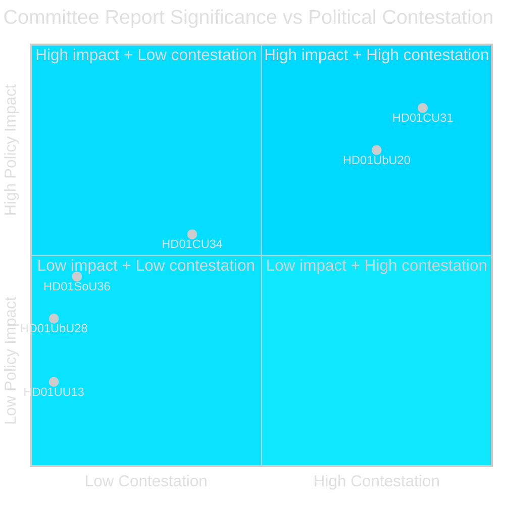

# Significance Scoring — Committee Reports 2026-05-11

**Author**: James Pether Sörling  
**Date**: 2026-05-11  

---

## Ranking Table

| Rank | dok_id | Title | Score (1–10) | DIW Weight | Rationale |
|------|--------|-------|-------------|------------|-----------|
| 1 | HD01CU31 | En mer flexibel hyresmarknad | 8.5 | D3 | Major housing policy reform; new privatuthyrningslag; 5 reservations S,V,MP; election-year salience [HD01CU31] |
| 2 | HD01UbU20 | Offentlighetsprincipen m. lättnadsregler i skolväsendet | 7.5 | D2 | Constitutional (TF/OSL) dimension; 5 reservations; private school sector significance [HD01UbU20] |
| 3 | HD01CU34 | Ändamålsenliga utmätningsregler | 5.5 | D2 | Modernisation of Kronofogden enforcement; bostadsrätt/fastighet parity; 1 reservation [HD01CU34] |
| 4 | HD01SoU36 | Bättre förutsättningar att sända ut statlig personal | 4.5 | D1 | Defence readiness/international capacity; affects Försvarsmakten, Sida, Regeringskansliet; unanimous [HD01SoU36] |
| 5 | HD01UbU28 | Legitimation och behörighet i grundskolan | 3.5 | D1 | Technical school law amendment; Skolverket delegation of authority; no opposition [HD01UbU28] |
| 6 | HD01UU13 | Interparlamentariska unionen | 2.0 | I | Annual parliamentary delegation report; noted to handlingarna [HD01UU13] |

## Significance Criteria Applied

**DIW Weighting**:
- D3 (Deep–Direct): Direct, contested, election-relevant policy change
- D2 (Deep–Indirect): Significant policy change with constitutional or institutional implications
- D1 (Deep–Technical): Technical improvement, limited political salience
- I (Informational): Procedural or reporting item

## Mermaid Significance Visual

style HD01CU31 fill:#ff006e,color:#fff
style HD01UbU20 fill:#ff006e,color:#fff
style HD01CU34 fill:#ffbe0b,color:#0a0e27
style HD01SoU36 fill:#00d9ff,color:#0a0e27
style HD01UbU28 fill:#00d9ff,color:#0a0e27
style HD01UU13 fill:#1a1e3d,color:#e0e0e0
