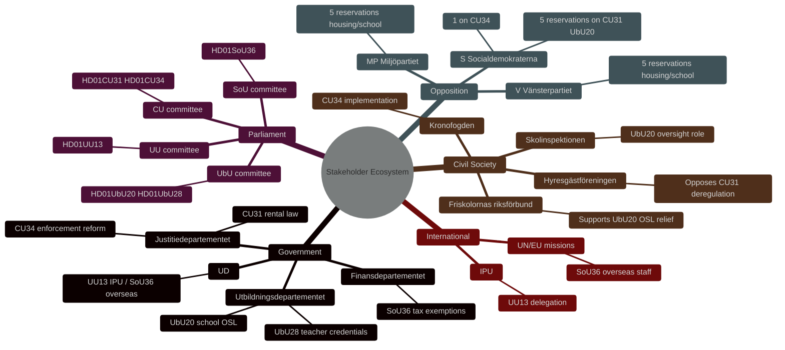

# Stakeholder Perspectives — Committee Reports 2026-05-11

**Author**: James Pether Sörling  
**Date**: 2026-05-11  

---

## Stakeholder Map

## Key Stakeholder Positions

### Hyresgästföreningen (Tenant Federation)
**Position**: Opposes HD01CU31. The privatuthyrningslag reduces tenant protections in an already supply-constrained market. Concern: block-rent model enables landlords to circumvent individual tenancy protections. Will likely run public campaign against implementation. [HD01CU31 S reservation 2]

### Friskolornas riksförbund (Independent Schools Association)
**Position**: Supports HD01UbU20. OSL/archiving relief for schools with <35 employees reduces compliance costs without eliminating accountability for the largest operators. Will lobby Skolinspektionen for narrow interpretation of remaining OSL obligations. [HD01UbU20]

### Kronofogdemyndigheten
**Position**: Implementer of HD01CU34's expanded distansutmätning. Will require IT investment for digital enforcement procedures. Supportive of modernisation but timeline-concerned. [HD01CU34]

### Skolverket
**Position**: Gains delegated authority under HD01UbU28 to adjust teacher credential requirements for 10-year grundskola without individual statutory amendments. Administratively beneficial. [HD01UbU28]

### Socialdemokraterna (S)
**Position**: Filed 5 reservations on HD01CU31 and HD01UbU20 — coordinated opposition. In government minority opposition position, cannot block but will use chamber debate and election campaign to build case for reversal. [HD01CU31, HD01UbU20 reservations 1–5]
