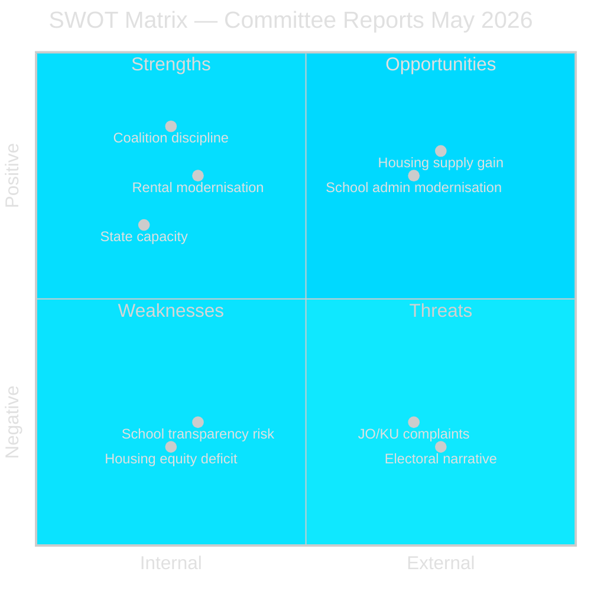

# SWOT Analysis — Committee Reports 2026-05-11

**Author**: James Pether Sörling  
**Date**: 2026-05-11  

---

## Strengths

- **Coalition legislative efficiency**: All six betänkanden move to chamber vote without internal coalition dissent, demonstrating Tidö bloc discipline in the final pre-election legislative session [HD01CU31, HD01CU34, HD01SoU36, HD01UbU20, HD01UbU28, HD01UU13]
- **Rental market modernisation**: HD01CU31 introduces a new privatuthyrningslag replacing the 2012 Act, designed to increase rental supply by lowering barriers for private owners — addresses long-standing housing shortage diagnosis [HD01CU31, riksdagen.se prop 2025/26:187]
- **Legal technical quality**: HD01CU34 addresses proportionality principle and barnets bästa in utsökningsbalken — improves rule-of-law alignment [HD01CU34, riksdagen.se prop 2025/26:224]
- **State capacity for international deployment**: HD01SoU36 removes tax/healthcare barriers for overseas government personnel — timely given increased Swedish international commitments post-NATO accession [HD01SoU36, riksdagen.se prop 2025/26:204]

## Weaknesses

- **Housing equity deficit**: HD01CU31's new private rental model and block-rent changes are framed by S, V, MP as favouring property owners over tenants, reducing tenant protections — risk of electoral backlash [HD01CU31 reservations 1–5]
- **School transparency erosion risk**: HD01UbU20's OSL relief for smaller private principals weakens democratic accountability in school choice sector per S, V, MP reservations — unresolved TF dimension [HD01UbU20 reservations 1–5]
- **No Lagrådet review completed**: HD01CU31 and HD01UbU20 involve significant civil and constitutional law changes; no Lagrådet yttranden published as of 2026-05-11, leaving implementation legal risk [riksdagen.se]
- **Enforcement digitalisation risk**: HD01CU34's expanded remote enforcement (distansutmätning) introduces digital infrastructure dependencies for Kronofogdemyndigheten [HD01CU34]

## Opportunities

- **Housing supply increase**: Successful implementation of HD01CU31 could increase private rental stock by simplifying legal framework for private landlords — partial relief for housing shortage [HD01CU31]
- **School sector accountability modernisation**: If implemented correctly, HD01UbU20 could reduce administrative burden on smaller independent schools without sacrificing substantive transparency — enables scale in school choice [HD01UbU20]
- **International competitiveness**: HD01SoU36 strengthens Sweden's ability to staff international missions — geopolitical asset post-NATO [HD01SoU36]
- **Teacher credential flexibility**: HD01UbU28 enables Skolverket to adjust credential requirements for the new 10-year grundskola without individual applications — reduces bureaucratic friction [HD01UbU28]

## Threats

- **Electoral narrative weaponisation**: S's five reservations on HD01CU31 are likely campaign material for September 2026 elections; housing equity is a top voter concern [HD01CU31 reservation 2, 3]
- **JO/KU complaints on HD01UbU20**: The OSL/TF changes could generate constitutional complaints or JO referrals from municipalities, journalists, and parents' organisations [HD01UbU20 reservation 4]
- **Implementation timeline risk**: HD01CU31 enters force 1 July 2026; HD01UbU20 phased 2027–2029 — tight for the outgoing government if election produces coalition change [HD01CU31, HD01UbU20]
- **IPU soft-power erosion**: HD01UU13 shows continued Swedish engagement in IPU but notes delegation leadership changes (Cederfelt (M) as ordförande) — partisan composition risk in multilateral forums [HD01UU13]

style "Coalition discipline" fill:#00d9ff,color:#0a0e27
style "Electoral narrative" fill:#ff006e,color:#fff
