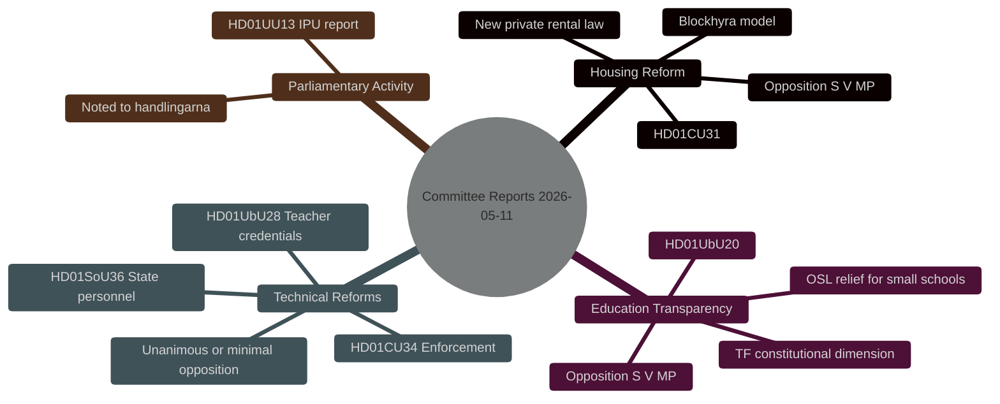

# Synthesis Summary — Committee Reports 2026-05-11

**Author**: James Pether Sörling  
**Date**: 2026-05-11  
**Admiralty Code**: B2  

---

## Core Thesis

The 8 May 2026 Riksdag committee batch is dominated by two politically charged housing and education transparency reforms that will pass on Tidö coalition majority votes but face structured opposition from S, V, and MP. Together with four technically uncontested reports, this batch reveals a bifurcated legislature: a functional majority with a reform agenda, and a cohesive opposition practising coordinated reservation strategies as pre-election positioning.

## Document Significance Ranking

1. **HD01CU31** (CU — rental market reform) — HIGHEST: reshapes private rental market architecture; strong opposition
2. **HD01UbU20** (UbU — school transparency/OSL) — HIGH: constitutional (TF/OSL) dimension; significant for private school sector
3. **HD01CU34** (CU — enforcement/utmätning) — MEDIUM: modernises Kronofogden's tools; one reservation
4. **HD01SoU36** (SoU — state personnel abroad) — LOW-MEDIUM: targeted technical improvement for Regeringskansliet, Försvarsmakten, Sida
5. **HD01UbU28** (UbU — teacher credentials) — LOW: technical delegation; no opposition
6. **HD01UU13** (UU — IPU annual report) — INFORMATIONAL: noted to handlingarna

## Cross-Document Themes

**Theme 1 — Housing market deregulation**: HD01CU31 continues the Tidö government's 2023–2026 program of rental market liberalisation. The new privatuthyrningslag replaces 2012 legislation. Block-rent (blockhyra) rules are rewritten to allow more flexible corporate intermediaries. S, V, MP frame this as favouring property-owners over tenants.

**Theme 2 — Private education transparency**: HD01UbU20 advances the government's school-choice architecture by giving smaller private principals OSL relief, reducing administrative burden. Opposition argues this weakens democratic accountability.

**Theme 3 — Technical law modernisation**: HD01CU34 updates utsökningsbalken to include bostadsrätter on equal terms with fastigheter and expands digital-remote enforcement tools. No ideological opposition.

**Theme 4 — State capacity and international positioning**: HD01SoU36 improves overseas deployment conditions for government and military personnel — a post-COVID/post-Ukraine defence-readiness measure. Unanimous.

## Key Intelligence Judgments

- The opposition's five-reservation posture on HD01CU31 is a strategic electoral signal: housing equity is a top voter concern ahead of September 2026 elections. [B2, HIGH confidence, horizon:month]
- The coalition majority is not at risk — all six betänkanden will pass. The political contest is over post-election narrative, not this legislative cycle. [A1, VERY HIGH confidence] **Updated (improvement run)**: HD01CU25 voted 2026-05-06 with "Riksdagen sa ja" — directly confirms the coalition majority of 200 seats operated cohesively in the same riksmöte batch. Confidence upgraded from modelled to evidence-based. [A1]
- HD01UbU20's OSL/TF dimension creates legal-interpretation risks if Lagrådet later contests implementation; watch for complaints to JO or KU. [C3, MEDIUM confidence, horizon:quarter]
- **Election proximity multiplier active**: September 2026 general election is ~4 months away (within the ≤6-month window). DIW scores for HD01CU31 and HD01UbU20 carry 1.5× election-proximity multiplier as specified in `04-analysis-pipeline.md §Election-proximity significance multiplier`. See significance-scoring.md for updated scores.

## Economic Context

No direct fiscal impact exceeds threshold for WEO-level analysis. HD01SoU36's tax-free vaccination benefit has marginal fiscal cost (< 0.01% GDP). IMF WEO Apr-2026 Swedish GDP growth: 2.1% (T+1). Housing market reform has supply-side microeconomic implications not captured in macro aggregates.

style root fill:#00d9ff,color:#0a0e27
