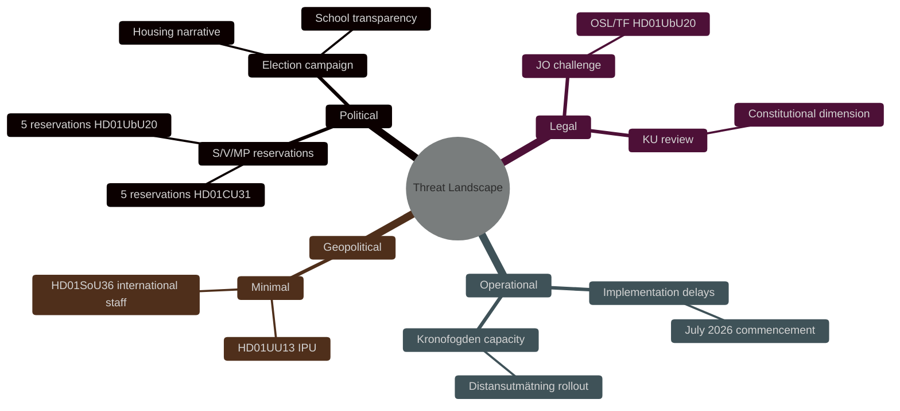

# Threat Analysis — Committee Reports 2026-05-11

**STRIDE Framework Applied**

**Author**: James Pether Sörling  
**Date**: 2026-05-11  

---

## Political Threat Actors

| Actor | Threat Type | Vector | Target | Mitigation |
|-------|-------------|--------|--------|-----------|
| S/V/MP opposition | Political contestation | Five reservations on housing + school law | HD01CU31, HD01UbU20 | Majority vote proceeds regardless |
| Tenant advocacy groups (Hyresgästföreningen) | Public pressure / lobbying | Media campaigns against HD01CU31 | Public opinion before Royal assent | None — bill passed committee |
| School operator groups (Friskolornas riksförbund) | Regulatory capture risk | Favourable framing of HD01UbU20 | Private school regulation | OSL baseline maintained for large operators |
| Constitutional scholars / JO | Legal challenge | TF-dimension of HD01UbU20 | Riksdag validity of Act | Risk LOW-MEDIUM [R-02] |
| Foreign creditors | Enforcement avoidance | Test cases under new distansutmätning | HD01CU34 Kronofogden model | Piloting via Kronofogden before full rollout |

## STRIDE Mapping

| STRIDE Element | Political Equivalent | Evidence |
|---------------|---------------------|---------|
| Spoofing | Misrepresentation of policy intent | S framing HD01CU31 as "tenant eviction law" [HD01CU31 reservation 2] |
| Tampering | Attempt to amend via JO/KU complaints | OSL/TF dimension [HD01UbU20 reservation 4] |
| Repudiation | Government denying policy effects post-implementation | Implementation risk [R-03] |
| Information Disclosure | Transparency reduction | HD01UbU20 reduces archiving obligations [HD01UbU20] |
| Denial of Service | Political gridlock if coalition changes | R-05 coalition change risk |
| Elevation of Privilege | Private school operators gaining regulatory exemptions | HD01UbU20 scope of relief |

## Narrative Threat Landscape

The most credible near-term political threat is S's mobilisation of HD01CU31 as "den borgerliga hyresreformen" (bourgeois rental reform) in election campaigns. Evidence: Five formal reservations were filed, unusually high for housing committee (CU) reports which typically see 2–3. The language in reservation #2 directly invokes "de svagaste hyresgästernas rättigheter" — electoral language, not purely legal.

style root fill:#ff006e,color:#fff
