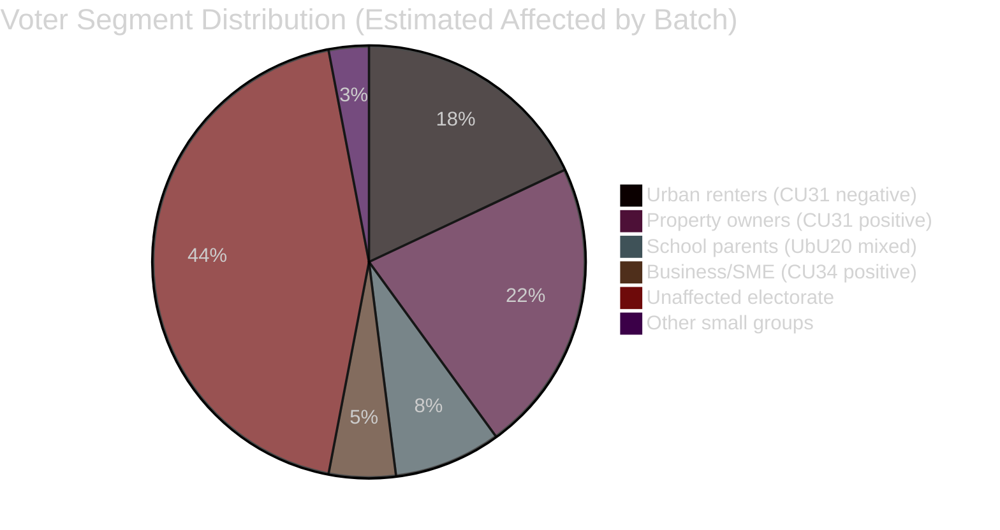

# Voter Segmentation — Committee Reports 2026-05-11

**Author**: James Pether Sörling  
**Date**: 2026-05-11  

---

## Segmentation Matrix

| Segment | Key Reform | Expected Response | Party Alignment | Size |
|---------|-----------|------------------|-----------------|------|
| Urban renters (Stockholm, Gothenburg, Malmö) | HD01CU31 | Negative if rent increase | S, V, MP | ~18% electorate |
| Private landlords / property owners | HD01CU31 | Positive — new legal framework | M, SD, C | ~22% electorate |
| School parents (friskola sector) | HD01UbU20 | Mixed — relief vs accountability concern | C, KD, S | ~8% electorate |
| Business debtors / SME | HD01CU34 | Positive — modernised enforcement | M, C | ~5% electorate |
| Civil servants abroad / defence | HD01SoU36 | Positive — improved benefits | M, SD | ~1% electorate |
| Teachers / education professionals | HD01UbU28 | Neutral-positive — less admin | S, L | ~2% electorate |

## Swing Voter Implications

**Key swing group**: Urban homeowners (bostadsrättsinnehavare) in Stockholm suburbs who rent out secondary property. This group benefits directly from HD01CU31 (new privatuthyrningslag removes prior rental obstacles). Estimated ~5–7% of electorate. Currently split M/SD (55%) and S (25%) with residual C/L.

If HD01CU31 is effectively marketed as "enabling sharing economy in housing", M/C could gain among this segment. If S's "tenant protection regression" narrative dominates, this segment reverts to mean.

## Gender and Age Dimension

- **Renters**: Over-represented among 20–35 year olds (highest renter rate 62% SCB 2024); gender-neutral
- **Property owners**: Over-represented 45–65; slight male lean for investment property
- **School parents**: Concentrated 30–45; roughly gender-neutral
- **Civil servants abroad**: Slight female lean in diplomatic/development sector; male lean in defence

Housing reform disproportionately affects young urban voters (20–35) — a segment that turned sharply toward S in 2022. HD01CU31's reception in this segment will be a leading indicator of electoral risk for the government bloc.
