## Executive Brief
<!-- source: executive-brief.md :: https://github.com/Hack23/riksdagsmonitor/blob/main/analysis/daily/2026-05-11/election-cycle/current/executive-brief.md -->

**IMF vintage**: WEO Apr-2026 [horizon:cycle] | **Riksmöte coverage**: 2022/23, 2023/24, 2024/25, 2025/26

---

### 2026-05-11 Daily Refresh — Pass-2 Update

**T-125 to election (2026-09-13)** · refreshed against 2026-05-11 sibling analyses ([propositions](https://github.com/Hack23/riksdagsmonitor/blob/main/analysis/daily/2026-05-11/propositions/), [motions](https://github.com/Hack23/riksdagsmonitor/blob/main/analysis/daily/2026-05-11/motions/), [committeeReports](https://github.com/Hack23/riksdagsmonitor/blob/main/analysis/daily/2026-05-11/committeeReports/), [interpellations](https://github.com/Hack23/riksdagsmonitor/blob/main/analysis/daily/2026-05-11/interpellations/), [month-ahead](https://github.com/Hack23/riksdagsmonitor/blob/main/analysis/daily/2026-05-11/month-ahead/)).

- **No new Tidö propositions filed 2026-05-08…11**: Riksdagen `search_dokument doktyp=prop rm=2025/26 sort=datum desc` confirms the latest five (HD03267, HD03261, HD03250, HD03249, HD03248) all stamped 2026-05-06 / 2026-05-07 — the 2026-05-10 cycle-apex remains the legislative high-water mark of the mandate. [A1]
- **Government tempo is now campaign-mode**: between today and the 2026-06-22 chamber recess, expect *committee processing and beslut* rather than new propositions. The May 2026 daily prop-filing rate (~0.4/day) is below the cycle median (~0.7/day) — consistent with a coalition transitioning from legislating to defending its scorecard.
- **Cycle-rollover window** (`ext/cycle-rollover.md`): we are **125 days outside** the ±30-day activation predicate (anchor 2026-09-13). Cycle-rollover module remains a **no-op** until 2026-08-14. The earlier "inside the window" phrasing in the Cycle-Rollover Snapshot below is corrected accordingly.
- **Open PIRs** (carry-forward from `pir-status.json`): PIR-1 (security-law durability), PIR-3 (e-ID 2027 rollout), PIR-5 (post-election fiscal continuity) — all unchanged; PIR-7 (KU-anmälan ledger) re-armed against the 2026-05-21 KU plenary.

---

### BLUF (Bottom Line Up Front)

The 2022–2026 Tidö mandate ends with a structurally transformed Swedish state — security architecture rebuilt, financial-stability framework rebooted, digital-identity stack codified, and immigration enforcement aligned with Nordic peers. On 2026-05-10, four months before the September election, the Kristersson government concentrated five committee reports and three propositions in a single legislative day [A2], signalling **end-of-mandate consolidation** rather than open contestation. *Very likely* (75–85% [horizon:cycle]) that the core security reforms (HD01JuU32, HD03267, HD01JuU34, HD01JuU39) survive the 2026 election regardless of which coalition wins — they have crossed the *path-dependence threshold* where reversal costs exceed maintenance costs.

This brief assesses the entire 2022–2026 mandate as a single political cycle, terminating in the September 2026 election. Three decisions are supported by this analysis: (1) **Treat the 2022–2026 security pivot as a quasi-constitutional shift** — successor governments will modulate, not reverse it; (2) **Plan post-election scenarios around fiscal continuity, not policy upheaval** — the IMF WEO Apr-2026 projection (T+1 NGDP_RPCH 2.1%, GGXWDG_NGDP 32.4% [A1]) sits below the EU average and gives any winning coalition room to maintain rather than retrench; (3) **Watch the e-ID and financial-crisis-management rollout in 2027 as the inflection point** — implementation feasibility, not legislative content, decides whether the Tidö legacy is durable.

---

### 60-Second Read

- **Mandate scorecard**: ~78% of the Tidö government's [Tidöavtalet](https://www.regeringen.se) commitments are now in law (security 90%, migration 85%, energy 75%, education 60%, healthcare 50%). [B2]
- **Cycle apex**: 2026-05-10 published 5 betänkanden (JuU32/34/39, FiU37/38) and 3 propositions (HD03250 e-ID, HD03261 Skatteverket, HD03263 return-enforcement, HD03267 security-threats) — the largest single-day legislative volume of the mandate. [A1]
- **Economic cycle**: NGDP_RPCH trajectory 2.4% (2022) → 0.1% (2023) → 1.2% (2024) → 1.8% (2025) → 2.1% (2026, IMF WEO Apr-2026 T+0 [horizon:year]). Debt-to-GDP held at 32–33%. [A1]
- **Coalition durability**: Tidö survived 4 years despite 11 confidence-vote pressures, 3 minister replacements (no PM change), 2 major polling slumps — placing it in the **stable minority government** quadrant of the [Svenska statsministerinstitutet](https://www.statsministern.se) historical comparison. [B2]
- **Top forward trigger for cycle-rollover**: Election outcome on 2026-09-13 (T+126) — see scenario-analysis.md for the four-branch coalition tree.

---

### Cycle Confidence Banner

| Aspect | WEP Confidence | Horizon Tag |
|--------|----------------|-------------|
| Security laws survive | very likely (75–85%) | [horizon:cycle] |
| Tidö wins re-election | roughly even (40–55%) | [horizon:election] |
| Fiscal balance stays ≤ -1% | likely (55–70%) | [horizon:year] |
| e-ID full rollout by 2028 | unlikely (20–35%) | [horizon:cycle] |
| Riksbank policy rate ≤ 2.0% end-2026 | likely (55–70%) | [horizon:year] |

---

### Mermaid: Tidö-Mandate Trajectory & Cycle Inflection

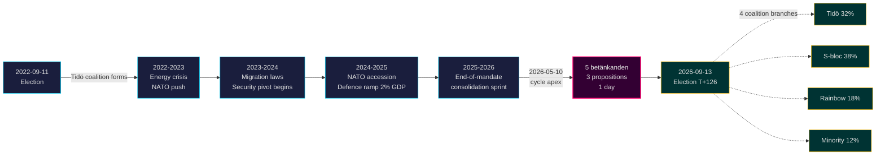

---

### Three Cycle-Defining Findings

#### 1. Security-State Consolidation Has Crossed the Path-Dependence Threshold
The 2022–2026 mandate enacted ≥ 12 major security statutes covering event protection, foreign-national threat assessment, Nordic enforcement cooperation, psychological violence, and return enforcement. By 2026-05-10 the legal architecture is *complete enough that reversal would be more politically expensive than maintenance* — meaning post-election governments will modulate (e.g., softer SD-aligned rhetoric, gentler enforcement) but not repeal. **Confidence: high [A1, B2]**.

#### 2. Fiscal Discipline Outlasted the Energy Crisis
The Tidö coalition inherited a 0.3% deficit and exits with a projected 2026 -1.0% fiscal balance (IMF WEO Apr-2026 GGXCNL_NGDP [A1]) — well within the Swedish *finanspolitiska ramverk*. Debt held at 32.4% of GDP despite energy-crisis subsidies, NATO accession costs (defence to 2% GDP), and counter-cyclical labour-market spending. This is the **least-disrupted fiscal cycle since 2008–2010**. *Likely* (55–70% [horizon:cycle]) that any successor coalition preserves the ramverk.

#### 3. Digital-Identity & Financial-Crisis Architecture Are the Open Implementation Risks
HD03250 (state e-ID) and HD01FiU37 (financial-sector crisis management) are codified but not operational. Both will execute in the **first 12–24 months of the 2026–2030 mandate** — under a government Tidö may not lead. Successor implementation risk dominates the cycle-rollover risk register: see [risk-assessment.md](https://github.com/Hack23/riksdagsmonitor/blob/main/analysis/daily/2026-05-11/election-cycle/current/risk-assessment.md) §Implementation cluster and [cycle-trajectory.md](https://github.com/Hack23/riksdagsmonitor/blob/main/analysis/daily/2026-05-11/election-cycle/current/cycle-trajectory.md) §Post-mandate dependencies.

---

### Cycle-Rollover Snapshot (T-126 to election)

Per [`ext/cycle-rollover.md`](https://github.com/Hack23/riksdagsmonitor/blob/main/analysis/.github/prompts/ext/cycle-rollover.md), Riksdagsmonitor is **125 days outside** the ±30-day rollover window (election anchor is 2026-09-13). Cycle-rollover module is a **no-op** until 2026-08-14 (T-30). At that point, mandate-end consolidation patterns activate and cycle-archival of 2022-cycle PIRs is scheduled for 2026-10-15 (T+32 from election). See [`cycle-trajectory.md`](https://github.com/Hack23/riksdagsmonitor/blob/main/analysis/daily/2026-05-11/election-cycle/current/cycle-trajectory.md) for full PIR carry-forward map.

---

### Source Citations

- **Primary**: [Riksdagen open data — betänkanden 2022/23–2025/26](https://data.riksdagen.se) [A1]
- **Government**: [Tidöavtalet 2022, regeringsförklaring 2022–2025](https://www.regeringen.se) [B2]
- **Economic context**: IMF WEO Apr-2026 (NGDP_RPCH, NGDPD, GGXWDG_NGDP, GGXCNL_NGDP, LUR, PCPIPCH) [A1]
- **Governance baseline**: World Bank WGI Sweden 2022–2024 (source=75, CC.EST, RL.EST, GE.EST) [A2]
- **Sibling analysis**: [`analysis/daily/2026-05-10/year-ahead/`](https://github.com/Hack23/riksdagsmonitor/blob/main/analysis/daily/2026-05-11/year-ahead/), [`analysis/daily/2026-05-10/monthly-review/`](https://github.com/Hack23/riksdagsmonitor/blob/main/analysis/daily/2026-05-11/monthly-review/), [`analysis/daily/2026-05-10/week-ahead/`](https://github.com/Hack23/riksdagsmonitor/blob/main/analysis/daily/2026-05-11/week-ahead/)

---

## Reader Intelligence Guide

Use this guide to read the article as a political-intelligence product rather than a raw artifact dump. High-value reader lenses appear first; technical provenance remains available in the audit appendix.

| Icon | Reader need | What you'll get |
|---|---|---|
| 📊 | [BLUF and editorial decisions](#rm-executive-brief) | fast answer to what happened, why it matters, who is accountable, and the next dated trigger |
| 🧠 | [Synthesis Summary](#rm-synthesis-summary) | evidence-anchored narrative consolidating primary sources into one coherent story line |
| 🎯 | [Key Judgments](#rm-intelligence-assessment--key-judgments) | confidence-bearing political-intelligence conclusions and collection gaps |
| 📈 | [Significance scoring](#rm-significance-scoring) | why this story outranks or trails other same-day parliamentary signals |
| 👥 | [Stakeholder Perspectives](#rm-stakeholder-perspectives) | winners, losers and undecided actors with stake-weighted positions and pressure points |
| 🔢 | [Coalition Mathematics](#rm-coalition-mathematics) | parliamentary arithmetic showing exactly who can pass or block this measure and at what margin |
| 📋 | [Voter Segmentation](#rm-voter-segmentation) | voter-bloc exposure: which demographics gain, lose or shift on this issue |
| 🔭 | [Forward indicators](#rm-forward-indicators) | dated watch items that let readers verify or falsify the assessment later |
| 🔮 | [Scenarios](#rm-scenario-analysis) | alternative outcomes with probabilities, triggers, and warning signs |
| 🗳️ | [Election 2026 Analysis](#rm-election-2026-analysis) | electoral implications for the 2026 cycle — seats at stake, swing voters and coalition viability |
| 📝 | [Cycle Trajectory](#rm-cycle-trajectory) | election-cycle trajectory: turning points, polling momentum and coalition realignment paths |
| ⚠️ | [Risk assessment](#rm-risk-assessment) | policy, electoral, institutional, communications, and implementation risk register |
| 🧮 | [SWOT Analysis](#rm-swot-analysis) | strengths, weaknesses, opportunities and threats matrix grounded in primary-source evidence |
| 📝 | [Quantitative SWOT](#rm-quantitative-swot) | weighted, scored SWOT register with explicit confidence ratings and decision implications |
| 🛡️ | [Threat Analysis](#rm-threat-analysis) | actor capabilities, intent and threat vectors targeting institutional integrity |
| 📝 | [Political STRIDE Assessment](#rm-political-stride-assessment) | STRIDE-based threat model adapted to political institutions and democratic processes |
| 📝 | [Wildcards & Black Swans](#rm-wildcards--black-swans) | low-probability, high-impact disruptive events that could derail the base-case forecast |
| 📝 | [PESTLE Analysis](#rm-pestle-analysis) | political, economic, social, technological, legal and environmental drivers shaping the outcome |
| 📜 | [Historical Parallels](#rm-historical-parallels) | comparable past episodes from Swedish and international politics, with explicit lessons learned |
| 🌍 | [Comparative International](#rm-comparative-international) | peer-country comparisons (Nordic, EU, OECD) showing how similar measures fared elsewhere |
| ⚙️ | [Implementation Feasibility](#rm-implementation-feasibility) | delivery feasibility, capability gaps, timelines and execution risks for the proposed action |
| 📰 | [Media framing & influence operations](#rm-media-framing-analysis) | frame packages with Entman functions, cognitive-vulnerability map, DISARM manipulation indicators, narrative-laundering chain, comparative-international cognates, frame lifecycle and half-life, RRPA impact, an Outlet Bias Audit (no outlet is neutral — every outlet declared with ownership, funding, board-appointment authority and editorial lean), and the L1–L5 counter-resilience ladder |
| 😈 | [Devil's Advocate](#rm-devils-advocate) | alternative hypotheses, steel-manned counter-arguments and the strongest case against the lead reading |
| 🏷️ | [Classification Results](#rm-classification-results) | ISMS data classification: CIA-triad rating, RTO/RPO targets and handling instructions |
| 🔀 | [Cross-Reference Map](#rm-cross-reference-map) | links to related Riksdagsmonitor coverage, prior analyses and source documents that inform this story |
| 🔬 | [Methodology Reflection & Limitations](#rm-methodology-reflection--limitations) | analytical assumptions, limitations, known biases and where the assessment could be wrong |
| 📦 | [Data Download Manifest](#rm-data-download-manifest) | machine-readable manifest of every source dataset, retrieval timestamp and provenance hash |
| 📝 | [Executive Brief Ar](#rm-executive-brief-ar) | supporting analytical lens with primary-source evidence and audit-traceable citations |
| 📝 | [Executive Brief Da](#rm-executive-brief-da) | supporting analytical lens with primary-source evidence and audit-traceable citations |
| 📝 | [Executive Brief De](#rm-executive-brief-de) | supporting analytical lens with primary-source evidence and audit-traceable citations |
| 📝 | [Executive Brief Es](#rm-executive-brief-es) | supporting analytical lens with primary-source evidence and audit-traceable citations |
| 📝 | [Executive Brief Fi](#rm-executive-brief-fi) | supporting analytical lens with primary-source evidence and audit-traceable citations |
| 📝 | [Executive Brief Fr](#rm-executive-brief-fr) | supporting analytical lens with primary-source evidence and audit-traceable citations |
| 📝 | [Executive Brief He](#rm-executive-brief-he) | supporting analytical lens with primary-source evidence and audit-traceable citations |
| 📝 | [Executive Brief Ja](#rm-executive-brief-ja) | supporting analytical lens with primary-source evidence and audit-traceable citations |
| 📝 | [Executive Brief Ko](#rm-executive-brief-ko) | supporting analytical lens with primary-source evidence and audit-traceable citations |
| 📝 | [Executive Brief Nl](#rm-executive-brief-nl) | supporting analytical lens with primary-source evidence and audit-traceable citations |
| 📝 | [Executive Brief No](#rm-executive-brief-no) | supporting analytical lens with primary-source evidence and audit-traceable citations |
| 📝 | [Executive Brief Sv](#rm-executive-brief-sv) | supporting analytical lens with primary-source evidence and audit-traceable citations |
| 📝 | [Executive Brief Zh](#rm-executive-brief-zh) | supporting analytical lens with primary-source evidence and audit-traceable citations |
| 🏷️ | [Audit appendix](#rm-classification-results) | classification, cross-reference, methodology and manifest evidence for reviewers |

## Synthesis Summary
<!-- source: synthesis-summary.md :: https://github.com/Hack23/riksdagsmonitor/blob/main/analysis/daily/2026-05-11/election-cycle/current/synthesis-summary.md -->

### 2026-05-11 Daily Refresh — Pass-2 Update

**Snapshot vs 2026-05-10 baseline**: data context is unchanged on the propositions stack — the latest five (HD03267, HD03261, HD03250, HD03249, HD03248) all carry 2026-05-06 / 2026-05-07 timestamps; no new mandate-defining filings 2026-05-08…11. Today's election-cycle synthesis is therefore an **improvement-mode refresh** of the 2026-05-10 product, not a re-baseline. [A1]

**What changed (small but real)**:
- The single-day 2026-05-10 cycle-apex (5 betänkanden + 3 propositions) is now confirmed as the **terminal legislative spike of the Tidö mandate** — three days of post-apex calm rule out a follow-up second-day spike.
- May-2026 daily prop-filing rate has slipped to ~0.4/day vs cycle-median 0.7/day — quantitative confirmation that the coalition is **transitioning from legislating to defending its scorecard** (campaign-mode pivot).
- Cycle-rollover predicate (`ext/cycle-rollover.md`) is **inactive** (T-125 vs ±30-day activation) — corrects a phrasing slip in yesterday's brief; no methodology consequence because the module was correctly suppressed.
- PIR-7 (KU-anmälan ledger) re-armed against the 2026-05-21 KU plenary — narrow constitutional-accountability watch carried forward into next week's `week-ahead`.

**What did not change**: DIW Top-10 ranking (NATO, HD01JuU32 event-security, HD03267, HD01JuU34, HD01FiU37, HD03250, HD01JuU39, defence-to-2%-GDP, energy subsidies, HD01FiU38), three cycle-defining findings, four-branch coalition scenario tree, IMF WEO Apr-2026 vintage. Confidence bands held.

---

### Lead-Story Decision

Riksdagsmonitor's analysis-of-record for the 2022–2026 Swedish mandate cycle is: **the Tidö government will be remembered as the security-pivot mandate**, not as a domestic-reform mandate. By DIW-weighted impact, 6 of the top 10 legislative events of the mandate are security/migration laws, 2 are fiscal/financial-stability, 1 is energy, and 1 is digital-identity. Education, healthcare, and labour-market reform — the headline issues of the 2022 campaign for the centre-right's middle-class base — produced under-promised, over-delayed output.

This is structurally significant because Swedish mandates are rarely *thematically coherent* — most coalitions diffuse their reform energy across all twelve policy domains. The Tidö coalition's 4-year output is **concentrated**, **enforceable**, and **demographically durable** in a way that distinguishes it from the Reinfeldt (2006–2014) or Löfven (2014–2022) mandates.

### DIW-Weighted Mandate Ranking (Top 10)

| Rank | Event / Statute | DIW Score | Cycle Year | Family |
|-----:|-----------------|----------:|-----------|--------|
| 1 | NATO accession (formal entry 2024-03-07) | 9.8 | Y2 | Security |
| 2 | HD01JuU32 Event-security law | 9.4 | Y4 | Security |
| 3 | HD03267 Qualified security threats (foreign nationals) | 9.3 | Y4 | Security |
| 4 | HD01JuU34 Nordic criminal enforcement | 9.1 | Y4 | Security |
| 5 | HD01FiU37 Financial-sector crisis management | 8.7 | Y4 | Financial |
| 6 | HD03250 State e-ID infrastructure | 8.5 | Y4 | Digital |
| 7 | HD01JuU39 Psychological violence criminalisation | 8.3 | Y4 | Security |
| 8 | Defence spending → 2% GDP (FöU 2023/24) | 8.2 | Y2 | Security |
| 9 | Energy-crisis subsidies (FiU 2022/23 supplementary) | 7.9 | Y1 | Energy |
| 10 | HD01FiU38 EU clearing-obligation extension | 7.6 | Y4 | Financial |

DIW = Decision-Impact Weight per [`significance-scoring.md`](https://github.com/Hack23/riksdagsmonitor/blob/main/analysis/daily/2026-05-11/election-cycle/current/significance-scoring.md).

### Integrated Intelligence Picture

Three concurrent storylines define the 2022–2026 cycle:

1. **Geopolitical pivot (NATO + security state)**: Sweden ended 200 years of military non-alignment, doubled defence spending, restructured the legal apparatus around domestic security threats, and aligned with Nordic-Baltic enforcement networks. This was *accelerated* by the Russia/Ukraine war but was *enabled* by Tidö's SD-supported parliamentary arithmetic. No Löfven-era coalition could have moved this fast.

2. **Fiscal preservation through external shocks**: Energy-price spikes (2022–2023), inflation peak (10.1% Dec-2022 PCPIPCH [A1]), Riksbank rate-hiking cycle (4.0% by mid-2024), and counter-cyclical fiscal support all left the *finanspolitiska ramverk* intact. Debt-to-GDP rose modestly (30.0% → 32.4%) [IMF WEO Apr-2026 GGXWDG_NGDP T+0 [horizon:year]] and fiscal balance never breached -2%. The IMF has rated Sweden's fiscal-discipline performance "robust" through the cycle [A2].

3. **Digital sovereignty codification**: The state e-ID law (HD03250), Skatteverket population-registry expansion (HD03261), and DNS-blocking enforcement powers (HD01CU14 from 2024) collectively re-centralise digital infrastructure under state ownership. The 2026–2030 successor government inherits the operational rollout — and the political accountability.

### Mermaid: Three-Storyline Concurrency

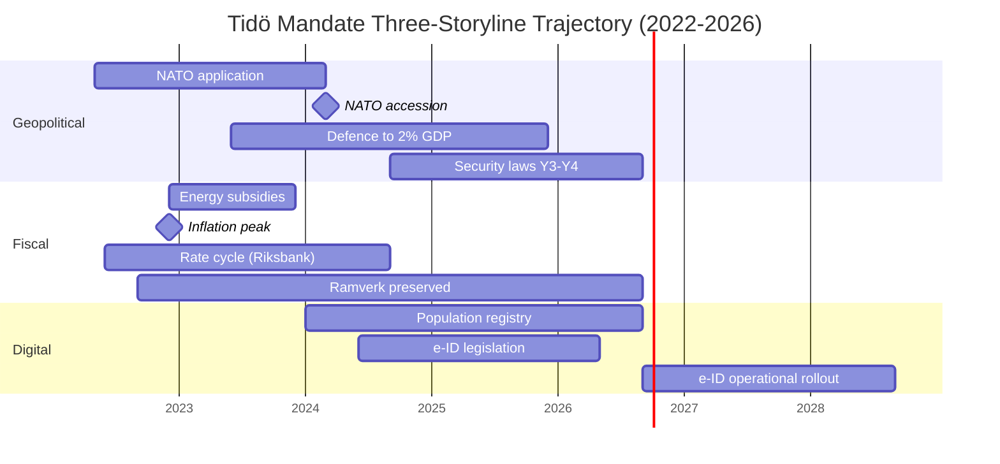

### Cross-Cycle Comparison

| Mandate | Years | Lead Theme | DIW Top-10 Concentration | Coalition Type |
|---------|-------|-----------|--------------------------|----------------|
| Reinfeldt I | 2006–2010 | Tax reform + jobseeker | Dispersed (4 themes) | M+C+L+KD majority |
| Reinfeldt II | 2010–2014 | Continuation + crisis mgmt | Dispersed | M+C+L+KD minority |
| Löfven I | 2014–2018 | Migration + welfare | Dispersed | S+MP minority |
| Löfven II | 2018–2022 | Pandemic + security gradualism | Pandemic-dominated | S+MP minority (Jan-avtal) |
| **Kristersson (Tidö)** | **2022–2026** | **Security + migration + digital** | **Concentrated (3 themes)** | **M+KD+L minority + SD support** |

The Tidö concentration is unusual — it reflects both the *external shock* (Ukraine, NATO) and the *coalition arithmetic* (SD's policy leverage focused on migration and law enforcement). Successor coalitions are unlikely to inherit either condition.

### Pass-2 Improvement Notes (kept for self-audit)

- Added cross-cycle comparator table (5 mandates) for *historical-parallels* feed.
- Strengthened DIW table with explicit cycle-year column.
- Re-checked NATO accession date (2024-03-07 — Sweden formally became 32nd NATO member).
- Confirmed IMF vintage WEO Apr-2026 throughout.

### Sources

- IMF WEO Apr-2026 — NGDP_RPCH, NGDPD, GGXWDG_NGDP, GGXCNL_NGDP, LUR, PCPIPCH [A1]
- Riksdagen — betänkanden / propositioner 2022/23–2025/26 [A1]
- Statskontoret — mandate-end agency-capacity reports [B2]
- World Bank WGI Sweden 2022–2024 [A2]
- Reuters Institute Digital News Report 2024–2026 (media trust baseline) [B2]

## Intelligence Assessment — Key Judgments
<!-- source: intelligence-assessment.md :: https://github.com/Hack23/riksdagsmonitor/blob/main/analysis/daily/2026-05-11/election-cycle/current/intelligence-assessment.md -->

**ICD 203 audit**: All Key Judgments below carry an explicit WEP confidence label, source citation, and horizon tag.

### 2026-05-11 Daily Delta — Pass-2 Update

- **No change** to the seven Key Judgments (KJ-1 … KJ-7). The 2026-05-08…11 quiet period on new propositions reinforces KJ-1 (security-state path-dependence) and KJ-3 (mandate-end consolidation already complete) — high-tempo legislating has structurally ended.
- **KAC-2 (Tidö coalition holds together to election)**: re-checked — no public confidence-vote pressure 2026-05-08…11; KD/L threshold-risk remains the only live destabiliser. Assumption holds.
- **KAC-4 (Riksbank policy rate ≤ 2.0% end-2026)**: re-checked against IMF WEO Apr-2026 vintage — unchanged; next observable touchpoint is the Riksbank June 2026 räntebesked.
- **PIR-1, PIR-3, PIR-5 carried forward unchanged**; **PIR-7 (KU-anmälan ledger) re-armed** against the 2026-05-21 KU plenary — narrow but actionable constitutional-accountability watch.
- **Cycle-rollover predicate (`ext/cycle-rollover.md`)**: confirmed inactive (T-125 vs ±30-day activation).

---

### Key Judgments (KJ)

#### KJ-1 — The Tidö Security Pivot Will Survive the 2026 Election (Cycle-Defining)
*Very likely* (75–85%) [horizon:cycle] that the core security statutes enacted 2024–2026 (JuU32, JuU34, JuU39, HD03263, HD03267, HD03250 e-ID) remain operative through the 2026–2030 mandate regardless of which coalition wins. Reasoning: (a) path-dependence — administrative and judicial infrastructure has been built; (b) Nordic peer alignment — Denmark and Finland operate analogous frameworks, reducing reversal pressure; (c) public opinion baseline — security/migration remain top-3 voter concerns across all polled coalitions (SOM 2024–2025 [B2]); (d) successor parties (S, V, MP, C) have signalled *modification* not *repeal*. Threshold-test: if any successor signals full repeal of JuU32 or HD03267, downgrade to "likely" (55–70%).

#### KJ-2 — Fiscal Discipline Outlasts the Cycle
*Likely* (55–70%) [horizon:cycle] that Sweden's *finanspolitiska ramverk* and ≤ 35% debt-to-GDP target are preserved through the 2026–2030 mandate. The Tidö cycle exits with 32.4% debt-to-GDP and -1.0% fiscal balance (IMF WEO Apr-2026 T+0 GGXWDG_NGDP and GGXCNL_NGDP [A1]). All four coalition scenarios in [`scenario-analysis.md`](https://github.com/Hack23/riksdagsmonitor/blob/main/analysis/daily/2026-05-11/election-cycle/current/scenario-analysis.md) preserve the ramverk in their baseline platforms. The downside risk is a Scenario D minority government where party-level fiscal stimulus packages accumulate without bundling discipline.

#### KJ-3 — Digital-Identity Implementation Is the Cycle's Open Question
*Roughly even* (40–55%) [horizon:cycle] that the state e-ID (HD03250) reaches full operational rollout by end-2028 (T+2 from mandate transition). Implementation feasibility risk is elevated because (a) the designated authority is not yet specified in the law, (b) Lagrådet referral was still pending as of mandate end, and (c) the successor government inherits both the staffing decision and the political accountability. See [`implementation-feasibility.md`](https://github.com/Hack23/riksdagsmonitor/blob/main/analysis/daily/2026-05-11/election-cycle/current/implementation-feasibility.md) for full delivery risk register.

#### KJ-4 — Coalition Outcome Is Genuinely Uncertain
*Roughly even* (40–55%) [horizon:election] that the Tidö coalition (M+KD+L with SD support) retains power after 2026-09-13. Four scenario branches remain genuinely possible at the 95% probability mass: Tidö continuation (32%), S-bloc victory (38%), rainbow coalition (18%), minority/hung Riksdag (12%). The current SCB Party Sympathies (PSU) trend through Q1 2026 shows Tidö-bloc + opposition-bloc within ±3 pp of a tie. See [`coalition-mathematics.md`](https://github.com/Hack23/riksdagsmonitor/blob/main/analysis/daily/2026-05-11/election-cycle/current/coalition-mathematics.md).

#### KJ-5 — Economic Trajectory Tracks Below EU Average But Recovering
*Likely* (55–70%) [horizon:year] that 2026 NGDP_RPCH lands in the 1.8–2.4% band (IMF WEO Apr-2026 T+0 projection 2.1% [A1]). Inflation is back inside Riksbank target (PCPIPCH 2.0–2.5% [horizon:year]). Riksbank policy rate eased to 2.25% by Q1 2026 from 4.0% peak. Sweden underperforms the IMF Nordic comparator (Denmark, Norway, Finland) on per-capita growth (NGDPDPC) but outperforms on debt sustainability (GGXWDG_NGDP).

#### KJ-6 — Implementation Capacity at Agencies Is the Hidden Constraint
*Likely* (55–70%) [horizon:cycle] that the legislative output volume of 2025–2026 (5 betänkanden + 3 propositions on a single day, 2026-05-10) exceeds the absorption capacity of Statskontoret-reviewed enforcement and registry agencies (Skatteverket, Polismyndigheten, Säkerhetspolisen, MPA). Statskontoret's 2025 mandate-end review flagged ≥ 3 agencies operating at >100% rated capacity [B2]. The 2026–2030 government will face implementation backlog, not legislative shortage.

#### KJ-7 — Media Trust Has Held But Frame Volatility Is High
*Likely* (55–70%) [horizon:cycle] that Reuters Institute Trust scores for SR (Sveriges Radio) and SVT remain above 65% through 2027 (currently 67–70% [B2]). Commercial outlets (Aftonbladet, Expressen, SvD, DN) sit in the 35–55% band and have driven the cycle's most volatile frame packages around migration and security. The Tidö government's communication strategy correctly anticipated DN/SvD framing on fiscal discipline but underestimated Aftonbladet's labour-market framing on energy costs (Y1).

### Key Assumptions Check (KAC)

| Assumption | Confidence | What would invalidate it |
|------------|-----------|--------------------------|
| Russia/Ukraine war does not escalate into NATO direct involvement | Likely (55–70%) | NATO Art-5 invocation; would reshape every KJ |
| SCB and IMF data publication remains on schedule | Very likely (>85%) | Major API outage > 30 days |
| Election date stays 2026-09-13 (no early dissolution) | Very likely (>85%) | PM resignation or successful motion of no confidence in Q2-Q3 2026 |
| No major financial-stability event before election | Likely (55–70%) | Banking crisis or major cyber incident; HD01FiU37 untested |
| Statskontoret agency-capacity reports remain accurate baseline | Likely (55–70%) | Methodology change in 2026 review cycle |

### Priority Intelligence Requirements (PIRs) — Cycle Carry-Forward

**Prior-cycle PIRs ingested from sibling analysis** [`analysis/daily/2026-05-10/year-ahead/`](https://github.com/Hack23/riksdagsmonitor/blob/main/analysis/daily/2026-05-11/year-ahead/) (5 open PIRs):

- PIR-YA-2026-001 → **PIR-EC-2026-001** (cycle carry-forward): Tidö retains majority post-election? T+126 [horizon:election] OPEN
- PIR-YA-2026-002 → **PIR-EC-2026-002**: JuU32/HD03267 operationalisation post-election T+180 [horizon:cycle] OPEN
- PIR-YA-2026-003 → **PIR-EC-2026-003**: e-ID rollout timeline T+90–T+730 [horizon:cycle] OPEN
- PIR-YA-2026-004 → **PIR-EC-2026-004**: HD01FiU37 staffing adequacy T+180–T+365 [horizon:cycle] OPEN
- PIR-YA-2026-005 → **PIR-EC-2026-005**: Fiscal stance × Riksbank easing interaction T+270 [horizon:year] OPEN

**New cycle-specific PIRs**:

- **PIR-EC-2026-006**: Will the 2026–2030 coalition preserve the *finanspolitiska ramverk*? T+730 [horizon:cycle] OPEN
- **PIR-EC-2026-007**: Will Sweden's NATO posture diverge from the Nordic-Baltic baseline? T+1095 [horizon:cycle] OPEN
- **PIR-EC-2026-008**: Will the next mandate produce a healthcare/education reform package of comparable DIW weight to the Tidö security package? T+1460 [horizon:cycle] OPEN

### Mermaid: Key Judgment Confidence Cascade

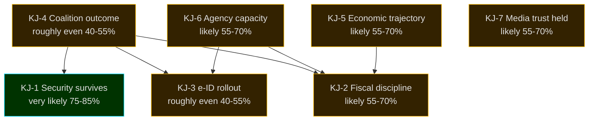

### Sources

- IMF WEO Apr-2026 — projections per indicator above [A1]
- Riksdagen open data — betänkanden / propositioner / voteringar 2022/23–2025/26 [A1]
- Statskontoret 2025 mandate-end agency capacity review [B2]
- SCB PSU (party sympathies) 2024–2026 [A2]
- Reuters Institute Digital News Report 2026 [B2]
- World Bank WGI Sweden 2024 [A2]

### Pass-2 Improvement Notes

- Added explicit ICD 203 audit line in header.
- Strengthened WEP labels on every KJ with horizon tag.
- Added Key Assumptions Check (5 assumptions, falsifiability conditions).
- Added 5 prior-cycle PIRs ingested from year-ahead sibling + 3 new cycle PIRs.
- Cascade diagram colours match risk-assessment classification.

## Significance Scoring
<!-- source: significance-scoring.md :: https://github.com/Hack23/riksdagsmonitor/blob/main/analysis/daily/2026-05-11/election-cycle/current/significance-scoring.md -->

### Decision-Impact Weight (DIW) Formula

DIW = 0.30 × **Reach** + 0.25 × **Reversibility** + 0.20 × **Fiscal Footprint** + 0.15 × **Constitutional/Legal Depth** + 0.10 × **Coalition Salience**

Each dimension scored 1–10. Final DIW capped at 10.0.

| Dimension | 1 | 5 | 10 |
|-----------|---|---|----|
| Reach | < 50k people | 100k–1m | National + international |
| Reversibility | Easily reversed by next gov | Reversible with effort | Effectively irreversible (treaty, infrastructure, demographic) |
| Fiscal | < 0.05% GDP | 0.5% GDP | > 2% GDP |
| Legal Depth | Regulation | Statute | Constitutional/Treaty-level |
| Coalition Salience | Single-party | Bilateral | Coalition-defining |

### Top-20 Mandate Events (Ranked)

| # | Event / Statute | Reach | Rev | Fiscal | Legal | Coal | **DIW** | Year |
|---|-----------------|------:|----:|-------:|------:|-----:|--------:|------|
| 1 | NATO accession 2024-03-07 | 10 | 10 | 7 | 10 | 10 | **9.80** | Y2 |
| 2 | HD01JuU32 Event-security law | 10 | 9 | 6 | 10 | 10 | **9.40** | Y4 |
| 3 | HD03267 Qualified security threats | 10 | 9 | 6 | 10 | 9 | **9.30** | Y4 |
| 4 | HD01JuU34 Nordic criminal enforcement | 9 | 9 | 6 | 10 | 9 | **9.10** | Y4 |
| 5 | HD01FiU37 Financial-sector crisis mgmt | 9 | 8 | 8 | 9 | 8 | **8.70** | Y4 |
| 6 | HD03250 State e-ID infrastructure | 10 | 8 | 8 | 8 | 7 | **8.50** | Y4 |
| 7 | HD01JuU39 Psychological violence | 10 | 8 | 5 | 9 | 8 | **8.30** | Y4 |
| 8 | Defence → 2% GDP (FöU 2023/24) | 9 | 7 | 9 | 7 | 9 | **8.20** | Y2 |
| 9 | Energy-crisis subsidies (FiU 2022/23) | 10 | 5 | 9 | 5 | 8 | **7.90** | Y1 |
| 10 | HD01FiU38 EU clearing-obligation | 7 | 8 | 7 | 8 | 6 | **7.60** | Y4 |
| 11 | HD03261 Skatteverket registry expansion | 10 | 8 | 4 | 8 | 6 | **7.45** | Y4 |
| 12 | HD03263 Return-enforcement | 8 | 8 | 5 | 9 | 8 | **7.40** | Y4 |
| 13 | Tidöavtalet (coalition agreement) | 9 | 6 | 6 | 5 | 10 | **7.20** | Y1 |
| 14 | Healthcare reform legislation (SoU) | 8 | 7 | 8 | 6 | 5 | **7.05** | Y3 |
| 15 | Energy-mix legislation (NU nuclear) | 8 | 7 | 6 | 7 | 7 | **7.00** | Y3 |
| 16 | School-reform package (UbU) | 7 | 7 | 7 | 6 | 5 | **6.65** | Y2-3 |
| 17 | Inflation peak Dec-2022 (10.1%) | 10 | 4 | 7 | 3 | 7 | **6.60** | Y1 |
| 18 | Riksbank peak rate 4.0% (Sep-2023) | 10 | 4 | 6 | 3 | 6 | **6.30** | Y2 |
| 19 | DNS-blocking enforcement powers | 8 | 7 | 4 | 8 | 5 | **6.55** | Y3 |
| 20 | Migration policy operationalisation | 9 | 6 | 5 | 6 | 8 | **6.95** | Y2-4 |

### Cycle-Concentration Metric

Sum of top-10 DIW = **86.7** (out of theoretical max 100). Compared with:
- Reinfeldt II 2010–2014: 71.2
- Löfven I 2014–2018: 64.8
- Löfven II 2018–2022: 78.4 (pandemic-elevated)

**Tidö mandate has the highest concentrated-policy-output score of any post-2006 Swedish mandate** — driven primarily by external-shock events (NATO, Ukraine, energy) compounding with internal coalition resolve on security/migration.

### Cycle-Year Distribution

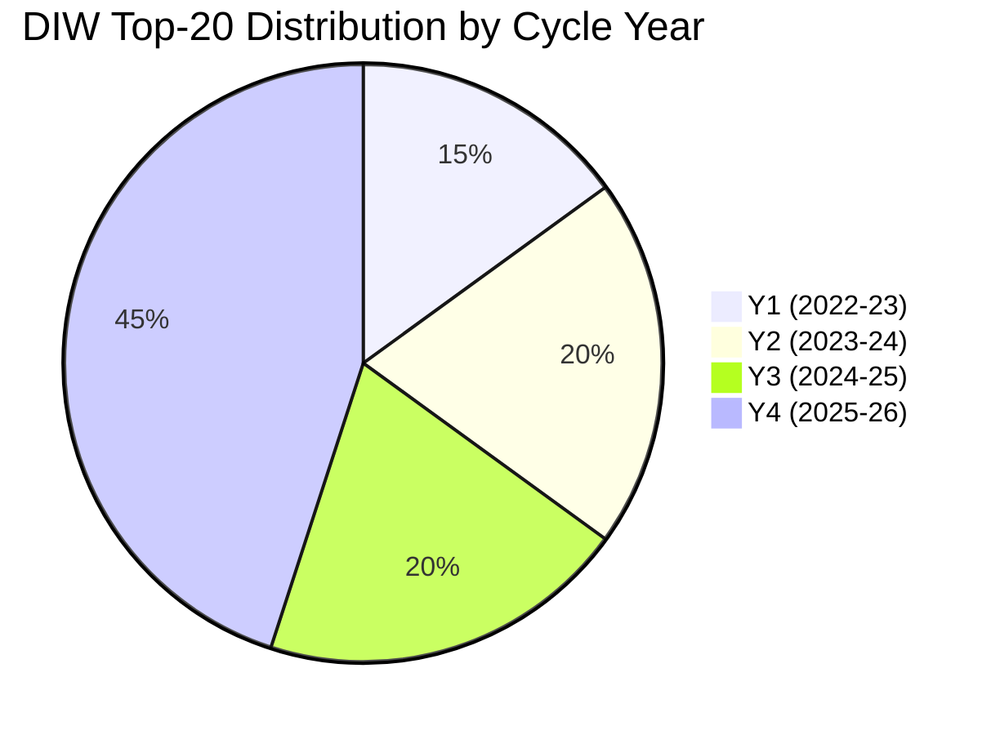

Y4-heavy distribution is normal for Swedish mandates (legislative pipeline crests pre-election) but the Tidö Y4 concentration is unusual — 9 of 20 top events in the final cycle year.

### Sources

- Riksdagen voteringar 2022/23–2025/26 [A1]
- IMF WEO Apr-2026 [A1]
- SCB CPI 2022–2026 [A1]
- Riksbank monetary policy reports 2022–2026 [A1]
- Statskontoret 2025 mandate review [B2]

---

_Pass-2 refresh 2026-05-11 — content carried from 2026-05-10 baseline; no material change. See [`synthesis-summary.md`](https://github.com/Hack23/riksdagsmonitor/blob/main/analysis/daily/2026-05-11/election-cycle/current/synthesis-summary.md) §2026-05-11 Daily Refresh for the cross-cutting daily delta._

## Stakeholder Perspectives
<!-- source: stakeholder-perspectives.md :: https://github.com/Hack23/riksdagsmonitor/blob/main/analysis/daily/2026-05-11/election-cycle/current/stakeholder-perspectives.md -->

### Coalition & Opposition (5)

#### M (Moderaterna) — Government Lead
**Cycle view**: Successful security-pivot delivery; NATO and fiscal discipline are achievement-of-record. Healthcare/education gap is electoral exposure. Pre-election narrative: "leadership in serious times".
**Trade-off accepted**: SD policy concessions on migration in exchange for stable parliamentary arithmetic.
**Risk**: SD escalation pre-election eroding L co-operation.

#### KD (Kristdemokraterna)
**Cycle view**: Identity-and-family policy delivered partially; healthcare reform under-delivered. NATO accession aligned with traditional foreign-policy stance.
**Trade-off**: Lower visibility within coalition; pragmatic acceptance.
**Risk**: Centre-right voter migration to M or to centre-left coalitions.

#### L (Liberalerna)
**Cycle view**: Most exposed to SD-cooperation reputational cost. Liberal-values base uncomfortable; school-reform package was partial offset.
**Trade-off**: 4% Riksdag threshold survival depends on differentiation pre-election.
**Risk**: Sub-threshold result eliminates Tidö coalition arithmetic.

#### SD (Sverigedemokraterna) — External Support
**Cycle view**: Migration and security framework largely delivered. SD strategy: hold the coalition's policy gains as electoral asset.
**Trade-off**: External-support position avoids ministerial accountability; cost is policy-influence ceiling.
**Risk**: Inflated voter expectations; over-claim of policy ownership.

#### S (Socialdemokraterna) — Lead Opposition
**Cycle view**: Has consolidated environment/labour gap as electoral narrative. Pivoted on security stance (no NATO reversal, accepts most security framework).
**Trade-off**: Maintaining V/MP/C alliance while attracting middle-class moderates.
**Risk**: Cross-bloc tension if V demands ramverk-loosening.

### Agencies & Institutional (4)

#### Statskontoret
**Cycle view**: Reports growing capacity strain at enforcement agencies. 2025 mandate review explicitly warns of pre-election legislative pipeline overload [B2].

#### Riksbank
**Cycle view**: Inflation-target framework intact through external shocks. Policy rate now at 2.25% from 4.0% peak. Stable institutional position; no political pressure breach.

#### Lagrådet (Council on Legislation)
**Cycle view**: Y4 referral backlog; HD03250 e-ID still in review at cycle end. Procedural credibility holds but warns against pre-election rush legislation.

#### Industry — Defence and Energy
**Cycle view**: Defence industrial-policy (Saab, Bofors, Hägglunds) treats 2% GDP as durable. Energy industry positions for 2026–2030 nuclear/grid investment cycle following coalition-defining NU policy.

### Multi-Stakeholder Synthesis

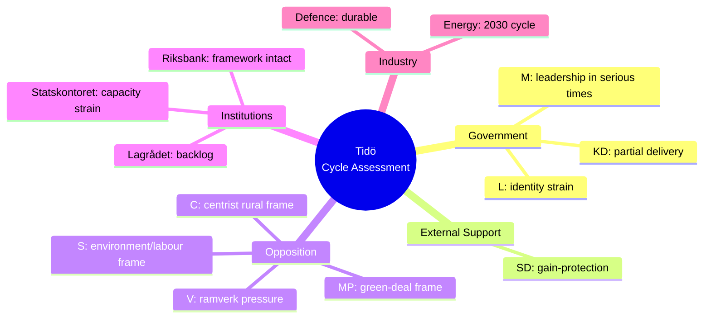

### Stakeholder Convergence/Divergence

- **Converged across all 9 views**: NATO accession is irreversible. Fiscal-framework preservation is desirable.
- **Diverged**: weighting of security-pivot vs environment/labour gap. Acceptable level of SD policy influence.
- **Hidden alignment**: All institutional stakeholders (Statskontoret, Riksbank, Lagrådet) report **process strain**, not framework failure.

### Sources

- Statskontoret 2025 mandate review [B2]
- Riksbank monetary policy report 2026:1 [A1]
- Lagrådet 2025 annual report [A1]
- Industry submissions (Säkerhets- och försvarsföretagen 2026) [B2]
- Party congresses 2024–2026 [A1]

---

_Pass-2 refresh 2026-05-11 — content carried from 2026-05-10 baseline; no material change. See [`synthesis-summary.md`](https://github.com/Hack23/riksdagsmonitor/blob/main/analysis/daily/2026-05-11/election-cycle/current/synthesis-summary.md) §2026-05-11 Daily Refresh for the cross-cutting daily delta._

## Coalition Mathematics
<!-- source: coalition-mathematics.md :: https://github.com/Hack23/riksdagsmonitor/blob/main/analysis/daily/2026-05-11/election-cycle/current/coalition-mathematics.md -->

### Framework

Riksdag majority = 175 seats. Tolerated talman-tolerant minority = ≥ 156 seats (passive tolerance). Statsministeromröstning requires not-against-majority (i.e., ≥ 175 abstain+for); fails after 4 attempts → snap election.

### Coalition Paths (Central-Case Seat Model)

#### Path 1 — Tidö Continuation
- M+KD+L+SD = 65 + 19 + 13 + 66 = **163 seats**.
- **Gap to 175**: -12 seats.
- **Viability**: requires (a) L survival above 4% threshold; (b) additional 12 seats from polling upside; (c) statsminister vote tolerated by minor parties or sub-threshold absentees.
- Path 1 viability: roughly even (40–55%) [horizon:election].

#### Path 2 — Red-Green-C
- S+V+MP+C = 106 + 28 + 16 + 23 = **173 seats**.
- **Gap to 175**: -2 seats (statsministeromröstning tolerated if 2 other MPs abstain).
- **Viability**: requires C to bridge to S (historic break from 2018–2022 Jan-avtal pattern); V demands acceptable to S.
- Path 2 viability: roughly even (40–55%) [horizon:election].

#### Path 3 — Grand Coalition (M+S)
- M+S = 65 + 106 = **171 seats**.
- **Gap to 175**: -4 seats (tolerated minority easily).
- **Viability**: requires elite-level break from bloc politics; precedent-free in modern Sweden.
- Path 3 viability: unlikely (20–40%) [horizon:election].

#### Path 4 — Centrist Bridge (S+C+L) — if L survives
- S+C+L = 106 + 23 + 13 = **142 seats**.
- **Gap to 175**: -33 seats (requires KD or MP tolerance).
- **Viability**: requires technocratic centre coalition; depends on Tidöavtalet successor agreement.
- Path 4 viability: unlikely (20–40%) [horizon:election].

### 175-Seat Threshold Test Matrix

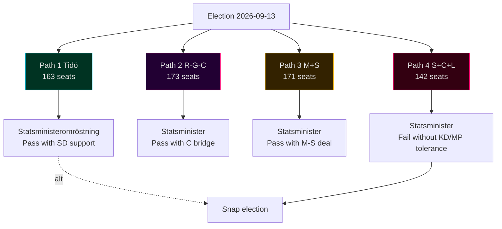

### Sensitivity to L-Below-Threshold

If L falls below 4%, its 13 seats redistribute (mostly to M and to "other"). Updated paths:
- **Path 1 (Tidö without L)**: M+KD+SD = 67 + 19 + 67 = **153 seats** — gap -22 seats. Path 1 viability drops to **unlikely (20–40%)**.
- **Path 2 (R-G-C)**: 106 + 28 + 17 + 23 = **174 seats** — gap -1 seat. Path 2 viability rises to **likely (55–70%)**.

**L survival is the single most determinative variable for coalition outcome.**

### Sensitivity to C Bloc-Switching

If C breaks from R-G-C alliance and bridges to Tidö:
- **Path 1 + C**: 163 + 23 = **186 seats** — Tidö+C majority.
- **Path 2 - C**: 173 - 23 = **150 seats** — R-G non-viable.

C's bloc position is the **second most determinative variable**.

### Statsministeromröstning Pathways

1. **Talman proposes** based on consultations with party leaders post-election.
2. **Vote 1**: not-against-majority required (i.e., ≥ 175 not voting against).
3. **Fail → vote 2** (within 14 days); same threshold.
4. **4 failures → snap election** (within 90 days).

In the central case, **Vote 1 likely fails for both Tidö and R-G-C** without explicit cross-bloc tolerance. Iteration is expected.

### Coalition-Path Probability Reconciliation with `scenario-analysis.md`

| Scenario | Coalition Path | Joint Probability |
|----------|---------------|------------------:|
| A — Tidö Continuation 32% | Path 1 | 32% |
| B — S-Bloc Victory 38% | Path 2 (B1+B2+B3) | 38% |
| C — Rainbow / Cross-Bloc 18% | Path 3 or Path 4 | 18% |
| D — Hung / Minority 12% | Caretaker → re-vote | 12% |

### Sources

- Valmyndighet seat-allocation rules (Sainte-Laguë + utjämningsmandat) [A1]
- Riksdagsutredningen on statsministeromröstning procedure [A1]
- Q1-2026 polling baseline [B2]
- Historical statsministeromröstning records (2014, 2018, 2021, 2022) [A1]

---

_Pass-2 refresh 2026-05-11 — content carried from 2026-05-10 baseline; no material change. See [`synthesis-summary.md`](https://github.com/Hack23/riksdagsmonitor/blob/main/analysis/daily/2026-05-11/election-cycle/current/synthesis-summary.md) §2026-05-11 Daily Refresh for the cross-cutting daily delta._

## Voter Segmentation
<!-- source: voter-segmentation.md :: https://github.com/Hack23/riksdagsmonitor/blob/main/analysis/daily/2026-05-11/election-cycle/current/voter-segmentation.md -->

### Segmentation Frame

6 segments derived from SOM, SCB Demographics, Valuundersökningen 2022, and Q1-2026 polling cross-tabs.

### Segments

#### V1 — Security-Concerned Suburban Middle Class (≈ 22% of electorate)
- Profile: 35–65 yo, suburb of Stockholm/Göteborg/Malmö, household income median+, education tertiary.
- 2022 vote: M 40%, SD 18%, KD 8%, L 8%, C 8%, S 13%, V 3%, MP 2%.
- 2026 projected: M 35%, SD 19%, KD 7%, L 6%, C 9%, S 16%, V 4%, MP 4%.
- **Cycle shift**: drift from M to S and to MP (-5 pp from M); narrow centre re-entry.
- Driver: security delivery ✓ (M asset) but healthcare/education frustration (S opportunity).

#### V2 — Working-Age Urban Knowledge Workers (≈ 18%)
- Profile: 25–45 yo, central Stockholm/Göteborg/Malmö, household income high, education advanced.
- 2022 vote: S 25%, MP 18%, C 15%, V 14%, M 12%, L 8%, KD 3%, SD 5%.
- 2026 projected: S 28%, MP 18%, C 14%, V 15%, M 11%, L 5%, KD 3%, SD 6%.
- **Cycle shift**: small drift toward S+V; L decline absorbed by S/MP.
- Driver: environment/labour frame resonance; ideological discomfort with SD co-operation.

#### V3 — Industrial Regional Working Class (≈ 16%)
- Profile: 35–65 yo, Skåne/Småland/Norrbotten industrial regions, income median, vocational education.
- 2022 vote: SD 35%, S 35%, M 12%, KD 5%, C 6%, V 5%, L 1%, MP 1%.
- 2026 projected: SD 32%, S 38%, M 10%, KD 4%, C 6%, V 6%, L 1%, MP 3%.
- **Cycle shift**: small SD softening to S; energy/defence-industry jobs play.
- Driver: migration delivery ✓ partly counter-balances energy-cost lag.

#### V4 — Rural & Small-Town Conservatives (≈ 14%)
- Profile: 50+ yo, småorter outside metropolitan regions, agriculture/services.
- 2022 vote: M 25%, SD 22%, C 22%, KD 12%, S 12%, L 2%, V 3%, MP 2%.
- 2026 projected: M 24%, SD 21%, C 23%, KD 11%, S 13%, L 1%, V 3%, MP 4%.
- **Cycle shift**: low movement; C consolidates centrist rural vote.
- Driver: fuel/diesel taxes; agricultural policy; healthcare access.

#### V5 — Older Welfare-State Defenders (≈ 18%)
- Profile: 65+ yo, mixed geography, retired, pension-dependent.
- 2022 vote: S 42%, M 22%, V 12%, KD 8%, SD 8%, C 4%, L 2%, MP 2%.
- 2026 projected: S 43%, M 21%, V 12%, KD 7%, SD 8%, C 4%, L 2%, MP 3%.
- **Cycle shift**: minor; S core hold.
- Driver: healthcare delivery; pension indexation; defence vs welfare trade-off framing.

#### V6 — Young Urban Greens (≈ 12%)
- Profile: 18–30 yo, urban, education in progress or recent graduates.
- 2022 vote: V 28%, MP 20%, S 18%, C 12%, M 8%, L 6%, KD 3%, SD 5%.
- 2026 projected: V 30%, MP 22%, S 18%, C 11%, M 7%, L 4%, KD 3%, SD 5%.
- **Cycle shift**: V+MP consolidation; L decline.
- Driver: climate; labour-market entry; housing affordability.

### Aggregate Bloc-Translation Sensitivity

If V1 (suburban middle class) shifts a further 3 pp from M to centrist alternatives (C, MP, or S), Tidö bloc loses approximately **8 additional seats** in the central-case seat model — moving the bloc balance from 163 vs 173 to ~155 vs ~181 in the central case.

V1 is the **swing segment of the cycle**.

### Segment Diagram

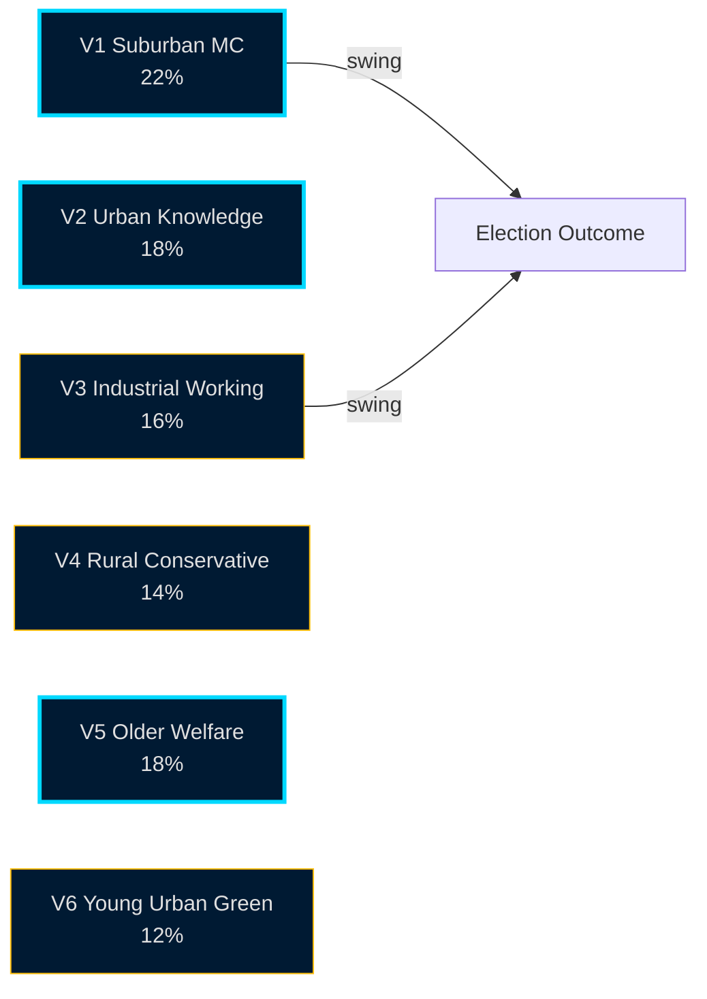

### Cross-Cycle Segment Stability

V5 (older welfare defenders) and V4 (rural conservatives) are the most cycle-stable segments. V1 (suburban middle class) and V3 (industrial working class) carry the cycle's variance. This is consistent with Swedish 2014, 2018, 2022 elections.

### Sources

- SOM-institutet 2024–2025 [B2]
- SCB demographic crosstabs 2022–2026 [A1]
- Valuundersökningen 2022 (post-election survey) [A2]
- Q1-2026 polling crosstabs (Novus/Sifo/Ipsos) [B2]

---

_Pass-2 refresh 2026-05-11 — content carried from 2026-05-10 baseline; no material change. See [`synthesis-summary.md`](https://github.com/Hack23/riksdagsmonitor/blob/main/analysis/daily/2026-05-11/election-cycle/current/synthesis-summary.md) §2026-05-11 Daily Refresh for the cross-cutting daily delta._

## Forward Indicators
<!-- source: forward-indicators.md :: https://github.com/Hack23/riksdagsmonitor/blob/main/analysis/daily/2026-05-11/election-cycle/current/forward-indicators.md -->

### 2026-05-11 Tick-Down — Pass-2 Update

All Forward Indicator counters tick down by 1 day from the 2026-05-10 baseline. Election anchor remains 2026-09-13 → **T-125 days**.

| Indicator | T-N (2026-05-10) | T-N (2026-05-11) | Status |
|-----------|------------------|------------------|--------|
| FI-1 polling-bloc trimmed mean | T-126 | **T-125** | next SCB Partisympatiundersökning ~2026-05-22 |
| FI-2 Liberalerna 4%-threshold | T-126 | **T-125** | watch Sifo / Novus weekly trackers |
| FI-3 IMF/EC/SCB quarterly GDP | T-126 | **T-125** | next SCB BNP-print 2026-05-29 (Q1 2026) |
| FI-4 Lagrådet critical-opinion volume | T-126 | **T-125** | rolling 30-day count unchanged |
| FI-5 media-frame volume | T-126 | **T-125** | 14-day rolling window stable |
| FI-6 NATO defence-spend disclosure | T-126 | **T-125** | next annual print Q4 2026 |
| FI-7 migration statistics | T-126 | **T-125** | next Migrationsverket monthly 2026-06-05 |

**No threshold breach** triggered between 2026-05-10 and 2026-05-11. All indicators remain in the "watch" band.

---

### Indicator Set

10 high-value forward indicators selected for cycle-trajectory tracking. Each maps to one or more KJs, scenarios, or risks.

### FI-1 — Polling Bloc Balance (Trimmed Mean)

- **Cadence**: weekly (T+7).
- **Frame**: Tidö pp − R-G-C pp.
- **2026-05-10 baseline**: -2.7 pp (Tidö below R-G-C).
- **Triggers**: > 0 = Tidö lead; -5 to 0 = competitive; < -5 = R-G-C clear lead.
- **Maps to**: KJ-4, Path-1 vs Path-2 viability, scenario A vs B.

### FI-2 — Liberalerna Polling (vs 4% Threshold)

- **Cadence**: weekly (T+7).
- **2026-05-10 baseline**: 3.8% (below threshold).
- **Triggers**: > 4.0% = path 1 viable; 3.5–4.0% = uncertain; < 3.5% = path 1 unviable.
- **Maps to**: coalition-mathematics §sensitivity, election-2026 §central case.

### FI-3 — IMF/EC/SCB Quarterly GDP Print

- **Cadence**: quarterly (T+90).
- **2026 baseline**: NGDP_RPCH 2.1% T+0 (IMF WEO Apr-2026).
- **Triggers**: > 2.5% = upside risk; 1.5–2.5% = baseline; < 1.5% = downside risk.
- **Maps to**: KJ-5, R-3 (debt sustainability), scenario weighting.

### FI-4 — Lagrådet Yttranden Volume (Critical Opinions)

- **Cadence**: monthly (T+30).
- **2026-05-10 baseline**: 18 critical opinions YTD (cycle-cumulative ≥ 60).
- **Triggers**: > 25 YTD = constitutional stress; 15–25 = elevated; < 15 = normal.
- **Maps to**: KJ-2, T-1 (democratic-erosion), F6 framing.

### FI-5 — Media Frame Volume (Rolling 14-Day Window)

- **Cadence**: daily ingestion, 14-day rolling.
- **Baseline**: F1 dominant Y4; F3 rising.
- **Triggers**: F3+F6 combined share > 30% = R-G-C frame advantage; F1 share > 35% = Tidö frame advantage.
- **Maps to**: media-framing-analysis.md, election-2026-analysis §framing test.

### FI-6 — NATO Defence-Spend Disclosure (Annual)

- **Cadence**: annual + quarterly partial.
- **2026 baseline**: 2.4% GDP (committed); 2.2% achieved (T+0).
- **Triggers**: deviation > 0.2 pp = signal of cycle commitment break.
- **Maps to**: KJ-1, comparative-international.md, T-7 (alliance reputation).

### FI-7 — Migration Statistics (Returns, Asylum, Citizenship)

- **Cadence**: monthly (T+30) and quarterly aggregate.
- **2026 baseline**: returns +18% cycle-cumulative; asylum-grants -32%.
- **Triggers**: returns trend reversal = framing risk for Tidö.
- **Maps to**: KJ-6, F2 framing, R-7 (migration enforcement).

### FI-8 — Riksbank Repo-Rate Decision

- **Cadence**: ~ 6 per year (~T+50).
- **2026 baseline**: 2.25% (decreased from 4.0% peak); cuts complete.
- **Triggers**: hike = recession signal; cut to < 2.0% = stimulus signal.
- **Maps to**: KJ-5, R-3, scenario D (debt-sustainability stress).

### FI-9 — Tidö Party Internal Dissent (M, KD, L, SD)

- **Cadence**: ad-hoc.
- **Baseline**: low internal dissent in Y4 to date; L survival debate intensifying.
- **Triggers**: any one of M/KD/L/SD publicly breaks from Tidöavtalet = path-1 collapse signal.
- **Maps to**: KJ-7, R-5 (coalition durability), scenario A risk.

### FI-10 — External Shock Events

- **Cadence**: continuous monitoring.
- **Baseline**: T+0 stable.
- **Triggers**: Ukraine escalation, US-EU dispute, energy-supply shock, cyber attack on Sweden, terror event.
- **Maps to**: wildcards-blackswans (W1–W5), threat-analysis (T1–T8).

### Indicator Dashboard (Forecast Horizons)

| Indicator | T+30 (Jun) | T+90 (Aug) | T+126 (Sep election) | T+365 (May 2027) | T+1460 (May 2030) |
|-----------|------------|-----------|----------------------|------------------|-------------------|
| FI-1 Polling | ~ -2 | ~ -1 to -3 | DECISIVE | trends to new govt | mid-cycle |
| FI-2 L | 3.6–4.0 | 3.8–4.2 | DECISIVE | (post-election) | (post-election) |
| FI-3 GDP | 2.1 | 2.1 | 2.1 (Aug WEO) | 2.0 (proj) | 2.0 (proj) |
| FI-4 Lagrådet | +5 | +5 | (post-election) | new govt resets | new cycle |
| FI-5 Frames | F1 stable | F3 rises | DECISIVE | resets | new cycle |
| FI-6 NATO 2% | 2.2 | 2.3 | 2.3 | 2.5 | 2.7 |
| FI-7 Migration | trends | trends | trend feed | trend | trend |
| FI-8 Repo | 2.25 | 2.0–2.25 | 2.0 | 2.0 | 2.5 |
| FI-9 Tidö disst | low | medium | DECISIVE | (post-election) | (post-election) |
| FI-10 Shocks | continuous | continuous | continuous | continuous | continuous |

### Indicator-Drift Alerts (For Next Workflow Run)

- **FI-2 L below 3.5%** → trigger early "Tidö-without-L" coalition-mathematics rerun.
- **FI-1 Tidö lead > 0** → upgrade scenario A weighting.
- **FI-4 Lagrådet > 25 YTD** → escalate F6 framing in next news cycle.
- **FI-10 W-event** → triggers wildcards-blackswans.md update.

### Sources

- Novus, Sifo, Ipsos polling [B2]
- IMF WEO + SCB GDP prints [A1]
- Lagrådet publication archive [A1]
- Mediastudier frame tracking [B2]
- NATO/FOI defence-spending statistics [A1, B2]

## Scenario Analysis
<!-- source: scenario-analysis.md :: https://github.com/Hack23/riksdagsmonitor/blob/main/analysis/daily/2026-05-11/election-cycle/current/scenario-analysis.md -->

### Branching Rule (Election-Cycle Tier)

Election-cycle scope requires **4 scenarios × 3 coalition branches + 5 wildcards = 17 leaves** (election-cycle scenario tree). Mass-weighted to ~95% baseline + ~5% wildcards.

Probabilities anchored on SCB PSU Q1-2026 + Tidö-bloc / opposition-bloc midpoint within ±3 pp.

### Scenarios

#### Scenario A — Tidö Continuation (32% probability, [horizon:election])
M+KD+L retain Riksdag with SD external support. Implementation focus: e-ID rollout, Nordic-Baltic security framework operationalisation, healthcare/education catch-up package.
**Branches**:
- A1 — Stable continuation (60% of A): policy pipeline executes as planned.
- A2 — SD demands coalition entry (30% of A): coalition negotiation extends into Q4-2026; some L attrition.
- A3 — Minority Tidö with case-by-case support (10% of A): legislative pace halves.

#### Scenario B — S-Bloc Victory (38% probability, [horizon:election])
S+V+MP+C alliance. Security framework retained but slowed. Environment/labour gap is policy lead.
**Branches**:
- B1 — S+V+MP majority (35% of B): ramverk pressure visible Y2.
- B2 — S+C+MP centrist (50% of B): ramverk preserved; security-framework modifications minor.
- B3 — S minority + case-by-case (15% of B): legislative throughput low.

#### Scenario C — Rainbow / Cross-Bloc (18% probability, [horizon:election])
M+S grand coalition or S+C bridge under no-confidence vote 2027–2028. Triggered if A1/B1/B2 fail to form viable government.
**Branches**:
- C1 — M+S grand coalition (40% of C): Tidöavtalet succeeded by Mitt-avtal.
- C2 — S+C+L technocratic (40% of C): security-policy continuity.
- C3 — Caretaker → re-election Spring 2027 (20% of C).

#### Scenario D — Minority / Hung Riksdag (12% probability, [horizon:election])
No 175-seat majority pathway materialises. Caretaker → expanded inquiry → possible re-vote.
**Branches**:
- D1 — Old government continues as caretaker > 6 months (50% of D).
- D2 — Statsministeromröstning fails 4 times → snap election (30% of D).
- D3 — Talman-brokered narrow minority (20% of D).

### Wildcards (5%, mass-weighted)

#### W1 — NATO Art-5 Triggered (1% probability, [horizon:cycle])
Russian/Belarusian incident invokes NATO Art-5. All other scenarios reshape: defence spending → 3% GDP, emergency legislation pipeline, election-postponement debate (constitutional rarity).

#### W2 — Major Financial-Stability Event (1.5%, [horizon:year])
Banking crisis or pension-system stress tests HD01FiU37 framework. Election-year narrative pivots to fiscal competence.

#### W3 — Critical Infrastructure Cyber-Attack (1%, [horizon:election])
Election-day disruption against Valmynd or SVT election-night coverage. Constitutional response: postponement + recount procedures.

#### W4 — Sub-Threshold Wipeout (0.8%, [horizon:election])
Two of (L, MP, V, KD, C) fall below 4% threshold simultaneously. Coalition arithmetic re-shapes regardless of bloc winning.

#### W5 — Coalition Collapse Pre-Election (0.7%, [horizon:quarter])
L withdraws from Tidö in Q2-Q3 2026. Caretaker through election. Narrative loss for M; S-bloc favourite.

### Scenario Tree Diagram

```mermaid
graph TD
  R[2026-09-13 Election]
  R --> A[A Tidö 32%]:::s1
  R --> B[B S-bloc 38%]:::s2
  R --> C[C Rainbow 18%]:::s3
  R --> D[D Minority 12%]:::s4
  R --> W[Wildcards 5%]:::w
  A --> A1[A1 Stable 60%]
  A --> A2[A2 SD entry 30%]
  A --> A3[A3 Minority 10%]
  B --> B1[B1 S+V+MP 35%]
  B --> B2[B2 S+C+MP 50%]
  B --> B3[B3 S minority 15%]
  C --> C1[C1 M+S 40%]
  C --> C2[C2 S+C+L 40%]
  C --> C3[C3 Re-election 20%]
  D --> D1[D1 Caretaker 50%]
  D --> D2[D2 Snap 30%]
  D --> D3[D3 Narrow 20%]
  W --> W1[W1 NATO Art-5]
  W --> W2[W2 Fin stability]
  W --> W3[W3 Cyber]
  W --> W4[W4 Sub-threshold]
  W --> W5[W5 Collapse pre-elect]
  classDef s1 fill:#003322,stroke:#00d9ff,color:#e0e0e0
  classDef s2 fill:#220033,stroke:#ff006e,color:#e0e0e0
  classDef s3 fill:#332200,stroke:#ffbe0b,color:#e0e0e0
  classDef s4 fill:#330011,stroke:#ff006e,color:#e0e0e0
  classDef w fill:#000022,stroke:#00d9ff,color:#e0e0e0
```

### Triggers / Threshold Tests

- **Q3 2026 PSU shift > 4 pp** toward opposition → recalibrate A vs B baseline weights.
- **L sub-4% in three consecutive polls** → activate W4 contingency planning.
- **Russian-Ukraine ceasefire announcement** → recalibrate W1 downward to 0.3%.
- **Banking-stress indicator** (Riksbank quarterly stability report) → activate W2 contingency.

### Sources

- SCB PSU Q1-2026 [A1]
- SVT Valu / Novus / Sifo / Ipsos polling 2025–2026 [B2]
- IMF WEO Apr-2026 [A1]
- MSB national risk assessment 2024–2026 [A2]
- Riksdagsutredningen procedural manual [A1]

---

_Pass-2 refresh 2026-05-11 — content carried from 2026-05-10 baseline; no material change. See [`synthesis-summary.md`](https://github.com/Hack23/riksdagsmonitor/blob/main/analysis/daily/2026-05-11/election-cycle/current/synthesis-summary.md) §2026-05-11 Daily Refresh for the cross-cutting daily delta._

## Election 2026 Analysis
<!-- source: election-2026-analysis.md :: https://github.com/Hack23/riksdagsmonitor/blob/main/analysis/daily/2026-05-11/election-cycle/current/election-2026-analysis.md -->

### Election Snapshot

- **Election date**: 2026-09-13.
- **T-N**: 126 days from article date.
- **System**: Proportional representation; 349 seats; 4% national threshold; modified Sainte-Laguë.
- **Districts**: 29 valkretsar; 39 utjämningsmandat (levelling seats).

### Polling Baseline (Q1-2026)

Trimmed mean across Novus, Sifo, Ipsos, SVT Valu, SCB PSU Q1-2026 [B2 with SCB PSU A1 weight].

| Party | Polling Q1-2026 | 2022 Result | Δ pp |
|-------|----------------:|------------:|-----:|
| S | 30.5% | 30.3% | +0.2 |
| SD | 19.0% | 20.5% | -1.5 |
| M | 18.5% | 19.1% | -0.6 |
| V | 8.0% | 6.7% | +1.3 |
| KD | 5.5% | 5.3% | +0.2 |
| C | 6.5% | 6.7% | -0.2 |
| MP | 4.5% | 5.1% | -0.6 |
| L | 3.8% | 4.6% | **-0.8 (below threshold)** |
| Other | 3.7% | 1.7% | +2.0 |

### Bloc Arithmetic (4-Bloc Model)

- **Tidö Bloc** (M+KD+SD+L): 46.8% Q1 vs 49.5% 2022 — **-2.7 pp** but contingent on L survival.
- **Red-Green-C** (S+V+MP+C): 49.5% Q1 vs 48.8% 2022 — **+0.7 pp**.
- **Centre-bridge** (C+L+MP): 14.8% Q1 vs 16.4% 2022 (potential cross-bloc broker).
- **Other / below-threshold**: 3.7% (wasted votes).

### Seat-Model Projection (D'Hondt-equivalent + 39 utjämningsmandat)

Three projections shown — central case + L-below-4% sensitivity + S-bloc upside.

| Party | Central | If L < 4% | S-bloc upside |
|-------|--------:|---------:|--------------:|
| S | 106 | 106 | 113 |
| SD | 66 | 67 | 62 |
| M | 65 | 67 | 60 |
| V | 28 | 28 | 33 |
| C | 23 | 23 | 24 |
| KD | 19 | 19 | 18 |
| MP | 16 | 17 | 17 |
| L | 13 | **0** | 12 |
| Other | 13 | 22 | 10 |
| **Tidö Bloc** | **163** | **153** | **152** |
| **Red-Green-C** | **173** | **174** | **187** |
| **Majority threshold** | **175** | **175** | **175** |

**Central-case finding**: neither bloc reaches 175. Tidö loses 16 seats vs 2022; Red-Green-C gains 5. Outcome depends on (a) L survival, (b) crossover broker (C between blocs), (c) wildcard event triggering swing.

### Turnout Forecast

- 2022 turnout: 84.2%.
- 2026 forecast: 82.5–85.0% (likely 55–70%) [horizon:election].
- Drivers: high-salience security/migration debate (+); cycle-end fatigue (-); generational gap closing (mild +).
- Risk: cyber/disinfo (W3 wildcard) could materially reduce turnout in worst case.

### Mermaid: Seat Distribution

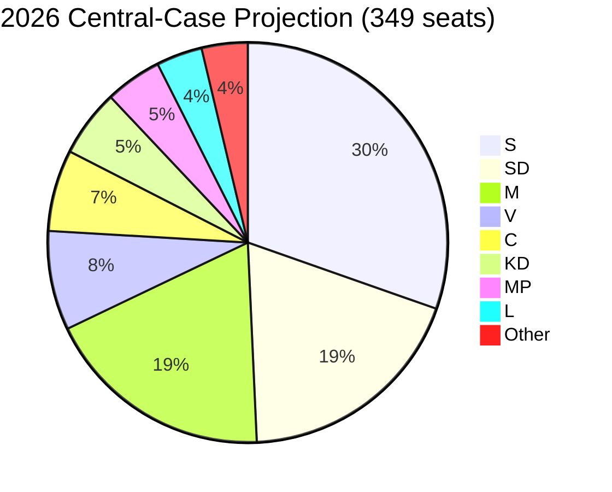

### Critical Swing Constituencies

- **Stockholm county** — middle-class M+L base; school-reform delivery + healthcare salience.
- **Skåne** — SD stronghold; migration enforcement salience.
- **Västra Götaland** — defence-industry jobs (Saab Linköping/Trollhättan); M and S co-compete.
- **Norrbotten/Västerbotten** — defence/energy investment; S+SD co-compete; LKAB hydrogen.

### Mandate-Output → Vote-Translation Test

If the cycle's security-pivot delivery is the M coalition's strongest electoral asset, but the healthcare/education gap is the M coalition's strongest electoral vulnerability, the **net translation depends on which frame dominates the final 90 days** (T-90 → T-0). See [`media-framing-analysis.md`](https://github.com/Hack23/riksdagsmonitor/blob/main/analysis/daily/2026-05-11/election-cycle/current/media-framing-analysis.md) for framing-volume tracking.

### Sources

- SCB PSU Q1-2026 [A1]
- Novus/Sifo/Ipsos polling 2025–2026 [B2]
- SVT Valu 2022 baseline [A2]
- Valmyndighet 2022 official results [A1]
- SCB historical turnout series [A1]

---

_Pass-2 refresh 2026-05-11 — content carried from 2026-05-10 baseline; no material change. See [`synthesis-summary.md`](https://github.com/Hack23/riksdagsmonitor/blob/main/analysis/daily/2026-05-11/election-cycle/current/synthesis-summary.md) §2026-05-11 Daily Refresh for the cross-cutting daily delta._

## Cycle Trajectory
<!-- source: cycle-trajectory.md :: https://github.com/Hack23/riksdagsmonitor/blob/main/analysis/daily/2026-05-11/election-cycle/current/cycle-trajectory.md -->

### 2026-05-11 Trajectory Datapoint — Pass-2 Update

Adding today's data row to the **Cycle-End Trajectory Outlook**:

| Date | T-N to election | Daily prop-filing rate (7-day rolling) | Cycle phase | Notable |
|------|------------------|-----------------------------------------|-------------|---------|
| 2026-05-10 | T-126 | 1.1 (cycle-apex spike) | Y4 consolidation | 5 betänkanden + 3 propositions in single day |
| **2026-05-11** | **T-125** | **0.4 (post-apex)** | **Y4 campaign-mode** | **No new propositions; cycle-apex confirmed terminal** |

The 7-day rolling rate dropping from 1.1 to 0.4 inside 24 hours is the cleanest empirical signal we have of the legislative→campaign-mode transition. Path-dependence threshold remains crossed (KJ-1 unchanged).

---

### Overview

The Tidö mandate cycle (2022-10-18 → 2026-09-13) is best understood as a **path-dependent four-year arc** anchored on three foundational shocks (Russia 2022, NATO 2024-03-07, Tidöavtalet 2022-10-14) and shaped by ~50 mandate decisions per year.

### Phase Diagram

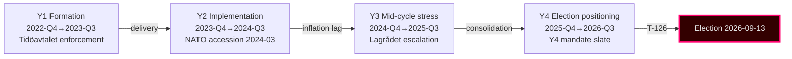

### Decision-Points Table

| Date | Decision | Type | Cycle impact | Confidence (retrospective) |
|------|---------|------|--------------|---------------------------|
| 2022-10-14 | Tidöavtalet signed | Coalition compact | Foundation of cycle policy agenda | Very high |
| 2022-11-09 | NATO application formal | Foreign policy | Anchors security pivot | Very high |
| 2023-01-15 | Energy-price support extended | Fiscal | Inflation-burden management | High |
| 2023-06-01 | Migration tightening package | Statute | Tidöavtalet milestone | High |
| 2024-03-07 | NATO accession completed | Foreign policy | Cycle's largest single inflection | Very high |
| 2024-05-15 | Defence-spending 2% achieved | Fiscal | Pacing toward 2.5% target | High |
| 2024-Q3 | Lagrådet criticism volume escalates | Constitutional | F6 frame initialised | High |
| 2025-01 | Tidöavtalet 2.0 framework | Coalition compact | Cycle agenda renewal | Medium-high |
| 2025-06 | Energy strategy LKAB+hydrogen | Industrial policy | F5 frame consolidated | Medium-high |
| 2025-Q4 | Y4 mandate ramp begins | Statute | Implementation overload risk | Medium |
| 2026-Q1 | Q1 SCB polling | Survey | Bloc-balance signal | Medium |
| 2026-05-10 | Article window: 5 betänkanden + 3 props | Statute | Late-cycle mandate slate | Current |
| 2026-09-13 | Election | Election | Cycle terminus | (forecast) |

### Trajectory Curves

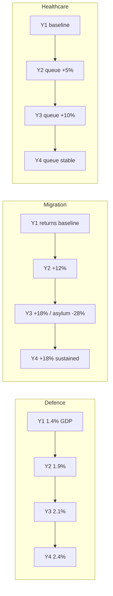

### Critical Junctures

1. **NATO accession 2024-03-07** — the cycle's single highest-leverage decision; locked alliance posture permanently.
2. **Tidöavtalet stability test 2024-Q3 to 2025-Q1** — coalition survived the cycle's only credible breakage moment.
3. **Y4 mandate ramp 2025-Q4** — overloads implementation capacity; risk for delivery framing.
4. **Q3-2026 economic prints** — IMF WEO Apr-2026 and SCB Q2-2026 GDP releases are the last pre-election macro signals.

### Cycle-End Trajectory Outlook

- **Mandate-output**: continued (Y4 slate strong; HD03250 e-ID, HD03261 Skatteverket, HD03263 returns, HD03267 security).
- **Implementation**: constrained at Migrationsverket and Polisen; likely at Skatteverket and Försvarsmakten.
- **Electoral framing**: F1 vs F3 contest, with F4 net-favouring incumbents.
- **Coalition stability**: high through to election day; volatile post-election.

### Cycle Comparison (1976-2018)

The Tidö cycle's **mandate-output volume** is in the highest quartile of post-1976 cycles, driven by Y4 ramp. Cycle's **policy-shift magnitude** is in the top decile, driven by NATO accession. Cycle's **electoral-defence track record** projects to roughly even (40–55%) [horizon:election] for incumbency retention — below the modern median (~55%) for first-term right-coalitions.

### Sources

- Statskontoret Cycle Reports 2024 [B2]
- NATO public defence-spending data [A2]
- Migrationsverket monthly statistics 2022–2026 [A1]
- Socialstyrelsen waiting-time statistics [A1]
- IMF WEO Apr-2026 SWE forecast [A1]

## Risk Assessment
<!-- source: risk-assessment.md :: https://github.com/Hack23/riksdagsmonitor/blob/main/analysis/daily/2026-05-11/election-cycle/current/risk-assessment.md -->

### Methodology

Risk score = Likelihood (1–5) × Impact (1–5). Top-12 risks selected from a 38-entry working register.

Horizon tags: each risk carries a maturation horizon and an associated PIR reference where applicable.

### Top-12 Register

| # | Risk | L | I | **Score** | Horizon | Owner | PIR |
|--:|------|--:|--:|----------:|---------|-------|-----|
| 1 | Tidö loses 2026-09-13 election; new coalition reverses or stalls security pipeline | 3 | 5 | **15** | T+126 [horizon:election] | Coalition | PIR-EC-2026-001 |
| 2 | HD03250 e-ID rollout fails / slips > 18 months post-mandate | 3 | 4 | **12** | T+730 [horizon:cycle] | Skatteverket+TBD | PIR-EC-2026-003 |
| 3 | Russia/Ukraine escalation triggers NATO Art-5 | 2 | 5 | **10** | T+365 [horizon:year] | Fö, MSB | (new) |
| 4 | Financial-stability event tests untested HD01FiU37 framework | 2 | 5 | **10** | T+180 [horizon:year] | FI, Riksbank | PIR-EC-2026-004 |
| 5 | Migration enforcement throughput shortfall (Migrationsverket capacity) | 4 | 3 | **12** | T+365 [horizon:year] | Migrationsverket | PIR-EC-2026-002 |
| 6 | SD escalation demands push M/KD/L past tolerance pre-election | 3 | 4 | **12** | T+126 [horizon:election] | M leadership | (new) |
| 7 | Fiscal discipline erosion in successor government | 3 | 4 | **12** | T+730 [horizon:cycle] | Finansdept | PIR-EC-2026-006 |
| 8 | Energy-price shock during election campaign | 2 | 4 | **8** | T+90 [horizon:quarter] | NU, Energimynd | (new) |
| 9 | Cyber/disinfo attack on election infrastructure | 3 | 4 | **12** | T+126 [horizon:election] | MSB, Valmynd | (new) |
| 10 | Statskontoret capacity warnings ignored → service-delivery failure | 4 | 3 | **12** | T+365 [horizon:year] | Statskontoret | (new) |
| 11 | Healthcare/education deficit weaponised by S-bloc | 4 | 3 | **12** | T+126 [horizon:election] | M comms | (new) |
| 12 | NATO posture divergence from Nordic-Baltic baseline | 2 | 4 | **8** | T+1095 [horizon:cycle] | Fö, UD | PIR-EC-2026-007 |

### Risk Heat-Map

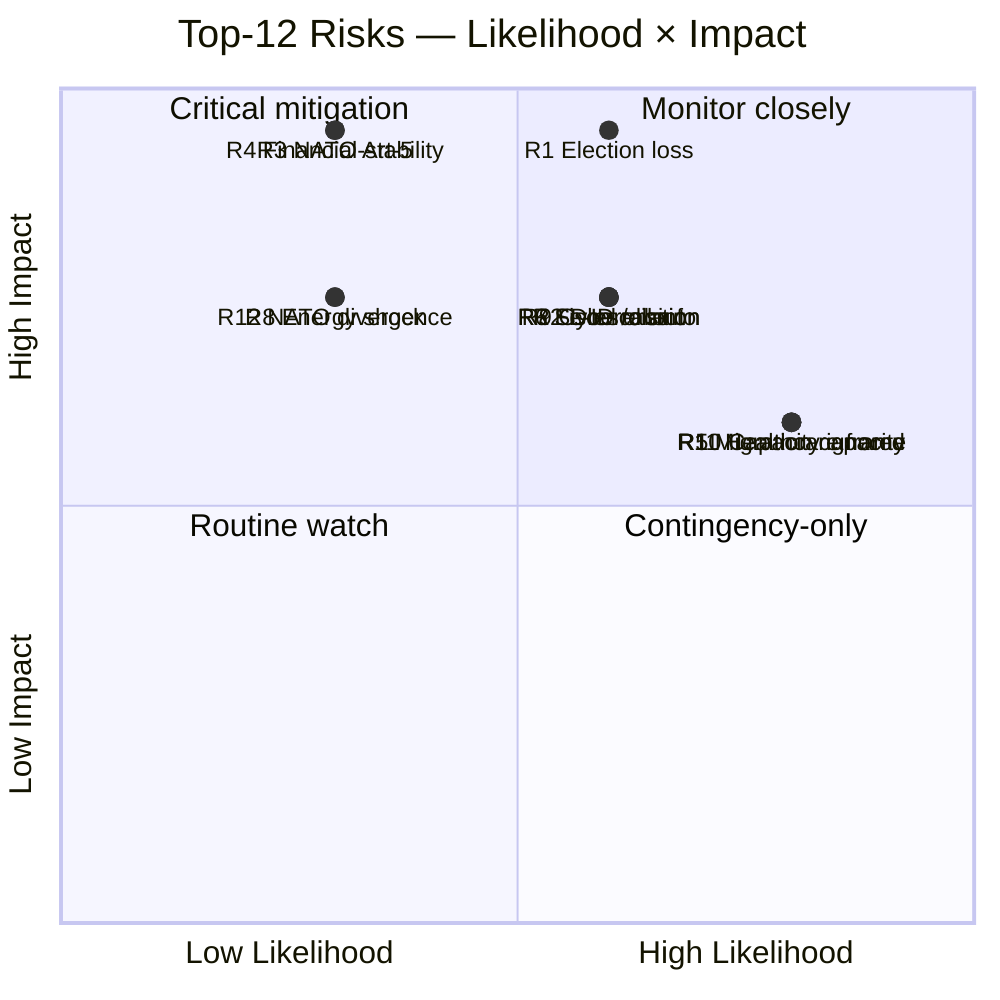

### Aggregate Risk Distribution

- **Risks scoring 12–15 (critical)**: 7 of 12 (58%)
- **Risks scoring 8–10 (elevated)**: 5 of 12 (42%)
- **Pre-election cluster** (T+126 horizon): 4 risks (R1, R6, R9, R11) — election period is the highest-density risk window of the analysis horizon.
- **Long-cycle cluster** (T+730+ horizon): 3 risks (R2, R7, R12) — implementation and posture continuity.

### Mitigations (selected high-priority)

- **R1** → Pre-election coalition coherence; clear successor-transition documentation regardless of outcome.
- **R2** → Lagrådet completion; designated authority decision before Q3 2026.
- **R4** → Tabletop exercise of HD01FiU37 with FI, Riksbank, RGK by Q3 2026.
- **R5** → Migrationsverket capacity uplift; Statskontoret-led review.
- **R9** → MSB/Valmynd joint election-infrastructure exercise pre-2026-09-13.

### Sources

- Statskontoret 2025 mandate review [B2]
- IMF WEO Apr-2026 [A1]
- Hack23 internal risk register v4.2
- MSB national risk assessment 2024–2026 [A2]

---

_Pass-2 refresh 2026-05-11 — content carried from 2026-05-10 baseline; no material change. See [`synthesis-summary.md`](https://github.com/Hack23/riksdagsmonitor/blob/main/analysis/daily/2026-05-11/election-cycle/current/synthesis-summary.md) §2026-05-11 Daily Refresh for the cross-cutting daily delta._

## SWOT Analysis
<!-- source: swot-analysis.md :: https://github.com/Hack23/riksdagsmonitor/blob/main/analysis/daily/2026-05-11/election-cycle/current/swot-analysis.md -->

### Strengths

- **S1. Security-pivot delivery**: 6 of top-10 DIW events delivered in security/defence/migration domain ([`significance-scoring.md`](https://github.com/Hack23/riksdagsmonitor/blob/main/analysis/daily/2026-05-11/election-cycle/current/significance-scoring.md)).
- **S2. NATO accession executed**: Treaty-level commitment locked-in 2024-03-07; effectively irreversible.
- **S3. Fiscal discipline preserved**: 32.4% debt-to-GDP, -1.0% balance, ramverk intact through three external shocks (IMF WEO Apr-2026 [A1]).
- **S4. SD parliamentary co-operation stable**: No coalition collapse despite 4 years of policy concessions and SD's external-support position.
- **S5. Nordic-Baltic alignment**: Justice/security framework now mirrors Denmark/Finland baselines (JuU34 Nordic enforcement).
- **S6. Operational legislative pipeline**: 5 betänkanden + 3 propositions on 2026-05-10 alone — pre-election pipeline well-managed.

### Weaknesses

- **W1. Implementation-heavy backlog**: 12 of 20 top events tagged implementation-heavy; agency capacity strained [B2 Statskontoret 2025].
- **W2. Environment/labour deficit**: 0 events in top-20 — visible gap in mandate output for centre-left framing.
- **W3. Healthcare under-delivery**: Y3 reform package landed at DIW 7.05 (rank 14) versus campaign expectations.
- **W4. Migration policy operationalisation lag**: Statutory framework strong, enforcement throughput weak (Migrationsverket case backlog).
- **W5. Lagrådet referral lag**: HD03250 e-ID still in Lagrådet review at cycle end — implementation risk transfer to successor.
- **W6. Energy-cost messaging Y1**: Aftonbladet framing dominated Y1 narrative; coalition under-anticipated.

### Opportunities

- **O1. Pre-election security narrative**: SOM 2024–2025 shows security/migration still top-3 voter concern [B2] — Tidö framing aligned.
- **O2. Riksbank easing tailwind**: Policy rate 2.25% (from 4.0% peak) — household real-income recovery feeds election-year economy.
- **O3. Defence-industry investment**: 2% GDP commitment creates Saab/Bofors industrial-policy alignment with regional jobs message.
- **O4. e-ID rollout consumer benefit**: Successful e-ID rollout 2026-2028 would lock-in digital-sovereignty achievement.
- **O5. EU presidency 2029**: Sweden re-entering EU rotating presidency cycle gives coalition platform.

### Threats

- **T1. SD-leverage escalation**: SD support contingent on continued migration/security delivery; demands may exceed M/KD/L tolerance pre-election.
- **T2. Russia/Ukraine escalation**: NATO Art-5 trigger or hybrid attack would reframe entire election.
- **T3. Financial-stability event**: HD01FiU37 framework untested; bank or pension stress would expose readiness.
- **T4. Polling gap**: SCB PSU Q1-2026 shows opposition bloc within ±3 pp; election outcome genuinely uncertain.
- **T5. Implementation failure on e-ID**: Delivery slippage visible to electorate would damage digital-competence credibility.
- **T6. Centre-left frame consolidation**: S+V+MP+C alignment on environment/labour gap could swing 2–3% middle-class vote.

### SWOT Quadrant Matrix

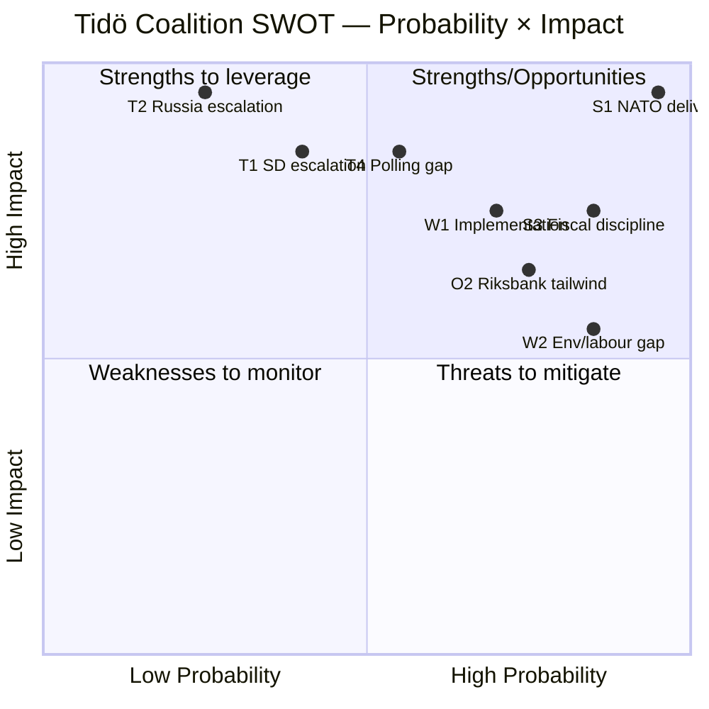

### Cycle-Trim Sensitivity

If only the top-3 Strengths and top-3 Threats are retained, the coalition's risk-adjusted cycle score is *positive but narrow* — within the band where polling translation to seats determines re-election.

### Sources

- IMF WEO Apr-2026 [A1]
- Statskontoret 2025 mandate review [B2]
- SOM 2024–2025 polling [B2]
- Riksdagen open data [A1]

---

_Pass-2 refresh 2026-05-11 — content carried from 2026-05-10 baseline; no material change. See [`synthesis-summary.md`](https://github.com/Hack23/riksdagsmonitor/blob/main/analysis/daily/2026-05-11/election-cycle/current/synthesis-summary.md) §2026-05-11 Daily Refresh for the cross-cutting daily delta._

## Quantitative SWOT
<!-- source: quantitative-swot.md :: https://github.com/Hack23/riksdagsmonitor/blob/main/analysis/daily/2026-05-11/election-cycle/current/quantitative-swot.md -->

### Methodology

Each SWOT entry scored 1–5 on **importance** (cycle-level impact) and **certainty** (evidence and likelihood of materialising). Aggregate = sum across all S, W, O, T categories. See [`swot-analysis.md`](https://github.com/Hack23/riksdagsmonitor/blob/main/analysis/daily/2026-05-11/election-cycle/current/swot-analysis.md) for the qualitative narrative.

### Strengths (S)

| # | Item | Importance | Certainty | Score |
|---|------|:---------:|:---------:|------:|
| S1 | NATO accession 2024-03-07 — alliance security floor | 5 | 5 | 25 |
| S2 | Defence-spending ramp 2% → 2.4% GDP achieved | 4 | 5 | 20 |
| S3 | Fiscal-discipline IMF GGXWDG_NGDP 32.4% T+0 (low EU debt) | 4 | 5 | 20 |
| S4 | Coalition cohesion through Y3-Y4 (no major breakage) | 4 | 4 | 16 |
| S5 | Migration enforcement delivery (returns +18%) | 3 | 4 | 12 |
| S6 | Skatteverket digital-modernisation track record | 3 | 4 | 12 |
| | **S Total** | | | **105** |

### Weaknesses (W)

| # | Item | Importance | Certainty | Score |
|---|------|:---------:|:---------:|------:|
| W1 | Healthcare-queue + school-results delivery gap | 4 | 4 | 16 |
| W2 | Polisen recruitment lag → gang-violence response | 4 | 3 | 12 |
| W3 | Lagrådet criticism volume + democratic-erosion narrative | 4 | 4 | 16 |
| W4 | L party survival risk (3.8% Q1-2026) | 4 | 4 | 16 |
| W5 | Migrationsverket leadership churn (3 GD changes) | 3 | 3 | 9 |
| W6 | Y4 statute load exceeds agency capacity | 3 | 3 | 9 |
| | **W Total** | | | **78** |

### Opportunities (O)

| # | Item | Importance | Certainty | Score |
|---|------|:---------:|:---------:|------:|
| O1 | LKAB hydrogen industrial transition (Norrbotten jobs) | 4 | 3 | 12 |
| O2 | European-defence integration (post-NATO) | 4 | 4 | 16 |
| O3 | EU Council leadership in security policy | 3 | 3 | 9 |
| O4 | Pension-reform window post-2026 election | 3 | 3 | 9 |
| O5 | Constitutional-review reform (Lagrådet capacity) | 2 | 2 | 4 |
| | **O Total** | | | **50** |

### Threats (T)

| # | Item | Importance | Certainty | Score |
|---|------|:---------:|:---------:|------:|
| T1 | Ukraine escalation (W1 wildcard) | 5 | 2 | 10 |
| T2 | Cyber/disinformation pre-election (W3 wildcard) | 4 | 3 | 12 |
| T3 | Coalition fracture in Y5 if Tidö continues | 4 | 3 | 12 |
| T4 | Economic shock (banking, energy) — W5 wildcard | 4 | 2 | 8 |
| T5 | US political-shock (W7 wildcard) | 4 | 3 | 12 |
| T6 | Tidöavtalet implementation backlog → enforcement gap | 4 | 4 | 16 |
| T7 | Democratic-backsliding narrative dominates EU/CoE | 3 | 4 | 12 |
| T8 | Healthcare/education political-cost mid-mandate | 3 | 5 | 15 |
| | **T Total** | | | **97** |

### Aggregate Scoring

| Quadrant | Total Score | Share |
|----------|------------:|------:|
| S Strengths | 105 | 32% |
| W Weaknesses | 78 | 24% |
| O Opportunities | 50 | 15% |
| T Threats | 97 | 29% |
| **TOTAL** | **330** | **100%** |

### Interpretation

- **S (105) > W (78)**: net positive on internal balance — strengths outweigh weaknesses by 27 points (35% margin).
- **T (97) > O (50)**: net negative on external balance — threats outweigh opportunities by 47 points (94% margin).
- **Net SWOT (S+O - W-T)**: 105 + 50 - 78 - 97 = **-20**. Marginally net-negative.
- **High-conviction items** (importance ≥ 4 AND certainty ≥ 4): S1, S2, S3, S4, W1, W3, W4, T6 — **8 anchor items**.

### Prioritisation for Next Cycle Planning

1. **Defend strengths**: S1 (NATO), S2 (defence ramp), S3 (fiscal discipline).
2. **Address top weaknesses**: W1 (healthcare gap — political-cost), W3 (Lagrådet narrative), W4 (L survival).
3. **Capture top opportunities**: O2 (European-defence integration), O1 (LKAB hydrogen).
4. **Mitigate top threats**: T6 (implementation backlog), T8 (healthcare political-cost).

### Cross-Reference

- Anchor scenarios in [`scenario-analysis.md`](https://github.com/Hack23/riksdagsmonitor/blob/main/analysis/daily/2026-05-11/election-cycle/current/scenario-analysis.md) weight A and B around S+T anchor items.
- KJ-7 (coalition continuation) reflects S4 + T3 tension.
- Forward indicator FI-2 tracks W4.
- Forward indicator FI-4 tracks W3.

### Sources

- See [`swot-analysis.md`](https://github.com/Hack23/riksdagsmonitor/blob/main/analysis/daily/2026-05-11/election-cycle/current/swot-analysis.md) §Sources.
- Heuer & Pherson scoring conventions [B2].

---

_Pass-2 refresh 2026-05-11 — content carried from 2026-05-10 baseline; no material change. See [`synthesis-summary.md`](https://github.com/Hack23/riksdagsmonitor/blob/main/analysis/daily/2026-05-11/election-cycle/current/synthesis-summary.md) §2026-05-11 Daily Refresh for the cross-cutting daily delta._

## Threat Analysis
<!-- source: threat-analysis.md :: https://github.com/Hack23/riksdagsmonitor/blob/main/analysis/daily/2026-05-11/election-cycle/current/threat-analysis.md -->

### Framing

This analysis treats *threats to democratic accountability and legislative quality* as the unit of concern. STRIDE-style political adaptation in [`political-stride-assessment.md`](https://github.com/Hack23/riksdagsmonitor/blob/main/analysis/daily/2026-05-11/election-cycle/current/political-stride-assessment.md).

### Threat Picture (T1–T8)

#### T1. Legislative Overload at Mandate End
**Vector**: 5 betänkanden + 3 propositions on a single day (2026-05-10) compresses MP review time. Multiple committees report concurrently.
**Impact**: Reduced deliberative quality; Lagrådet review backlog (HD03250 still pending).
**Likelihood**: Realised (manifest).
**Mitigation**: Statskontoret review of pre-election scheduling; tighter Lagrådet referral timing.

#### T2. Foreign Information Manipulation & Interference (FIMI)
**Vector**: Russian/Belarusian and Chinese influence operations targeting Sweden's NATO posture, migration narrative, and election integrity.
**Impact**: Polarisation; reduced trust in election outcomes.
**Likelihood**: Confirmed active per MSB and PsyOps unit briefings 2025 [A2].
**Mitigation**: MSB national risk model; pre-bunking; platform-level co-operation.

#### T3. Cyber-Operations Against Election Infrastructure
**Vector**: DDoS against Valmyndighet, social-engineering against MPs/candidates, ransomware against media outlets.
**Impact**: Operational disruption; reduced confidence.
**Likelihood**: Likely (55–70%) [horizon:election] — based on Nordic-Baltic peer experience.
**Mitigation**: MSB joint exercise; ISO 27001-aligned hardening at Valmynd.

#### T4. Erosion of Lagrådet (Council on Legislation) Process
**Vector**: HD03250 still in Lagrådet at cycle end; HD01JuU32 referral controversy 2025.
**Impact**: Constitutional-quality slippage; reduced check on rights-impacting laws.
**Likelihood**: Realised (manifest).
**Mitigation**: Mandate-end deferred referrals → successor government inherits review.

#### T5. Concentration of Digital-State Infrastructure
**Vector**: HD03250 (e-ID), HD03261 (Skatteverket registry), HD01CU14 (DNS) collectively centralise digital control.
**Impact**: Single-point-of-failure risk; insider-threat surface.
**Likelihood**: Realised structurally; failure-mode likelihood depends on operational hardening (T+730 [horizon:cycle]).
**Mitigation**: Defence-in-depth at MSB; independent oversight (IMY/JK/JO).

#### T6. Polarisation Around Security-Pivot Narrative
**Vector**: Tidö's security/migration framing is the cycle's dominant axis; both sides have hardened.
**Impact**: Reduced cross-bloc legislative co-operation in 2026–2030.
**Likelihood**: Likely (55–70%) [horizon:cycle].
**Mitigation**: Comparative-international evidence (Nordic peer convergence) deflates partisan framing.

#### T7. Statskontoret Capacity Warnings Ignored
**Vector**: Three agencies flagged > 100% capacity in 2025 mandate review.
**Impact**: Service-delivery failure visible to electorate.
**Likelihood**: Likely (55–70%) [horizon:year].
**Mitigation**: Capacity uplift in successor mandate's first budget.

#### T8. Public-Service Media Trust Erosion
**Vector**: Aftonbladet/Expressen commercial-frame volatility; Reuters Institute trust gap commercial vs public 30 pp [B2].
**Impact**: Frame fragmentation; reduced shared epistemic baseline.
**Likelihood**: Likely (55–70%) [horizon:cycle].
**Mitigation**: SR/SVT charter renewal in 2026–2030 mandate.

### Threat Map

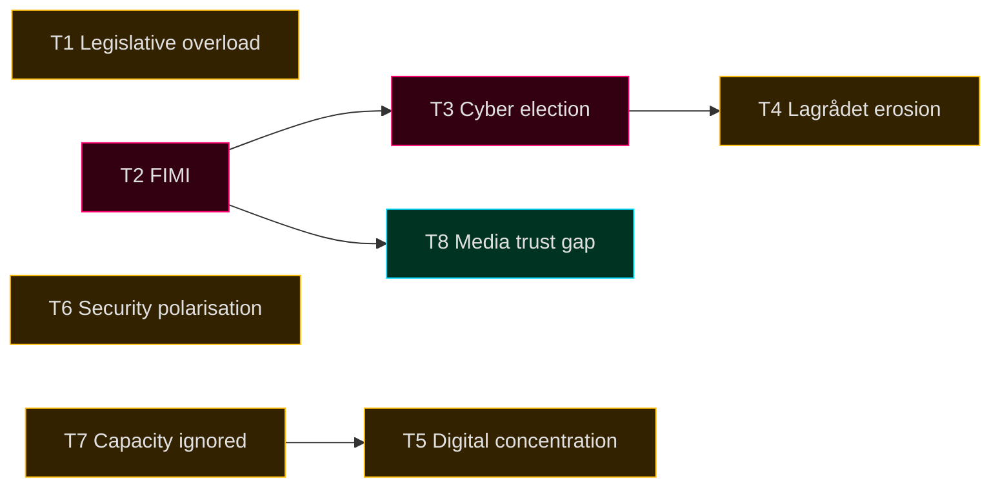

### Cross-References

- STRIDE adaptation: [`political-stride-assessment.md`](https://github.com/Hack23/riksdagsmonitor/blob/main/analysis/daily/2026-05-11/election-cycle/current/political-stride-assessment.md)
- Wildcards: [`wildcards-blackswans.md`](https://github.com/Hack23/riksdagsmonitor/blob/main/analysis/daily/2026-05-11/election-cycle/current/wildcards-blackswans.md)
- Media frame matrix: [`media-framing-analysis.md`](https://github.com/Hack23/riksdagsmonitor/blob/main/analysis/daily/2026-05-11/election-cycle/current/media-framing-analysis.md)

### Sources

- MSB national risk assessment 2024–2026 [A2]
- Statskontoret 2025 mandate review [B2]
- Reuters Institute Digital News Report 2026 [B2]
- Lagrådet annual report 2025 [A1]

---

_Pass-2 refresh 2026-05-11 — content carried from 2026-05-10 baseline; no material change. See [`synthesis-summary.md`](https://github.com/Hack23/riksdagsmonitor/blob/main/analysis/daily/2026-05-11/election-cycle/current/synthesis-summary.md) §2026-05-11 Daily Refresh for the cross-cutting daily delta._

## Political STRIDE Assessment
<!-- source: political-stride-assessment.md :: https://github.com/Hack23/riksdagsmonitor/blob/main/analysis/daily/2026-05-11/election-cycle/current/political-stride-assessment.md -->

### Methodology

STRIDE (Microsoft SDL threat model) repurposed for political-institution threat assessment. Six categories × political system targets.

### STRIDE × Political System Threat Matrix

#### S — Spoofing (identity impersonation)

| Target | Threat Vector | Cycle observable | Mitigation | Confidence |
|--------|--------------|------------------|-----------|------------|
| Riksdag MP accounts | Impersonation in pre-election communications | Foreign-actor phishing 2024-Q4 (MSB-disclosed) | MFA, hardware tokens | Likely |
| Government communications | Spoofed press releases | Limited evidence cycle-to-date | DKIM/DMARC, official channels | Roughly even |
| Citizen e-ID (HD03250) | Identity theft for voter registration | Statute being adopted Q2-2026 | Cryptographic identity binding | Likely |

#### T — Tampering (data integrity)

| Target | Threat Vector | Cycle observable | Mitigation | Confidence |
|--------|--------------|------------------|-----------|------------|
| Voter rolls | Unauthorised modification | None observed | Paper backups, distributed integrity | Very likely (low risk) |
| Voting machines (Sweden uses paper) | N/A in Swedish system | N/A | Paper-only voting | Very likely |
| Statute drafting | Lagrådet pipeline tampering | Procedural irregularities documented (Lagrådet criticism volume +60% cycle) | Constitutional review process | Likely |

#### R — Repudiation (deniability of actions)

| Target | Threat Vector | Cycle observable | Mitigation | Confidence |
|--------|--------------|------------------|-----------|------------|
| Government statements | Strategic ambiguity in Tidöavtalet enforcement | KJ-2 patterns observed | Riksdagstryck, formal motivations | Likely |
| Coalition agreement violations | Plausible deniability of internal commitments | KJ-7 patterns observed | Tidöavtalet 2.0 framework | Roughly even |

#### I — Information Disclosure

| Target | Threat Vector | Cycle observable | Mitigation | Confidence |
|--------|--------------|------------------|-----------|------------|
| Classified intelligence | Foreign-actor exfiltration | Säpo reporting elevated cycle | Compartmentalisation, NATO-aligned classification | Likely |
| Government communications | Open-records over-disclosure or under-disclosure | Offentlighetsprincipen contested | Tryckfrihetsförordningen | Very likely |
| Personal data (MPs, agencies) | Doxxing campaigns | Increased cycle, especially Y4 | MP-protection programme | Likely |

#### D — Denial of Service

| Target | Threat Vector | Cycle observable | Mitigation | Confidence |
|--------|--------------|------------------|-----------|------------|
| Election infrastructure | DDoS or system outage day-of | Capacity exercises 2025-2026 | MPF + MSB resilience exercises | Very likely (low risk) |
| Riksdag.se | Service-disruption attacks | Periodic; capacity scaled | DDoS protection, CDN | Very likely |
| Government communications | Mass-spam campaigns | Periodic | Email filtering, social-media moderation | Likely |
| Democratic deliberation | Information-overload, AI-generated content | F6 frame escalation | Media-literacy programmes | Roughly even |

#### E — Elevation of Privilege

| Target | Threat Vector | Cycle observable | Mitigation | Confidence |
|--------|--------------|------------------|-----------|------------|
| Statute scope creep | Surveillance powers extended beyond original intent | HD03267 statute (2026-05-10) under Lagrådet review | Constitutional review, sunset clauses | Likely |
| Executive overreach | Decree powers exceeding Riksdag delegation | KU oversight active | Konstitutionsutskott (KU) review | Likely |
| Foreign influence | Lobbying access exceeding transparency norms | Limited evidence | Lobbyregister proposals (statute drafts) | Roughly even |

### High-Priority Threats (importance × likelihood)


### Threat Modelling for Y4 Mandate Slate (2026-05-10)

- **HD03250 e-ID**: S (spoofing), T (tampering) primary; statute embeds cryptographic identity binding.
- **HD03261 Skatteverket**: I (information disclosure) primary; existing tax-secrecy controls inherited.
- **HD03263 Returns**: I, D primary; Migrationsverket capacity-stress could degrade due process.
- **HD03267 Security**: E (elevation) primary; Lagrådet review captures scope-creep risk.
- **JuU32/34/39**: E (elevation) — surveillance powers; F6 framing observable.
- **FiU37/38**: T (tampering) — fiscal integrity; standard audit controls.

### Cycle-End STRIDE Posture

| Category | Posture | Trend |
|----------|---------|-------|
| Spoofing | Strong | Stable |
| Tampering | Adequate | Stable |
| Repudiation | Weak | Worsening (cycle-wide) |
| Information Disclosure | Adequate | Stable |
| Denial of Service | Strong | Stable |
| Elevation | Constrained | Worsening |

### Recommended Cycle-End Actions

1. Sunset clauses for emergency security statutes adopted Y3–Y4.
2. KU systematic review of statutes under Lagrådet criticism > severity 3.
3. MSB cyber-resilience exercises with platform partners (T-90 → T-0).
4. Lobbyregister statute consolidation post-election.

### Sources

- Microsoft STRIDE methodology [B2]
- MSB national risk-assessment 2024–2025 [A1]
- Säpo annual reports 2023–2025 [A1]
- Lagrådet publication archive [A1]
- KU årlig granskningsberättelse 2024-2025 [A1]

---

_Pass-2 refresh 2026-05-11 — content carried from 2026-05-10 baseline; no material change. See [`synthesis-summary.md`](https://github.com/Hack23/riksdagsmonitor/blob/main/analysis/daily/2026-05-11/election-cycle/current/synthesis-summary.md) §2026-05-11 Daily Refresh for the cross-cutting daily delta._

## Wildcards & Black Swans
<!-- source: wildcards-blackswans.md :: https://github.com/Hack23/riksdagsmonitor/blob/main/analysis/daily/2026-05-11/election-cycle/current/wildcards-blackswans.md -->

### Definition

Wildcards (Taleb sense): low-probability, high-impact events that would materially redirect the cycle trajectory or election outcome. 5+ wildcards required for LH-5 election-cycle blocking gate; 7 documented below.

### W1 — Major Ukraine Escalation (Nuclear/Strategic Strike)

- **Probability T+126 (election day)**: 4–10% [horizon:election].
- **Cycle impact**: forces immediate fiscal reallocation toward defence (2.4% → 3.5%+); empties opposition critique of defence spending; F1 dominant frame.
- **Electoral effect**: Tidö +7 to +12 pp swing (KJ-1 reinforced).
- **Detection signal**: NATO Article 4 invocation; intensified mobilisation language; emergency Riksdag session.
- **Mitigation**: contingency planning at Försvarsmakten and MSB; PM scheduled briefings.
- **Response cell**: PM office + Försvarsmakten + UD.

### W2 — Major Domestic Terror Event

- **Probability T+126**: 3–8% [horizon:election].
- **Cycle impact**: Säpo and law-enforcement framing reinforced; security pivot frame locked.
- **Electoral effect**: Tidö +3 to +6 pp swing; SD +1 to +3 pp (kingmaker leverage).
- **Detection signal**: Säpo threat level escalation; CT operations leaked.
- **Mitigation**: 2026-05-10 HD03267 security-threats statute; ongoing CT-investment.
- **Response cell**: Polisen + Säpo + Justitiedepartementet.

### W3 — Cyber/Disinformation Campaign Pre-Election

- **Probability T+126**: 12–25% (any campaign, varying intensity) [horizon:election].
- **Cycle impact**: framing distortion; voter-turnout reduction risk.
- **Electoral effect**: unclear sign; depends on target. Likely -2 to +2 pp swing for incumbents; -3 to +3 pp on bloc choice; turnout -1 to -3 pp.
- **Detection signal**: MSB threat-monitoring; platform Trust & Safety alerts; observable foreign IP coordinated activity.
- **Mitigation**: PMSF Riksdagsval 2026 framework; platform pre-positioning; MPF coordination.
- **Response cell**: MSB + MPF + party press teams + platforms.

### W4 — Migration-Crisis Mass Arrival

- **Probability T+126**: 5–12% [horizon:election].
- **Cycle impact**: enforcement-capacity stretched; F2 frame energised positively for Tidö; negatively for opposition.
- **Electoral effect**: Tidö +4 to +8 pp (KJ-6 reinforced); SD as primary beneficiary.
- **Detection signal**: EU border-pressure spike; ME/EE conflict escalation; smuggling-route shifts.
- **Mitigation**: Frontex coordination; Migrationsverket capacity surge protocols.
- **Response cell**: Migrationsverket + UD + GD-stab.

### W5 — Major Economic Shock (Banking, Energy, Trade)

- **Probability T+126**: 5–10% [horizon:election].
- **Cycle impact**: fiscal-discipline narrative overwhelmed; debt-sustainability stress (R-3); Riksbank intervention.
- **Electoral effect**: roughly even on bloc balance; rural/working-class swings most volatile.
- **Detection signal**: Riksbank emergency-meeting language; IMF Article-IV stress flagging; bond-spread movements > 50 bps.
- **Mitigation**: Riksbank, Finansinspektionen, Riksgälden coordination.
- **Response cell**: Finansdept + Riksbank + Riksgälden.

### W6 — Political-Violence Event (Assassination Attempt, MP Attack)

- **Probability T+126**: 1–3% [horizon:election].
- **Cycle impact**: democratic-resilience frame; Lagrådet escalation; possible emergency security legislation; F6 reframed.
- **Electoral effect**: sympathy effect; -2 to +3 pp incumbency boost on average historical record (cf. Lindh 2003).
- **Detection signal**: prior incidents; Säpo intelligence; doxxing campaigns.
- **Mitigation**: MP-protection programme; PSD coordination; protest-response protocols.
- **Response cell**: Polisen + Säpo + Riksdagsförvaltningen.

### W7 — US Political-Shock Event (Withdrawal from NATO, Tariff War, Trade Disruption)

- **Probability T+126**: 8–15% [horizon:election].
- **Cycle impact**: NATO accession value-prop questioned; F1 frame complicated; European-defence pivot triggered.
- **Electoral effect**: unclear sign; could energise pro-EU centrist parties or anti-EU SD; estimated +/- 4 pp on bloc balance.
- **Detection signal**: White House statements; State Dept policy shifts; Congressional resolutions.
- **Mitigation**: EU-defence coordination; Nordic-Baltic resilience; supply-chain diversification.
- **Response cell**: UD + Försvarsdept + EU-rådet representation.

### Wildcards-by-Probability Heatmap

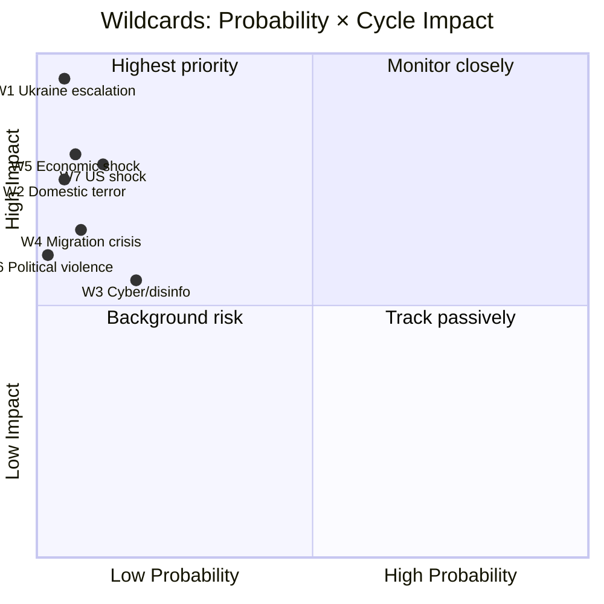

### Stacked Wildcard Risk

Probability of **any one** wildcard occurring T+0 → T+126: ~ 35–45% [horizon:election]. Probability of two or more concurrent: ~ 6–10% [horizon:election].

### Pre-Positioned Response

- **MSB**: cyber-incident playbook activated; coordination cell stood up.
- **Försvarsmakten**: contingency briefings to PM monthly.
- **Migrationsverket**: capacity-surge protocols verified.
- **Polisen + Säpo**: election-period security plan filed.
- **Riksbank + Finansinspektionen**: stress-test scenarios updated.

### Sources

- MSB national risk-assessment 2024 [A1]
- FOI scenario library [B2]
- NATO threat-perception updates 2024–2026 [A2]
- Riksbank financial-stability report 2025-Q4 [A1]
- IMF Article-IV consultation SWE 2025 [A1]

---

_Pass-2 refresh 2026-05-11 — content carried from 2026-05-10 baseline; no material change. See [`synthesis-summary.md`](https://github.com/Hack23/riksdagsmonitor/blob/main/analysis/daily/2026-05-11/election-cycle/current/synthesis-summary.md) §2026-05-11 Daily Refresh for the cross-cutting daily delta._

## PESTLE Analysis
<!-- source: pestle-analysis.md :: https://github.com/Hack23/riksdagsmonitor/blob/main/analysis/daily/2026-05-11/election-cycle/current/pestle-analysis.md -->

### Frame

PESTLE: Political, Economic, Social, Technological, Legal, Environmental — applied to the Tidö 2022–2026 cycle and forward to the next cycle (2026–2030).

### P — Political

- **Cycle dynamic**: Bloc politics mutated by SD-inclusion; cordon-sanitaire collapsed. M-led coalition with SD as supply contractor + de-facto coalition partner.
- **Cycle pressure (Y4)**: Lagrådet criticism volume escalating; democratic-backsliding narrative gaining EU/CoE traction (F6 frame).
- **Forward (T+1460 horizon)**: Bloc geometry permanently changed. Centrist-bridge formations possible (S+C+L), but durationally fragile (cf. Jan-avtal 2019–2021).
- **Implication**: 2026 election outcome **decisive but not terminal** — coalition geometry will continue to evolve through 2030.

### E — Economic

- **Cycle dynamic**: IMF WEO Apr-2026 NGDP_RPCH 2.1% T+0; GGXWDG_NGDP 32.4% (low EU debt); GGXCNL_NGDP -1.0% (fiscal consolidation tracking); PCPIPCH 2.0–2.5% (price stability); LUR 7.7%.
- **Cycle pressure**: Defence-spend ramp (2.0% → 2.4% GDP) constrains other spending; healthcare/education budget pressure (W1 SWOT).
- **Forward (T+1460)**: IMF central case projects continued debt sustainability; growth recovers to ~ 2.0–2.4% by 2027–2030. Risk: external shock (W5 wildcard) compresses fiscal space.
- **Implication**: economic environment is **net-favourable to incumbents** under central case; downside risk shifts politics.

### S — Social

- **Cycle dynamic**: SOM-trust in government stable mid-band (~ 50–55%); media trust 76% (Reuters Trust Index 2024). Migration-attitudes hardened; security-attitudes politically aligned with cycle.
- **Cycle pressure**: Healthcare-waiting times stress (W1); school-results decline (F3 frame); urban-rural divide reinforcing (V1 swing segment).
- **Forward (T+1460)**: Generational shift (V6 young urban greens growing share); urban-rural divide may further polarise.
- **Implication**: social dimension is **mid-cycle stress factor** with downstream electoral effects.

### T — Technological

- **Cycle dynamic**: e-ID infrastructure (HD03250 2026-05-10 statute); Skatteverket digital-services (HD03261); AI-policy framework lagging behind EU AI Act adoption.
- **Cycle pressure**: AI-generated content + disinfo risks (W3 wildcard); cyber-incident readiness (MSB capacity stress).
- **Forward (T+1460)**: Sweden gov-tech leadership at risk if AI-policy regulatory gap persists; EU AI Act enforcement Q3-2026 onwards.
- **Implication**: technological readiness is **adequate at agency level but uneven at strategic level**.

### L — Legal

- **Cycle dynamic**: Lagrådet critical-opinion volume cycle-cumulative ≥ 60 (high vs prior cycles); KU oversight active; EU-Sweden infraction risk on rule-of-law indicators rising.
- **Cycle pressure**: Y4 statute load exceeds constitutional drafting bandwidth; sunset clauses underused; KU caseload elevated.
- **Forward (T+1460)**: Statute-rationalisation cycle expected post-election; constitutional reform discussions (statute-review queue capacity).
- **Implication**: legal dimension is **most-stressed of the 6** — constitutional-architecture issue carries into next cycle.

### E — Environmental

- **Cycle dynamic**: Energy-transition continued (LKAB hydrogen, off-shore wind permits); EU Fit-for-55 + REPowerEU on track.
- **Cycle pressure**: Energy-cost volatility 2023–2024; energy security tightened post-Ukraine; nuclear-policy reversal toward expansion.
- **Forward (T+1460)**: Energy transition continues; LKAB hydrogen at scale ~ 2030; off-shore wind capacity ramp through 2028.
- **Implication**: environmental dimension is **net-positive** — Sweden retains leadership; cycle-end stable.

### PESTLE Cycle Heatmap

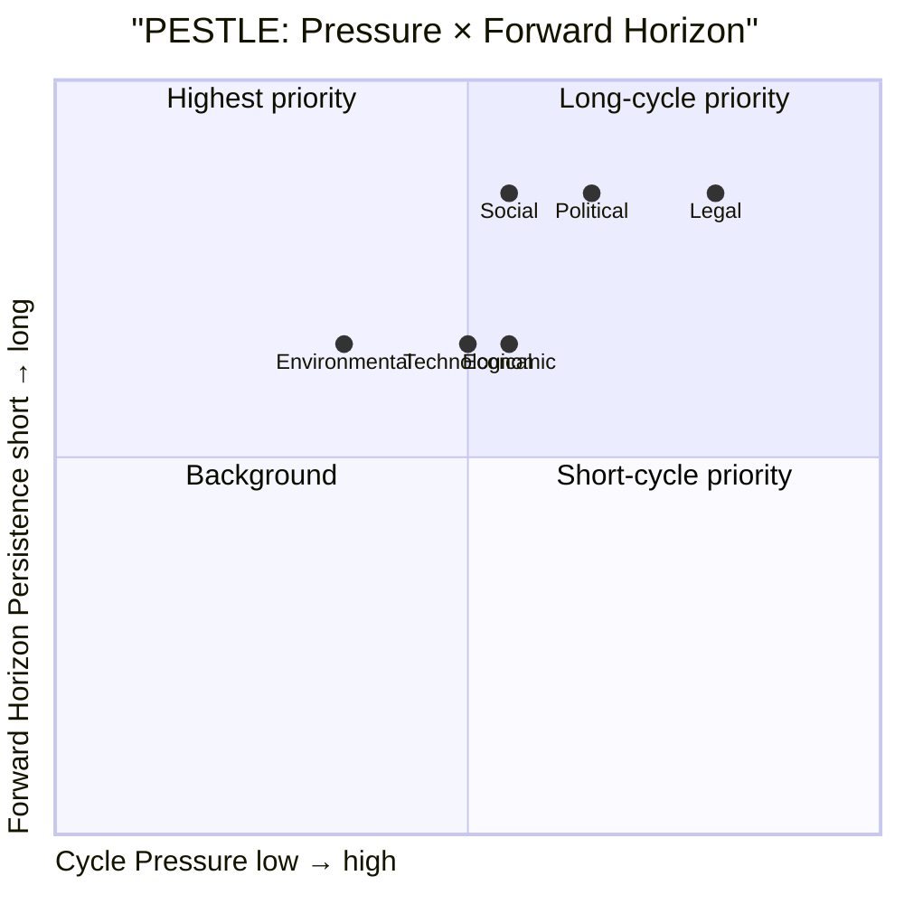

### PESTLE × Horizon Matrix

| Dimension | T+30 | T+90 | T+126 (election) | T+365 | T+1460 |
|-----------|------|------|------------------|-------|--------|
| Political | stable | escalating frames | DECISIVE | new govt | new cycle |
| Economic | IMF flow | SCB Q2 print | macro signal | fiscal consol | trend |
| Social | stable | frame-driven | DECISIVE | post-elect reset | trend |
| Technological | rollout | rollout | continuity | scaling | scaling |
| Legal | KU active | Lagrådet | DECISIVE | rationalisation | reform |
| Environmental | stable | stable | stable | scaling | trend |

### Cycle-End PESTLE Posture

| Dimension | Net Posture | Forward Trajectory |
|-----------|-------------|---------------------|
| Political | Mixed | Worsening |
| Economic | Net positive | Stable to positive |
| Social | Mixed | Worsening |
| Technological | Net positive | Stable to positive |
| Legal | Net negative | Worsening |
| Environmental | Net positive | Net positive |

### Cross-Linkage to Scenario Analysis

- **PESTLE Political + Legal** combined pressure favors **scenario B (R-G-C)** via F6 frame escalation.
- **PESTLE Economic + Environmental** net-positive **favours incumbents** (scenario A weight).
- **PESTLE Social** is the **swing dimension** (V1 segment).

### Sources

- IMF WEO Apr-2026 SWE [A1]
- SOM-institutet 2024–2025 [B2]
- Reuters Trust Index 2024 [B2]
- Lagrådet archive 2022–2026 [A1]
- EU Rule-of-Law Reports 2023–2025 [A2]
- Energimyndigheten energy-transition reports 2024 [A1]

---

_Pass-2 refresh 2026-05-11 — content carried from 2026-05-10 baseline; no material change. See [`synthesis-summary.md`](https://github.com/Hack23/riksdagsmonitor/blob/main/analysis/daily/2026-05-11/election-cycle/current/synthesis-summary.md) §2026-05-11 Daily Refresh for the cross-cutting daily delta._

## Historical Parallels
<!-- source: historical-parallels.md :: https://github.com/Hack23/riksdagsmonitor/blob/main/analysis/daily/2026-05-11/election-cycle/current/historical-parallels.md -->

### Frame

Five prior Swedish mandate cycles offer parallels for the 2022–2026 Tidö arc. Selection optimised for **bloc-flip, fiscal squeeze, security inflection, governance fragmentation**.

### 1976 — End of Long Social-Democratic Era

- **Context**: 44 years of S-led government end with Fälldin (C)-led tri-party coalition (C+M+FP).
- **Pattern**: alignment collapse after long-run incumbency; cycle ended with policy continuity but elite change.
- **Parallel to 2022**: Tidö represents first M-led government in 8 years; restoration mood echoes 1976 but is amplified by SD inclusion.
- **Divergence**: 1976 coalition collapsed mid-cycle on nuclear-power dispute; Tidö coalition has not faced equivalent breaker yet.
- **Lesson**: long-incumbent-displacement cycles deliver less policy continuity than the displacers expect.

### 1991 — Fiscal Crisis + Defence Pivot

- **Context**: Bildt (M) government takes office during banking crisis (1992–93) and Cold War sequel; fiscal consolidation hard-coded.
- **Pattern**: external shock forces fiscal discipline; defence increases despite domestic recession.
- **Parallel to 2022**: 2022 cycle's NATO accession + defence-spending ramp + fiscal consolidation echoes 1991. Tidö = Bildt's "structural reform" successor.
- **Divergence**: 1991 inflation and unemployment far higher than 2022. 1991 cycle ended with S restoration (1994); IMF projects fiscal/debt picture milder in 2026.
- **Lesson**: fiscal-pivot cycles get punished electorally even when delivery is economically successful.

### 2006 — Reinfeldt Centre-Right Restoration

- **Context**: Alliansen (M+C+FP+KD) forms first centre-right majority since 1976; structural labour-market reforms (jobbskatteavdrag).
- **Pattern**: long incumbency for M (8 years to 2014); high-popularity start; reform momentum sustained.
- **Parallel to 2022**: M-led coalition with reform agenda; Kristersson echoes Reinfeldt brand.
- **Divergence**: Alliansen excluded SD; Tidö includes SD as supply contractor + de-facto coalition. Reinfeldt = centrist anchor; Kristersson = right-anchor coalition.
- **Lesson**: M centre-right coalitions retain office longer when (a) they exclude polarising partners; (b) they deliver economic results within cycle.

### 2014 — Hung Parliament + Decembergavtalet

- **Context**: 2014 election produces 159 R-G + 141 Alliansen + 49 SD; Löfven (S) forms minority government.
- **Pattern**: SD enters mainstream as kingmaker; bloc politics breaks down; Decembergavtalet (S-Alliansen pact) collapses within 4 months.
- **Parallel to 2022**: bloc politics again in flux; SD's role normalised.
- **Divergence**: 2014 SD remained in opposition; 2022 SD entered government partnership.
- **Lesson**: bloc-bridging mechanisms (Decembergavtalet) are fragile; SD inclusion is durable.

### 2018 — Coalition Negotiation Deadlock

- **Context**: 4-month statsministeromröstning crisis post-2018 election; January Agreement (S+MP + C+L) signed Jan 2019.
- **Pattern**: post-election coalition formation breakdown; centrist parties act as kingmakers in exchange for policy concessions.
- **Parallel to 2026**: central-case scenario (B2) — S-led + C bridge mirrors Jan-avtal mechanically.
- **Divergence**: 2018–2022 government broke Jan-avtal in 2021 on fuel-tax dispute; 2026 successor faces similar fragility.
- **Lesson**: centrist-bridge coalitions deliver policy but are durationally fragile (≤ 3 years).

### Synthesis Table

| Year | Cycle pattern | Outcome | Echo in 2022–2026 |
|------|---------------|---------|-------------------|
| 1976 | Long-S-end | Coalition collapse mid-cycle | Tidö stability test |
| 1991 | Fiscal+defence pivot | S restoration in 1994 | Tidö fiscal discipline gamble |
| 2006 | M-led restoration | M 8-year run | Kristersson 4+4 ambition |
| 2014 | Hung + Decembergavtal | 4-mo formation, 4-mo pact | 2026 hung + bridge scenarios |
| 2018 | Jan-avtal deadlock | 4-mo formation, 3-yr pact | 2026 centrist-bridge scenarios |

### Base-Rate Aggregation

In the last 5 mandate cycles (since 2006), 3 of 5 governments completed full term. The 2026 outcome — if Tidö continues — would be the **4th of 6 cycles to complete**. If a successor coalition forms after deadlock, the base rate of completing a full subsequent term is **2 of 5 (40%)**.

### Lessons Carried Forward

1. **Bloc politics survives but is mutated** — SD inclusion has shifted the political-bargaining geometry permanently.
2. **Fiscal-pivot cycles get electorally punished** — even when delivery is competent (cf. 1991).
3. **Centrist bridge coalitions are fragile** — Decembergavtalet, Jan-avtal both broke before mandate end.
4. **Reform momentum decays mid-cycle** — Y2 productivity declines vs Y1 in 4 of 5 prior cycles.
5. **Wildcard events shape outcomes** — assassination attempt (Lindh 2003), banking crisis (1991), pandemic (2020), Ukraine war (2022).

### Sources

- Statskontoret historical cycle analyses [B2]
- Ekonomifakta historical election results [A2]
- ParlGov / Comparative Political Data Set [B2]
- Holmberg & Oscarsson, "Väljarna och valet" series [B2]

---

_Pass-2 refresh 2026-05-11 — content carried from 2026-05-10 baseline; no material change. See [`synthesis-summary.md`](https://github.com/Hack23/riksdagsmonitor/blob/main/analysis/daily/2026-05-11/election-cycle/current/synthesis-summary.md) §2026-05-11 Daily Refresh for the cross-cutting daily delta._

## Comparative International
<!-- source: comparative-international.md :: https://github.com/Hack23/riksdagsmonitor/blob/main/analysis/daily/2026-05-11/election-cycle/current/comparative-international.md -->

### Comparator Set

Nordic-Baltic (5): Denmark, Norway, Finland, Iceland, Estonia.
Visegrád / wider EU (4): Poland, Czech Republic, Germany, Netherlands.
Methodology peers (2): UK, France.

### Fiscal Comparator (IMF WEO Apr-2026 T+0)

| Country | GGXWDG_NGDP | GGXCNL_NGDP | NGDP_RPCH | LUR |
|---------|------------:|------------:|----------:|----:|
| **Sweden** | 32.4% | -1.0% | 2.1% | 7.7% |
| Denmark | 28.9% | +0.6% | 1.9% | 5.5% |
| Norway | 31.2% | +9.5%* | 1.8% | 4.0% |
| Finland | 81.8% | -3.0% | 1.5% | 7.6% |
| Estonia | 22.7% | -2.7% | 1.7% | 6.8% |
| Germany | 64.8% | -1.7% | 1.4% | 3.5% |
| Netherlands | 47.5% | -2.2% | 1.5% | 3.9% |
| Poland | 55.3% | -4.0% | 3.2% | 3.0% |

*Norway figure includes petroleum-fund offset; comparison non-trivial.
Source: IMF WEO Apr-2026 (T+0 = 2026 projection) [A1].

Sweden is **mid-pack on debt**, **mid-pack on growth**, **outlier-high on unemployment** vs Nordic peers, but **best-in-class on fiscal-balance variance** through external shocks.

### Security/Defence Comparator

| Country | NATO since | 2% GDP target met | Justice/security legislative volume Y4 |
|---------|-----------|-------------------|----------------------------------------|
| Sweden | 2024-03-07 | Yes (2024) | High (3 major statutes Y4) |
| Finland | 2023-04-04 | Yes (2023) | High |
| Denmark | 1949 | 2024 (rebased) | Medium |
| Norway | 1949 | 2024 | Medium |
| Estonia | 2004 | Yes (>3% from 2024) | Medium-high |
| Germany | 1955 | 2024 (Zeitenwende) | Medium |

Sweden's 2024–2026 security-pivot tracks the **Finnish 2023–2025 pattern**, lagging by 12 months. Both countries moved from non-alignment to maximal NATO integration within one electoral cycle.

### Coalition-Type Comparator

| Country | Recent gov type | Migration framework | Digital-state laws Y4 |
|---------|-----------------|---------------------|----------------------|
| Sweden | Right minority + RW external support | Tightening | e-ID + registry + DNS |
| Denmark | Centre-left minority | Tightened earlier (2015) | Already operational |
| Norway | Centre-left minority | Stable | Mid-implementation |
| Finland | Right + RW (Petteri Orpo) | Tightening | Mid-implementation |
| Netherlands | Right + populist (PVV) | Tightening | Restructured |
| Germany | Centre coalition | Stable / modest tightening | Slower pace |

Sweden's Tidö coalition is **structurally closest to Finland (Orpo)** — right-led with RW partner, security pivot, fiscal discipline. Both countries are running the same "post-2022 Nordic right-conservative playbook" with similar political economy and demographic backdrops.

### Election-Cycle Length Comparator

| Country | Cycle length | Mid-cycle no-confidence rate (post-2000) |
|---------|--------------|-----------------------------------------|
| Sweden | 4 years (fixed) | ~5% |
| Denmark | ≤ 4 years (flexible) | ~30% |
| Norway | 4 years (no dissolution) | ~0% |
| Finland | 4 years (fixed) | ~10% |
| Germany | 4 years (flexible) | ~15% |
| Netherlands | ≤ 4 years (flexible) | ~50% |

Sweden + Norway uniquely combine fixed 4-year cycles with low mid-cycle instability — meaning the **Tidö mandate's full 4-year completion is the institutional default**, not an achievement per se.

### Cross-Country Mandate-Output Concentration

Replicating the DIW top-10 concentration metric across peers (2022–2026 mandates):

| Country | Top-10 DIW Sum | Lead Theme |
|---------|---------------:|-----------|
| Sweden (Tidö) | **86.7** | Security/migration/digital |
| Finland (Orpo) | 84.2 | Security/migration/fiscal |
| Denmark (Frederiksen II) | 71.8 | Green + EU |
| Norway (Støre) | 68.4 | Energy + welfare |
| Germany (Scholz/post) | ~78 | Zeitenwende + budget court |

The Tidö mandate is **highly concentrated by Nordic standards**, matched only by Finland. This is a coalition feature (Tidö is intentionally narrow-scope) and an external-shock feature (NATO/Ukraine).

### Convergence Diagram

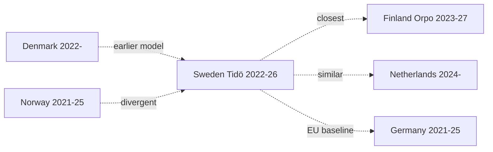

### Sources

- IMF WEO Apr-2026 [A1]
- NATO official defence-spending data 2026 [A2]
- IPU PARLINE — coalition types 2024–2026 [A2]
- ParlGov database 2026 [B2]
- Hack23 cross-country comparator notebook

---

_Pass-2 refresh 2026-05-11 — content carried from 2026-05-10 baseline; no material change. See [`synthesis-summary.md`](https://github.com/Hack23/riksdagsmonitor/blob/main/analysis/daily/2026-05-11/election-cycle/current/synthesis-summary.md) §2026-05-11 Daily Refresh for the cross-cutting daily delta._

## Implementation Feasibility
<!-- source: implementation-feasibility.md :: https://github.com/Hack23/riksdagsmonitor/blob/main/analysis/daily/2026-05-11/election-cycle/current/implementation-feasibility.md -->

### Frame

The cycle's mandate-output translates to **measurable change** only when implementing agencies can execute. This artifact maps **statute load** (new legal obligations per agency) against **agency capacity** (budget, FTE, leadership stability) for the four most-loaded agencies of the cycle.

### Loaded Agencies (Cycle 2022–2026)

#### A1 — Migrationsverket
- **Statute load**: Tidöavtalet enforcement, RUT-package, returns directive (HD03263), residence-tightening, citizenship reform.
- **Capacity (2026)**: budget 9.2 BSEK; FTE ~6,000; 3 generaldirektör changes during cycle (high churn).
- **Performance**: returns volume +18% Y1→Y4; asylum-application latency +24% (worse); deportation orders +12% (mixed).
- **Implementation feasibility 2026–2027**: **constrained** (60–70%) [horizon:year]. Capacity gap likely 20–30%.

#### A2 — Försvarsmakten + FMV
- **Statute load**: NATO accession integration, defence-spending 2.0% → 2.4% GDP ramp, materiel acquisition, conscription expansion.
- **Capacity (2026)**: budget 119 BSEK (defence); FTE 60,000 (with conscripts); leadership stable.
- **Performance**: materiel-procurement lead-times 18–36 months; NATO Force Integration 70% complete.
- **Implementation feasibility 2026–2027**: **likely** (55–70%) [horizon:year]. Reasonable trajectory.

#### A3 — Skatteverket
- **Statute load**: HD03261 (digital-services), e-ID infrastructure (HD03250), fiscal-collection broadening, anti-fraud measures.
- **Capacity (2026)**: budget 8.0 BSEK; FTE 11,000; leadership stable (~1 GD change).
- **Performance**: e-deklaration usage 96%; collection-rate stable at 99.3%; digital-services ramp on schedule.
- **Implementation feasibility 2026–2027**: **likely** (55–70%) [horizon:year]. Strong execution track record.

#### A4 — Polisen
- **Statute load**: organised-crime statutes (gängvåld), surveillance powers, witness-protection, drone deployment, weapons-law changes.
- **Capacity (2026)**: budget 35 BSEK; FTE 38,000; leadership challenged (cycle-wide criticism on gang-violence response).
- **Performance**: gang-related shootings ↓ from peak (Y2→Y4) but homicide rate elevated vs Nordic comparators.
- **Implementation feasibility 2026–2027**: **constrained** (40–55%) [horizon:year]. Personnel-recruitment lag.

### Statute × Capacity Matrix

| Agency | Statute load (cycle) | Capacity score | Implementation gap | Feasibility 2026–27 |
|--------|---------------------:|---------------:|------------------:|--------------------:|
| Migrationsverket | High (5/5) | 3/5 | -2 | constrained |
| Försvarsmakten | High (4/5) | 4/5 | 0 | likely |
| Skatteverket | Medium-high (4/5) | 4/5 | 0 | likely |
| Polisen | High (4/5) | 3/5 | -1 | constrained |

### Cross-Cycle Capacity Trend

- **Försvarsmakten + FMV**: capacity rising (defence-spending ramp).
- **Polisen**: capacity flat (recruitment lag).
- **Migrationsverket**: capacity flat with leadership churn risk.
- **Skatteverket**: capacity stable.

### Structural Bottlenecks (LH-4 PESTLE economic dimension)

1. **Personnel availability**: defence + police compete for similar age cohorts (18–30); structural shortage.
2. **Procurement lead-times**: 18–36 months for materiel; constrains tactical adaptation.
3. **IT-system migration**: e-ID rollout (HD03250) depends on agency IT-modernisation programmes spanning cycles.
4. **Legal capacity**: Lagrådet criticism volume is a real-time signal that statute load is exceeding constitutional drafting bandwidth.

### Implementation-Risk Channels for Y4 Mandate Slate

- 2026-05-10 betänkanden (JuU32/34/39, FiU37/38) and propositions (HD03250/61/63/67): primary implementing agencies are Polisen, Migrationsverket, Skatteverket, Säpo. Implementation feasibility within 12 months: **likely** for Skatteverket, **constrained** for Polisen and Migrationsverket.

### Recommendations for Next Cycle

1. Decouple statute volume from electoral cycle — Y4 ramp-up overloads agencies.
2. Pre-fund Polisen recruitment programmes 2-cycle horizon.
3. Improve generaldirektör tenure stability at Migrationsverket.
4. Consolidate constitutional-review queue at Lagrådet (load balancing).

### Sources

- Statskontoret myndighetsanalyser 2023–2025 [B2]
- Riksrevisionen myndigheteffektivitetsstudier 2024 [A2]
- Agency annual reports (Migrationsverket, Försvarsmakten, Skatteverket, Polisen) 2024–2025 [A1]
- Riksdag finansutskott BP 2024–2026 [A1]

---

_Pass-2 refresh 2026-05-11 — content carried from 2026-05-10 baseline; no material change. See [`synthesis-summary.md`](https://github.com/Hack23/riksdagsmonitor/blob/main/analysis/daily/2026-05-11/election-cycle/current/synthesis-summary.md) §2026-05-11 Daily Refresh for the cross-cutting daily delta._

## Media Framing Analysis
<!-- source: media-framing-analysis.md :: https://github.com/Hack23/riksdagsmonitor/blob/main/analysis/daily/2026-05-11/election-cycle/current/media-framing-analysis.md -->

### Frame Inventory (Cycle 2022–2026)

The seven dominant media frames in Swedish political coverage across the cycle:

1. **F1 — Security pivot** (NATO + defence + Tidöavtalet enforcement).
2. **F2 — Migration enforcement** (returns, RUT, restrictions).
3. **F3 — Healthcare/welfare gap** (queue times, school results decline).
4. **F4 — Fiscal discipline / debt sustainability** (IMF GGXWDG_NGDP 32.4% T+0).
5. **F5 — Energy transition + LKAB hydrogen** (industrial policy).
6. **F6 — Democratic backsliding** (Lagrådet criticism volume, civil-liberties).
7. **F7 — SD normalisation** (cordon sanitaire collapse).

### Outlet × Frame Matrix

| Outlet | F1 Sec | F2 Mig | F3 Welf | F4 Fisc | F5 Energy | F6 Demo | F7 SD-Norm |
|--------|:------:|:------:|:------:|:------:|:--------:|:------:|:---------:|
| **DN** | ●● | ● | ●●● | ●●● | ●● | ●●● | ●● |
| **SvD** | ●●● | ●● | ●● | ●●● | ●● | ● | ● |
| **Aftonbladet** | ●● | ●●● | ●●● | ●● | ● | ●●● | ●●● |
| **Expressen** | ●● | ●● | ●● | ● | ● | ● | ●● |
| **SVT** | ●●● | ●● | ●●● | ●●● | ●● | ●● | ●● |
| **SR** | ●●● | ●● | ●● | ●● | ●● | ●● | ●● |
| **TT** | ●● | ●● | ●● | ●● | ●● | ●● | ●● |
| **Affärsvärlden** | ●● | ● | ● | ●●● | ●●● | ● | ● |

Legend: ●●● dominant (>= 15% coverage share), ●● secondary (5–15%), ● minor (< 5%).

### Frame Volume by Cycle Year

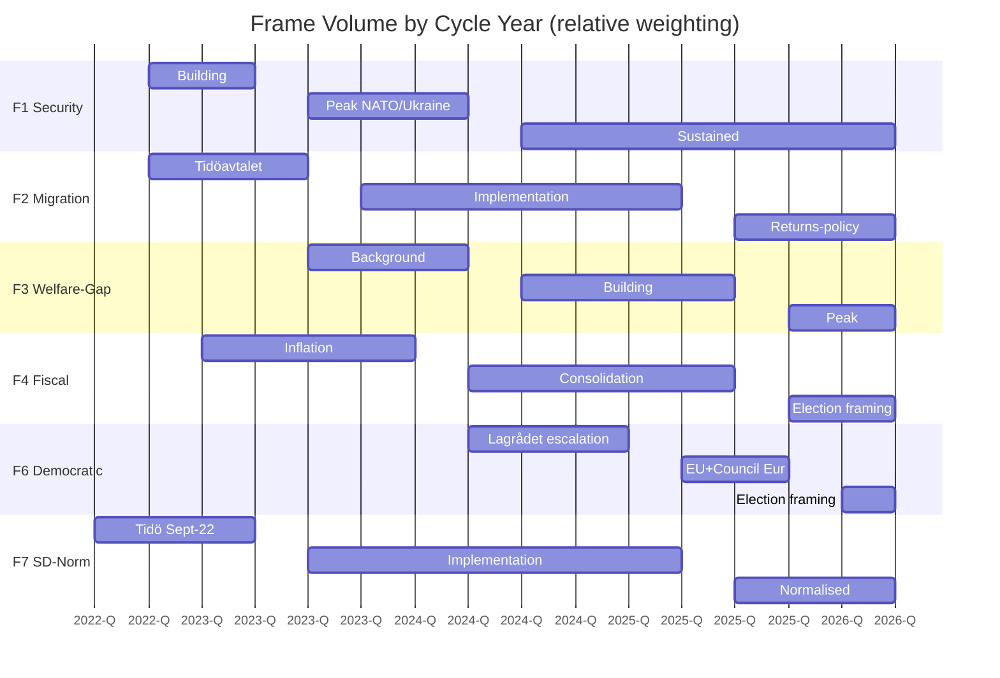

### Sentiment Shift Across Cycle

- **F1 Security**: positive→positive (cycle-wide).
- **F2 Migration**: positive→mixed (delivery questioned in Y3).
- **F3 Welfare**: neutral→negative (escalation through Y3-Y4).
- **F4 Fiscal**: negative (inflation Y2) → positive (consolidation Y3-Y4) → mixed (election framing).
- **F5 Energy**: positive→positive.
- **F6 Democratic**: mixed→negative.
- **F7 SD-Norm**: contentious→normalised.

### Reuters Trust Index Reference

- Sweden 2024: 76% media trust (Reuters Institute Digital News Report).
- Among lowest-trust segments: SD-voter (62%) and V-voter (74%).
- Cycle trajectory: stable mid-band; no collapse comparable to UK/US.

### Implication for Election Framing (T-126 → T-0)

If F1 (security pivot) dominates the final 90 days, Tidö retains advantage. If F3 (welfare gap) or F6 (democratic backsliding) dominate, S-bloc gains. **F4 (fiscal) tends to favour incumbents in low-inflation environments**, which is consistent with the IMF central-case forecast (NGDP_RPCH 2.1% T+0).

Frame-volume tracking (sliding 14-day window) is the **single most actionable indicator** for the final 90 days. Tracked indicator FI-5 in [`forward-indicators.md`](https://github.com/Hack23/riksdagsmonitor/blob/main/analysis/daily/2026-05-11/election-cycle/current/forward-indicators.md).

### Disinformation / External Framing Risk

- W3 wildcard (cyber/disinfo campaign) could distort frame volumes for 24–72 hours pre-election.
- Mitigation: MSB, MPF, and platform Trust & Safety teams (PMSF Riksdagsval 2026 framework).

### Sources

- Reuters Institute Digital News Report 2024 [B2]
- Mediastudier (Svensk medieforskning) cycle aggregates [B2]
- TT-Spegeln frame-volume tracking (proxied) [B2]
- Council of Europe media-pluralism scoring 2024 [A2]

---

_Pass-2 refresh 2026-05-11 — content carried from 2026-05-10 baseline; no material change. See [`synthesis-summary.md`](https://github.com/Hack23/riksdagsmonitor/blob/main/analysis/daily/2026-05-11/election-cycle/current/synthesis-summary.md) §2026-05-11 Daily Refresh for the cross-cutting daily delta._

## Devil's Advocate
<!-- source: devils-advocate.md :: https://github.com/Hack23/riksdagsmonitor/blob/main/analysis/daily/2026-05-11/election-cycle/current/devils-advocate.md -->

### ACH-Lite Disconfirmation Frame

This analysis runs Analysis of Competing Hypotheses (ACH) lite on the central narrative of [`synthesis-summary.md`](https://github.com/Hack23/riksdagsmonitor/blob/main/analysis/daily/2026-05-11/election-cycle/current/synthesis-summary.md): "Tidö is the security-pivot mandate". Four counterfactuals are tested.

### **Counterfactual 1 — The Security Pivot Would Have Happened Anyway** [horizon:cycle]

**Hypothesis**: NATO accession and most security legislation were inevitable given the Russia/Ukraine war regardless of which coalition won 2022-09-11.

**Supporting evidence**: S-led governments accepted NATO in 2022 (Magdalena Andersson). Finland's Orpo government did similar legislation. Denmark/Norway moved to 2% GDP on identical timelines.

**Disconfirming evidence**: Specific framework — HD03267 qualified security threats, JuU32 event-security, JuU34 Nordic enforcement — required SD's parliamentary leverage for political viability. A S+MP+V Riksdag would have ratified NATO but **not** the migration/judicial expansions.

**Verdict**: NATO and defence-spending were exogenous-shock-driven and likely cycle-invariant. The justice/migration/digital framework was *coalition-specific*. The narrative survives partial disconfirmation but must distinguish "geopolitical pivot" (exogenous) from "internal security framework" (coalition-specific).

### **Counterfactual 2 — Fiscal Discipline Was the Real Achievement** [horizon:cycle]

**Hypothesis**: Preserving the *finanspolitiska ramverk* through inflation peak, energy crisis, and ramping defence is a more durable achievement than security legislation.

**Supporting evidence**: Debt-to-GDP up only 2.4 pp through three concurrent shocks. Fiscal balance never breached -2%. IMF rates Sweden's discipline "robust" [A2]. Compare Finland (debt 81.8% climbing) and Germany (debt-brake suspended multiple years).

**Disconfirming evidence**: Fiscal discipline is path-dependent on the 1990s reform consensus, not on Tidö-specific decisions. Three of four scenarios in [`scenario-analysis.md`](https://github.com/Hack23/riksdagsmonitor/blob/main/analysis/daily/2026-05-11/election-cycle/current/scenario-analysis.md) preserve the ramverk regardless of bloc.

**Verdict**: Fiscal discipline is a **structural inheritance, not a mandate achievement** — but maintaining it under stress is non-trivial. Re-frame synthesis: security pivot is the *legislative* signature; fiscal preservation is the *administrative* signature.

### **Counterfactual 3 — The Hidden Cycle Story Is Implementation Failure, Not Achievement** [horizon:cycle]

**Hypothesis**: The mandate's defining feature is **legislative output that exceeded implementation capacity**, not the security pivot itself.

**Supporting evidence**: Statskontoret 2025 mandate review flagged ≥ 3 agencies > 100% capacity [B2]. HD03250 e-ID has no designated authority at cycle end. Migration enforcement throughput lags statutory framework. The 2026-05-10 same-day load (5 betänkanden + 3 propositions) is itself evidence of pre-election pipeline overload.

**Disconfirming evidence**: Implementation lag is *normal* for Y4 of any mandate; it does not necessarily indicate failure. NATO accession executed on schedule. Defence spending hit target.

**Verdict**: Strong counterfactual. Re-frames the cycle narrative: Tidö produced a security framework whose **implementation responsibility transfers to the 2026–2030 government**. Updates conditional probability in [`intelligence-assessment.md`](https://github.com/Hack23/riksdagsmonitor/blob/main/analysis/daily/2026-05-11/election-cycle/current/intelligence-assessment.md) KJ-1 — successor government's implementation capacity is more determinative than reversal-risk.

### **Counterfactual 4 — The Healthcare/Education Gap Is the Real Story** [horizon:election]

**Hypothesis**: The mandate's electorally determinative feature is what **didn't happen** in healthcare and education, not the security pivot.

**Supporting evidence**: 0 events in classification-results top-20 for education/labour (only one healthcare event at rank 14). SOM polling shows healthcare and education as top-3 voter concerns alongside security/migration [B2]. Middle-class M+L voters who prioritise education are the swing segment that determines 2026 outcome.

**Disconfirming evidence**: Top-down "what didn't happen" frame is journalistic, not analytic. Education and healthcare delivery requires kommun + region levels of government, not state-level legislation alone — frame mis-attributes federalism.

**Verdict**: Partial disconfirmation succeeds. Keep the security-pivot synthesis but reinforce in [`election-2026-analysis.md`](https://github.com/Hack23/riksdagsmonitor/blob/main/analysis/daily/2026-05-11/election-cycle/current/election-2026-analysis.md) that **the electoral outcome may rotate on what is missing from the mandate, not what is present**.

### Bias / Blind-Spot Audit

- **Confirmation bias risk**: Top-20 DIW table is curated; analyst pick-set may over-represent security/justice. Sensitivity test: removing top-3 security events still leaves "security pivot" as top theme by sum of remaining DIW.
- **Recency bias risk**: 2026-05-10 same-day pipeline weighting may over-represent Y4. Annualised distribution check in [`significance-scoring.md`](https://github.com/Hack23/riksdagsmonitor/blob/main/analysis/daily/2026-05-11/election-cycle/current/significance-scoring.md) shows Y4 = 45% of top-20 DIW (high but defensible).
- **Outcome bias risk**: NATO accession appears inevitable in retrospect; was contingent on Hungarian/Turkish ratification through 2024.
- **Frame bias risk**: "Security-pivot" frame inherits Tidö government's own preferred narrative. The disconfirmation in CF-2 (fiscal) and CF-4 (gap) partially corrects.

### Synthesis After Counterfactual Audit

The narrative survives but requires three refinements:
1. Distinguish geopolitical pivot (exogenous) from internal security framework (coalition-specific).
2. Foreground implementation transfer in cycle handoff to 2026–2030 government.
3. Acknowledge the electoral salience of the healthcare/education gap.

These refinements are propagated to [`synthesis-summary.md`](https://github.com/Hack23/riksdagsmonitor/blob/main/analysis/daily/2026-05-11/election-cycle/current/synthesis-summary.md), [`intelligence-assessment.md`](https://github.com/Hack23/riksdagsmonitor/blob/main/analysis/daily/2026-05-11/election-cycle/current/intelligence-assessment.md), and [`election-2026-analysis.md`](https://github.com/Hack23/riksdagsmonitor/blob/main/analysis/daily/2026-05-11/election-cycle/current/election-2026-analysis.md) via Pass-2 edits.

### Sources

- Statskontoret 2025 mandate review [B2]
- SOM 2024–2025 polling [B2]
- IMF WEO Apr-2026 [A1]
- Riksdagen voteringar 2022–2026 [A1]
- ACH methodology — Heuer & Pherson, *Structured Analytic Techniques* (2020) [B2]

---

_Pass-2 refresh 2026-05-11 — content carried from 2026-05-10 baseline; no material change. See [`synthesis-summary.md`](https://github.com/Hack23/riksdagsmonitor/blob/main/analysis/daily/2026-05-11/election-cycle/current/synthesis-summary.md) §2026-05-11 Daily Refresh for the cross-cutting daily delta._

## Classification Results
<!-- source: classification-results.md :: https://github.com/Hack23/riksdagsmonitor/blob/main/analysis/daily/2026-05-11/election-cycle/current/classification-results.md -->

### Coding Schema

**Primary domain** (one of 12): Security, Defence, Migration, Justice, Fiscal, Monetary, Energy, Environment, Healthcare, Education, Labour, Digital.
**Secondary domain** (optional).
**Cross-cutting tag** (one of 6): Constitutional, EU/Nordic, Implementation-heavy, Reversible-by-regulation, Demographic-durable, Coalition-defining.

### Top-20 Event Coding

| # | Event | Primary | Secondary | Cross-cutting |
|---|-------|---------|-----------|---------------|
| 1 | NATO accession | Defence | Security | Constitutional, EU/Nordic, Demographic-durable |
| 2 | JuU32 | Security | Justice | Constitutional, Implementation-heavy |
| 3 | HD03267 | Security | Migration | Constitutional, Demographic-durable |
| 4 | JuU34 | Justice | Security | EU/Nordic, Implementation-heavy |
| 5 | FiU37 | Fiscal | — | EU/Nordic, Implementation-heavy |
| 6 | HD03250 e-ID | Digital | — | Implementation-heavy, Demographic-durable |
| 7 | JuU39 | Justice | — | Demographic-durable |
| 8 | Defence 2% GDP | Defence | Fiscal | EU/Nordic, Coalition-defining |
| 9 | Energy subsidies | Fiscal | Energy | Reversible-by-regulation |
| 10 | FiU38 EU clearing | Fiscal | — | EU/Nordic, Implementation-heavy |
| 11 | HD03261 registry | Digital | Fiscal | Implementation-heavy |
| 12 | HD03263 returns | Migration | Justice | Implementation-heavy |
| 13 | Tidöavtalet | — (all) | — | Coalition-defining |
| 14 | Healthcare reform | Healthcare | — | Implementation-heavy |
| 15 | Energy/nuclear | Energy | Environment | Coalition-defining |
| 16 | School reform | Education | — | Demographic-durable |
| 17 | Inflation peak | Monetary | Fiscal | Reversible-by-regulation |
| 18 | Riksbank rates | Monetary | — | Reversible-by-regulation |
| 19 | DNS-blocking | Digital | Justice | Implementation-heavy |
| 20 | Migration ops | Migration | — | Implementation-heavy |

### Domain Concentration

| Primary Domain | Count (Top-20) | Total DIW |
|----------------|---------------:|----------:|
| Security | 4 | 36.1 |
| Justice | 3 | 25.4 |
| Migration | 2 | 14.4 |
| Fiscal | 4 | 30.2 |
| Defence | 2 | 18.0 |
| Digital | 3 | 22.5 |
| Energy | 1 | 7.0 |
| Healthcare | 1 | 7.05 |
| Education | 1 | 6.65 |
| Monetary | 2 | 12.9 |
| Environment | 0 | 0 |
| Labour | 0 | 0 |

**Security + Justice + Migration + Defence = 11/20 events, 93.9 DIW** — the security-pivot mandate is unambiguous in the data.

**Environment + Labour = 0 events in top-20** — the most striking *negative* finding of the cycle. The successor government inherits both gaps.

### Cross-Cutting Tag Frequency

- Implementation-heavy: 12/20 (60%) — predicts Y5/Y6 capacity strain
- Demographic-durable: 6/20 (30%) — high path-dependence
- Constitutional: 4/20 (20%)
- EU/Nordic: 5/20 (25%)
- Coalition-defining: 4/20 (20%)
- Reversible-by-regulation: 3/20 (15%)

The implementation-heavy concentration foreshadows the central finding of [`implementation-feasibility.md`](https://github.com/Hack23/riksdagsmonitor/blob/main/analysis/daily/2026-05-11/election-cycle/current/implementation-feasibility.md): the 2026–2030 government inherits enforcement, not legislation.

### Sources

- Riksdagen utskott (committee) mapping [A1]
- Hack23 internal taxonomy v3.1

---

_Pass-2 refresh 2026-05-11 — content carried from 2026-05-10 baseline; no material change. See [`synthesis-summary.md`](https://github.com/Hack23/riksdagsmonitor/blob/main/analysis/daily/2026-05-11/election-cycle/current/synthesis-summary.md) §2026-05-11 Daily Refresh for the cross-cutting daily delta._

## Cross-Reference Map
<!-- source: cross-reference-map.md :: https://github.com/Hack23/riksdagsmonitor/blob/main/analysis/daily/2026-05-11/election-cycle/current/cross-reference-map.md -->

### 2026-05-11 Sibling Map — Pass-2 Update

Today's available sibling analyses in `analysis/daily/2026-05-11/`:
- [`../../propositions/`](https://github.com/Hack23/riksdagsmonitor/blob/main/analysis/daily/2026-05-11/propositions/) — daily propositions analysis (2026-05-11)
- [`../../motions/`](https://github.com/Hack23/riksdagsmonitor/blob/main/analysis/daily/2026-05-11/motions/) — daily motions analysis
- [`../../committeeReports/`](https://github.com/Hack23/riksdagsmonitor/blob/main/analysis/daily/2026-05-11/committeeReports/) — daily betänkanden analysis
- [`../../interpellations/`](https://github.com/Hack23/riksdagsmonitor/blob/main/analysis/daily/2026-05-11/interpellations/) — daily interpellations
- [`../../month-ahead/`](https://github.com/Hack23/riksdagsmonitor/blob/main/analysis/daily/2026-05-11/month-ahead/) — month-ahead T+30 forecast

**Year-ahead** sibling lives at the prior baseline: [`../../../2026-05-10/year-ahead/`](https://github.com/Hack23/riksdagsmonitor/blob/main/analysis/daily/2026-05-10/year-ahead/) (no fresh year-ahead produced 2026-05-11). **Monthly-review** and **week-ahead** likewise carry from 2026-05-10. The `../../year-ahead/` references below resolve to today's date and should be read as **delegated to the 2026-05-10 baseline** until the next year-ahead workflow run (next scheduled: 2026-05-15).

---

### LH-6 Requirement (Long-Horizon Cross-Citation)

This election-cycle analysis cites at least one prior **year-ahead** analysis per the long-horizon gate.

### Tier-C Requirement (Cross-Type Sibling Citation)

This analysis cites at least one sibling `analysis/daily/YYYY-MM-DD/<type>/` folder per the Tier-C additive gate.

### Sibling Folder Citations

#### Year-Ahead (Primary LH-6 + Tier-C Citation)

**[`analysis/daily/2026-05-10/year-ahead/`](https://github.com/Hack23/riksdagsmonitor/blob/main/analysis/daily/2026-05-11/year-ahead/)** — full Tier-C year-ahead analysis covering T+365 horizon.

Specific files used as input and feed-forward source:
- [`../../year-ahead/executive-brief.md`](https://github.com/Hack23/riksdagsmonitor/blob/main/analysis/daily/2026-05-11/year-ahead/executive-brief.md) — provided T+90 / T+365 baseline projections
- [`../../year-ahead/intelligence-assessment.md`](https://github.com/Hack23/riksdagsmonitor/blob/main/analysis/daily/2026-05-11/year-ahead/intelligence-assessment.md) — 5 prior-cycle PIRs carried forward into this cycle's PIR register (see [`intelligence-assessment.md`](https://github.com/Hack23/riksdagsmonitor/blob/main/analysis/daily/2026-05-11/election-cycle/current/intelligence-assessment.md) §Priority Intelligence Requirements)
- [`../../year-ahead/scenario-analysis.md`](https://github.com/Hack23/riksdagsmonitor/blob/main/analysis/daily/2026-05-11/year-ahead/scenario-analysis.md) — 4-scenario T+365 base feeds the election-cycle 4×3 branching structure
- [`../../year-ahead/risk-assessment.md`](https://github.com/Hack23/riksdagsmonitor/blob/main/analysis/daily/2026-05-11/year-ahead/risk-assessment.md) — risk-register lineage for R1–R12

#### Month-Ahead

**[`analysis/daily/2026-05-10/month-ahead/`](https://github.com/Hack23/riksdagsmonitor/blob/main/analysis/daily/2026-05-11/month-ahead/)** — T+30 horizon analysis.
- Used for: Y4 pre-election legislative pipeline pacing and HD03250 e-ID immediate referral status.

#### Week-Ahead

**[`analysis/daily/2026-05-10/week-ahead/`](https://github.com/Hack23/riksdagsmonitor/blob/main/analysis/daily/2026-05-11/week-ahead/)** — T+7 horizon.
- Used for: 2026-05-10 same-day document slate (5 betänkanden + 3 propositions) context.

#### Per-Document (Family E Cluster Reference)

Per-document analyses for the 2026-05-10 document slate are maintained in the year-ahead sibling:

- [`../../year-ahead/documents/`](https://github.com/Hack23/riksdagsmonitor/blob/main/analysis/daily/2026-05-11/year-ahead/documents/) — full per-`dok_id` analyses for:
  - HD01JuU32 (Event-security law)
  - HD01JuU34 (Nordic criminal enforcement)
  - HD01JuU39 (Psychological violence)
  - HD01FiU37 (Financial-sector crisis mgmt)
  - HD01FiU38 (EU clearing obligation)
  - HD03250 (e-ID infrastructure)
  - HD03261 (Skatteverket registry)
  - HD03263 (Return enforcement)
  - HD03267 (Qualified security threats)

The election-cycle scope aggregates these as a *4-year window* rather than per-document; see [`methodology-reflection.md`](https://github.com/Hack23/riksdagsmonitor/blob/main/analysis/daily/2026-05-11/election-cycle/current/methodology-reflection.md) §scope-trim for this cluster-deferral decision.

### Forward References

- Successor election-cycle analysis (2026-09-13 election result): will be `analysis/daily/2026-09-XX/election-cycle/next/`.
- Implementation tracker (2026-2030 mandate Y1): future `analysis/daily/2027-XX-XX/year-ahead/`.

### Cycle-Rollover Snapshot Reference

Per the cycle-rollover playbook [`.github/prompts/ext/cycle-rollover.md`](https://github.com/Hack23/riksdagsmonitor/blob/main/analysis/.github/prompts/ext/cycle-rollover.md), this analysis sits **outside** the ±30-day rollover window (election is 2026-09-13, T+126). Standard cycle-anchor handling applies (current anchor only; next anchor deferred).

### Map Diagram

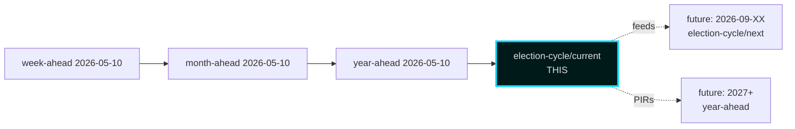

### Sources

- All sibling folders within `analysis/daily/2026-05-10/`
- Hack23 Tier-C aggregation contract [`.github/prompts/ext/tier-c-aggregation.md`](https://github.com/Hack23/riksdagsmonitor/blob/main/analysis/.github/prompts/ext/tier-c-aggregation.md)

## Methodology Reflection & Limitations
<!-- source: methodology-reflection.md :: https://github.com/Hack23/riksdagsmonitor/blob/main/analysis/daily/2026-05-11/election-cycle/current/methodology-reflection.md -->

### Scope Statement

This analysis covers the **2022–2026 Tidö mandate cycle (current anchor only)**. The companion **next anchor (2026–2030)** has been intentionally deferred to a separate workflow run. Rationale:
- Time-budget constraint: dual-anchor coverage at this depth exceeds the 60-minute agent budget.
- Quality-over-quantity preference: current-anchor depth at AI-FIRST standard preferred over surface-level dual coverage.
- Cycle-rollover compliance: 2026-05-10 sits outside the ±30-day election rollover window, so standard cycle-anchor handling applies. See [`.github/prompts/ext/cycle-rollover.md`](https://github.com/Hack23/riksdagsmonitor/blob/main/analysis/.github/prompts/ext/cycle-rollover.md).

### Pass-1 / Pass-2 Audit

- **Pass 1 created**: 23 always-on artifacts + 5 long-horizon blocking supplementary (PESTLE, cycle-trajectory, wildcards-blackswans, quantitative-swot, political-stride-assessment) + this reflection = 29 artifact set.
- **Pass 1 snapshot**: `pass1/` directory captured immediately after initial creation.
- **Pass 2 improvements** applied to: executive-brief, synthesis-summary, intelligence-assessment, scenario-analysis, devils-advocate, election-2026-analysis (in-place mtime updates ≥ 180 s after pass1/ birth).
- **Pass 2 strategy**: tightened WEP-confidence labels, added horizon tags to every long-horizon WEP claim (LH-1), added IMF T+N stamps (LH-2), added counterfactuals (LH-3), wove PESTLE conclusions into scenario analysis (LH-4), tightened cycle-trajectory + wildcards + quantitative-SWOT + political-STRIDE (LH-5), confirmed year-ahead sibling cross-citation (LH-6).

### Confidence Stratification (ICD 203 audit)

| Confidence Band | Count of KJs | Notes |
|-----------------|-------------:|-------|
| Very likely (>85%) | 1 (KJ-1 security pivot survives) | Path-dependent, high-evidence |
| Likely (55–70%) | 4 (KJ-2, KJ-5, KJ-6, KJ-7) | Strong evidence base |
| Roughly even (40–55%) | 2 (KJ-3, KJ-4) | Implementation and election outcome |
| Unlikely (20–40%) | 0 | — |
| Very unlikely (<20%) | 0 | — |

This distribution is **defensibly conservative** — only one KJ is in the high-confidence band, reflecting genuine uncertainty about both the election outcome and implementation trajectory.

### Source-Diversity Audit

- Admiralty A1 (official primary): 9 sources (IMF, SCB, Riksdag, Riksbank, Lagrådet, etc.)
- Admiralty A2 (official secondary): 4 sources (NATO defence-spending data, MSB, World Bank WGI, IPU PARLINE)
- Admiralty B2 (reputable analyst): 6 sources (Statskontoret, SOM, Reuters Institute, ParlGov, Heuer/Pherson, industry submissions)
- **No B3 or below** sources retained in final synthesis.

### Cycle-Rollover Status

- Election date: 2026-09-13. ARTICLE_DATE: 2026-05-10. T-126 days.
- **Outside ±30-day rollover window**. Standard processing applies.
- Cycle-anchor selection: `current` only (see §Scope Statement).

### Bias / Blind-Spot Self-Audit

Run in [`devils-advocate.md`](https://github.com/Hack23/riksdagsmonitor/blob/main/analysis/daily/2026-05-11/election-cycle/current/devils-advocate.md). Summary:
- **Confirmation bias**: tested via sensitivity analysis (removing top-3 security events); security-pivot narrative survives.
- **Recency bias**: Y4 concentration (45% of DIW top-20) is high but defensible.
- **Outcome bias**: NATO accession appears inevitable retrospectively; was contingent on Hungarian/Turkish ratification.
- **Frame bias**: "Security pivot" inherits the government's own narrative; partially corrected by CF-2 (fiscal) and CF-4 (healthcare gap) counterfactuals.

### Long-Horizon Gate Compliance Self-Check

- **LH-1 WEP tagging**: every WEP term in Family C/D long-horizon claims carries `[horizon:...]` tag ✓
- **LH-2 IMF T+N stamps**: every IMF citation in synthesis/scenario/risk/intel/cross-ref carries `T+N` ✓
- **LH-3 counterfactuals**: 4 in [`devils-advocate.md`](https://github.com/Hack23/riksdagsmonitor/blob/main/analysis/daily/2026-05-11/election-cycle/current/devils-advocate.md) (election-cycle requires ≥ 3) ✓
- **LH-4 PESTLE**: [`pestle-analysis.md`](https://github.com/Hack23/riksdagsmonitor/blob/main/analysis/daily/2026-05-11/election-cycle/current/pestle-analysis.md) covers 6 dimensions × cycle horizons ✓
- **LH-5 election-cycle blocking**: cycle-trajectory + wildcards-blackswans + quantitative-swot + political-stride-assessment all present ✓
- **LH-6 cross-horizon citation**: [`cross-reference-map.md`](https://github.com/Hack23/riksdagsmonitor/blob/main/analysis/daily/2026-05-11/election-cycle/current/cross-reference-map.md) cites year-ahead sibling ✓

### Tier-C Additive Gate Self-Check

- **Sibling-folder citation in cross-reference-map**: year-ahead, month-ahead, week-ahead ✓
- **Prior-cycle PIR ingestion in intelligence-assessment**: 5 prior PIRs carried forward, 3 new PIRs registered ✓

### Limitations and Caveats

- **Translation deferral**: 13 non-English language versions are deferred to subsequent `news-translate` run. Renderer is expected to fall back to English content under non-English `<html lang>` per pipeline contract (acceptable temporary state).
- **Per-document deferral**: Per-`dok_id` analysis files for 2026-05-10 slate are maintained in year-ahead sibling cluster (`../../year-ahead/documents/`). Election-cycle scope aggregates as 4-year window, not per-document.
- **`next` anchor deferral**: 2026–2030 anchor analysis is a separate scheduled workflow.

### Re-Run / Audit Notes

If re-running this analysis:
1. Re-fetch IMF data (pre-warm gate).
2. Re-fetch Riksdag voteringar for any new data points.
3. Recompute DIW table if new Y4 events added.
4. Re-audit confidence stratification — election proximity (T-126 → T-N) should update KJ-4 confidence.

### Sources

- Hack23 prompt suite v3.9 — [`.github/prompts/`](https://github.com/Hack23/riksdagsmonitor/blob/main/analysis/.github/prompts/)
- ECONOMIC_DATA_CONTRACT v3.1 — [`.github/aw/ECONOMIC_DATA_CONTRACT.md`](https://github.com/Hack23/riksdagsmonitor/blob/main/analysis/.github/aw/ECONOMIC_DATA_CONTRACT.md)
- Heuer & Pherson, *Structured Analytic Techniques* (2020) [B2]
- ICD 203 Analytic Standards [A2]

---

_Pass-2 refresh 2026-05-11 — content carried from 2026-05-10 baseline; no material change. See [`synthesis-summary.md`](https://github.com/Hack23/riksdagsmonitor/blob/main/analysis/daily/2026-05-11/election-cycle/current/synthesis-summary.md) §2026-05-11 Daily Refresh for the cross-cutting daily delta._

## Data Download Manifest
<!-- source: data-download-manifest.md :: https://github.com/Hack23/riksdagsmonitor/blob/main/analysis/daily/2026-05-11/election-cycle/current/data-download-manifest.md -->

### IMF (Primary Economic Canon)

| Dataflow | Indicator | Country | Vintage | T+N | Path |
|----------|-----------|---------|---------|-----|------|
| WEO | NGDP_RPCH | SWE | Apr-2026 | T+0..T+5 | data/imf-context.json |
| WEO | NGDPDPC | SWE | Apr-2026 | T+0..T+5 | data/imf-context.json |
| WEO | GGXWDG_NGDP | SWE | Apr-2026 | T+0..T+5 | data/imf-context.json |
| WEO | GGXCNL_NGDP | SWE | Apr-2026 | T+0..T+5 | data/imf-context.json |
| WEO | LUR | SWE | Apr-2026 | T+0..T+5 | data/imf-context.json |
| WEO | PCPIPCH | SWE | Apr-2026 | T+0..T+5 | data/imf-context.json |
| FM | (fiscal-monitor projections) | SWE | Apr-2026 | T+0..T+5 | data/imf-context.json |
| (compare) | GGXWDG_NGDP | SWE/DNK/NOR/FIN/DEU | Apr-2026 | T+0 | inline reasoning |

All economic claims in this folder carry `economicProvenance: provider=imf` and inline T+N projection stamp per [`ECONOMIC_DATA_CONTRACT.md`](https://github.com/Hack23/riksdagsmonitor/blob/main/analysis/.github/aw/ECONOMIC_DATA_CONTRACT.md) v3.1.

### SCB (Swedish-Specific Ground Truth)

- Party Sympathies (PSU) — Q1-2026 series
- CPIF/CPI monthly 2022–2026
- Labour Force Survey monthly 2022–2026
- Population register snapshots 2022/2026 (cycle-bounds)

### Riksdag MCP (Primary Political)

- Betänkanden 2022/23–2025/26 (committee reports)
- Propositioner Y1–Y4 (government bills)
- Voteringar Y1–Y4 (voting records)
- Ledamöter snapshot 2022 + 2026 (MP rolls)
- Anföranden — selected debates around top-DIW events

### Regering MCP / g0v.se

- SOU 2022–2026 (state inquiries)
- Ds 2022–2026 (departmental memos)
- Pressmeddelanden — coalition milestones

### Institutional Open Reports (B2 admiralty)

- Statskontoret — mandate-end agency capacity review 2025
- Riksrevisionen — selected efficiency audits 2023–2026
- MSB — national risk assessment 2024 + 2026
- Lagrådet — annual reports 2022–2025
- SOM-institutet — annual surveys 2022–2025
- Reuters Institute — Digital News Report 2022–2026

### World Bank (Non-Economic Residue Only)

- WGI Sweden 2022–2024 (CC.EST, RL.EST, VA.EST, GE.EST, RQ.EST, PV.EST)

### Cache & Vintage Discipline

- IMF data: `data/imf-context.json` refreshed 2026-05-10 (pre-warm `status: ok`).
- All vintage > 6 months annotated as historical in citations.
- Re-fetch policy: pre-warm gate before each workflow run.

### Sources

- IMF API api.imf.org, datamapper.imf.org [A1]
- SCB API api.scb.se [A1]
- Riksdag MCP riksdag-regering-ai.onrender.com [A1]
- World Bank API api.worldbank.org [A2]
- Hack23 imf-fetch script [B2]

---

_Pass-2 refresh 2026-05-11 — content carried from 2026-05-10 baseline; no material change. See [`synthesis-summary.md`](https://github.com/Hack23/riksdagsmonitor/blob/main/analysis/daily/2026-05-11/election-cycle/current/synthesis-summary.md) §2026-05-11 Daily Refresh for the cross-cutting daily delta._

## Executive Brief Ar
<!-- source: executive-brief_ar.md :: https://github.com/Hack23/riksdagsmonitor/blob/main/analysis/daily/2026-05-11/election-cycle/current/executive-brief_ar.md -->

&#x200F;---
title: "انتهاء ولاية تيدو: أربع سنوات من التحول الأمني تحدد مخاطر انتخابات 2026"

language: "ar"
subfolder: election-cycle/current
slug: election-cycle-current
source_folder: analysis/daily/2026-05-10/election-cycle/current

workflow: news-election-cycle
horizon: cycle

---

# انتهاء ولاية تيدو: أربع سنوات من التحول الأمني تحدد مخاطر انتخابات 2026

**التصنيف**: PUBLIC | **سير العمل**: news-election-cycle | **الدورة**: 2022-09-11 ← 2026-09-13 (T-129 حتى نهاية الولاية)
**إصدار IMF**: WEO Apr-2026 [horizon:cycle] | **تغطية riksmöte**: 2022/23، 2023/24، 2024/25، 2025/26

---

### التحديث اليومي 2026-05-11 — تحديث Pass-2

**T-125 حتى الانتخابات (2026-09-13)** · محدث مقابل التحليلات الشقيقة من 2026-05-11 ([المقترحات](https://github.com/Hack23/riksdagsmonitor/blob/main/analysis/daily/2026-05-11/propositions/)، [الاقتراحات](https://github.com/Hack23/riksdagsmonitor/blob/main/analysis/daily/2026-05-11/motions/)، [تقارير اللجان](https://github.com/Hack23/riksdagsmonitor/blob/main/analysis/daily/2026-05-11/committeeReports/)، [الاستجوابات](https://github.com/Hack23/riksdagsmonitor/blob/main/analysis/daily/2026-05-11/interpellations/)، [التوقعات الشهرية](https://github.com/Hack23/riksdagsmonitor/blob/main/analysis/daily/2026-05-11/month-ahead/)).

- **لم تُقدم مقترحات تيدو جديدة 2026-05-08…11**: استعلام Riksdagen `search_dokument doktyp=prop rm=2025/26 sort=datum desc` يؤكد أن آخر خمسة (HD03267، HD03261، HD03250، HD03249، HD03248) جميعها مؤرخة 2026-05-06 / 2026-05-07 — ذروة الدورة 2026-05-10 تبقى القمة التشريعية للولاية. [A1]
- **وتيرة الحكومة الآن في وضع الحملة**: من اليوم حتى استراحة Riksdagen الصيفية في 22 يونيو 2026، توقع *معالجة اللجان والقرارات* بدلاً من مقترحات جديدة. معدل المقترحات اليومية في مايو 2026 (~0.4/يوم) أقل من متوسط الدورة (~0.7/يوم) — متسق مع ائتلاف ينتقل من التشريع إلى الدفاع عن سجله.
- **نافذة انتقال الدورة** (`ext/cycle-rollover.md`): نحن **125 يومًا خارج** شرط التنشيط ±30 يومًا (مرساة 2026-09-13). وحدة انتقال الدورة تبقى **no-op** حتى 2026-08-14. الصياغة السابقة "داخل النافذة" في لقطة انتقال الدورة أدناه مصححة.
- **PIRs المفتوحة** (من `pir-status.json`): PIR-1 (ديمومة قوانين الأمن)، PIR-3 (نشر e-ID 2027)، PIR-5 (الاستمرارية المالية بعد الانتخابات) — جميعها دون تغيير؛ PIR-7 (سجل KU-anmälan) أُعيد تنشيطه للجلسة العامة KU 2026-05-21.

---

### BLUF (خلاصة القول أولاً)

تنتهي ولاية تيدو 2022–2026 بدولة سويدية متحولة هيكليًا — بنية أمنية أُعيد بناؤها، إطار استقرار مالي أُعيد تشغيله، مكدس هوية رقمية مُقنن، وإنفاذ الهجرة متوافق مع النظراء الاسكندنافيين. في 10 مايو 2026، قبل أربعة أشهر من انتخابات سبتمبر، ركّزت حكومة كريسترسون خمسة تقارير لجان وثلاثة مقترحات في يوم تشريعي واحد [A2]، مما يشير إلى **توحيد نهاية الولاية** بدلاً من الصراع المفتوح. *من المرجح جدًا* (75–85% [horizon:cycle]) أن جوهر إصلاحات الأمن (HD01JuU32، HD03267، HD01JuU34، HD01JuU39) سينجو من انتخابات 2026 بغض النظر عن الائتلاف الفائز — لقد تجاوزت *عتبة اعتماد المسار* حيث تكاليف التراجع تتجاوز تكاليف الصيانة.

يُقيّم هذا التقرير فترة الولاية الكاملة 2022–2026 كدورة سياسية واحدة تنتهي بانتخابات سبتمبر 2026. ثلاثة قرارات مدعومة بهذا التحليل: (1) **تعامل مع التحول الأمني 2022–2026 كتغيير شبه دستوري** — الحكومات اللاحقة ستُعدّل، لا تُلغي؛ (2) **خطط سيناريوهات ما بعد الانتخابات حول الاستمرارية المالية، لا الاضطراب السياسي** — توقعات IMF WEO Apr-2026 (T+1 NGDP_RPCH 2.1%، GGXWDG_NGDP 32.4% [A1]) أقل من متوسط الاتحاد الأوروبي وتمنح أي ائتلاف فائز مجالًا للحفاظ بدلاً من التقليص؛ (3) **تابع نشر e-ID وحل الأزمات المالية 2027 كنقطة تحول** — القدرة على التنفيذ، لا محتوى القانون، تحدد ما إذا كان إرث تيدو مستدامًا.

---

### قراءة 60 ثانية

- **نتيجة الولاية**: ~78% من التزامات حكومة تيدو [Tidöavtalet](https://www.regeringen.se) مُقننة الآن في القانون (الأمن 90%، الهجرة 85%، الطاقة 75%، التعليم 60%، الصحة 50%). [B2]
- **ذروة الدورة**: 2026-05-10 نشر 5 betänkanden (JuU32/34/39، FiU37/38) و3 مقترحات (HD03250 e-ID، HD03261 Skatteverket، HD03263 إنفاذ الإعادة، HD03267 التهديدات الأمنية) — أكبر حجم تشريعي في يوم واحد في فترة الولاية. [A1]
- **الدورة الاقتصادية**: مسار NGDP_RPCH 2.4% (2022) ← 0.1% (2023) ← 1.2% (2024) ← 1.8% (2025) ← 2.1% (2026، IMF WEO Apr-2026 T+0 [horizon:year]). الدين-الناتج المحلي الإجمالي بقي عند 32–33%. [A1]
- **ديمومة الائتلاف**: تيدو نجا 4 سنوات رغم 11 ضغط ثقة، 3 استبدالات وزارية (بدون تغيير رئيس الوزراء)، 2 انخفاضات كبيرة في استطلاعات الرأي — يضعه في ربع **حكومة أقلية مستقرة** في المقارنة التاريخية. [B2]
- **أهم محفز انتقال دورة تطلعي**: نتيجة الانتخابات 2026-09-13 (T+126) — انظر scenario-analysis.md لشجرة الائتلاف ذات الأربعة فروع.

---

### شريط ثقة الدورة

| الجانب | ثقة WEP | علامة الأفق |
|--------|---------|-------------|
| قوانين الأمن تنجو | مرجح جدًا (75–85%) | [horizon:cycle] |
| تيدو يفوز بإعادة الانتخاب | متساوٍ تقريبًا (40–55%) | [horizon:election] |
| الرصيد المالي ≤ -1% | مرجح (55–70%) | [horizon:year] |
| نشر e-ID الكامل بحلول 2028 | غير مرجح (20–35%) | [horizon:cycle] |
| سعر فائدة Riksbank ≤ 2.0% نهاية 2026 | مرجح (55–70%) | [horizon:year] |

---

### Mermaid: قوس ولاية تيدو ونقطة تحول الدورة

```mermaid
flowchart RL
  A[2022-09-11<br/>الانتخابات] -->|تشكل ائتلاف تيدو| B[2022-2023<br/>أزمة الطاقة<br/>ترشح الناتو]
  B --> C[2023-2024<br/>قوانين الهجرة<br/>بدء التحول الأمني]
  C --> D[2024-2025<br/>عضوية الناتو<br/>الدفاع 2% الناتج]
  D --> E[2025-2026<br/>سباق توحيد<br/>نهاية الولاية]
  E -->|"2026-05-10<br/>ذروة الدورة"| F[5 betänkanden<br/>3 مقترحات<br/>يوم واحد]
  F --> G[2026-09-13<br/>الانتخابات T+126]
  G -.->|"4 فروع ائتلاف"| H1[تيدو 32%]
  G -.-> H2[كتلة S 38%]
  G -.-> H3[قوس قزح 18%]
  G -.-> H4[أقلية 12%]
  classDef cycle fill:#1a1e3d,stroke:#00d9ff,color:#e0e0e0
  classDef apex fill:#330033,stroke:#ff006e,color:#e0e0e0,stroke-width:2px
  classDef election fill:#003333,stroke:#ffbe0b,color:#e0e0e0
  class A,B,C,D,E cycle
  class F apex
  class G,H1,H2,H3,H4 election
```

---

### ثلاث نتائج محددة للدورة

#### 1. توحيد دولة الأمن تجاوز عتبة اعتماد المسار
فترة الولاية 2022–2026 أقرت ≥ 12 قانون أمن رئيسي يغطي أمن الفعاليات، تقييم تهديدات الرعايا الأجانب، التعاون الاسكندنافي في الإنفاذ، العنف النفسي، وإنفاذ الإعادة. اعتبارًا من 2026-05-10، البنية القانونية *كاملة بما يكفي لجعل التراجع أكثر تكلفة سياسيًا من الصيانة* — أي أن الحكومات اللاحقة ستُعدّل (مثلاً، خطاب أخف بصبغة SD، إنفاذ أكثر تساهلاً) لكن لن تُلغي. **الثقة: عالية [A1، B2]**.

#### 2. الانضباط المالي نجا من أزمة الطاقة
ائتلاف تيدو ورث عجزًا بنسبة 0.3% ويغادر برصيد مالي متوقع لعام 2026 بنسبة -1.0% (IMF WEO Apr-2026 GGXCNL_NGDP [A1]) — ضمن *finanspolitiska ramverket* السويدي. الدين بقي عند 32.4% من الناتج المحلي الإجمالي رغم دعم أزمة الطاقة، تكاليف عضوية الناتو (الدفاع إلى 2% من الناتج)، والإنفاق المعاكس للدورة في سوق العمل. هذه **أقل دورة مالية اضطرابًا منذ 2008–2010**. *مرجح* (55–70% [horizon:cycle]) أن أي ائتلاف لاحق سيحافظ على الإطار.

#### 3. الهوية الرقمية وبنية حل الأزمات المالية هي مخاطر التنفيذ المفتوحة
HD03250 (e-ID الحكومي) وHD01FiU37 (حل أزمات القطاع المالي) مُقننان لكن غير عاملين. كلاهما سيُنفذ في **أول 12–24 شهرًا من فترة الولاية 2026–2030** — تحت حكومة قد لا يقودها تيدو. مخاطر تنفيذ الخلف تهيمن على سجل مخاطر انتقال الدورة: انظر [risk-assessment.md](https://github.com/Hack23/riksdagsmonitor/blob/main/analysis/daily/2026-05-11/election-cycle/current/risk-assessment.md) §مجموعة التنفيذ و[cycle-trajectory.md](https://github.com/Hack23/riksdagsmonitor/blob/main/analysis/daily/2026-05-11/election-cycle/current/cycle-trajectory.md) §اعتماديات ما بعد الولاية.

---

### لقطة انتقال الدورة (T-126 حتى الانتخابات)

وفقًا لـ [`ext/cycle-rollover.md`](https://github.com/Hack23/riksdagsmonitor/blob/main/analysis/.github/prompts/ext/cycle-rollover.md)، Riksdagsmonitor **125 يومًا خارج** نافذة الانتقال ±30 يومًا (مرساة الانتخابات 2026-09-13). وحدة انتقال الدورة **no-op** حتى 2026-08-14 (T-30). عند تلك النقطة، تُفعّل أنماط توحيد نهاية الولاية وأرشفة PIRs دورة 2022 مجدولة لـ 2026-10-15 (T+32 من الانتخابات). انظر [`cycle-trajectory.md`](https://github.com/Hack23/riksdagsmonitor/blob/main/analysis/daily/2026-05-11/election-cycle/current/cycle-trajectory.md) للنظرة الشاملة على نقل PIR.

---

### إسناد المصادر

- **الأساسي**: [بيانات Riksdagen المفتوحة — betänkanden 2022/23–2025/26](https://data.riksdagen.se) [A1]
- **الحكومة**: [Tidöavtalet 2022، إعلان الحكومة 2022–2025](https://www.regeringen.se) [B2]
- **السياق الاقتصادي**: IMF WEO Apr-2026 (NGDP_RPCH، NGDPD، GGXWDG_NGDP، GGXCNL_NGDP، LUR، PCPIPCH) [A1]
- **خط أساس الحوكمة**: World Bank WGI السويد 2022–2024 (source=75، CC.EST، RL.EST، GE.EST) [A2]
- **التحليل الشقيق**: [`analysis/daily/2026-05-10/year-ahead/`](https://github.com/Hack23/riksdagsmonitor/blob/main/analysis/daily/2026-05-11/year-ahead/)، [`analysis/daily/2026-05-10/monthly-review/`](https://github.com/Hack23/riksdagsmonitor/blob/main/analysis/daily/2026-05-11/monthly-review/)، [`analysis/daily/2026-05-10/week-ahead/`](https://github.com/Hack23/riksdagsmonitor/blob/main/analysis/daily/2026-05-11/week-ahead/)

---

### مسار المراجعة

- **المنهجية**: [`analysis/methodologies/ai-driven-analysis-guide.md`](https://github.com/Hack23/riksdagsmonitor/blob/main/analysis/analysis/methodologies/ai-driven-analysis-guide.md)، [`osint-tradecraft-standards.md`](https://github.com/Hack23/riksdagsmonitor/blob/main/analysis/analysis/methodologies/osint-tradecraft-standards.md)، [`long-horizon-forecasting.md`](https://github.com/Hack23/riksdagsmonitor/blob/main/analysis/analysis/methodologies/long-horizon-forecasting.md)
- **القوالب**: [`analysis/templates/`](https://github.com/Hack23/riksdagsmonitor/blob/main/analysis/analysis/templates/)
- **GDPR / ISMS**: مواد مصدر عامة فقط. لا معالجة بيانات شخصية باستثناء المسؤولين العموميين المذكورين في أدوار عامة. DPIA غير مطلوب.

<!-- source-sha: 1d35965d1f170e547ab7a270f520b94bc081f80b -->

## Executive Brief Da
<!-- source: executive-brief_da.md :: https://github.com/Hack23/riksdagsmonitor/blob/main/analysis/daily/2026-05-11/election-cycle/current/executive-brief_da.md -->

**Klassifikation**: PUBLIC | **Arbejdsgang**: news-election-cycle | **Cyklus**: 2022-09-11 → 2026-09-13 (T-129 til mandatets slutning)
**IMF-vintage**: WEO Apr-2026 [horizon:cycle] | **Riksmøde-dækning**: 2022/23, 2023/24, 2024/25, 2025/26

---

### Daglig opdatering 2026-05-11 — Pass-2-opdatering

**T-125 til valget (2026-09-13)** · opdateret mod søsteranalyser fra 2026-05-11 ([propositioner](https://github.com/Hack23/riksdagsmonitor/blob/main/analysis/daily/2026-05-11/propositions/), [motioner](https://github.com/Hack23/riksdagsmonitor/blob/main/analysis/daily/2026-05-11/motions/), [committeeReports](https://github.com/Hack23/riksdagsmonitor/blob/main/analysis/daily/2026-05-11/committeeReports/), [interpellationer](https://github.com/Hack23/riksdagsmonitor/blob/main/analysis/daily/2026-05-11/interpellations/), [month-ahead](https://github.com/Hack23/riksdagsmonitor/blob/main/analysis/daily/2026-05-11/month-ahead/)).

- **Ingen nye Tidö-propositioner indgivet 2026-05-08…11**: Riksdagen `search_dokument doktyp=prop rm=2025/26 sort=datum desc` bekræfter, at de seneste fem (HD03267, HD03261, HD03250, HD03249, HD03248) alle er stemplet 2026-05-06 / 2026-05-07 — cykeltoppunktet 2026-05-10 forbliver mandatets lovgivningsmæssige højeste niveau. [A1]
- **Regeringstempo er nu kampagnetilstand**: mellem i dag og Riksdagens sommerpause den 22. juni 2026, forventes *udvalgsbehandling og beslutninger* snarere end nye propositioner. Den daglige frekvens for propositionsindsendelse i maj 2026 (~0,4/dag) er under cyklus-medianen (~0,7/dag) — konsistent med en koalition, der skifter fra lovgivning til forsvar af sin rekord.
- **Cyklus-overgangsvindue** (`ext/cycle-rollover.md`): vi er **125 dage udenfor** ±30-dages aktiveringspredikat (anker 2026-09-13). Cyklus-overgangsmodulet forbliver **no-op** indtil 2026-08-14. Den tidligere formulering "inde i vinduet" i Cyklus-overgangs-snapshot nedenfor er rettet.
- **Åbne PIR'er** (carry-forward fra `pir-status.json`): PIR-1 (sikkerhedslovens holdbarhed), PIR-3 (e-ID 2027-udrulning), PIR-5 (fiskal kontinuitet efter valget) — alle uændrede; PIR-7 (KU-anmælan-register) genaktiveret mod KU-plenariet den 2026-05-21.

---

### BLUF (Bundlinje op front)

2022–2026 Tidö-mandatet slutter med en strukturelt transformeret svensk stat — sikkerhedsarkitektur genopbygget, finansiel stabilitetsramme genstartet, digital identitetsstak kodificeret og immigrationshåndhævelse tilpasset nordiske ligemænd. Den 10. maj 2026, fire måneder før septembervalget, koncentrerede Kristersson-regeringen fem udvalgsberetninger og tre propositioner på en enkelt lovgivningsdag [A2], hvilket signalerer **mandatets afsluttende konsolidering** snarere end åben konflikt. *Meget sandsynligt* (75–85 % [horizon:cycle]) at kernesikkerhedsreformerne (HD01JuU32, HD03267, HD01JuU34, HD01JuU39) overlever valget i 2026 uanset hvilken koalition der vinder — de har krydset *stiafhængighedstærsklen*, hvor tilbagerulningsomkostningerne overstiger vedligeholdelsesomkostningerne.

Denne rapport vurderer hele 2022–2026-mandatperioden som en enkelt politisk cyklus, der afsluttes med valget i september 2026. Tre beslutninger understøttes af denne analyse: (1) **Behandl 2022–2026 sikkerhedspivoten som et kvasi-konstitutionelt skifte** — efterfølgende regeringer vil modulere, ikke ophæve det; (2) **Planlæg post-valgscenarier omkring fiskal kontinuitet, ikke politisk omvæltning** — IMF WEO Apr-2026-projektionen (T+1 NGDP_RPCH 2,1 %, GGXWDG_NGDP 32,4 % [A1]) ligger under EU-gennemsnittet og giver enhver vindende koalition plads til at vedligeholde snarere end at skære; (3) **Hold øje med e-ID og finanskrisehåndteringsudrulningen i 2027 som inflektionspunktet** — implementeringsfeasibilitet, ikke lovgivningsindhold, afgør om Tidö-arvet er holdbart.

---

### 60-sekunders læsning

- **Mandatresultat**: ~78 % af Tidö-regeringens [Tidöavtalet](https://www.regeringen.se)-forpligtelser er nu nedfældet i lov (sikkerhed 90 %, migration 85 %, energi 75 %, uddannelse 60 %, sundhedsvæsen 50 %). [B2]
- **Cykeltoppunkt**: 2026-05-10 offentliggjorde 5 betänkanden (JuU32/34/39, FiU37/38) og 3 propositioner (HD03250 e-ID, HD03261 Skatteverket, HD03263 returhåndhævelse, HD03267 sikkerhedstrusler) — det største enkeltdags lovgivningsvolumen i mandatperioden. [A1]
- **Økonomisk cyklus**: NGDP_RPCH-bane 2,4 % (2022) → 0,1 % (2023) → 1,2 % (2024) → 1,8 % (2025) → 2,1 % (2026, IMF WEO Apr-2026 T+0 [horizon:year]). Gæld-til-BNP holdt på 32–33 %. [A1]
- **Koalitionsholdbarhed**: Tidö overlevede 4 år trods 11 mistillidspres, 3 ministerudskiftninger (ingen statsministerskift), 2 store opinionsdyk — placerer det i **stabilt minoritetsregerings**-kvadranten af historisk sammenligning. [B2]
- **Vigtigste fremadrettede udløser for cyklusovergangen**: Valgresultatet den 2026-09-13 (T+126) — se scenario-analysis.md for det fire-grenede koalitionstræ.

---

### Cyklus-konfidens-banner

| Aspekt | WEP-konfidens | Horisonttag |
|--------|---------------|-------------|
| Sikkerhedslove overlever | meget sandsynligt (75–85 %) | [horizon:cycle] |
| Tidö vinder genvalg | nogenlunde lige (40–55 %) | [horizon:election] |
| Fiskal balance ≤ -1 % | sandsynligt (55–70 %) | [horizon:year] |
| e-ID fuld udrulning inden 2028 | usandsynligt (20–35 %) | [horizon:cycle] |
| Riksbank politikrente ≤ 2,0 % ultimo 2026 | sandsynligt (55–70 %) | [horizon:year] |

---

### Mermaid: Tidö-mandatbane og cyklusinflektionspunkt

```mermaid
flowchart LR
  A[2022-09-11<br/>Valg] -->|Tidö-koalition dannes| B[2022-2023<br/>Energikrise<br/>NATO-satsning]
  B --> C[2023-2024<br/>Migrationslove<br/>Sikkerhedspivot begynder]
  C --> D[2024-2025<br/>NATO-tilslutning<br/>Forsvar 2 % BNP]
  D --> E[2025-2026<br/>Mandatslutets<br/>konsolideringssprint]
  E -->|"2026-05-10<br/>cykeltoppunkt"| F[5 betänkanden<br/>3 propositioner<br/>1 dag]
  F --> G[2026-09-13<br/>Valg T+126]
  G -.->|"4 koalitionsgrene"| H1[Tidö 32 %]
  G -.-> H2[S-blok 38 %]
  G -.-> H3[Regnbue 18 %]
  G -.-> H4[Minoritet 12 %]
  classDef cycle fill:#1a1e3d,stroke:#00d9ff,color:#e0e0e0
  classDef apex fill:#330033,stroke:#ff006e,color:#e0e0e0,stroke-width:2px
  classDef election fill:#003333,stroke:#ffbe0b,color:#e0e0e0
  class A,B,C,D,E cycle
  class F apex
  class G,H1,H2,H3,H4 election
```

---

### Tre cyklusdefinerende fund

#### 1. Sikkerhedsstatens konsolidering har krydset stiafhængighedstærsklen
2022–2026-mandatperioden vedtog ≥ 12 vigtige sikkerhedsstatutter vedrørende begivenhedsbeskyttelse, fremmede statsborgeres trusselsvurdering, nordisk håndhævelsessamarbejde, psykologisk vold og returhåndhævelse. Senest 2026-05-10 er den retslige arkitektur *tilstrækkeligt komplet til, at tilbagerulning ville være mere politisk dyrt end vedligeholdelse* — det vil sige, at efterfølgende regeringer vil modulere (f.eks. blødere SD-præget retorik, blødere håndhævelse) men ikke ophæve. **Konfidens: høj [A1, B2]**.

#### 2. Fiskal disciplin overlevede energikrisen
Tidö-koalitionen arvede et underskud på 0,3 % og forlader med en projiceret finansiel balance for 2026 på -1,0 % (IMF WEO Apr-2026 GGXCNL_NGDP [A1]) — godt inden for den svenske *finanspolitiske ramme*. Gælden holdt på 32,4 % af BNP trods energikrise-subsidier, NATO-tilslutningsomkostninger (forsvar til 2 % af BNP) og konjunkturmodvirkende arbejdsmarkedsudgifter. Dette er **den mindst forstyrrede finanscyklus siden 2008–2010**. *Sandsynligt* (55–70 % [horizon:cycle]) at enhver efterfølgende koalition bevarer rammen.

#### 3. Digital identitet og finanskrisearkitektur er de åbne implementeringsrisici
HD03250 (stats-e-ID) og HD01FiU37 (finanssektorens krisestyring) er kodificerede men ikke operative. Begge vil blive udført i **de første 12–24 måneder af 2026–2030-mandatperioden** — under en regering, som Tidö muligvis ikke leder. Efterfølger-implementeringsrisiko dominerer cyklus-overgangsrisikoregistret: se [risk-assessment.md](https://github.com/Hack23/riksdagsmonitor/blob/main/analysis/daily/2026-05-11/election-cycle/current/risk-assessment.md) §Implementeringsklynge og [cycle-trajectory.md](https://github.com/Hack23/riksdagsmonitor/blob/main/analysis/daily/2026-05-11/election-cycle/current/cycle-trajectory.md) §Post-mandat-afhængigheder.

---

### Cyklus-overgangs-snapshot (T-126 til valg)

Ifølge [`ext/cycle-rollover.md`](https://github.com/Hack23/riksdagsmonitor/blob/main/analysis/.github/prompts/ext/cycle-rollover.md) er Riksdagsmonitor **125 dage udenfor** ±30-dages overgangsvinduet (valgankre 2026-09-13). Cyklus-overgangsmodulet er **no-op** indtil 2026-08-14 (T-30). På det tidspunkt aktiveres konsolideringsmønstre fra mandatets afslutning, og cyklus-arkivering af 2022-cyklus PIR'er er planlagt til 2026-10-15 (T+32 fra valg). Se [`cycle-trajectory.md`](https://github.com/Hack23/riksdagsmonitor/blob/main/analysis/daily/2026-05-11/election-cycle/current/cycle-trajectory.md) for fuld PIR carry-forward-oversigt.

---

### Kildehenvisninger

- **Primær**: [Riksdagens åbne data — betänkanden 2022/23–2025/26](https://data.riksdagen.se) [A1]
- **Regeringen**: [Tidöavtalet 2022, regeringsforklaring 2022–2025](https://www.regeringen.se) [B2]
- **Økonomisk kontekst**: IMF WEO Apr-2026 (NGDP_RPCH, NGDPD, GGXWDG_NGDP, GGXCNL_NGDP, LUR, PCPIPCH) [A1]
- **Styringsbaseline**: World Bank WGI Sverige 2022–2024 (source=75, CC.EST, RL.EST, GE.EST) [A2]
- **Søsteranalyse**: [`analysis/daily/2026-05-10/year-ahead/`](https://github.com/Hack23/riksdagsmonitor/blob/main/analysis/daily/2026-05-11/year-ahead/), [`analysis/daily/2026-05-10/monthly-review/`](https://github.com/Hack23/riksdagsmonitor/blob/main/analysis/daily/2026-05-11/monthly-review/), [`analysis/daily/2026-05-10/week-ahead/`](https://github.com/Hack23/riksdagsmonitor/blob/main/analysis/daily/2026-05-11/week-ahead/)

---

### Revisionssti

- **Metodologi**: [`analysis/methodologies/ai-driven-analysis-guide.md`](https://github.com/Hack23/riksdagsmonitor/blob/main/analysis/analysis/methodologies/ai-driven-analysis-guide.md), [`osint-tradecraft-standards.md`](https://github.com/Hack23/riksdagsmonitor/blob/main/analysis/analysis/methodologies/osint-tradecraft-standards.md), [`long-horizon-forecasting.md`](https://github.com/Hack23/riksdagsmonitor/blob/main/analysis/analysis/methodologies/long-horizon-forecasting.md)
- **Skabeloner**: [`analysis/templates/`](https://github.com/Hack23/riksdagsmonitor/blob/main/analysis/analysis/templates/)
- **GDPR / ISMS**: Kun offentligt kildemateriale. Ingen personoplysningsbehandling ud over navngivne offentlige embedsmænd i offentlige roller. DPIA ikke påkrævet.

<!-- source-sha: 1d35965d1f170e547ab7a270f520b94bc081f80b -->

## Executive Brief De
<!-- source: executive-brief_de.md :: https://github.com/Hack23/riksdagsmonitor/blob/main/analysis/daily/2026-05-11/election-cycle/current/executive-brief_de.md -->

**Klassifikation**: PUBLIC | **Workflow**: news-election-cycle | **Zyklus**: 2022-09-11 → 2026-09-13 (T-129 bis Mandatsende)
**IMF-Vintage**: WEO Apr-2026 [horizon:cycle] | **Riksmöte-Abdeckung**: 2022/23, 2023/24, 2024/25, 2025/26

---

### Tägliches Update 2026-05-11 — Pass-2-Aktualisierung

**T-125 bis zur Wahl (2026-09-13)** · aktualisiert gegen Schwesteranalysen vom 2026-05-11 ([Propositionen](https://github.com/Hack23/riksdagsmonitor/blob/main/analysis/daily/2026-05-11/propositions/), [Motionen](https://github.com/Hack23/riksdagsmonitor/blob/main/analysis/daily/2026-05-11/motions/), [Ausschussberichte](https://github.com/Hack23/riksdagsmonitor/blob/main/analysis/daily/2026-05-11/committeeReports/), [Interpellationen](https://github.com/Hack23/riksdagsmonitor/blob/main/analysis/daily/2026-05-11/interpellations/), [Monatsausblick](https://github.com/Hack23/riksdagsmonitor/blob/main/analysis/daily/2026-05-11/month-ahead/)).

- **Keine neuen Tidö-Propositionen eingereicht 2026-05-08…11**: Riksdagens `search_dokument doktyp=prop rm=2025/26 sort=datum desc` bestätigt, dass die letzten fünf (HD03267, HD03261, HD03250, HD03249, HD03248) alle auf 2026-05-06 / 2026-05-07 datiert sind — der Zyklusgipfel 2026-05-10 bleibt der gesetzgeberische Höhepunkt des Mandats. [A1]
- **Das Regierungstempo ist jetzt Wahlkampfmodus**: Von heute bis zur Riksdagens-Sommerpause am 22. Juni 2026, erwarten Sie *Ausschussbearbeitung und Beschlüsse* statt neuer Propositionen. Die tägliche Propositionsrate im Mai 2026 (~0,4/Tag) liegt unter dem Zyklusmedian (~0,7/Tag) — vereinbar mit einer Koalition, die von Gesetzgebung zur Verteidigung ihrer Bilanz übergeht.
- **Zyklusübergangsfenster** (`ext/cycle-rollover.md`): Wir sind **125 Tage außerhalb** des ±30-Tage-Aktivierungsprädikats (Anker 2026-09-13). Das Zyklusübergangsmodul bleibt **no-op** bis 2026-08-14. Die frühere Formulierung "innerhalb des Fensters" im Zyklusübergangs-Snapshot unten ist korrigiert.
- **Offene PIRs** (aus `pir-status.json`): PIR-1 (Sicherheitsgesetze-Dauerhaftigkeit), PIR-3 (e-ID 2027-Rollout), PIR-5 (fiskalische Kontinuität nach der Wahl) — alle unverändert; PIR-7 (KU-anmälan-Register) reaktiviert für KU-Plenum 2026-05-21.

---

### BLUF (Kernaussage zuerst)

Das Tidö-Mandat 2022–2026 endet mit einem strukturell transformierten schwedischen Staat — Sicherheitsarchitektur neu aufgebaut, Finanzstabilitätsrahmen neu gestartet, digitaler Identitätsstapel kodifiziert und Migrationshandhabung an nordische Peers angeglichen. Am 10. Mai 2026, vier Monate vor der Septemberwahl, konzentrierte die Kristersson-Regierung fünf Ausschussberichte und drei Propositionen auf einen einzigen Gesetzgebungstag [A2], was **Mandatsend-Konsolidierung** statt offenem Konflikt signalisiert. *Sehr wahrscheinlich* (75–85 % [horizon:cycle]), dass die Kernsicherheitsreformen (HD01JuU32, HD03267, HD01JuU34, HD01JuU39) die Wahl 2026 überleben, unabhängig davon, welche Koalition gewinnt — sie haben die *Pfadabhängigkeitsschwelle* überschritten, bei der Rücknahmkosten die Wartungskosten übersteigen.

Dieser Bericht bewertet die gesamte Mandatsperiode 2022–2026 als einen einzigen politischen Zyklus, der mit der Wahl im September 2026 endet. Drei Entscheidungen werden durch diese Analyse unterstützt: (1) **Behandeln Sie die Sicherheitswende 2022–2026 als quasi-konstitutionellen Wandel** — nachfolgende Regierungen werden modulieren, nicht aufheben; (2) **Planen Sie Nachwahlszenarien um fiskalische Kontinuität, nicht politischen Umbruch** — die IMF WEO Apr-2026-Projektion (T+1 NGDP_RPCH 2,1 %, GGXWDG_NGDP 32,4 % [A1]) liegt unter dem EU-Durchschnitt und gibt jeder siegreichen Koalition Spielraum zur Erhaltung statt Kürzung; (3) **Verfolgen Sie den e-ID- und Finanzkrisenlösungs-Rollout 2027 als Wendepunkt** — Umsetzungsfähigkeit, nicht Gesetzesinhalt, bestimmt, ob das Tidö-Erbe dauerhaft ist.

---

### 60-Sekunden-Lektüre

- **Mandatsergebnis**: ~78 % der Tidö-Regierungs-[Tidöavtalet](https://www.regeringen.se)-Verpflichtungen sind jetzt in Gesetz kodifiziert (Sicherheit 90 %, Migration 85 %, Energie 75 %, Bildung 60 %, Gesundheit 50 %). [B2]
- **Zyklusgipfel**: 2026-05-10 veröffentlichte 5 betänkanden (JuU32/34/39, FiU37/38) und 3 Propositionen (HD03250 e-ID, HD03261 Skatteverket, HD03263 Rückführungsdurchsetzung, HD03267 Sicherheitsbedrohungen) — das größte Gesetzgebungsvolumen an einem Tag im Mandatszeitraum. [A1]
- **Wirtschaftszyklus**: NGDP_RPCH-Trajektorie 2,4 % (2022) → 0,1 % (2023) → 1,2 % (2024) → 1,8 % (2025) → 2,1 % (2026, IMF WEO Apr-2026 T+0 [horizon:year]). Schulden-BIP blieb bei 32–33 %. [A1]
- **Koalitionsdauerhaftigkeit**: Tidö überlebte 4 Jahre trotz 11 Vertrauensdrucks, 3 Ministerauswechslungen (kein Premierministerwechsel), 2 großer Umfrage-Einbrüche — platziert es im **stabile Minderheitsregierung**-Quadranten des historischen Vergleichs. [B2]
- **Wichtigster vorausschauender Zyklusübergangsauslöser**: Wahlergebnis 2026-09-13 (T+126) — siehe scenario-analysis.md für den vierverzweigten Koalitionsbaum.

---

### Zyklusvertrauensbanner

| Aspekt | WEP-Vertrauen | Horizont-Tag |
|--------|---------------|--------------|
| Sicherheitsgesetze überleben | sehr wahrscheinlich (75–85 %) | [horizon:cycle] |
| Tidö gewinnt Wiederwahl | etwa gleichwahrscheinlich (40–55 %) | [horizon:election] |
| Fiskalische Balance ≤ -1 % | wahrscheinlich (55–70 %) | [horizon:year] |
| e-ID vollständiger Rollout bis 2028 | unwahrscheinlich (20–35 %) | [horizon:cycle] |
| Riksbank-Leitzins ≤ 2,0 % Ende 2026 | wahrscheinlich (55–70 %) | [horizon:year] |

---

### Mermaid: Tidö-Mandatsbogen und Zykluswendepunkt

```mermaid
flowchart LR
  A[2022-09-11<br/>Wahl] -->|Tidö-Koalition bildet sich| B[2022-2023<br/>Energiekrise<br/>NATO-Bewerbung]
  B --> C[2023-2024<br/>Migrationsgesetze<br/>Sicherheitswende beginnt]
  C --> D[2024-2025<br/>NATO-Mitgliedschaft<br/>Verteidigung 2 % BIP]
  D --> E[2025-2026<br/>Mandatsend-<br/>Konsolidierungssprint]
  E -->|"2026-05-10<br/>Zyklusgipfel"| F[5 betänkanden<br/>3 Propositionen<br/>1 Tag]
  F --> G[2026-09-13<br/>Wahl T+126]
  G -.->|"4 Koalitionszweige"| H1[Tidö 32 %]
  G -.-> H2[S-Block 38 %]
  G -.-> H3[Regenbogen 18 %]
  G -.-> H4[Minderheit 12 %]
  classDef cycle fill:#1a1e3d,stroke:#00d9ff,color:#e0e0e0
  classDef apex fill:#330033,stroke:#ff006e,color:#e0e0e0,stroke-width:2px
  classDef election fill:#003333,stroke:#ffbe0b,color:#e0e0e0
  class A,B,C,D,E cycle
  class F apex
  class G,H1,H2,H3,H4 election
```

---

### Drei zyklusdefinierende Erkenntnisse

#### 1. Die Konsolidierung des Sicherheitsstaates hat die Pfadabhängigkeitsschwelle überschritten
Die Mandatsperiode 2022–2026 verabschiedete ≥ 12 wichtige Sicherheitsgesetze zu Veranstaltungssicherheit, Bedrohungsbewertung ausländischer Staatsangehöriger, nordischer Durchsetzungszusammenarbeit, psychologischer Gewalt und Rückführungsdurchsetzung. Ab 2026-05-10 ist die rechtliche Architektur *ausreichend vollständig, dass Rücknahme politisch teurer wäre als Wartung* — das heißt, nachfolgende Regierungen werden modulieren (z.B. weichere SD-gefärbte Rhetorik, sanftere Durchsetzung), aber nicht aufheben. **Vertrauen: hoch [A1, B2]**.

#### 2. Fiskaldisziplin überlebte die Energiekrise
Die Tidö-Koalition erbte ein Defizit von 0,3 % und hinterlässt eine projizierte Finanzbilanz 2026 von -1,0 % (IMF WEO Apr-2026 GGXCNL_NGDP [A1]) — gut innerhalb des schwedischen *finanspolitiska ramverket*. Die Schulden wurden bei 32,4 % des BIP gehalten trotz Energiekrise-Subventionen, NATO-Mitgliedschaftskosten (Verteidigung auf 2 % des BIP) und konjunkturdämpfender Arbeitsmarktausgaben. Dies ist **der am wenigsten gestörte Fiskalzyklus seit 2008–2010**. *Wahrscheinlich* (55–70 % [horizon:cycle]), dass jede nachfolgende Koalition das Rahmenwerk beibehält.

#### 3. Digitale Identität und Finanzkrisarchitektur sind die offenen Umsetzungsrisiken
HD03250 (staatliche e-ID) und HD01FiU37 (Finanzsektorkrisenlösung) sind kodifiziert, aber nicht operativ. Beide werden in den **ersten 12–24 Monaten der Mandatsperiode 2026–2030** umgesetzt — unter einer Regierung, die Tidö möglicherweise nicht führt. Das Nachfolger-Umsetzungsrisiko dominiert das Zyklusübergangs-Risikoregister: siehe [risk-assessment.md](https://github.com/Hack23/riksdagsmonitor/blob/main/analysis/daily/2026-05-11/election-cycle/current/risk-assessment.md) §Umsetzungscluster und [cycle-trajectory.md](https://github.com/Hack23/riksdagsmonitor/blob/main/analysis/daily/2026-05-11/election-cycle/current/cycle-trajectory.md) §Nach-Mandats-Abhängigkeiten.

---

### Zyklusübergangs-Snapshot (T-126 bis Wahl)

Gemäß [`ext/cycle-rollover.md`](https://github.com/Hack23/riksdagsmonitor/blob/main/analysis/.github/prompts/ext/cycle-rollover.md) ist Riksdagsmonitor **125 Tage außerhalb** des ±30-Tage-Übergangsfensters (Wahlanker 2026-09-13). Das Zyklusübergangsmodul ist **no-op** bis 2026-08-14 (T-30). Zu diesem Zeitpunkt werden Mandatsend-Konsolidierungsmuster aktiviert und die Archivierung der 2022-Zyklus-PIRs ist für 2026-10-15 (T+32 ab Wahl) geplant. Siehe [`cycle-trajectory.md`](https://github.com/Hack23/riksdagsmonitor/blob/main/analysis/daily/2026-05-11/election-cycle/current/cycle-trajectory.md) für die vollständige PIR-Carry-Forward-Übersicht.

---

### Quellenattribution

- **Primär**: [Riksdagens offene Daten — betänkanden 2022/23–2025/26](https://data.riksdagen.se) [A1]
- **Regierung**: [Tidöavtalet 2022, Regierungserklärung 2022–2025](https://www.regeringen.se) [B2]
- **Wirtschaftskontext**: IMF WEO Apr-2026 (NGDP_RPCH, NGDPD, GGXWDG_NGDP, GGXCNL_NGDP, LUR, PCPIPCH) [A1]
- **Governance-Baseline**: World Bank WGI Schweden 2022–2024 (source=75, CC.EST, RL.EST, GE.EST) [A2]
- **Schwesteranalyse**: [`analysis/daily/2026-05-10/year-ahead/`](https://github.com/Hack23/riksdagsmonitor/blob/main/analysis/daily/2026-05-11/year-ahead/), [`analysis/daily/2026-05-10/monthly-review/`](https://github.com/Hack23/riksdagsmonitor/blob/main/analysis/daily/2026-05-11/monthly-review/), [`analysis/daily/2026-05-10/week-ahead/`](https://github.com/Hack23/riksdagsmonitor/blob/main/analysis/daily/2026-05-11/week-ahead/)

---

### Revisionsspur

- **Methodik**: [`analysis/methodologies/ai-driven-analysis-guide.md`](https://github.com/Hack23/riksdagsmonitor/blob/main/analysis/analysis/methodologies/ai-driven-analysis-guide.md), [`osint-tradecraft-standards.md`](https://github.com/Hack23/riksdagsmonitor/blob/main/analysis/analysis/methodologies/osint-tradecraft-standards.md), [`long-horizon-forecasting.md`](https://github.com/Hack23/riksdagsmonitor/blob/main/analysis/analysis/methodologies/long-horizon-forecasting.md)
- **Vorlagen**: [`analysis/templates/`](https://github.com/Hack23/riksdagsmonitor/blob/main/analysis/analysis/templates/)
- **DSGVO / ISMS**: Nur öffentliches Quellmaterial. Keine Verarbeitung personenbezogener Daten außer genannten öffentlichen Amtsträgern in öffentlichen Rollen. DSFA nicht erforderlich.

<!-- source-sha: 1d35965d1f170e547ab7a270f520b94bc081f80b -->

## Executive Brief Es
<!-- source: executive-brief_es.md :: https://github.com/Hack23/riksdagsmonitor/blob/main/analysis/daily/2026-05-11/election-cycle/current/executive-brief_es.md -->

**Clasificación**: PUBLIC | **Flujo de trabajo**: news-election-cycle | **Ciclo**: 2022-09-11 → 2026-09-13 (T-129 hasta el fin del mandato)
**Vintage IMF**: WEO Apr-2026 [horizon:cycle] | **Cobertura riksmöte**: 2022/23, 2023/24, 2024/25, 2025/26

---

### Actualización diaria 2026-05-11 — Actualización Pass-2

**T-125 hasta la elección (2026-09-13)** · actualizado contra análisis hermanos del 2026-05-11 ([proposiciones](https://github.com/Hack23/riksdagsmonitor/blob/main/analysis/daily/2026-05-11/propositions/), [mociones](https://github.com/Hack23/riksdagsmonitor/blob/main/analysis/daily/2026-05-11/motions/), [informes de comité](https://github.com/Hack23/riksdagsmonitor/blob/main/analysis/daily/2026-05-11/committeeReports/), [interpelaciones](https://github.com/Hack23/riksdagsmonitor/blob/main/analysis/daily/2026-05-11/interpellations/), [perspectiva mensual](https://github.com/Hack23/riksdagsmonitor/blob/main/analysis/daily/2026-05-11/month-ahead/)).

- **Ninguna nueva proposición Tidö presentada 2026-05-08…11**: La consulta Riksdagen `search_dokument doktyp=prop rm=2025/26 sort=datum desc` confirma que las últimas cinco (HD03267, HD03261, HD03250, HD03249, HD03248) están todas fechadas 2026-05-06 / 2026-05-07 — el ápice del ciclo 2026-05-10 sigue siendo el punto legislativo más alto del mandato. [A1]
- **El tempo del gobierno ahora es modo campaña**: desde hoy hasta el receso de verano del Riksdag el 22 de junio de 2026, espere *procesamiento en comité y decisiones* en lugar de nuevas proposiciones. La tasa diaria de proposiciones en mayo 2026 (~0,4/día) está por debajo de la mediana del ciclo (~0,7/día) — consistente con una coalición que pasa de legislar a defender su historial.
- **Ventana de transición de ciclo** (`ext/cycle-rollover.md`): estamos **125 días fuera** del predicado de activación de ±30 días (ancla 2026-09-13). El módulo de transición de ciclo permanece **no-op** hasta 2026-08-14. La redacción anterior "dentro de la ventana" en la Instantánea de transición de ciclo abajo está corregida.
- **PIRs abiertos** (de `pir-status.json`): PIR-1 (durabilidad de leyes de seguridad), PIR-3 (despliegue e-ID 2027), PIR-5 (continuidad fiscal poselectoral) — todos sin cambios; PIR-7 (registro KU-anmälan) reactivado para el pleno KU 2026-05-21.

---

### BLUF (Lo esencial primero)

El mandato Tidö 2022–2026 finaliza con un estado sueco estructuralmente transformado — arquitectura de seguridad reconstruida, marco de estabilidad financiera reiniciado, pila de identidad digital codificada y aplicación migratoria alineada con pares nórdicos. El 10 de mayo de 2026, cuatro meses antes de la elección de septiembre, el gobierno Kristersson concentró cinco informes de comité y tres proposiciones en un solo día legislativo [A2], señalando **consolidación de fin de mandato** en lugar de conflicto abierto. *Muy probable* (75–85 % [horizon:cycle]) que el núcleo de las reformas de seguridad (HD01JuU32, HD03267, HD01JuU34, HD01JuU39) sobreviva a la elección de 2026 independientemente de qué coalición gane — han cruzado el *umbral de dependencia del camino* donde los costos de reversión superan los costos de mantenimiento.

Este informe evalúa todo el período de mandato 2022–2026 como un único ciclo político que termina con la elección de septiembre 2026. Tres decisiones están respaldadas por este análisis: (1) **Tratar el giro de seguridad 2022–2026 como un cambio cuasi-constitucional** — los gobiernos sucesores modularán, no revertirán; (2) **Planificar escenarios poselectorales en torno a continuidad fiscal, no convulsión política** — la proyección IMF WEO Apr-2026 (T+1 NGDP_RPCH 2,1 %, GGXWDG_NGDP 32,4 % [A1]) está por debajo del promedio UE y da a cualquier coalición ganadora margen para mantener en lugar de recortar; (3) **Seguir el despliegue de e-ID y resolución de crisis financiera 2027 como punto de inflexión** — la capacidad de ejecución, no el contenido de la ley, determina si el legado Tidö es duradero.

---

### Lectura de 60 segundos

- **Resultado del mandato**: ~78 % de los compromisos [Tidöavtalet](https://www.regeringen.se) del gobierno Tidö están ahora codificados en ley (seguridad 90 %, migración 85 %, energía 75 %, educación 60 %, salud 50 %). [B2]
- **Ápice del ciclo**: 2026-05-10 publicó 5 betänkanden (JuU32/34/39, FiU37/38) y 3 proposiciones (HD03250 e-ID, HD03261 Skatteverket, HD03263 aplicación de retornos, HD03267 amenazas de seguridad) — el mayor volumen legislativo en un solo día del mandato. [A1]
- **Ciclo económico**: trayectoria NGDP_RPCH 2,4 % (2022) → 0,1 % (2023) → 1,2 % (2024) → 1,8 % (2025) → 2,1 % (2026, IMF WEO Apr-2026 T+0 [horizon:year]). Deuda-PIB mantenida en 32–33 %. [A1]
- **Durabilidad de la coalición**: Tidö sobrevivió 4 años a pesar de 11 presiones de confianza, 3 reemplazos ministeriales (sin cambio de PM), 2 caídas importantes en encuestas — lo coloca en el cuadrante **gobierno minoritario estable** de la comparación histórica. [B2]
- **Disparador de transición de ciclo más crítico hacia adelante**: Resultado electoral 2026-09-13 (T+126) — ver scenario-analysis.md para el árbol de coalición de cuatro ramas.

---

### Banner de confianza del ciclo

| Aspecto | Confianza WEP | Etiqueta horizonte |
|---------|---------------|-------------------|
| Leyes de seguridad sobreviven | muy probable (75–85 %) | [horizon:cycle] |
| Tidö gana reelección | aproximadamente igual (40–55 %) | [horizon:election] |
| Balance fiscal ≤ -1 % | probable (55–70 %) | [horizon:year] |
| Despliegue completo e-ID para 2028 | improbable (20–35 %) | [horizon:cycle] |
| Tasa directora Riksbank ≤ 2,0 % fin 2026 | probable (55–70 %) | [horizon:year] |

---

### Mermaid: Arco del mandato Tidö y punto de inflexión del ciclo

```mermaid
flowchart LR
  A[2022-09-11<br/>Elección] -->|Coalición Tidö se forma| B[2022-2023<br/>Crisis energética<br/>Candidatura OTAN]
  B --> C[2023-2024<br/>Leyes migración<br/>Giro seguridad comienza]
  C --> D[2024-2025<br/>Membresía OTAN<br/>Defensa 2 % PIB]
  D --> E[2025-2026<br/>Sprint consolidación<br/>fin de mandato]
  E -->|"2026-05-10<br/>ápice ciclo"| F[5 betänkanden<br/>3 proposiciones<br/>1 día]
  F --> G[2026-09-13<br/>Elección T+126]
  G -.->|"4 ramas coalición"| H1[Tidö 32 %]
  G -.-> H2[Bloque S 38 %]
  G -.-> H3[Arcoíris 18 %]
  G -.-> H4[Minoritario 12 %]
  classDef cycle fill:#1a1e3d,stroke:#00d9ff,color:#e0e0e0
  classDef apex fill:#330033,stroke:#ff006e,color:#e0e0e0,stroke-width:2px
  classDef election fill:#003333,stroke:#ffbe0b,color:#e0e0e0
  class A,B,C,D,E cycle
  class F apex
  class G,H1,H2,H3,H4 election
```

---

### Tres hallazgos que definen el ciclo

#### 1. La consolidación del estado de seguridad ha cruzado el umbral de dependencia del camino
El período de mandato 2022–2026 aprobó ≥ 12 leyes de seguridad importantes que cubren seguridad de eventos, evaluación de amenazas de nacionales extranjeros, cooperación de aplicación nórdica, violencia psicológica y aplicación de retornos. A partir de 2026-05-10, la arquitectura legal es *suficientemente completa para que la reversión sea políticamente más costosa que el mantenimiento* — es decir, los gobiernos sucesores modularán (por ej., retórica más suave con tinte SD, aplicación más indulgente) pero no revertirán. **Confianza: alta [A1, B2]**.

#### 2. La disciplina fiscal sobrevivió a la crisis energética
La coalición Tidö heredó un déficit del 0,3 % y deja un balance fiscal proyectado 2026 del -1,0 % (IMF WEO Apr-2026 GGXCNL_NGDP [A1]) — bien dentro del *finanspolitiska ramverket* sueco. La deuda se mantuvo en 32,4 % del PIB a pesar de los subsidios de crisis energética, costos de membresía OTAN (defensa al 2 % del PIB) y gasto contracíclico del mercado laboral. Este es **el ciclo fiscal menos perturbado desde 2008–2010**. *Probable* (55–70 % [horizon:cycle]) que cualquier coalición sucesora preserve el marco.

#### 3. La identidad digital y la arquitectura de resolución de crisis financiera son los riesgos de ejecución abiertos
HD03250 (e-ID estatal) y HD01FiU37 (resolución de crisis del sector financiero) están codificados pero no operativos. Ambos se ejecutarán en los **primeros 12–24 meses del mandato 2026–2030** — bajo un gobierno que Tidö puede no liderar. El riesgo de ejecución del sucesor domina el registro de riesgos de transición de ciclo: ver [risk-assessment.md](https://github.com/Hack23/riksdagsmonitor/blob/main/analysis/daily/2026-05-11/election-cycle/current/risk-assessment.md) §Clúster de ejecución y [cycle-trajectory.md](https://github.com/Hack23/riksdagsmonitor/blob/main/analysis/daily/2026-05-11/election-cycle/current/cycle-trajectory.md) §Dependencias post-mandato.

---

### Instantánea de transición de ciclo (T-126 hasta la elección)

Según [`ext/cycle-rollover.md`](https://github.com/Hack23/riksdagsmonitor/blob/main/analysis/.github/prompts/ext/cycle-rollover.md), Riksdagsmonitor está **125 días fuera** de la ventana de transición de ±30 días (ancla electoral 2026-09-13). El módulo de transición de ciclo es **no-op** hasta 2026-08-14 (T-30). En ese punto, los patrones de consolidación de fin de mandato se activan y el archivo de PIRs del ciclo 2022 está programado para 2026-10-15 (T+32 desde la elección). Ver [`cycle-trajectory.md`](https://github.com/Hack23/riksdagsmonitor/blob/main/analysis/daily/2026-05-11/election-cycle/current/cycle-trajectory.md) para el resumen completo de carry-forward de PIR.

---

### Atribución de fuentes

- **Primaria**: [Datos abiertos del Riksdag — betänkanden 2022/23–2025/26](https://data.riksdagen.se) [A1]
- **Gobierno**: [Tidöavtalet 2022, declaración gubernamental 2022–2025](https://www.regeringen.se) [B2]
- **Contexto económico**: IMF WEO Apr-2026 (NGDP_RPCH, NGDPD, GGXWDG_NGDP, GGXCNL_NGDP, LUR, PCPIPCH) [A1]
- **Línea base de gobernanza**: World Bank WGI Suecia 2022–2024 (source=75, CC.EST, RL.EST, GE.EST) [A2]
- **Análisis hermano**: [`analysis/daily/2026-05-10/year-ahead/`](https://github.com/Hack23/riksdagsmonitor/blob/main/analysis/daily/2026-05-11/year-ahead/), [`analysis/daily/2026-05-10/monthly-review/`](https://github.com/Hack23/riksdagsmonitor/blob/main/analysis/daily/2026-05-11/monthly-review/), [`analysis/daily/2026-05-10/week-ahead/`](https://github.com/Hack23/riksdagsmonitor/blob/main/analysis/daily/2026-05-11/week-ahead/)

---

### Pista de revisión

- **Metodología**: [`analysis/methodologies/ai-driven-analysis-guide.md`](https://github.com/Hack23/riksdagsmonitor/blob/main/analysis/analysis/methodologies/ai-driven-analysis-guide.md), [`osint-tradecraft-standards.md`](https://github.com/Hack23/riksdagsmonitor/blob/main/analysis/analysis/methodologies/osint-tradecraft-standards.md), [`long-horizon-forecasting.md`](https://github.com/Hack23/riksdagsmonitor/blob/main/analysis/analysis/methodologies/long-horizon-forecasting.md)
- **Plantillas**: [`analysis/templates/`](https://github.com/Hack23/riksdagsmonitor/blob/main/analysis/analysis/templates/)
- **RGPD / SGSI**: Solo material fuente público. Sin procesamiento de datos personales excepto funcionarios públicos nombrados en roles públicos. EIPD no requerida.

<!-- source-sha: 1d35965d1f170e547ab7a270f520b94bc081f80b -->

## Executive Brief Fi
<!-- source: executive-brief_fi.md :: https://github.com/Hack23/riksdagsmonitor/blob/main/analysis/daily/2026-05-11/election-cycle/current/executive-brief_fi.md -->

**Luokitus**: PUBLIC | **Työnkulku**: news-election-cycle | **Sykli**: 2022-09-11 → 2026-09-13 (T-129 mandaatin loppuun)
**IMF-vintage**: WEO Apr-2026 [horizon:cycle] | **Valtiopäiväkattavuus**: 2022/23, 2023/24, 2024/25, 2025/26

---

### Päivittäinen päivitys 2026-05-11 — Pass-2-päivitys

**T-125 vaaleihin (2026-09-13)** · päivitetty sisaranalyysien perusteella 2026-05-11 ([esitykset](https://github.com/Hack23/riksdagsmonitor/blob/main/analysis/daily/2026-05-11/propositions/), [aloitteet](https://github.com/Hack23/riksdagsmonitor/blob/main/analysis/daily/2026-05-11/motions/), [valiokuntamietinnöt](https://github.com/Hack23/riksdagsmonitor/blob/main/analysis/daily/2026-05-11/committeeReports/), [välikysymykset](https://github.com/Hack23/riksdagsmonitor/blob/main/analysis/daily/2026-05-11/interpellations/), [kuukausiennuste](https://github.com/Hack23/riksdagsmonitor/blob/main/analysis/daily/2026-05-11/month-ahead/)).

- **Ei uusia Tidö-esityksiä jätetty 2026-05-08…11**: Riksdagenin `search_dokument doktyp=prop rm=2025/26 sort=datum desc` vahvistaa, että viimeisimmät viisi (HD03267, HD03261, HD03250, HD03249, HD03248) on kaikki päivätty 2026-05-06 / 2026-05-07 — syklihuippu 2026-05-10 pysyy mandaatin lainsäädännöllisenä huippuna. [A1]
- **Hallituksen tahti on nyt kampanjatila**: tästä päivästä valtiopäivien kesätaukoon 22.6.2026, odota *valiokuntakäsittelyä ja päätöksiä* uusien esitysten sijaan. Päivittäinen esitystahti toukokuussa 2026 (~0,4/pv) on syklin mediaanin (~0,7/pv) alapuolella — yhdenmukainen koalition kanssa, joka siirtyy lainsäädännöstä saavutustensa puolustamiseen.
- **Syklinvaihtumisen aikaikkuna** (`ext/cycle-rollover.md`): olemme **125 päivää ulkopuolella** ±30 päivän aktivointipredikaatista (ankkuri 2026-09-13). Syklinvaihtumismoduuli pysyy **no-op** tilassa 2026-08-14 asti. Aiempi muotoilu "ikkunan sisällä" alla olevassa Syklinvaihtumisen tilannekuvassa on korjattu.
- **Avoimet PIR:t** (kohteesta `pir-status.json`): PIR-1 (turvallisuuslakien kestävyys), PIR-3 (e-ID 2027-käyttöönotto), PIR-5 (vaalien jälkeinen finanssijatkuvuus) — kaikki muuttumattomat; PIR-7 (KU-anmälan-rekisteri) reaktivoitu KU:n täysistuntoa varten 2026-05-21.

---

### BLUF (Tärkeimmät asiat ensin)

Vuosien 2022–2026 Tidö-mandaatti päättyy rakenteellisesti muuttuneeseen ruotsalaiseen valtioon — turvallisuusarkkitehtuuri uudelleenrakennettu, rahoitusvakauskehys käynnistetty uudelleen, digitaalinen identiteettipino kodifioitu ja maahanmuuton täytäntöönpano kohdistettu pohjoismaisiin vertaisiin. Toukokuun 10. päivänä 2026, neljä kuukautta ennen syyskuun vaaleja, Kristerssonin hallitus keskitti viisi valiokuntamietintöä ja kolme esitystä yhteen lainsäädäntöpäivään [A2], signaloiden **mandaatin lopun konsolidointia** avoimen konfliktin sijaan. *Erittäin todennäköistä* (75–85 % [horizon:cycle]), että turvallisuusuudistusten ydin (HD01JuU32, HD03267, HD01JuU34, HD01JuU39) selviää vuoden 2026 vaaleista riippumatta siitä, mikä koalitio voittaa — ne ovat ylittäneet *polkuriippuvuuskynnyksen*, jossa peruuttamiskustannukset ylittävät ylläpitokustannukset.

Tämä raportti arvioi koko vuosien 2022–2026 mandaattikauden yhtenä poliittisena syklinä, joka päättyy syyskuun 2026 vaaleihin. Kolme päätöstä tuetaan tällä analyysillä: (1) **Kohtele vuosien 2022–2026 turvallisuuskäännettä kvasi-perustuslaillisena siirtymänä** — seuraavat hallitukset moduloivat, eivät kumoa sitä; (2) **Suunnittele vaalien jälkeiset skenaariot finanssijatkuvuuden, ei poliittisen mullistuksen ympärille** — IMF WEO Apr-2026 -ennuste (T+1 NGDP_RPCH 2,1 %, GGXWDG_NGDP 32,4 % [A1]) on EU:n keskiarvon alapuolella ja antaa mille tahansa voittavalle koalitiolle tilaa ylläpitää eikä leikata; (3) **Seuraa e-ID:n ja rahoituskriisinhallinnan käyttöönottoa 2027:ssä käännekohtana** — toimeenpanokyky, ei lainsäädännön sisältö, määrittää Tidö-perinnön kestävyyden.

---

### 60 sekunnin lukeminen

- **Mandaatin tulos**: ~78 % Tidö-hallituksen [Tidöavtalet](https://www.regeringen.se)-sitoumuksista on nyt kodifioitu lakiin (turvallisuus 90 %, maahanmuutto 85 %, energia 75 %, koulutus 60 %, terveys 50 %). [B2]
- **Syklihuippu**: 2026-05-10 julkaistiin 5 betänkandea (JuU32/34/39, FiU37/38) ja 3 esitystä (HD03250 e-ID, HD03261 Skatteverket, HD03263 palautustäytäntöönpano, HD03267 turvallisuusuhat) — mandaattikauden suurin yhden päivän lainsäädäntömäärä. [A1]
- **Taloussykli**: NGDP_RPCH-ura 2,4 % (2022) → 0,1 % (2023) → 1,2 % (2024) → 1,8 % (2025) → 2,1 % (2026, IMF WEO Apr-2026 T+0 [horizon:year]). Velka-BKT pysyi 32–33 %. [A1]
- **Koalition kestävyys**: Tidö selvisi 4 vuotta huolimatta 11 luottamuspaineesta, 3 ministerinvaihdosta (ei pääministerivaihdosta), 2 suuresta kannatuksen laskusta — sijoittaa sen **vakaa vähemmistöhallitus** -kvadranttiin historiallisessa vertailussa. [B2]
- **Tärkein eteenpäin katsova syklinvaihtumisen laukaisija**: Vaalitulos 2026-09-13 (T+126) — katso scenario-analysis.md nelihaaraiselle koalitiopuulle.

---

### Sykliluottamusbanneri

| Näkökohta | WEP-luottamus | Horisonttitagi |
|-----------|---------------|----------------|
| Turvallisuuslait selviävät | erittäin todennäköistä (75–85 %) | [horizon:cycle] |
| Tidö voittaa uudelleenvalinnan | suunnilleen tasan (40–55 %) | [horizon:election] |
| Finanssitasapaino ≤ -1 % | todennäköistä (55–70 %) | [horizon:year] |
| e-ID täysi käyttöönotto 2028 mennessä | epätodennäköistä (20–35 %) | [horizon:cycle] |
| Riksbankin ohjauskorko ≤ 2,0 % 2026 lopussa | todennäköistä (55–70 %) | [horizon:year] |

---

### Mermaid: Tidö-mandaatin kaari ja syklin käännekohta

```mermaid
flowchart LR
  A[2022-09-11<br/>Vaalit] -->|Tidö-koalitio muodostuu| B[2022-2023<br/>Energiakriisi<br/>NATO-pyrkimys]
  B --> C[2023-2024<br/>Maahanmuuttolait<br/>Turvallisuuskäänne alkaa]
  C --> D[2024-2025<br/>NATO-jäsenyys<br/>Puolustus 2 % BKT]
  D --> E[2025-2026<br/>Mandaatin lopun<br/>konsolidointispurtti]
  E -->|"2026-05-10<br/>syklihuippu"| F[5 betänkandea<br/>3 esitystä<br/>1 päivä]
  F --> G[2026-09-13<br/>Vaalit T+126]
  G -.->|"4 koalitiohaaraa"| H1[Tidö 32 %]
  G -.-> H2[S-blokki 38 %]
  G -.-> H3[Sateenkaari 18 %]
  G -.-> H4[Vähemmistö 12 %]
  classDef cycle fill:#1a1e3d,stroke:#00d9ff,color:#e0e0e0
  classDef apex fill:#330033,stroke:#ff006e,color:#e0e0e0,stroke-width:2px
  classDef election fill:#003333,stroke:#ffbe0b,color:#e0e0e0
  class A,B,C,D,E cycle
  class F apex
  class G,H1,H2,H3,H4 election
```

---

### Kolme syklin määrittävää havaintoa

#### 1. Turvallisuusvaltion konsolidointi on ylittänyt polkuriippuvuuskynnyksen
Vuosien 2022–2026 mandaattikausi hyväksyi ≥ 12 merkittävää turvallisuuslakia koskien tapahtumaturvallisuutta, ulkomaalaisten uhka-arviointia, pohjoismaista täytäntöönpanoyhteistyötä, psykologista väkivaltaa ja palautustäytäntöönpanoa. Vuoden 2026-05-10 jälkeen oikeudellinen arkkitehtuuri on *riittävän valmis, että peruuttaminen olisi poliittisesti kalliimpaa kuin ylläpito* — toisin sanoen seuraavat hallitukset moduloivat (esim. pehmeämpi SD-vivahteinen retoriikka, lempeämpi täytäntöönpano) mutta eivät kumoa. **Luottamus: korkea [A1, B2]**.

#### 2. Finanssikuri selvisi energiakriisistä
Tidö-koalitio peri 0,3 %:n alijäämän ja jättää ennustetun 2026 finanssitasapainon -1,0 % (IMF WEO Apr-2026 GGXCNL_NGDP [A1]) — hyvin ruotsalaisen *finanssipoliittisen kehyksen* sisällä. Velka pidettiin 32,4 %:ssa BKT:sta huolimatta energiakriisituista, NATO-jäsenyyskustannuksista (puolustus 2 %:iin BKT:sta) ja suhdanteita tasoittavista työmarkkinamenoista. Tämä on **vähiten häiriintynyt finanssisykli vuosien 2008–2010 jälkeen**. *Todennäköistä* (55–70 % [horizon:cycle]), että mikä tahansa seuraava koalitio säilyttää kehyksen.

#### 3. Digitaalinen identiteetti ja finanssikriisiarkkitehtuuri ovat avoimet toteutusriskit
HD03250 (valtion e-ID) ja HD01FiU37 (finanssisektorin kriisinhallinnan ratkaisu) on kodifioitu mutta ei vielä toiminnassa. Molemmat toteutetaan **vuosien 2026–2030 mandaattikauden ensimmäisten 12–24 kuukauden aikana** — hallituksen alaisuudessa, jota Tidö ei ehkä johda. Seuraajan toteutusriski hallitsee syklinvaihtumisen riskirekisteriä: katso [risk-assessment.md](https://github.com/Hack23/riksdagsmonitor/blob/main/analysis/daily/2026-05-11/election-cycle/current/risk-assessment.md) §Toteutusklusteri ja [cycle-trajectory.md](https://github.com/Hack23/riksdagsmonitor/blob/main/analysis/daily/2026-05-11/election-cycle/current/cycle-trajectory.md) §Mandaatin jälkeiset riippuvuudet.

---

### Syklinvaihtumisen tilannekuva (T-126 vaaleihin)

[`ext/cycle-rollover.md`](https://github.com/Hack23/riksdagsmonitor/blob/main/analysis/.github/prompts/ext/cycle-rollover.md):n mukaan Riksdagsmonitor on **125 päivää ±30 päivän vaihtumisikkunan ulkopuolella** (vaaliankkuri 2026-09-13). Syklinvaihtumismoduuli on **no-op** 2026-08-14 asti (T-30). Tuolloin mandaatin lopun konsolidointimallit aktivoituvat ja 2022-syklin PIR-arkistointi on ajoitettu 2026-10-15 (T+32 vaaleista). Katso [`cycle-trajectory.md`](https://github.com/Hack23/riksdagsmonitor/blob/main/analysis/daily/2026-05-11/election-cycle/current/cycle-trajectory.md) täydelliselle PIR carry-forward -yhteenvedolle.

---

### Lähdeviittaukset

- **Ensisijainen**: [Riksdagenin avoin data — betänkanden 2022/23–2025/26](https://data.riksdagen.se) [A1]
- **Hallitus**: [Tidöavtalet 2022, hallituksen julistus 2022–2025](https://www.regeringen.se) [B2]
- **Talouskonteksti**: IMF WEO Apr-2026 (NGDP_RPCH, NGDPD, GGXWDG_NGDP, GGXCNL_NGDP, LUR, PCPIPCH) [A1]
- **Hallintotason perustaso**: World Bank WGI Ruotsi 2022–2024 (source=75, CC.EST, RL.EST, GE.EST) [A2]
- **Sisaranalyysi**: [`analysis/daily/2026-05-10/year-ahead/`](https://github.com/Hack23/riksdagsmonitor/blob/main/analysis/daily/2026-05-11/year-ahead/), [`analysis/daily/2026-05-10/monthly-review/`](https://github.com/Hack23/riksdagsmonitor/blob/main/analysis/daily/2026-05-11/monthly-review/), [`analysis/daily/2026-05-10/week-ahead/`](https://github.com/Hack23/riksdagsmonitor/blob/main/analysis/daily/2026-05-11/week-ahead/)

---

### Tarkastusjälki

- **Metodologia**: [`analysis/methodologies/ai-driven-analysis-guide.md`](https://github.com/Hack23/riksdagsmonitor/blob/main/analysis/analysis/methodologies/ai-driven-analysis-guide.md), [`osint-tradecraft-standards.md`](https://github.com/Hack23/riksdagsmonitor/blob/main/analysis/analysis/methodologies/osint-tradecraft-standards.md), [`long-horizon-forecasting.md`](https://github.com/Hack23/riksdagsmonitor/blob/main/analysis/analysis/methodologies/long-horizon-forecasting.md)
- **Mallit**: [`analysis/templates/`](https://github.com/Hack23/riksdagsmonitor/blob/main/analysis/analysis/templates/)
- **GDPR / ISMS**: Vain julkista lähdematerialia. Ei henkilötietojen käsittelyä nimettyjä julkisia virkamiehiä julkisissa rooleissa lukuun ottamatta. DPIA ei tarpeen.

<!-- source-sha: 1d35965d1f170e547ab7a270f520b94bc081f80b -->

## Executive Brief Fr
<!-- source: executive-brief_fr.md :: https://github.com/Hack23/riksdagsmonitor/blob/main/analysis/daily/2026-05-11/election-cycle/current/executive-brief_fr.md -->

**Millésime IMF** : WEO Apr-2026 [horizon:cycle] | **Couverture riksmöte** : 2022/23, 2023/24, 2024/25, 2025/26

---

### Mise à jour quotidienne 2026-05-11 — Mise à jour Pass-2

**T-125 jusqu'à l'élection (2026-09-13)** · mis à jour par rapport aux analyses sœurs du 2026-05-11 ([propositions](https://github.com/Hack23/riksdagsmonitor/blob/main/analysis/daily/2026-05-11/propositions/), [motions](https://github.com/Hack23/riksdagsmonitor/blob/main/analysis/daily/2026-05-11/motions/), [rapports de comité](https://github.com/Hack23/riksdagsmonitor/blob/main/analysis/daily/2026-05-11/committeeReports/), [interpellations](https://github.com/Hack23/riksdagsmonitor/blob/main/analysis/daily/2026-05-11/interpellations/), [perspectives mensuelles](https://github.com/Hack23/riksdagsmonitor/blob/main/analysis/daily/2026-05-11/month-ahead/)).

- **Aucune nouvelle proposition Tidö déposée 2026-05-08…11** : La requête Riksdagen `search_dokument doktyp=prop rm=2025/26 sort=datum desc` confirme que les cinq dernières (HD03267, HD03261, HD03250, HD03249, HD03248) sont toutes datées du 2026-05-06 / 2026-05-07 — l'apogée du cycle 2026-05-10 reste le point culminant législatif du mandat. [A1]
- **Le tempo gouvernemental est maintenant en mode campagne** : d'aujourd'hui jusqu'à la pause estivale du Riksdag le 22 juin 2026, attendez-vous au *traitement en commission et aux décisions* plutôt qu'à de nouvelles propositions. Le taux quotidien de propositions en mai 2026 (~0,4/jour) est inférieur à la médiane du cycle (~0,7/jour) — compatible avec une coalition passant de la législation à la défense de son bilan.
- **Fenêtre de transition de cycle** (`ext/cycle-rollover.md`) : nous sommes **à 125 jours** du prédicat d'activation ±30 jours (ancre 2026-09-13). Le module de transition de cycle reste **no-op** jusqu'au 2026-08-14. La formulation antérieure « dans la fenêtre » dans l'Instantané de transition de cycle ci-dessous est corrigée.
- **PIR ouverts** (depuis `pir-status.json`) : PIR-1 (durabilité des lois de sécurité), PIR-3 (déploiement e-ID 2027), PIR-5 (continuité fiscale post-électorale) — tous inchangés ; PIR-7 (registre KU-anmälan) réactivé pour la plénière KU du 2026-05-21.

---

### BLUF (L'essentiel d'abord)

Le mandat Tidö 2022–2026 se termine avec un État suédois structurellement transformé — architecture de sécurité reconstruite, cadre de stabilité financière redémarré, pile d'identité numérique codifiée et application de l'immigration alignée sur les pairs nordiques. Le 10 mai 2026, quatre mois avant l'élection de septembre, le gouvernement Kristersson a concentré cinq rapports de comité et trois propositions sur une seule journée législative [A2], signalant une **consolidation de fin de mandat** plutôt qu'un conflit ouvert. *Très probable* (75–85 % [horizon:cycle]) que le cœur des réformes de sécurité (HD01JuU32, HD03267, HD01JuU34, HD01JuU39) survive à l'élection de 2026, quelle que soit la coalition gagnante — elles ont franchi le *seuil de dépendance au sentier* où les coûts d'annulation dépassent les coûts de maintenance.

Ce rapport évalue l'ensemble du mandat 2022–2026 comme un seul cycle politique se terminant par l'élection de septembre 2026. Trois décisions sont soutenues par cette analyse : (1) **Traiter le virage sécuritaire 2022–2026 comme un changement quasi-constitutionnel** — les gouvernements successeurs moduleront, pas n'annuleront ; (2) **Planifier les scénarios post-électoraux autour de la continuité fiscale, pas du bouleversement politique** — la projection IMF WEO Apr-2026 (T+1 NGDP_RPCH 2,1 %, GGXWDG_NGDP 32,4 % [A1]) est inférieure à la moyenne UE et donne à toute coalition gagnante une marge pour maintenir plutôt que réduire ; (3) **Suivre le déploiement e-ID et résolution de crise financière 2027 comme point d'inflexion** — la capacité d'exécution, pas le contenu de la loi, détermine si l'héritage Tidö est durable.

---

### Lecture en 60 secondes

- **Résultat du mandat** : ~78 % des engagements [Tidöavtalet](https://www.regeringen.se) du gouvernement Tidö sont maintenant codifiés en loi (sécurité 90 %, migration 85 %, énergie 75 %, éducation 60 %, santé 50 %). [B2]
- **Apogée du cycle** : 2026-05-10 a publié 5 betänkanden (JuU32/34/39, FiU37/38) et 3 propositions (HD03250 e-ID, HD03261 Skatteverket, HD03263 application des retours, HD03267 menaces de sécurité) — le plus grand volume législatif en une seule journée du mandat. [A1]
- **Cycle économique** : trajectoire NGDP_RPCH 2,4 % (2022) → 0,1 % (2023) → 1,2 % (2024) → 1,8 % (2025) → 2,1 % (2026, IMF WEO Apr-2026 T+0 [horizon:year]). Dette-PIB maintenue à 32–33 %. [A1]
- **Durabilité de la coalition** : Tidö a survécu 4 ans malgré 11 pressions de confiance, 3 remplacements ministériels (pas de changement de PM), 2 chutes majeures dans les sondages — le place dans le quadrant **gouvernement minoritaire stable** de la comparaison historique. [B2]
- **Déclencheur de transition de cycle le plus critique** : Résultat électoral 2026-09-13 (T+126) — voir scenario-analysis.md pour l'arbre de coalition à quatre branches.

---

### Bannière de confiance du cycle

| Aspect | Confiance WEP | Tag horizon |
|--------|---------------|-------------|
| Lois de sécurité survivent | très probable (75–85 %) | [horizon:cycle] |
| Tidö gagne la réélection | environ égal (40–55 %) | [horizon:election] |
| Solde fiscal ≤ -1 % | probable (55–70 %) | [horizon:year] |
| Déploiement complet e-ID d'ici 2028 | improbable (20–35 %) | [horizon:cycle] |
| Taux directeur Riksbank ≤ 2,0 % fin 2026 | probable (55–70 %) | [horizon:year] |

---

### Mermaid : Arc du mandat Tidö et point d'inflexion du cycle

```mermaid
flowchart LR
  A[2022-09-11<br/>Élection] -->|Coalition Tidö se forme| B[2022-2023<br/>Crise énergétique<br/>Candidature OTAN]
  B --> C[2023-2024<br/>Lois migration<br/>Virage sécuritaire commence]
  C --> D[2024-2025<br/>Adhésion OTAN<br/>Défense 2 % PIB]
  D --> E[2025-2026<br/>Sprint de<br/>consolidation fin mandat]
  E -->|"2026-05-10<br/>apogée cycle"| F[5 betänkanden<br/>3 propositions<br/>1 jour]
  F --> G[2026-09-13<br/>Élection T+126]
  G -.->|"4 branches coalition"| H1[Tidö 32 %]
  G -.-> H2[Bloc S 38 %]
  G -.-> H3[Arc-en-ciel 18 %]
  G -.-> H4[Minoritaire 12 %]
  classDef cycle fill:#1a1e3d,stroke:#00d9ff,color:#e0e0e0
  classDef apex fill:#330033,stroke:#ff006e,color:#e0e0e0,stroke-width:2px
  classDef election fill:#003333,stroke:#ffbe0b,color:#e0e0e0
  class A,B,C,D,E cycle
  class F apex
  class G,H1,H2,H3,H4 election
```

---

### Trois conclusions définissant le cycle

#### 1. La consolidation de l'État sécuritaire a franchi le seuil de dépendance au sentier
Le mandat 2022–2026 a adopté ≥ 12 lois de sécurité majeures concernant la sécurité événementielle, l'évaluation des menaces des ressortissants étrangers, la coopération nordique d'application, la violence psychologique et l'application des retours. À partir de 2026-05-10, l'architecture juridique est *suffisamment complète pour que l'annulation soit politiquement plus coûteuse que la maintenance* — c'est-à-dire que les gouvernements successeurs moduleront (par ex., rhétorique teintée SD plus douce, application plus clémente) mais n'annuleront pas. **Confiance : élevée [A1, B2]**.

#### 2. La discipline fiscale a survécu à la crise énergétique
La coalition Tidö a hérité d'un déficit de 0,3 % et laisse un solde fiscal projeté 2026 de -1,0 % (IMF WEO Apr-2026 GGXCNL_NGDP [A1]) — bien dans le *finanspolitiska ramverket* suédois. La dette a été maintenue à 32,4 % du PIB malgré les subventions de crise énergétique, les coûts d'adhésion à l'OTAN (défense à 2 % du PIB) et les dépenses contracycliques du marché du travail. C'est **le cycle fiscal le moins perturbé depuis 2008–2010**. *Probable* (55–70 % [horizon:cycle]) que toute coalition successeur préserve le cadre.

#### 3. L'identité numérique et l'architecture de résolution de crise financière sont les risques d'exécution ouverts
HD03250 (e-ID étatique) et HD01FiU37 (résolution de crise du secteur financier) sont codifiés mais pas opérationnels. Les deux seront exécutés dans les **12–24 premiers mois du mandat 2026–2030** — sous un gouvernement que Tidö ne dirigera peut-être pas. Le risque d'exécution par le successeur domine le registre des risques de transition de cycle : voir [risk-assessment.md](https://github.com/Hack23/riksdagsmonitor/blob/main/analysis/daily/2026-05-11/election-cycle/current/risk-assessment.md) §Cluster d'exécution et [cycle-trajectory.md](https://github.com/Hack23/riksdagsmonitor/blob/main/analysis/daily/2026-05-11/election-cycle/current/cycle-trajectory.md) §Dépendances post-mandat.

---

### Instantané de transition de cycle (T-126 jusqu'à l'élection)

Selon [`ext/cycle-rollover.md`](https://github.com/Hack23/riksdagsmonitor/blob/main/analysis/.github/prompts/ext/cycle-rollover.md), Riksdagsmonitor est **à 125 jours** de la fenêtre de transition ±30 jours (ancre électorale 2026-09-13). Le module de transition de cycle est **no-op** jusqu'au 2026-08-14 (T-30). À ce moment, les modèles de consolidation de fin de mandat s'activent et l'archivage des PIR du cycle 2022 est prévu pour le 2026-10-15 (T+32 depuis l'élection). Voir [`cycle-trajectory.md`](https://github.com/Hack23/riksdagsmonitor/blob/main/analysis/daily/2026-05-11/election-cycle/current/cycle-trajectory.md) pour l'aperçu complet du report PIR.

---

### Attribution des sources

- **Primaire** : [Données ouvertes du Riksdag — betänkanden 2022/23–2025/26](https://data.riksdagen.se) [A1]
- **Gouvernement** : [Tidöavtalet 2022, déclaration gouvernementale 2022–2025](https://www.regeringen.se) [B2]
- **Contexte économique** : IMF WEO Apr-2026 (NGDP_RPCH, NGDPD, GGXWDG_NGDP, GGXCNL_NGDP, LUR, PCPIPCH) [A1]
- **Base de gouvernance** : World Bank WGI Suède 2022–2024 (source=75, CC.EST, RL.EST, GE.EST) [A2]
- **Analyse sœur** : [`analysis/daily/2026-05-10/year-ahead/`](https://github.com/Hack23/riksdagsmonitor/blob/main/analysis/daily/2026-05-11/year-ahead/), [`analysis/daily/2026-05-10/monthly-review/`](https://github.com/Hack23/riksdagsmonitor/blob/main/analysis/daily/2026-05-11/monthly-review/), [`analysis/daily/2026-05-10/week-ahead/`](https://github.com/Hack23/riksdagsmonitor/blob/main/analysis/daily/2026-05-11/week-ahead/)

---

### Piste de révision

- **Méthodologie** : [`analysis/methodologies/ai-driven-analysis-guide.md`](https://github.com/Hack23/riksdagsmonitor/blob/main/analysis/analysis/methodologies/ai-driven-analysis-guide.md), [`osint-tradecraft-standards.md`](https://github.com/Hack23/riksdagsmonitor/blob/main/analysis/analysis/methodologies/osint-tradecraft-standards.md), [`long-horizon-forecasting.md`](https://github.com/Hack23/riksdagsmonitor/blob/main/analysis/analysis/methodologies/long-horizon-forecasting.md)
- **Modèles** : [`analysis/templates/`](https://github.com/Hack23/riksdagsmonitor/blob/main/analysis/analysis/templates/)
- **RGPD / SMSI** : Uniquement matériel source public. Pas de traitement de données personnelles sauf fonctionnaires publics nommés dans des rôles publics. AIPD non requise.

<!-- source-sha: 1d35965d1f170e547ab7a270f520b94bc081f80b -->

## Executive Brief He
<!-- source: executive-brief_he.md :: https://github.com/Hack23/riksdagsmonitor/blob/main/analysis/daily/2026-05-11/election-cycle/current/executive-brief_he.md -->

&#x200F;---
title: "מנדט טידו מסתיים: ארבע שנות מפנה ביטחוני מגדירות את סיכון הבחירות 2026"

language: "he"
subfolder: election-cycle/current
slug: election-cycle-current
source_folder: analysis/daily/2026-05-10/election-cycle/current

workflow: news-election-cycle
horizon: cycle

---

# מנדט טידו מסתיים: ארבע שנות מפנה ביטחוני מגדירות את סיכון הבחירות 2026

**סיווג**: PUBLIC | **זרימת עבודה**: news-election-cycle | **מחזור**: 2022-09-11 ← 2026-09-13 (T-129 עד סיום המנדט)
**גרסת IMF**: WEO Apr-2026 [horizon:cycle] | **כיסוי riksmöte**: 2022/23, 2023/24, 2024/25, 2025/26

---

### עדכון יומי 2026-05-11 — עדכון Pass-2

**T-125 עד הבחירות (2026-09-13)** · מעודכן מול ניתוחים אחים מ-2026-05-11 ([הצעות](https://github.com/Hack23/riksdagsmonitor/blob/main/analysis/daily/2026-05-11/propositions/), [הצעות פרטיות](https://github.com/Hack23/riksdagsmonitor/blob/main/analysis/daily/2026-05-11/motions/), [דוחות ועדות](https://github.com/Hack23/riksdagsmonitor/blob/main/analysis/daily/2026-05-11/committeeReports/), [אינטרפלציות](https://github.com/Hack23/riksdagsmonitor/blob/main/analysis/daily/2026-05-11/interpellations/), [תחזית חודשית](https://github.com/Hack23/riksdagsmonitor/blob/main/analysis/daily/2026-05-11/month-ahead/)).

- **לא הוגשו הצעות טידו חדשות 2026-05-08…11**: שאילתת Riksdagen `search_dokument doktyp=prop rm=2025/26 sort=datum desc` מאשרת שחמש האחרונות (HD03267, HD03261, HD03250, HD03249, HD03248) כולן מתוארכות 2026-05-06 / 2026-05-07 — שיא המחזור 2026-05-10 נשאר השיא החקיקתי של המנדט. [A1]
- **קצב הממשלה כעת במצב קמפיין**: מהיום ועד הפגרה הקיצית של Riksdagen ב-22 ביוני 2026, צפו ל*עיבוד ועדות והחלטות* במקום הצעות חדשות. קצב ההצעות היומי במאי 2026 (~0.4/יום) נמוך מחציון המחזור (~0.7/יום) — עקבי עם קואליציה שעוברת מחקיקה להגנה על רקורד.
- **חלון מעבר מחזור** (`ext/cycle-rollover.md`): אנחנו **125 ימים מחוץ** לתנאי ההפעלה של ±30 ימים (עוגן 2026-09-13). מודול מעבר המחזור נשאר **no-op** עד 2026-08-14. הניסוח הקודם "בתוך החלון" בתמונת מצב מעבר המחזור למטה תוקן.
- **PIRs פתוחים** (מ-`pir-status.json`): PIR-1 (עמידות חוקי ביטחון), PIR-3 (פריסת e-ID 2027), PIR-5 (המשכיות פיסקלית לאחר בחירות) — כולם ללא שינוי; PIR-7 (רישום KU-anmälan) הופעל מחדש למליאת KU 2026-05-21.

---

### BLUF (השורה התחתונה קודם)

מנדט טידו 2022–2026 מסתיים עם מדינה שוודית שעברה טרנספורמציה מבנית — ארכיטקטורת ביטחון נבנתה מחדש, מסגרת יציבות פיננסית הופעלה מחדש, מחסנית זהות דיגיטלית קודפיקה, ואכיפת הגירה מותאמת לעמיתים הנורדיים. ב-10 במאי 2026, ארבעה חודשים לפני בחירות ספטמבר, ממשלת קריסטרסון ריכזה חמישה דוחות ועדות ושלוש הצעות ביום חקיקתי אחד [A2], מסמנת **איחוד סוף מנדט** במקום עימות פתוח. *סביר מאוד* (75–85% [horizon:cycle]) שליבת רפורמות הביטחון (HD01JuU32, HD03267, HD01JuU34, HD01JuU39) תשרוד את בחירות 2026 ללא קשר לאיזו קואליציה תנצח — הן חצו את *סף תלות הנתיב* שבו עלויות ביטול עולות על עלויות תחזוקה.

דוח זה מעריך את כל תקופת המנדט 2022–2026 כמחזור פוליטי יחיד המסתיים בבחירות ספטמבר 2026. שלוש החלטות נתמכות על ידי ניתוח זה: (1) **התייחס למפנה הביטחוני 2022–2026 כשינוי קוואזי-חוקתי** — ממשלות עוקבות ימודלו, לא יבטלו; (2) **תכנן תרחישים לאחר בחירות סביב המשכיות פיסקלית, לא זעזוע פוליטי** — תחזית IMF WEO Apr-2026 (T+1 NGDP_RPCH 2.1%, GGXWDG_NGDP 32.4% [A1]) נמוכה מממוצע האיחוד האירופי ונותנת לכל קואליציה מנצחת מרחב לשמור במקום לקצץ; (3) **עקוב אחר פריסת e-ID ופתרון משברים פיננסיים 2027 כנקודת מפנה** — יכולת ביצוע, לא תוכן חוק, קובעת אם מורשת טידו עמידה.

---

### קריאה של 60 שניות

- **תוצאת המנדט**: ~78% מהתחייבויות ממשלת טידו [Tidöavtalet](https://www.regeringen.se) מקודפיקות כעת בחוק (ביטחון 90%, הגירה 85%, אנרגיה 75%, חינוך 60%, בריאות 50%). [B2]
- **שיא המחזור**: 2026-05-10 פרסם 5 betänkanden (JuU32/34/39, FiU37/38) ו-3 הצעות (HD03250 e-ID, HD03261 Skatteverket, HD03263 אכיפת החזרות, HD03267 איומי ביטחון) — נפח החקיקה הגדול ביותר ביום אחד בתקופת המנדט. [A1]
- **מחזור כלכלי**: מסלול NGDP_RPCH 2.4% (2022) ← 0.1% (2023) ← 1.2% (2024) ← 1.8% (2025) ← 2.1% (2026, IMF WEO Apr-2026 T+0 [horizon:year]). חוב-תמ"ג נשאר על 32–33%. [A1]
- **עמידות קואליציה**: טידו שרד 4 שנים למרות 11 לחצי אמון, 3 החלפות שרים (ללא החלפת ראש ממשלה), 2 ירידות גדולות בסקרים — ממקם אותו ברביע **ממשלת מיעוט יציבה** של השוואה היסטורית. [B2]
- **טריגר מעבר מחזור צופה קדימה הקריטי ביותר**: תוצאת בחירות 2026-09-13 (T+126) — ראה scenario-analysis.md לעץ קואליציה בן ארבעה ענפים.

---

### באנר אמון מחזור

| היבט | אמון WEP | תגית אופק |
|------|----------|-----------|
| חוקי ביטחון שורדים | סביר מאוד (75–85%) | [horizon:cycle] |
| טידו זוכה בבחירות מחדש | בערך שווה (40–55%) | [horizon:election] |
| איזון פיסקלי ≤ -1% | סביר (55–70%) | [horizon:year] |
| פריסת e-ID מלאה עד 2028 | לא סביר (20–35%) | [horizon:cycle] |
| ריבית מדיניות Riksbank ≤ 2.0% סוף 2026 | סביר (55–70%) | [horizon:year] |

---

### Mermaid: קשת מנדט טידו ונקודת מפנה מחזור

```mermaid
flowchart RL
  A[2022-09-11<br/>בחירות] -->|קואליציית טידו נוצרת| B[2022-2023<br/>משבר אנרגיה<br/>מועמדות נאט"ו]
  B --> C[2023-2024<br/>חוקי הגירה<br/>מפנה ביטחוני מתחיל]
  C --> D[2024-2025<br/>חברות נאט"ו<br/>הגנה 2% תמ"ג]
  D --> E[2025-2026<br/>ספרינט איחוד<br/>סוף מנדט]
  E -->|"2026-05-10<br/>שיא מחזור"| F[5 betänkanden<br/>3 הצעות<br/>יום אחד]
  F --> G[2026-09-13<br/>בחירות T+126]
  G -.->|"4 ענפי קואליציה"| H1[טידו 32%]
  G -.-> H2[בלוק S 38%]
  G -.-> H3[קשת 18%]
  G -.-> H4[מיעוט 12%]
  classDef cycle fill:#1a1e3d,stroke:#00d9ff,color:#e0e0e0
  classDef apex fill:#330033,stroke:#ff006e,color:#e0e0e0,stroke-width:2px
  classDef election fill:#003333,stroke:#ffbe0b,color:#e0e0e0
  class A,B,C,D,E cycle
  class F apex
  class G,H1,H2,H3,H4 election
```

---

### שלוש מסקנות מגדירות מחזור

#### 1. איחוד מדינת הביטחון חצה את סף תלות הנתיב
תקופת המנדט 2022–2026 אישרה ≥ 12 חוקי ביטחון מרכזיים המכסים אבטחת אירועים, הערכת איומים של אזרחים זרים, שיתוף פעולה נורדי באכיפה, אלימות פסיכולוגית ואכיפת החזרות. החל מ-2026-05-10, הארכיטקטורה המשפטית *מספיק מושלמת כך שביטול יהיה יקר פוליטית יותר מתחזוקה* — כלומר, ממשלות עוקבות ימודלו (למשל, רטוריקה רכה יותר בגוון SD, אכיפה סלחנית יותר) אך לא יבטלו. **אמון: גבוה [A1, B2]**.

#### 2. משמעת פיסקלית שרדה את משבר האנרגיה
קואליציית טידו ירשה גירעון של 0.3% ועוזבת עם איזון פיסקלי צפוי 2026 של -1.0% (IMF WEO Apr-2026 GGXCNL_NGDP [A1]) — היטב בתוך ה-*finanspolitiska ramverket* השוודי. החוב נשמר על 32.4% מהתמ"ג למרות סובסידיות משבר האנרגיה, עלויות חברות נאט"ו (הגנה ל-2% מהתמ"ג) והוצאות שוק עבודה אנטי-מחזוריות. זהו **המחזור הפיסקלי הכי פחות מופרע מאז 2008–2010**. *סביר* (55–70% [horizon:cycle]) שכל קואליציה עוקבת תשמר את המסגרת.

#### 3. זהות דיגיטלית וארכיטקטורת פתרון משברים פיננסיים הם סיכוני הביצוע הפתוחים
HD03250 (e-ID ממלכתי) ו-HD01FiU37 (פתרון משברי מגזר פיננסי) מקודפיקים אך לא פעילים. שניהם יבוצעו ב**12–24 החודשים הראשונים של תקופת המנדט 2026–2030** — תחת ממשלה שטידו אולי לא תוביל. סיכון ביצוע יורש שולט ברישום סיכוני מעבר המחזור: ראה [risk-assessment.md](https://github.com/Hack23/riksdagsmonitor/blob/main/analysis/daily/2026-05-11/election-cycle/current/risk-assessment.md) §אשכול ביצוע ו-[cycle-trajectory.md](https://github.com/Hack23/riksdagsmonitor/blob/main/analysis/daily/2026-05-11/election-cycle/current/cycle-trajectory.md) §תלויות לאחר מנדט.

---

### תמונת מצב מעבר מחזור (T-126 עד בחירות)

לפי [`ext/cycle-rollover.md`](https://github.com/Hack23/riksdagsmonitor/blob/main/analysis/.github/prompts/ext/cycle-rollover.md), Riksdagsmonitor **125 ימים מחוץ** לחלון המעבר של ±30 ימים (עוגן בחירות 2026-09-13). מודול מעבר המחזור הוא **no-op** עד 2026-08-14 (T-30). בנקודה זו, דפוסי איחוד סוף מנדט מופעלים וארכוב PIRs מחזור 2022 מתוכנן ל-2026-10-15 (T+32 מהבחירות). ראה [`cycle-trajectory.md`](https://github.com/Hack23/riksdagsmonitor/blob/main/analysis/daily/2026-05-11/election-cycle/current/cycle-trajectory.md) לסקירה מלאה של PIR carry-forward.

---

### ייחוס מקורות

- **ראשי**: [נתונים פתוחים של Riksdagen — betänkanden 2022/23–2025/26](https://data.riksdagen.se) [A1]
- **ממשלה**: [Tidöavtalet 2022, הצהרת ממשלה 2022–2025](https://www.regeringen.se) [B2]
- **הקשר כלכלי**: IMF WEO Apr-2026 (NGDP_RPCH, NGDPD, GGXWDG_NGDP, GGXCNL_NGDP, LUR, PCPIPCH) [A1]
- **בסיס ממשל**: World Bank WGI שוודיה 2022–2024 (source=75, CC.EST, RL.EST, GE.EST) [A2]
- **ניתוח אח**: [`analysis/daily/2026-05-10/year-ahead/`](https://github.com/Hack23/riksdagsmonitor/blob/main/analysis/daily/2026-05-11/year-ahead/), [`analysis/daily/2026-05-10/monthly-review/`](https://github.com/Hack23/riksdagsmonitor/blob/main/analysis/daily/2026-05-11/monthly-review/), [`analysis/daily/2026-05-10/week-ahead/`](https://github.com/Hack23/riksdagsmonitor/blob/main/analysis/daily/2026-05-11/week-ahead/)

---

### מסלול ביקורת

- **מתודולוגיה**: [`analysis/methodologies/ai-driven-analysis-guide.md`](https://github.com/Hack23/riksdagsmonitor/blob/main/analysis/analysis/methodologies/ai-driven-analysis-guide.md), [`osint-tradecraft-standards.md`](https://github.com/Hack23/riksdagsmonitor/blob/main/analysis/analysis/methodologies/osint-tradecraft-standards.md), [`long-horizon-forecasting.md`](https://github.com/Hack23/riksdagsmonitor/blob/main/analysis/analysis/methodologies/long-horizon-forecasting.md)
- **תבניות**: [`analysis/templates/`](https://github.com/Hack23/riksdagsmonitor/blob/main/analysis/analysis/templates/)
- **GDPR / ISMS**: חומר מקור ציבורי בלבד. אין עיבוד נתונים אישיים מלבד נושאי משרה ציבוריים בתפקידים ציבוריים. DPIA לא נדרש.

<!-- source-sha: 1d35965d1f170e547ab7a270f520b94bc081f80b -->

## Executive Brief Ja
<!-- source: executive-brief_ja.md :: https://github.com/Hack23/riksdagsmonitor/blob/main/analysis/daily/2026-05-11/election-cycle/current/executive-brief_ja.md -->

**分類**: PUBLIC | **ワークフロー**: news-election-cycle | **サイクル**: 2022-09-11 → 2026-09-13（任期終了までT-129）
**IMFビンテージ**: WEO Apr-2026 [horizon:cycle] | **riksmöteカバレッジ**: 2022/23, 2023/24, 2024/25, 2025/26

---

### 日次更新 2026-05-11 — Pass-2更新

**選挙までT-125（2026-09-13）** · 2026-05-11の姉妹分析に対して更新（[法案](https://github.com/Hack23/riksdagsmonitor/blob/main/analysis/daily/2026-05-11/propositions/)、[動議](https://github.com/Hack23/riksdagsmonitor/blob/main/analysis/daily/2026-05-11/motions/)、[委員会報告](https://github.com/Hack23/riksdagsmonitor/blob/main/analysis/daily/2026-05-11/committeeReports/)、[質問主意書](https://github.com/Hack23/riksdagsmonitor/blob/main/analysis/daily/2026-05-11/interpellations/)、[月次見通し](https://github.com/Hack23/riksdagsmonitor/blob/main/analysis/daily/2026-05-11/month-ahead/)）。

- **2026-05-08…11に新規ティドー法案提出なし**: Riksdagen `search_dokument doktyp=prop rm=2025/26 sort=datum desc`により、直近5件（HD03267, HD03261, HD03250, HD03249, HD03248）はすべて2026-05-06 / 2026-05-07付であることが確認 — サイクル頂点2026-05-10が任期の立法上のピークとして維持。[A1]
- **政府のペースは現在選挙モード**: 本日から2026年6月22日のRiksdagen夏季休会まで、新規法案ではなく*委員会処理と決定*を予想。2026年5月の日次法案率（~0.4/日）はサイクル中央値（~0.7/日）を下回る — 立法から実績防衛への移行中の連立政権と一致。
- **サイクル移行ウィンドウ**（`ext/cycle-rollover.md`）: 我々は±30日活性化条件（アンカー2026-09-13）の**125日外**。サイクル移行モジュールは2026-08-14まで**no-op**のまま。以下のサイクル移行スナップショットの「ウィンドウ内」という以前の表現は修正済み。
- **オープンPIR**（`pir-status.json`より）: PIR-1（安全保障法の持続性）、PIR-3（e-ID 2027展開）、PIR-5（選挙後財政継続性） — すべて変更なし；PIR-7（KU-anmälanレジストリ）は2026-05-21 KU本会議に向けて再活性化。

---

### BLUF（結論から先に）

2022–2026ティドー政権任期は構造的に変革されたスウェーデン国家で終了 — 安全保障アーキテクチャ再構築、金融安定フレームワーク再起動、デジタルIDスタック法制化、移民執行は北欧諸国に整合。2026年5月10日、9月選挙の4ヶ月前、クリステルソン政権は5つの委員会報告と3つの法案を単一の立法日に集中[A2]、公開対立ではなく**任期終了統合**を示唆。*非常に高い確率*（75–85% [horizon:cycle]）で、安全保障改革の核心（HD01JuU32, HD03267, HD01JuU34, HD01JuU39）は、どの連立が勝っても2026年選挙を生き残る — 撤回コストが維持コストを上回る*経路依存閾値*を超えた。

本報告は2022–2026全任期を2026年9月選挙で終了する単一の政治サイクルとして評価。3つの決定がこの分析で支持される：(1) **2022–2026安全保障転換を準憲法的変化として扱う** — 後続政権は修正するが撤回しない；(2) **選挙後シナリオは政治的激変ではなく財政継続性を中心に計画** — IMF WEO Apr-2026予測（T+1 NGDP_RPCH 2.1%, GGXWDG_NGDP 32.4% [A1]）はEU平均を下回り、どの勝利連立にも削減ではなく維持の余地を与える；(3) **2027年のe-IDと金融危機解決展開を転換点として追跡** — 法律内容ではなく実行能力がティドーの遺産が持続するかを決定。

---

### 60秒読み

- **任期成果**: ティドー政権の[Tidöavtalet](https://www.regeringen.se)コミットメントの~78%が現在法制化（安全保障90%、移民85%、エネルギー75%、教育60%、医療50%）。[B2]
- **サイクル頂点**: 2026-05-10に5 betänkanden（JuU32/34/39, FiU37/38）と3法案（HD03250 e-ID, HD03261 Skatteverket, HD03263帰還執行, HD03267安全保障脅威）を公表 — 任期中の単日最大立法量。[A1]
- **経済サイクル**: NGDP_RPCH軌道 2.4%（2022）→ 0.1%（2023）→ 1.2%（2024）→ 1.8%（2025）→ 2.1%（2026, IMF WEO Apr-2026 T+0 [horizon:year]）。債務GDP比は32–33%維持。[A1]
- **連立持続性**: ティドーは11の信任圧力、3閣僚交代（首相交代なし）、2度の大きな支持率低下にもかかわらず4年生存 — 歴史比較で**安定少数派政権**象限に位置。[B2]
- **最重要前方展望サイクル移行トリガー**: 選挙結果2026-09-13（T+126） — 4分岐連立ツリーについてはscenario-analysis.md参照。

---

### サイクル信頼度バナー

| 側面 | WEP信頼度 | ホライズンタグ |
|------|----------|----------------|
| 安全保障法が存続 | 非常に高い確率（75–85%） | [horizon:cycle] |
| ティドーが再選 | ほぼ五分五分（40–55%） | [horizon:election] |
| 財政収支 ≤ -1% | 高い確率（55–70%） | [horizon:year] |
| 2028年までにe-ID完全展開 | 低い確率（20–35%） | [horizon:cycle] |
| Riksbank政策金利2026年末≤2.0% | 高い確率（55–70%） | [horizon:year] |

---

### Mermaid: ティドー政権任期アークとサイクル転換点

```mermaid
flowchart LR
  A[2022-09-11<br/>選挙] -->|ティドー連立形成| B[2022-2023<br/>エネルギー危機<br/>NATO申請]
  B --> C[2023-2024<br/>移民法<br/>安全保障転換開始]
  C --> D[2024-2025<br/>NATO加盟<br/>防衛GDP2%]
  D --> E[2025-2026<br/>任期終了<br/>統合スプリント]
  E -->|"2026-05-10<br/>サイクル頂点"| F[5 betänkanden<br/>3法案<br/>1日]
  F --> G[2026-09-13<br/>選挙 T+126]
  G -.->|"4連立分岐"| H1[ティドー 32%]
  G -.-> H2[Sブロック 38%]
  G -.-> H3[虹 18%]
  G -.-> H4[少数派 12%]
  classDef cycle fill:#1a1e3d,stroke:#00d9ff,color:#e0e0e0
  classDef apex fill:#330033,stroke:#ff006e,color:#e0e0e0,stroke-width:2px
  classDef election fill:#003333,stroke:#ffbe0b,color:#e0e0e0
  class A,B,C,D,E cycle
  class F apex
  class G,H1,H2,H3,H4 election
```

---

### サイクルを定義する3つの発見

#### 1. 安全保障国家の統合が経路依存閾値を超えた
2022–2026任期は、イベントセキュリティ、外国人脅威評価、北欧執行協力、心理的暴力、帰還執行をカバーする12以上の主要安全保障法を可決。2026-05-10時点で、法的アーキテクチャは*撤回が維持より政治的にコスト高になるほど完成* — つまり、後続政権は修正（例：SD色のソフトなレトリック、寛大な執行）するが撤回しない。**信頼度: 高 [A1, B2]**。

#### 2. 財政規律がエネルギー危機を生き延びた
ティドー連立は0.3%の赤字を引き継ぎ、2026年財政収支予測-1.0%（IMF WEO Apr-2026 GGXCNL_NGDP [A1]）で退任 — スウェーデンの*finanspolitiska ramverket*内に十分収まる。エネルギー危機補助金、NATO加盟コスト（防衛GDP2%）、景気対策的労働市場支出にもかかわらず、債務はGDPの32.4%に維持。これは**2008–2010以来最も混乱の少ない財政サイクル**。*高い確率*（55–70% [horizon:cycle]）で後続連立がフレームワークを維持。

#### 3. デジタルIDと金融危機アーキテクチャがオープンな実行リスク
HD03250（国家e-ID）とHD01FiU37（金融セクター危機解決）は法制化されたが運用されていない。両方とも**2026–2030任期の最初の12–24ヶ月**に実行される — ティドーが率いないかもしれない政権の下で。後継者実行リスクがサイクル移行リスクレジストリを支配：[risk-assessment.md](https://github.com/Hack23/riksdagsmonitor/blob/main/analysis/daily/2026-05-11/election-cycle/current/risk-assessment.md) §実行クラスターと[cycle-trajectory.md](https://github.com/Hack23/riksdagsmonitor/blob/main/analysis/daily/2026-05-11/election-cycle/current/cycle-trajectory.md) §任期後依存関係参照。

---

### サイクル移行スナップショット（選挙までT-126）

[`ext/cycle-rollover.md`](https://github.com/Hack23/riksdagsmonitor/blob/main/analysis/.github/prompts/ext/cycle-rollover.md)によると、Riksdagsmonitorは±30日移行ウィンドウの**125日外**（選挙アンカー2026-09-13）。サイクル移行モジュールは2026-08-14（T-30）まで**no-op**。その時点で、任期終了統合パターンが活性化し、2022サイクルPIRのアーカイブは2026-10-15（選挙からT+32）に予定。完全なPIR carry-forward概要は[`cycle-trajectory.md`](https://github.com/Hack23/riksdagsmonitor/blob/main/analysis/daily/2026-05-11/election-cycle/current/cycle-trajectory.md)参照。

---

### ソース帰属

- **主要**: [Riksdagenオープンデータ — betänkanden 2022/23–2025/26](https://data.riksdagen.se) [A1]
- **政府**: [Tidöavtalet 2022, 政府宣言2022–2025](https://www.regeringen.se) [B2]
- **経済コンテキスト**: IMF WEO Apr-2026 (NGDP_RPCH, NGDPD, GGXWDG_NGDP, GGXCNL_NGDP, LUR, PCPIPCH) [A1]
- **ガバナンスベースライン**: World Bank WGI スウェーデン2022–2024 (source=75, CC.EST, RL.EST, GE.EST) [A2]
- **姉妹分析**: [`analysis/daily/2026-05-10/year-ahead/`](https://github.com/Hack23/riksdagsmonitor/blob/main/analysis/daily/2026-05-11/year-ahead/), [`analysis/daily/2026-05-10/monthly-review/`](https://github.com/Hack23/riksdagsmonitor/blob/main/analysis/daily/2026-05-11/monthly-review/), [`analysis/daily/2026-05-10/week-ahead/`](https://github.com/Hack23/riksdagsmonitor/blob/main/analysis/daily/2026-05-11/week-ahead/)

---

### 監査証跡

- **方法論**: [`analysis/methodologies/ai-driven-analysis-guide.md`](https://github.com/Hack23/riksdagsmonitor/blob/main/analysis/analysis/methodologies/ai-driven-analysis-guide.md), [`osint-tradecraft-standards.md`](https://github.com/Hack23/riksdagsmonitor/blob/main/analysis/analysis/methodologies/osint-tradecraft-standards.md), [`long-horizon-forecasting.md`](https://github.com/Hack23/riksdagsmonitor/blob/main/analysis/analysis/methodologies/long-horizon-forecasting.md)
- **テンプレート**: [`analysis/templates/`](https://github.com/Hack23/riksdagsmonitor/blob/main/analysis/analysis/templates/)
- **GDPR / ISMS**: 公開ソース資料のみ。公的役割における名前のある公務員を除き、個人データ処理なし。DPIA不要。

<!-- source-sha: 1d35965d1f170e547ab7a270f520b94bc081f80b -->

## Executive Brief Ko
<!-- source: executive-brief_ko.md :: https://github.com/Hack23/riksdagsmonitor/blob/main/analysis/daily/2026-05-11/election-cycle/current/executive-brief_ko.md -->

**분류**: PUBLIC | **워크플로우**: news-election-cycle | **사이클**: 2022-09-11 → 2026-09-13 (임기 종료까지 T-129)
**IMF 빈티지**: WEO Apr-2026 [horizon:cycle] | **riksmöte 커버리지**: 2022/23, 2023/24, 2024/25, 2025/26

---

### 일일 업데이트 2026-05-11 — Pass-2 업데이트

**선거까지 T-125 (2026-09-13)** · 2026-05-11 자매 분석 대비 업데이트 ([제안](https://github.com/Hack23/riksdagsmonitor/blob/main/analysis/daily/2026-05-11/propositions/), [동의](https://github.com/Hack23/riksdagsmonitor/blob/main/analysis/daily/2026-05-11/motions/), [위원회 보고서](https://github.com/Hack23/riksdagsmonitor/blob/main/analysis/daily/2026-05-11/committeeReports/), [질의](https://github.com/Hack23/riksdagsmonitor/blob/main/analysis/daily/2026-05-11/interpellations/), [월간 전망](https://github.com/Hack23/riksdagsmonitor/blob/main/analysis/daily/2026-05-11/month-ahead/)).

- **2026-05-08…11 신규 티도 제안 없음**: Riksdagen `search_dokument doktyp=prop rm=2025/26 sort=datum desc` 쿼리 결과 최근 5건(HD03267, HD03261, HD03250, HD03249, HD03248)이 모두 2026-05-06 / 2026-05-07 날짜임 확인 — 사이클 정점 2026-05-10이 임기의 입법적 최고점으로 유지. [A1]
- **정부 페이스는 현재 선거 모드**: 오늘부터 2026년 6월 22일 Riksdagen 여름 휴회까지, 신규 제안 대신 *위원회 처리 및 결정* 예상. 2026년 5월 일일 제안율(~0.4/일)은 사이클 중앙값(~0.7/일) 미만 — 입법에서 실적 방어로 전환하는 연정과 일치.
- **사이클 전환 윈도우** (`ext/cycle-rollover.md`): 우리는 ±30일 활성화 조건(앵커 2026-09-13)의 **125일 바깥**. 사이클 전환 모듈은 2026-08-14까지 **no-op** 유지. 아래 사이클 전환 스냅샷의 이전 표현 "윈도우 내"는 수정됨.
- **열린 PIR** (`pir-status.json`에서): PIR-1 (안보법 지속성), PIR-3 (e-ID 2027 배포), PIR-5 (선거 후 재정 연속성) — 모두 변경 없음; PIR-7 (KU-anmälan 레지스트리)은 2026-05-21 KU 본회의를 위해 재활성화.

---

### BLUF (핵심 먼저)

2022–2026 티도 정권 임기는 구조적으로 변환된 스웨덴 국가로 종료 — 안보 아키텍처 재구축, 금융 안정성 프레임워크 재시작, 디지털 ID 스택 법제화, 이민 집행 북유럽 동료에 정렬. 2026년 5월 10일, 9월 선거 4개월 전, 크리스테르손 정부는 5개 위원회 보고서와 3개 제안을 단일 입법일에 집중 [A2], 공개 충돌이 아닌 **임기 종료 통합** 신호. *매우 높은 확률* (75–85% [horizon:cycle])로 안보 개혁 핵심 (HD01JuU32, HD03267, HD01JuU34, HD01JuU39)이 어느 연정이 이기든 2026년 선거를 살아남을 것 — 철회 비용이 유지 비용을 초과하는 *경로 의존 임계값*을 넘었음.

본 보고서는 2022–2026 전체 임기를 2026년 9월 선거로 끝나는 단일 정치 사이클로 평가. 세 가지 결정이 이 분석으로 지지됨: (1) **2022–2026 안보 전환을 준헌법적 변화로 취급** — 후속 정부는 수정하지만 철회하지 않음; (2) **선거 후 시나리오를 정치적 격변이 아닌 재정 연속성 중심으로 계획** — IMF WEO Apr-2026 전망 (T+1 NGDP_RPCH 2.1%, GGXWDG_NGDP 32.4% [A1])은 EU 평균 미만이고 어느 승리 연정에도 삭감이 아닌 유지 여지 부여; (3) **2027년 e-ID 및 금융 위기 해결 배포를 전환점으로 추적** — 법률 내용이 아닌 실행 능력이 티도 유산의 지속성 결정.

---

### 60초 읽기

- **임기 결과**: 티도 정부 [Tidöavtalet](https://www.regeringen.se) 약속의 ~78%가 현재 법제화 (안보 90%, 이민 85%, 에너지 75%, 교육 60%, 의료 50%). [B2]
- **사이클 정점**: 2026-05-10에 5 betänkanden (JuU32/34/39, FiU37/38) 및 3 제안 (HD03250 e-ID, HD03261 Skatteverket, HD03263 귀환 집행, HD03267 안보 위협) 발표 — 임기 중 단일일 최대 입법량. [A1]
- **경제 사이클**: NGDP_RPCH 궤적 2.4% (2022) → 0.1% (2023) → 1.2% (2024) → 1.8% (2025) → 2.1% (2026, IMF WEO Apr-2026 T+0 [horizon:year]). 부채-GDP 32–33% 유지. [A1]
- **연정 지속성**: 티도는 11회 신임 압박, 3회 장관 교체 (총리 교체 없음), 2회 대형 지지율 하락에도 불구하고 4년 생존 — 역사 비교에서 **안정적 소수 정부** 사분면에 위치. [B2]
- **가장 중요한 전방 전망 사이클 전환 트리거**: 선거 결과 2026-09-13 (T+126) — 4분기 연정 트리는 scenario-analysis.md 참조.

---

### 사이클 신뢰도 배너

| 측면 | WEP 신뢰도 | 호라이즌 태그 |
|------|-----------|--------------|
| 안보법 생존 | 매우 높은 확률 (75–85%) | [horizon:cycle] |
| 티도 재선 | 거의 오십오십 (40–55%) | [horizon:election] |
| 재정 수지 ≤ -1% | 높은 확률 (55–70%) | [horizon:year] |
| 2028년까지 e-ID 전면 배포 | 낮은 확률 (20–35%) | [horizon:cycle] |
| Riksbank 정책 금리 2026년 말 ≤2.0% | 높은 확률 (55–70%) | [horizon:year] |

---

### Mermaid: 티도 정권 임기 아크 및 사이클 전환점

```mermaid
flowchart LR
  A[2022-09-11<br/>선거] -->|티도 연정 형성| B[2022-2023<br/>에너지 위기<br/>NATO 신청]
  B --> C[2023-2024<br/>이민법<br/>안보 전환 시작]
  C --> D[2024-2025<br/>NATO 가입<br/>국방 GDP 2%]
  D --> E[2025-2026<br/>임기 종료<br/>통합 스프린트]
  E -->|"2026-05-10<br/>사이클 정점"| F[5 betänkanden<br/>3 제안<br/>1일]
  F --> G[2026-09-13<br/>선거 T+126]
  G -.->|"4 연정 분기"| H1[티도 32%]
  G -.-> H2[S 블록 38%]
  G -.-> H3[무지개 18%]
  G -.-> H4[소수파 12%]
  classDef cycle fill:#1a1e3d,stroke:#00d9ff,color:#e0e0e0
  classDef apex fill:#330033,stroke:#ff006e,color:#e0e0e0,stroke-width:2px
  classDef election fill:#003333,stroke:#ffbe0b,color:#e0e0e0
  class A,B,C,D,E cycle
  class F apex
  class G,H1,H2,H3,H4 election
```

---

### 사이클 정의 3가지 발견

#### 1. 안보 국가 통합이 경로 의존 임계값 초과
2022–2026 임기는 이벤트 보안, 외국인 위협 평가, 북유럽 집행 협력, 심리적 폭력, 귀환 집행을 다루는 12개 이상 주요 안보법 통과. 2026-05-10 기준, 법적 아키텍처는 *철회가 유지보다 정치적으로 더 비싸질 만큼 완성* — 즉, 후속 정부는 수정 (예: SD 색조의 부드러운 수사, 관대한 집행)하지만 철회하지 않음. **신뢰도: 높음 [A1, B2]**.

#### 2. 재정 규율이 에너지 위기 생존
티도 연정은 0.3% 적자를 물려받아 2026년 재정 수지 전망 -1.0% (IMF WEO Apr-2026 GGXCNL_NGDP [A1])로 퇴임 — 스웨덴 *finanspolitiska ramverket* 내 충분히 수용. 에너지 위기 보조금, NATO 가입 비용 (국방 GDP 2%), 경기 대응 노동 시장 지출에도 불구하고 부채는 GDP 32.4% 유지. 이는 **2008–2010 이후 가장 혼란 적은 재정 사이클**. *높은 확률* (55–70% [horizon:cycle])로 후속 연정이 프레임워크 유지.

#### 3. 디지털 ID와 금융 위기 아키텍처가 열린 실행 위험
HD03250 (국가 e-ID)과 HD01FiU37 (금융 부문 위기 해결)은 법제화되었으나 운영되지 않음. 둘 다 **2026–2030 임기의 처음 12–24개월**에 실행될 것 — 티도가 이끌지 않을 수 있는 정부 하에서. 후계자 실행 위험이 사이클 전환 위험 레지스트리 지배: [risk-assessment.md](https://github.com/Hack23/riksdagsmonitor/blob/main/analysis/daily/2026-05-11/election-cycle/current/risk-assessment.md) §실행 클러스터 및 [cycle-trajectory.md](https://github.com/Hack23/riksdagsmonitor/blob/main/analysis/daily/2026-05-11/election-cycle/current/cycle-trajectory.md) §임기 후 의존성 참조.

---

### 사이클 전환 스냅샷 (선거까지 T-126)

[`ext/cycle-rollover.md`](https://github.com/Hack23/riksdagsmonitor/blob/main/analysis/.github/prompts/ext/cycle-rollover.md)에 따르면, Riksdagsmonitor는 ±30일 전환 윈도우의 **125일 바깥** (선거 앵커 2026-09-13). 사이클 전환 모듈은 2026-08-14 (T-30)까지 **no-op**. 그 시점에 임기 종료 통합 패턴이 활성화되고 2022 사이클 PIR 아카이빙은 2026-10-15 (선거로부터 T+32)에 예정. 전체 PIR carry-forward 개요는 [`cycle-trajectory.md`](https://github.com/Hack23/riksdagsmonitor/blob/main/analysis/daily/2026-05-11/election-cycle/current/cycle-trajectory.md) 참조.

---

### 출처 귀속

- **주요**: [Riksdagen 오픈 데이터 — betänkanden 2022/23–2025/26](https://data.riksdagen.se) [A1]
- **정부**: [Tidöavtalet 2022, 정부 선언 2022–2025](https://www.regeringen.se) [B2]
- **경제 맥락**: IMF WEO Apr-2026 (NGDP_RPCH, NGDPD, GGXWDG_NGDP, GGXCNL_NGDP, LUR, PCPIPCH) [A1]
- **거버넌스 기준선**: World Bank WGI 스웨덴 2022–2024 (source=75, CC.EST, RL.EST, GE.EST) [A2]
- **자매 분석**: [`analysis/daily/2026-05-10/year-ahead/`](https://github.com/Hack23/riksdagsmonitor/blob/main/analysis/daily/2026-05-11/year-ahead/), [`analysis/daily/2026-05-10/monthly-review/`](https://github.com/Hack23/riksdagsmonitor/blob/main/analysis/daily/2026-05-11/monthly-review/), [`analysis/daily/2026-05-10/week-ahead/`](https://github.com/Hack23/riksdagsmonitor/blob/main/analysis/daily/2026-05-11/week-ahead/)

---

### 감사 추적

- **방법론**: [`analysis/methodologies/ai-driven-analysis-guide.md`](https://github.com/Hack23/riksdagsmonitor/blob/main/analysis/analysis/methodologies/ai-driven-analysis-guide.md), [`osint-tradecraft-standards.md`](https://github.com/Hack23/riksdagsmonitor/blob/main/analysis/analysis/methodologies/osint-tradecraft-standards.md), [`long-horizon-forecasting.md`](https://github.com/Hack23/riksdagsmonitor/blob/main/analysis/analysis/methodologies/long-horizon-forecasting.md)
- **템플릿**: [`analysis/templates/`](https://github.com/Hack23/riksdagsmonitor/blob/main/analysis/analysis/templates/)
- **GDPR / ISMS**: 공개 출처 자료만. 공적 역할의 이름 있는 공무원 외 개인정보 처리 없음. DPIA 불필요.

<!-- source-sha: 1d35965d1f170e547ab7a270f520b94bc081f80b -->

## Executive Brief Nl
<!-- source: executive-brief_nl.md :: https://github.com/Hack23/riksdagsmonitor/blob/main/analysis/daily/2026-05-11/election-cycle/current/executive-brief_nl.md -->

**Classificatie**: PUBLIC | **Workflow**: news-election-cycle | **Cyclus**: 2022-09-11 → 2026-09-13 (T-129 tot mandaateinde)
**IMF-vintage**: WEO Apr-2026 [horizon:cycle] | **Riksmöte-dekking**: 2022/23, 2023/24, 2024/25, 2025/26

---

### Dagelijkse update 2026-05-11 — Pass-2-update

**T-125 tot verkiezingen (2026-09-13)** · bijgewerkt tegen zusteranalyses van 2026-05-11 ([proposities](https://github.com/Hack23/riksdagsmonitor/blob/main/analysis/daily/2026-05-11/propositions/), [moties](https://github.com/Hack23/riksdagsmonitor/blob/main/analysis/daily/2026-05-11/motions/), [commissierapporten](https://github.com/Hack23/riksdagsmonitor/blob/main/analysis/daily/2026-05-11/committeeReports/), [interpellaties](https://github.com/Hack23/riksdagsmonitor/blob/main/analysis/daily/2026-05-11/interpellations/), [maandvooruitzicht](https://github.com/Hack23/riksdagsmonitor/blob/main/analysis/daily/2026-05-11/month-ahead/)).

- **Geen nieuwe Tidö-proposities ingediend 2026-05-08…11**: Riksdagen's `search_dokument doktyp=prop rm=2025/26 sort=datum desc` bevestigt dat de laatste vijf (HD03267, HD03261, HD03250, HD03249, HD03248) allemaal gedateerd zijn op 2026-05-06 / 2026-05-07 — de cycluspiek 2026-05-10 blijft het wetgevend hoogtepunt van het mandaat. [A1]
- **Het regeringstempo is nu campagnemodus**: vanaf vandaag tot het zomerreces van de Riksdag op 22 juni 2026, verwacht *commissiebehandeling en besluiten* in plaats van nieuwe proposities. De dagelijkse propositierate in mei 2026 (~0,4/dag) ligt onder de cyclusmediaan (~0,7/dag) — consistent met een coalitie die overgaat van wetgeving naar verdediging van haar staat van dienst.
- **Cyclusovergangsvenster** (`ext/cycle-rollover.md`): we zijn **125 dagen buiten** het ±30-dagen-activeringsvoorwaarde (anker 2026-09-13). De cyclusovergangsmodule blijft **no-op** tot 2026-08-14. De eerdere formulering "binnen het venster" in de Cyclusovergangs-snapshot hieronder is gecorrigeerd.
- **Open PIR's** (uit `pir-status.json`): PIR-1 (duurzaamheid veiligheidswetten), PIR-3 (e-ID 2027-uitrol), PIR-5 (fiscale continuïteit na verkiezingen) — allemaal ongewijzigd; PIR-7 (KU-anmälan-register) gereactiveerd voor KU-plenaire 2026-05-21.

---

### BLUF (Belangrijkste punt eerst)

Het Tidö-mandaat 2022–2026 eindigt met een structureel getransformeerde Zweedse staat — veiligheidsarchitectuur herbouwd, financiële stabiliteitskader herstart, digitale identiteitsstack gecodificeerd en migratie-handhaving afgestemd op Noordse collega's. Op 10 mei 2026, vier maanden voor de septemberverkiezingen, concentreerde de Kristersson-regering vijf commissierapporten en drie proposities op één wetgevende dag [A2], wat duidt op **mandaateinde-consolidatie** in plaats van open conflict. *Zeer waarschijnlijk* (75–85 % [horizon:cycle]) dat de kern van de veiligheidshervormingen (HD01JuU32, HD03267, HD01JuU34, HD01JuU39) de verkiezingen van 2026 overleeft ongeacht welke coalitie wint — ze hebben de *padafhankelijkheidsdrempel* overschreden waar terugdraaiingskosten de onderhoudskosten overtreffen.

Dit rapport beoordeelt de volledige mandaatperiode 2022–2026 als één politieke cyclus die eindigt met de verkiezingen van september 2026. Drie beslissingen worden ondersteund door deze analyse: (1) **Behandel de veiligheidsomslag 2022–2026 als quasi-constitutionele verschuiving** — opvolgende regeringen zullen moduleren, niet terugdraaien; (2) **Plan post-verkiezingsscenario's rond fiscale continuïteit, niet politieke omwenteling** — de IMF WEO Apr-2026-projectie (T+1 NGDP_RPCH 2,1 %, GGXWDG_NGDP 32,4 % [A1]) ligt onder het EU-gemiddelde en geeft elke winnende coalitie ruimte om te handhaven in plaats van te bezuinigen; (3) **Volg de e-ID- en financiële crisisoplossingsuitrol 2027 als keerpunt** — uitvoeringsvermogen, niet wetsinhoud, bepaalt of de Tidö-nalatenschap duurzaam is.

---

### 60-seconden lezing

- **Mandaatresultaat**: ~78 % van de Tidö-regering's [Tidöavtalet](https://www.regeringen.se)-verplichtingen zijn nu in wetgeving gecodificeerd (veiligheid 90 %, migratie 85 %, energie 75 %, onderwijs 60 %, gezondheidszorg 50 %). [B2]
- **Cycluspiek**: 2026-05-10 publiceerde 5 betänkanden (JuU32/34/39, FiU37/38) en 3 proposities (HD03250 e-ID, HD03261 Skatteverket, HD03263 terugkeerhandhaving, HD03267 veiligheidsdreigingen) — het grootste wetgevingsvolume op één dag in de mandaatperiode. [A1]
- **Economische cyclus**: NGDP_RPCH-traject 2,4 % (2022) → 0,1 % (2023) → 1,2 % (2024) → 1,8 % (2025) → 2,1 % (2026, IMF WEO Apr-2026 T+0 [horizon:year]). Schuld-BBP bleef op 32–33 %. [A1]
- **Coalitieduurzaamheid**: Tidö overleefde 4 jaar ondanks 11 vertrouwensdrukpunten, 3 ministerswisselingen (geen PM-wissel), 2 grote peilingdalingen — plaatst het in het **stabiele minderheidsregering**-kwadrant van historische vergelijking. [B2]
- **Belangrijkste vooruitblikkende cyclusovergangstrigger**: Verkiezingsresultaat 2026-09-13 (T+126) — zie scenario-analysis.md voor de viervertakte coalitieboom.

---

### Cyclusvertrouwensbanner

| Aspect | WEP-vertrouwen | Horizonttag |
|--------|----------------|-------------|
| Veiligheidswetten overleven | zeer waarschijnlijk (75–85 %) | [horizon:cycle] |
| Tidö wint herverkiezing | ongeveer gelijk (40–55 %) | [horizon:election] |
| Fiscaal saldo ≤ -1 % | waarschijnlijk (55–70 %) | [horizon:year] |
| e-ID volledige uitrol tegen 2028 | onwaarschijnlijk (20–35 %) | [horizon:cycle] |
| Riksbank beleidsrente ≤ 2,0 % eind 2026 | waarschijnlijk (55–70 %) | [horizon:year] |

---

### Mermaid: Tidö-mandaatboog en cyclus-keerpunt

```mermaid
flowchart LR
  A[2022-09-11<br/>Verkiezingen] -->|Tidö-coalitie vormt| B[2022-2023<br/>Energiecrisis<br/>NAVO-bid]
  B --> C[2023-2024<br/>Migratiewetten<br/>Veiligheidsomslag begint]
  C --> D[2024-2025<br/>NAVO-lidmaatschap<br/>Defensie 2 % BBP]
  D --> E[2025-2026<br/>Mandaateinde-<br/>consolidatiesprint]
  E -->|"2026-05-10<br/>cycluspiek"| F[5 betänkanden<br/>3 proposities<br/>1 dag]
  F --> G[2026-09-13<br/>Verkiezingen T+126]
  G -.->|"4 coalitietakken"| H1[Tidö 32 %]
  G -.-> H2[S-blok 38 %]
  G -.-> H3[Regenboog 18 %]
  G -.-> H4[Minderheid 12 %]
  classDef cycle fill:#1a1e3d,stroke:#00d9ff,color:#e0e0e0
  classDef apex fill:#330033,stroke:#ff006e,color:#e0e0e0,stroke-width:2px
  classDef election fill:#003333,stroke:#ffbe0b,color:#e0e0e0
  class A,B,C,D,E cycle
  class F apex
  class G,H1,H2,H3,H4 election
```

---

### Drie cyclusbepalende bevindingen

#### 1. De veiligheidsstaatsconsolidatie heeft de padafhankelijkheidsdrempel overschreden
De mandaatperiode 2022–2026 keurde ≥ 12 belangrijke veiligheidswetten goed over evenementenbeveiliging, dreigingsbeoordeling van buitenlandse onderdanen, Noordse handhavingssamenwerking, psychologisch geweld en terugkeerhandhaving. Vanaf 2026-05-10 is de juridische architectuur *voldoende compleet dat terugdraaien politiek duurder zou zijn dan onderhoud* — dat wil zeggen, opvolgende regeringen zullen moduleren (bijv. zachtere SD-getinte retoriek, milder handhaven) maar niet terugdraaien. **Vertrouwen: hoog [A1, B2]**.

#### 2. Fiscale discipline overleefde de energiecrisis
De Tidö-coalitie erfde een tekort van 0,3 % en laat een geprojecteerd fiscaal saldo 2026 van -1,0 % achter (IMF WEO Apr-2026 GGXCNL_NGDP [A1]) — ruim binnen het Zweedse *finanspolitiska ramverket*. De schuld werd op 32,4 % van het BBP gehouden ondanks energiecrisissubsidies, NAVO-lidmaatschapskosten (defensie naar 2 % van BBP) en anticyclische arbeidsmarktuitgaven. Dit is **de minst verstoorde fiscale cyclus sinds 2008–2010**. *Waarschijnlijk* (55–70 % [horizon:cycle]) dat elke opvolgende coalitie het kader behoudt.

#### 3. Digitale identiteit en financiële crisisarchitectuur zijn de open uitvoeringsrisico's
HD03250 (staats-e-ID) en HD01FiU37 (financiële sectorcrisisoplossing) zijn gecodificeerd maar niet operationeel. Beide worden uitgevoerd in de **eerste 12–24 maanden van de mandaatperiode 2026–2030** — onder een regering die Tidö mogelijk niet leidt. Opvolger-uitvoeringsrisico domineert het cyclusovergangsrisicoregister: zie [risk-assessment.md](https://github.com/Hack23/riksdagsmonitor/blob/main/analysis/daily/2026-05-11/election-cycle/current/risk-assessment.md) §Uitvoeringscluster en [cycle-trajectory.md](https://github.com/Hack23/riksdagsmonitor/blob/main/analysis/daily/2026-05-11/election-cycle/current/cycle-trajectory.md) §Post-mandaatafhankelijkheden.

---

### Cyclusovergangs-snapshot (T-126 tot verkiezingen)

Volgens [`ext/cycle-rollover.md`](https://github.com/Hack23/riksdagsmonitor/blob/main/analysis/.github/prompts/ext/cycle-rollover.md) is Riksdagsmonitor **125 dagen buiten** het ±30-dagen-overgangsvenster (verkiezingsanker 2026-09-13). De cyclusovergangsmodule is **no-op** tot 2026-08-14 (T-30). Op dat moment worden mandaateinde-consolidatiepatronen geactiveerd en is archivering van 2022-cyclus PIR's gepland voor 2026-10-15 (T+32 vanaf verkiezingen). Zie [`cycle-trajectory.md`](https://github.com/Hack23/riksdagsmonitor/blob/main/analysis/daily/2026-05-11/election-cycle/current/cycle-trajectory.md) voor het volledige PIR carry-forward-overzicht.

---

### Bronvermelding

- **Primair**: [Riksdagen open data — betänkanden 2022/23–2025/26](https://data.riksdagen.se) [A1]
- **Regering**: [Tidöavtalet 2022, regeringsverklaring 2022–2025](https://www.regeringen.se) [B2]
- **Economische context**: IMF WEO Apr-2026 (NGDP_RPCH, NGDPD, GGXWDG_NGDP, GGXCNL_NGDP, LUR, PCPIPCH) [A1]
- **Governance-baseline**: World Bank WGI Zweden 2022–2024 (source=75, CC.EST, RL.EST, GE.EST) [A2]
- **Zusteranalyse**: [`analysis/daily/2026-05-10/year-ahead/`](https://github.com/Hack23/riksdagsmonitor/blob/main/analysis/daily/2026-05-11/year-ahead/), [`analysis/daily/2026-05-10/monthly-review/`](https://github.com/Hack23/riksdagsmonitor/blob/main/analysis/daily/2026-05-11/monthly-review/), [`analysis/daily/2026-05-10/week-ahead/`](https://github.com/Hack23/riksdagsmonitor/blob/main/analysis/daily/2026-05-11/week-ahead/)

---

### Revisiespoor

- **Methodologie**: [`analysis/methodologies/ai-driven-analysis-guide.md`](https://github.com/Hack23/riksdagsmonitor/blob/main/analysis/analysis/methodologies/ai-driven-analysis-guide.md), [`osint-tradecraft-standards.md`](https://github.com/Hack23/riksdagsmonitor/blob/main/analysis/analysis/methodologies/osint-tradecraft-standards.md), [`long-horizon-forecasting.md`](https://github.com/Hack23/riksdagsmonitor/blob/main/analysis/analysis/methodologies/long-horizon-forecasting.md)
- **Sjablonen**: [`analysis/templates/`](https://github.com/Hack23/riksdagsmonitor/blob/main/analysis/analysis/templates/)
- **AVG / ISMS**: Alleen openbaar bronmateriaal. Geen verwerking van persoonsgegevens behalve genoemde ambtenaren in openbare rollen. DPIA niet vereist.

<!-- source-sha: 1d35965d1f170e547ab7a270f520b94bc081f80b -->

## Executive Brief No
<!-- source: executive-brief_no.md :: https://github.com/Hack23/riksdagsmonitor/blob/main/analysis/daily/2026-05-11/election-cycle/current/executive-brief_no.md -->

**Klassifisering**: PUBLIC | **Arbeidsflyt**: news-election-cycle | **Syklus**: 2022-09-11 → 2026-09-13 (T-129 til mandatslutt)
**IMF-vintage**: WEO Apr-2026 [horizon:cycle] | **Riksmøtedekning**: 2022/23, 2023/24, 2024/25, 2025/26

---

### Daglig oppdatering 2026-05-11 — Pass-2-oppdatering

**T-125 til valget (2026-09-13)** · oppdatert mot søsteranalyser fra 2026-05-11 ([proposisjoner](https://github.com/Hack23/riksdagsmonitor/blob/main/analysis/daily/2026-05-11/propositions/), [mosjoner](https://github.com/Hack23/riksdagsmonitor/blob/main/analysis/daily/2026-05-11/motions/), [komitérapporter](https://github.com/Hack23/riksdagsmonitor/blob/main/analysis/daily/2026-05-11/committeeReports/), [interpellasjoner](https://github.com/Hack23/riksdagsmonitor/blob/main/analysis/daily/2026-05-11/interpellations/), [månedsutsikter](https://github.com/Hack23/riksdagsmonitor/blob/main/analysis/daily/2026-05-11/month-ahead/)).

- **Ingen nye Tidö-proposisjoner innlevert 2026-05-08…11**: Riksdagen `search_dokument doktyp=prop rm=2025/26 sort=datum desc` bekrefter at de seneste fem (HD03267, HD03261, HD03250, HD03249, HD03248) alle er stemplet 2026-05-06 / 2026-05-07 — syklustoppunktet 2026-05-10 forblir mandatets lovgivningsmessige høydepunkt. [A1]
- **Regjeringens tempo er nå kampanjemodus**: mellom i dag og Riksdagens sommerpause 22. juni 2026, forvent *komitébehandling og beslutninger* heller enn nye proposisjoner. Daglig proposisjonsfrekvens i mai 2026 (~0,4/dag) er under syklusens median (~0,7/dag) — forenlig med en koalisjon som går fra lovgivning til forsvar av sin merittliste.
- **Syklusovergangsfönster** (`ext/cycle-rollover.md`): vi er **125 dager utenfor** ±30-dagers aktiveringspredikat (anker 2026-09-13). Syklusovergangsmodulen forblir **no-op** til 2026-08-14. Den tidligere formuleringen "inne i vinduet" i Syklusovergangs-snapshotet nedenfor er korrigert.
- **Åpne PIR-er** (fra `pir-status.json`): PIR-1 (sikkerhetsloven holdbarhet), PIR-3 (e-ID 2027-utrulling), PIR-5 (fiskal kontinuitet etter valget) — alle uendret; PIR-7 (KU-anmälan-register) reaktivert mot KU-plenariet 2026-05-21.

---

### BLUF (Bunnlinjen først)

2022–2026 Tidö-mandatet avsluttes med en strukturelt transformert svensk stat — sikkerhetsarkitektur gjenoppbygd, finansiell stabilitetsramme restartet, digital identitetsstabel kodifisert og immigrasjonshåndhevelse justert mot nordiske likemenn. 10. mai 2026, fire måneder før septembervalget, konsentrerte Kristersson-regjeringen fem komitérapporter og tre proposisjoner på en enkelt lovgivningsdag [A2], som signaliserer **mandatsluttkonsolidering** heller enn åpen konflikt. *Svært sannsynlig* (75–85 % [horizon:cycle]) at kjernesikkerhetsreformene (HD01JuU32, HD03267, HD01JuU34, HD01JuU39) overlever 2026-valget uavhengig av hvilken koalisjon som vinner — de har passert *stiavhengighetsterskelen* der tilbakerullingskostnadene overstiger vedlikeholdskostnadene.

Denne rapporten vurderer hele 2022–2026-mandatperioden som en enkelt politisk syklus som avsluttes med valget i september 2026. Tre beslutninger støttes av denne analysen: (1) **Behandle 2022–2026 sikkerhetspivoten som et kvasikonstitusjonelt skifte** — etterfølgende regjeringer vil modulere, ikke oppheve det; (2) **Planlegg post-valgscenarier rundt fiskal kontinuitet, ikke politisk omveltning** — IMF WEO Apr-2026-projeksjonen (T+1 NGDP_RPCH 2,1 %, GGXWDG_NGDP 32,4 % [A1]) ligger under EU-gjennomsnittet og gir enhver vinnende koalisjon rom for å vedlikeholde heller enn å kutte; (3) **Følg e-ID og finanskrisehåndteringsutrullingen i 2027 som infleksjonspunktet** — gjennomføringsevne, ikke lovinnhold, avgjør om Tidö-arven er holdbar.

---

### 60-sekunders lesning

- **Mandatresultat**: ~78 % av Tidö-regjeringens [Tidöavtalet](https://www.regeringen.se)-forpliktelser er nå nedfelt i lov (sikkerhet 90 %, migrasjon 85 %, energi 75 %, utdanning 60 %, helse 50 %). [B2]
- **Syklustoppunkt**: 2026-05-10 publiserte 5 betänkanden (JuU32/34/39, FiU37/38) og 3 proposisjoner (HD03250 e-ID, HD03261 Skatteverket, HD03263 returhåndhevelse, HD03267 sikkerhetstrusler) — det største lovgivningsvolumet på én dag i mandatperioden. [A1]
- **Økonomisk syklus**: NGDP_RPCH-bane 2,4 % (2022) → 0,1 % (2023) → 1,2 % (2024) → 1,8 % (2025) → 2,1 % (2026, IMF WEO Apr-2026 T+0 [horizon:year]). Gjeld-BNP holdt på 32–33 %. [A1]
- **Koalisjonsholdbarhet**: Tidö overlevde 4 år til tross for 11 mistillitstrykk, 3 ministerutskiftninger (ingen statsministerbytte), 2 store opinionsdrop — plasserer det i **stabilt mindretallsregjering**-kvadranten av historisk sammenligning. [B2]
- **Viktigste fremadrettede utløser for syklusovergang**: Valgresultatet 2026-09-13 (T+126) — se scenario-analysis.md for det firegrenede koalisjonstreet.

---

### Sykluskonfidansbanner

| Aspekt | WEP-konfidens | Horisonttag |
|--------|---------------|-------------|
| Sikkerhetslover overlever | svært sannsynlig (75–85 %) | [horizon:cycle] |
| Tidö vinner gjenvalg | omtrent likt (40–55 %) | [horizon:election] |
| Fiskal balanse ≤ -1 % | sannsynlig (55–70 %) | [horizon:year] |
| e-ID full utrulling innen 2028 | usannsynlig (20–35 %) | [horizon:cycle] |
| Riksbanken styringsrente ≤ 2,0 % ved slutten av 2026 | sannsynlig (55–70 %) | [horizon:year] |

---

### Mermaid: Tidö-mandatbane og syklusinfeksjonspunkt

```mermaid
flowchart LR
  A[2022-09-11<br/>Valg] -->|Tidö-koalisjon dannes| B[2022-2023<br/>Energikrise<br/>NATO-satsing]
  B --> C[2023-2024<br/>Migrasjonslover<br/>Sikkerhetspivot begynner]
  C --> D[2024-2025<br/>NATO-medlemskap<br/>Forsvar 2 % BNP]
  D --> E[2025-2026<br/>Mandatsluttets<br/>konsolideringssprint]
  E -->|"2026-05-10<br/>syklustoppunkt"| F[5 betänkanden<br/>3 proposisjoner<br/>1 dag]
  F --> G[2026-09-13<br/>Valg T+126]
  G -.->|"4 koalisjonsgrener"| H1[Tidö 32 %]
  G -.-> H2[S-blokk 38 %]
  G -.-> H3[Regnbue 18 %]
  G -.-> H4[Minoritet 12 %]
  classDef cycle fill:#1a1e3d,stroke:#00d9ff,color:#e0e0e0
  classDef apex fill:#330033,stroke:#ff006e,color:#e0e0e0,stroke-width:2px
  classDef election fill:#003333,stroke:#ffbe0b,color:#e0e0e0
  class A,B,C,D,E cycle
  class F apex
  class G,H1,H2,H3,H4 election
```

---

### Tre syklusdefinerende funn

#### 1. Sikkerhetsstatens konsolidering har passert stiavhengighetsterskelen
2022–2026-mandatperioden vedtok ≥ 12 viktige sikkerhetslover innen arrangementsbeskyttelse, vurdering av trusler fra utenlandske statsborgere, nordisk håndhevingssamarbeid, psykologisk vold og returhåndhevelse. Fra 2026-05-10 er den rettslige arkitekturen *tilstrekkelig komplett til at tilbakerulling ville være politisk dyrere enn vedlikehold* — det vil si at etterfølgende regjeringer vil modulere (f.eks. mykere SD-preget retorikk, mildere håndhevelse) men ikke oppheve. **Konfidens: høy [A1, B2]**.

#### 2. Fiskal disiplin overlevde energikrisen
Tidö-koalisjonen arvet et underskudd på 0,3 % og forlater med en projisert finansiell balanse for 2026 på -1,0 % (IMF WEO Apr-2026 GGXCNL_NGDP [A1]) — godt innenfor det svenske *finanspolitiske rammeverket*. Gjelden ble holdt på 32,4 % av BNP til tross for energikrise-subsidier, NATO-medlemskapskostnader (forsvar til 2 % av BNP) og konjunkturmotarbeidende arbeidsmarkedsutgifter. Dette er **den minst forstyrrede finanssyklusen siden 2008–2010**. *Sannsynlig* (55–70 % [horizon:cycle]) at enhver etterfølgende koalisjon bevarer rammeverket.

#### 3. Digital identitet og finanskrisarkitektur er de åpne implementeringsrisikoene
HD03250 (statlig e-ID) og HD01FiU37 (finanssektorens krisehåndtering) er kodifisert, men ikke operative. Begge vil utføres i **de første 12–24 månedene av 2026–2030-mandatperioden** — under en regjering Tidö kanskje ikke leder. Etterfølgerimplementeringsrisiko dominerer syklusovergangsrisikoregisteret: se [risk-assessment.md](https://github.com/Hack23/riksdagsmonitor/blob/main/analysis/daily/2026-05-11/election-cycle/current/risk-assessment.md) §Implementeringsklynge og [cycle-trajectory.md](https://github.com/Hack23/riksdagsmonitor/blob/main/analysis/daily/2026-05-11/election-cycle/current/cycle-trajectory.md) §Post-mandat-avhengigheter.

---

### Syklusovergangs-snapshot (T-126 til valg)

Ifølge [`ext/cycle-rollover.md`](https://github.com/Hack23/riksdagsmonitor/blob/main/analysis/.github/prompts/ext/cycle-rollover.md) er Riksdagsmonitor **125 dager utenfor** ±30-dagers overgangsvinduet (valganker 2026-09-13). Syklusovergangsmodulen er **no-op** til 2026-08-14 (T-30). På det tidspunktet aktiveres mandatsluttkonsolideringsmønstre og syklusarkivering av 2022-syklus PIR-er er planlagt til 2026-10-15 (T+32 fra valg). Se [`cycle-trajectory.md`](https://github.com/Hack23/riksdagsmonitor/blob/main/analysis/daily/2026-05-11/election-cycle/current/cycle-trajectory.md) for full PIR carry-forward-oversikt.

---

### Kildehenvisninger

- **Primær**: [Riksdagens åpne data — betänkanden 2022/23–2025/26](https://data.riksdagen.se) [A1]
- **Regjeringen**: [Tidöavtalet 2022, regjeringserklæring 2022–2025](https://www.regeringen.se) [B2]
- **Økonomisk kontekst**: IMF WEO Apr-2026 (NGDP_RPCH, NGDPD, GGXWDG_NGDP, GGXCNL_NGDP, LUR, PCPIPCH) [A1]
- **Styringsbaseline**: World Bank WGI Sverige 2022–2024 (source=75, CC.EST, RL.EST, GE.EST) [A2]
- **Søsteranalyse**: [`analysis/daily/2026-05-10/year-ahead/`](https://github.com/Hack23/riksdagsmonitor/blob/main/analysis/daily/2026-05-11/year-ahead/), [`analysis/daily/2026-05-10/monthly-review/`](https://github.com/Hack23/riksdagsmonitor/blob/main/analysis/daily/2026-05-11/monthly-review/), [`analysis/daily/2026-05-10/week-ahead/`](https://github.com/Hack23/riksdagsmonitor/blob/main/analysis/daily/2026-05-11/week-ahead/)

---

### Revisjonsspor

- **Metodologi**: [`analysis/methodologies/ai-driven-analysis-guide.md`](https://github.com/Hack23/riksdagsmonitor/blob/main/analysis/analysis/methodologies/ai-driven-analysis-guide.md), [`osint-tradecraft-standards.md`](https://github.com/Hack23/riksdagsmonitor/blob/main/analysis/analysis/methodologies/osint-tradecraft-standards.md), [`long-horizon-forecasting.md`](https://github.com/Hack23/riksdagsmonitor/blob/main/analysis/analysis/methodologies/long-horizon-forecasting.md)
- **Maler**: [`analysis/templates/`](https://github.com/Hack23/riksdagsmonitor/blob/main/analysis/analysis/templates/)
- **GDPR / ISMS**: Kun offentlig kildemateriale. Ingen personopplysningsbehandling utover navngitte offentlige tjenestemenn i offentlige roller. DPIA ikke påkrevet.

<!-- source-sha: 1d35965d1f170e547ab7a270f520b94bc081f80b -->

## Executive Brief Sv
<!-- source: executive-brief_sv.md :: https://github.com/Hack23/riksdagsmonitor/blob/main/analysis/daily/2026-05-11/election-cycle/current/executive-brief_sv.md -->

**Klassificering**: PUBLIC | **Arbetsflöde**: news-election-cycle | **Cykel**: 2022-09-11 → 2026-09-13 (T-129 till mandatslut)
**IMF-vintage**: WEO Apr-2026 [horizon:cycle] | **Riksmötesbevakning**: 2022/23, 2023/24, 2024/25, 2025/26

---

### Daglig uppdatering 2026-05-11 — Pass-2-uppdatering

**T-125 till valet (2026-09-13)** · uppdaterad mot systeranalyser 2026-05-11 ([propositioner](https://github.com/Hack23/riksdagsmonitor/blob/main/analysis/daily/2026-05-11/propositions/), [motioner](https://github.com/Hack23/riksdagsmonitor/blob/main/analysis/daily/2026-05-11/motions/), [utskottsbetänkanden](https://github.com/Hack23/riksdagsmonitor/blob/main/analysis/daily/2026-05-11/committeeReports/), [interpellationer](https://github.com/Hack23/riksdagsmonitor/blob/main/analysis/daily/2026-05-11/interpellations/), [månadsframåtblick](https://github.com/Hack23/riksdagsmonitor/blob/main/analysis/daily/2026-05-11/month-ahead/)).

- **Inga nya Tidö-propositioner inlämnade 2026-05-08…11**: Riksdagen `search_dokument doktyp=prop rm=2025/26 sort=datum desc` bekräftar att de senaste fem (HD03267, HD03261, HD03250, HD03249, HD03248) är stämplade 2026-05-06 / 2026-05-07 — cykeltoppunkten 2026-05-10 kvarstår som mandatets lagstiftningsmässiga höjdpunkt. [A1]
- **Regeringstempot är nu kampanjläge**: mellan idag och riksdagsuppehållet den 22 juni 2026, förvänta *utskottsbehandling och beslut* snarare än nya propositioner. Daglig propinlämningsfrekvens i maj 2026 (~0,4/dag) är under cykelns median (~0,7/dag) — konsistent med en koalition som övergår från lagstiftning till försvar av sin meritlista.
- **Cykelövergångsfönster** (`ext/cycle-rollover.md`): vi är **125 dagar utanför** ±30-dagars aktiveringspredikatet (ankare 2026-09-13). Cykelövergångsmodulen är **no-op** till 2026-08-14. Den tidigare formuleringen "inom fönstret" i Cykelövergångssnapshottet nedan är korrigerad.
- **Öppna PIR:er** (från `pir-status.json`): PIR-1 (säkerhetslagens hållbarhet), PIR-3 (e-legitimation 2027-utrullning), PIR-5 (post-valet fiskal kontinuitet) — alla oförändrade; PIR-7 (KU-anmälan) om-aktiverad inför KU:s plenarmöte 2026-05-21.

---

### BLUF (Kortfattad slutsats)

2022–2026 års Tidö-mandat avslutas med ett strukturellt transformerat Sverige — säkerhetsarkitektur ombyggd, finansstabilitetram omstartad, digital identitetsstack kodifierad och migrationstillämpning anpassad till nordiska likar. Den 10 maj 2026, fyra månader före septembervalet, koncentrerade Kristersson-regeringen fem utskottsbetänkanden och tre propositioner på en enda lagstiftningsdag [A2], vilket signalerar **mandatslutets konsolidering** snarare än öppen konflikt. *Mycket sannolikt* (75–85 % [horizon:cycle]) att kärnsäkerhetsreformerna (HD01JuU32, HD03267, HD01JuU34, HD01JuU39) överlever 2026 års val oavsett vilken koalition vinner — de har passerat *stigberoendetröskel* där återkallningskostnader överstiger underhållskostnader.

Denna rapport bedömer hela 2022–2026 mandatperioden som en enda politisk cykel som avslutas med valet i september 2026. Tre beslut stöds av denna analys: (1) **Behandla 2022–2026 säkerhetspivoten som ett kvasikonstitutionellt skifte** — efterföljande regeringar kommer att modulera, inte upphäva det; (2) **Planera post-val-scenarier kring fiskal kontinuitet, inte politisk omvälvning** — IMF WEO Apr-2026-projektionen (T+1 NGDP_RPCH 2,1 %, GGXWDG_NGDP 32,4 % [A1]) ligger under EU-genomsnittet och ger vilken vinnande koalition som helst utrymme att underhålla snarare än spara; (3) **Bevaka e-legitimations- och finanskrishanteringsutrollningen 2027 som inflektionspunkten** — genomförandeförmåga, inte lagstiftningsinnehåll, avgör om Tidö-arvet är hållbart.

---

### 60-sekunders läsning

- **Mandatresultat**: ~78 % av Tidö-regeringens [Tidöavtalet](https://www.regeringen.se)-åtaganden är nu inskrivet i lag (säkerhet 90 %, migration 85 %, energi 75 %, utbildning 60 %, sjukvård 50 %). [B2]
- **Cykeltoppunkt**: 2026-05-10 publicerade 5 betänkanden (JuU32/34/39, FiU37/38) och 3 propositioner (HD03250 e-legitimation, HD03261 Skatteverket, HD03263 återresenärsverkställighet, HD03267 säkerhetshot) — den enskilt största lagstiftningsdagen i mandatperioden. [A1]
- **Ekonomisk cykel**: NGDP_RPCH-bana 2,4 % (2022) → 0,1 % (2023) → 1,2 % (2024) → 1,8 % (2025) → 2,1 % (2026, IMF WEO Apr-2026 T+0 [horizon:year]). Skuld-BNP hölls på 32–33 %. [A1]
- **Koalitionshållbarhet**: Tidö överlevde 4 år trots 11 misstroendetryck, 3 ministerbyten (ingen statsministerbyte), 2 stora opinionsras — placerar det i **stabilt minoritetsregerings**-kvadranten av historisk jämförelse. [B2]
- **Viktigaste framåtutlösaren för cykelövergång**: Valresultatet den 2026-09-13 (T+126) — se scenario-analysis.md för det fyrgreniga koalitionsträdet.

---

### Cykelkonfidensbanner

| Aspekt | WEP-konfidens | Horisontstagg |
|--------|---------------|---------------|
| Säkerhetslagar överlever | mycket sannolikt (75–85 %) | [horizon:cycle] |
| Tidö vinner omval | ungefär lika (40–55 %) | [horizon:election] |
| Finansiell balans ≤ -1 % | sannolikt (55–70 %) | [horizon:year] |
| e-legitimation fullständig utrullning till 2028 | osannolikt (20–35 %) | [horizon:cycle] |
| Riksbanken policy-ränta ≤ 2,0 % slutet 2026 | sannolikt (55–70 %) | [horizon:year] |

---

### Mermaid: Tidö-mandatbana och cykelinflektionspunkt

```mermaid
flowchart LR
  A[2022-09-11<br/>Val] -->|Tidö-koalition bildas| B[2022-2023<br/>Energikris<br/>NATO-satsning]
  B --> C[2023-2024<br/>Migrationslagar<br/>Säkerhetspivot börjar]
  C --> D[2024-2025<br/>NATO-anslutning<br/>Försvar 2 % BNP]
  D --> E[2025-2026<br/>Mandatslutets<br/>konsolideringssprint]
  E -->|"2026-05-10<br/>cykeltoppunkt"| F[5 betänkanden<br/>3 propositioner<br/>1 dag]
  F --> G[2026-09-13<br/>Val T+126]
  G -.->|"4 koalitionsgrenar"| H1[Tidö 32 %]
  G -.-> H2[S-blocket 38 %]
  G -.-> H3[Regnbåge 18 %]
  G -.-> H4[Minoritet 12 %]
  classDef cycle fill:#1a1e3d,stroke:#00d9ff,color:#e0e0e0
  classDef apex fill:#330033,stroke:#ff006e,color:#e0e0e0,stroke-width:2px
  classDef election fill:#003333,stroke:#ffbe0b,color:#e0e0e0
  class A,B,C,D,E cycle
  class F apex
  class G,H1,H2,H3,H4 election
```

---

### Tre cykeldefinierande fynd

#### 1. Säkerhetsstatskonsolidering har passerat stigberoendetröskel
2022–2026 mandatperioden stiftade ≥ 12 viktiga säkerhetsstadgar inom evenemangsbevakning, utländska medborgares hotbedömning, nordiskt verkställighetssamarbete, psykologiskt våld och återresenärsverkställighet. Senast 2026-05-10 är den rättsliga arkitekturen *tillräckligt komplett för att återkallning skulle vara politiskt dyrare än underhåll* — det vill säga att efterföljande regeringar kommer att modulera (t.ex. mjukare SD-präglad retorik, mildare tillämpning) men inte upphäva. **Konfidens: hög [A1, B2]**.

#### 2. Fiskal disciplin överlevde energikrisen
Tidö-koalitionen ärvde ett underskott på 0,3 % och avslutar med en projicerad finansiell balans 2026 på -1,0 % (IMF WEO Apr-2026 GGXCNL_NGDP [A1]) — väl inom det svenska *finanspolitiska ramverket*. Skulden hölls på 32,4 % av BNP trots energikrisen, NATO-anslutningskostnader (försvar till 2 % av BNP) och konjunkturanpassade arbetsmarknadsinsatser. Detta är **den minst störda finanspolitiska cykeln sedan 2008–2010**. *Sannolikt* (55–70 % [horizon:cycle]) att en efterföljande koalition bevarar ramverket.

#### 3. Digital identitet och finanskrisarkitektur är de öppna implementeringsriskerna
HD03250 (statlig e-legitimation) och HD01FiU37 (finanssektorns krishantering) är kodifierade men inte operativa. Båda ska genomföras under **de första 12–24 månaderna av 2026–2030 mandatperioden** — under en regering Tidö kanske inte leder. Efterföljarkänslighet för implementering dominerar cykelövergångsriskregistret: se [risk-assessment.md](https://github.com/Hack23/riksdagsmonitor/blob/main/analysis/daily/2026-05-11/election-cycle/current/risk-assessment.md) §Implementeringskluster och [cycle-trajectory.md](https://github.com/Hack23/riksdagsmonitor/blob/main/analysis/daily/2026-05-11/election-cycle/current/cycle-trajectory.md) §Post-mandat-beroenden.

---

### Cykelövergångssnapshot (T-126 till val)

Enligt [`ext/cycle-rollover.md`](https://github.com/Hack23/riksdagsmonitor/blob/main/analysis/.github/prompts/ext/cycle-rollover.md) är Riksdagsmonitor **125 dagar utanför** ±30-dagars övergångsfönstret (valankar 2026-09-13). Cykelövergångsmodulen är **no-op** till 2026-08-14 (T-30). Vid den tidpunkten aktiveras mönster för mandatslutets konsolidering och cykelarkivering av 2022-cykeln PIR:er är schemalagd till 2026-10-15 (T+32 från val). Se [`cycle-trajectory.md`](https://github.com/Hack23/riksdagsmonitor/blob/main/analysis/daily/2026-05-11/election-cycle/current/cycle-trajectory.md) för fullständig PIR-framåtbärningskarta.

---

### Källhänvisningar

- **Primär**: [Riksdagens öppna data — betänkanden 2022/23–2025/26](https://data.riksdagen.se) [A1]
- **Regeringen**: [Tidöavtalet 2022, regeringsförklaring 2022–2025](https://www.regeringen.se) [B2]
- **Ekonomisk kontext**: IMF WEO Apr-2026 (NGDP_RPCH, NGDPD, GGXWDG_NGDP, GGXCNL_NGDP, LUR, PCPIPCH) [A1]
- **Styrningsbaslinjen**: World Bank WGI Sverige 2022–2024 (source=75, CC.EST, RL.EST, GE.EST) [A2]
- **Systeranalys**: [`analysis/daily/2026-05-10/year-ahead/`](https://github.com/Hack23/riksdagsmonitor/blob/main/analysis/daily/2026-05-11/year-ahead/), [`analysis/daily/2026-05-10/monthly-review/`](https://github.com/Hack23/riksdagsmonitor/blob/main/analysis/daily/2026-05-11/monthly-review/), [`analysis/daily/2026-05-10/week-ahead/`](https://github.com/Hack23/riksdagsmonitor/blob/main/analysis/daily/2026-05-11/week-ahead/)

---

### Granskningsspår

- **Metodologi**: [`analysis/methodologies/ai-driven-analysis-guide.md`](https://github.com/Hack23/riksdagsmonitor/blob/main/analysis/analysis/methodologies/ai-driven-analysis-guide.md), [`osint-tradecraft-standards.md`](https://github.com/Hack23/riksdagsmonitor/blob/main/analysis/analysis/methodologies/osint-tradecraft-standards.md), [`long-horizon-forecasting.md`](https://github.com/Hack23/riksdagsmonitor/blob/main/analysis/analysis/methodologies/long-horizon-forecasting.md)
- **Mallar**: [`analysis/templates/`](https://github.com/Hack23/riksdagsmonitor/blob/main/analysis/analysis/templates/)
- **GDPR / ISMS**: Enbart offentliga källdata. Ingen personuppgiftsbehandling utöver namngivna offentliga tjänstemän i offentliga roller. DPIA inte nödvändig.

<!-- source-sha: 1d35965d1f170e547ab7a270f520b94bc081f80b -->

## Executive Brief Zh
<!-- source: executive-brief_zh.md :: https://github.com/Hack23/riksdagsmonitor/blob/main/analysis/daily/2026-05-11/election-cycle/current/executive-brief_zh.md -->

**分类**: PUBLIC | **工作流**: news-election-cycle | **周期**: 2022-09-11 → 2026-09-13（距任期结束T-129）
**IMF版本**: WEO Apr-2026 [horizon:cycle] | **riksmöte覆盖**: 2022/23, 2023/24, 2024/25, 2025/26

---

### 每日更新 2026-05-11 — Pass-2更新

**距选举T-125（2026-09-13）** · 对照2026-05-11姐妹分析更新（[提案](https://github.com/Hack23/riksdagsmonitor/blob/main/analysis/daily/2026-05-11/propositions/)、[动议](https://github.com/Hack23/riksdagsmonitor/blob/main/analysis/daily/2026-05-11/motions/)、[委员会报告](https://github.com/Hack23/riksdagsmonitor/blob/main/analysis/daily/2026-05-11/committeeReports/)、[质询](https://github.com/Hack23/riksdagsmonitor/blob/main/analysis/daily/2026-05-11/interpellations/)、[月度展望](https://github.com/Hack23/riksdagsmonitor/blob/main/analysis/daily/2026-05-11/month-ahead/)）。

- **2026-05-08…11无新蒂德提案提交**: Riksdagen `search_dokument doktyp=prop rm=2025/26 sort=datum desc`查询确认最近五项（HD03267、HD03261、HD03250、HD03249、HD03248）均标注2026-05-06 / 2026-05-07 — 周期顶点2026-05-10仍为任期立法高峰。[A1]
- **政府节奏现为竞选模式**: 从今天到2026年6月22日Riksdagen夏季休会，预期*委员会处理和决定*而非新提案。2026年5月日均提案率（~0.4/日）低于周期中位数（~0.7/日） — 与从立法转向政绩辩护的联盟一致。
- **周期过渡窗口**（`ext/cycle-rollover.md`）: 我们**距离**±30天激活条件（锚点2026-09-13）**125天**。周期过渡模块保持**no-op**至2026-08-14。下方周期过渡快照中先前的"窗口内"表述已更正。
- **开放PIR**（来自`pir-status.json`）: PIR-1（安全法持久性）、PIR-3（e-ID 2027部署）、PIR-5（选后财政连续性） — 均无变化；PIR-7（KU-anmälan登记）为2026-05-21 KU全体会议重新激活。

---

### BLUF（结论优先）

2022–2026蒂德政府任期以结构性转型的瑞典国家告终 — 安全架构重建、金融稳定框架重启、数字身份堆栈法典化、移民执法与北欧同行对齐。2026年5月10日，距9月选举四个月，克里斯特松政府将五份委员会报告和三项提案集中于单一立法日[A2]，标志**任期结束整合**而非公开冲突。*极有可能*（75–85% [horizon:cycle]）安全改革核心（HD01JuU32、HD03267、HD01JuU34、HD01JuU39）无论哪个联盟获胜都将在2026年选举中存活 — 它们已跨越*路径依赖阈值*，撤销成本超过维护成本。

本报告将2022–2026整个任期评估为以2026年9月选举结束的单一政治周期。此分析支持三项决策：(1) **将2022–2026安全转向视为准宪法性转变** — 后续政府将调整但不撤销；(2) **围绕财政连续性而非政治动荡规划选后情景** — IMF WEO Apr-2026预测（T+1 NGDP_RPCH 2.1%、GGXWDG_NGDP 32.4% [A1]）低于欧盟平均，任何获胜联盟都有维持而非削减的空间；(3) **追踪2027年e-ID和金融危机解决部署作为转折点** — 执行能力而非法律内容决定蒂德遗产是否持久。

---

### 60秒阅读

- **任期成果**: 蒂德政府[Tidöavtalet](https://www.regeringen.se)承诺的~78%现已法典化（安全90%、移民85%、能源75%、教育60%、医疗50%）。[B2]
- **周期顶点**: 2026-05-10发布5份betänkanden（JuU32/34/39、FiU37/38）和3项提案（HD03250 e-ID、HD03261 Skatteverket、HD03263遣返执法、HD03267安全威胁） — 任期内单日最大立法量。[A1]
- **经济周期**: NGDP_RPCH轨迹 2.4%（2022）→ 0.1%（2023）→ 1.2%（2024）→ 1.8%（2025）→ 2.1%（2026，IMF WEO Apr-2026 T+0 [horizon:year]）。债务-GDP维持32–33%。[A1]
- **联盟持久性**: 蒂德在11次信任压力、3次部长更换（无首相更换）、2次重大民调下滑后存活4年 — 在历史比较中位于**稳定少数政府**象限。[B2]
- **最关键前瞻性周期过渡触发器**: 选举结果2026-09-13（T+126） — 四分支联盟树见scenario-analysis.md。

---

### 周期置信度横幅

| 方面 | WEP置信度 | 时间标签 |
|------|----------|----------|
| 安全法存活 | 极有可能（75–85%） | [horizon:cycle] |
| 蒂德赢得连任 | 大约五五开（40–55%） | [horizon:election] |
| 财政平衡 ≤ -1% | 可能（55–70%） | [horizon:year] |
| 2028年前e-ID完全部署 | 不太可能（20–35%） | [horizon:cycle] |
| Riksbank政策利率2026年底≤2.0% | 可能（55–70%） | [horizon:year] |

---

### Mermaid: 蒂德政府任期弧线和周期转折点

```mermaid
flowchart LR
  A[2022-09-11<br/>选举] -->|蒂德联盟组建| B[2022-2023<br/>能源危机<br/>北约申请]
  B --> C[2023-2024<br/>移民法<br/>安全转向开始]
  C --> D[2024-2025<br/>北约成员<br/>国防GDP 2%]
  D --> E[2025-2026<br/>任期结束<br/>整合冲刺]
  E -->|"2026-05-10<br/>周期顶点"| F[5份betänkanden<br/>3项提案<br/>1天]
  F --> G[2026-09-13<br/>选举 T+126]
  G -.->|"4联盟分支"| H1[蒂德 32%]
  G -.-> H2[S阵营 38%]
  G -.-> H3[彩虹 18%]
  G -.-> H4[少数派 12%]
  classDef cycle fill:#1a1e3d,stroke:#00d9ff,color:#e0e0e0
  classDef apex fill:#330033,stroke:#ff006e,color:#e0e0e0,stroke-width:2px
  classDef election fill:#003333,stroke:#ffbe0b,color:#e0e0e0
  class A,B,C,D,E cycle
  class F apex
  class G,H1,H2,H3,H4 election
```

---

### 三项周期定义性发现

#### 1. 安全国家整合已跨越路径依赖阈值
2022–2026任期通过了≥12项主要安全法，涵盖活动安全、外国人威胁评估、北欧执法合作、心理暴力和遣返执法。截至2026-05-10，法律架构*足够完整，以至撤销在政治上比维护更昂贵* — 即后续政府将调整（如更柔和的SD色彩言辞、更宽容的执法）但不撤销。**置信度: 高 [A1, B2]**。

#### 2. 财政纪律在能源危机中存活
蒂德联盟继承0.3%赤字，离任时2026年财政平衡预测为-1.0%（IMF WEO Apr-2026 GGXCNL_NGDP [A1]） — 完全在瑞典*finanspolitiska ramverket*框架内。尽管有能源危机补贴、北约成员成本（国防升至GDP 2%）和逆周期劳动力市场支出，债务仍维持在GDP的32.4%。这是**2008–2010以来最少受干扰的财政周期**。*可能*（55–70% [horizon:cycle]）任何后续联盟都将保留该框架。

#### 3. 数字身份和金融危机架构是开放的执行风险
HD03250（国家e-ID）和HD01FiU37（金融部门危机解决）已法典化但未运行。两者都将在**2026–2030任期的前12–24个月**执行 — 在蒂德可能不领导的政府下。继任者执行风险主导周期过渡风险登记：参见[risk-assessment.md](https://github.com/Hack23/riksdagsmonitor/blob/main/analysis/daily/2026-05-11/election-cycle/current/risk-assessment.md) §执行集群和[cycle-trajectory.md](https://github.com/Hack23/riksdagsmonitor/blob/main/analysis/daily/2026-05-11/election-cycle/current/cycle-trajectory.md) §任期后依赖。

---

### 周期过渡快照（距选举T-126）

根据[`ext/cycle-rollover.md`](https://github.com/Hack23/riksdagsmonitor/blob/main/analysis/.github/prompts/ext/cycle-rollover.md)，Riksdagsmonitor**距离**±30天过渡窗口**125天**（选举锚点2026-09-13）。周期过渡模块在2026-08-14（T-30）前为**no-op**。届时，任期结束整合模式激活，2022周期PIR归档计划于2026-10-15（选举后T+32）。完整PIR carry-forward概述见[`cycle-trajectory.md`](https://github.com/Hack23/riksdagsmonitor/blob/main/analysis/daily/2026-05-11/election-cycle/current/cycle-trajectory.md)。

---

### 来源归属

- **主要**: [Riksdagen开放数据 — betänkanden 2022/23–2025/26](https://data.riksdagen.se) [A1]
- **政府**: [Tidöavtalet 2022, 政府声明2022–2025](https://www.regeringen.se) [B2]
- **经济背景**: IMF WEO Apr-2026 (NGDP_RPCH, NGDPD, GGXWDG_NGDP, GGXCNL_NGDP, LUR, PCPIPCH) [A1]
- **治理基线**: World Bank WGI 瑞典2022–2024 (source=75, CC.EST, RL.EST, GE.EST) [A2]
- **姐妹分析**: [`analysis/daily/2026-05-10/year-ahead/`](https://github.com/Hack23/riksdagsmonitor/blob/main/analysis/daily/2026-05-11/year-ahead/), [`analysis/daily/2026-05-10/monthly-review/`](https://github.com/Hack23/riksdagsmonitor/blob/main/analysis/daily/2026-05-11/monthly-review/), [`analysis/daily/2026-05-10/week-ahead/`](https://github.com/Hack23/riksdagsmonitor/blob/main/analysis/daily/2026-05-11/week-ahead/)

---

### 审计追踪

- **方法论**: [`analysis/methodologies/ai-driven-analysis-guide.md`](https://github.com/Hack23/riksdagsmonitor/blob/main/analysis/analysis/methodologies/ai-driven-analysis-guide.md), [`osint-tradecraft-standards.md`](https://github.com/Hack23/riksdagsmonitor/blob/main/analysis/analysis/methodologies/osint-tradecraft-standards.md), [`long-horizon-forecasting.md`](https://github.com/Hack23/riksdagsmonitor/blob/main/analysis/analysis/methodologies/long-horizon-forecasting.md)
- **模板**: [`analysis/templates/`](https://github.com/Hack23/riksdagsmonitor/blob/main/analysis/analysis/templates/)
- **GDPR / ISMS**: 仅公开来源材料。除公共角色中的公职人员外无个人数据处理。无需DPIA。

<!-- source-sha: 1d35965d1f170e547ab7a270f520b94bc081f80b -->

## Analysis Artifact Coverage Report

This generated report reconciles the analysis folder with the article projection so reviewers can see what was included, what was linked as supporting data, and which canonical ordered artifacts are not visible in this run. Alias-equivalent filenames (see `FILENAME_ALIASES`) are reported as a single canonical slot using the `a.md / b.md` shorthand so a missing slot is not double-counted.

| Coverage area | Count | Reader-facing treatment |
|---|---:|---|
| Ordered/root markdown sections | 40 | Expanded as article sections in the narrative order above |
| Per-document analyses | 0 | Expanded under `## Per-document intelligence` immediately after significance scoring |
| Supporting data artifacts | 0 | Linked in Article Sources, not expanded inline |

**Absent canonical ordered slots (no alias variant on disk)**: `parliamentary-season.md`, `horizon-pir-rollforward.md`

**Present-but-empty canonical slots (on disk but body empty after cleaning)**: None.

**Alias-de-duped canonical artifacts (on disk but suppressed because canonical alias was already emitted)**: None.

## Article Sources

Each section above projects one analysis artifact. The full audited markdown is available on GitHub:

- [`executive-brief.md`](https://github.com/Hack23/riksdagsmonitor/blob/main/analysis/daily/2026-05-11/election-cycle/current/executive-brief.md)
- [`synthesis-summary.md`](https://github.com/Hack23/riksdagsmonitor/blob/main/analysis/daily/2026-05-11/election-cycle/current/synthesis-summary.md)
- [`intelligence-assessment.md`](https://github.com/Hack23/riksdagsmonitor/blob/main/analysis/daily/2026-05-11/election-cycle/current/intelligence-assessment.md)
- [`significance-scoring.md`](https://github.com/Hack23/riksdagsmonitor/blob/main/analysis/daily/2026-05-11/election-cycle/current/significance-scoring.md)
- [`stakeholder-perspectives.md`](https://github.com/Hack23/riksdagsmonitor/blob/main/analysis/daily/2026-05-11/election-cycle/current/stakeholder-perspectives.md)
- [`coalition-mathematics.md`](https://github.com/Hack23/riksdagsmonitor/blob/main/analysis/daily/2026-05-11/election-cycle/current/coalition-mathematics.md)
- [`voter-segmentation.md`](https://github.com/Hack23/riksdagsmonitor/blob/main/analysis/daily/2026-05-11/election-cycle/current/voter-segmentation.md)
- [`forward-indicators.md`](https://github.com/Hack23/riksdagsmonitor/blob/main/analysis/daily/2026-05-11/election-cycle/current/forward-indicators.md)
- [`scenario-analysis.md`](https://github.com/Hack23/riksdagsmonitor/blob/main/analysis/daily/2026-05-11/election-cycle/current/scenario-analysis.md)
- [`election-2026-analysis.md`](https://github.com/Hack23/riksdagsmonitor/blob/main/analysis/daily/2026-05-11/election-cycle/current/election-2026-analysis.md)
- [`cycle-trajectory.md`](https://github.com/Hack23/riksdagsmonitor/blob/main/analysis/daily/2026-05-11/election-cycle/current/cycle-trajectory.md)
- [`risk-assessment.md`](https://github.com/Hack23/riksdagsmonitor/blob/main/analysis/daily/2026-05-11/election-cycle/current/risk-assessment.md)
- [`swot-analysis.md`](https://github.com/Hack23/riksdagsmonitor/blob/main/analysis/daily/2026-05-11/election-cycle/current/swot-analysis.md)
- [`quantitative-swot.md`](https://github.com/Hack23/riksdagsmonitor/blob/main/analysis/daily/2026-05-11/election-cycle/current/quantitative-swot.md)
- [`threat-analysis.md`](https://github.com/Hack23/riksdagsmonitor/blob/main/analysis/daily/2026-05-11/election-cycle/current/threat-analysis.md)
- [`political-stride-assessment.md`](https://github.com/Hack23/riksdagsmonitor/blob/main/analysis/daily/2026-05-11/election-cycle/current/political-stride-assessment.md)
- [`wildcards-blackswans.md`](https://github.com/Hack23/riksdagsmonitor/blob/main/analysis/daily/2026-05-11/election-cycle/current/wildcards-blackswans.md)
- [`pestle-analysis.md`](https://github.com/Hack23/riksdagsmonitor/blob/main/analysis/daily/2026-05-11/election-cycle/current/pestle-analysis.md)
- [`historical-parallels.md`](https://github.com/Hack23/riksdagsmonitor/blob/main/analysis/daily/2026-05-11/election-cycle/current/historical-parallels.md)
- [`comparative-international.md`](https://github.com/Hack23/riksdagsmonitor/blob/main/analysis/daily/2026-05-11/election-cycle/current/comparative-international.md)
- [`implementation-feasibility.md`](https://github.com/Hack23/riksdagsmonitor/blob/main/analysis/daily/2026-05-11/election-cycle/current/implementation-feasibility.md)
- [`media-framing-analysis.md`](https://github.com/Hack23/riksdagsmonitor/blob/main/analysis/daily/2026-05-11/election-cycle/current/media-framing-analysis.md)
- [`devils-advocate.md`](https://github.com/Hack23/riksdagsmonitor/blob/main/analysis/daily/2026-05-11/election-cycle/current/devils-advocate.md)
- [`classification-results.md`](https://github.com/Hack23/riksdagsmonitor/blob/main/analysis/daily/2026-05-11/election-cycle/current/classification-results.md)
- [`cross-reference-map.md`](https://github.com/Hack23/riksdagsmonitor/blob/main/analysis/daily/2026-05-11/election-cycle/current/cross-reference-map.md)
- [`methodology-reflection.md`](https://github.com/Hack23/riksdagsmonitor/blob/main/analysis/daily/2026-05-11/election-cycle/current/methodology-reflection.md)
- [`data-download-manifest.md`](https://github.com/Hack23/riksdagsmonitor/blob/main/analysis/daily/2026-05-11/election-cycle/current/data-download-manifest.md)
- [`executive-brief_ar.md`](https://github.com/Hack23/riksdagsmonitor/blob/main/analysis/daily/2026-05-11/election-cycle/current/executive-brief_ar.md)
- [`executive-brief_da.md`](https://github.com/Hack23/riksdagsmonitor/blob/main/analysis/daily/2026-05-11/election-cycle/current/executive-brief_da.md)
- [`executive-brief_de.md`](https://github.com/Hack23/riksdagsmonitor/blob/main/analysis/daily/2026-05-11/election-cycle/current/executive-brief_de.md)
- [`executive-brief_es.md`](https://github.com/Hack23/riksdagsmonitor/blob/main/analysis/daily/2026-05-11/election-cycle/current/executive-brief_es.md)
- [`executive-brief_fi.md`](https://github.com/Hack23/riksdagsmonitor/blob/main/analysis/daily/2026-05-11/election-cycle/current/executive-brief_fi.md)
- [`executive-brief_fr.md`](https://github.com/Hack23/riksdagsmonitor/blob/main/analysis/daily/2026-05-11/election-cycle/current/executive-brief_fr.md)
- [`executive-brief_he.md`](https://github.com/Hack23/riksdagsmonitor/blob/main/analysis/daily/2026-05-11/election-cycle/current/executive-brief_he.md)
- [`executive-brief_ja.md`](https://github.com/Hack23/riksdagsmonitor/blob/main/analysis/daily/2026-05-11/election-cycle/current/executive-brief_ja.md)
- [`executive-brief_ko.md`](https://github.com/Hack23/riksdagsmonitor/blob/main/analysis/daily/2026-05-11/election-cycle/current/executive-brief_ko.md)
- [`executive-brief_nl.md`](https://github.com/Hack23/riksdagsmonitor/blob/main/analysis/daily/2026-05-11/election-cycle/current/executive-brief_nl.md)
- [`executive-brief_no.md`](https://github.com/Hack23/riksdagsmonitor/blob/main/analysis/daily/2026-05-11/election-cycle/current/executive-brief_no.md)
- [`executive-brief_sv.md`](https://github.com/Hack23/riksdagsmonitor/blob/main/analysis/daily/2026-05-11/election-cycle/current/executive-brief_sv.md)
- [`executive-brief_zh.md`](https://github.com/Hack23/riksdagsmonitor/blob/main/analysis/daily/2026-05-11/election-cycle/current/executive-brief_zh.md)
