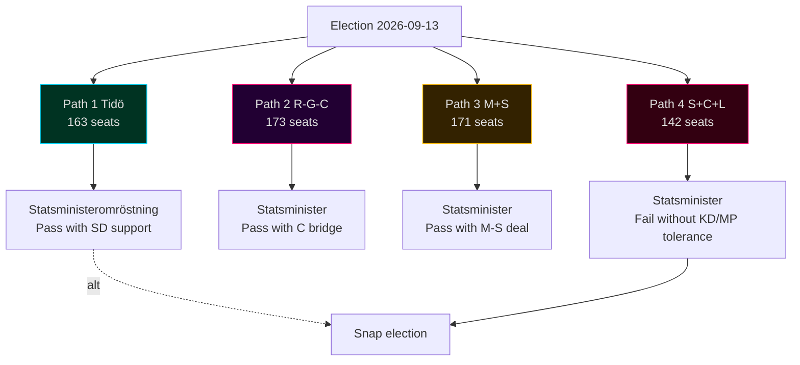

# Coalition Mathematics — 4 Paths and 175-Seat Majority Test

## Framework

Riksdag majority = 175 seats. Tolerated talman-tolerant minority = ≥ 156 seats (passive tolerance). Statsministeromröstning requires not-against-majority (i.e., ≥ 175 abstain+for); fails after 4 attempts → snap election.

## Coalition Paths (Central-Case Seat Model)

### Path 1 — Tidö Continuation
- M+KD+L+SD = 65 + 19 + 13 + 66 = **163 seats**.
- **Gap to 175**: -12 seats.
- **Viability**: requires (a) L survival above 4% threshold; (b) additional 12 seats from polling upside; (c) statsminister vote tolerated by minor parties or sub-threshold absentees.
- Path 1 viability: roughly even (40–55%) [horizon:election].

### Path 2 — Red-Green-C
- S+V+MP+C = 106 + 28 + 16 + 23 = **173 seats**.
- **Gap to 175**: -2 seats (statsministeromröstning tolerated if 2 other MPs abstain).
- **Viability**: requires C to bridge to S (historic break from 2018–2022 Jan-avtal pattern); V demands acceptable to S.
- Path 2 viability: roughly even (40–55%) [horizon:election].

### Path 3 — Grand Coalition (M+S)
- M+S = 65 + 106 = **171 seats**.
- **Gap to 175**: -4 seats (tolerated minority easily).
- **Viability**: requires elite-level break from bloc politics; precedent-free in modern Sweden.
- Path 3 viability: unlikely (20–40%) [horizon:election].

### Path 4 — Centrist Bridge (S+C+L) — if L survives
- S+C+L = 106 + 23 + 13 = **142 seats**.
- **Gap to 175**: -33 seats (requires KD or MP tolerance).
- **Viability**: requires technocratic centre coalition; depends on Tidöavtalet successor agreement.
- Path 4 viability: unlikely (20–40%) [horizon:election].

## 175-Seat Threshold Test Matrix

## Sensitivity to L-Below-Threshold

If L falls below 4%, its 13 seats redistribute (mostly to M and to "other"). Updated paths:
- **Path 1 (Tidö without L)**: M+KD+SD = 67 + 19 + 67 = **153 seats** — gap -22 seats. Path 1 viability drops to **unlikely (20–40%)**.
- **Path 2 (R-G-C)**: 106 + 28 + 17 + 23 = **174 seats** — gap -1 seat. Path 2 viability rises to **likely (55–70%)**.

**L survival is the single most determinative variable for coalition outcome.**

## Sensitivity to C Bloc-Switching

If C breaks from R-G-C alliance and bridges to Tidö:
- **Path 1 + C**: 163 + 23 = **186 seats** — Tidö+C majority.
- **Path 2 - C**: 173 - 23 = **150 seats** — R-G non-viable.

C's bloc position is the **second most determinative variable**.

## Statsministeromröstning Pathways

1. **Talman proposes** based on consultations with party leaders post-election.
2. **Vote 1**: not-against-majority required (i.e., ≥ 175 not voting against).
3. **Fail → vote 2** (within 14 days); same threshold.
4. **4 failures → snap election** (within 90 days).

In the central case, **Vote 1 likely fails for both Tidö and R-G-C** without explicit cross-bloc tolerance. Iteration is expected.

## Coalition-Path Probability Reconciliation with `scenario-analysis.md`

| Scenario | Coalition Path | Joint Probability |
|----------|---------------|------------------:|
| A — Tidö Continuation 32% | Path 1 | 32% |
| B — S-Bloc Victory 38% | Path 2 (B1+B2+B3) | 38% |
| C — Rainbow / Cross-Bloc 18% | Path 3 or Path 4 | 18% |
| D — Hung / Minority 12% | Caretaker → re-vote | 12% |

## Sources

- Valmyndighet seat-allocation rules (Sainte-Laguë + utjämningsmandat) [A1]
- Riksdagsutredningen on statsministeromröstning procedure [A1]
- Q1-2026 polling baseline [B2]
- Historical statsministeromröstning records (2014, 2018, 2021, 2022) [A1]

---

_Pass-2 refresh 2026-05-11 — content carried from 2026-05-10 baseline; no material change. See [`synthesis-summary.md`](synthesis-summary.md) §2026-05-11 Daily Refresh for the cross-cutting daily delta._
